# Go 语言微信 SDK 深度解析：从上手到踩坑，看透架构设计的根本矛盾

> 每一个用 Go 做微信开发的工程师，都经历过这样的时刻：access_token 莫名其妙过期、回调消息解密总是签名失败、支付接口 v2 和 v3 签名方式南辕北辙……你以为是自己代码写错了，其实这背后是一个更深层的问题——微信的 API 生态本身就是一个巨大的"历史包袱"，而 Go 微信 SDK 的设计，本质上是在和这个历史包袱做博弈。本文从零讲起，不只是教你"怎么用"，更要让你看透"为什么难用"。

---

## 一、微信开发的疆域：远比你想象的复杂

### 1.1 微信不是一个平台，是六个平台

很多开发者以为"微信开发"就是"公众号开发"。这是巨大的误解。微信的开发者生态实际上包含六大产品线，每个产品线有独立的接入方式、独立的 API 体系、独立的文档站点：

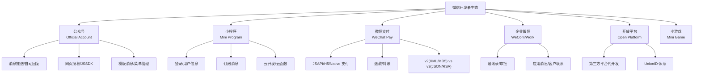

**根本矛盾之一：产品线割裂。**

这六个产品线不是统一设计的，而是不同团队在不同时期独立开发的。后果是：

- 同一个概念在不同产品线里有不同的名字（如公众号叫"openid"，企业微信叫"userid"）。
- 相似功能的 API 风格完全不同（公众号用 XML，支付 v2 用 XML，支付 v3 用 JSON）。
- 同一个用户在不同产品线有不同 ID，需要 UnionID 桥接。
- 签名算法、加密方式、证书体系各不相同。

**这对 SDK 设计意味着什么？** 一个"全覆盖"的微信 SDK，本质上是在六个风格迥异的 API 体系上做统一抽象——这从根上决定了其复杂度。

### 1.2 微信 API 的历史包袱

微信 API 不是一天建成的，而是经历了十余年的演进。这个演进过程留下了沉重的技术债：

| 时期 | 代表性 API | 数据格式 | 签名方式 | 认证方式 |
|------|-----------|---------|---------|---------|
| 早期（2013-2016） | 公众号消息、支付 v2 | XML | MD5/HMAC-SHA256 | API 密钥 |
| 中期（2017-2020） | 小程序、开放平台 | JSON | SHA1 | access_token |
| 近期（2020-至今） | 支付 v3、企业微信 | JSON | RSA-SHA256 | 平台证书 |

**根本矛盾之二：API 风格不统一。**

同样是微信支付，v2 接口用 XML + MD5 签名，v3 接口用 JSON + RSA 签名 + 平台证书验证。两套体系至今共存，某些功能只有 v2 有，某些只有 v3 有。SDK 必须同时支持两套——这不是设计选择，是被迫妥协。

---

## 二、Go 微信 SDK 生态全景

### 2.1 主流 SDK 横向对比

Go 生态中，微信 SDK 呈现"一超多强"的格局：

| SDK | GitHub Star | 覆盖范围 | 定位 | Token 管理 |
|-----|------------|---------|------|-----------|
| **silenceper/wechat** | 4.6k | 公众号/小程序/支付/开放平台/企业微信 | 简单易用，最流行 | 可插拔 Cache 接口 |
| **PowerWeChat** | 1.2k | 公众号/小程序/支付v2+v3/企业微信/开放平台 | 企业级，覆盖最全 | 内置 Redis/内存 |
| **chanxuehong/wechat** | 1.4k | 公众号/小程序/支付 | 早期项目，类型严格 | 内存缓存 |
| **openwechat** | 4.1k | 个人号（网页版协议） | 自动化/机器人 | 网页登录 Session |

**一个关键区分**：`openwechat` 基于微信网页版协议，模拟浏览器行为控制个人微信，属于"非官方"路径，有封号风险。其他三个基于微信官方开发者 API，是合规路径。

### 2.2 silenceper/wechat：最流行的选择

`silenceper/wechat` 是 Go 生态中使用最广泛的微信 SDK，它的设计哲学是"简单易用"：

```go
import "github.com/silenceper/wechat/v2"

// 初始化
wc := wechat.NewWechat(&wechat.Config{
    AppID:     "your-app-id",
    AppSecret: "your-app-secret",
    Cache:     cache.NewMemory(),  // 可替换为 Redis
})

// 使用公众号模块
oa := wc.GetOfficialAccount()
menu := oa.GetMenu()
menu.Create(&menu.Menu{
    Buttons: []menu.Button{
        {Name: "菜单1", Type: "click", Key: "V1001"},
    },
})
```

**架构特点**：

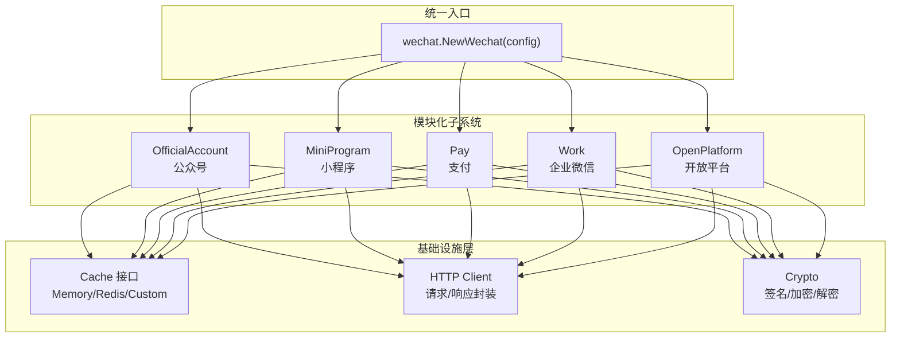

**优点**：上手快、模块化清晰、Cache 可插拔、文档相对完善。

**缺点**：部分 API 覆盖不全、错误处理不够精细、类型安全有限（大量 `map[string]interface{}` 返回值）。

### 2.3 PowerWeChat：企业级全覆盖

`PowerWeChat` 的定位更偏向企业级场景，特点是覆盖面最广，尤其是对支付 v3 的支持最为完善：

```go
import "github.com/ArtisanCloud/PowerWeChat/v3/src/miniProgram"

app, _ := miniProgram.NewMiniProgram(&miniProgram.UserConfig{
    AppID:  "your-app-id",
    Secret: "your-app-secret",
    Http:   &miniProgram.HttpConfig{Timeout: 30.0},
    Cache:  cache.NewRedis(redisClient),
})
```

**与 silenceper 的关键区别**：

| 维度 | silenceper/wechat | PowerWeChat |
|------|-------------------|-------------|
| 支付 v3 | 有限支持 | 完整支持 |
| 返回值类型 | `map[string]interface{}` 为主 | 强类型结构体 |
| 代码生成 | 手工维护 | 部分自动生成 |
| 依赖 | 较轻 | 较重（gin 等） |
| 文档 | 中文 README + Godoc | 独立教程仓库 |

---

## 三、Access Token：微信开发的第一道鬼门关

### 3.1 Token 的规则

微信的 access_token 是调用几乎所有 API 的通行证。它的规则看似简单，实则暗藏杀机：

- 有效期 **2 小时**（7200 秒）。
- 每天获取次数 **上限 2000 次**（公众号）/ **不限但要缓存**（小程序）。
- 同一 AppID 下，**获取新 token 会使旧 token 立即失效**（这是最关键的规则）。
- 必须全局共享，不能每个服务实例独立获取。

### 3.2 "获取新 token 使旧 token 失效"——一切问题的根源

这条规则是 access_token 管理中绝大多数 bug 的根本原因。让我们推演一个场景：

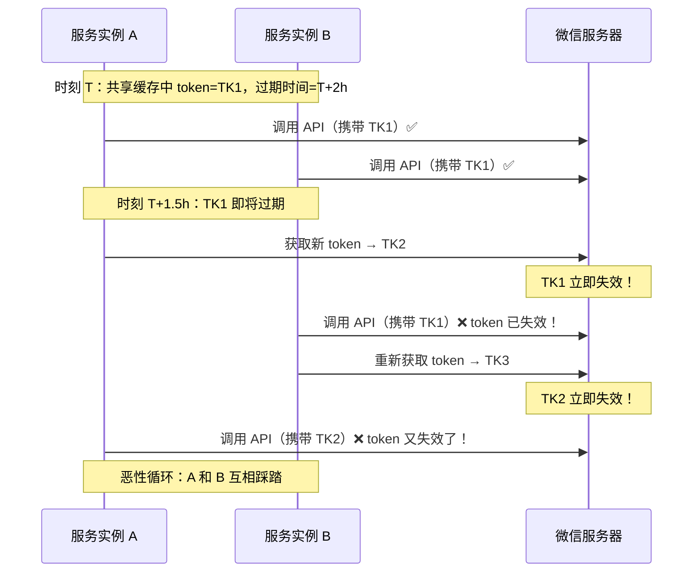

**根本原因**：这不是并发 bug，不是缓存一致性问题，而是 **微信协议设计的单点限制**——同一 AppID 在任何时刻只能有一个有效 token。在分布式环境下，这个限制与多实例并发获取 token 的需求直接冲突。

### 3.3 各 SDK 的 Token 管理策略对比

**策略一：内存缓存 + 提前刷新**

```go
// silenceper/wechat 的默认策略
type MemoryCache struct {
    m    sync.RWMutex
    data map[string]*cacheItem
}

func (m *MemoryCache) Get(key string) interface{} {
    m.m.RLock()
    defer m.m.RUnlock()
    item, ok := m.data[key]
    if !ok || time.Now().After(item.expireAt) {
        return nil  // 过期返回 nil，触发重新获取
    }
    return item.value
}
```

**问题**：每个服务实例有独立的内存缓存，无法跨实例共享。多实例部署时必定踩踏。

**策略二：Redis 共享缓存 + 提前过期**

```go
// 使用 Redis 作为后端
func (r *RedisCache) Get(key string) interface{} {
    val, err := r.client.Get(key).Result()
    if err == redis.Nil {
        return nil  // 缓存未命中
    }
    return val
}

func (r *RedisCache) Set(key string, val interface{}, timeout time.Duration) {
    // 提前 5 分钟过期，留出刷新窗口
    adjustedTimeout := timeout - 5*time.Minute
    r.client.Set(key, val, adjustedTimeout)
}
```

**优点**：多实例共享同一份 token，避免了踩踏问题。

**剩余风险**：Redis 缓存过期的瞬间，如果多个实例同时发现缓存失效并发获取 token，仍可能踩踏。需要分布式锁保护。

**策略三：分布式锁 + 单点刷新**

```go
func (m *TokenManager) GetToken(ctx context.Context) (string, error) {
    // 1. 先读缓存
    if token := m.cache.Get("access_token"); token != nil {
        return token.(string), nil
    }

    // 2. 获取分布式锁
    mutex := m.redSync.NewMutex("access_token_lock")
    if err := mutex.Lock(); err != nil {
        return "", err
    }
    defer mutex.Unlock()

    // 3. 双重检查：拿到锁后再看一次缓存（可能其他实例已刷新）
    if token := m.cache.Get("access_token"); token != nil {
        return token.(string), nil
    }

    // 4. 确实需要刷新
    token, err := m.fetchFromWeChat(ctx)
    if err != nil {
        return "", err
    }

    // 5. 写入缓存，设置较短的过期时间（如 7000s，而非 7200s）
    m.cache.Set("access_token", token, 7000*time.Second)
    return token, nil
}
```

**这是生产环境唯一可靠的方案**。但目前的 SDK 中没有内置分布式锁——开发者需要自己实现这一层。

### 3.4 Token 管理的根本矛盾

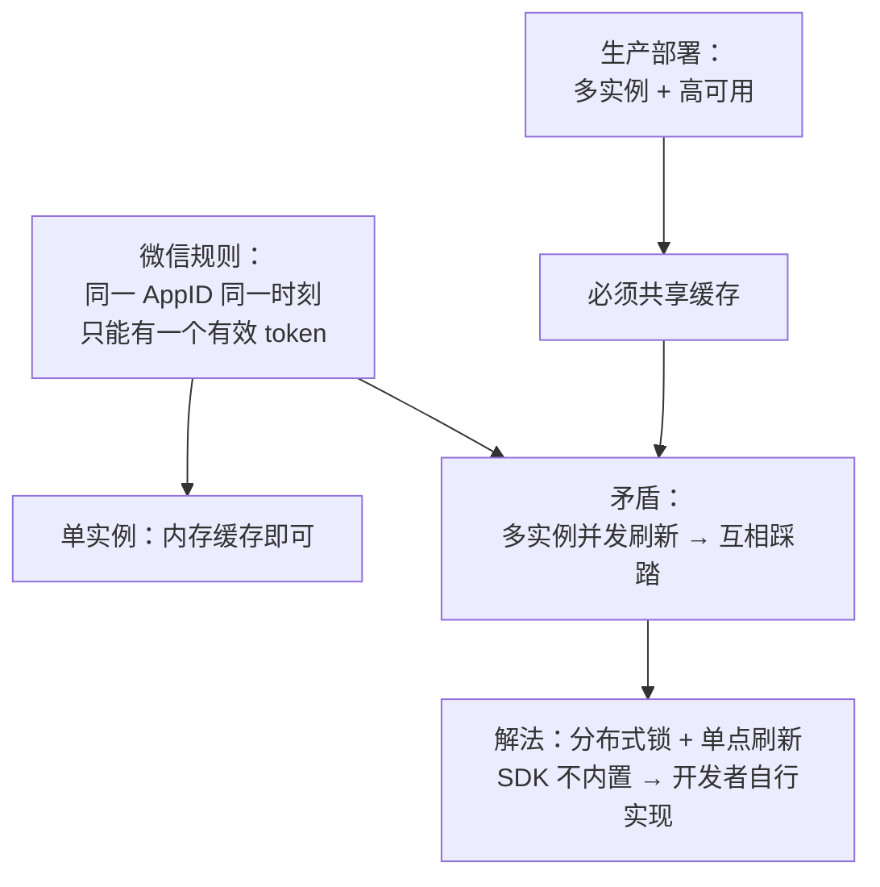

**为什么 SDK 不内置分布式锁？** 因为分布式锁依赖具体的基础设施（Redis/etcd/ZooKeeper），引入任何一个都会增加 SDK 的依赖和复杂度。这本质上是 SDK 的"通用性"和"生产就绪"之间的取舍——大多数 SDK 选择了通用性，将分布式锁留给使用者。

**这个取舍是否合理？** 见仁见智。但从结果看，大量开发者在生产环境中因为 token 踩踏而踩坑，说明 SDK 至少应该在文档中明确警示，并提供推荐的集成方案。

---

## 四、回调消息处理：加解密的暗坑

### 4.1 公众号消息的加解密流程

当公众号开启"安全模式"后，微信推送的消息是加密的，回复也需要加密。加解密流程如下：

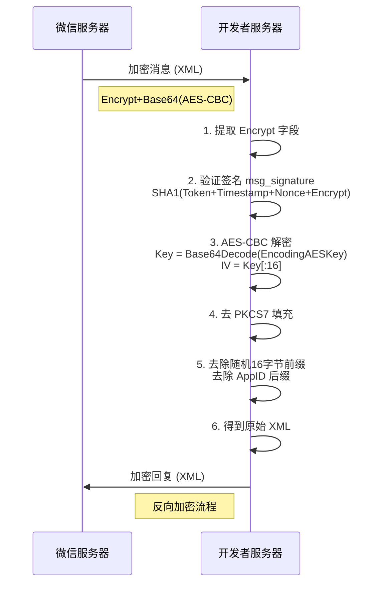

### 4.2 为什么 AES 解密总是失败？

这是微信开发中最常见的报错之一。根本原因是微信使用的 AES 加密方式极其特殊：

**1. 非标准 AES Key 生成方式**

```
EncodingAESKey = "abcdefghijklmnopqrstuvwxyz0123456789ABCDEFG"  // 43 个字符
AES Key = Base64Decode(EncodingAESKey + "=")  // 补 = 后 Base64 解码，得到 32 字节
AES IV  = AES Key[:16]  // IV 是 Key 的前 16 字节
```

这个"43 字符 Base64"的编码方式在密码学中极为罕见，几乎只有微信在用。Go 标准库没有对应实现，必须手工处理。

**2. 消息体结构极其特殊**

```
加密后 = Base64(AES-CBC-Encrypt(
    random(16字节) + msgLen(4字节大端) + msg + AppID
))
```

加密前的明文不是纯消息，而是 `随机前缀 + 消息长度 + 消息内容 + AppID`。解密后需要正确去除这三个附加部分——很多开发者在处理"消息长度"的大端序读取时出错。

**3. PKCS7 填充的块大小不是 8 也不是 16**

标准 PKCS7 填充的块大小通常是 16（AES 块大小），但微信的文档在某些地方提到的填充块大小是 32。如果用了标准库的 PKCS7 去填充（默认块大小 16），可能无法正确去除填充字节。

### 4.3 SDK 中的加解密实现

以 `silenceper/wechat` 为例，其加解密核心代码：

```go
// Decrypt 消息解密
func (c *Cipher) Decrypt(encryptedMsg string) (plainText string, err error) {
    // 1. Base64 解码
    cipherText, err := base64.StdEncoding.DecodeString(encryptedMsg)

    // 2. AES-CBC 解密
    block, _ := aes.NewCipher(c.aesKey)
    mode := cipher.NewCBCDecrypter(block, c.aesKey[:16])
    mode.CryptBlocks(cipherText, cipherText)

    // 3. 去 PKCS7 填充
    cipherText = pkcs7Unpad(cipherText, 32)  // 注意：块大小 32，不是 16！

    // 4. 解析消息体：16字节随机串 + 4字节消息长度 + 消息 + AppID
    msgLen := int(binary.BigEndian.Uint32(cipherText[16:20]))
    plainText = string(cipherText[20 : 20+msgLen])

    return plainText, nil
}
```

**根本矛盾之三：微信的非标准加密方案。**

微信没有选择业界标准的加密消息格式（如 JWE），而是设计了一套自有的加解密方案。这套方案在密码学上没有问题，但其特殊性导致：

1. 标准密码学库无法直接使用，必须定制化实现。
2. 文档描述不够精确，开发者在边界条件上反复踩坑。
3. 任何语言的 SDK 都需要为这套非标准方案写大量胶水代码。

---

## 五、微信支付：v2 与 v3 的撕裂

### 5.1 为什么要同时支持两套 API？

微信支付是目前微信生态中最割裂的部分。v2 和 v3 共存的原因是历史性的：

| 维度 | v2 | v3 |
|------|----|----|
| 数据格式 | XML | JSON |
| 签名算法 | MD5 / HMAC-SHA256 | RSA-SHA256 |
| 证书使用 | 仅退款等场景 | 所有场景（双向 TLS） |
| 密钥管理 | API 密钥（字符串） | 平台证书 + 商户私钥 |
| 敏感信息 | 明文传输 | 加密传输 |
| 回调验证 | 签名校验 | 证书签名验证 |
| 安全等级 | 较低 | 较高 |

**关键现实**：某些接口只有 v2 版本（如部分红包接口），某些只有 v3 版本（如合单支付）。SDK 必须同时支持两套，开发者也需要同时使用两套。

### 5.2 v2 签名：MD5/HMAC 的"字典序拼接"

v2 的签名方式是微信早期 API 的典型代表——将参数按字典序拼接后做摘要：

```go
// v2 签名生成
func SignV2(params map[string]string, apiKey string) string {
    // 1. 过滤空值和 sign 字段
    // 2. 按 key 字典序排序
    keys := make([]string, 0, len(params))
    for k := range params {
        if k != "sign" && params[k] != "" {
            keys = append(keys, k)
        }
    }
    sort.Strings(keys)

    // 3. 拼接为 key=value&key=value 格式
    var buf strings.Builder
    for i, k := range keys {
        if i > 0 { buf.WriteByte('&') }
        buf.WriteString(k + "=" + params[k])
    }
    buf.WriteString("&key=" + apiKey)

    // 4. MD5 或 HMAC-SHA256
    return strings.ToUpper(md5sum(buf.String()))
}
```

**问题**：

1. 字典序在不同语言/编码下可能不一致。
2. 参数类型全部是 string，缺乏类型安全。
3. MD5 已不被推荐用于安全场景。
4. XML 序列化/反序列化繁琐且易出错。

### 5.3 v3 签名：RSA + 证书体系

v3 采用了现代密码学方案，但也带来了更高的复杂度：

```go
// v3 签名生成
func SignV3(method, url, timestamp, nonce, body string, privateKey *rsa.PrivateKey) string {
    // 1. 构造签名串
    message := fmt.Sprintf("%s\n%s\n%s\n%s\n%s\n",
        method, url, timestamp, nonce, body)

    // 2. RSA-SHA256 签名
    hashed := sha256.Sum256([]byte(message))
    signature, _ := rsa.SignPKCS1v256(rand.Reader, privateKey, crypto.SHA256, hashed[:])

    // 3. Base64 编码
    return base64.StdEncoding.EncodeToString(signature)
}
```

**v3 还需要验证微信平台证书的签名**：

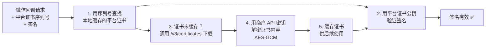

**v3 的证书管理是另一个隐藏的复杂度**：平台证书需要下载、解密、缓存、定期更新。如果证书更新了但本地缓存没有刷新，签名验证就会失败。SDK 需要处理证书的完整生命周期。

### 5.4 SDK 如何兼容 v2 和 v3？

这是一个架构设计上的艰难抉择：

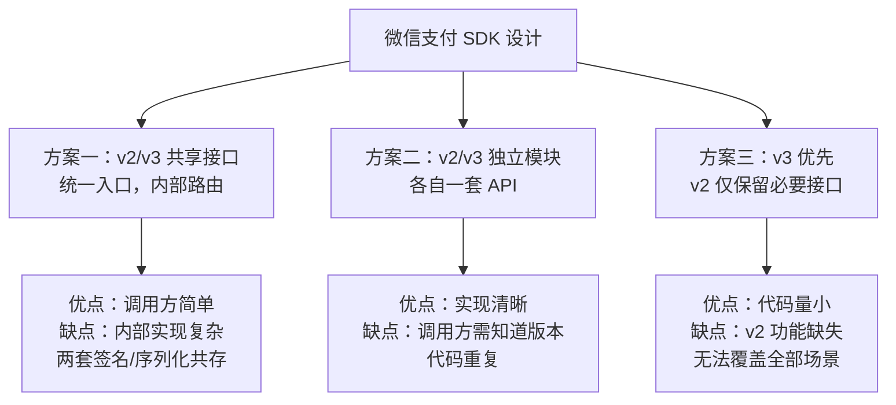

**silenceper/wechat 选择了方案二**：`pay` 模块下分 `v2` 和 `v3` 两个子包，各自独立。

**PowerWeChat 也选择了方案二**：但 v3 覆盖更全，v2 仅保留必要功能。

**这是合理的，因为 v2 和 v3 的差异不是"同一接口的两个版本"，而是两套完全不同的技术体系**——数据格式、签名方式、证书体系、错误码都不相同，强行统一反而会造成更多混乱。

### 5.5 根本矛盾之四：API 版本不是升级，而是重构

正常的 API 版本演进是增量式的——v2 是 v1 的超集，v3 是 v2 的超集。但微信支付 v3 不是 v2 的超集，而是一套全新的体系：

- 数据格式从 XML 变成 JSON
- 签名算法从 MD5 变成 RSA
- 认证方式从 API 密钥变成平台证书
- 敏感数据从明文变成加密

这不是"升级"，而是"推倒重来"。但因为 v2 的部分接口从未迁移到 v3，两者被迫长期共存。SDK 的设计者必须在"统一抽象"和"忠实映射"之间做选择——无论怎么选都有代价。

---

## 六、回调与消息路由：SDK 架构的核心考验

### 6.1 微信回调的多样性

微信的回调通知涵盖多种场景，每种都有不同的处理逻辑：

| 回调类型 | 触发场景 | 数据格式 | 验证方式 |
|---------|---------|---------|---------|
| 公众号消息 | 用户发送消息 | XML（明文/加密） | 签名验证 |
| 公众号事件 | 关注/扫码/菜单点击 | XML | 签名验证 |
| 小程序消息 | 客服消息 | JSON | Token 校验 |
| 支付通知 v2 | 支付成功 | XML | MD5 签名 |
| 支付通知 v3 | 支付成功 | JSON | RSA 签名 + 证书 |
| 开放平台授权 | 授权变更 | XML | 加密+签名 |

**根本矛盾之五：回调格式的混乱。**

即使是同一产品线内，不同场景的回调格式也不统一。公众号用 XML，小程序用 JSON，支付 v2 用 XML，支付 v3 用 JSON。SDK 的回调处理模块必须适配所有这些格式。

### 6.2 silenceper/wechat 的消息路由设计

`silenceper/wechat` 在公众号模块中提供了一个优雅的消息路由机制：

```go
oa := wc.GetOfficialAccount()
server := oa.GetServer()

// 注册消息处理器
server.SetMessageHandler(func(msg *message.MixMessage) *message.Reply {
    switch msg.MsgType {
    case message.MsgTypeText:
        return &message.Reply{
            MsgType: message.MsgTypeText,
            MsgData: message.NewText("收到：" + msg.Content),
        }
    case message.MsgTypeEvent:
        switch msg.Event {
        case message.EventSubscribe:
            return &message.Reply{
                MsgType: message.MsgTypeText,
                MsgData: message.NewText("欢迎关注！"),
            }
        }
    }
    return nil  // 不回复
})

// 在 HTTP Handler 中使用
http.HandleFunc("/wechat", func(w http.ResponseWriter, r *http.Request) {
    server.ServeHTTP(w, r)
})
```

这个设计的核心是 **将消息解析、签名验证、加解密等底层细节封装在 Server 对象中，开发者只需关注业务逻辑**：

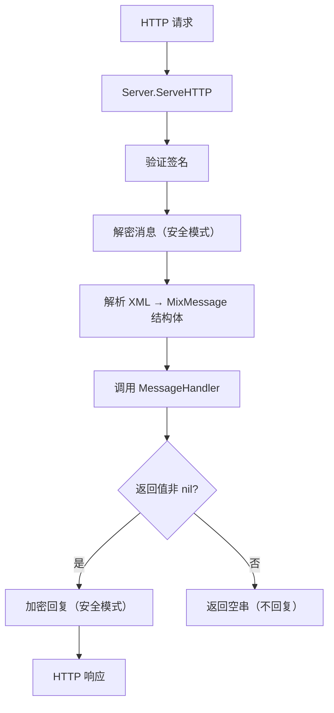

**优点**：开发者只需写一个函数，不需要关心 XML 解析、签名验证、加解密等细节。

**缺点**：MixMessage 结构体是一个"万能"结构，包含所有可能的消息类型字段——大多数字段在特定场景下是空的。这缺乏类型安全，容易写出 `msg.Event` 在文本消息中误用的 bug。

### 6.3 更好的设计：类型驱动的消息路由

一个更安全的做法是按消息类型分发：

```go
server.SetMessageHandler(func(ctx *message.Context) error {
    switch msg := ctx.Message.(type) {
    case *message.TextMessage:
        ctx.Reply(message.NewText("收到：" + msg.Content))
    case *message.ImageMessage:
        ctx.Reply(message.NewText("收到图片：" + msg.PicURL))
    case *message.SubscribeEvent:
        ctx.Reply(message.NewText("欢迎关注！"))
    }
    return nil
})
```

这利用了 Go 的类型断言/类型 switch，在编译期就能捕获类型错误。但这需要 SDK 在内部做消息类型分发——silenceper/wechat 目前没有采用这种设计。

---

## 七、错误处理：被低估的难点

### 7.1 微信 API 的错误格式不一致

微信 API 的错误响应格式在不同产品线中不一致：

```json
// 公众号/小程序的错误格式
{
    "errcode": 40001,
    "errmsg": "invalid credential"
}

// 支付 v3 的错误格式
{
    "code": "PARAM_ERROR",
    "message": "参数错误",
    "detail": "..."
}

// 开放平台的错误格式
{
    "errcode": 61004,
    "errmsg": "access_token expired"
}
```

**根本矛盾之六：错误模型的碎片化。**

公众号用 `errcode` 数字 + `errmsg` 字符串；支付 v3 用 `code` 字符串 + `message` 字符串；两者的错误码体系完全独立，无法统一映射。

### 7.2 SDK 的错误处理困境

这导致 SDK 无法定义一个统一的错误类型：

```go
// 无法统一：两种错误结构
type OAError struct {
    ErrCode int    `json:"errcode"`
    ErrMsg  string `json:"errmsg"`
}

type PayV3Error struct {
    Code    string `json:"code"`
    Message string `json:"message"`
    Detail  string `json:"detail"`
}
```

**silenceper/wechat 的做法**：在各模块内部分别处理，没有统一的错误类型。公众号 API 返回 `error` 时包装了 errcode；支付 API 另有一套。

**更好的做法**：定义一个基础错误接口，各模块扩展：

```go
type WeChatError interface {
    error
    IsWeChatError() bool
    ErrCode() string   // 统一返回字符串
    ErrMsg() string
}

// 公众号错误实现
type OfficialAccountError struct {
    Code int    `json:"errcode"`
    Msg  string `json:"errmsg"`
}

func (e *OfficialAccountError) ErrCode() string {
    return strconv.Itoa(e.Code)
}
```

这样上层代码可以统一处理 `WeChatError`，不需要关心底层是公众号错误还是支付错误。

### 7.3 errcode 的重试策略

微信 API 返回的某些 errcode 是可重试的（如 40001 token 过期、45009 频率限制），某些不可重试（如 40007 无效媒体 ID）。SDK 应该内置重试逻辑：

```go
var retryableErrcodes = map[int]bool{
    40001: true,  // token 过期 → 刷新 token 后重试
    42001: true,  // token 过期
    45009: true,  // 接口频率限制 → 等待后重试
    48001: true,  // API 未授权 → 可能刚获得权限
}

func (c *Client) doWithRetry(req *Request, maxRetries int) (*Response, error) {
    for i := 0; i <= maxRetries; i++ {
        resp, err := c.do(req)
        if err == nil { return resp, nil }

        var weErr *WeChatError
        if errors.As(err, &weErr) && retryableErrcodes[weErr.Code()] {
            if weErr.Code() == "40001" || weErr.Code() == "42001" {
                c.refreshToken()  // token 过期，刷新后重试
                continue
            }
            time.Sleep(time.Duration(i+1) * time.Second)  // 退避
            continue
        }
        return nil, err  // 不可重试的错误
    }
    return nil, fmt.Errorf("max retries exceeded")
}
```

**silenceper/wechat 在部分模块中内置了 token 过期自动重试**，但不是全局行为。PowerWeChat 也有类似机制。但退避策略、最大重试次数等参数往往硬编码，不够灵活。

---

## 八、HTTP 客户端：被忽视的基础设施

### 8.1 Go 默认 HTTP Client 的问题

Go 的 `http.DefaultClient` 没有超时设置，在调用微信 API 时可能导致 Goroutine 永久阻塞。大多数 SDK 都建议使用自定义 Client：

```go
client := &http.Client{
    Timeout: 10 * time.Second,
    Transport: &http.Transport{
        MaxIdleConns:        100,
        MaxIdleConnsPerHost: 10,
        IdleConnTimeout:     90 * time.Second,
    },
}
```

### 8.2 连接池与并发

在高并发场景下，HTTP 连接复用至关重要。每次调用微信 API 如果都建立新的 TCP 连接（TCP 握手 + TLS 握手），延迟会增加 100-300ms。正确配置 `Transport` 的连接池参数可以将延迟降到 10-50ms。

### 8.3 SDK 应该允许注入 HTTP Client

生产环境中，开发者可能需要：

- 自定义超时时间
- 注入链路追踪（OpenTelemetry）
- 配置代理
- 注入熔断器（circuit breaker）
- 使用自定义 DNS 解析

因此，SDK 应该允许注入 `*http.Client`：

```go
// 好的设计：允许注入
wc := wechat.NewWechat(&wechat.Config{
    AppID:     "app-id",
    AppSecret: "app-secret",
    Cache:     redisCache,
    Client:    myCustomHTTPClient,  // 允许注入
})

// 不好的设计：内部硬编码
// SDK 内部直接用 http.DefaultClient
```

`silenceper/wechat` 在较新版本中支持了 `HttpClient` 配置。`PowerWeChat` 也支持自定义 HTTP 配置。这是一个逐步演进的过程——早期版本往往忽略了这一点。

---

## 九、开放平台与第三方代开发：复杂度的巅峰

### 9.1 开放平台的角色

微信开放平台是整个微信生态中复杂度最高的部分。它的核心场景是**第三方平台代开发**——SaaS 厂商代替商户管理公众号/小程序。

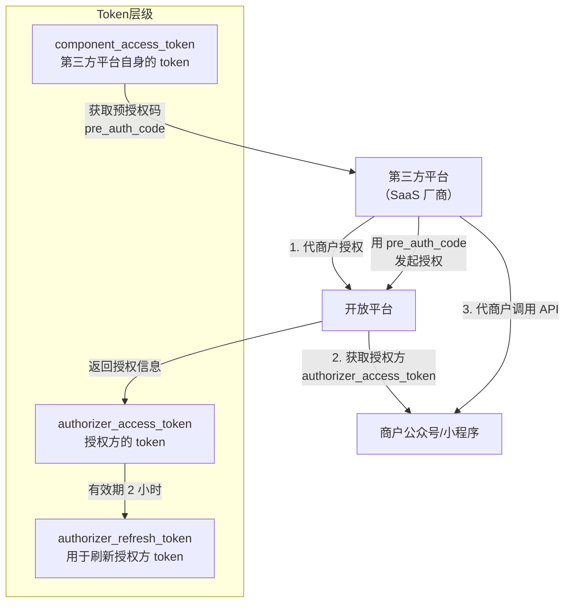

### 9.2 双层 Token 管理

开放平台的 Token 管理比普通场景复杂得多——需要同时管理两层 token：

1. **component_access_token**：第三方平台自身的 token，用于调用开放平台 API。
2. **authorizer_access_token**：每个授权方（每个商户）的 token，用于代替商户调用公众号/小程序 API。

一个服务 1000 个商户的 SaaS 平台，需要同时管理 1001 个 token（1 个 component + 1000 个 authorizer），每个都要独立刷新、独立缓存。

**这对 SDK 的 Cache 接口提出了更高的要求**——不能用简单的 key-value 缓存，而需要支持按授权方区分的命名空间。

### 9.3 全网发布与审核

第三方平台上线前需要通过微信的"全网发布"审核。审核过程中，微信会自动推送测试消息到你的回调接口，验证你的系统能正确处理。这个审核流程本身就是一个黑盒——失败时没有明确的错误信息，只能反复试错。

---

## 十、架构设计反思：Go 微信 SDK 的理想形态

### 10.1 当前 SDK 的共同缺陷

| 缺陷 | 根本原因 | 影响 |
|------|---------|------|
| Token 管理不够健壮 | SDK 追求通用性，不内置分布式锁 | 多实例部署踩踏 |
| 返回值类型不安全 | 微信 API 本身返回松散 JSON | 运行时 panic |
| 错误处理不统一 | 微信 API 错误格式碎片化 | 上层处理冗余 |
| v2/v3 无法统一 | 微信支付两套体系共存 | 开发者心智负担大 |
| 测试困难 | 微信 API 没有官方 mock 服务 | 依赖真实环境调试 |
| 文档滞后 | SDK 更新跟不上微信 API 变更 | 新功能缺失 |

### 10.2 理想的架构分层

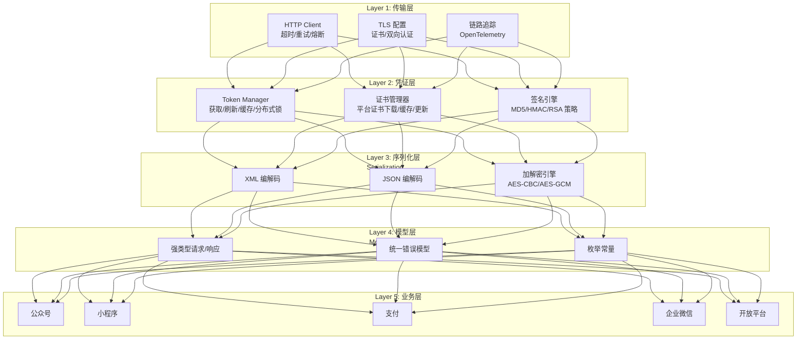

**关键设计原则**：

**1. 凭证层与业务层分离**

Token 管理、证书管理、签名引擎是所有模块共用的基础设施，应该独立于任何业务模块。当前 SDK 的问题是 token 管理逻辑分散在各模块中，导致行为不一致。

**2. 签名引擎可插拔**

v2 的 MD5/HMAC 签名和 v3 的 RSA 签名应该是同一个签名接口的不同实现：

```go
type Signer interface {
    Sign(payload string) (string, error)
    Algorithm() string
}

type MD5Signer struct { apiKey string }
type HMACSigner struct { apiKey string }
type RSASigner struct { privateKey *rsa.PrivateKey, serialNo string }
```

**3. 请求/响应强类型化**

每个 API 应该有明确的请求结构体和响应结构体，而非 `map[string]interface{}`：

```go
// 不好的设计
func (m *Menu) Create(data map[string]interface{}) error

// 好的设计
func (m *Menu) Create(ctx context.Context, req *CreateMenuRequest) (*CreateMenuResponse, error)

type CreateMenuRequest struct {
    Buttons []Button `json:"button"`
}
```

**4. 错误模型统一**

所有模块返回的错误都应该实现统一的 `WeChatError` 接口，同时保留各自模块的详细信息：

```go
type WeChatError interface {
    error
    Code() string
    Message() string
    IsRetryable() bool
}
```

**5. 可测试性**

每个模块都应该提供 mock 接口，方便单元测试：

```go
type MenuService interface {
    Create(ctx context.Context, req *CreateMenuRequest) (*CreateMenuResponse, error)
    Get(ctx context.Context) (*GetMenuResponse, error)
    Delete(ctx context.Context) error
}

// 生产实现
type menuService struct { client *Client }

// 测试 mock
type mockMenuService struct { mock.Mock }
```

### 10.3 为什么现有 SDK 没有做到？

**根本矛盾之七：SDK 的维护模式与微信 API 的演进速度不匹配。**

微信的 API 在持续新增和变更——新的接口、新的参数、新的回调类型几乎每个月都有更新。SDK 维护者面临一个艰难的选择：

- **快速跟随**：优先覆盖新 API，代码质量让步于覆盖度。返回 `map[string]interface{}` 比定义结构体快得多。
- **精工细作**：为每个 API 定义强类型、写测试、做 code review。但微信 API 更新太快，精工细作的 SDK 可能半年就落后了。

大多数 SDK 选择了"快速跟随"，这是务实的选择——开发者更需要"能调通"而非"调得优雅"。但代价是代码质量和技术债的积累。

---

## 十一、实战：构建生产级 Token 管理器

### 11.1 完整实现

以下是一个生产环境可用的 Token 管理器，解决了本章讨论的所有核心问题：

```go
type TokenManager struct {
    appID       string
    appSecret   string
    cache       TokenCache      // 抽象缓存接口
    locker      DistributedLock // 分布式锁接口
    httpClient  *http.Client
    earlyExpire time.Duration   // 提前过期时间
}

type TokenCache interface {
    Get(ctx context.Context, key string) (string, error)
    Set(ctx context.Context, key string, val string, ttl time.Duration) error
}

type DistributedLock interface {
    Lock(ctx context.Context, key string, ttl time.Duration) (Lock, error)
}

func (m *TokenManager) GetToken(ctx context.Context) (string, error) {
    cacheKey := fmt.Sprintf("wechat:token:%s", m.appID)

    // 1. 尝试从缓存获取
    if token, err := m.cache.Get(ctx, cacheKey); err == nil && token != "" {
        return token, nil
    }

    // 2. 获取分布式锁（防止并发刷新）
    lock, err := m.locker.Lock(ctx, cacheKey+":lock", 10*time.Second)
    if err != nil {
        return "", fmt.Errorf("acquire lock: %w", err)
    }
    defer lock.Unlock()

    // 3. 双重检查
    if token, err := m.cache.Get(ctx, cacheKey); err == nil && token != "" {
        return token, nil
    }

    // 4. 请求微信 API
    token, expiresIn, err := m.fetchToken(ctx)
    if err != nil {
        return "", fmt.Errorf("fetch token: %w", err)
    }

    // 5. 写入缓存，提前过期避免边界问题
    adjustedTTL := expiresIn - m.earlyExpire
    if adjustedTTL < 0 {
        adjustedTTL = expiresIn / 2
    }
    if err := m.cache.Set(ctx, cacheKey, token, adjustedTTL); err != nil {
        // 缓存写入失败不影响返回，但需记录日志
        log.Warn("cache set failed", "error", err)
    }

    return token, nil
}
```

### 11.2 关键设计决策

| 决策 | 原因 |
|------|------|
| 抽象缓存接口而非绑定 Redis | 允许不同部署环境使用不同后端 |
| 分布式锁保护刷新 | 防止多实例并发获取 token 互相踩踏 |
| 双重检查模式 | 拿到锁后再检查一次，避免冗余请求 |
| 提前过期 | 避免使用"将过期但未过期"的 token（微信服务器可能有时钟偏移） |
| 锁超时 10 秒 | 防止锁泄漏（进程崩溃时锁自动释放） |

### 11.3 与 SDK 的集成

```go
// 自定义 Cache 适配器，桥接 TokenManager 和 SDK
type sdkCacheAdapter struct {
    tm *TokenManager
}

func (a *sdkCacheAdapter) Get(key string) interface{} {
    token, err := a.tm.GetToken(context.Background())
    if err != nil { return nil }
    return token
}

func (a *sdkCacheAdapter) Set(key string, val interface{}, timeout time.Duration) error {
    // 由 TokenManager 自行管理，此处为 no-op
    return nil
}

// 注入到 SDK
wc := wechat.NewWechat(&wechat.Config{
    AppID:     appID,
    AppSecret: appSecret,
    Cache:     &sdkCacheAdapter{tm: tokenManager},
})
```

---

## 十二、微信开发的测试困境

### 12.1 没有官方 Sandbox

微信没有提供官方的 API sandbox 环境（支付有沙箱，但公众号/小程序没有）。开发者要么：

1. 用真实的 AppID 调用真实接口（有调用次数限制，且有副作用）。
2. 自己搭建 mock 服务。

### 12.2 SDK 的测试策略

一个优秀的 SDK 应该在自身代码中做好测试覆盖：

```go
// 使用 httptest 模拟微信服务器
func TestGetAccessToken(t *testing.T) {
    server := httptest.NewServer(http.HandlerFunc(func(w http.ResponseWriter, r *http.Request) {
        w.WriteHeader(200)
        json.NewEncoder(w).Encode(map[string]interface{}{
            "access_token": "mock_token_123",
            "expires_in":   7200,
        })
    }))
    defer server.Close()

    // 注入 mock server URL
    client := NewClient(WithBaseURL(server.URL))
    token, err := client.GetToken(ctx)
    assert.NoError(t, err)
    assert.Equal(t, "mock_token_123", token)
}
```

### 12.3 集成测试的困难

某些流程（如微信授权登录）需要用户在手机上操作，无法自动化测试。SDK 维护者通常只能手工验证这些流程。

**理想方案**：微信提供官方的 mock API 服务，SDK 维护者可以注册测试 AppID，在隔离环境中完整测试所有流程。但这需要微信团队投入资源建设——从现状看，这个可能性不大。

---

回顾全文，Go 微信 SDK 的所有痛点，可以归结为七重根本矛盾：

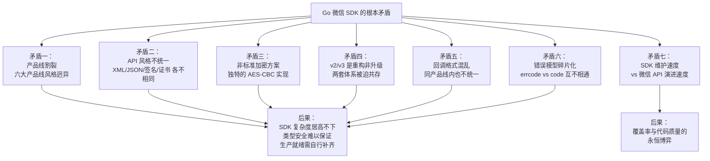

**对开发者的建议**：

1. **Token 管理**：永远不要用内存缓存在生产环境。使用 Redis + 分布式锁 + 提前过期策略。
2. **支付**：新项目直接用 v3。维护项目逐步迁移，v2/v3 共存期间在 SDK 中分模块管理。
3. **回调**：先确保签名验证通过，再处理业务逻辑。签名失败时不要信任任何数据。
4. **错误处理**：封装统一的 `WeChatError` 接口，内置可重试 errcode 列表。
5. **HTTP 客户端**：永远自定义 `http.Client`，设置超时、连接池、链路追踪。
6. **测试**：搭建 mock 服务，不要依赖真实环境做单元测试。
7. **版本选择**：silenceper/wechat 适合中小项目快速上手；PowerWeChat 适合需要支付 v3 全覆盖的企业级场景。

**对 SDK 设计者的建议**：

1. **接口优于实现**：Cache、Lock、HTTP Client 等依赖全部抽象为接口，允许注入。
2. **强类型优于方便**：为每个 API 定义请求/响应结构体，杜绝 `map[string]interface{}`。
3. **错误可编程**：错误类型实现统一接口，支持 `IsRetryable()`、`IsTokenExpired()` 等编程式判断。
4. **文档即代码**：API 覆盖列表、参数说明等从代码注释自动生成，避免文档与代码脱节。
5. **渐进式增强**：核心模块精简稳定，新 API 通过子包扩展，不破坏现有代码。

微信 SDK 的开发，表面是 API 对接，本质是在一个充满历史包袱的生态中寻找"够用的抽象"。理解了这七重矛盾，你就不只是"会用 SDK"，而是能"看穿 SDK"——知道它的边界在哪、坑在哪、为什么这样设计，以及当它不够用时，自己该如何补齐。

---
