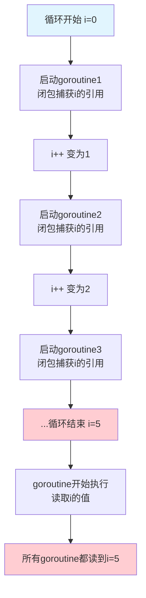
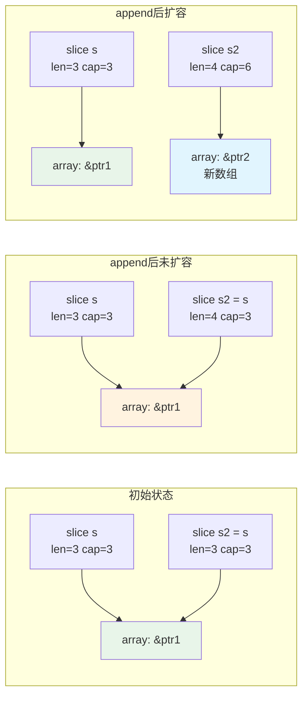
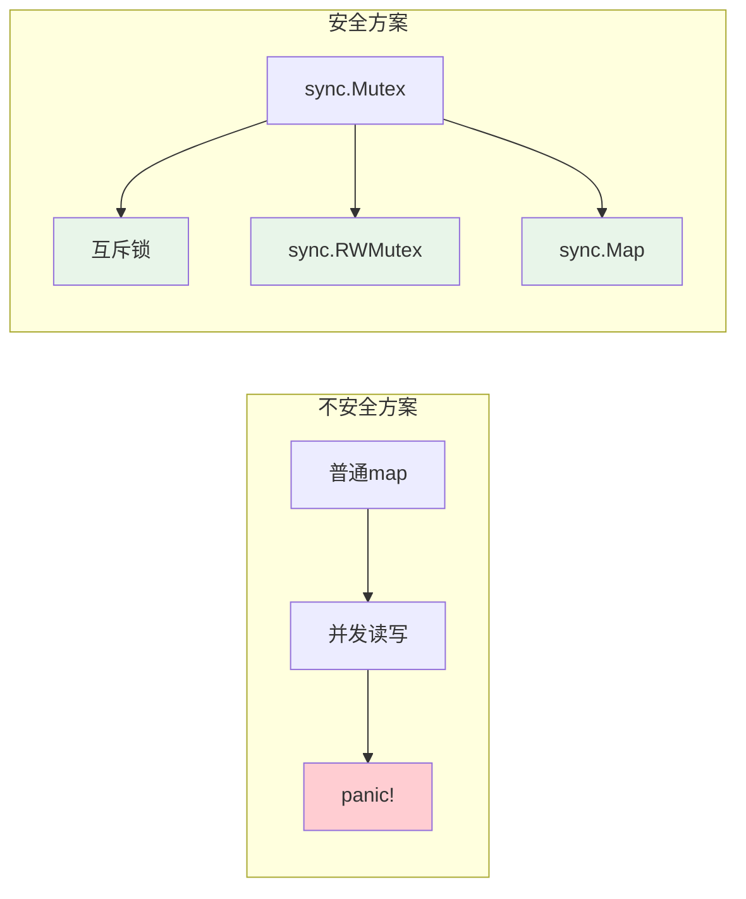
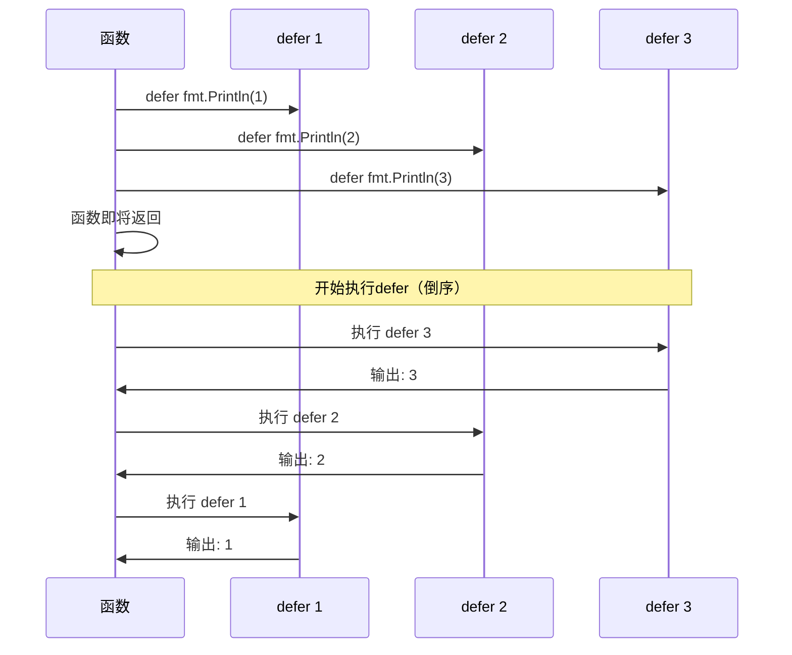
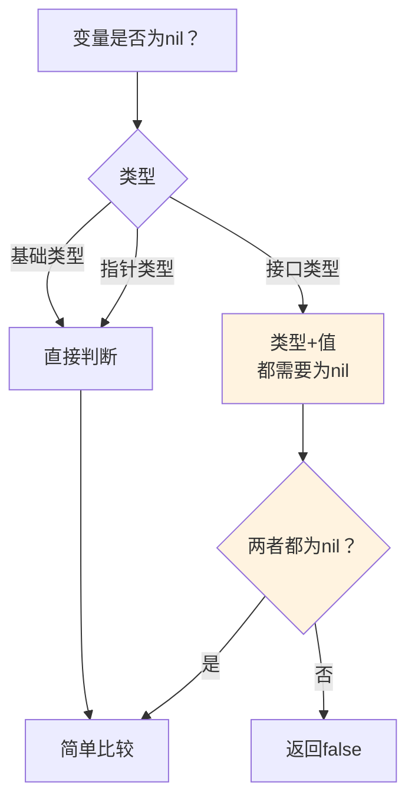
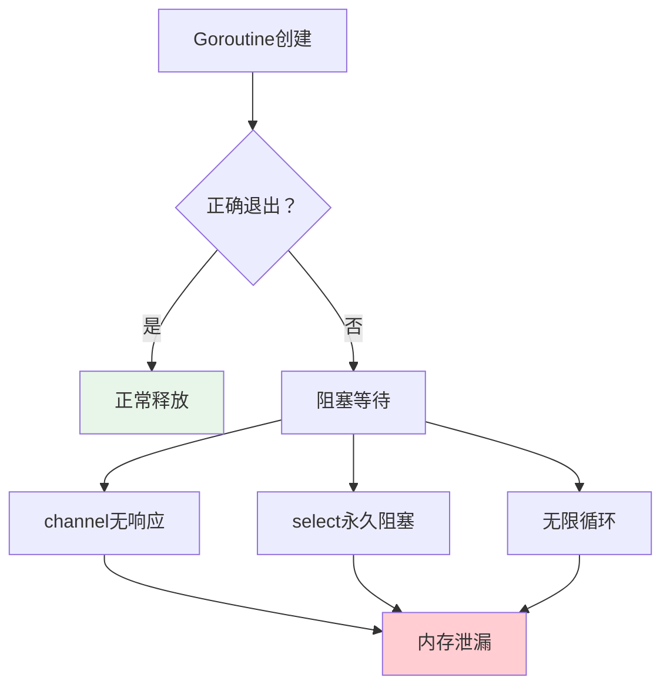
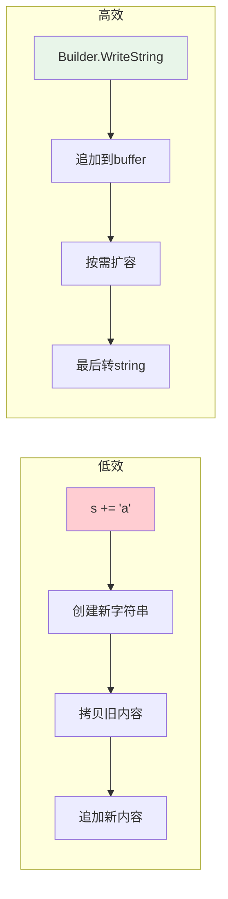
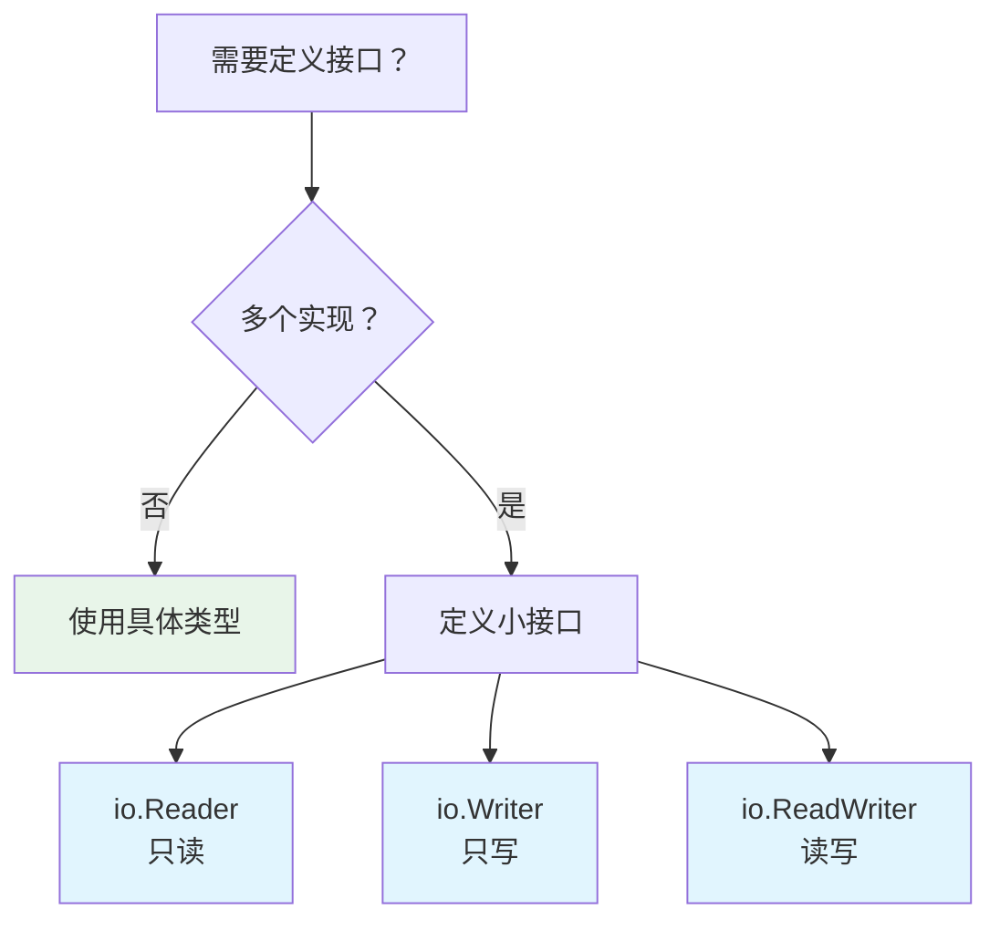

# Go语言新手必看：避开这些坑，你也能写出稳定的Go代码

> 写在前面：Go语言入门简单，但真正用好它并不容易。本文汇总了初学者最容易踩坑的10个问题，配合详细讲解和代码示例，帮助你快速绕过这些"拦路虎"。

---

## 一、为什么Go让人又爱又恨？

Go语言以其简洁、高效、并发支持强大著称，B站、字节跳动、滴滴等国内大厂都在大规模使用。但很多从Java、Python转过来的同学，经常会被Go的一些"骚操作"坑得怀疑人生。

> "Goroutine泄露"——代码跑着跑着内存就爆了  
> "切片append后原变量居然没变"——这还是我认识的值传递吗？  
> "map并发读写直接panic"——怎么不说一声就崩溃了？

别慌，今天我们就来一个个解决这些问题。文章有点长，但全是干货，建议先收藏再看。

---

## 二、初学者第一坑：循环变量闭包陷阱

### 2.1 问题演示

假设你有一个需求：启动5个goroutine，分别打印0到4。你可能会这样写：

```go
func main() {
    for i := 0; i < 5; i++ {
        go func() {
            fmt.Println("goroutine:", i)
        }()
    }
    time.Sleep(time.Second)
}
```

**输出结果是什么？** 大多数情况下，你会看到：

```
goroutine: 5
goroutine: 5
goroutine: 5
goroutine: 5
goroutine: 5
```

**全是5！** 而不是预期的0、1、2、3、4。

### 2.2 为什么会这样？

这是一个经典的闭包问题。Go的for循环中，变量`i`在每次迭代时是**共享的**，而不是独占的。闭包捕获的是变量的**引用**，而非**值**。当goroutine真正执行打印时，循环早已结束，i已经变成了5。

### 2.3 正确的写法

**方法一：传入参数**

```go
for i := 0; i < 5; i++ {
    go func(n int) {
        fmt.Println("goroutine:", n)
    }(i)  // 将i作为参数传入
}
```

**方法二：创建新变量**

```go
for i := 0; i < 5; i++ {
    n := i  // 在循环内创建新变量
    go func() {
        fmt.Println("goroutine:", n)
    }()
}
```

### 2.4 原理图解



---

## 三、初学者第二坑：切片append的"魔法"

### 3.1 问题演示

看这段代码：

```go
func main() {
    s := []int{1, 2, 3}
    s2 := s
    
    s2 = append(s2, 4)
    
    fmt.Println("s:", s)      // 输出什么？
    fmt.Println("s2:", s2)    // 输出什么？
}
```

运行结果：

```
s: [1 2 3]
s2: [1 2 3 4]
```

看起来没问题？再来看这个：

```go
func main() {
    s := []int{1, 2, 3}
    s2 := s
    
    s2 = append(s2, 4)
    s2[0] = 100
    
    fmt.Println("s:", s)      // 现在呢？
    fmt.Println("s2:", s2)
}
```

输出变成：

```
s: [100 2 3]
s2: [100 2 3 4]
```

**s也被修改了！**

### 3.2 为什么会这样？

切片本质上是一个**结构体**，包含三个字段：

```go
type slice struct {
    array unsafe.Pointer  // 指向底层数组的指针
    len   int             // 长度
    cap   int             // 容量
}
```

当你执行`s2 := s`时，只是复制了切片**结构体本身**（3个字段），而不是底层数组。两者指向同一个底层数组。

当`append`没有超出容量时，直接在原数组上操作；一旦超出容量，就会**扩容**——创建新数组，此时s2和s才真正分离。

### 3.3 正确的做法

如果需要独立的切片副本，使用`copy`函数：

```go
s := []int{1, 2, 3}
s2 := make([]int, len(s))
copy(s2, s)  // 真正复制一份

s2 = append(s2, 4)
s2[0] = 100

fmt.Println("s:", s)      // [1 2 3] - 不变！
fmt.Println("s2:", s2)    // [100 2 3 4]
```

### 3.4 切片结构图解



---

## 四、初学者第三坑：map的并发陷阱

### 4.1 问题演示

这是Go最常见的panic原因之一：

```go
func main() {
    m := make(map[string]int)
    
    go func() {
        for {
            m["key"] = 1
        }
    }()
    
    go func() {
        for {
            _ = m["key"]
        }
    }()
    
    time.Sleep(time.Second)
}
```

运行几秒后，程序会直接崩溃：

```
fatal error: concurrent map read and map write
```

### 4.2 Go官方FAQ如是说

Go的map不是并发安全的。官方文档明确说明：

> Maps are not safe for concurrent use: it is not defined what happens when you read and write to them simultaneously.

### 4.3 正确的做法

**方法一：使用sync.Mutex**

```go
type SafeMap struct {
    mu sync.Mutex
    m  map[string]int
}

func (sm *SafeMap) Set(key string, val int) {
    sm.mu.Lock()
    defer sm.mu.Unlock()
    sm.m[key] = val
}

func (sm *SafeMap) Get(key string) int {
    sm.mu.Lock()
    defer sm.mu.Unlock()
    return sm.m[key]
}
```

**方法二：使用sync.RWMutex（读多写少场景）**

```go
type SafeMap struct {
    mu sync.RWMutex
    m  map[string]int
}

func (sm *SafeMap) Get(key string) int {
    sm.mu.RLock()
    defer sm.mu.RUnlock()
    return sm.m[key]
}
```

**方法三：使用Go 1.9之后的sync.Map（适合读多写少）**

```go
var m sync.Map

// 写入
m.Store("key", 1)

// 读取
val, ok := m.Load("key")

// 删除
m.Delete("key")
```

### 4.4 并发安全对比



---

## 五、初学者第四坑：defer的执行时机

### 5.1 问题演示

这段代码会输出什么？

```go
func main() {
    for i := 0; i < 3; i++ {
        defer fmt.Println(i)
    }
}
```

答案是：**2、1、0**（倒序输出）

### 5.2 defer的核心原则

1. **先进后出**：defer语句在函数返回前**倒序**执行
2. **参数预计算**：defer注册时，函数参数就已经确定（值拷贝）

看这个例子：

```go
func main() {
    i := 0
    defer fmt.Println("i =", i)  // 输出 "i = 0"
    i = 100
}
```

### 5.3 defer的常见用法

**资源释放（最常用）**

```go
func readFile(path string) {
    file, err := os.Open(path)
    if err != nil {
        return
    }
    defer file.Close()  // 确保文件被关闭
    
    // 读取文件...
}
```

**恢复panic**

```go
func safeCall(fn func()) {
    defer func() {
        if r := recover(); r != nil {
            fmt.Println("recovered:", r)
        }
    }()
    fn()
}
```

**函数执行时间测量**

```go
func timeConsuming() {
    defer func(start time.Time) {
        fmt.Println("took:", time.Since(start))
    }(time.Now())
    
    // 业务逻辑...
}
```

### 5.4 defer执行流程图



---

## 六、初学者第五坑：nil指针的"陷阱"

### 6.1 问题演示

这段代码会panic吗？

```go
type User struct {
    Name string
}

func main() {
    var u *User  // nil指针
    
    fmt.Println(u == nil)  // true
    
    u.Name = "Tom"  // panic!
}
```

会panic！虽然`u == nil`为true，但直接访问`u.Name`会触发panic。

### 6.2 接口类型的nil陷阱

更隐蔽的是接口类型的nil：

```go
func main() {
    var i interface{} = (*int)(nil)
    
    fmt.Println(i == nil)  // false！
}
```

这是因为接口的nil判断要求**类型和值都为nil**。这里类型是`*int`，值是nil，所以整体不是nil。

### 6.3 正确的nil检查

**方法一：使用reflect**

```go
import "reflect"

func isNil(i interface{}) bool {
    if i == nil {
        return true
    }
    v := reflect.ValueOf(i)
    return v.Kind() == reflect.Ptr && v.IsNil()
}
```

**方法二：类型断言（推荐）**

```go
func process(i interface{}) {
    if v, ok := i.(error); ok {
        fmt.Println("got error:", v)
        return
    }
    // 处理其他情况
}
```

### 6.4 nil判断流程



---

## 七、初学者第六坑：值类型 vs 引用类型

### 7.1 问题演示

```go
func main() {
    // 数组（值类型）
    arr := [3]int{1, 2, 3}
    modifyArray(arr)
    fmt.Println("array:", arr)  // [1 2 3] - 没变！
    
    // 切片（引用类型）
    slice := []int{1, 2, 3}
    modifySlice(slice)
    fmt.Println("slice:", slice)  // [100 2 3] - 变了！
}

func modifyArray(a [3]int) {
    a[0] = 100  // 修改副本
}

func modifySlice(s []int) {
    s[0] = 100  // 修改原数组
}
```

### 7.2 Go中的类型分类

| 类型 | 传递方式 | 特点 |
|------|---------|------|
| 数组 | 值传递 | 复制整个数组 |
| 切片 | 引用传递 | 复制切片头（3个字段） |
| map | 引用传递 | 复制map头 |
| 结构体 | 值传递 | 复制整个结构体 |
| 结构体指针 | 引用传递 | 只复制指针 |

### 7.3 最佳实践

```go
// 如果不确定，传指针最安全
func modifyStruct(s *MyStruct) {
    s.Field = "new value"
}

// 或者显式使用副本
func modifyStructExplicit(s MyStruct) MyStruct {
    s.Field = "new value"
    return s
}
```

---

## 八、初学者第七坑：goroutine泄漏

### 8.1 问题演示

```go
func main() {
    ch := make(chan string)
    
    go func() {
        time.Sleep(time.Second)
        ch <- "done"
    }()
    
    select {
    case msg := <-ch:
        fmt.Println("received:", msg)
    case <-time.After(time.Millisecond * 100):
        fmt.Println("timeout!")
    }
    
    // 这里ch可能还没发送
    // goroutine还在运行，但我们已经退出了
}
```

### 8.2 泄漏的常见原因

1. **channel阻塞**：发送或接收channel，但无人响应
2. **goroutine无限等待**：如上面的超时例子
3. **闭包引用**：goroutine闭包引用了外部变量，导致无法GC

### 8.3 正确的做法

**方法一：使用context**

```go
func main() {
    ctx, cancel := context.WithTimeout(context.Background(), time.Millisecond*100)
    defer cancel()
    
    ch := make(chan string)
    
    go func() {
        time.Sleep(time.Second)
        select {
        case ch <- "done":
        case <-ctx.Done():
            // 超时退出
        }
    }()
    
    select {
    case msg := <-ch:
        fmt.Println("received:", msg)
    case <-ctx.Done():
        fmt.Println("timeout!")
    }
}
```

**方法二：使用select + done channel**

```go
func main() {
    done := make(chan struct{})
    ch := make(chan string)
    
    go func() {
        time.Sleep(time.Second)
        select {
        case ch <- "done":
        case <-done:
        }
    }()
    
    select {
    case msg := <-ch:
        fmt.Println("received:", msg)
    case <-time.After(time.Millisecond * 100):
        fmt.Println("timeout!")
    }
    
    close(done)  // 通知goroutine退出
}
```

### 8.4 内存泄漏排查工具

```bash
# 使用pprof分析
go tool pprof http://localhost:6060/debug/pprof/goroutine
```



---

## 九、初学者第八坑：字符串拼接效率

### 9.1 问题演示

在大循环中拼接字符串：

```go
// ❌ 低效
func badJoin() string {
    s := ""
    for i := 0; i < 1000; i++ {
        s += strconv.Itoa(i)
    }
    return s
}

// ✅ 高效
func goodJoin() string {
    var b strings.Builder
    for i := 0; i < 1000; i++ {
        b.WriteString(strconv.Itoa(i))
    }
    return b.String()
}
```

性能差异：**strings.Builder比+=快100倍以上**

### 9.2 原理分析

`+=`每次都会：
1. 创建新字符串
2. 拷贝旧字符串
3. 追加新内容

strings.Builder内部使用`[]byte`，可以动态扩容，只在最后转换成字符串。

### 9.3 其他拼接方式对比

| 方法 | 适用场景 | 性能 |
|------|---------|------|
| `+=` | 小量拼接（<10次） | 差 |
| `strings.Builder` | 循环中拼接 | 好 |
| `strings.Join` | 数组/切片拼接 | 好 |
| `fmt.Sprintf` | 需要格式化 | 较差 |
| `bytes.Buffer` | 需要[]byte | 好 |



---

## 十、初学者第九坑：错误处理的常见误区

### 10.1 忽略错误

```go
// ❌ 忽略错误
file, _ := os.Open("test.txt")

// ✅ 正确处理
file, err := os.Open("test.txt")
if err != nil {
    return fmt.Errorf("open file failed: %w", err)
}
```

### 10.2 错误捕获位置不当

```go
// ❌ 在defer中捕获可能不够早
func bad() {
    defer func() {
        if r := recover(); r != nil {
            fmt.Println("recovered")
        }
    }()
    // 如果panic在初始化阶段，可能无法恢复
    str := getString()
    // ...
}

// ✅ 明确知道哪里可能panic
func good() {
    str := getString()
    if str == "" {
        panic("empty string")
    }
}
```

### 10.3 错误链的正确用法

```go
// ✅ 使用%w包装错误
func readConfig(path string) (*Config, error) {
    data, err := os.ReadFile(path)
    if err != nil {
        return nil, fmt.Errorf("read config failed: %w", err)
    }
    
    var cfg Config
    if err := json.Unmarshal(data, &cfg); err != nil {
        return nil, fmt.Errorf("parse config failed: %w", err)
    }
    
    return &cfg, nil
}

// 调用处
func main() {
    cfg, err := readConfig("config.json")
    if err != nil {
        // 可以看到完整的错误链
        fmt.Println(err)
        
        // 也可以判断具体错误
        if errors.Is(err, os.ErrNotExist) {
            fmt.Println("config file not found")
        }
    }
}
```

---

## 十一、初学者第十坑：接口使用的误区

### 11.1 空接口的使用

```go
// ✅ 正确：使用具体类型
func printString(s string) {
    fmt.Println(s)
}

// ✅ 正确：使用空接口接收任意类型
func printAny(i interface{}) {
    fmt.Println(i)
}

// ⚠️ 注意：空接口有额外开销
```

### 11.2 接口 nil 判断

```go
func main() {
    var f func()  // nil函数
    
    var i interface{} = f
    
    fmt.Println(f == nil)  // true
    fmt.Println(i == nil)  // true - 正确！
    
    // 但如果给i赋值一个nil的函数类型呢？
    var err error = (*error)(nil)
    fmt.Println(err == nil)  // false！
}
```

### 11.3 接口设计原则

1. **使用具体类型而非接口**：除非真的需要多态
2. **小接口优于大接口**：Go的哲学是"接口越小越好"



---

| 序号 | 坑点 | 解决方案 |
|------|------|---------|
| 1 | 循环变量闭包 | 传入参数或创建新变量 |
| 2 | 切片append | 使用copy创建副本 |
| 3 | map并发 | 使用sync.Map或Mutex |
| 4 | defer执行顺序 | 记住"先进后出"原则 |
| 5 | nil指针 | 区分指针nil和接口nil |
| 6 | 值/引用类型 | 明确数组是值，切片是引用 |
| 7 | goroutine泄漏 | 使用context或done channel |
| 8 | 字符串拼接 | 循环用strings.Builder |
| 9 | 错误处理 | 永远不要忽略error |
| 10 | 接口nil | 区分函数nil和接口nil |

---