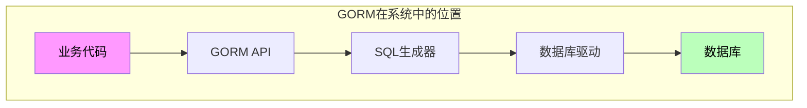
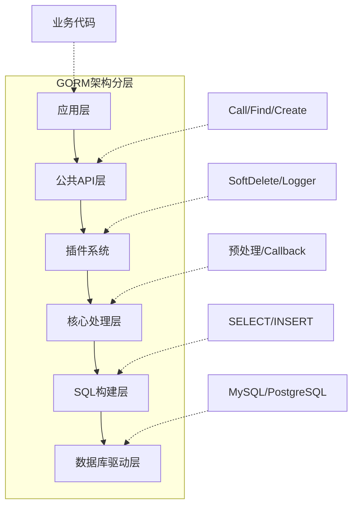
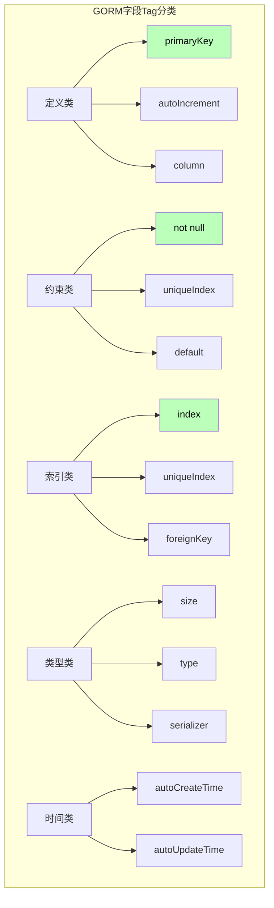
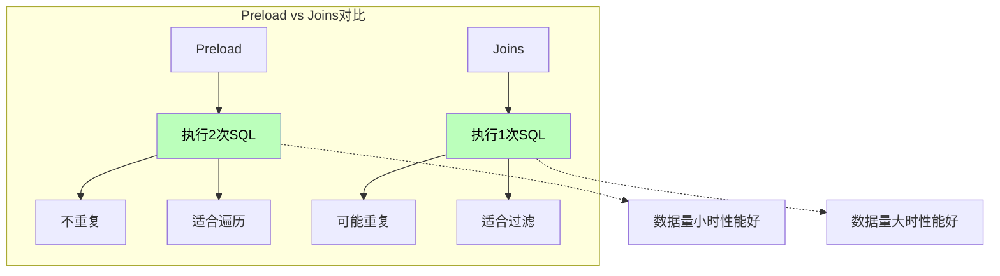
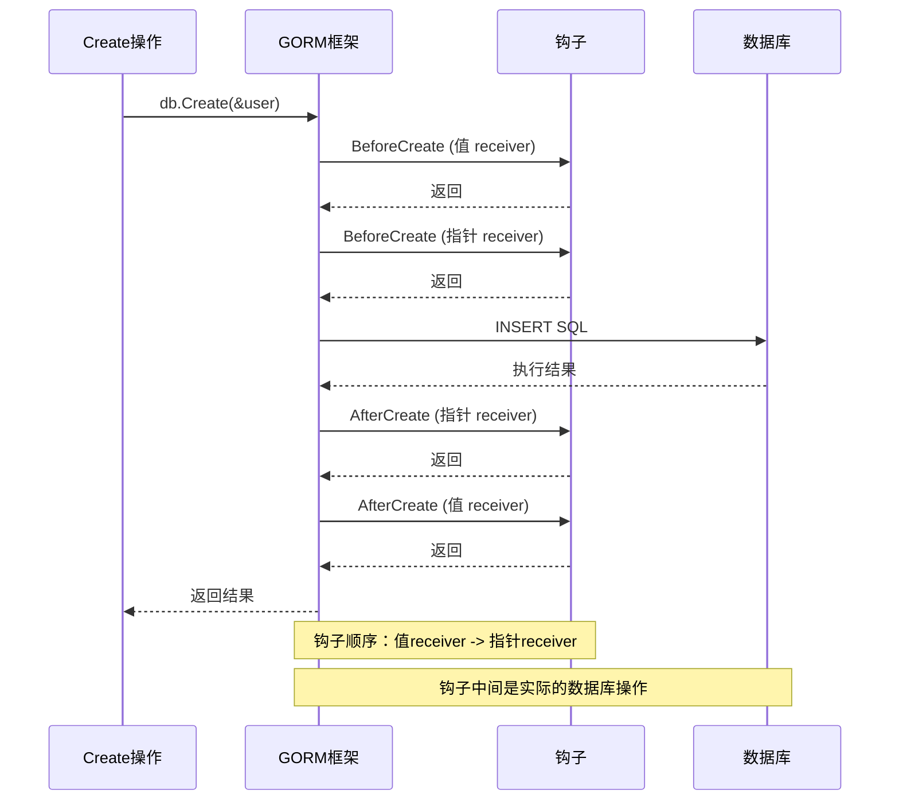
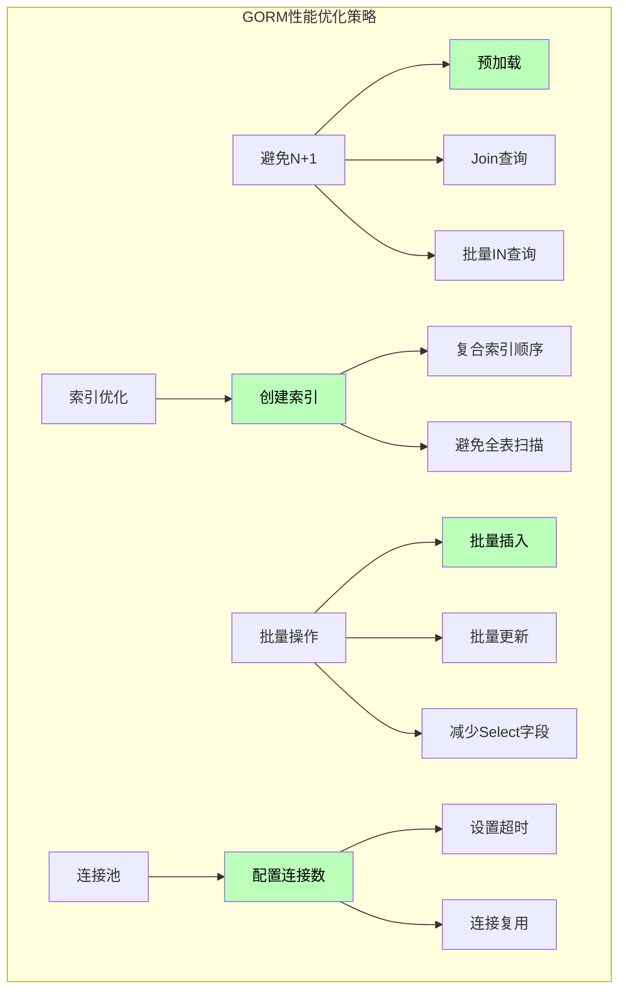
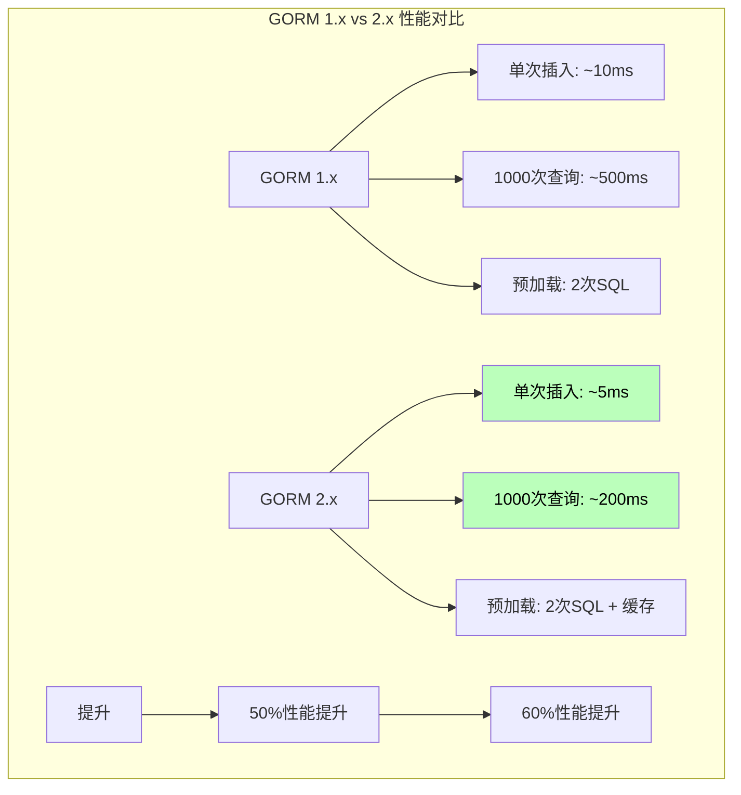

# Go语言GORM深度解析：从原理到实践的完全指南

> 

## 引言

在Go语言的后端开发领域，数据库操作是不可避免的核心环节。然而，Go语言本身并没有像Java的Hibernate或Python的Django ORM那样内置强大的对象关系映射（ORM）框架。GORM的出现填补了这一空白，它成为了Go生态中最广泛使用的ORM库，被无数项目采用来简化数据库操作。

GORM之所以能够在Go社区获得如此广泛的采用，不仅仅是因为它提供了便捷的CRUD操作，更因为它的设计哲学与Go语言本身的理念高度契合：简洁、直观、约定优于配置。然而，这种"简单"的背后蕴含着复杂的技术实现，理解这些底层机制对于写出高质量的代码至关重要。

很多开发者每天都在使用GORM，但对其内部机制的理解可能仅限于"调用几个方法就能操作数据库"。当被问及以下问题时，浅显的了解往往不够：

- GORM是如何将Go的struct映射到数据库表的？
- 为什么GORM使用钩子（Hook）而不是监听器模式？
- GORM的Preload和Joins有什么区别？分别在什么场景使用？
- 为什么某些查询会触发N+1问题？如何避免？
- GORM是如何实现软删除的？原理是什么？

要回答这些问题，我们需要深入到GORM的源代码层面，理解它是如何将操作转换为SQL的。只有理解了这些"为什么"，才能真正掌握GORM的正确使用方式，避免常见的性能陷阱，写出高效且健壮的代码。

本文将带领读者从GORM的基本用法出发，逐步深入到其内部实现机制。我们将分析GORM如何处理模型定义、如何构建SQL查询、如何管理数据库连接，以及如何实现各种高级特性。通过理解这些底层细节，你将能够：

1. 更准确地使用GORM的各种特性
2. 避免常见的性能问题和错误用法
3. 在遇到问题时快速定位和解决
4. 在需要优化时做出更明智的决策

---

## 第一章：GORM基础概念与架构

### 1.1 什么是GORM？

GORM（Go Object Relational Mapping）是一个用于Go语言的对象关系映射库。它的核心目标是在Go的struct和数据库表之间建立映射关系，让开发者可以用操作对象的方式来操作数据库，而不需要编写复杂的SQL语句。



```go
package main

import (
    "gorm.io/gorm"
    "gorm.io/driver/mysql"
)

func main() {
    // 连接数据库
    db, err := gorm.Open(mysql.Open("user:password@tcp(127.0.0.1:3306)/dbname"), &gorm.Config{})
    if err != nil {
        panic(err)
    }
    
    // 定义模型
    type User struct {
        ID   uint
        Name string
        Age  int
    }
    
    // 自动迁移（创建表）
    db.AutoMigrate(&User{})
    
    // 创建记录
    user := User{Name: "张三", Age: 30}
    db.Create(&user)
    
    // 查询记录
    var findUser User
    db.First(&findUser, 1)  // 查询ID为1的记录
    
    // 更新记录
    db.Model(&findUser).Update("Name", "李四")
    
    // 删除记录
    db.Delete(&findUser)
}
```

### 1.2 GORM的整体架构

GORM的整体架构可以分为以下几个层次：



**各层职责：**

1. **应用层**：开发者直接调用的接口，如`db.Create()`、`db.First()`
2. **公共API层**：统一的API入口，处理各种数据库操作
3. **插件系统**：扩展功能，如软删除、审计日志等
4. **核心处理层**：事务管理、钩子执行、预处理等
5. **SQL构建层**：将链式调用转换为SQL语句
6. **数据库驱动层**：实际与数据库通信

**根本原因分析**：为什么GORM采用分层架构设计？

这种分层架构有几个重要的设计考量：

**第一，职责分离**
- 每一层只关注自己的职责
- 应用层不需要关心SQL如何构建
- SQL构建层不需要关心数据库驱动细节

**第二，可扩展性**
- 分层使得添加新功能变得简单
- 插件系统允许在不修改核心的情况下扩展功能
- 例如：软删除就是一个独立插件

**第三，维护性**
- 代码结构清晰，易于理解和维护
- 修改某一层不会影响其他层
- 便于测试和debug

### 1.3 GORM的核心概念

理解GORM的核心概念是掌握它的基础：

```go
package main

import (
    "fmt"
    "gorm.io/gorm"
    "gorm.io/driver/sqlite"
)

type User struct {
    ID        uint      // 主键
    Name      string    // 普通字段
    Age       int       // 普通字段
    Email     *string   // 可空字段
    CreatedAt time.Time // 时间戳字段
    UpdatedAt time.Time // 时间戳字段
}

func main() {
    db, _ := gorm.Open(sqlite.Open("test.db"), &gorm.Config{})
    
    // 1. Model - 指定要操作的模型
    db.Model(&User{})
    
    // 2. Scopes - 预定义查询条件
    // 3. Attributes - 用于更新操作
    // 4. Clauses - 构造SQL子句
    
    // 链式调用示例
    var users []User
    db.Where("age > ?", 20).
        Order("age DESC").
        Limit(10).
        Offset(0).
        Find(&users)
    
    fmt.Println(users)
}
```

---

## 第二章：模型定义与数据库映射

### 2.1 模型的基本定义

在GORM中，模型就是Go的struct。GORM通过struct的字段Tag来定义模型的各种属性。

```go
package main

import (
    "time"
    
    "gorm.io/gorm"
)

// 最基础的模型
type User struct {
    ID   uint
    Name string
}

// 带字段Tag的模型
type UserWithTag struct {
    ID        uint      `gorm:"primaryKey"`         // 主键
    Name      string    `gorm:"size:100;not null"` // 字段属性
    Age       int       `gorm:"default:0"`         // 默认值
    Email     string    `gorm:"uniqueIndex"`       // 唯一索引
    CreatedAt time.Time `gorm:"autoCreateTime"`    // 自动创建时间
    UpdatedAt time.Time `gorm:"autoUpdateTime"`    // 自动更新时间
}

// 完整示例
type FullUser struct {
    // 主键
    ID uint `gorm:"primaryKey"`
    
    // 基础字段
    Name string `gorm:"size:50;not null;default:张三"`
    Age int `gorm:"check:age > 0 AND age < 150"`
    Email string `gorm:"uniqueIndex;size:100"`
    Phone string `gorm:"index"` // 普通索引
    
    // 时间戳
    CreatedAt time.Time `gorm:"autoCreateTime"`
    UpdatedAt time.Time `gorm:"autoUpdateTime"`
    DeletedAt gorm.DeletedAt `gorm:"index"` // 软删除
    
    // 关联
    Orders []Order `gorm:"foreignKey:UserID"`
}

func main() {
    // GORM会自动将FullUser映射到full_users表
    // 表名默认是模型名的snake_case复数形式
}
```

### 2.2 字段Tag详解

GORM的字段Tag非常丰富，可以定义字段的各种属性：

```go
package main

// 常用Tag说明

type FieldTagDemo struct {
    // 1. 主键和自动递增
    ID        uint  `gorm:"primaryKey;autoIncrement"`
    UUID      string `gorm:"primaryKey;type:varchar(36)"` // 自定义主键类型
    
    // 2. 列名映射
    UserName string `gorm:"column:user_name"` // 映射到user_name列
    
    // 3. 大小和类型
    Name string `gorm:"size:100"` // varchar(100)
    Bio string `gorm:"type:text"` // text类型
    
    // 4. 空值约束
    Email string `gorm:"not null;uniqueIndex"`
    
    // 5. 默认值
    Status int `gorm:"default:1"`
    
    // 6. 索引
    Phone string `gorm:"index"` // 普通索引
    Email string `gorm:"uniqueIndex"` // 唯一索引
    // 组合索引: gorm:"index:idx_name_email,priority:2"
    
    // 7. 检查约束（需要数据库支持）
    Age int `gorm:"check:age >= 0 AND age <= 150"`
    
    // 8. 忽略字段
    Secret string `gorm:"-"` // 不会被映射到数据库
    
    // 9. 序列化
    Meta string `gorm:"serializer:json"` // JSON序列化存储
    Data []byte `gorm:"serializer:gob"` // Gob序列化存储
}
```



### 2.3 表名和列名的自动映射

GORM有智能的命名映射规则：

```go
package main

import (
    "fmt"
    "strings"
    
    "gorm.io/gorm"
)

// 默认映射规则
type User struct {
    ID        uint
    FirstName string
    LastName  string
    CreatedAt time.Time
}
// 表名: users (User -> users)
// 列名: first_name (FirstName -> first_name)
// 时间字段: created_at (CreatedAt -> created_at)

// 自定义表名 - 实现Tabler接口
type CustomTable struct {
    ID uint
}

func (CustomTable) TableName() string {
    return "my_custom_table"
}

// 动态表名 - 使用Scopes
func DynamicTable(table string) func(*gorm.DB) *gorm.DB {
    return func(db *gorm.DB) *gorm.DB {
        return db.Table(table)
    }
}

// 嵌入式结构体
type BaseModel struct {
    ID        uint      `gorm:"primaryKey"`
    CreatedAt time.Time `gorm:"autoCreateTime"`
    UpdatedAt time.Time `gorm:"autoUpdateTime"`
}

type UserWithEmbed struct {
    BaseModel // 嵌入式 - 字段会提升到外层结构体
    Name      string
}
// 表结构: id, created_at, updated_at, name
// 注意：不会创建base_models表

func main() {
    // 查看映射结果
    fmt.Println("User -> users")
    fmt.Println("FirstName -> first_name")
    fmt.Println("CreatedAt -> created_at")
    fmt.Println("CustomTable -> my_custom_table")
    
    // 如果需要自定义转换规则，可以配置NamingStrategy
    // db, _ := gorm.Open(dialect, &gorm.Config{
    //     NamingStrategy: schema.NamingStrategy{
    //         TablePrefix: "t_",
    //         NameReplacer: strings.NewReplacer("ID", "id"),
    //     },
    // })
}
```

**根本原因分析**：为什么GORM要自动转换命名风格？

这涉及到GORM的设计哲学和历史背景：

**约定优于配置**
- GORM借鉴了Ruby on Rails的约定优于配置原则
- 默认规则让开发者可以省略大量重复配置
- 对于不符合默认规则的情况，提供了灵活的定制方式

**Go语言的命名惯例**
- Go推荐使用驼峰命名（CamelCase）
- 数据库推荐使用蛇形命名（snake_case）
- GORM自动进行两者之间的转换

**历史兼容性**
- GORM最初设计时，Go社区已经习惯了蛇形命名的数据库
- 自动转换保持了代码和数据库的一致性

---

## 第三章：CRUD操作深度解析

### 3.1 Create操作详解

Create操作是GORM中最常用的操作之一，背后有复杂的处理流程：

```go
package main

import (
    "fmt"
    "gorm.io/driver/sqlite"
    "gorm.io/gorm"
)

type User struct {
    ID   uint
    Name string
    Age  int
}

func main() {
    db, _ := gorm.Open(sqlite.Open(":memory:"), &gorm.Config{})
    
    // 1. 基础创建
    user := User{Name: "张三", Age: 30}
    result := db.Create(&user)
    fmt.Printf("插入ID: %d, 影响行数: %d\n", user.ID, result.RowsAffected)
    
    // 2. 批量创建
    users := []User{
        {Name: "李四", Age: 25},
        {Name: "王五", Age: 35},
        {Name: "赵六", Age: 28},
    }
    db.Create(&users)
    // INSERT INTO users (name, age) VALUES (?, ?), (?, ?), (?, ?)
    
    // 3. Select创建（只插入指定的字段）
    db.Select("Name", "Age").Create(&User{Name: "孙七", Age: 40, ID: 999})
    // INSERT INTO users (name, age) VALUES (?, ?)
    // ID字段会被忽略（因为不在Select中）
    
    // 4. Omit排除字段（插入除指定字段外的所有字段）
    db.Omit("Age").Create(&User{Name: "周八", Age: 50})
    // INSERT INTO users (name) VALUES (?)
    // Age字段会被忽略
    
    // 5. 钩子演示 - 创建前后的回调
    // type User struct {
    //     ID   uint
    //     Name string
    //     Age  int
    // }
    //
    // func (u *User) BeforeCreate(tx *gorm.DB) error {
    //     fmt.Println("创建前钩子")
    //     return nil
    // }
    //
    // func (u *User) AfterCreate(tx *gorm.DB) error {
    //     fmt.Println("创建后钩子")
    //     return nil
    // }
}
```

Create操作的完整流程：

```mermaid
flowchart TD
    A[db.Create(&user)] --> B{实现BeforeCreate接口?}
    B -->|是| C[执行BeforeCreate钩子]
    B -->|否| D[开始事务]
    
    C --> D
    
    D --> E[验证模型]
    E --> F[处理关联]
    F --> G[构建INSERT SQL]
    G --> H[执行SQL]
    H --> I{返回错误?}
    I -->|是| J[回滚事务]
    I -->|否| K{实现AfterCreate接口?}
    
    K -->|是| L[执行AfterCreate钩子]
    K -->|否| M[提交事务]
    
    L --> M
    
    J --> N[返回错误]
    M --> O[返回结果]
    
    style D fill:#bfb,color:#000
    style G fill:#bbf,color:#000
```

### 3.2 Query操作详解

Query是GORM中最复杂的部分，包含多种查询方式：

```go
package main

import (
    "fmt"
    
    "gorm.io/gorm"
)

type User struct {
    ID     uint
    Name   string
    Age    int
    Email  string
    Status int
}

func QueryExamples(db *gorm.DB) {
    // 1. Find - 查询多条记录
    var users1 []User
    db.Find(&users1)
    // SELECT * FROM users
    
    // 2. First - 查询第一条记录
    var user2 User
    db.First(&user2)
    // SELECT * FROM users ORDER BY id LIMIT 1
    
    // 3. Last - 查询最后一条记录
    var user3 User
    db.Last(&user3)
    // SELECT * FROM users ORDER BY id DESC LIMIT 1
    
    // 4. Take - 查询任意一条记录
    var user4 User
    db.Take(&user4)
    // SELECT * FROM users LIMIT 1
    
    // 5. Where - 条件查询
    var users5 []User
    db.Where("age > ? AND status = ?", 20, 1).Find(&users5)
    // SELECT * FROM users WHERE age > 20 AND status = 1
    
    // 6. Not - 取反条件
    var users6 []User
    db.Not("age > ?", 30).Find(&users6)
    // SELECT * FROM users WHERE NOT (age > 30)
    
    // 7. Or - 或条件
    var users7 []User
    db.Where("age > ?", 30).Or("name = ?", "张三").Find(&users7)
    // SELECT * FROM users WHERE age > 30 OR name = '张三'
    
    // 8. Select - 指定查询字段
    var users8 []User
    db.Select("id, name, age").Find(&users8)
    // SELECT id, name, age FROM users
    
    // 9. Order - 排序
    var users9 []User
    db.Order("age DESC, name ASC").Find(&users9)
    // SELECT * FROM users ORDER BY age DESC, name ASC
    
    // 10. Limit/Offset - 分页
    var users10 []User
    db.Limit(10).Offset(20).Find(&users10)
    // SELECT * FROM users LIMIT 10 OFFSET 20
    
    // 11. Group - 分组
    type Result struct {
        Age  int
        Count int
    }
    var results []Result
    db.Model(&User{}).Select("age, COUNT(*) as count").Group("age").Find(&results)
    // SELECT age, COUNT(*) as count FROM users GROUP BY age
    
    // 12. Having - 分组后筛选
    var results2 []Result
    db.Model(&User{}).Select("age, COUNT(*) as count").
        Group("age").
        Having("COUNT(*) > ?", 2).
        Find(&results2)
    // SELECT age, COUNT(*) as count FROM users GROUP BY age HAVING COUNT(*) > 2
    
    // 13. Distinct - 去重
    var users13 []User
    db.Distinct("age").Find(&users13)
    // SELECT DISTINCT age FROM users
    
    // 14. Joins - 连接查询
    type Order struct {
        ID     uint
        UserID uint
        Amount float64
    }
    var usersWithOrders []User
    db.Joins("LEFT JOIN orders ON users.id = orders.user_id").Find(&usersWithOrders)
    
    // 15. Scan - 将结果扫描到自定义结构
    type UserDTO struct {
        Name string
        Age  int
    }
    var dto UserDTO
    db.Model(&User{}).Select("name, age").Scan(&dto)
    // 可以扫描到非结构体类型
    
    fmt.Println("查询示例完成")
}
```

### 3.3 Update操作详解

```go
package main

import (
    "fmt"
    
    "gorm.io/gorm"
)

type User struct {
    ID   uint
    Name string
    Age  int
}

func UpdateExamples(db *gorm.DB) {
    // 1. 更新单条记录 - Save
    var user1 User
    db.First(&user1)
    user1.Name = "新名字"
    user1.Age = 25
    db.Save(&user1)
    // UPDATE users SET name='新名字', age=25, updated_at=? WHERE id=?
    // Save会更新所有字段，包括零值
    
    // 2. 更新指定字段 - Update
    var user2 User
    db.First(&user2)
    db.Model(&user2).Update("name", "新名字")
    // UPDATE users SET name='新名字', updated_at=? WHERE id=?
    
    // 3. 更新多个字段 - Updates (map)
    var user3 User
    db.First(&user3)
    db.Model(&user3).Updates(map[string]interface{}{
        "name": "新名字",
        "age":  30,
    })
    // UPDATE users SET name='新名字', age=30, updated_at=? WHERE id=?
    
    // 4. Updates (struct) - 只更新非零值字段
    var user4 User
    db.First(&user4)
    db.Model(&user4).Updates(User{Name: "新名字", Age: 30})
    // Age如果为0则不会被更新
    
    // 5. Select更新 - 只更新Select中指定的字段
    var user5 User
    db.First(&user5)
    db.Model(&user5).Select("name").Updates(User{Name: "新名字", Age: 30})
    // UPDATE users SET name='新名字', updated_at=? WHERE id=?
    // Age字段被忽略
    
    // 6. Omit更新 - 排除指定字段
    var user6 User
    db.First(&user6)
    db.Model(&user6).Omit("name").Updates(User{Name: "新名字", Age: 30})
    // UPDATE users SET age=30, updated_at=? WHERE id=?
    // Name字段被忽略
    
    // 7. 批量更新
    db.Model(&User{}).Where("age > ?", 30).Update("status", 1)
    // UPDATE users SET status=1, updated_at=? WHERE age > 30
    
    // 8. Expr更新 - 使用表达式
    db.Model(&User{}).Where("id = ?", 1).Update("age", gorm.Expr("age + ?", 1))
    // UPDATE users SET age = age + 1 WHERE id = 1
    
    fmt.Println("更新示例完成")
}
```

### 3.4 Delete操作详解

```go
package main

import (
    "fmt"
    
    "gorm.io/gorm"
)

type User struct {
    ID        uint
    Name      string
    DeletedAt gorm.DeletedAt // 如果有这个字段，就是软删除
}

func DeleteExamples(db *gorm.DB) {
    // 1. 删除单条记录
    var user1 User
    db.First(&user1)
    db.Delete(&user1)
    // 硬删除: DELETE FROM users WHERE id = ?
    // 软删除: UPDATE users SET deleted_at = ? WHERE id = ?
    
    // 2. 根据条件删除
    db.Where("age > ?", 30).Delete(&User{})
    // DELETE FROM users WHERE age > 30
    
    // 3. Unscoped - 永久删除（忽略软删除）
    var user2 User
    db.Unscoped().First(&user2, 1)
    db.Unscoped().Delete(&user2)
    // DELETE FROM users WHERE id = ? （直接从数据库删除）
    
    // 4. 物理删除 - 使用Unscoped + Delete
    db.Unscoped().Where("deleted_at IS NOT NULL").Delete(&User{})
    // 删除所有已软删除的记录
    
    fmt.Println("删除示例完成")
}
```

**根本原因分析**：为什么GORM使用软删除而不是直接删除？

这是一个重要的设计决策：

**1. 数据安全**
- 软删除可以恢复误删除的数据
- 符合审计要求，保留删除痕迹
- 防止数据意外丢失

**2. 业务需求**
- 很多业务场景需要"撤销"功能
- 法律要求保留历史数据
- 数据分析需要完整的操作记录

**3. 实现简单**
- 只需要添加一个deleted_at字段
- 只需修改查询时过滤已删除记录
- 不需要维护额外的历史表

---

## 第四章：关联关系深度解析

### 4.1 一对多关系

```go
package main

import (
    "fmt"
    "gorm.io/gorm"
)

// 一对多：用户可以有多个订单
type User struct {
    ID    uint
    Name  string
    // 定义一对多关系
    Orders []Order `gorm:"foreignKey:UserID"` // 外键在Order表
}

type Order struct {
    ID     uint
    UserID uint // 外键
    Amount float64
}

func OneToManyExamples(db *gorm.DB) {
    // 1. 创建用户和订单
    user := User{Name: "张三", Orders: []Order{
        {Amount: 100},
        {Amount: 200},
    }}
    db.Create(&user)
    // INSERT INTO users (name) VALUES ('张三')
    // INSERT INTO orders (user_id, amount) VALUES (1, 100), (1, 200)
    
    // 2. 预加载关联 - 查用户时同时查订单
    var users []User
    db.Preload("Orders").Find(&users)
    // SELECT * FROM users
    // SELECT * FROM orders WHERE user_id IN (1, 2, ...)
    
    // 3. 动态预加载
    db.Preload("Orders", "amount > ?", 100).Find(&users)
    // SELECT * FROM orders WHERE user_id IN (...) AND amount > 100
    
    // 4. 关联查询 - 通过用户查订单
    var user1 User
    db.Preload("Orders").First(&user1, 1)
    for _, order := range user1.Orders {
        fmt.Println(order.Amount)
    }
    
    // 5. 创建时同时创建关联
    db.Create(&User{
        Name: "李四",
        Orders: []Order{
            {Amount: 300},
            {Amount: 400},
        },
    })
    
    // 6. 添加关联
    var user2 User
    db.First(&user2, 2)
    db.Model(&user2).Append(&Order{Amount: 500})
    
    // 7. 替换关联
    var user3 User
    db.First(&user3, 3)
    db.Model(&user3).Replace(&Order{Amount: 600})
    
    // 8. 清除关联
    var user4 User
    db.First(&user4, 4)
    db.Model(&user4).Clear("Orders")
}
```

### 4.2 多对多关系

```go
package main

import (
    "gorm.io/gorm"
)

// 多对多：学生可以选多门课程，每门课程可以多个学生选
type Student struct {
    ID      uint
    Name    string
    // 使用JoinTable指定中间表
    Courses []Course `gorm:"many2many:student_courses;"`
}

type Course struct {
    ID   uint
    Name string
    // 同样定义反向关系
    Students []Student `gorm:"many2many:student_courses;"`
}

func ManyToManyExamples(db *gorm.DB) {
    // 1. 创建带关联的数据
    student := Student{
        Name: "张三",
        Courses: []Course{
            {Name: "数学"},
            {Name: "英语"},
        },
    }
    db.Create(&student)
    // INSERT INTO students (name)
    // INSERT INTO courses (name)
    // INSERT INTO student_courses (student_id, course_id)
    
    // 2. 预加载
    var students []Student
    db.Preload("Courses").Find(&students)
    
    // 3. 追加关联
    var student1 Student
    db.First(&student1, 1)
    var course Course
    db.First(&course, 3) // 新课程
    db.Model(&student1).Append(&course)
    
    // 4. 自定义中间表字段
    type StudentCourse struct {
        StudentID uint
        CourseID  uint
        Grade     float64 // 成绩
        EnrolledAt time.Time
    }
    
    // 自定义关系
    type StudentWithGrade struct {
        ID     uint
        Name   string
        Courses []Course `gorm:"many2many:student_courses;joinForeignKey:StudentID;joinReferences:CourseID"`
    }
}
```

### 4.3 一对一关系

```go
package main

import (
    "gorm.io/gorm"
)

// 一对一：每个用户有一个配置文件
type User struct {
    ID   uint
    Name string
    // 一对一关系，使用HAS ONE
    Profile Profile `gorm:"foreignKey:UserID"` // Profile有UserID外键
}

type Profile struct {
    ID     uint
    UserID uint // 外键
    Bio    string
    Website string
}

func OneToOneExamples(db *gorm.DB) {
    // 1. 创建时附带创建
    user := User{
        Name: "张三",
        Profile: Profile{
            Bio: "这是一个简介",
            Website: "http://example.com",
        },
    }
    db.Create(&user)
    
    // 2. 预加载
    var users []User
    db.Preload("Profile").Find(&users)
    
    // 3. 关联查询
    var user1 User
    db.Preload("Profile").First(&user1, 1)
    fmt.Println(user1.Profile.Bio)
    
    // 4. 使用Associate添加关联
    var user2 User
    db.First(&user2, 2)
    var profile Profile
    db.First(&profile, 1)
    db.Model(&user2).Associate(&profile)
}
```

### 4.4 预加载（Preload）与Joins的区别

这是一个非常重要但常被误解的概念：

```go
package main

import (
    "fmt"
    
    "gorm.io/gorm"
)

type User struct {
    ID     uint
    Name   string
    Orders []Order `gorm:"foreignKey:UserID"`
}

type Order struct {
    ID     uint
    UserID uint
    Amount float64
}

func PreloadVsJoins(db *gorm.DB) {
    // ============================================
    // 预加载 (Preload) - N+1 问题解决方案
    // ============================================
    
    // 预加载的工作方式：
    // 1. 先执行主查询：SELECT * FROM users
    // 2. 再执行关联查询：SELECT * FROM orders WHERE user_id IN (1,2,3...)
    // 3. 将结果关联到主对象
    
    var users1 []User
    db.Preload("Orders").Find(&users1)
    // 总共2次SQL查询
    
    // 适用场景：
    // - 需要在模板中遍历关联数据
    // - 关联数据量不大
    // - 需要对关联数据进行二次处理
    
    // ============================================
    // Joins - 适合需要过滤关联的场景
    // ============================================
    
    // Joins的工作方式：
    // 1. 直接执行JOIN查询：SELECT * FROM users LEFT JOIN orders ON ...
    // 2. 结果在同一条记录中
    
    var users2 []User
    db.Joins("LEFT JOIN orders ON orders.user_id = users.id").Find(&users2)
    // 只需要1次SQL查询
    
    // 特别注意：Joins会返回重复的用户记录！
    // 如果用户有3个订单，会返回3条用户记录
    
    // ============================================
    // 如何选择？
    // ============================================
    
    // 场景1：获取用户列表，同时需要显示订单数量
    // 推荐：使用Joins + Group
    var results []struct {
        UserName string
        OrderCount int
    }
    db.Model(&User{}).
        Joins("LEFT JOIN orders ON orders.user_id = users.id").
        Select("users.name, COUNT(orders.id) as order_count").
        Group("users.id").
        Find(&results)
    
    // 场景2：获取用户列表，需要显示所有订单详情
    // 推荐：使用Preload
    var users3 []User
    db.Preload("Orders").Find(&users3)
    
    // 场景3：需要根据订单条件筛选用户
    // 推荐：使用Joins + Where
    var users4 []User
    db.Joins("LEFT JOIN orders ON orders.user_id = users.id").
        Where("orders.amount > ?", 100).
        Find(&users4)
    // 这会返回有订单金额>100的用户的记录（可能有重复）
    // 可以用Distinct去重
    
    fmt.Println("预加载与Joins示例完成")
}
```



**根本原因分析**：为什么预加载会产生N+1问题？

这涉及到GORM的设计：

**预加载的设计原理**
- 预加载的初衷是延迟加载（Lazy Loading）
- 先加载主对象，再按需加载关联对象
- 当不熟悉时会导致N+1问题

**N+1问题的根源**
- 在循环中调用Preload
- 没有一次性预加载所有关联
- 解决方案：使用Preload两次、Select关联等

---

## 第五章：钩子与回调系统

### 5.1 钩子简介

GORM的钩子系统允许在CRUD操作的生命周期中注入自定义逻辑：

```go
package main

import (
    "fmt"
    "time"
    
    "gorm.io/gorm"
)

type User struct {
    ID        uint
    Name      string
    Age       int
    CreatedAt time.Time
    UpdatedAt time.Time
}

// ==================== 创建钩子 ====================

// BeforeCreate - 创建前执行
func (u *User) BeforeCreate(tx *gorm.DB) error {
    fmt.Println("BeforeCreate 钩子执行")
    // 可以修改字段
    if u.Name == "" {
        u.Name = "默认名称"
    }
    // 可以阻止创建
    if u.Age < 0 {
        return fmt.Errorf("年龄不能为负数")
    }
    return nil
}

// AfterCreate - 创建后执行
func (u *User) AfterCreate(tx *gorm.DB) error {
    fmt.Println("AfterCreate 钩子执行")
    // 可以记录日志、发送通知等
    return nil
}

// ==================== 更新钩子 ====================

// BeforeUpdate - 更新前执行
func (u *User) BeforeUpdate(tx *gorm.DB) error {
    fmt.Println("BeforeUpdate 钩子执行")
    return nil
}

// AfterUpdate - 更新后执行
func (u *User) AfterUpdate(tx *gorm.DB) error {
    fmt.Println("AfterUpdate 钩子执行")
    return nil
}

// ==================== 删除钩子 ====================

// BeforeDelete - 删除前执行
func (u *User) BeforeDelete(tx *gorm.DB) error {
    fmt.Println("BeforeDelete 钩子执行")
    return nil
}

// AfterDelete - 删除后执行
func (u *User) AfterDelete(tx *gorm.DB) error {
    fmt.Println("AfterDelete 钩子执行")
    return nil
}

// ==================== 查询钩子 ====================

// AfterFind - 查询后执行
func (u *User) AfterFind(tx *gorm.DB) error {
    fmt.Println("AfterFind 钩子执行")
    return nil
}

func HookExamples() {
    // 使用示例
    // db.Create(&User{Name: "张三", Age: 30})
    // 会依次执行 BeforeCreate -> INSERT -> AfterCreate
    
    // db.First(&User{}, 1)
    // 会执行 AfterFind
    
    // 钩子中可以通过 tx 获取更多信息
    // tx.Statement.SQL  获取当前SQL
    // tx.Statement.Table 获取当前表名
    // tx.Statement.Model 获取当前模型
}
```

### 5.2 钩子的执行顺序



### 5.3 全局钩子（回调）

除了实例钩子，GORM还支持全局回调：

```go
package main

import (
    "fmt"
    
    "gorm.io/gorm"
)

// 注册全局创建前回调
func init() {
    // 使用Callback方式注册
    // gorm.Callback().Create().Before("gorm:create").Register("my:before_create", beforeCreateCallback)
}

// 全局回调示例
func GlobalCallbacks(db *gorm.DB) {
    // 创建回调组
    createCallback := db.Callback().Create()
    
    // 在所有创建操作之前执行
    createCallback.Before("gorm:create").Register("my:before_create", func(db *gorm.DB) error {
        fmt.Println("全局BeforeCreate回调")
        return nil
    })
    
    // 在所有创建操作之后执行
    createCallback.After("gorm:create").Register("my:after_create", func(db *gorm.DB) error {
        fmt.Println("全局AfterCreate回调")
        return nil
    })
    
    // 更新回调
    db.Callback().Update().Before("gorm:update").Register("my:before_update", func(db *gorm.DB) error {
        fmt.Println("全局BeforeUpdate回调")
        return nil
    })
    
    // 删除回调
    db.Callback().Delete().Before("gorm:delete").Register("my:before_delete", func(db *gorm.DB) error {
        fmt.Println("全局BeforeDelete回调")
        return nil
    })
    
    // 查询回调
    db.Callback().Query().Before("gorm:query").Register("my:before_query", func(db *gorm.DB) error {
        fmt.Println("全局BeforeQuery回调")
        return nil
    })
}
```

**根本原因分析**：为什么GORM使用钩子而不是观察者模式？

这涉及到设计哲学：

**1. 简单性**
- 钩子只需要实现特定方法
- 不需要注册和注销观察者
- 方法定义即可生效

**2. 显式优于隐式**
- 钩子是类型方法，明确定义在模型上
- 开发者一眼就能看到哪些地方有扩展
- 观察者模式可能造成代码分散，难以追踪

**3. 性能**
- 钩子是同步调用，overhead低
- 观察者模式需要维护注册表

---

## 第六章：事务处理

### 6.1 事务基础

```go
package main

import (
    "fmt"
    
    "gorm.io/gorm"
)

type Account struct {
    ID      uint
    Name    string
    Balance float64
}

func TransactionExamples(db *gorm.DB) {
    // ==================== 标准事务 ====================
    
    err := db.Transaction(func(tx *gorm.DB) error {
        // 在事务中执行操作
        // 任何一个操作返回错误都会导致回滚
        
        // 转账：张三给李四转100元
        // 1. 张三账户减100
        if err := tx.Model(&Account{}).Where("name = ?", "张三").
            Update("balance", gorm.Expr("balance - ?", 100)).Error; err != nil {
            return err
        }
        
        // 2. 李四账户加100
        if err := tx.Model(&Account{}).Where("name = ?", "李四").
            Update("balance", gorm.Expr("balance + ?", 100)).Error; err != nil {
            return err
        }
        
        return nil // 返回nil表示提交事务
    })
    
    if err != nil {
        fmt.Printf("事务失败: %v\n", err)
    } else {
        fmt.Println("事务成功")
    }
    
    // ==================== 手动事务控制 ====================
    
    // 开始事务
    tx := db.Begin()
    
    // 执行操作
    tx.Create(&Account{Name: "测试", Balance: 100})
    
    // 提交
    tx.Commit()
    
    // 或者回滚
    // tx.Rollback()
}

func ManualTransaction(db *gorm.DB) {
    // 如果在事务中不需要使用tx变量，可以用tx.Session(&gorm.Session{})
    // 这会将所有操作限定在事务中
    
    db.Session(&gorm.Session{
        NowFunc: func() time.Time {
            return time.Now() // 自定义时间函数
        },
    }).Create(&Account{Name: "时间测试", Balance: 50})
}

import "time"
```

### 6.2 嵌套事务和保存点

```go
package main

import (
    "gorm.io/gorm"
)

func NestedTransaction(db *gorm.DB) {
    // GORM支持嵌套事务（通过Savepoint）
    
    err := db.Transaction(func(tx *gorm.DB) error {
        // 外层事务
        
        // 操作1
        if err := tx.Create(&Account{Name: "A", Balance: 100}).Error; err != nil {
            return err
        }
        
        // 嵌套事务（保存点）
        err := tx.Transaction(func(tx2 *gorm.DB) error {
            // 内层事务
            
            // 操作2 - 这里失败会导致回滚到保存点
            if err := tx2.Create(&Account{Name: "B", Balance: 50}).Error; err != nil {
                return err
            }
            
            // 手动设置保存点
            // tx2.SavePoint("sp1")
            
            return nil
        })
        
        // 嵌套事务的失败不影响外层（除非返回错误）
        
        // 操作3
        if err := tx.Create(&Account{Name: "C", Balance: 75}).Error; err != nil {
            return err
        }
        
        return nil
    })
}
```

### 6.3 事务隔离级别

```go
package main

import (
    "gorm.io/gorm"
)

func IsolationLevel(db *gorm.DB) {
    // MySQL支持的事务隔离级别：
    // - READ UNCOMMITTED
    // - READ COMMITTED
    // - REPEATABLE READ (默认)
    // - SERIALIZABLE
    
    // GORM中设置隔离级别
    db.Session(&gorm.Session{
        NowFunc: time.Now,
    })
    
    // 或者使用SQL设置
    db.Exec("SET TRANSACTION ISOLATION LEVEL READ COMMITTED")
    
    // 在事务中设置
    db.Transaction(func(tx *gorm.DB) error {
        tx.Exec("SET TRANSACTION ISOLATION LEVEL SERIALIZABLE")
        // ...
        return nil
    })
}

import "time"
```

---

## 第七章：性能优化

### 7.1 常见性能问题与解决方案

```go
package main

import (
    "fmt"
    "time"
    
    "gorm.io/gorm"
)

type User struct {
    ID   uint
    Name string
    Age  int
}

type Order struct {
    ID     uint
    UserID uint
    Amount float64
}

// ==================== N+1 问题 ====================

func SolveNPlusOne(db *gorm.DB) {
    // 问题示例：循环中查询
    var users []User
    db.Find(&users)
    
    for _, user := range users {
        var orders []Order
        // 每查一次就执行一次SQL！
        db.Where("user_id = ?", user.ID).Find(&orders)
    }
    // 假设有100个用户，就会执行1 + 100 = 101次SQL
    
    // 解决方案1：预加载
    var users1 []User
    db.Preload("Orders").Find(&users1)
    // 只需要2次SQL
    
    // 解决方案2：Join查询
    type UserOrder struct {
        UserID int
        Name   string
        Amount float64
    }
    var results []UserOrder
    db.Model(&User{}).
        Select("users.id as user_id, users.name, orders.amount").
        Joins("LEFT JOIN orders ON orders.user_id = users.id").
        Scan(&results)
    // 只需要1次SQL
    
    // 解决方案3：批量IN查询
    var users2 []User
    db.Find(&users2)
    
    userIDs := make([]uint, len(users2))
    for i, u := range users2 {
        userIDs[i] = u.ID
    }
    
    var orders []Order
    db.Where("user_id IN ?", userIDs).Find(&orders)
    // 只需要2次SQL
}

// ==================== 索引优化 ====================

func IndexOptimization(db *gorm.DB) {
    // 1. 确认字段是否有索引
    // 通过where条件判断
    
    // 2. 复合索引顺序
    // 遵循最左前缀原则
    type OptimizedUser struct {
        ID     uint
        Name   string `gorm:"index:idx_name_age"`
        Age    int
        Email string `gorm:"index:idx_email"`
    }
    
    // 创建复合索引
    db.Exec("CREATE INDEX idx_name_age ON users(name, age)")
    
    // 查询顺序很重要
    // WHERE name = ? AND age = ?  可以使用索引
    // WHERE age = ? AND name = ?  无法使用索引（顺序不对）
}

// ==================== 批量操作优化 ====================

func BatchOperation(db *gorm.DB) {
    // 1. 批量插入优化
    var users []User
    for i := 0; i < 1000; i++ {
        users = append(users, User{Name: fmt.Sprintf("User%d", i), Age: i % 50})
    }
    
    // 默认的Create会逐条插入
    // 优化：使用切片方式
    // GORM会自动批量处理
    db.Create(&users)
    // 实际SQL: INSERT INTO users ... VALUES (...), (...), ...
    
    // 或者使用session配置
    db.Session(&gorm.Session{
        SkipHooks: true, // 跳过钩子提升性能
    }).Create(&users)
    
    // 2. 批量更新优化
    db.Model(&User{}).Where("age > ?", 30).Update("status", 1)
    // 一条SQL更新所有符合条件的记录
    
    // 3. 避免Select * 
    // 只选择需要的字段
    db.Select("id", "name").Find(&users)
}

// ==================== 连接池配置 ====================

func ConnectionPoolConfig(db *gorm.DB) {
    // 获取底层的sql.DB
    sqlDB, err := db.DB()
    if err != nil {
        panic(err)
    }
    
    // 设置最大打开连接数
    sqlDB.SetMaxOpenConns(100)
    
    // 设置最大空闲连接数
    sqlDB.SetMaxIdleConns(10)
    
    // 设置连接最大生存时间
    sqlDB.SetConnMaxLifetime(time.Hour)
    
    // 设置空闲连接最大生存时间
    sqlDB.SetConnMaxIdleTime(time.Minute * 30)
}
```



---

## 第八章：最佳实践与反模式

### 8.1 最佳实践

```go
package main

import (
    "fmt"
    
    "gorm.io/driver/sqlite"
    "gorm.io/gorm"
)

// ==================== 实践1：统一入口 ====================

// 创建全局db变量
var DB *gorm.DB

func InitDB() {
    var err error
    DB, err = gorm.Open(sqlite.Open("test.db"), &gorm.Config{
        // 生产环境建议配置
        Logger:.Default.LogMode(logger.Info), // 记录SQL日志
        NowFunc: func() time.Time {
            return time.Now().Local() // 自定义时间函数
        },
    })
    
    if err != nil {
        panic(err)
    }
    
    // 配置连接池
    sqlDB, _ := DB.DB()
    sqlDB.SetMaxOpenConns(25)
    sqlDB.SetMaxIdleConns(25)
    sqlDB.SetConnMaxLifetime(5 * time.Minute)
}

// ==================== 实践2：使用Service层 ====================

type UserService struct {
    db *gorm.DB
}

func NewUserService(db *gorm.DB) *UserService {
    return &UserService{db: db}
}

func (s *UserService) Create(name string, age int) (*User, error) {
    user := &User{Name: name, Age: age}
    err := s.db.Create(user).Error
    return user, err
}

func (s *UserService) GetByID(id uint) (*User, error) {
    var user User
    err := s.db.First(&user, id).Error
    if err == gorm.ErrRecordNotFound {
        return nil, nil
    }
    return &user, err
}

// ==================== 实践3：使用Context取消长操作 ====================

func WithContextExample() {
    // 创建带超时的Context
    ctx, cancel := context.WithTimeout(context.Background(), 5*time.Second)
    defer cancel()
    
    // 使用Context执行操作
    var users []User
    DB.WithContext(ctx).Find(&users)
    
    // 可以检查是否超时
    if ctx.Err() == context.DeadlineExceeded {
        fmt.Println("操作超时")
    }
}

import (
    "context"
    "time"
    "github.com/go-sql-driver/mysql"
    "gorm.io/gorm/logger"
)

// ==================== 实践4：正确处理错误 ====================

func ErrorHandling() {
    // 错误处理最佳实践
    
    // 1. 检查错误类型
    result := DB.First(&User{}, 999)
    if result.Error != nil {
        if result.Error == gorm.ErrRecordNotFound {
            fmt.Println("记录未找到")
        } else {
            fmt.Printf("数据库错误: %v\n", result.Error)
        }
    }
    
    // 2. 使用RowsAffected检查影响行数
    result = DB.Model(&User{}).Where("age > ?", 100).Delete(&User{})
    if result.Error != nil {
        panic(result.Error)
    }
    fmt.Printf("删除了 %d 条记录\n", result.RowsAffected)
    
    // 3. 事务中的错误处理
    err := DB.Transaction(func(tx *gorm.DB) error {
        // 任何错误都应该返回
        if err := tx.Create(&User{Name: "测试"}).Error; err != nil {
            return err
        }
        return nil
    })
    
    if err != nil {
        fmt.Printf("事务失败: %v\n", err)
    }
}
```

### 8.2 常见反模式

```go
package main

import (
    "fmt"
    "gorm.io/gorm"
)

// ==================== 反模式1：全局变量滥用 ====================

// 反模式：直接在全局使用db
var globalDB *gorm.DB

func BadGlobalPattern() {
    // 问题：无法在测试时mock
    globalDB.Create(&User{})
    
    // 正确做法：使用依赖注入
    type Repository struct {
        db *gorm.DB
    }
    
    NewRepository := func(db *gorm.DB) *Repository {
        return &Repository{db: db}
    }
}

// ==================== 反模式2：忽略错误 ====================

func BadIgnoreError() {
    var user User
    
    // 反模式：忽略错误
    DB.First(&user, 1)
    // user可能是空值，但错误被忽略
    
    // 正确做法：检查错误
    result := DB.First(&user, 1)
    if result.Error != nil {
        fmt.Printf("查询失败: %v\n", result.Error)
        return
    }
    fmt.Println(user.Name)
}

// ==================== 反模式3：使用指针作为默认值 ====================

type BadModel struct {
    ID     uint
    Name   string
    Age    *int // 反模式：使用指针作为可选字段
}

func BadPointerPattern() {
    // 问题：指针默认值是nil，导致SQL中看到NULL
    age := 30
    user := BadModel{
        Name: "张三",
        Age:  &age, // 每次都要取地址
    }
    DB.Create(&user)
    
    // 更好的做法：使用零值或字符串
    type GoodModel struct {
        ID     uint
        Name   string
        Age    int // 默认0
        // 或者使用 nullable: true
    }
}

// ==================== 反模式4：在循环中操作数据库 ====================

func BadLoopPattern() {
    var users []User
    DB.Find(&users)
    
    // 反模式：循环中创建
    for _, user := range users {
        order := Order{UserID: user.ID, Amount: 100}
        DB.Create(&order) // 每条记录执行一次SQL！
    }
    
    // 正确做法：批量创建
    var orders []Order
    for _, user := range users {
        orders = append(orders, Order{UserID: user.ID, Amount: 100})
    }
    DB.Create(&orders) // 一次SQL完成
}

// ==================== 反模式5：使用字符串代替常量 ====================

func BadStringPattern() {
    // 反模式：使用魔法字符串
    DB.Where("status = ?", "active").Find(&users)
    
    // 正确做法：使用常量
    const StatusActive = "active"
    const StatusInactive = "inactive"
    
    DB.Where("status = ?", StatusActive).Find(&users)
}

// ==================== 反模式6：忽视连接泄漏 ====================

func BadConnectionLeak() {
    // 反模式：不获取底层连接
    // db.Find() 会自动释放连接
    
    // 但如果手动获取连接，必须释放
    sqlDB, _ := DB.DB()
    conn, err := sqlDB.Conn(context.Background())
    if err != nil {
        return
    }
    
    // 忘记释放！
    // defer conn.Close() // 必须释放
    
    // 正确做法：使用context自动管理
    ctx := context.Background()
    conn2, err := sqlDB.Conn(ctx)
    if err != nil {
        return
    }
    // defer会正确释放
    defer conn2.Close()
    
    // 或者使用GORM的WithContext
    DB.WithContext(ctx).First(&User{})
}
```

---

## 第九章：高级特性

### 9.1 软删除高级用法

```go
package main

import (
    "gorm.io/gorm"
)

type SoftDeleteUser struct {
    ID        uint           `gorm:"primaryKey"`
    Name      string         `gorm:"size:100"`
    DeletedAt gorm.DeletedAt `gorm:"index"` // 软删除字段
}

// 软删除查询的特殊处理
func SoftDeleteQueries(db *gorm.DB) {
    // 1. 默认查询：自动过滤已删除记录
    var users []SoftDeleteUser
    db.Find(&users)
    // SELECT * FROM soft_delete_users WHERE deleted_at IS NULL
    
    // 2. Unscoped：查询包括已删除的记录
    var allUsers []SoftDeleteUser
    db.Unscoped().Find(&allUsers)
    // SELECT * FROM soft_delete_users
    
    // 3. 只查询已删除的记录
    var deletedUsers []SoftDeleteUser
    db.Unscoped().Where("deleted_at IS NOT NULL").Find(&deletedUsers)
    
    // 4. 物理删除：真正从数据库删除
    var user SoftDeleteUser
    db.Unscoped().Delete(&user)
    // DELETE FROM soft_delete_users WHERE id = ?
    
    // 5. 恢复软删除
    db.Unscoped().Model(&user).Update("deleted_at", nil)
}

// 软删除的字段类型选择
type DeletedAtField struct {
    // 方式1：使用gorm.DeletedAt（推荐）
    // 会自动过滤已删除记录
    
    // 方式2：使用time.Time（自定义删除时间）
    // DeletedAt time.Time `gorm:"index"`
    
    // 方式3：使用int（软删除标记）
    // IsDeleted int `gorm:"default:0"`
}
```

### 9.2 自定义数据类型

```go
package main

import (
    "database/sql"
    "encoding/json"
    "fmt"
    
    "gorm.io/gorm"
    "gorm.io/gorm/schema"
)

// ==================== JSON类型 ====================

type JSONMap map[string]interface{}

func (j JSONMap) Value() (driver.Value, error) {
    if j == nil {
        return nil, nil
    }
    return json.Marshal(j)
}

func (j *JSONMap) Scan(value interface{}) error {
    if value == nil {
        *j = nil
        return nil
    }
    
    var bytes []byte
    switch v := value.(type) {
    case []byte:
        bytes = v
    case string:
        bytes = []byte(v)
    default:
        return fmt.Errorf("failed to unmarshal JSON value: %v", value)
    }
    
    return json.Unmarshal(bytes, j)
}

// GORM注册
func (JSONMap) GormDataType() string {
    return "JSON"
}

func (JSONMap) GormDBDataType(db *gorm.DB, field *schema.Field) string {
    switch db.Dialector.Name() {
    case "mysql", "sqlite":
        return "JSON"
    case "postgres":
        return "JSONB"
    }
    return ""
}

// 使用
type UserWithJSON struct {
    ID     uint
    Name   string
    Meta   JSONMap `gorm:"type:JSON"`
}

// ==================== 枚举类型 ====================

type Gender string

const (
    Male   Gender = "male"
    Female Gender = "female"
)

func (g Gender) Value() (driver.Value, error) {
    return string(g), nil
}

func (g *Gender) Scan(value interface{}) error {
    switch v := value.(type) {
    case []byte:
        *g = Gender(v)
    case string:
        *g = Gender(v)
    default:
        return fmt.Errorf("failed to scan Gender: %v", value)
    }
    return nil
}

type UserWithEnum struct {
    ID     uint
    Name   string
    Gender Gender
}

import "database/sql/driver"
```

### 9.3 插件系统

```go
package main

import (
    "fmt"
    
    "gorm.io/gorm"
)

// ==================== 自定义插件 ====================

type PluginExample struct{}

func (p *PluginExample) Name() string {
    return "example_plugin"
}

func (p *PluginExample) Initialize(db *gorm.DB) error {
    fmt.Println("插件初始化")
    return nil
}

// 注册插件
func RegisterPlugin(db *gorm.DB) {
    db.Use(&PluginExample{})
}

// ==================== 常用内置插件 ====================

/*
// 1. soft delete插件
import "gorm.io/plugin/softdelete"

db.Use(softdelete.Plugin{})

// 2. 预加载插件
import "gorm.io/plugin/preload"

db.Use(preload.Plugin{})

// 3. 命名策略插件
import "gorm.io/plugin/naming_convention"

db.Use(naming_convention.NamingStrategy{
    TablePrefix: "t_",
})
*/
```

---

## 第十章：GORM 2.0新特性与未来

### 10.1 GORM 2.0主要变化

```go
package main

import (
    "fmt"
    
    "gorm.io/driver/mysql"
    "gorm.io/gorm"
    "gorm.io/gorm/schema"
)

// ==================== 新的配置方式 ====================

func Gorm2NewFeatures() {
    // 1. 新的连接方式
    dsn := "user:password@tcp(127.0.0.1:3306)/dbname?charset=utf8mb4&parseTime=True&loc=Local"
    db, err := gorm.Open(mysql.Open(dsn), &gorm.Config{
        // 新增配置项
        PrepareStmt: true, // 预编译语句缓存
        NamedExpr:   true, // 命名参数支持
        
        // 命名策略
        NamingStrategy: schema.NamingStrategy{
            TablePrefix:   "t_",
            SingularTable: true, // 使用单数表名
            NameReplacer:  nil,
        },
        
        // 日志配置
        Logger: logger.Default.LogMode(logger.Info),
    })
    
    if err != nil {
        panic(err)
    }
    
    _ = db
}

import (
    "github.com/go-sql-driver/mysql"
    "gorm.io/gorm/logger"
)

// ==================== Context支持 ====================

func ContextSupport(db *gorm.DB) {
    // 所有操作都支持context
    ctx := db.Statement.Context
    
    // WithContext传递context
    db.WithContext(ctx).Create(&User{Name: "测试"})
    db.WithContext(ctx).Find(&User{})
}

// ==================== 预编译语句 ====================

func PreparedStatements(db *gorm.DB) {
    // 启用预编译语句缓存
    // PrepareStmt: true
    
    // 预编译语句的好处：
    // - 减少SQL解析开销
    // - 在高并发场景下性能提升明显
    
    // 使用PreparedStmt
    stmt := db.Session(&gorm.Session{
        PrepareStmt: true,
    })
    
    // 在事务中预编译
    stmt.Transaction(func(tx *gorm.DB) error {
        return nil
    })
}
```

### 10.2 性能提升对比



---

GORM是Go语言生态中最成熟、功能最丰富的ORM库。它的设计哲学与Go语言本身高度契合：简洁、直观、约定优于配置。通过本文的深入分析，我们理解了以下关键点：

**架构层面：**
- GORM采用分层架构，从应用层到数据库驱动层职责清晰
- 插件系统允许灵活扩展功能而不修改核心
- 回调系统提供了在CRUD操作生命周期中注入逻辑的能力

**使用层面：**
- 模型定义使用struct + tag的直观方式
- 链式调用让代码简洁易读
- 丰富的关联支持简化了复杂数据关系的处理

**性能层面：**
- 预加载和Joins是解决N+1问题的两大武器
- 索引和批量操作是性能优化的关键
- 连接池配置对高并发场景至关重要

**最佳实践：**
- 使用依赖注入而非全局变量
- 始终检查错误
- 避免在循环中操作数据库
- 合理使用事务

理解这些底层原理，不仅帮助我们写出更好的代码，更重要的是，它让我们理解了GORM设计的核心理念——让数据库操作变得简单而优雅，同时不失灵活性和性能。

---

>