# Go语言HTTPS深度解析：从原理到实战的全方位指南

> 

## 引言

在当今互联网时代，HTTPS已经不再是可选项，而是每一個负责任的开发者都必须面对的必修课。从浏览器地址栏的那把“小锁”到数据传输的加密保障，HTTPS承载着现代互联网安全的基础设施。无论是构建RESTful API、开发微服务，还是仅仅是获取一个网页资源，HTTPS都已经成为默认选择。

Go语言作为云原生时代的代表性语言，其对HTTPS的支持堪称一流。从容器的TLS通信到Kubernetes的mTLS管理，从HTTP/2的强制HTTPS到gRPC的安全传输，Go语言的HTTPS处理能力是其核心优势之一。然而，这种“开箱即用”的便利性也带来了一个问题：开发者往往只需要调用几个简单的函数，却对底层机制一知半解。当遇到证书验证失败、TLS版本冲突、握手超时等复杂问题时，缺乏系统性的知识储备往往让人无从下手。

本文将带领读者深入理解Go语言处理HTTPS的方方面面。我们将从TLS协议的基础讲起，逐步深入到Go语言的crypto/tls标准库，探索其设计哲学和实现细节；我们将分析常见的HTTPS使用模式，包括客户端、服务端以及双向认证；我们还将讨论性能优化和安全加固的最佳实践。通过理解“为什么”而不是仅仅知道“是什么”，你将能够在这个安全至关重要的时代更加从容地应对各种挑战。

---

## 第一章：TLS协议基础

### 1.1 为什么需要TLS？

在深入Go语言的实现之前，我们首先需要理解TLS（Transport Layer Security，传输层安全）协议存在的根本原因。

互联网的通信建立在TCP/IP协议之上，而TCP/IP协议最初设计时并没有考虑安全性。数据在网络中传输时，可能会经过多个中间节点：路由器、交换机、代理服务器等。攻击者可以在这些节点上截获、查看甚至修改传输的数据。这就是所谓的“中间人攻击”（Man-in-the-Middle Attack）。

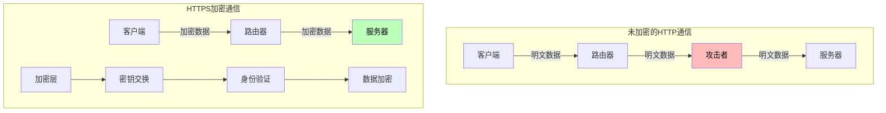

**根本原因分析**：为什么仅靠IP地址无法保证通信安全？

这个问题涉及到密码学的核心原理。TCP/IP协议只负责将数据从A点传输到B点，它不关心数据的内容，也不验证通信双方的身份。想象一下，你给朋友寄一封明信片，任何经手人都可以读取内容。这就是HTTP面临的困境。

TLS协议的出现正是为了解决这三个核心问题：

1. **机密性（Confidentiality）**：通过加密确保只有通信双方能够理解数据内容
2. **完整性（Integrity）**：通过消息认证码确保数据在传输过程中没有被篡改
3. **身份认证（Authentication）**：通过证书验证服务器（有时也包括客户端）的真实身份

### 1.2 TLS协议的工作原理

TLS协议位于TCP和应用层之间，它在TCP之上建立了一个安全通道。当应用层协议（如HTTP）通过TLS传输时，我们通常称之为HTTPS。

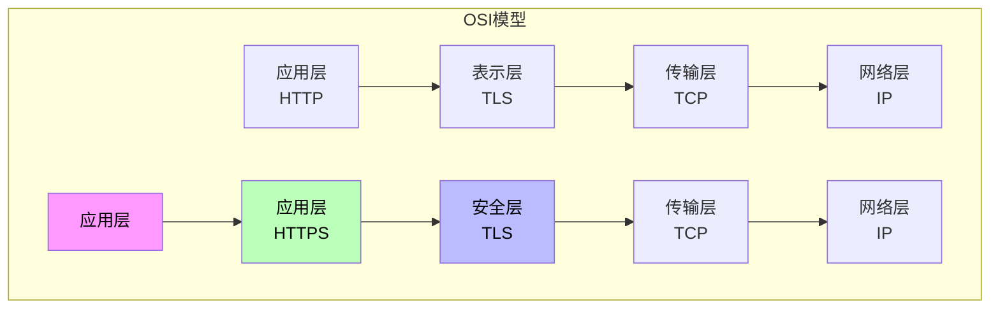

TLS协议由两个主要阶段组成：**握手阶段**和**加密通信阶段**。

#### 握手阶段详解

握手阶段是TLS最复杂的部分，它负责协商加密参数并完成身份验证：

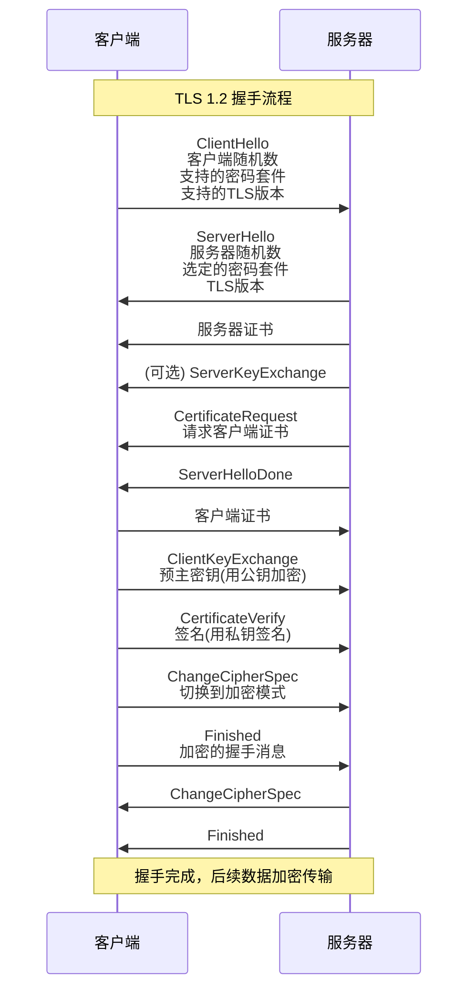

**握手阶段的关键步骤：**

1. **密码套件协商**：客户端告诉服务器自己支持的加密算法，服务器选择双方都支持的最优算法。

2. **证书验证**：服务器发送自己的证书，客户端验证证书的有效性（是否过期、是否由可信CA签发、域名是否匹配）。

3. **密钥交换**：双方使用非对称加密交换一个“预主密钥”（Pre-Master Secret），然后各自推导出最终的会话密钥。

4. **Finished消息**：双方发送加密的握手消息，验证之前的握手过程没有被篡改。

#### 密码套件

TLS密码套件（Cipher Suite）定义了具体的加密算法组合。一个典型的密码套件名称如`TLS_ECDHE_RSA_WITH_AES_256_GCM_SHA384`，其含义是：

- **ECDHE**：密钥交换算法（Elliptic Curve Diffie-Hellman Ephemeral）
- **RSA**：身份验证算法
- **AES_256_GCM**：对称加密算法（256位密钥，GCM模式）
- **SHA384**：哈希算法

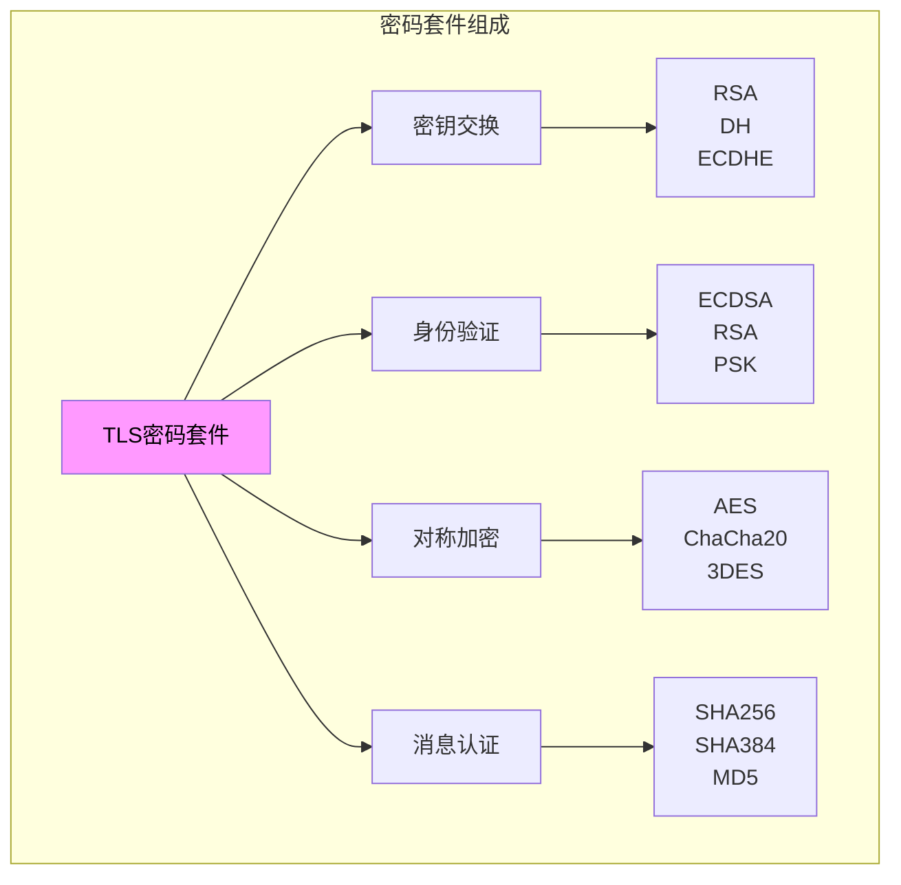

### 1.3 TLS版本演进

TLS协议经历了多个版本的演进，每个版本都修复了之前的安全问题：

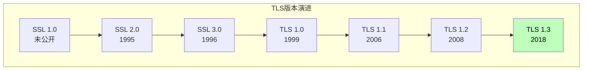

**TLS 1.3的重大改进：**

1. **简化的握手**：从2-RTT变为1-RTT，甚至0-RTT
2. **前向安全性**：默认使用ECDHE，每次会话使用新的密钥
3. **移除不安全算法**：废弃RSA密钥交换、MD5、SHA-224等
4. **更好的性能**：减少握手延迟，提升用户体验

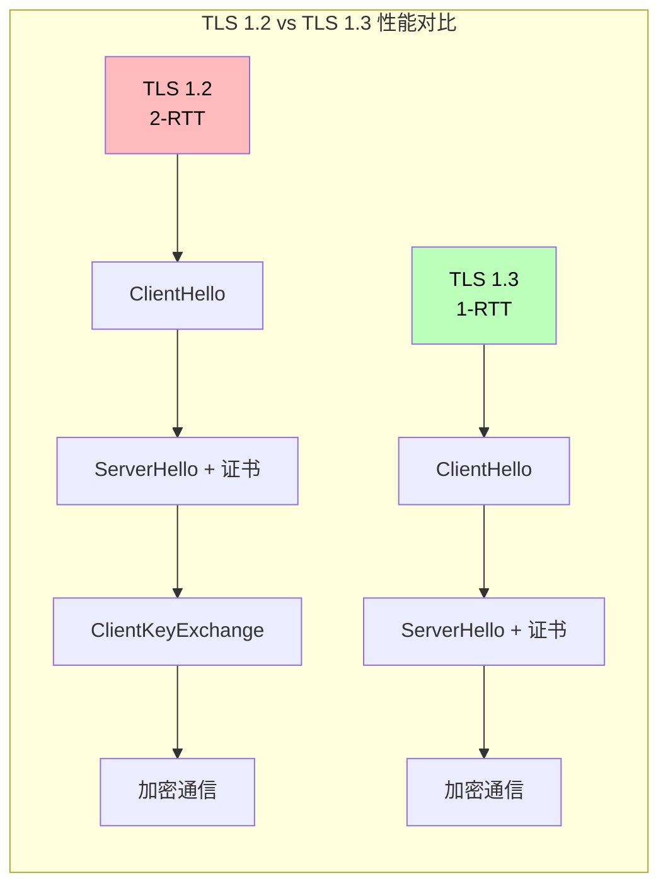

---

## 第二章：Go语言的TLS实现

### 2.1 crypto/tls标准库概述

Go语言的TLS实现位于`crypto/tls`标准库中，这是一个完全用Go语言实现的TLS库，不依赖任何外部C库。这在主流编程语言中是相当独特的设计。

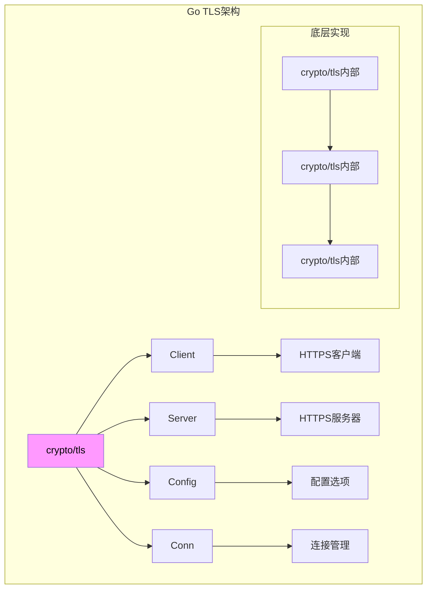

**为什么Go选择自研TLS库而不是使用OpenSSL？**

这个问题涉及到Go语言的核心设计哲学。有几个重要原因：

**第一，Go的运行时要求**。Go的垃圾回收器和协程调度器需要与底层系统调用精确配合。OpenSSL的C语言模型与Go的并发模型存在冲突，直接绑定会导致复杂的内存管理和线程安全问题。

**第二许可证问题**。OpenSSL采用双重许可证（SSLEay/OpenSSL许可证），在某些商业使用场景中可能带来法律风险。

**第三，可移植性**。纯Go实现使得Go程序可以在任何支持Go的平台上一致工作，不需要考虑系统是否安装了OpenSSL库。

**第四，API设计**。Go的tls.Config提供了更符合Go语言习惯的配置方式，比OpenSSL的C API更易用。

### 2.2 TLS Config详解

`tls.Config`是Go语言TLS配置的核心，它定义了客户端或服务器的所有TLS参数。

```go
package main

import (
    "crypto/tls"
    "crypto/x509"
    "fmt"
    "io/ioutil"
)

// 基础TLS配置
func basicConfig() *tls.Config {
    return &tls.Config{
        // 最小TLS版本
        MinVersion: tls.VersionTLS12,
        
        // 最大TLS版本（默认为TLS 1.3）
        MaxVersion: tls.VersionTLS13,
    }
}

// 客户端TLS配置
func clientConfig() *tls.Config {
    return &tls.Config{
        // 服务器名称，用于SNI（Server Name Indication）
        ServerName: "example.com",
        
        // 证书验证模式
        InsecureSkipVerify: false,  // 生产环境必须为false
        
        // 自定义根证书池
        RootCAs: loadRootCA(),
        
        // 客户端证书（用于双向认证）
        Certificates: []tls.Certificate{
            loadClientCert(),
        },
        
        // 跳过主机名验证（仅用于测试）
        // 不应在生产环境使用
        // InsecureSkipVerify: true
        
        // 密码套件偏好
        CipherSuites: []uint16{
            tls.TLS_AES_256_GCM_SHA384,
            tls.TLS_CHACHA20_POLY1305_SHA256,
            tls.TLS_ECDHE_RSA_WITH_AES_256_GCM_SHA384,
        },
        
        // 最小版本（TLS 1.2是目前的最低安全标准）
        MinVersion: tls.VersionTLS12,
        
        // 椭圆曲线偏好
        CurvePreferences: []tls.CurveID{
            tls.CurveP256,
            tls.X25519,
        },
    }
}

// 服务端TLS配置
func serverConfig() *tls.Config {
    return &tls.Config{
        // 服务端证书
        Certificates: []tls.Certificate{
            loadServerCert(),
        },
        
        // 客户端证书验证（双向认证时使用）
        ClientCAs: loadClientCAPool(),
        ClientAuth: tls.RequestClientCert,  // tls.NoClientCert, tls.RequestClientCert, tls.RequireAnyClientCert
        
        // 会话缓存
        SessionTicketsDisabled: false,
        // 生产环境建议使用固定会话票据密钥
        // SetSessionTicketKeys([]tls.SessionTicketKey{...})
    }
}

// 加载根证书
func loadRootCA() *x509.CertPool {
    certPool := x509.NewCertPool()
    ca, err := ioutil.ReadFile("ca.crt")
    if err != nil {
        fmt.Printf("Failed to read CA cert: %v\n", err)
        return nil
    }
    certPool.AppendCertsFromPEM(ca)
    return certPool
}
```

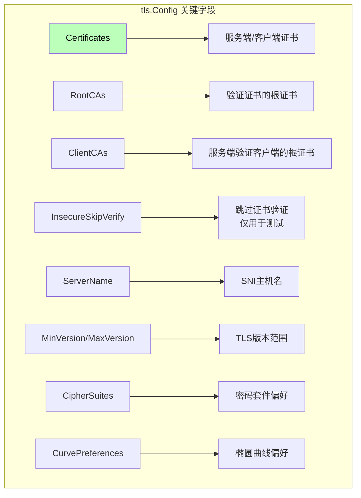

### 2.3 连接建立过程

Go语言的TLS连接建立过程遵循标准的TLS握手协议：

```go
package main

import (
    "crypto/tls"
    "fmt"
    "net"
    "time"
)

// 创建TLS连接
func dialTLS() {
    // 方式1：使用tls.Dial
    conn, err := tls.Dial("tcp", "example.com:443", &tls.Config{
        ServerName: "example.com",
    })
    if err != nil {
        fmt.Printf("Failed to connect: %v\n", err)
        return
    }
    defer conn.Close()
    
    // 获取连接状态
    state := conn.ConnectionState()
    fmt.Printf("TLS Version: %d\n", state.Version)
    fmt.Printf("Cipher Suite: %d\n", state.CipherSuite)
    fmt.Printf("Server Name: %s\n", state.ServerName)
    
    // 使用连接发送请求
    fmt.Fprintf(conn, "GET / HTTP/1.1\r\nHost: example.com\r\n\r\n")
    
    // 读取响应
    buf := make([]byte, 4096)
    n, _ := conn.Read(buf)
    fmt.Printf("Response: %s\n", string(buf[:n]))
}

// 方式2：使用net.Conn + tls.Client
func dialWithNetConn() {
    // 创建底层TCP连接
    rawConn, err := net.DialTimeout("tcp", "example.com:443", 5*time.Second)
    if err != nil {
        fmt.Printf("Failed to dial: %v\n", err)
        return
    }
    
    // 包装为TLS连接
    tlsConn := tls.Client(rawConn, &tls.Config{
        ServerName: "example.com",
    })
    
    // 手动触发握手
    err = tlsConn.Handshake()
    if err != nil {
        fmt.Printf("Handshake failed: %v\n", err)
        return
    }
    
    fmt.Printf("Handshake successful, version: %d\n", tlsConn.ConnectionState().Version)
}
```

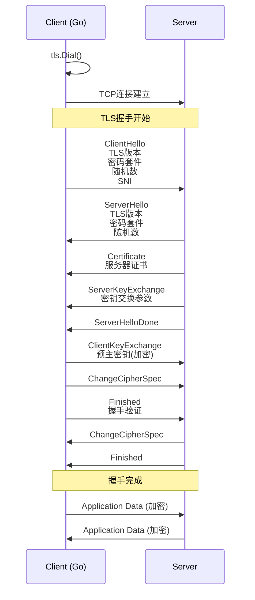

---

## 第三章：HTTPS客户端实战

### 3.1 基础HTTPS请求

在Go语言中，发送HTTPS请求有两种主要方式：使用`http.Client`和直接使用`crypto/tls`包。

```go
package main

import (
    "crypto/tls"
    "fmt"
    "io/ioutil"
    "net/http"
    "time"
)

// 方式1：使用http.Get（最简单）
func simpleGet() {
    resp, err := http.Get("https://example.com")
    if err != nil {
        fmt.Printf("Request failed: %v\n", err)
        return
    }
    defer resp.Body.Close()
    
    body, _ := ioutil.ReadAll(resp.Body)
    fmt.Printf("Status: %s\n", resp.Status)
    fmt.Printf("Body length: %d\n", len(body))
}

// 方式2：使用http.Client（推荐）
func clientGet() {
    client := &http.Client{
        Timeout: 30 * time.Second,
    }
    
    resp, err := client.Get("https://example.com")
    if err != nil {
        fmt.Printf("Request failed: %v\n", err)
        return
    }
    defer resp.Body.Close()
    
    body, _ := ioutil.ReadAll(resp.Body)
    fmt.Printf("Status: %s\n", resp.Status)
    fmt.Printf("Body length: %d\n", len(body))
}

// 方式3：自定义TLS配置
func customTLSClient() {
    // 创建自定义Transport（可复用）
    transport := &http.Transport{
        TLSClientConfig: &tls.Config{
            ServerName: "example.com",
            MinVersion: tls.VersionTLS12,
            // 可以添加证书验证逻辑
        },
        // 连接池配置
        MaxIdleConns:        100,
        MaxIdleConnsPerHost: 100,
        IdleConnTimeout:     90 * time.Second,
    }
    
    client := &http.Client{
        Transport: transport,
        Timeout:   30 * time.Second,
        // 重定向策略
        CheckRedirect: func(req *http.Request, via []*http.Request) error {
            // 不自动跟随重定向
            return http.ErrUseLastResponse
            // 或者 return nil 自动跟随
        },
    }
    
    resp, err := client.Get("https://example.com")
    if err != nil {
        fmt.Printf("Request failed: %v\n", err)
        return
    }
    defer resp.Body.Close()
    
    fmt.Printf("Status: %s\n", resp.Status)
}
```

### 3.2 证书处理

在生产环境中，证书处理是一个关键的安全环节。Go提供了多种方式来管理证书。

```go
package main

import (
    "crypto/tls"
    "crypto/x509"
    "fmt"
    "io/ioutil"
)

// 使用自定义根证书
func customRootCA() {
    // 加载自定义CA证书
    caCert, err := ioutil.ReadFile("/path/to/ca.crt")
    if err != nil {
        fmt.Printf("Failed to read CA: %v\n", err)
        return
    }
    
    // 创建证书池
    certPool := x509.NewCertPool()
    if !certPool.AppendCertsFromPEM(caCert) {
        fmt.Println("Failed to add CA cert")
        return
    }
    
    // 创建自定义Transport
    transport := &http.Transport{
        TLSClientConfig: &tls.Config{
            RootCAs: certPool,
        },
    }
    
    client := &http.Client{Transport: transport}
    resp, _ := client.Get("https://internal.example.com")
    if resp != nil {
        defer resp.Body.Close()
        fmt.Printf("Status: %s\n", resp.Status)
    }
}

// 加载客户端证书（双向认证）
func clientCertificate() {
    // 加载客户端证书和私钥
    cert, err := tls.LoadX509KeyPair(
        "client.crt",
        "client.key",
    )
    if err != nil {
        fmt.Printf("Failed to load client cert: %v\n", err)
        return
    }
    
    transport := &http.Transport{
        TLSClientConfig: &tls.Config{
            Certificates: []tls.Certificate{cert},
        },
    }
    
    client := &http.Client{Transport: transport}
    resp, _ := client.Get("https://mtls.example.com")
    if resp != nil {
        defer resp.Body.Close()
        fmt.Printf("Status: %s\n", resp.Status)
    }
}

// 验证服务器证书（自定义验证逻辑）
func customCertificateValidation() {
    // 创建自定义Transport
    transport := &http.Transport{
        TLSClientConfig: &tls.Config{
            // 禁用默认验证
            InsecureSkipVerify: false,
            
            // 自定义验证回调
            VerifyPeerCertificate: func(rawCerts [][]byte, verifiedChains [][]*x509.Certificate) error {
                // rawCerts是服务器发送的证书链
                // verifiedChains是Go验证后的证书链
                
                fmt.Printf("Received %d certificates in chain\n", len(rawCerts))
                
                // 自定义验证逻辑
                // 例如：检查证书的特定扩展
                for _, cert := range verifiedChains {
                    for _, c := range cert {
                        fmt.Printf("Verified cert: %s\n", c.Subject.CommonName)
                    }
                }
                
                return nil  // 返回nil表示验证通过
            },
        },
    }
    
    client := &http.Client{Transport: transport}
    resp, _ := client.Get("https://example.com")
    if resp != nil {
        defer resp.Body.Close()
    }
}
```

**根本原因分析**：为什么需要自定义证书验证？

标准证书验证在大多数情况下已经足够，但以下场景需要自定义验证：

1. **内部PKI**：企业使用自己的CA，这些CA不在系统根证书库中
2. **证书固定**：需要严格验证特定的证书，防止中间人攻击
3. **特殊要求**：需要检查证书的特定扩展或属性
4. **调试目的**：需要查看证书链的详细信息

### 3.3 SNI（Server Name Indication）

SNI是TLS协议的一个重要扩展，它允许客户端在握手时指定要访问的服务器名称。这使得同一个IP地址可以托管多个HTTPS站点。

```go
package main

import (
    "crypto/tls"
    "fmt"
)

// SNI示例：访问特定虚拟主机
func sniExample() {
    // 方式1：通过ServerName设置
    config := &tls.Config{
        ServerName: "vhost1.example.com",
    }
    
    conn, err := tls.Dial("tcp", "192.168.1.1:443", config)
    if err != nil {
        fmt.Printf("Dial failed: %v\n", err)
        return
    }
    defer conn.Close()
    
    // 握手会自动使用ServerName
    fmt.Printf("Connected to: %s\n", conn.ConnectionState().ServerName)
}

// 访问多个虚拟主机
func multiVHostExample() {
    vhosts := []string{
        "site1.example.com",
        "site2.example.com",
    }
    
    for _, vhost := range vhosts {
        config := &tls.Config{
            ServerName: vhost,
        }
        
        conn, err := tls.Dial("tcp", "192.168.1.1:443", config)
        if err != nil {
            fmt.Printf("Failed to connect to %s: %v\n", vhost, err)
            continue
        }
        
        state := conn.ConnectionState()
        fmt.Printf("%s -> %s, Version: %d\n", vhost, state.ServerName, state.Version)
        conn.Close()
    }
}
```

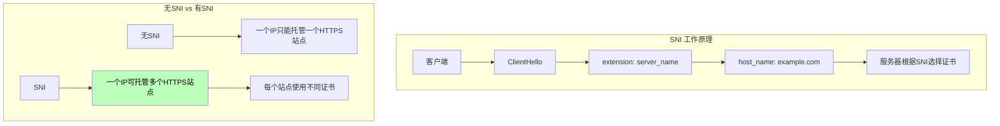

### 3.4 会话复用

TLS握手是一个耗时的操作，特别是对于需要频繁建立连接的场景。Go支持会话票据（Session Ticket）来复用之前建立的会话。

```go
package main

import (
    "crypto/tls"
    "fmt"
    "time"
)

// 会话票据示例
func sessionResumption() {
    // 第一次请求：完整握手
    config1 := &tls.Config{
        ServerName: "example.com",
    }
    
    conn1, err := tls.Dial("tcp", "example.com:443", config1)
    if err != nil {
        fmt.Printf("First dial failed: %v\n", err)
        return
    }
    defer conn1.Close()
    
    state1 := conn1.ConnectionState()
    fmt.Printf("First handshake: %v, Version: %d\n", 
        state1.HandshakeComplete, state1.Version)
    
    // 第二次请求：尝试复用会话
    // 使用相同的配置，Go会自动使用之前获取的会话票据
    config2 := &tls.Config{
        ServerName: "example.com",
    }
    
    conn2, err := tls.Dial("tcp", "example.com:443", config2)
    if err != nil {
        fmt.Printf("Second dial failed: %v\n", err)
        return
    }
    defer conn2.Close()
    
    state2 := conn2.ConnectionState()
    fmt.Printf("Second handshake: %v, DidResume: %v\n", 
        state2.HandshakeComplete, state2.DidResume)
    
    // DidResume为true表示会话被复用
}

// 使用http.Client的会话缓存
func httpSessionCache() {
    // 创建会话缓存
    cache := &tls.ClientSessionCache{}
    
    client := &http.Client{
        Transport: &http.Transport{
            TLSClientConfig: &tls.Config{
                ServerName:         "example.com",
                ClientSessionCache: cache,
            },
        },
    }
    
    // 第一次请求
    client.Get("https://example.com")
    
    // 第二次请求会自动使用缓存的会话
    client.Get("https://example.com")
}
```

**根本原因分析**：会话票据如何工作？

会话票据的核心思想是：

1. 首次握手时，服务器生成一个加密的会话票据（包含会话密钥），发送给客户端
2. 客户端保存这个票据
3. 重连时，客户端发送这个票据，服务器解密后恢复会话密钥
4. 双方可以直接跳到加密通信阶段，省去密钥交换步骤

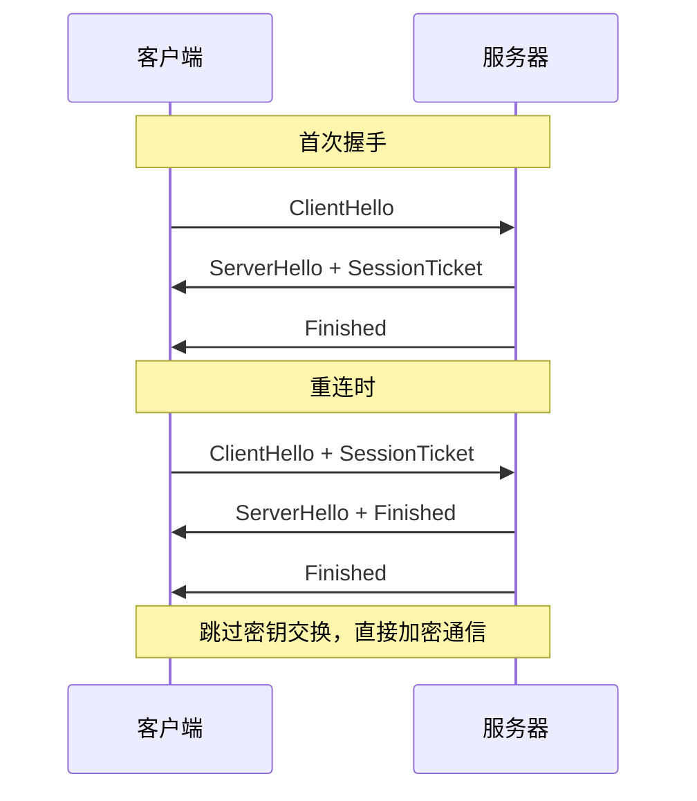

---

## 第四章：HTTPS服务端实战

### 4.1 创建HTTPS服务器

Go语言创建HTTPS服务器非常直接，只需要几行代码即可：

```go
package main

import (
    "fmt"
    "net/http"
)

// 简单HTTPS服务器
func simpleServer() {
    mux := http.NewServeMux()
    mux.HandleFunc("/", func(w http.ResponseWriter, r *http.Request) {
        fmt.Fprintf(w, "Hello, HTTPS!")
    })
    
    // 启动HTTPS服务器
    // 直接监听443端口
    err := http.ListenAndServe(":443", mux)
    if err != nil {
        fmt.Printf("Server failed: %v\n", err)
    }
}

// 使用tls.Listen
func tlsListenServer() {
    // 创建TLS配置
    cert, err := tls.LoadX509KeyPair("server.crt", "server.key")
    if err != nil {
        fmt.Printf("Failed to load cert: %v\n", err)
        return
    }
    
    config := &tls.Config{
        Certificates: []tls.Certificate{cert},
        // 可以添加更多配置
        MinVersion: tls.VersionTLS12,
    }
    
    // 创建TLS监听器
    listener, err := tls.Listen("tcp", ":8443", config)
    if err != nil {
        fmt.Printf("Failed to listen: %v\n", err)
        return
    }
    
    // 接受连接
    for {
        conn, err := listener.Accept()
        if err != nil {
            fmt.Printf("Accept failed: %v\n", err)
            continue
        }
        
        // 处理连接
        go handleConnection(conn)
    }
}

func handleConnection(conn net.Conn) {
    defer conn.Close()
    
    // 使用http包处理
    http.Serve(&listener{conn}, nil)
}

type listener struct {
    net.Conn
}

func (l *listener) Read(b []byte) (int, error) {
    return l.Conn.Read(b)
}

func (l *listener) Write(b []byte) (int, error) {
    return l.Conn.Write(b)
}
```

### 4.2 自动HTTPS（Let's Encrypt）

Let's Encrypt是一个免费的自动化证书颁发机构，Go可以通过第三方库实现自动HTTPS。

```go
package main

import (
    "fmt"
    "log"
    
    "github.com/go-acme/lego/v4/certcrypto"
    "github.com/go-acme/lego/v4/certificate"
    "github.com/go-acme/lego/v4/lego"
    "github.com/go-acme/lego/v4/providers/http/webroot"
    "github.com/go-acme/lego/v4/registration"
)

// Let's Encrypt配置
type LEConfig struct {
    Email   string
    Domains []string
    Path    string  // 验证文件存放路径
}

// 获取Let's Encrypt证书
func getLetsEncryptCert(config LEConfig) (*certificate.Resource, error) {
    // 创建用户
    user := MyUser{Email: config.Email}
    
    // 创建客户端
    client, err := lego.NewClient(lego.Config{
        TLSKey:  "user",
        TLSEmail: config.Email,
        CADirURL: "https://acme-v02.api.letsencrypt.org/directory",
        KeyType: certcrypto.RSA2048,
    })
    if err != nil {
        return nil, err
    }
    
    // 注册用户
    reg, err := client.Registration.Register(registration.RegisterOptions{
        TermsOfServiceAgreed: true,
    })
    if err != nil {
        return nil, err
    }
    user.Registration = reg
    
    // HTTP验证
    provider := webroot.NewWebroot(map[string]string{
        ".well-known/acme-challenge": config.Path,
    })
    
    // 手动处理挑战（简化版）
    // 实际使用中需要启动HTTP服务器来处理验证请求
    
    // 请求证书
    request := certificate.ObtainRequest{
        Domains: config.Domains,
        AuthzURL: "https://acme-v02.api.letsencrypt.org/acme/authz-v1/...",
        Cert: certificate.Resource{
            Domain: config.Domains[0],
        },
    }
    
    return client.Certificates.Obtain(request)
}
```

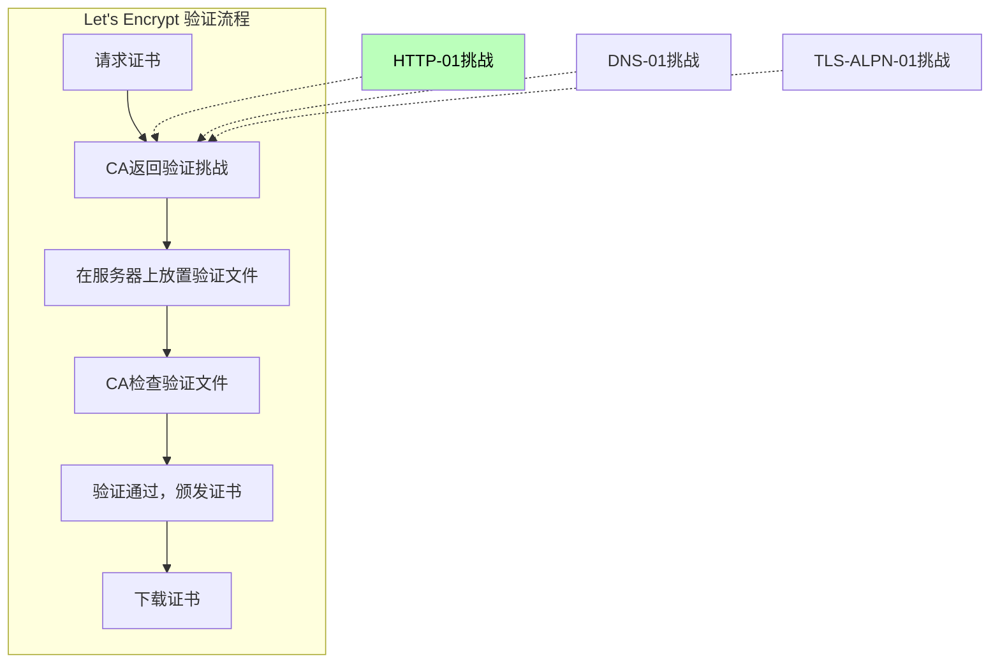

### 4.3 服务端双向认证（mTLS）

在某些高安全要求的场景下，需要对客户端也进行身份验证，这就是双向TLS认证（mTLS）。

```go
package main

import (
    "crypto/tls"
    "crypto/x509"
    "fmt"
    "io/ioutil"
    "net/http"
)

// 创建支持mTLS的HTTPS服务器
func mtlsServer() {
    // 加载服务端证书
    serverCert, err := tls.LoadX509KeyPair("server.crt", "server.key")
    if err != nil {
        fmt.Printf("Failed to load server cert: %v\n", err)
        return
    }
    
    // 加载客户端CA证书
    clientCA, err := ioutil.ReadFile("client-ca.crt")
    if err != nil {
        fmt.Printf("Failed to read client CA: %v\n", err)
        return
    }
    
    certPool := x509.NewCertPool()
    certPool.AppendCertsFromPEM(clientCA)
    
    // 创建TLS配置
    config := &tls.Config{
        Certificates: []tls.Certificate{serverCert},
        ClientCAs:    certPool,
        ClientAuth:   tls.RequestClientCert,  // 请求客户端证书
        // 或 tls.RequireAnyClientCert 强制要求
    }
    
    server := &http.Server{
        Addr:      ":8443",
        TLSConfig: config,
        Handler:   handler(),
    }
    
    err = server.ListenAndServeTLS("", "")
    if err != nil {
        fmt.Printf("Server failed: %v\n", err)
    }
}

func handler() http.Handler {
    mux := http.NewServeMux()
    mux.HandleFunc("/", func(w http.ResponseWriter, r *http.Request) {
        // 获取客户端证书信息
        if r.TLS != nil && len(r.TLS.PeerCertificates) > 0 {
            clientCert := r.TLS.PeerCertificates[0]
            fmt.Printf("Client: %s\n", clientCert.Subject.CommonName)
        }
        fmt.Fprintf(w, "MTLS认证成功!")
    })
    return mux
}

// mTLS客户端
func mtlsClient() {
    // 加载客户端证书
    cert, err := tls.LoadX509KeyPair("client.crt", "client.key")
    if err != nil {
        fmt.Printf("Failed to load client cert: %v\n", err)
        return
    }
    
    // 加载服务器CA证书
    caCert, err := ioutil.ReadFile("server-ca.crt")
    if err != nil {
        fmt.Printf("Failed to read server CA: %v\n", err)
        return
    }
    
    certPool := x509.NewCertPool()
    certPool.AppendCertsFromPEM(caCert)
    
    // 创建客户端
    client := &http.Client{
        Transport: &http.Transport{
            TLSClientConfig: &tls.Config{
                Certificates:     []tls.Certificate{cert},
                RootCAs:         certPool,
                InsecureSkipVerify: false,
            },
        },
    }
    
    resp, err := client.Get("https://server:8443")
    if err != nil {
        fmt.Printf("Request failed: %v\n", err)
        return
    }
    defer resp.Body.Close()
    
    fmt.Printf("Status: %s\n", resp.Status)
}
```

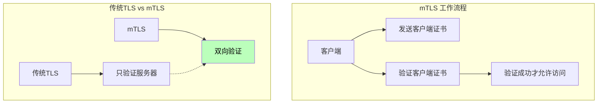

---

## 第五章：深度理解TLS连接

### 5.1 连接状态详解

TLS连接建立后，可以获取丰富的连接状态信息：

```go
package main

import (
    "crypto/tls"
    "fmt"
    "net"
)

// 连接状态分析
func analyzeConnectionState(conn *tls.Conn) {
    state := conn.ConnectionState()
    
    fmt.Printf("TLS版本: %d\n", state.Version)
    fmt.Printf("握手完成: %v\n", state.HandshakeComplete)
    fmt.Printf("会话复用: %v\n", state.DidResume)
    fmt.Printf("密码套件: %d\n", state.CipherSuite)
    fmt.Printf("服务器名称: %s\n", state.ServerName)
    fmt.Printf("证书链长度: %d\n", len(state.PeerCertificates))
    
    // 打印证书信息
    for i, cert := range state.PeerCertificates {
        fmt.Printf("证书 %d: %s\n", i+1, cert.Subject.CommonName)
        fmt.Printf("  颁发给: %s\n", cert.Issuer.CommonName)
        fmt.Printf("  有效期: %s - %s\n", 
            cert.NotBefore.Format("2006-01-02"), 
            cert.NotAfter.Format("2006-01-02"))
    }
    
    // TLS 1.3特定信息
    if state.Version == tls.VersionTLS13 {
        fmt.Printf("协商的签名算法: %d\n", state.SignatureAlgorithm)
    }
}

// 将版本号转换为字符串
func versionString(version uint16) string {
    switch version {
    case tls.VersionTLS10:
        return "TLS 1.0"
    case tls.VersionTLS11:
        return "TLS 1.1"
    case tls.VersionTLS12:
        return "TLS 1.2"
    case tls.VersionTLS13:
        return "TLS 1.3"
    default:
        return fmt.Sprintf("Unknown (%d)", version)
    }
}

// 将密码套件ID转换为名称
func cipherSuiteString(suite uint16) string {
    suites := map[uint16]string{
        tls.TLS_ECDHE_RSA_WITH_AES_128_GCM_SHA256:   "TLS_ECDHE_RSA_WITH_AES_128_GCM_SHA256",
        tls.TLS_ECDHE_RSA_WITH_AES_256_GCM_SHA384:   "TLS_ECDHE_RSA_WITH_AES_256_GCM_SHA384",
        tls.TLS_CHACHA20_POLY1305_SHA256:           "TLS_CHACHA20_POLY1305_SHA256",
        tls.TLS_AES_256_GCM_SHA384:                  "TLS_AES_256_GCM_SHA384",
        tls.TLS_AES_128_GCM_SHA256:                  "TLS_AES_128_GCM_SHA256",
    }
    return suites[suite]
}
```

### 5.2 自定义TLS连接行为

```go
package main

import (
    "crypto/tls"
    "fmt"
    "net"
    "time"
)

// 创建自定义TLS连接
func customTLSConnection() {
    // 创建底层TCP连接
    rawConn, err := net.DialTimeout("tcp", "example.com:443", 5*time.Second)
    if err != nil {
        fmt.Printf("Dial failed: %v\n", err)
        return
    }
    
    // 配置TLS
    tlsConfig := &tls.Config{
        ServerName:         "example.com",
        MinVersion:         tls.VersionTLS12,
        MaxVersion:         tls.VersionTLS13,
        InsecureSkipVerify: false,
        
        // 握手超时
        HandshakeTimeout: 10 * time.Second,
        
        // 连接超时
        ReadTimeout:  30 * time.Second,
        WriteTimeout: 30 * time.Second,
    }
    
    // 创建TLS客户端
    conn := tls.Client(rawConn, tlsConfig)
    
    // 手动触发握手
    err = conn.Handshake()
    if err != nil {
        fmt.Printf("Handshake failed: %v\n", err)
        return
    }
    
    fmt.Printf("Handshake successful\n")
    state := conn.ConnectionState()
    fmt.Printf("Version: %d\n", state.Version)
    fmt.Printf("CipherSuite: %d\n", state.CipherSuite)
    
    // 使用连接
    fmt.Fprintf(conn, "GET / HTTP/1.1\r\nHost: example.com\r\n\r\n")
    
    // 关闭连接
    conn.Close()
}
```

### 5.3 连接池与性能

```go
package main

import (
    "crypto/tls"
    "fmt"
    "net/http"
    "sync"
    "time"
)

// 自定义HTTP Transport以优化TLS性能
func optimizedTransport() *http.Transport {
    return &http.Transport{
        TLSClientConfig: &tls.Config{
            // 最小TLS版本
            MinVersion: tls.VersionTLS12,
            
            // 椭圆曲线偏好
            CurvePreferences: []tls.CurveID{
                tls.CurveP256,
                tls.X25519,
            },
            
            // 密码套件偏好
            CipherSuites: []uint16{
                tls.TLS_AES_256_GCM_SHA384,
                tls.TLS_CHACHA20_POLY1305_SHA256,
                tls.TLS_ECDHE_RSA_WITH_AES_256_GCM_SHA384,
            },
        },
        
        // 连接池配置
        MaxIdleConns:        100,           // 最大空闲连接数
        MaxIdleConnsPerHost: 100,           // 每个主机的最大空闲连接
        IdleConnTimeout:     90 * time.Second,  // 空闲连接超时
        
        // TCP连接配置
        DialContext: (&net.Dialer{
            Timeout:   5 * time.Second,
            KeepAlive: 30 * time.Second,
        }).DialContext,
        
        // TLS握手超时
        TLSHandshakeTimeout: 10 * time.Second,
        
        // 期望的响应头
        ExpectContinueTimeout: 1 * time.Second,
        
        // 响应头大小限制
        ResponseHeaderTimeout: 10 * time.Second,
    }
}

// 高性能HTTP客户端
type HighPerformanceClient struct {
    client  *http.Client
    mu      sync.Mutex
    requests int64
}

func NewHighPerformanceClient() *HighPerformanceClient {
    return &HighPerformanceClient{
        client: &http.Client{
            Transport: optimizedTransport(),
            Timeout:   30 * time.Second,
            
            // 使用 ClientSessionCache 加速重复连接
            CheckRedirect: func(req *http.Request, via []*http.Request) error {
                return nil
            },
        },
    }
}

func (c *HighPerformanceClient) Get(url string) (*http.Response, error) {
    c.mu.Lock()
    c.requests++
    c.mu.Unlock()
    
    return c.client.Get(url)
}

// 全局客户端复用
var globalClient = &http.Client{
    Transport: optimizedTransport(),
    Timeout:   30 * time.Second,
}

func globalClientExample() {
    // 在应用生命周期内复用全局客户端
    resp, _ := globalClient.Get("https://api.example.com/data")
    if resp != nil {
        defer resp.Body.Close()
    }
}
```

---

## 第六章：常见问题与解决方案

### 6.1 证书相关问题

```go
package main

import (
    "crypto/tls"
    "crypto/x509"
    "fmt"
)

// 问题1：证书过期
func handleExpiredCert() {
    // 证书过期通常表现为握手失败
    conn, err := tls.Dial("tcp", "expired.example.com:443", &tls.Config{
        ServerName: "expired.example.com",
    })
    if err != nil {
        fmt.Printf("连接失败: %v\n", err)
        // 解决方案：更新证书
        return
    }
    defer conn.Close()
}

// 问题2：自签名证书
func handleSelfSignedCert() {
    // 加载自签名CA
    certPool := x509.NewCertPool()
    // 添加你的CA证书
    
    conn, err := tls.Dial("tcp", "internal.example.com:443", &tls.Config{
        ServerName: "internal.example.com",
        RootCAs:    certPool,
    })
    if err != nil {
        fmt.Printf("连接失败: %v\n", err)
        return
    }
    defer conn.Close()
}

// 问题3：主机名不匹配
func handleHostMismatch() {
    // 尝试连接，但服务器证书的CN与实际主机名不匹配
    // 错误信息类似: certificate is valid for example.com, not api.example.com
    
    // 解决方案1：使用正确的域名
    conn, _ := tls.Dial("tcp", "example.com:443", &tls.Config{
        ServerName: "example.com",
    })
    
    // 解决方案2：暂时跳过验证（仅用于测试）
    conn, _ = tls.Dial("tcp", "example.com:443", &tls.Config{
        ServerName:         "example.com",
        InsecureSkipVerify: true,
    })
}

// 问题4：证书链不完整
func handleIncompleteChain() {
    // 服务器没有发送完整的证书链
    // Go会返回: certificate signed by unknown authority
    
    // 解决方案：添加中间证书到根证书池
    // 或者让服务器配置完整的证书链
}

// 问题5：弱加密算法
func handleWeakCipher() {
    // 服务器只支持弱加密算法（如TLS 1.0/1.1的某些算法）
    // Go会拒绝连接并返回错误
    
    // 解决方案：更新服务器配置，禁用弱算法
    conn, err := tls.Dial("tcp", "old-server.example.com:443", &tls.Config{
        ServerName:   "old-server.example.com",
        MinVersion:   tls.VersionTLS12,  // 强制TLS 1.2+
        MaxVersion:   tls.VersionTLS13,
    })
    if err != nil {
        fmt.Printf("服务器不支持TLS 1.2+: %v\n", err)
    }
}
```

### 6.2 连接超时问题

```go
package main

import (
    "crypto/tls"
    "fmt"
    "net"
    "time"
)

// 处理各种超时场景
func handleTimeouts() {
    // 场景1：连接超时
    dialer := &net.Dialer{
        Timeout: 5 * time.Second,
    }
    
    conn, err := tls.DialWithDialer(dialer, "tcp", "slow.example.com:443", &tls.Config{
        ServerName: "slow.example.com",
    })
    if err != nil {
        fmt.Printf("连接超时: %v\n", err)
        return
    }
    defer conn.Close()
    
    // 场景2：握手超时
    tlsConfig := &tls.Config{
        ServerName:       "slow.example.com",
        HandshakeTimeout: 15 * time.Second,
    }
    
    conn2, err := tls.Dial("tcp", "slow.example.com:443", tlsConfig)
    if err != nil {
        fmt.Printf("握手超时: %v\n", err)
        return
    }
    defer conn2.Close()
    
    // 场景3：读/写超时
    conn3, _ := tls.Dial("tcp", "slow.example.com:443", &tls.Config{
        ServerName: "slow.example.com",
    })
    conn3.SetReadDeadline(time.Now().Add(10 * time.Second))
    conn3.SetWriteDeadline(time.Now().Add(10 * time.Second))
    
    // 读写操作...
    conn3.Close()
}
```

### 6.3 性能问题

```go
package main

import (
    "crypto/tls"
    "fmt"
    "runtime"
    "time"
)

// 诊断TLS性能问题
func diagnoseTLSPerformance() {
    // 打印TLS相关运行时统计
    var memStats runtime.MemStats
    runtime.ReadMemStats(&memStats)
    
    // 创建大量TLS连接进行测试
    for i := 0; i < 100; i++ {
        conn, err := tls.Dial("tcp", "example.com:443", &tls.Config{
            ServerName: "example.com",
        })
        if err != nil {
            fmt.Printf("连接 %d 失败: %v\n", i, err)
            continue
        }
        
        // 获取连接状态
        state := conn.ConnectionState()
        fmt.Printf("连接 %d: 版本=%d, 握手=%v\n", 
            i, state.Version, state.HandshakeComplete)
        
        conn.Close()
        
        // 短暂延迟避免太快
        time.Sleep(10 * time.Millisecond)
    }
}
```

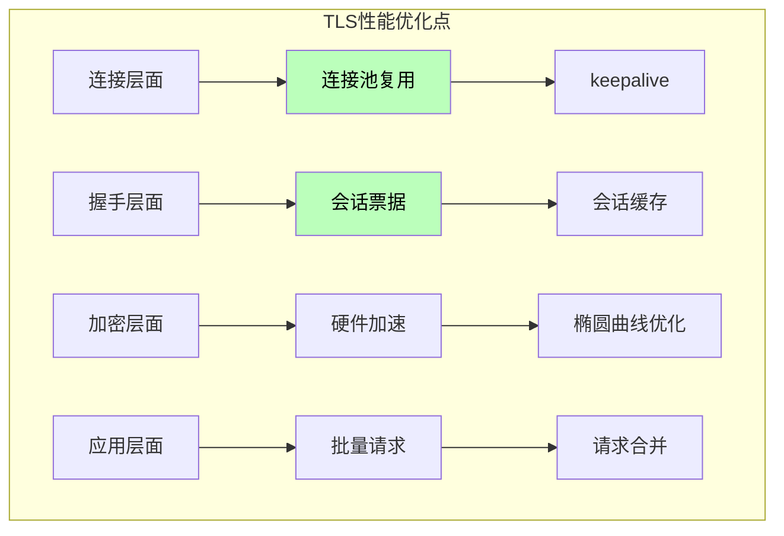

---

## 第七章：安全最佳实践

### 7.1 TLS配置安全检查清单

```go
package main

import (
    "crypto/tls"
    "fmt"
)

// TLS安全配置检查
type TLSSecurityChecker struct {
    config *tls.Config
}

func NewTLSSecurityChecker(config *tls.Config) *TLSSecurityChecker {
    return &TLSSecurityChecker{config: config}
}

func (c *TLSSecurityChecker) Check() []string {
    issues := []string{}
    
    // 检查1：TLS版本
    if c.config.MinVersion < tls.VersionTLS12 {
        issues = append(issues, "警告: 允许TLS 1.1或更低版本")
    }
    
    // 检查2：密码套件
    weakCiphers := []uint16{
        tls.TLS_RSA_WITH_RC4_128_SHA,
        tls.TLS_RSA_WITH_3DES_EDE_CBC_SHA,
        tls.TLS_ECDHE_RSA_WITH_RC4_128_SHA,
        tls.TLS_ECDHE_ECDSA_WITH_RC4_128_SHA,
    }
    
    for _, cipher := range c.config.CipherSuites {
        for _, weak := range weakCiphers {
            if cipher == weak {
                issues = append(issues, fmt.Sprintf("警告: 使用弱密码套件 %d", cipher))
            }
        }
    }
    
    // 检查3：证书验证
    if c.config.InsecureSkipVerify {
        issues = append(issues, "严重: 跳过证书验证")
    }
    
    return issues
}

// 推荐的安全配置
func recommendedServerConfig() *tls.Config {
    return &tls.Config{
        // 最低TLS 1.2
        MinVersion: tls.VersionTLS12,
        
        // 禁用已废弃的密码套件
        CipherSuites: []uint16{
            // TLS 1.3密码套件
            tls.TLS_AES_256_GCM_SHA384,
            tls.TLS_CHACHA20_POLY1305_SHA256,
            // TLS 1.2密码套件
            tls.TLS_ECDHE_RSA_WITH_AES_256_GCM_SHA384,
            tls.TLS_ECDHE_RSA_WITH_CHACHA20_POLY1305_SHA256,
            tls.TLS_ECDHE_ECDSA_WITH_AES_256_GCM_SHA384,
        },
        
        // 椭圆曲线偏好
        CurvePreferences: []tls.CurveID{
            tls.X25519,
            tls.CurveP256,
        },
        
        // 禁用TLS 1.3之前版本的会话票据
        // 因为TLS 1.3的会话票据是加密的
        SessionTicketsDisabled: false,
        
        // 可以添加固定会话票据密钥
        // SetSessionTicketKeys(keys []tls.SessionTicketKey)
    }
}

func recommendedClientConfig() *tls.Config {
    return &tls.Config{
        // 最低TLS 1.2
        MinVersion: tls.VersionTLS12,
        
        // 优先使用TLS 1.3
        MaxVersion: tls.VersionTLS13,
        
        // 不验证服务器证书？不，永远不要在生产环境这样做
        InsecureSkipVerify: false,
        
        // 密码套件偏好
        CipherSuites: []uint16{
            tls.TLS_AES_256_GCM_SHA384,
            tls.TLS_CHACHA20_POLY1305_SHA256,
            tls.TLS_ECDHE_RSA_WITH_AES_256_GCM_SHA384,
        },
    }
}
```

### 7.2 证书管理最佳实践

```go
package main

import (
    "crypto/tls"
    "crypto/x509"
    "fmt"
    "io/ioutil"
    "path/filepath"
    "time"
)

// 证书轮换管理
type CertManager struct {
    certPath string
    keyPath  string
    caPath   string
    
    currentCert   tls.Certificate
    currentCAPool *x509.CertPool
    
    lastReload time.Time
    reloadInterval time.Duration
}

func NewCertManager(certPath, keyPath, caPath string, reloadInterval time.Duration) *CertManager {
    cm := &CertManager{
        certPath:       certPath,
        keyPath:       keyPath,
        caPath:        caPath,
        reloadInterval: reloadInterval,
    }
    
    cm.reload()
    return cm
}

func (cm *CertManager) reload() {
    // 重新加载证书
    cert, err := tls.LoadX509KeyPair(cm.certPath, cm.keyPath)
    if err != nil {
        fmt.Printf("Failed to load cert: %v\n", err)
        return
    }
    
    // 加载CA证书
    caData, err := ioutil.ReadFile(cm.caPath)
    if err != nil {
        fmt.Printf("Failed to read CA: %v\n", err)
        return
    }
    
    caPool := x509.NewCertPool()
    caPool.AppendCertsFromPEM(caData)
    
    cm.currentCert = cert
    cm.currentCAPool = caPool
    cm.lastReload = time.Now()
    
    fmt.Printf("Certificates reloaded at %v\n", cm.lastReload)
}

func (cm *CertManager) ShouldReload() bool {
    return time.Since(cm.lastReload) > cm.reloadInterval
}

func (cm *CertManager) GetConfig() *tls.Config {
    if cm.ShouldReload() {
        cm.reload()
    }
    
    return &tls.Config{
        Certificates: []tls.Certificate{cm.currentCert},
        ClientCAs:    cm.currentCAPool,
        MinVersion:   tls.VersionTLS12,
    }
}

// 证书链验证
func verifyCertChain(certFile, caFile string) error {
    // 加载证书
    certPEM, err := ioutil.ReadFile(certFile)
    if err != nil {
        return fmt.Errorf("读取证书失败: %v", err)
    }
    
    // 解析证书
    cert, err := x509.ParseCertificateFromPEM(certPEM)
    if err != nil {
        return fmt.Errorf("解析证书失败: %v", err)
    }
    
    // 加载CA
    caPEM, err := ioutil.ReadFile(caFile)
    if err != nil {
        return fmt.Errorf("读取CA失败: %v", err)
    }
    
    caPool := x509.NewCertPool()
    caPool.AppendCertsFromPEM(caPEM)
    
    // 验证证书链
    opts := x509.VerifyOptions{
        Roots:         caPool,
        Intermediates: x509.NewCertPool(),
        KeyUsages:    []x509.KeyUsage{x509.KeyUsageDigitalSignature, x509.KeyUsageKeyEncipherment},
    }
    
    // 添加证书到中间证书池
    // (实际需要解析完整的证书链)
    
    _, err = cert.Verify(opts)
    if err != nil {
        return fmt.Errorf("证书验证失败: %v", err)
    }
    
    // 检查证书有效期
    now := time.Now()
    if now.Before(cert.NotBefore) {
        return fmt.Errorf("证书尚未生效")
    }
    if now.After(cert.NotAfter) {
        return fmt.Errorf("证书已过期")
    }
    
    return nil
}
```

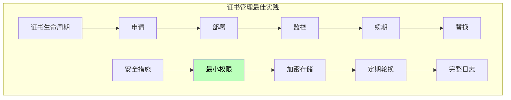

### 7.3 监控与日志

```go
package main

import (
    "crypto/tls"
    "fmt"
    "log"
    "net"
    "time"
)

// TLS连接监控
type TLSMonitor struct {
    OnHandshakeSuccess func(conn *tls.Conn, duration time.Duration)
    OnHandshakeFailed func(err error)
    OnConnectionClosed func(conn *tls.Conn)
}

func (m *TLSMonitor) WrapConn(conn *tls.Conn) *MonitoredConn {
    return &MonitoredConn{
        Conn:     conn,
        monitor:  m,
        startTime: time.Now(),
    }
}

type MonitoredConn struct {
    *tls.Conn
    monitor    *TLSMonitor
    startTime time.Time
    handshakeDone bool
}

func (m *MonitoredConn) Handshake() error {
    start := time.Now()
    err := m.Conn.Handshake()
    duration := time.Since(start)
    
    if err == nil {
        m.handshakeDone = true
        if m.monitor.OnHandshakeSuccess != nil {
            m.monitor.OnHandshakeSuccess(m.Conn, duration)
        }
    } else {
        if m.monitor.OnHandshakeFailed != nil {
            m.monitor.OnHandshakeFailed(err)
        }
    }
    
    return err
}

func (m *MonitoredConn) Close() error {
    if m.monitor.OnConnectionClosed != nil {
        m.monitor.OnConnectionClosed(m.Conn)
    }
    return m.Conn.Close()
}

// 使用示例
func monitoringExample() {
    monitor := &TLSMonitor{
        OnHandshakeSuccess: func(conn *tls.Conn, duration time.Duration) {
            state := conn.ConnectionState()
            log.Printf("握手成功: %s, 版本: %d, 耗时: %v\n",
                state.ServerName, state.Version, duration)
        },
        OnHandshakeFailed: func(err error) {
            log.Printf("握手失败: %v\n", err)
        },
        OnConnectionClosed: func(conn *tls.Conn) {
            log.Printf("连接关闭\n")
        },
    }
    
    // 使用监控包装连接
    conn, err := tls.Dial("tcp", "example.com:443", &tls.Config{
        ServerName: "example.com",
    })
    if err != nil {
        return
    }
    
    monitoredConn := monitor.WrapConn(conn)
    defer monitoredConn.Close()
}
```

---

## 第八章：高级主题

### 8.1 TLS 1.3新特性详解

TLS 1.3是TLS协议的重大升级，Go在1.12版本开始支持TLS 1.3。

```go
package main

import (
    "crypto/tls"
    "fmt"
)

// TLS 1.3的特性
func tls13Features() {
    // 创建TLS 1.3配置
    config := &tls.Config{
        // TLS 1.3会自动协商
        MaxVersion: tls.VersionTLS13,
        MinVersion: tls.VersionTLS13,  // 强制TLS 1.3
        
        // 0-RTT支持（需要服务器配合）
        // 注意：0-RTT有重放攻击风险
        // 0RTTDisabled: false,
        
        // TLS 1.3的密码套件不同
        CipherSuites: []uint16{
            tls.TLS_AES_256_GCM_SHA384,
            tls.TLS_CHACHA20_POLY1305_SHA256,
        },
    }
    
    conn, err := tls.Dial("tcp", "tls13.example.com:443", config)
    if err != nil {
        fmt.Printf("连接失败: %v\n", err)
        return
    }
    defer conn.Close()
    
    state := conn.ConnectionState()
    fmt.Printf("TLS Version: %d (TLS 1.3)\n", state.Version)
    fmt.Printf("HandshakeComplete: %v\n", state.HandshakeComplete)
    fmt.Printf("DidResume: %v\n", state.DidResume)
    
    // TLS 1.3特有属性
    // - 握手是1-RTT
    // - 0-RTT可选
    // - 所有密钥交换都是前向安全的
    // - 废弃了静态RSA密钥交换
}
```

### 8.2 硬件加速

```go
package main

import (
    "crypto/tls"
    "fmt"
    "runtime"
)

// 检测TLS硬件加速支持
func detectHardwareAcceleration() {
    // Go的crypto/tls会自动使用CPU的硬件加速
    // AES-NI (Intel/AMD)
    // ARM-CE (ARM)
    
    // 可以通过观察握手性能来判断
    start := time.Now()
    
    conn, _ := tls.Dial("tcp", "example.com:443", &tls.Config{
        ServerName: "example.com",
    })
    if conn != nil {
        handshakeDuration := time.Since(start)
        
        // 通常有硬件加速的握手在1-5ms
        // 纯软件的握手可能在10-50ms
        fmt.Printf("握手耗时: %v\n", handshakeDuration)
        
        conn.Close()
    }
    
    // 检查CPU特性
    // 在Intel CPU上，AES-NI会显著加速AES操作
    // 这是Go自动处理的
    
    fmt.Printf("GOMAXPROCS: %d\n", runtime.GOMAXPROCS(0))
}
```

### 8.3 调试与诊断

```go
package main

import (
    "crypto/tls"
    "crypto/x509"
    "fmt"
    "net"
    "os"
)

// TLS诊断工具
func diagnoseTLS() {
    // 1. 列出系统根证书
    systemCertPool, err := x509.SystemCertPool()
    if err != nil {
        fmt.Printf("无法获取系统证书池: %v\n", err)
    } else {
        fmt.Printf("系统根证书数量: %d\n", len(systemCertPool.Subjects()))
    }
    
    // 2. 检查环境变量
    fmt.Printf("GODEBUG: %s\n", os.Getenv("GODEBUG"))
    
    // 3. 连接测试
    testConnection("google.com:443", "google.com")
    testConnection("example.com:443", "example.com")
}

func testConnection(addr, serverName string) {
    conn, err := tls.Dial("tcp", addr, &tls.Config{
        ServerName: serverName,
    })
    if err != nil {
        fmt.Printf("%s: 连接失败 - %v\n", addr, err)
        return
    }
    defer conn.Close()
    
    state := conn.ConnectionState()
    fmt.Printf("%s:\n", addr)
    fmt.Printf("  版本: %d\n", state.Version)
    fmt.Printf("  握手完成: %v\n", state.HandshakeComplete)
    fmt.Printf("  密码套件: %d\n", state.CipherSuite)
    fmt.Printf("  服务器名: %s\n", state.ServerName)
    
    if len(state.PeerCertificates) > 0 {
        cert := state.PeerCertificates[0]
        fmt.Printf("  证书主体: %s\n", cert.Subject.CommonName)
        fmt.Printf("  证书有效期: %s - %s\n", 
            cert.NotBefore.Format("2006-01-02"),
            cert.NotAfter.Format("2006-01-02"))
    }
}

// 网络诊断辅助
func networkDiagnostics() {
    // 检查DNS解析
    addrs, err := net.LookupHost("example.com")
    if err != nil {
        fmt.Printf("DNS解析失败: %v\n", err)
        return
    }
    fmt.Printf("IP地址: %v\n", addrs)
    
    // 测试TCP连接
    conn, err := net.DialTimeout("tcp", "example.com:443", 5)
    if err != nil {
        fmt.Printf("TCP连接失败: %v\n", err)
        return
    }
    conn.Close()
    fmt.Printf("TCP连接成功\n")
    
    // 路径MTU发现
    // ...
}
```

---

## 第九章：HTTP/2与HTTPS

### 9.1 HTTP/2对HTTPS的依赖

HTTP/2协议强制要求使用TLS（虽然规范不强制，但所有主流浏览器都要求HTTPS）。

```go
package main

import (
    "crypto/tls"
    "fmt"
    "net/http"
)

// HTTP/2配置
func http2Config() {
    // Go的http.Client默认使用HTTP/2（当服务器支持时）
    // 不需要额外配置
    
    client := &http.Client{}
    
    // 检查是否使用了HTTP/2
    // 通过查看响应判断
    resp, _ := client.Get("https://http2.example.com")
    if resp != nil {
        fmt.Printf("Protocol: %s\n", resp.Proto)
        // 或者检查TLS连接状态
    }
}

// 强制HTTP/2
func forceHTTP2() {
    // 方式1：使用http2.Transport
    // 注意：需要导入 golang.org/x/net/http2
    
    transport := &http.Transport{
        TLSClientConfig: &tls.Config{
            NextProtos: []string{"h2", "http/1.1"},
        },
    }
    
    // 配置HTTP/2
    // transport.ForceAttemptHTTP2 = true
    
    client := &http.Client{Transport: transport}
    resp, _ := client.Get("https://http2.example.com")
    if resp != nil {
        fmt.Printf("Protocol: %s\n", resp.Proto)
    }
}
```

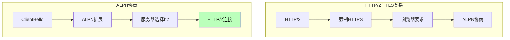

### 9.2 HTTP/2性能优势

```go
package main

import (
    "fmt"
    "net/http"
    "sync"
    "time"
)

// HTTP/2多路复用示例
func http2Multiplex() {
    client := &http.Client{}
    
    // HTTP/1.1需要顺序请求
    start := time.Now()
    for i := 0; i < 10; i++ {
        resp, _ := client.Get(fmt.Sprintf("https://example.com/item/%d", i))
        if resp != nil {
            resp.Body.Close()
        }
    }
    fmt.Printf("HTTP/1.1串行耗时: %v\n", time.Since(start))
    
    // HTTP/2可以并行
    // 使用同一个连接，并行发送请求
    var wg sync.WaitGroup
    start = time.Now()
    for i := 0; i < 10; i++ {
        wg.Add(1)
        go func(i int) {
            defer wg.Done()
            resp, _ := client.Get(fmt.Sprintf("https://example.com/item/%d", i))
            if resp != nil {
                resp.Body.Close()
            }
        }(i)
    }
    wg.Wait()
    fmt.Printf("HTTP/2并行耗时: %v\n", time.Since(start))
}
```

---

## 第十章：实战案例

### 10.1 安全API客户端

```go
package main

import (
    "crypto/tls"
    "crypto/x509"
    "fmt"
    "io/ioutil"
    "net/http"
    "time"
)

// 安全API客户端
type SecureAPIClient struct {
    client  *http.Client
    baseURL string
}

func NewSecureAPIClient(baseURL, certFile, keyFile, caFile string) (*SecureAPIClient, error) {
    // 创建TLS配置
    tlsConfig := &tls.Config{
        MinVersion: tls.VersionTLS12,
        ServerName: "api.example.com",
    }
    
    // 如果有CA证书，加载它
    if caFile != "" {
        caCert, err := ioutil.ReadFile(caFile)
        if err != nil {
            return nil, fmt.Errorf("读取CA证书失败: %v", err)
        }
        certPool := x509.NewCertPool()
        certPool.AppendCertsFromPEM(caCert)
        tlsConfig.RootCAs = certPool
    }
    
    // 如果有客户端证书，加载它（用于mTLS）
    if certFile != "" && keyFile != "" {
        clientCert, err := tls.LoadX509KeyPair(certFile, keyFile)
        if err != nil {
            return nil, fmt.Errorf("读取客户端证书失败: %v", err)
        }
        tlsConfig.Certificates = []tls.Certificate{clientCert}
    }
    
    // 创建HTTP客户端
    transport := &http.Transport{
        TLSClientConfig: tlsConfig,
        
        // 连接池配置
        MaxIdleConns:        100,
        MaxIdleConnsPerHost: 100,
        IdleConnTimeout:     90 * time.Second,
        
        // 超时配置
        TLSHandshakeTimeout:   10 * time.Second,
        ResponseHeaderTimeout:  30 * time.Second,
    }
    
    client := &http.Client{
        Transport: transport,
        Timeout:   60 * time.Second,
    }
    
    return &SecureAPIClient{
        client:  client,
        baseURL: baseURL,
    }, nil
}

func (c *SecureAPIClient) Get(path string) ([]byte, error) {
    url := c.baseURL + path
    resp, err := c.client.Get(url)
    if err != nil {
        return nil, fmt.Errorf("请求失败: %v", err)
    }
    defer resp.Body.Close()
    
    if resp.StatusCode != http.StatusOK {
        return nil, fmt.Errorf("HTTP错误: %d", resp.StatusCode)
    }
    
    return ioutil.ReadAll(resp.Body)
}

func (c *SecureAPIClient) Post(path string, data []byte) ([]byte, error) {
    url := c.baseURL + path
    resp, err := c.client.Post(url, "application/json", nil)
    if err != nil {
        return nil, fmt.Errorf("请求失败: %v", err)
    }
    defer resp.Body.Close()
    
    if resp.StatusCode != http.StatusOK {
        return nil, fmt.Errorf("HTTP错误: %d", resp.StatusCode)
    }
    
    return ioutil.ReadAll(resp.Body)
}
```

### 10.2 HTTPS服务器中间件

```go

```go
package main

import (
    "crypto/tls"
    "crypto/x509"
    "fmt"
    "net/http"
)

// TLS验证中间件
func tlsVerificationMiddleware(next http.Handler) http.Handler {
    return http.HandlerFunc(func(w http.ResponseWriter, r *http.Request) {
        // 获取TLS连接状态
        if r.TLS != nil {
            // 记录TLS信息
            fmt.Printf("TLS版本: %d\n", r.TLS.Version)
            fmt.Printf("密码套件: %d\n", r.TLS.CipherSuite)
            fmt.Printf("服务器名: %s\n", r.TLS.ServerName)
            
            // 可以进行额外的验证
            if len(r.TLS.PeerCertificates) > 0 {
                cert := r.TLS.PeerCertificates[0]
                fmt.Printf("客户端证书: %s\n", cert.Subject.CommonName)
            }
        }
        
        next.ServeHTTP(w, r)
    })
}

// mTLS中间件
func mtlsMiddleware(caFile string) func(http.Handler) http.Handler {
    // 加载CA证书
    caCert, _ := x509.LoadCertPoolFromFile(caFile)
    
    return func(next http.Handler) http.Handler {
        return http.HandlerFunc(func(w http.ResponseWriter, r *http.Request) {
            if r.TLS == nil {
                http.Error(w, "HTTPS required", http.StatusForbidden)
                return
            }
            
            // 验证客户端证书
            if len(r.TLS.PeerCertificates) == 0 {
                http.Error(w, "Client certificate required", http.StatusForbidden)
                return
            }
            
            // 验证证书链
            cert := r.TLS.PeerCertificates[0]
            opts := x509.VerifyOptions{
                Roots: caCert,
            }
            
            if _, err := cert.Verify(opts); err != nil {
                http.Error(w, "Invalid client certificate", http.StatusForbidden)
                return
            }
            
            // 验证通过，继续处理
            next.ServeHTTP(w, r)
        })
    }
}

// 使用示例
func main() {
    mux := http.NewServeMux()
    mux.HandleFunc("/api", func(w http.ResponseWriter, r *http.Request) {
        fmt.Fprintf(w, "Hello, Secure API!")
    })
    
    // 应用中间件
    handler := tlsVerificationMiddleware(mux)
    handler = mtlsMiddleware("client-ca.crt")(handler)
    
    // 创建HTTPS服务器
    server := &http.Server{
        Addr:      ":8443",
        Handler:   handler,
        TLSConfig: createTLSConfig(),
    }
    
    server.ListenAndServeTLS("server.crt", "server.key")
}

func createTLSConfig() *tls.Config {
    return &tls.Config{
        MinVersion: tls.VersionTLS12,
        ClientAuth: tls.RequestClientCert,
    }
}
```

---

Go语言的HTTPS处理能力是其云原生优势的重要体现。从底层的crypto/tls库到高层的http.Client，Go提供了一套完整且优雅的解决方案。

本文深入探讨了Go语言处理HTTPS的各个方面：

**协议层面**，我们理解了TLS协议的工作原理，从握手过程到密码套件，从TLS 1.2到TLS 1.3的演进。这些知识帮助我们理解为什么某些配置是安全的，某些配置是有风险的。

**实现层面**，我们详细分析了Go的crypto/tls标准库，包括tls.Config的各个字段、连接建立的过程、以及如何自定义TLS行为。Go自研TLS库的决定虽然看似激进，但实际上带来了更好的可移植性和Go风格的API设计。

**实践层面**，我们涵盖了HTTPS客户端和服务端的创建、证书处理、会话复用、以及各种常见问题的解决方案。这些内容可以直接应用到日常开发工作中。

**安全层面**，我们讨论了TLS配置的最佳实践、证书管理、以及监控告警。安全不是事后补救，而是应该在设计阶段就考虑周全。

最后需要强调的是，虽然Go的TLS实现非常完善，但安全配置仍然需要开发者具备一定的密码学知识。理解每个配置项的含义和影响，才能做出正确的决策。

HTTPS不是万能的，但它已经是互联网安全的基础设施。在Go的帮助下，我们可以更简单地实现安全的通信，但这种简单不应该让我们忘记背后的复杂原理。

---

>