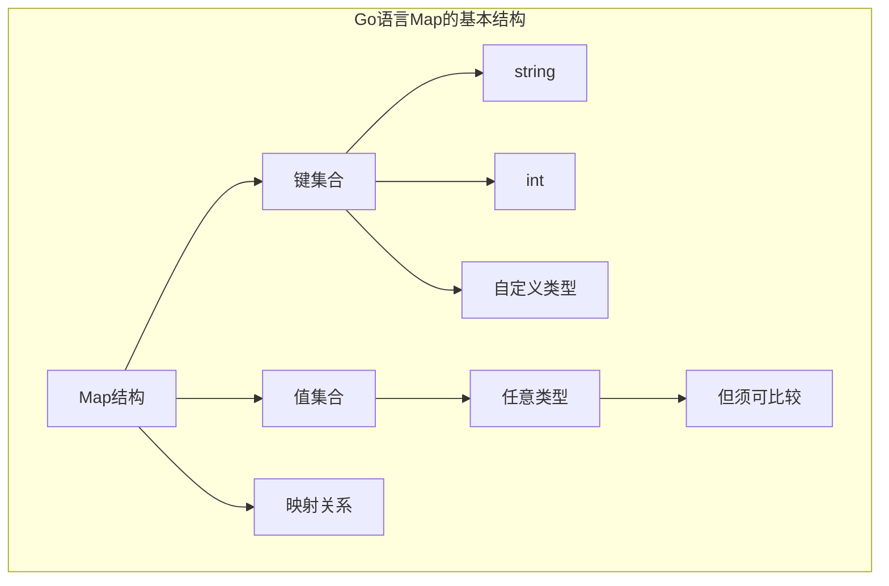
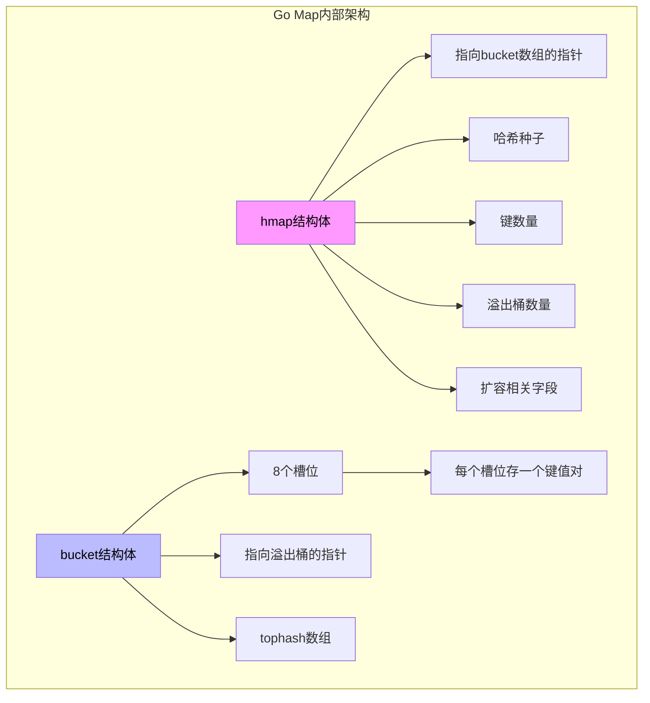
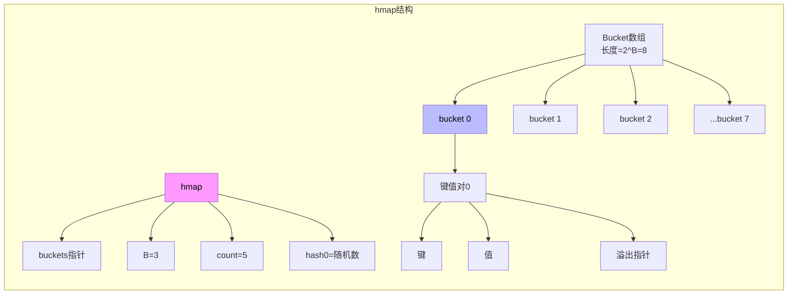
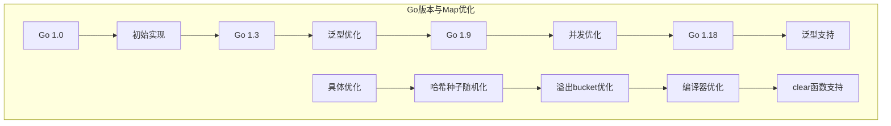

# Go语言Map深度解析：从原理到实践的完全指南

> 

## 引言

在Go语言的编程实践中，map是最常用且最重要的数据结构之一。无论是缓存实现、配置管理，还是数据索引，map都扮演着不可或缺的角色。然而，正是这种极高的使用频率，使得深入理解Go语言map的实现变得尤为重要。

很多Go开发者每天都在使用map，却对其内部机制知之甚少。他们可能知道map是无序的、不是线程安全的、删除操作不会立即回收内存——但这些都是“知其然”，而非“知其所以然”。当面对以下问题时，浅显的了解往往不够：

- 为什么map的迭代顺序是不确定的？
- 为什么map不能直接获取地址？
- 为什么向nil map写入会panic而读取不会？
- 为什么map的查找和插入不是O(1)而是均摊O(1)？
- 如何避免map的预分配导致的内存浪费？

要回答这些问题，我们需要深入到Go运行时（runtime）的层面，探索map的底层实现。只有理解了这些“为什么”，才能真正掌握map的正确使用方式，写出高效且健壮的代码。

本文将带领读者从Go map的基本用法出发，逐步深入到其内部实现机制。我们将分析Go运行时如何管理map的内存，如何处理哈希冲突，如何优化查找和插入性能。通过理解这些底层细节，你将能够：
1. 在日常开发中更准确地选择数据结构
2. 避免常见的性能陷阱和错误用法
3. 在需要优化时做出更明智的决策

---

## 第一章：Map的基本概念与使用

### 1.1 什么是Map？

Map（映射）是Go语言内置的关联数据结构，用于存储键值对。在Go中，map是一种引用类型，它的行为类似于其他语言中的字典、哈希表或关联数组。

```go
// 声明一个map
var m map[string]int

// 使用make创建
m = make(map[string]int)

// 字面量初始化
m := map[string]int{
    "apple":  1,
    "banana": 2,
    "orange": 3,
}

// 基本操作
m["apple"] = 5           // 插入/更新
value := m["apple"]      // 读取
delete(m, "apple")       // 删除
v, ok := m["grape"]     // 检查键是否存在
```



### 1.2 Map的类型系统特性

Go语言对map的键类型有严格的要求：键类型必须是可比较的（comparable）。这是由map的底层实现决定的——基于哈希表的数据结构需要能够比较键是否相等。

```go
// 可作为map键的类型
var m1 map[string]int      // 字符串
var m2 map[int]float64    // 整数
var m3 map[bool]string    // 布尔值
var m4 map[float64]int    // 浮点数（但有精度问题）
var m5 map[uint]int       // 无符号整数

// 不可作为map键的类型
// var m6 map[[]byte]int  // 切片 - 不可比较
// var m7 map[map]int     // map - 不可比较
// var m8 map[func]int    // 函数 - 不可比较
// var m9 map[chan]int    // channel - 不可比较

// 结构体作为键
type Point struct {
    X, Y int
}

var m10 map[Point]string  // 如果Point所有字段可比较，则可以
```

**根本原因分析**：为什么Go要求map的键必须可比较？

这个问题需要从哈希表的实现原理说起。哈希表的核心思想是将键通过哈希函数映射到数组的某个位置。当我们需要查找一个键时：
1. 先计算键的哈希值
2. 根据哈希值定位到数组位置
3. 在该位置的所有元素中逐一比较键是否相等

因此，**哈希表不仅需要能够计算哈希值，还需要能够比较键是否相等**。如果键类型无法进行比较，就无法在哈希冲突时判断目标键是否存在。

Go语言使用编译时和运行时双重检查来确保键类型的可比较性。编译时会检查字面量中的键类型，运行时会在插入时对不可比较的类型触发panic。

### 1.3 Map的基本操作

```go
package main

import "fmt"

func main() {
    // 创建
    m := make(map[string]int, 10)  // 第二个参数是初始容量
    
    // 插入/更新
    m["a"] = 1
    m["b"] = 2
    
    // 读取
    fmt.Println(m["a"])  // 1
    
    // 读取并检查存在性
    v, ok := m["c"]
    fmt.Println(v, ok)  // 0 false
    
    // 删除
    delete(m, "b")
    
    // 迭代 - 顺序随机
    for k, v := range m {
        fmt.Println(k, v)
    }
    
    // 获取map长度
    fmt.Println(len(m))  // 1
    
    // 清空map（重新创建）
    m = make(map[string]int)
}
```

---

## 第二章：Map的内部数据结构

### 2.1 整体架构概览

Go语言的map实现是一个高度优化的哈希表。它采用**哈希查找 + 链表/数组解决冲突**的经典模式，但在具体实现上做了大量优化。



### 2.2 核心数据结构定义

Go runtime中map的核心数据结构定义（简化版）：

```go
// hmap - map的头结构
type hmap struct {
    count     int         // 当前元素数量
    flags     uint8       // 状态标志
    B         uint8       // bucket数组的大小 = 2^B
    noverflow uint16      // 溢出bucket数量
    hash0     uint32      // 哈希种子
    
    // 指向bucket数组的指针，数组大小为 2^B
    buckets    unsafe.Pointer 
    // 扩容时的旧bucket数组
    oldbuckets unsafe.Pointer 
    // 扩容进度
    nevacuate  uintptr       
    
    // 增长因子，非指针，用于优化GC
    extra *mapextra
}

// mapextra - 额外字段
type mapextra struct {
    // 指向溢出bucket链表的指针
    overflow *[]*bmap
    // 旧bucket的溢出链表
    oldoverflow *[]*bmap
    // 指向nextOverflow bucket的指针
    nextOverflow *bmap
}

// bmap - bucket结构
type bmap struct {
    // tophash存储哈希值的高8位，用于快速查找
    // 数组长度为8
    tophash [8]uint8
    
    // 键值对数据存储在这里
    // 键和值交织存储，以减少padding
    // keys: [8]keytype
    // values: [8]valuetype
    
    // 溢出指针，指向下一个bmap
    overflow *bmap
}
```



### 2.3 Bucket的内存布局

Bucket是map存储数据的基本单元。每个bucket可以存储8个键值对，这是Go语言

---

## 第十章：Map的演进与未来

### 10.1 Go各版本的Map优化

Go语言的不同版本对map实现做了大量优化：



**Go 1.20之前的优化：**
- 使用内存分配器减少碎片
- 优化tophash查找
- 改进bucket分配策略

**Go 1.21的优化：**
- 添加`clear()`函数，高效清空map
- 改进迭代器性能

### 10.2 未来的发展方向

```go
// 未来的可能改进：

// 1. 更强大的泛型支持
type OrderedMap[K comparable, V any] struct {
    data map[K]V
    less func(K, K) bool
}

// 2. 更好的并发map
// sync.Map的性能继续优化

// 3. 稳定的迭代顺序（可选）
// 可能提供按插入顺序迭代的选项
```

---

Go语言的map是语言设计中一个精妙而复杂的组件。它的实现融合了计算机科学中哈希表的经典思想与现代系统编程的实用主义。

通过本文的深入分析，我们理解了以下关键点：

**内部实现层面**：
- map基于哈希表实现，使用bucket数组和溢出bucket链表
- 每个bucket存储8个键值对，使用tophash快速定位
- 扩容采用渐进式策略，避免一次性大规模内存操作

**性能特性层面**：
- 查找和插入是均摊O(1)，但最坏情况是O(n)
- 负载因子阈值6.5是空间和时间的最佳平衡
- 迭代顺序随机是故意的设计决策

**使用实践层面**：
- 永远不要对map进行并发读写
- 使用预分配避免频繁扩容
- 根据场景选择sync.Map或自定义锁

理解这些底层原理，不仅帮助我们写出更好的代码，更重要的是，它让我们能够理解Go语言设计的哲学——简洁、实用、显式。

---

>