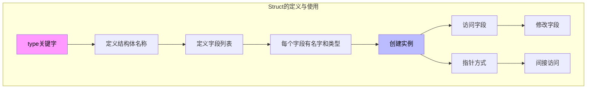
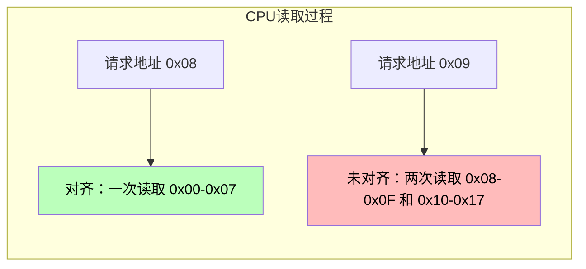
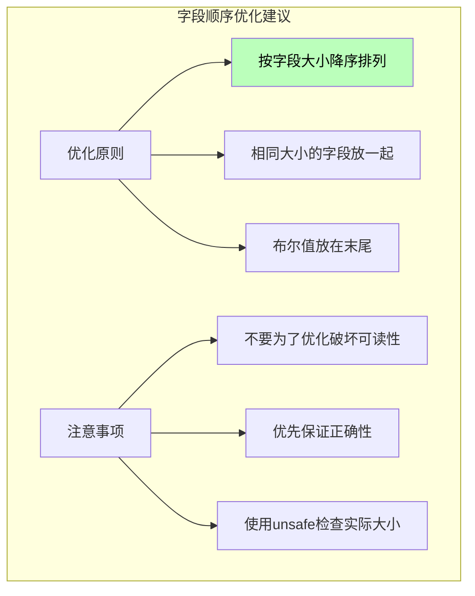
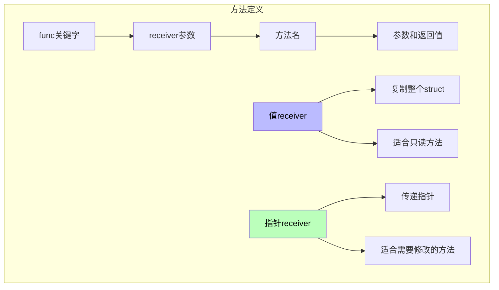
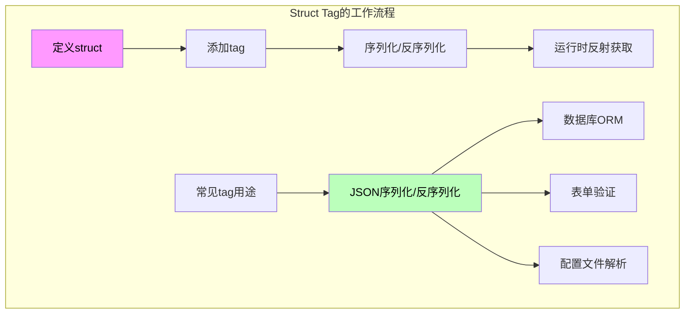
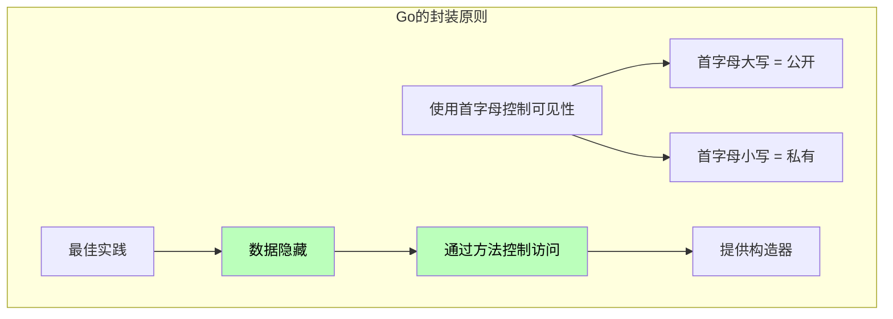
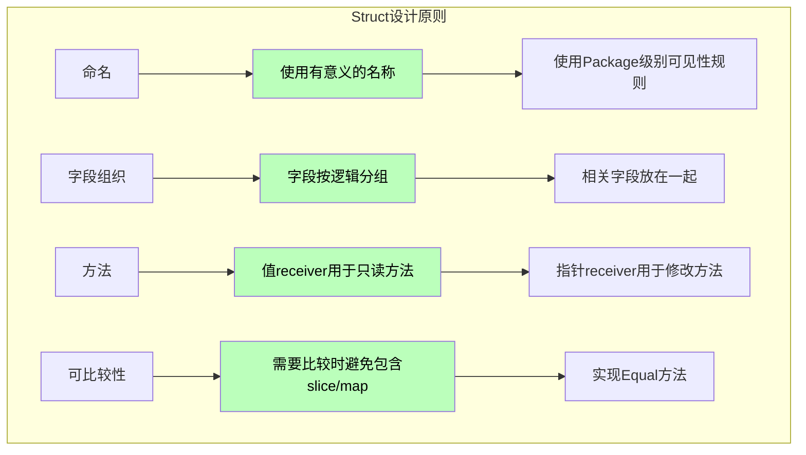

# Go语言Struct深度解析：从原理到实践的完全指南

> 

## 引言

在Go语言的世界里，struct（结构体）是构建复杂数据类型的基础构件。与面向对象语言中的“类”不同，Go的struct没有继承、构造函数或析构函数的概念，它是一种更简单、更纯粹的数据聚合方式。然而，正是这种简单性，使得struct成为了Go语言最强大和灵活的工具之一。

很多Go开发者每天都在使用struct，但对其内部机制的理解可能仅限于“一种可以封装多个字段的数据类型”。当被问及以下问题时，浅显的了解往往不够：

- 为什么Go没有“类”只有struct？
- struct的内存布局是怎样的？为什么会有内存对齐？
- 为什么struct的字段顺序会影响内存占用？
- 嵌套struct和内联struct有什么区别？
- struct的tag是如何工作的？为什么需要它？
- 为什么Go要设计“组合优于继承”的模式？

要回答这些问题，我们需要深入到Go编译器和运行时的层面，探索struct的底层实现。只有理解了这些“为什么”，才能真正掌握struct的正确使用方式，写出高效且健壮的代码。

本文将带领读者从struct的基本用法出发，逐步深入到其内部实现机制。我们将分析Go编译器如何处理struct定义，如何计算内存布局，如何管理方法绑定。通过理解这些底层细节，你将能够：

1. 更准确地设计数据结构
2. 避免常见的内存浪费和性能问题
3. 理解Go语言的类型系统设计哲学
4. 在需要优化时做出更明智的决策

---

## 第一章：Struct的基本概念与使用

### 1.1 什么是Struct？

Struct（结构体）是Go语言中用于自定义复合数据类型的基本构造。它允许我们将多个不同类型的字段组合在一起，形成一个逻辑上相关的整体。

```go
// 最简单的struct定义
type Person struct {
    Name string
    Age  int
    City string
}

// 使用struct
p := Person{
    Name: "张三",
    Age:  30,
    City: "北京",
}

// 访问字段
fmt.Println(p.Name)  // 张三

// 修改字段
p.Age = 31

// 指针访问
pp := &p
fmt.Println(pp.Name)  // 张三
```



### 1.2 Struct的多种定义与初始化方式

```go
package main

import "fmt"

func main() {
    // 方式1：使用字段名初始化（最推荐）
    p1 := Person{
        Name: "张三",
        Age:  30,
        City: "北京",
    }
    
    // 方式2：省略字段名（顺序必须与定义一致）
    p2 := Person{"李四", 25, "上海"}
    
    // 方式3：部分字段使用字段名，部分使用顺序
    // 错误：不能混用
    // p3 := Person{Name: "王五", "深圳", 28}  // 编译错误
    
    // 方式4：使用new关键字（返回指针）
    p3 := new(Person)
    p3.Name = "赵六"
    p3.Age = 35
    
    // 方式5：先声明后赋值
    var p4 Person
    p4.Name = "钱七"
    p4.Age = 28
    p4.City = "广州"
    
    // 方式6：使用指针的字段名初始化
    p5 := &Person{
        Name: "孙八",
        Age:  32,
        City: "杭州",
    }
    
    // 零值struct
    var p6 Person  // 所有字段为零值：""、0、nil等
    
    fmt.Println(p1, p2, p3, p4, p5, p6)
}

type Person struct {
    Name string
    Age  int
    City string
}
```

**根本原因分析**：为什么Go允许多种初始化方式？

这涉及到Go语言的设计哲学：**简洁性和灵活性**。

**方式1（字段名初始化）**：
- 优点：顺序无关，可读性好，字段多时不易出错
- 适用场景：字段较多或需要部分初始化

**方式2（顺序初始化）**：
- 优点：代码简洁
- 缺点：依赖字段定义顺序，可读性差
- 适用场景：字段少且不变的简单结构

**方式3（new关键字）**：
- 优点：语义清晰，表示创建指针
- 适用场景：当需要获取指针时

这种多样性的设计让开发者可以根据具体场景选择最合适的方式，而不是强制使用某一种。

### 1.3 Struct的基本操作

```go
package main

import "fmt"

func main() {
    p1 := Person{Name: "张三", Age: 30, City: "北京"}
    p2 := Person{Name: "张三", Age: 30, City: "北京"}
    
    // 比较：只有全部字段相等时才相等
    if p1 == p2 {
        fmt.Println("相等")  // 输出：相等
    }
    
    // 赋值：浅拷贝
    p3 := p1
    p3.Age = 31  // p3修改，p1不受影响
    
    fmt.Println(p1.Age, p3.Age)  // 30 31
    
    // 作为函数参数：值传递（浅拷贝）
    modifyPerson(p1)
    fmt.Println(p1.Age)  // 30，未改变
    
    // 使用指针：引用传递
    modifyPersonPtr(&p1)
    fmt.Println(p1.Age)  // 32，已改变
}

type Person struct {
    Name string
    Age  int
    City string
}

func modifyPerson(p Person) {
    p.Age = 32  // 只修改副本
}

func modifyPersonPtr(p *Person) {
    p.Age = 32  // 修改原对象
}
```

---

## 第二章：Struct的内存布局与对齐

### 2.1 内存布局基础

理解struct的内存布局是编写高性能Go代码的关键。Go编译器会自动为struct添加padding（填充）以满足内存对齐要求。

```go
package main

import (
    "fmt"
    "unsafe"
)

func main() {
    // 示例1：紧凑布局
    type T1 struct {
        a int8   // 1字节
        b int64  // 8字节
        c int8   // 1字节
    }
    
    // 示例2：对齐后的布局
    type T2 struct {
        a int8   // 1字节
        // 7字节填充
        b int64  // 8字节
        c int8   // 1字节
        // 7字节填充（结构体对齐）
    }
    
    t1 := T1{}
    t2 := T2{}
    
    fmt.Printf("T1 size: %d, align: %d\n", unsafe.Sizeof(t1), unsafe.Alignof(t1))
    // 输出：T1 size: 24, align: 8
    
    fmt.Printf("T2 size: %d, align: %d\n", unsafe.Sizeof(t2), unsafe.Alignof(t2))
    // 输出：T2 size: 24, align: 8
}
```

```mermaid
flowchart TB
    subgraph T1内存布局
        A[T1] --> B[a: int8<br/>1字节]
        B --> C[b: int64<br/>8字节]
        C --> D[c: int8<br/>1字节]
        
        E[总大小：24字节]
    end
    
    subgraph T2内存布局（调整字段顺序）
        F[T2] --> G[b: int64<br/>8字节]
        G --> H[a: int8<br/>1字节]
        H --> I[c: int8<br/>1字节]
        
        J[总大小：16字节]
    end
    
    style B fill:#bfb,color:#000
    style G fill:#bfb,color:#000
```

### 2.2 内存对齐的原理

**根本原因分析**：为什么需要内存对齐？

这是一个硬件和软件协同优化的经典问题：

**1. CPU访问效率**
- 现代CPU以固定大小的块（通常是8字节）为单位读取内存
- 对齐的数据可以让CPU一次性读取，无需多次访问
- 未对齐的数据可能导致CPU执行多次读取操作



**2. 硬件限制**
- 某些CPU架构要求特定类型的数据必须对齐到特定地址
- 不对齐的访问可能导致硬件错误（虽然在x86上不会出错，但有性能惩罚）

**3. 原子操作要求**
- 某些原子操作要求内存对齐
- 对齐确保多线程环境下的原子性

### 2.3 字段顺序优化

```go
package main

import (
    "fmt"
    "unsafe"
)

func main() {
    // 反例：字段顺序不当导致内存浪费
    type BadOrder struct {
        b bool    // 1字节
        i int64   // 8字节，需要对齐到8的倍数
        a int8    // 1字节
        j int32   // 4字节，需要对齐到4的倍数
    }
    
    // 正例：按大小降序排列
    type GoodOrder struct {
        i int64   // 8字节
        j int32   // 4字节
        a int8    // 1字节
        b bool    // 1字节
    }
    
    fmt.Printf("BadOrder: size=%d, align=%d\n",
        unsafe.Sizeof(BadOrder{}), unsafe.Alignof(BadOrder{}))
    // 输出：BadOrder: size=32, align=8
    
    fmt.Printf("GoodOrder: size=%d, align=%d\n",
        unsafe.Sizeof(GoodOrder{}), unsafe.Alignof(GoodOrder{}))
    // 输出：GoodOrder: size=24, align=8
    
    // 内存对比：
    // BadOrder: 32字节
    // GoodOrder: 24字节
    // 节省：8字节 (25%)
}

// 更真实的例子
type APIRequest struct {
    // 按类型大小降序排列可以节省内存
    Data      []byte  // 24字节（slice header）
    Timestamp int64   // 8字节
    UserID    int64   // 8字节
    Method    int32   // 4字节
    Version   int32   // 4字节
    Timeout   int32   // 4字节
    Flags     uint8   // 1字节
    Compress  bool    // 1字节（可能合并）
    Encrypt   bool    // 1字节（可能合并）
}
```



---

## 第三章：Struct的嵌套与组合

### 3.1 匿名成员（内联struct）

Go允许struct直接嵌入其他struct，形成“匿名成员”，这是Go实现“组合优于继承”的核心机制。

```go
package main

import "fmt"

func main() {
    // 匿名成员示例
    type Engine struct {
        Horsepower int
        Torque     int
    }
    
    type Car struct {
        Engine  // 匿名成员：直接嵌入
        Brand   string
        Model   string
    }
    
    // 创建实例
    c := Car{
        Engine: Engine{
            Horsepower: 200,
            Torque:     300,
        },
        Brand: "Toyota",
        Model: "Camry",
    }
    
    // 访问匿名成员的字段：可以直接访问
    fmt.Println(c.Horsepower)     // 200 - 直接访问
    fmt.Println(c.Engine.Horsepower)  // 200 - 完整路径也可以
    
    // 方法提升：匿名成员的方法可以直接调用
    // c.Start() // 如果Engine有Start方法，可以直接调用
}

type Engine struct {
    Horsepower int
    Torque     int
}

type Car struct {
    Engine  // 匿名成员：没有字段名，只有类型
    Brand   string
    Model   string
}
```

```mermaid
flowchart TB
    subgraph 匿名成员结构
        A[Car struct] --> B[Engine - 匿名成员]
        A --> C[Brand - 具名成员]
        A --> D[Model - 具名成员]
        
        E[访问方式] --> F[直接访问 c.Horsepower]
        F --> G[或完整访问 c.Engine.Horsepower]
        
        H[方法提升] --> I[匿名成员的方法可以被"提升"]
    end
    
    style A fill:#f9f,color:#000
    style I fill:#bbf,color:#000
```

### 3.2 有名成员（嵌套struct）

```go
package main

import "fmt"

func main() {
    // 有名成员示例
    type Address struct {
        City    string
        Country string
    }
    
    type Company struct {
        Name    string
        Address // 匿名成员
        // 或: Address Address  // 有名成员
    }
    
    comp := Company{
        Name: "Google",
        Address: Address{
            City:    "Mountain View",
            Country: "USA",
        },
    }
    
    // 有名成员访问
    fmt.Println(comp.Address.City)    // Mountain View
    
    // 匿名成员访问（如果使用匿名成员）
    fmt.Println(comp.City)  // 如果是匿名成员，City会被提升
}

type Address struct {
    City    string
    Country string
}

type Company struct {
    Name    string
    Address Address  // 有名成员：需要通过Address访问
}
```

### 3.3 匿名成员 vs 有名成员

```go
package main

import "fmt"

func main() {
    // 对比两种方式
    
    // 方式1：匿名成员（推荐用于"has-a"关系）
    type Person1 struct {
        Name  string
        Address  // 匿名成员 - 地址提升为Person的字段
    }
    
    type Address struct {
        City string
    }
    
    p1 := Person1{
        Name: "张三",
        Address: Address{City: "北京"},
    }
    
    // 可以直接访问City
    fmt.Println(p1.City)  // 北京
    
    // 方式2：有名成员
    type Person2 struct {
        Name    string
        HomeAddress Address  // 有名成员 - 需要通过HomeAddress访问
    }
    
    p2 := Person2{
        Name: "李四",
        HomeAddress: Address{City: "上海"},
    }
    
    // 需要通过完整路径访问
    fmt.Println(p2.HomeAddress.City)  // 上海
}

type Address struct {
    City string
}
```

```mermaid
flowchart TB
    subgraph 匿名成员 vs 有名成员
        A[匿名成员] --> B[字段名自动提升]
        A --> B1[简化访问路径]
        A --> B2[适合"has-a"继承]
        
        C[有名成员] --> D[需要完整路径访问]
        C --> D1[避免命名冲突]
        C --> D2[适合明确语义]
        
        E[选择建议] --> F[简单组合用匿名]
        F --> G[需要区分含义用有名]
    end
    
    style F fill:#bfb,color:#000
    style G fill:#bfb,color:#000
```

**根本原因分析**：为什么Go选择这种组合方式而不是继承？

Go的设计哲学是**组合优于继承**，这有深刻的原因：

**1. 扁平化vs层次化**
- 继承创建了强耦合的类型层次
- 组合创建了更灵活的"has-a"关系

**2. 方法解析复杂度**
- 多继承需要复杂的方法解析（如C++的菱形继承问题）
- 组合没有这种复杂性

**3. Go的哲学**
- Go强调简单和显式
- 匿名成员提供了“开箱即用”的组合，同时保持清晰

### 3.4 多层嵌套

```go
package main

import "fmt"

// 多层嵌套示例
type Engine struct {
    Type     string
    Horsepower int
}

type Wheel struct {
    Size   int
    Pressure float64
}

type Car struct {
    Engine  // 匿名成员
    Wheels  [4]Wheel  // 具名成员 - 数组
    Brand   string
}

func main() {
    car := Car{
        Engine: Engine{
            Type:      "V6",
            Horsepower: 280,
        },
        Wheels: [4]Wheel{
            {Size: 18, Pressure: 32.0},
            {Size: 18, Pressure: 32.0},
            {Size: 18, Pressure: 32.0},
            {Size: 18, Pressure: 32.0},
        },
        Brand: "BMW",
    }
    
    // 访问
    fmt.Println(car.Type)           // V6
    fmt.Println(car.Engine.Type)   // V6
    fmt.Println(car.Wheels[0].Size) // 18
}
```

---

## 第四章：Struct的方法

### 4.1 方法的定义与调用

```go
package main

import "fmt"

type Rectangle struct {
    Width  int
    Height int
}

// 定义方法：使用值 receiver
func (r Rectangle) Area() int {
    return r.Width * r.Height
}

// 定义方法：使用指针 receiver
func (r *Rectangle) Scale(factor int) {
    r.Width *= factor
    r.Height *= factor
}

// 使用值 receiver 的方法
func (r Rectangle) Perimeter() int {
    return 2 * (r.Width + r.Height)
}

func main() {
    rect := Rectangle{Width: 10, Height: 20}
    
    // 值调用
    fmt.Println(rect.Area())       // 200
    fmt.Println(rect.Perimeter())  // 60
    
    // 指针调用
    rect.Scale(2)
    fmt.Println(rect.Width, rect.Height)  // 20 40
    
    // 注意：Go会自动转换
    // rect.Scale(2) 实际上是 (&rect).Scale(2)
}
```



### 4.2 方法的继承与覆盖

```go
package main

import "fmt"

type Animal struct {
    Name string
}

// Animal的方法
func (a Animal) Speak() string {
    return "..."
}

func (a Animal) Eat() string {
    return "something"
}

// Dog 匿名嵌入 Animal
type Dog struct {
    Animal  // 匿名成员
    Breed   string
}

// Dog可以覆盖Animal的方法
func (d Dog) Speak() string {
    return "Woof!"
}

// 新增自己的方法
func (d Dog) Fetch() string {
    return "Fetching ball"
}

func main() {
    dog := Dog{
        Animal: Animal{Name: "Buddy"},
        Breed:  "Golden Retriever",
    }
    
    // 调用的Speak被覆盖了
    fmt.Println(dog.Speak())  // Woof! - 覆盖后的方法
    
    // 调用的Eat未被覆盖
    fmt.Println(dog.Eat())   // something - 继承的方法
    
    // 新增的方法
    fmt.Println(dog.Fetch()) // Fetching ball
    
    // 访问提升的字段
    fmt.Println(dog.Name)    // Buddy
}
```

**根本原因分析**：匿名成员的方法是如何“提升”的？

Go的编译器在方法解析时会检查：
1. 首先检查当前类型是否有该方法
2. 如果没有，检查匿名成员是否有该方法
3. 如果有，返回该方法（类似Python的MRO，但更简单）

这种机制被称为**方法提升**（Method Promotion），它是Go实现多态的核心机制。

### 4.3 方法表达式与值

```go
package main

import "fmt"

type Rectangle struct {
    Width, Height int
}

func (r Rectangle) Area() int {
    return r.Width * r.Height
}

func main() {
    rect := Rectangle{10, 20}
    
    // 方法值：绑定到具体实例
    area := rect.Area  // 这是一个函数值，调用时隐式传递rect
    fmt.Println(area())  // 200
    
    // 方法表达式：需要显式传递实例
    areaFunc := Rectangle.Area  // 这需要Rectangle实例作为第一个参数
    fmt.Println(areaFunc(rect)) // 200
    
    // 使用场景：回调和异步
    // 场景1：作为函数参数
    applyFunc(rect, func(r Rectangle) int {
        return r.Width + r.Height
    })
    
    // 场景2：延迟执行
    defer fmt.Println("Area:", rect.Area())  // 方法值用于defer
}

func applyFunc(r Rectangle, f func(Rectangle) int) int {
    return f(r)
}
```

### 4.4 接口与Struct的关系

```go
package main

import "fmt"

type Shape interface {
    Area() int
    Perimeter() int
}

// Circle 实现了 Shape 接口
type Circle struct {
    Radius int
}

func (c Circle) Area() int {
    return 3 * c.Radius * c.Radius
}

func (c Circle) Perimeter() int {
    return 2 * 3 * c.Radius
}

// Rectangle 也实现了 Shape 接口
type Rectangle struct {
    Width, Height int
}

func (r Rectangle) Area() int {
    return r.Width * r.Height
}

func (r Rectangle) Perimeter() int {
    return 2 * (r.Width + r.Height)
}

// 多态函数：接受任何实现了Shape接口的类型
func PrintInfo(s Shape) {
    fmt.Printf("Area: %d, Perimeter: %d\n", s.Area(), s.Perimeter())
}

func main() {
    c := Circle{Radius: 10}
    r := Rectangle{Width: 10, Height: 20}
    
    PrintInfo(c)  // Area: 300, Perimeter: 60
    PrintInfo(r)  // Area: 200, Perimeter: 60
    
    // 检查实现
    var _ Shape = Circle{}   // 编译时检查
    var _ Shape = Rectangle{} // 编译时检查
}
```

---

## 第五章：Struct的Tag

### 5.1 Tag的基本用法

Struct的tag是附加在字段上的元数据，用于提供字段的额外信息。这些tag在运行时可以通过反射获取。

```go
package main

import (
    "encoding/json"
    "fmt"
    "reflect"
)

type Person struct {
    Name string `json:"name" validate:"required"`
    Age  int    `json:"age" validate:"min:0"`
    Email string `json:"email,omitempty"`
}

func main() {
    p := Person{
        Name:  "张三",
        Age:   30,
        Email: "zhangsan@example.com",
    }
    
    // 使用json tag进行序列化
    data, _ := json.Marshal(p)
    fmt.Println(string(data))
    // {"name":"张三","age":30,"email":"zhangsan@example.com"}
    
    // 反序列化
    jsonStr := `{"name":"李四","age":25,"email":"lisi@example.com"}`
    var p2 Person
    json.Unmarshal([]byte(jsonStr), &p2)
    fmt.Println(p2.Name, p2.Age, p2.Email)
    
    // 反射获取tag
    t := reflect.TypeOf(Person{})
    field, _ := t.FieldByName("Name")
    fmt.Println(field.Tag.Get("json"))      // name
    fmt.Println(field.Tag.Get("validate"))  // required
}
```



### 5.2 自定义Tag解析

```go
package main

import (
    "fmt"
    "reflect"
    "strings"
)

// 定义我们的tag
const tagName = "validate"

type ValidationRule struct {
    Required bool
    Min      int
    Max      int
    Pattern  string
}

func main() {
    type User struct {
        Username string `validate:"required|min:3|max:20"`
        Email    string `validate:"required|email"`
        Age      int    `validate:"min:0|max:150"`
        Password string `validate:"min:8"`
    }
    
    // 解析所有字段的tag
    t := reflect.TypeOf(User{})
    for i := 0; i < t.NumField(); i++ {
        field := t.Field(i)
        rule := parseValidationTag(field.Tag.Get(tagName))
        fmt.Printf("Field: %s, Required: %v, Min: %d, Max: %d\n",
            field.Name, rule.Required, rule.Min, rule.Max)
    }
}

func parseValidationTag(tag string) ValidationRule {
    rule := ValidationRule{}
    
    parts := strings.Split(tag, "|")
    for _, part := range parts {
        switch {
        case part == "required":
            rule.Required = true
        case strings.HasPrefix(part, "min:"):
            fmt.Sscanf(part, "min:%d", &rule.Min)
        case strings.HasPrefix(part, "max:"):
            fmt.Sscanf(part, "max:%d", &rule.Max)
        case part == "email":
            rule.Pattern = "email"
        }
    }
    
    return rule
}
```

### 5.3 常用库中的Tag

```go
package main

import (
    "fmt"
    
    // 常用库使用的tag格式
    /*
    // JSON: encoding/json
    `json:"fieldname"`
    `json:"fieldname,omitempty"`
    `json:"-"`
    
    // XML: encoding/xml
    `xml:"fieldname"`
    
    // BSON: mongodb
    `bson:"fieldname"`
    `bson:"fieldname,omitempty"`
    
    // Protobuf: proto
    `protobuf:"varint,1,opt,name=fieldname"`
    
    // YAML: gopkg.in/yaml.v3
    `yaml:"fieldname"`
    `yaml:"fieldname,omitempty"`
    
    // ORM: gorm
    `gorm:"column:fieldname"`
    `gorm:"primaryKey"`
    
    // ORM: xorm
    `xorm:"column(fieldname)"`
    
    // Validation: go-playground/validator
    `validate:"required"`
    `validate:"min=0"`
    `validate:"email"`
    */
)

func main() {
    fmt.Println("See code comments for common tags")
}
```

---

## 第六章：Struct的可见性与封装

### 6.1 包级别的可见性控制

Go使用首字母大小写来控制struct和字段的可见性。

```go
package main

import "fmt"

// 公开（导出）：可以被其他包访问
type ExportedStruct struct {
    PublicField  string  // 公开字段
    exportedField string // 私有字段 - 其他包无法访问
}

// 私有（不导出）：只能在本包内访问
type unexportedStruct struct {
    field1 string
    field2 int
}

func main() {
    // 可以访问导出的struct和字段
    es := ExportedStruct{
        PublicField: "Hello",
    }
    fmt.Println(es.PublicField)
    
    // 无法访问私有字段
    // es.exportedField  // 编译错误
    
    // 无法访问未导出的struct
    // us := unexportedStruct{}  // 编译错误
}
```

### 6.2 封装的最佳实践

```go
package main

import "fmt"

// 错误的做法：直接暴露所有字段
type BadPerson struct {
    Name string
    Age  int
}

// 正确的做法：使用私有字段 + 公开方法
type GoodPerson struct {
    name string  // 私有
    age  int    // 私有
}

// 构造器（工厂函数）
func NewPerson(name string, age int) *GoodPerson {
    if age < 0 {
        age = 0
    }
    return &GoodPerson{
        name: name,
        age:  age,
    }
}

// Getter
func (p *GoodPerson) Name() string {
    return p.name
}

func (p *GoodPerson) Age() int {
    return p.age
}

// Setter（可以进行验证）
func (p *GoodPerson) SetAge(age int) error {
    if age < 0 {
        return fmt.Errorf("年龄不能为负数")
    }
    p.age = age
    return nil
}

func main() {
    p := NewPerson("张三", 30)
    fmt.Println(p.Name(), p.Age())
    
    err := p.SetAge(-1)
    fmt.Println(err)  // 年龄不能为负数
    
    p.SetAge(31)
    fmt.Println(p.Age())  // 31
}
```



**根本原因分析**：为什么Go选择这种简单的可见性控制？

Go的设计哲学强调**简洁性**：

**1. 避免C++/Java的复杂性**
- C++有public/private/protected多种级别
- Java有多种访问修饰符
- Go用简单的首字母规则解决问题

**2. 符合Go的哲学**
- 简单优于复杂
- 约定优于配置

**3. 足够满足需求**
- 实践证明，简单规则在大多数场景下足够

---

## 第七章：Struct的拷贝与比较

### 7.1 浅拷贝与深拷贝

```go
package main

import "fmt"

type Address struct {
    City    string
    Country string
}

type Person struct {
    Name    string
    Address Address  // 嵌套struct
}

func main() {
    // 浅拷贝示例
    p1 := Person{
        Name:    "张三",
        Address: Address{City: "北京", Country: "中国"},
    }
    
    // 赋值操作：浅拷贝
    p2 := p1
    
    // 修改p2的嵌套字段
    p2.Address.City = "上海"
    
    // p1也变了！因为Address是值类型，内部嵌套被共享
    fmt.Println(p1.Address.City)  // 上海
    fmt.Println(p2.Address.City)  // 上海
    
    // 深拷贝：手动创建新对象
    p3 := Person{
        Name: p1.Name,
        Address: Address{
            City:    p1.Address.City,
            Country: p1.Address.Country,
        },
    }
    
    p3.Address.City = "广州"
    fmt.Println(p1.Address.City)  // 上海 - p1不变
    fmt.Println(p3.Address.City)  // 广州
}
```

### 7.2 深拷贝的通用实现

```go
package main

import (
    "encoding/json"
    "fmt"
)

type Address struct {
    City    string
    Country string
}

type Person struct {
    Name    string
    Address Address
}

// 方法实现深拷贝
func (p Person) DeepCopy() Person {
    return Person{
        Name: p.Name,
        Address: Address{
            City:    p.Address.City,
            Country: p.Address.Country,
        },
    }
}

// 通用的深拷贝（使用JSON序列化）
func DeepCopyViaJSON(src interface{}) interface{} {
    // 序列化
    data, err := json.Marshal(src)
    if err != nil {
        panic(err)
    }
    
    // 反序列化
    var dst interface{}
    err = json.Unmarshal(data, &dst)
    if err != nil {
        panic(err)
    }
    
    return dst
}

func main() {
    p1 := Person{
        Name: "张三",
        Address: Address{City: "北京", Country: "中国"},
    }
    
    // 使用方法深拷贝
    p2 := p1.DeepCopy()
    p2.Address.City = "上海"
    
    fmt.Println(p1.Address.City)  // 北京
    fmt.Println(p2.Address.City)  // 上海
    
    // 使用通用方法
    p3 := DeepCopyViaJSON(p1).(*Person)
    p3.Address.City = "广州"
    
    fmt.Println(p1.Address.City)  // 北京
    fmt.Println(p3.Address.City)  // 广州
}
```

### 7.3 Struct的比较

```go
package main

import "fmt"

type Point struct {
    X int
    Y int
}

type PointWithSlice struct {
    X int
    Y int
    Tags []string  // 包含不可比较的类型
}

func main() {
    // 可比较的struct
    p1 := Point{X: 1, Y: 2}
    p2 := Point{X: 1, Y: 2}
    p3 := Point{X: 1, Y: 3}
    
    fmt.Println(p1 == p2)  // true
    fmt.Println(p1 == p3)  // false
    
    // 包含slice的struct不可比较
    // ps1 := PointWithSlice{X: 1, Y: 2, Tags: []string{"a"}}
    // ps2 := PointWithSlice{X: 1, Y: 2, Tags: []string{"a"}}
    // fmt.Println(ps1 == ps2)  // 编译错误：不可比较
    
    // 比较包含指针的struct
    type Node struct {
        Value int
        Next  *Node
    }
    
    n1 := &Node{Value: 1, Next: &Node{Value: 2}}
    n2 := &Node{Value: 1, Next: &Node{Value: 2}}
    
    // 指针比较：比较的是地址，不是内容
    fmt.Println(n1 == n2)  // false - 不同的指针
    
    n3 := n1
    fmt.Println(n1 == n3)  // true - 同一个指针
}
```

```mermaid
flowchart TB
    subgraph Struct比较规则
        A[可比较的struct] --> B[所有字段都是可比较类型]
        A --> C[基本类型、指针、数组(元素可比较)、struct(递归)]
        
        D[不可比较的struct] --> E[包含slice]
        E --> F[包含map]
        E --> G[包含func]
        E --> H[包含channel]
    end
    
    style A fill:#bfb,color:#000
    style D fill:#fbb,color:#000
```

**根本原因分析**：为什么Go不允许比较包含slice或map的struct？

这是由底层实现决定的：

**Slice和Map的比较语义不清：**
- slice比较是地址比较还是内容比较？
- map比较需要递归处理，复杂度高
- 而且在并发环境下，map的内容可能随时变化

**实现复杂度：**
- Go选择最简单的方案：禁止比较
- 运行时比较会引入复杂性

---

## 第八章：Struct在实际开发中的应用

### 8.1 配置管理

```go
package main

import (
    "encoding/json"
    "fmt"
    "os"
)

// 应用配置
type AppConfig struct {
    Server   ServerConfig   `json:"server"`
    Database DatabaseConfig `json:"database"`
    Log      LogConfig      `json:"log"`
}

type ServerConfig struct {
    Port int    `json:"port"`
    Host string `json:"host"`
}

type DatabaseConfig struct {
    Host     string `json:"host"`
    Port     int    `json:"port"`
    User     string `json:"user"`
    Password string `json:"-"`  // 不序列化
    Database string `json:"database"`
}

type LogConfig struct {
    Level   string `json:"level"`
    Format  string `json:"format"`
    Output  string `json:"output"`
}

// 从文件加载配置
func LoadConfig(path string) (*AppConfig, error) {
    data, err := os.ReadFile(path)
    if err != nil {
        return nil, err
    }
    
    var config AppConfig
    if err := json.Unmarshal(data, &config); err != nil {
        return nil, err
    }
    
    return &config, nil
}

func main() {
    // 从环境变量或配置文件加载
    config := &AppConfig{
        Server: ServerConfig{
            Port: 8080,
            Host: "0.0.0.0",
        },
        Database: DatabaseConfig{
            Host:     "localhost",
            Port:     5432,
            User:     "admin",
            Database: "myapp",
        },
        Log: LogConfig{
            Level:  "info",
            Format: "json",
        },
    }
    
    data, _ := json.MarshalIndent(config, "", "  ")
    fmt.Println(string(data))
}
```

### 8.2 数据传输对象（DTO）

```go
package main

import "fmt"

// 请求结构体
type CreateUserRequest struct {
    Username string `json:"username" validate:"required,min=3,max=50"`
    Email    string `json:"email" validate:"required,email"`
    Password string `json:"password" validate:"required,min=8"`
}

// 响应结构体
type UserResponse struct {
    ID        int64  `json:"id"`
    Username  string `json:"username"`
    Email     string `json:"email"`
    CreatedAt string `json:"created_at"`
}

// 错误响应
type ErrorResponse struct {
    Code    int    `json:"code"`
    Message string `json:"message"`
}

func main() {
    req := CreateUserRequest{
        Username: "zhangsan",
        Email:    "zhangsan@example.com",
        Password: "password123",
    }
    
    // 验证逻辑（可使用validator库）
    if req.Username == "" {
        errResp := ErrorResponse{
            Code:    400,
            Message: "username is required",
        }
        fmt.Println(errResp)
        return
    }
    
    // 转换为响应
    resp := UserResponse{
        ID:        12345,
        Username:  req.Username,
        Email:     req.Email,
        CreatedAt: "2024-01-01T00:00:00Z",
    }
    
    fmt.Println(resp)
}
```

### 8.3 错误处理

```go
package main

import "fmt"

// 自定义错误类型
type ValidationError struct {
    Field   string
    Message string
}

func (e ValidationError) Error() string {
    return fmt.Sprintf("field '%s': %s", e.Field, e.Message)
}

// 错误集合
type ValidationErrors []ValidationError

func (ve ValidationErrors) Error() string {
    if len(ve) == 0 {
        return ""
    }
    result := "validation errors:\n"
    for _, e := range ve {
        result += fmt.Sprintf("  - %s\n", e.Error())
    }
    return result
}

// 使用示例
type User struct {
    Name  string
    Age   int
    Email string
}

func ValidateUser(u User) error {
    var errs ValidationErrors
    
    if u.Name == "" {
        errs = append(errs, ValidationError{Field: "name", Message: "required"})
    }
    
    if u.Age < 0 || u.Age > 150 {
        errs = append(errs, ValidationError{Field: "age", Message: "must be between 0 and 150"})
    }
    
    if u.Email == "" {
        errs = append(errs, ValidationError{Field: "email", Message: "required"})
    }
    
    if len(errs) > 0 {
        return errs
    }
    
    return nil
}

func main() {
    u := User{Name: "", Age: -1, Email: ""}
    
    if err := ValidateUser(u); err != nil {
        fmt.Println(err)
    }
}
```

### 8.4 状态机

```go
package main

import "fmt"

// 订单状态
type OrderStatus string

const (
    StatusPending   OrderStatus = "pending"
    StatusPaid      OrderStatus = "paid"
    StatusShipped   OrderStatus = "shipped"
    StatusDelivered OrderStatus = "delivered"
    StatusCancelled OrderStatus = "cancelled"
)

// 订单
type Order struct {
    ID      string
    Status  OrderStatus
    Amount  float64
}

// 状态转换规则
var validTransitions = map[OrderStatus][]OrderStatus{
    StatusPending:   {StatusPaid, StatusCancelled},
    StatusPaid:     {StatusShipped, StatusCancelled},
    StatusShipped:  {StatusDelivered},
    StatusDelivered: {},
    StatusCancelled: {},
}

// 转换状态
func (o *Order) TransitionTo(newStatus OrderStatus) error {
    // 检查转换是否有效
    validTrans, ok := validTransitions[o.Status]
    if !ok {
        return fmt.Errorf("unknown current status: %s", o.Status)
    }
    
    isValid := false
    for _, s := range validTrans {
        if s == newStatus {
            isValid = true
            break
        }
    }
    
    if !isValid {
        return fmt.Errorf("invalid transition from %s to %s", o.Status, newStatus)
    }
    
    o.Status = newStatus
    return nil
}

func main() {
    order := Order{
        ID:     "ORD-123",
        Status: StatusPending,
        Amount: 99.99,
    }
    
    // 正常转换
    err := order.TransitionTo(StatusPaid)
    fmt.Printf("Transition to paid: %v, status: %s\n", err, order.Status)
    
    // 非法转换
    err = order.TransitionTo(StatusDelivered)
    fmt.Printf("Transition to delivered: %v, status: %s\n", err, order.Status)
}
```

---

## 第九章：Struct的高级特性

### 9.1 空Struct

```go
package main

import "fmt"

func main() {
    // 空struct的特点
    var s struct{}
    fmt.Printf("Size of empty struct: %d\n", fmt.Sprintf("%T", s))
    // size = 0
    
    // 空struct的用途1：用作信号
    type Signal struct{}
    
    // 用途2：用作集合（只有key）
    // Go没有set，用map替代
    set := make(map[string]struct{})
    set["a"] = struct{}{}
    set["b"] = struct{}{}
    
    _, exists := set["a"]
    fmt.Printf("'a' exists in set: %v\n", exists)
    
    // 用途3：作为占位符
    type Event struct {
        Type string
        Data struct{}  // 不需要数据时使用
    }
    
    e := Event{Type: "click"}
    fmt.Printf("Event: %+v\n", e)
}
```

### 9.2 延迟字段初始化

```go
package main

import "fmt"
import "sync"

type Config struct {
    mu   sync.RWMutex
        data map[string]interface{}
    }

func NewConfig() *Config {
        return &Config{
            data: make(map[string]interface{}),
        }
    }

func (c *Config) Get(key string) interface{} {
    c.mu.RLock()
    defer c.mu.RUnlock()
    return c.data[key]
}

func (c *Config) Set(key string, value interface{}) {
    c.mu.Lock()
    defer c.mu.Unlock()
    c.data[key] = value
}

// 使用延迟初始化优化大型struct
type ExpensiveStruct struct {
    cache map[string]*BigData
    once  sync.Once
}

type BigData struct {
    Data []byte
}

func (e *ExpensiveStruct) GetData(key string) *BigData {
    // 第一次调用时初始化
    e.once.Do(func() {
        e.cache = make(map[string]*BigData)
    })
    
    // 检查缓存
    if data, ok := e.cache[key]; ok {
        return data
    }
    
    // 模拟从磁盘/网络加载
    data := &BigData{Data: []byte("expensive data for " + key)}
    e.cache[key] = data
    
    return data
}

func main() {
    config := NewConfig()
    config.Set("key1", "value1")
    fmt.Println(config.Get("key1"))
    
    es := &ExpensiveStruct{}
    fmt.Printf("Data: %s\n", es.GetData("test").Data)
}
```

### 9.3 零值Struct

```go
package main

import "fmt"

type Point struct {
    X, Y int
}

// 方法定义在非nil接收器上
func (p Point) IsZero() bool {
    return p.X == 0 && p.Y == 0
}

type Empty struct{}

func (e Empty) String() string {
    return "empty"
}

func main() {
    // 零值struct的处理
    var p Point
    fmt.Printf("Zero Point: %+v\n", p)
    fmt.Printf("IsZero: %v\n", p.IsZero())  // 可以调用
    
    // 注意：零值方法可能有问题
    // 如果方法内部使用了指针接收器修改状态
    type Mutable struct {
        value int
    }
    
    // 如果方法需要修改，应该使用指针receiver
    // 或者在构造时使用工厂函数
    
    // 空struct的零值
    var e Empty
    fmt.Printf("Empty: %v\n", e)
}
```

---

## 第十章：最佳实践与反模式

### 10.1 Struct设计的最佳实践



### 10.2 常见反模式

```go
package main

import "fmt"

// 反模式1：暴露所有字段
type BadUser struct {
    ID       int
    Username string
    Password string  // 敏感信息不应该暴露
}

// 正确做法
type GoodUser struct {
    ID       int
    Username string
    password string  // 私有字段
}

func (u *GoodUser) GetPassword() string {
    // 适当的访问控制
    return "****"
}

// 反模式2：所有字段都是公开的
type BadConfig struct {
    ServerPort  int
    DatabaseURL string
    APIKey      string
    SecretKey   string
}

// 正确做法：使用工厂函数和配置builder
type Config struct {
    serverPort  int
    databaseURL string
    apiKey      string
    secretKey   string
}

type ConfigBuilder struct {
    config *Config
}

func NewConfigBuilder() *ConfigBuilder {
    return &ConfigBuilder{config: &Config{}}
}

func (b *ConfigBuilder) WithPort(port int) *ConfigBuilder {
    b.config.serverPort = port
    return b
}

func (b *ConfigBuilder) WithAPIKey(key string) *ConfigBuilder {
    b.config.apiKey = key
    return b
}

func (b *ConfigBuilder) Build() *Config {
    return b.config
}

// 反模式3：使用varint而不是具体类型
// 反模式：使用interface{}而非具体类型
type BadData struct {
    Values []interface{}  // 类型不安全
}

// 正确：使用泛型（Go 1.18+）或具体类型
type GoodData struct {
    Values []string  // 类型安全
}

func main() {
    builder := NewConfigBuilder().
        WithPort(8080).
        WithAPIKey("key123")
    
    config := builder.Build()
    fmt.Println(config)
}
```

### 10.3 Struct与JSON的最佳实践

```go
package main

import (
    "encoding/json"
    "fmt"
    "time"
)

// 带tag的struct用于JSON
type User struct {
    ID        int64     `json:"id"`
    Username  string    `json:"username"`
    Email     string    `json:"email"`
    CreatedAt time.Time `json:"created_at"`
    UpdatedAt time.Time `json:"updated_at"`
    
    // 特殊处理
    Password string `json:"-"`  // 忽略此字段
}

// 带有自定义JSON逻辑的struct
type Response struct {
    Code    int         `json:"code"`
    Message string      `json:"message"`
    Data    interface{} `json:"data,omitempty"`  // omitempty
}

func main() {
    user := User{
        ID:        12345,
        Username:  "zhangsan",
        Email:     "zhangsan@example.com",
        Password:  "secret123",  // 不会被序列化
        CreatedAt: time.Now(),
        UpdatedAt: time.Now(),
    }
    
    // 序列化
    data, _ := json.Marshal(user)
    fmt.Println(string(data))
    // {"id":12345,"username":"zhangsan","email":"zhangsan@example.com","created_at":"...","updated_at":"..."}
    
    // 反序列化
    jsonStr := `{"id":67890,"username":"lisi","email":"lisi@example.com"}`
    var user2 User
    json.Unmarshal([]byte(jsonStr), &user2)
    
    fmt.Printf("User: %+v\n", user2)
}
```

---

Go语言的struct是构建应用程序的基础构建块。它的设计体现了Go语言的核心哲学：简单、务实、显式优于隐式。

通过本文的深入分析，我们理解了以下关键点：

**设计与实现层面：**
- struct是值类型，赋值和传递时会进行拷贝
- 内存对齐是编译器自动优化的结果，字段顺序会影响内存占用
- 方法通过receiver类型（值或指针）决定行为

**组合与扩展层面：**
- 匿名成员实现“组合优于继承”的设计模式
- 方法提升允许直接访问嵌入类型的方法
- 接口实现是隐式的，不需要显式声明

**实践应用层面：**
- tag是struct的重要扩展，用于序列化、验证等
- 首字母控制可见性，提供简单但有效的封装
- 零值struct和空struct在特定场景下有独特用途

理解这些底层原理，不仅帮助我们写出更好的代码，更重要的是，它让我们理解了Go语言设计的核心理念——简单性、显式性和实用性。

---

>