# Go语言图表绑定完全指南：从原理到实践的深度解析

> 

## 引言

在当今数据驱动的时代，数据的可视化呈现已经成为软件开发中不可或缺的一部分。无论是监控系统中的实时指标展示，还是数据分析平台中的报表生成，图表都是将抽象数据转化为直观认知的关键工具。

Go语言自2009年诞生以来，已经从一门新兴语言成长为云原生时代的主力军。然而，与Python生态中Matplotlib、Seaborn、Plotly等成熟的可视化库相比，Go语言的图表生态曾经显得相对贫瘠。这种状况并非偶然，而是有着深层次的技术原因。

Go语言的设计哲学与Python有着本质的不同。Go强调静态类型、编译型和并发性能，而Python则拥有动态类型和丰富的运行时能力。这种设计差异导致Go难以直接移植Python的可视化方案，必须重新构建适合Go语言特性的图表库。

经过多年的发展，Go语言已经形成了较为完善的图表绑定生态。从基于W3C标准的SVG/Canvas渲染库，到与知名JavaScript图表库的对接，再到原生桌面应用的GUI绑定，开发者有了丰富的选择。然而，如何在众多方案中做出正确选择，如何深入理解图表绑定的底层原理，如何避免常见的性能陷阱，这些都是需要深入思考的问题。

本文将带领读者从零开始，一步步深入理解Go语言图表绑定的方方面面。我们不仅会讨论各种图表库的使用方法，更会深入分析这些技术背后的原理和根本原因。通过理解“为什么”，而不是仅仅知道“是什么”，你将能够更好地驾驭这些工具，在实际项目中做出更明智的技术决策。

---

## 第一章：Go语言图表绑定的技术背景

### 1.1 为什么Go语言需要专门的图表库？

要理解Go语言图表绑定的独特性，我们需要先理解Go语言的设计哲学和其与可视化技术的内在矛盾。

Go语言的核心设计原则包括：**静态类型**、**编译型**、**简单性**和**高效并发**。这些原则使得Go非常适合构建服务端应用、网络工具和系统级程序，但在数据可视化领域却带来了独特的挑战。

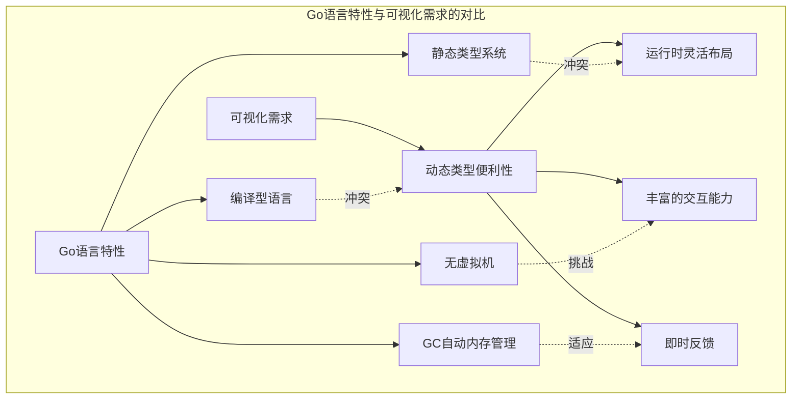

**根本原因分析**：为什么Go语言的图表生态起步较晚？

这是一个多层面的问题，涉及语言设计、历史发展和生态成熟度等多个因素：

**第一，语言的原初定位不同**。Go语言的创始团队将目标设定为系统编程和服务器端开发，数据可视化并非核心场景。这导致语言设计时没有考虑图形渲染的便利性。

**第二，缺少类似Python的REPL环境**。Python的IPython/Jupyter环境极大促进了数据科学生态的发展，开发者可以即时看到可视化结果。Go的编译型特性使得这种即时反馈更难实现。

**第三，跨平台GUI开发的复杂性**。Go没有原生的GUI框架，Windows、macOS、Linux的图形API各不相同，这增加了图表库的开发难度。

**第四，内存管理模型的限制**。Go的GC虽然简化了内存管理，但与需要精细控制渲染的图形库之间存在一些摩擦。

然而，这些挑战也催生了Go语言独特的解决方案：利用Web技术栈、通过W3C标准实现跨平台、利用Go的并发优势处理大规模数据等。我们将在后续章节详细讨论这些方案。

### 1.2 Go语言图表库的技术流派

经过多年的发展，Go语言的图表库形成了三大主要技术流派，每种流派都有其独特的优势和适用场景。

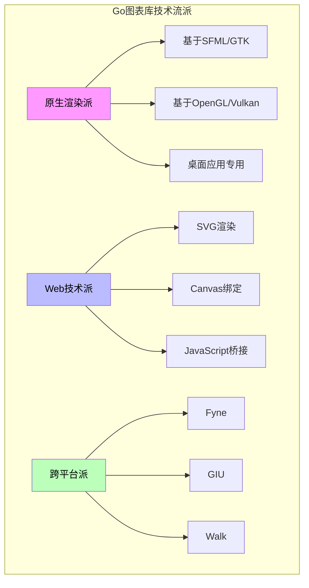

**原生渲染派**追求最佳的性能和最深度的系统集成，代表库包括基于OpenGL的`go-gl`和桌面GUI框架如`gtk`、`walk`等。这种方式可以获得原生应用的体验，但开发复杂度较高。

**Web技术派**利用Web技术在跨平台和易用性方面的优势，通过SVG或Canvas渲染图表，或者通过JavaScript桥接利用成熟的JS图表库。这种方式是当前最主流的选择。

**跨平台派**提供统一的API来抽象底层差异，如`Fyne`和`GIU`。这种方式简化了多平台部署，但可能在特定平台上无法获得最优体验。

### 1.3 主流Go图表库概览

让我们对当前主流的Go图表库进行一个全面的了解：

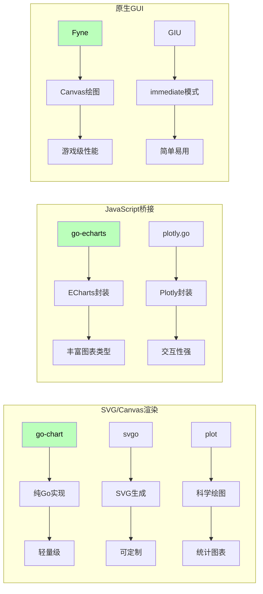

---

## 第二章：图表绑定的核心概念

### 2.1 什么是图表绑定？

图表绑定（Chart Binding）是连接数据与可视化表现层的桥梁。它定义了数据如何被读取、转换、映射，最终呈现为用户可见的图形元素。

从技术角度来看，图表绑定涉及以下几个核心环节：

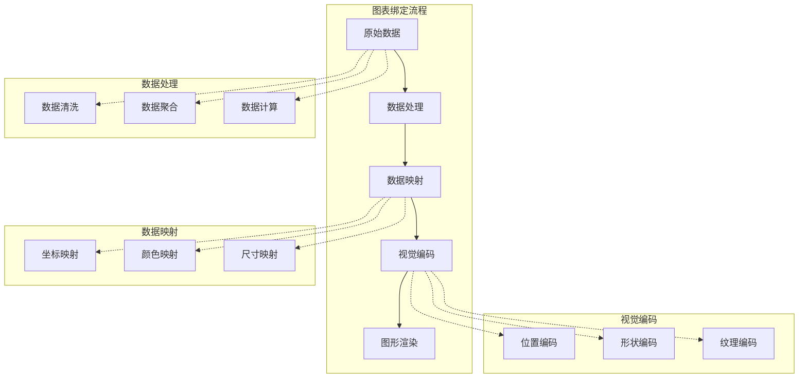

**根本原因分析**：为什么图表绑定如此重要？

图表绑定的质量直接决定了数据可视化的效果和效率。一个优秀的绑定层可以：

1. **简化开发者的工作**：开发者只需要关注数据的结构和语义，不需要了解渲染的细节。

2. **提供一致的抽象**：不同的图表类型可以使用相同的数据接口，降低学习成本。

3. **优化性能**：合理的绑定实现可以缓存中间结果，避免重复计算。

4. **支持数据变化**：当底层数据变化时，绑定层可以高效地更新图表，而不需要完全重绘。

### 2.2 数据模型设计

在Go语言中设计图表数据模型时，我们需要考虑Go语言的类型系统特性。以下是一个典型的图表数据模型设计：

```go
// 基础数据点
type DataPoint struct {
    X    float64    // X轴坐标
    Y    float64    // Y轴坐标
    Label string    // 标签（可选）
    Color string    // 颜色（可选）
}

// 系列数据（用于折线图、柱状图等）
type Series struct {
    Name   string
    Points []DataPoint
    Style  SeriesStyle  // 样式配置
}

// 图表配置
type ChartConfig struct {
    Title      string
    Width      int
    Height     int
    XAxis      AxisConfig
    YAxis      AxisConfig
    Series     []Series
    Theme      Theme
}

// 样式配置
type SeriesStyle struct {
    LineColor     string
    LineWidth     float64
    FillColor     string
    PointStyle    PointStyle
    PointSize     float64
}
```

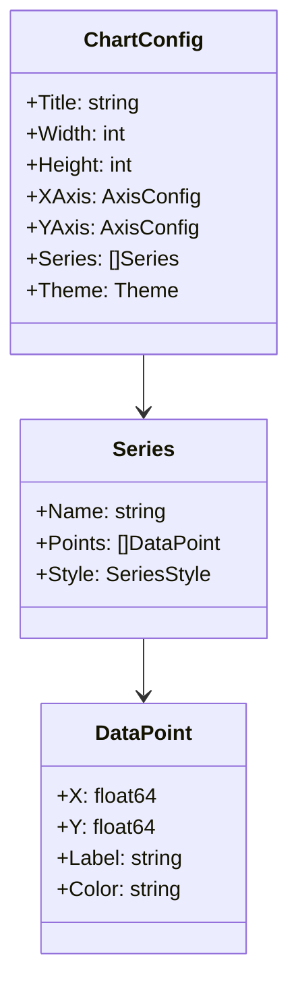

### 2.3 数据绑定的实现原理

理解数据绑定的实现原理对于深度掌握图表技术至关重要。不同的实现方式会显著影响性能、灵活性和易用性。

#### 直接绑定模式

直接绑定是最简单的方式，开发者直接提供完整的数据结构：

```go
// 直接绑定示例
chart := &Chart{
    Series: []Series{
        {
            Name: "Sales",
            Points: []DataPoint{
                {X: 1, Y: 100},
                {X: 2, Y: 200},
                {X: 3, Y: 150},
            },
        },
    },
}
chart.Render()
```

这种方式简单直观，但缺乏灵活性，数据变化时需要完全重建图表。

#### 响应式绑定模式

响应式绑定允许数据变化时自动更新图表，这需要实现观察者模式：

```go
// 响应式绑定示例
type ObservableSeries struct {
    mu    sync.RWMutex
    data  []DataPoint
    subs  []chan []DataPoint
}

func (s *ObservableSeries) SetData(data []DataPoint) {
    s.mu.Lock()
    s.data = data
    s.mu.Unlock()
    
    // 通知所有订阅者
    for _, sub := range s.subs {
        sub <- data
    }
}

func (s *ObservableSeries) Subscribe(ch chan []DataPoint) {
    s.subs = append(s.subs, ch)
}

// 使用
series := &ObservableSeries{}
go func() {
    for data := range series.Subscribe() {
        chart.UpdateSeries("Sales", data)
    }
}()
```

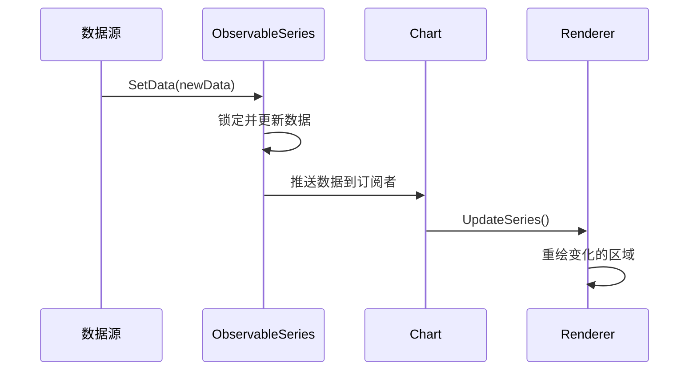

**根本原因分析**：为什么Go语言更常使用直接绑定而非响应式绑定？

这涉及到Go语言的设计哲学和运行时特性：

**第一，Go语言没有内置的响应式框架**。像Vue的响应式系统或React的虚拟DOM这类机制在Go中需要手动实现，增加了复杂度。

**第二，Go的并发模型更强调显式控制**。使用channel和goroutine来实现响应式绑定更符合Go的惯用法。

**第三，大多数Go图表应用是服务端渲染**。数据通常是一次性准备好然后渲染，不需要高频更新。

**第四，性能考量**。响应式绑定会引入额外的内存和CPU开销，而Go通常用于对性能敏感的场景。

然而，对于需要实时数据更新的应用（如监控系统），响应式绑定仍然是一个重要的选择。

### 2.4 坐标系统与映射

坐标系统是图表绑定的核心抽象之一，它将数据空间映射到屏幕空间。

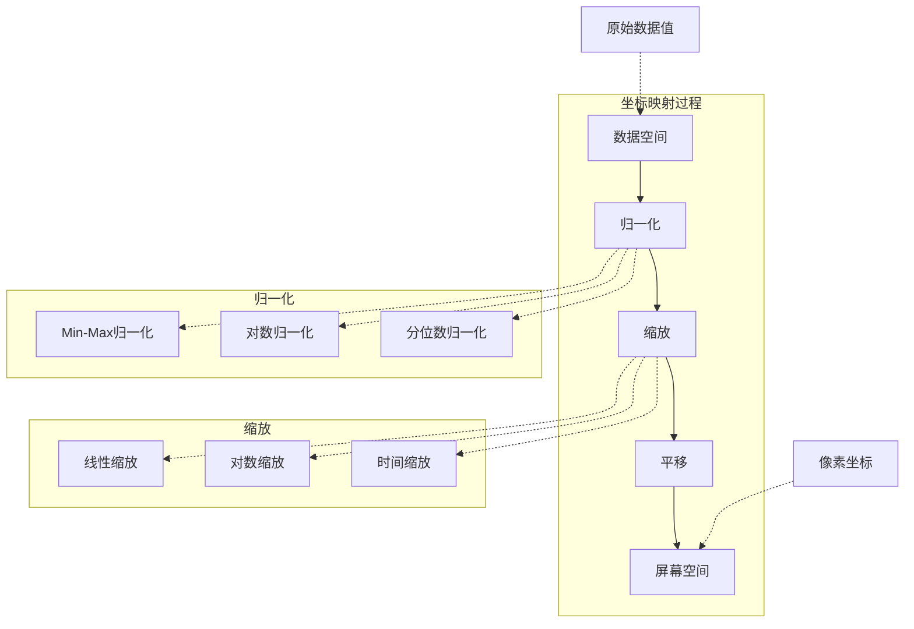

#### 线性映射实现

```go
// 线性映射器
type LinearMapper struct {
    minDomain float64  // 数据最小值
    maxDomain float64  // 数据最大值
    minRange  float64  // 屏幕最小值
    maxRange  float64  // 屏幕最大值
}

func (m *LinearMapper) Map(value float64) float64 {
    // 线性插值公式
    // y = y0 + (x - x0) * (y1 - y0) / (x1 - x0)
    ratio := (value - m.minDomain) / (m.maxDomain - m.minDomain)
    return m.minRange + ratio*(m.maxRange-m.minRange)
}

func (m *LinearMapper) Inverse(screenPos float64) float64 {
    ratio := (screenPos - m.minRange) / (m.maxRange - m.minRange)
    return m.minDomain + ratio*(m.maxDomain-m.minDomain)
}

// 使用示例
mapper := &LinearMapper{
    minDomain: 0,
    maxDomain: 100,
    minRange:  0,
    maxRange:  400,  // 屏幕上的400像素高度
}

// 数据值50映射到屏幕位置200
screenY := mapper.Map(50)
```

#### 对数映射实现

对于跨越多个数量级的数据，对数映射更为合适：

```go
// 对数映射器
type LogMapper struct {
    minDomain float64
    maxDomain float64
    minRange  float64
    maxRange  float64
}

func (m *LogMapper) Map(value float64) float64 {
    if value <= 0 {
        return m.minRange
    }
    
    logValue := math.Log(value)
    logMin := math.Log(m.minDomain)
    logMax := math.Log(m.maxDomain)
    
    ratio := (logValue - logMin) / (logMax - logMin)
    return m.minRange + ratio*(m.maxRange-m.minRange)
}
```

---

## 第三章：go-echarts深度解析

### 3.1 go-echarts概述

`go-echarts`是Go语言对著名JavaScript图表库ECharts的封装。它充分利用了ECharts丰富的图表类型和强大的交互能力，同时保持了Go语言的类型安全和简洁性。

ECharts是百度开源的一个基于JavaScript的商业级图表库，拥有80+种图表类型，涵盖了几乎所有常见的可视化需求。`go-echarts`让Go开发者可以轻松使用这些能力。

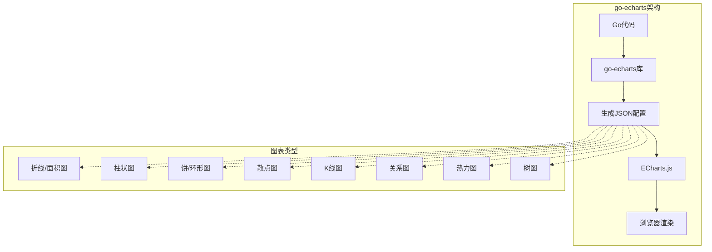

### 3.2 快速入门

安装`go-echarts`非常简单：

```bash
go get -u github.com/go-echarts/go-echarts/v2
```

创建一个基础折线图只需要几行代码：

```go
package main

import (
    "math/rand"
    "net/http"
    
    "github.com/go-echarts/go-echarts/v2/charts"
    "github.com/go-echarts/go-echarts/v2/components"
    "github.com/go-echarts/go-echarts/v2/opts"
)

func main() {
    // 创建折线图
    line := charts.NewLine()
    
    // 设置全局选项
    line.SetGlobalOptions(
        charts.WithTitle(opts.Title{Title: "示例折线图"}),
        charts.WithLegend(opts.Legend{Show: true}),
        charts.WithTooltip(opts.Tooltip{Show: true}),
        charts.WithXAxis(opts.XAxis{
            Type: "category",
            Data: []string{"周一", "周二", "周三", "周四", "周五", "周六", "周日"},
        }),
        charts.WithYAxis(opts.YAxis{Type: "value"}),
    )
    
    // 添加数据系列
    line.SetXAxis([]string{"周一", "周二", "周三", "周四", "周五", "周六", "周日"})
    line.AddSeries("销售额", generateLineData()).
        SetSeriesOptions(
            charts.WithLineChartOpts(opts.LineChart{
                Smooth: true,
            }),
        )
    
    // 渲染到HTTP响应
    http.HandleFunc("/", func(w http.ResponseWriter, _ *http.Request) {
        line.Render(w)
    })
    http.ListenAndServe(":8081", nil)
}

func generateLineData() []opts.LineData {
    items := make([]opts.LineData, 0)
    for i := 0; i < 7; i++ {
        items = append(items, opts.LineData{Value: rand.Intn(100)})
    }
    return items
}
```

### 3.3 图表类型详解

#### 柱状图

柱状图是最常用的图表类型之一，用于展示不同类别之间的数值比较：

```go
// 柱状图示例
func barChart() *charts.Bar {
    bar := charts.NewBar()
    
    bar.SetGlobalOptions(
        charts.WithTitle(opts.Title{Title: "月度销售数据", Subtitle: "单位：万元"}),
        charts.WithXAxis(opts.XAxis{
            Type: "category",
            Data: []string{"1月", "2月", "3月", "4月", "5月", "6月"},
        }),
        charts.WithYAxis(opts.YAxis{Type: "value"}),
        charts.WithTooltip(opts.Tooltip{Show: true, Trigger: "axis"}),
    )
    
    // 多系列数据
    bar.SetXAxis([]string{"1月", "2月", "3月", "4月", "5月", "6月"})
    bar.AddSeries("线上销售", generateBarData()).
        AddSeries("线下销售", generateBarData()).
        SetSeriesOptions(
            charts.WithBarChartOpts(opts.BarChart{
                BarMaxWidth: 30,
            }),
            charts.WithLabelOpts(opts.Label{
                Show:     true,
                Position: "top",
            }),
        )
    
    return bar
}

func generateBarData() []opts.BarData {
    items := make([]opts.BarData, 0)
    for i := 0; i < 6; i++ {
        items = append(items, opts.BarData{Value: rand.Intn(1000)})
    }
    return items
}
```

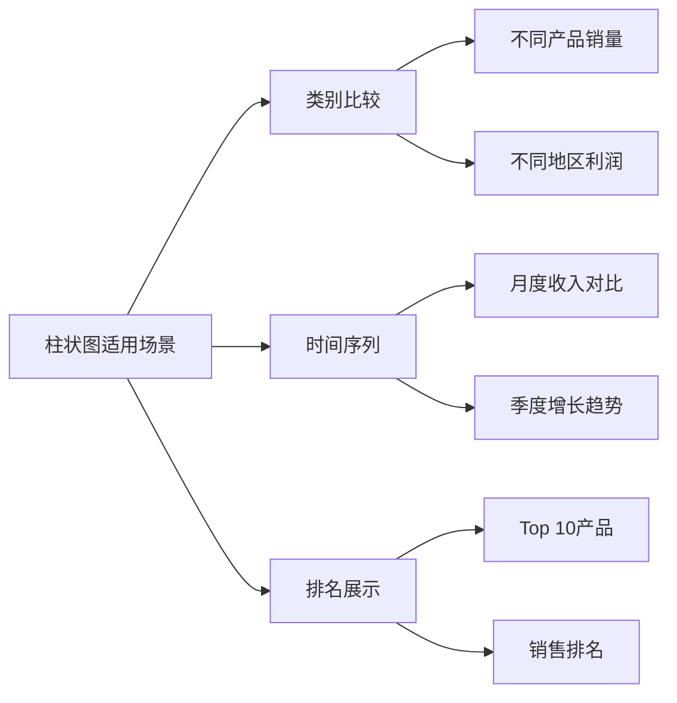

#### 饼图

饼图用于展示各部分占整体的比例关系：

```go
// 饼图示例
func pieChart() *charts.Pie {
    pie := charts.NewPie()
    
    pie.SetGlobalOptions(
        charts.WithTitle(opts.Title{Title: "市场份额"}),
        charts.WithTooltip(opts.Toololtip{Show: true, Trigger: "item", Formatter: "{b}: {c} ({d}%)"}),
    )
    
    // 数据
    pie.AddSeries("市场份额",
        opts.PieData{
            {Name: "产品A", Value: 35},
            {Name: "产品B", Value: 28},
            {Name: "产品C", Value: 20},
            {Name: "产品D", Value: 12},
            {Name: "其他", Value: 5},
        },
    ).
        SetSeriesOptions(
            charts.WithPieChartOpts(opts.PieChart{
                Radius: []string{"0%", "70%"},  // 环形图
                Center: []string{"50%", "50%"},
            }),
            charts.WithLabelOpts(opts.Label{
                Show:      true,
                Formatter: "{b}: {d}%",
            }),
        )
    
    return pie
}
```

#### 散点图

散点图用于展示两个变量之间的相关性：

```go
// 散点图示例
func scatterChart() *charts.Scatter {
    scatter := charts.NewScatter()
    
    scatter.SetGlobalOptions(
        charts.WithTitle(opts.Title{Title: "身高体重分布"}),
        charts.WithXAxis(opts.XAxis{Type: "value", Name: "身高(cm)"}),
        charts.WithYAxis(opts.YAxis{Type: "value", Name: "体重(kg)"}),
        charts.WithTooltip(opts.Tooltip{Show: true}),
    )
    
    // 生成二维正态分布数据
    scatter.AddSeries("样本",
        generateScatterData(100, 170, 60, 10, 8),
    ).SetSeriesOptions(
        charts.WithScatterChartOpts(opts.ScatterChart{
            SymbolSize: 10,
        }),
    )
    
    return scatter
}

func generateScatterData(n int, meanX, meanY, stdX, stdY float64) []opts.ScatterData {
    data := make([]opts.ScatterData, n)
    for i := 0; i < n; i++ {
        x := normalRandom(meanX, stdX)
        y := normalRandom(meanY, stdY)
        data[i] = opts.ScatterData{Value: []interface{}{x, y}}
    }
    return data
}

// Box-Muller变换生成正态分布随机数
func normalRandom(mean, std float64) float64 {
    u1 := rand.Float64()
    u2 := rand.Float64()
    z := math.Sqrt(-2*math.Log(u1)) * math.Cos(2*math.Pi*u2)
    return mean + z*std
}
```

### 3.4 数据绑定的深层机制

#### 数据验证与转换

`go-echarts`在内部做了大量的数据验证和转换工作，确保最终生成的配置是有效的：

```go
// 数据处理流程
func (s *Series) processData() {
    // 1. 数据类型检查
    validateDataTypes()
    
    // 2. 数值范围验证
    validateRanges()
    
    // 3. 数据聚合（大数据量时）
    if len(data) > threshold {
        data = aggregateData(data)
    }
    
    // 4. 转换为ECharts格式
    chartData := convertToEChartsFormat()
    
    // 5. 生成JSON
    jsonBytes = json.Marshal(chartData)
}
```

**根本原因分析**：为什么go-echarts使用JSON配置而不是直接API调用？

这个问题涉及几个层面的考量：

**第一，接口简洁性**。JSON配置方式让开发者可以用统一的方式配置各种图表类型，降低了学习成本。ECharts本身就是通过JSON配置的，go-echarts只是提供了Go的封装。

**第二，版本兼容性**。ECharts本身在持续更新，直接API绑定会导致库版本与ECharts版本强耦合。通过JSON配置，可以更容易地兼容不同版本的ECharts。

**第三，渲染位置灵活**。JSON配置可以发送到任何地方渲染——浏览器、服务端（SSR）、移动端（小程序）。这提供了更大的灵活性。

**第四，性能考量**。Go处理JSON的速度远快于频繁的跨语言调用。对于大数据量的图表，一次性生成配置比多次API调用更高效。

#### 模板渲染机制

`go-echarts`使用Go的HTML模板系统来生成最终的HTML页面：

```go
// 渲染流程
func (c *BaseRenderer) Render(w io.Writer) error {
    // 1. 生成ECharts选项JSON
    optionsJSON := c.generateOptions()
    
    // 2. 获取HTML模板
    tmpl := GetTemplate(c.ChartType)
    
    // 3. 执行模板
    data := map[string]interface{}{
        "Options": optionsJSON,
        "Theme":   c.Theme,
    }
    return tmpl.Execute(w, data)
}

// 模板示例
const chartTemplate = `
<div id="{{.ChartID}}" style="width:{{.Width}};height:{{.Height}};"></div>
<script type="text/javascript">
    var chart = echarts.init(document.getElementById("{{.ChartID}}"), "{{.Theme}}");
    var options = {{.Options}};
    chart.setOption(options);
    {{if .Events}}
    // 绑定事件
    {{range .Events}}
    chart.on("{{.Event}}", function(params) {
        {{.Handler}}
    });
    {{end}}
    {{end}}
</script>
`
```

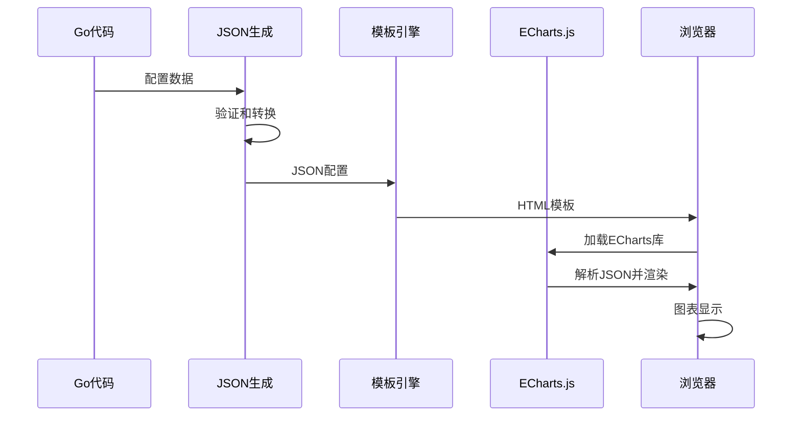

### 3.5 高级特性

#### 主题配置

`go-echarts`支持自定义主题，可以统一控制所有图表元素的颜色和样式：

```go
// 主题配置示例
func themeExample() {
    // 内置主题
    theme := charts.ThemeSimple  // 简洁主题
    // 或使用其他主题:ThemeDark, ThemeLight, ThemeMacarons等
    
    line := charts.NewLine()
    line.SetGlobalOptions(
        charts.WithTheme(theme),
    )
}

// 自定义颜色主题
func customTheme() {
    line := charts.NewLine()
    line.SetGlobalOptions(
        charts.WithColors([]string{
            "#c23531",
            "#2f4554",
            "#61a0a8",
            "#d48265",
            "#91c7ae",
        }),
    )
}
```

#### 动画效果

ECharts原生支持丰富的动画效果：

```go
// 动画配置
line.SetSeriesOptions(
    charts.WithLineChartOpts(opts.LineChart{
        Smooth: true,
    }),
    charts.WithAnimationOpts(opts.Animation{
        Duration: 1000,
        Easing:   "cubicOut",
    }),
    charts.WithAnimationDelay(opts.AnimationDelay{
        SeriesAnimation: 0,
        UpdateAnimation: 300,
    }),
)
```

#### 交互事件

绑定点击、悬停等交互事件：

```go
// 事件处理示例
func eventExample() *charts.Bar {
    bar := charts.NewBar()
    
    // 在JavaScript端处理事件
    bar.SetEvents(
        charts.WithClickEvent(func(params interface{}) {
            // 处理点击事件
            fmt.Println("Clicked!")
        }),
        charts.WithMouseOverEvent(func(params interface{}) {
            // 处理悬停事件
        }),
    )
    
    return bar
}

// 完整的事件处理需要自定义模板
const eventTemplate = `
<script>
chart.on('click', function(params) {
    // 发送事件到Go后端
    fetch('/chart-event', {
        method: 'POST',
        body: JSON.stringify(params)
    });
});
</script>
`
```

---

## 第四章：go-chart深度解析

### 4.1 go-chart简介

`go-chart`是另一个流行的Go图表库，与`go-echarts`不同，它是一个纯Go实现的图表库，不依赖任何外部JavaScript库。这使得它特别适合在服务端生成静态图表图像。

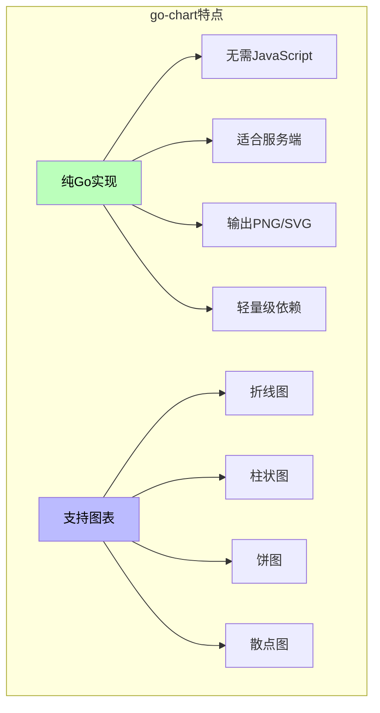

### 4.2 基本用法

安装：

```bash
go get -u github.com/wcharczuk/go-chart/v2
```

创建基础折线图：

```go
package main

import (
    "bytes"
    "fmt"
    "image/png"
    
    "github.com/wcharczuk/go-chart/v2"
)

func main() {
    // 创建折线图
    lineChart := chart.Chart{
        Title:  "示例折线图",
        Width:  800,
        Height: 400,
        
        // X轴配置
        XAxis: chart.XAxis{
            Name:      "时间",
            NameStyle: chart.StyleTextBold(),
            Style:     chart.StyleTextRotationDegrees(45),
        },
        
        // Y轴配置
        YAxis: chart.YAxis{
            Name: "数值",
            ValueFormatter: func(v interface{}) string {
                if f, ok := v.(float64); ok {
                    return fmt.Sprintf("%.0f", f)
                }
                return ""
            },
        },
        
        // 数据系列
        Series: []chart.Series{
            chart.ContinuousSeries{
                Name: "数据系列",
                Style: chart.Style{
                    StrokeColor: chart.ColorBlue,
                    FillColor:   chart.ColorBlue.WithAlpha(50),
                },
                XValues: []float64{1, 2, 3, 4, 5, 6, 7},
                YValues: []float64{10, 20, 15, 25, 30, 22, 35},
            },
        },
    }
    
    // 渲染到PNG
    buffer, err := lineChart.Render(chart.PNG)
    if err != nil {
        panic(err)
    }
    
    // 写入文件
    err = png.Encode(bytes.NewBuffer(buffer), &image.RGBA{})
    // ...
}
```

### 4.3 图表类型详解

#### 堆叠柱状图

```go
// 堆叠柱状图
func stackedBarChart() chart.Chart {
    return chart.Chart{
        Title: "堆叠柱状图示例",
        
        Series: []chart.Series{
            chart.BarSeries{
                Name: "产品A",
                Values: []float64{30, 40, 35, 50, 45},
            },
            chart.BarSeries{
                Name: "产品B",
                Values: []float64{20, 30, 25, 40, 35},
                Style: chart.Style{FillColor: chart.ColorOrange},
            },
            chart.BarSeries{
                Name: "产品C",
                Values: []float64{10, 15, 10, 20, 25},
                Style: chart.Style{FillColor: chart.ColorGreen},
            },
        },
    }
}
```

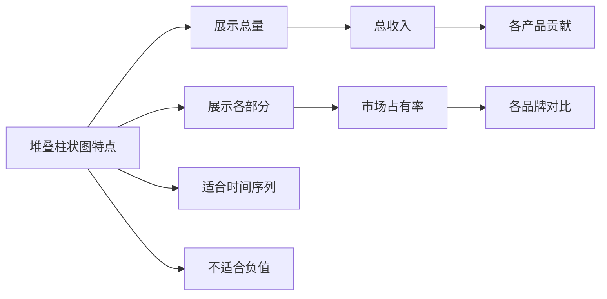

#### 饼图

```go
// 饼图
func pieChart() chart.Chart {
    return chart.Chart{
        Title: "市场份额",
        
        Series: []chart.Series{
            chart.PieSeries{
                Values: []float64{35, 25, 20, 12, 8},
                Labels: []string{
                    "产品A", "产品B", "产品C", "产品D", "其他",
                },
                Style: chart.Style{
                    FontSize:  12,
                    TextColor: chart.ColorBlack,
                },
                ShowPercentage: true,
            },
        },
    }
}
```

### 4.4 渲染输出格式

`go-chart`支持多种输出格式：

```go
// 渲染为PNG
buffer, _ := chart.Render(chart.PNG)

// 渲染为SVG
buffer, _ := chart.Render(chart.SVG)

// 渲染为EPS (矢量图)
buffer, _ := chart.Render(chart.EPS)

// 输出到HTTP响应
func handler(w http.ResponseWriter, req *http.Request) {
    line := createLineChart()
    w.Header().Set("Content-Type", "image/png")
    line.Render(chart.PNG, w)
}
```

### 4.5 与go-echarts的对比

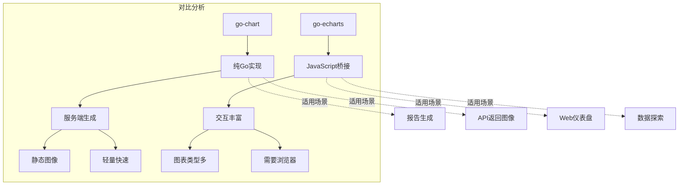

**根本原因分析**：什么时候选择go-chart而不是go-echarts？

**选择go-chart的场景：**
- 需要生成静态图像用于报告或PDF
- 服务端API需要返回图表图像
- 对性能要求极高，不需要交互
- 部署环境无法运行浏览器

**选择go-echarts的场景：**
- 需要丰富的交互功能（缩放、悬停提示等）
- 图表类型需求多样
- Web应用场景
- 需要动态更新数据

---

## 第五章：原生绑定方案

### 5.1 Fyne框架

Fyne是Go语言的一个跨平台GUI框架，也提供了基本的图表绑功能。它的特点是完全使用Go编写，提供了原生的用户体验。

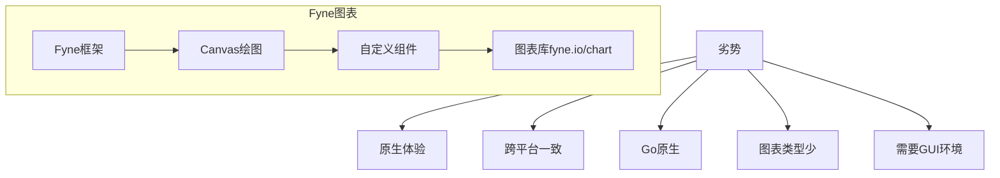

安装：

```bash
go get fyne.io/fyne/v2
go get fyne.io/example/browser
```

基本用法：

```go
package main

import (
    "fyne.io/fyne/v2"
    "fyne.io/fyne/v2/app"
    "fyne.io/fyne/v2/canvas"
    "fyne.io/fyne/v2/container"
    "image"
    "math"
    "os"
)

func main() {
    a := app.New()
    w := a.NewWindow("图表示例")
    
    // 创建画布并绘制
    c := canvas.NewImageFromImage(createChartImage())
    c.FillMode = canvas.ImageFillContain
    
    w.SetContent(container.NewVBox(
        canvas.NewText("销售趋势图", nil),
        c,
    ))
    
    w.Resize(fyne.NewSize(800, 600))
    w.ShowAndRun()
}

// 创建图表图像
func createChartImage() image.Image {
    // 使用go-chart生成图表
    // 然后转换为Fyne可用的image.Image
    return chartImage
}
```

### 5.2 另一种方案：自定义渲染

对于需要完全控制的场景，可以直接使用Canvas API进行绑制：

```go
package main

import (
    "image"
    "image/color"
    "image/png"
    "os"
)

type ChartRenderer struct {
    width, height int
    data          []float64
    maxValue      float64
}

// 渲染为图像
func (r *ChartRenderer) Render() image.Image {
    img := image.NewRGBA(image.Rect(0, 0, r.width, r.height))
    
    // 绘制背景
    bg := color.RGBA{255, 255, 255, 255}
    for x := 0; x < r.width; x++ {
        for y := 0; y < r.height; y++ {
            img.Set(x, y, bg)
        }
    }
    
    // 绘制柱状图
    barWidth := r.width / len(r.data)
    for i, v := range r.data {
        barHeight := int(float64(r.height) * v / r.maxValue)
        for x := i * barWidth; x < (i+1)*barWidth; y++ {
            for y := r.height - barHeight; y < r.height; y++ {
                img.Set(x, y, color.RGBA{66, 133, 244, 255})
            }
        }
    }
    
    return img
}

// 使用
func main() {
    renderer := &ChartRenderer{
        width:    800,
        height:   400,
        data:     []float64{10, 25, 15, 30, 45, 20, 35},
        maxValue: 50,
    }
    
    img := renderer.Render()
    png.Encode(os.Stdout, img)
}
```

---

## 第六章：数据处理与变换

### 6.1 数据预处理

在实际应用中，原始数据往往不能直接用于绑定，需要经过预处理：

```go
package main

import (
    "math"
    "sort"
)

// 数据统计信息
type DataStats struct {
    Min      float64
    Max      float64
    Mean     float64
    Median   float64
    StdDev   float64
    Q1, Q3   float64
}

// 计算统计信息
func CalculateStats(data []float64) DataStats {
    if len(data) == 0 {
        return DataStats{}
    }
    
    sorted := make([]float64, len(data))
    copy(sorted, data)
    sort.Float64s(sorted)
    
    sum := 0.0
    for _, v := range data {
        sum += v
    }
    mean := sum / float64(len(data))
    
    // 标准差
    variance := 0.0
    for _, v := range data {
        variance += math.Pow(v-mean, 2)
    }
    stdDev := math.Sqrt(variance / float64(len(data)))
    
    return DataStats{
        Min:    sorted[0],
        Max:    sorted[len(sorted)-1],
        Mean:   mean,
        Median: sorted[len(sorted)/2],
        StdDev: stdDev,
        Q1:     sorted[len(sorted)/4],
        Q3:     sorted[3*len(sorted)/4],
    }
}

// 数据标准化（Min-Max缩放）
func Normalize(data []float64, min, max float64) []float64 {
    if len(data) == 0 {
        return data
    }
    
    dataMin := data[0]
    dataMax := data[0]
    for _, v := range data {
        if v < dataMin {
            dataMin = v
        }
        if v > dataMax {
            dataMax = v
        }
    }
    
    range_ := dataMax - dataMin
    if range_ == 0 {
        range_ = 1
    }
    
    result := make([]float64, len(data))
    for i, v := range data {
        result[i] = min + (v-dataMin)/range_*(max-min)
    }
    
    return result
}

// Z-Score标准化
func ZScoreNormalize(data []float64) ([]float64, float64, float64) {
    if len(data) == 0 {
        return nil, 0, 0
    }
    
    stats := CalculateStats(data)
    result := make([]float64, len(data))
    
    for i, v := range data {
        if stats.StdDev == 0 {
            result[i] = 0
        } else {
            result[i] = (v - stats.Mean) / stats.StdDev
        }
    }
    
    return result, stats.Mean, stats.StdDev
}
```

### 6.2 时间序列数据处理

时间序列数据是图表应用中常见的数据类型：

```go
package main

import (
    "time"
)

// 时间序列数据点
type TimeSeriesPoint struct {
    Time  time.Time
    Value float64
}

// 时间序列数据
type TimeSeries struct {
    Name   string
    Points []TimeSeriesPoint
}

// 重采样（聚合时间窗口）
func (ts *TimeSeries) Resample(duration time.Duration) []TimeSeriesPoint {
    if len(ts.Points) == 0 {
        return nil
    }
    
    // 按时间排序
    sort.Slice(ts.Points, func(i, j int) bool {
        return ts.Points[i].Time.Before(ts.Points[j].Time)
    })
    
    // 初始化bucket
    start := ts.Points[0].Time.Truncate(duration)
    end := ts.Points[len(ts.Points)-1].Time.Truncate(duration)
    
    buckets := make(map[time.Time][]float64)
    for t := start; !t.After(end); t = t.Add(duration) {
        buckets[t] = nil
    }
    
    // 分配数据到bucket
    for _, p := range ts.Points {
        bucketTime := p.Time.Truncate(duration)
        if _, ok := buckets[bucketTime]; ok {
            buckets[bucketTime] = append(buckets[bucketTime], p.Value)
        }
    }
    
    // 聚合
    result := make([]TimeSeriesPoint, 0, len(buckets))
    for t, values := range buckets {
        if len(values) == 0 {
            result = append(result, TimeSeriesPoint{Time: t, Value: 0})
            continue
        }
        
        // 计算平均值
        sum := 0.0
        for _, v := range values {
            sum += v
        }
        result = append(result, TimeSeriesPoint{
            Time:  t,
            Value: sum / float64(len(values)),
        })
    }
    
    return result
}

// 移动平均
func (ts *TimeSeries) MovingAverage(window int) []TimeSeriesPoint {
    if len(ts.Points) == 0 || window <= 0 {
        return ts.Points
    }
    
    result := make([]TimeSeriesPoint, 0, len(ts.Points))
    
    for i := 0; i < len(ts.Points); i++ {
        start := i - window + 1
        if start < 0 {
            start = 0
        }
        
        sum := 0.0
        count := 0
        for j := start; j <= i; j++ {
            sum += ts.Points[j].Value
            count++
        }
        
        result = append(result, TimeSeriesPoint{
            Time:  ts.Points[i].Time,
            Value: sum / float64(count),
        })
    }
    
    return result
}
```

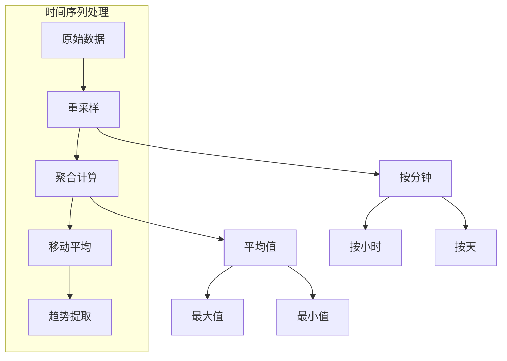

### 6.3 数据分组与聚合

```go
package main

// 分组聚合
type GroupedData struct {
    Groups map[string][]float64
}

// 按类别分组
func GroupBy(data []DataPoint, categoryKey func(DataPoint) string) GroupedData {
    groups := make(map[string][]float64)
    
    for _, p := range data {
        key := categoryKey(p)
        groups[key] = append(groups[key], p.Value)
    }
    
    return GroupedData{Groups: groups}
}

// 聚合函数类型
type Aggregator func([]float64) float64

// 常用聚合函数
var (
    SumAggregator   = func(values []float64) float64 {
        sum := 0.0
        for _, v := range values {
            sum += v
        }
        return sum
    }
    AvgAggregator   = func(values []float64) float64 {
        if len(values) == 0 {
            return 0
        }
        return SumAggregator(values) / float64(len(values))
    }
    MaxAggregator   = func(values []float64) float64 {
        if len(values) == 0 {
            return 0
        }
        max := values[0]
        for _, v := range values {
            if v > max {
                max = v
            }
        }
        return max
    }
    MinAggregator   = func(values []float64) float64 {
        if len(values) == 0 {
            return 0
        }
        min := values[0]
        for _, v := range values {
            if v < min {
                min = v
            }
        }
        return min
    }
    CountAggregator = func(values []float64) float64 {
        return float64(len(values))
    }
)

// 执行聚合
func (g GroupedData) Aggregate(agg Aggregator) map[string]float64 {
    result := make(map[string]float64)
    
    for key, values := range g.Groups {
        result[key] = agg(values)
    }
    
    return result
}
```

---

## 第七章：图表样式与主题

### 7.1 视觉编码原则

数据可视化不仅仅是将数据画出来，更重要的是通过视觉编码让数据更容易被理解：

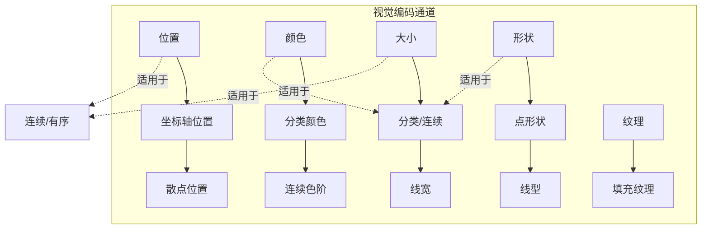

### 7.2 颜色方案

```go
package main

import "github.com/go-echarts/go-echarts/v2/opts"

// 分类颜色方案
var CategoryColors = []string{
    "#5470c6",
    "#91cc75",
    "#fac858",
    "#ee6666",
    "#73c0de",
    "#3ba272",
    "#fc8452",
    "#9a60b4",
    "#ea7ccc",
}

// 连续色阶（蓝到红）
var GradientColors = []string{
    "#313695", "#4575b4", "#74add1", "#abd9e9",
    "#e0f3f8", "#ffffbf", "#fee090", "#fdae61",
    "#f46d43", "#d73027", "#a50026",
}

// 热力图色阶
var HeatmapColors = []string{
    "#0000FF", "#00FFFF", "#00FF00", "#FFFF00", "#FF0000",
}

// 使用示例
func colorExample() {
    line := charts.NewLine()
    line.SetGlobalOptions(
        charts.WithColors(CategoryColors),
    )
}
```

### 7.3 主题系统

```go
package main

import "github.com/go-echarts/go-echarts/v2/charts"

// 浅色主题
func LightTheme() charts.GlobalOpts {
    return charts.WithTheme(charts.ThemeTypeLight)
}

// 深色主题
func DarkTheme() charts.GlobalOpts {
    return charts.WithTheme(charts.ThemeTypeDark)
}

// 自定义主题
func CustomTheme() charts.GlobalOpts {
    return charts.WithTheme("custom-theme")
}

// 渐变主题
func GradientTheme() charts.GlobalOpts {
    return charts.WithVisualMap(
        opts.VisualMap{
            Show:  true,
            Type:  "continuous",
            Min:   0,
            Max:   100,
            InRange: opts.VisualMapInRange{
                Color: []string{
                    "#313695", "#4575b4", "#74add1",
                    "#abd9e9", "#e0f3f8", "#ffffbf",
                    "#fee090", "#fdae61", "#f46d43",
                    "#d73027", "#a50026",
                },
            },
        },
    )
}
```

---

## 第八章：性能优化

### 8.1 大数据量优化

当数据量很大时，图表绑制可能会变得很慢。以下是一些优化策略：

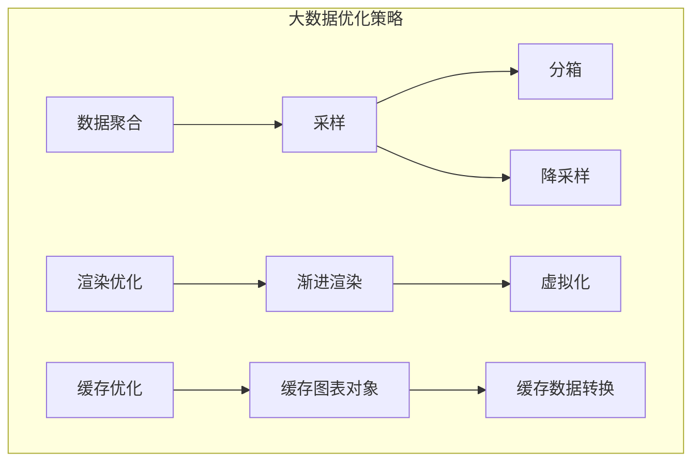

#### 数据采样

```go
package main

import "math"

// 均匀采样
func UniformSample(data []float64, targetCount int) []float64 {
    if len(data) <= targetCount {
        return data
    }
    
    step := float64(len(data)) / float64(targetCount)
    result := make([]float64, 0, targetCount)
    
    for i := 0; i < targetCount; i++ {
        idx := int(float64(i) * step)
        if idx >= len(data) {
            idx = len(data) - 1
        }
        result = append(result, data[idx])
    }
    
    return result
}

// LTTB（最大面积三角形细分）采样
// 保持数据形状的同时大幅减少数据点
func LTTBSample(data []float64, threshold int) []float64 {
    if len(data) <= threshold {
        return data
    }
    
    // LTTB算法的简化实现
    // 保留关键极点，舍去中间点
    result := make([]float64, 0, threshold)
    result = append(result, data[0])
    
    // ... LTTB核心算法
    
    result = append(result, data[len(data)-1])
    return result
}

// 分箱聚合
func BinAggregation(data []float64, binCount int) []float64 {
    if len(data) == 0 || binCount <= 0 {
        return nil
    }
    
    binSize := float64(len(data)) / float64(binCount)
    result := make([]float64, 0, binCount)
    
    for i := 0; i < binCount; i++ {
        start := int(float64(i) * binSize)
        end := int(float64(i+1) * binSize)
        if end > len(data) {
            end = len(data)
        }
        
        // 计算该箱的平均值
        sum := 0.0
        for _, v := range data[start:end] {
            sum += v
        }
        result = append(result, sum/float64(end-start))
    }
    
    return result
}
```

#### 渐进渲染

对于非常大的数据集，可以采用渐进渲染策略：

```go
package main

import "sync"

// 渐进渲染器
type ProgressiveRenderer struct {
    data      []float64
    threshold int
    results   chan []float64
    wg        sync.WaitGroup
}

// 执行渐进渲染
func (p * ProgressiveRenderer) Render() {
    // 第一次渲染：少量数据快速显示
    initialData := UniformSample(p.data, 100)
    p.results <- initialData
    
    // 后续渲染：逐步增加精度
    for _, count := range []int{500, 2000, 10000, len(p.data)} {
        if count > p.threshold {
            p.wg.Add(1)
            go func(c int) {
                defer p.wg.Done()
                data := UniformSample(p.data, c)
                p.results <- data
            }(count)
        }
    }
    
    p.wg.Wait()
    close(p.results)
}
```

### 8.2 内存优化

```go
package main

import "sync"

// 对象池避免重复分配
var dataPointPool = sync.Pool{
    New: func() interface{} {
        return &DataPoint{}
    },
}

// 获取数据点
func GetDataPoint() *DataPoint {
    return dataPointPool.Get().(*DataPoint)
}

// 归还数据点
func PutDataPoint(dp *DataPoint) {
    dp.X = 0
    dp.Y = 0
    dp.Label = ""
    dataPointPool.Put(dp)
}

// 预分配系列数据
type Series struct {
    Points []DataPoint
    
    // 预分配的容量
    capacity int
}

func NewSeries(capacity int) *Series {
    return &Series{
        Points:   make([]DataPoint, 0, capacity),
        capacity: capacity,
    }
}

func (s *Series) Reset() {
    s.Points = s.Points[:0]
}
```

### 8.3 并发优化

```go
package main

import "sync"

// 并发数据处理
type ParallelProcessor struct {
    workers int
}

func NewParallelProcessor(workers int) *ParallelProcessor {
    return &ParallelProcessor{workers: workers}
}

// 并发处理数据
func (p *ParallelProcessor) Process(data []DataPoint, fn func(DataPoint) DataPoint) []DataPoint {
    if len(data) == 0 {
        return nil
    }
    
    result := make([]DataPoint, len(data))
    
    // 按数据块分割
    chunkSize := len(data) / p.workers
    if chunkSize < 1 {
        chunkSize = 1
    }
    
    var wg sync.WaitGroup
    
    for i := 0; i < p.workers; i++ {
        start := i * chunkSize
        end := start + chunkSize
        if i == p.workers-1 {
            end = len(data)
        }
        
        wg.Add(1)
        go func() {
            defer wg.Done()
            for j := start; j < end; j++ {
                result[j] = fn(data[j])
            }
        }()
    }
    
    wg.Wait()
    return result
}
```

---

## 第九章：最佳实践与案例

### 9.1 仪表盘设计模式

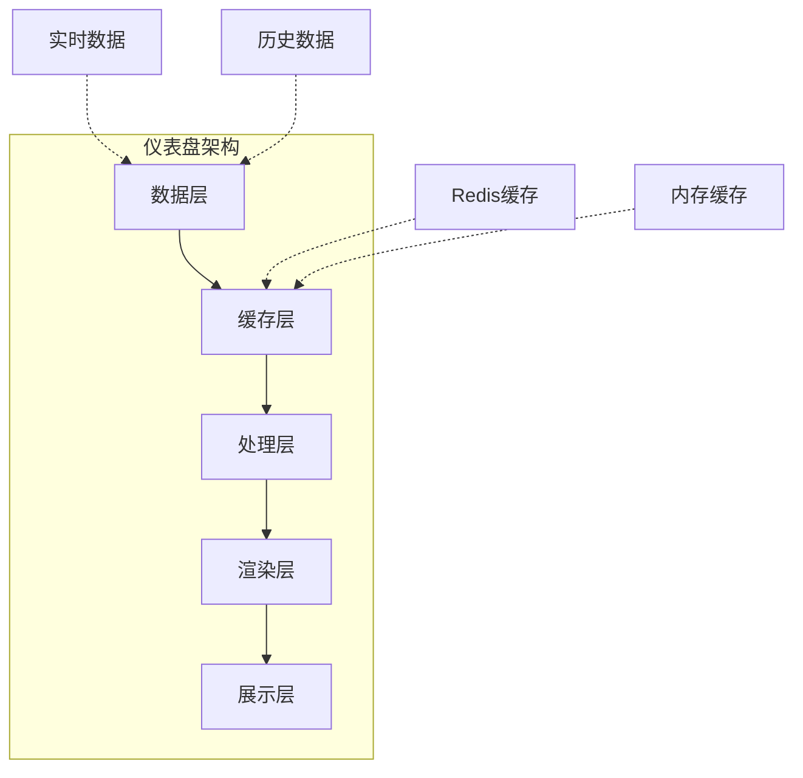

```go
package main

import (
    "context"
    "time"
    
    "github.com/go-echarts/go-echarts/v2"
    "github.com/go-echarts/go-echarts/v2/charts"
    "github.com/go-echarts/go-echarts/v2/opts"
)

// 仪表盘配置
type DashboardConfig struct {
    Title      string
    Width      int
    Height     int
    RefreshSec int
    Charts     []ChartConfig
}

// 仪表盘
type Dashboard struct {
    config  DashboardConfig
    cache   *ChartCache
    refresh time.Duration
}

// 创建新仪表盘
func NewDashboard(config DashboardConfig, refresh time.Duration) *Dashboard {
    return &Dashboard{
        config:  config,
        cache:   NewChartCache(),
        refresh: refresh,
    }
}

// 生成仪表盘页面
func (d *Dashboard) Render() string {
    page := components.NewPage()
    page.SetLayout(components.PageCenterLayout)
    page.Title = d.config.Title
    
    for _, cc := range d.config.Charts {
        chart := d.renderChart(cc)
        page.AddCharts(chart)
    }
    
    return page.RenderHTML()
}

// 渲染单个图表
func (d *Dashboard) renderChart(cc ChartConfig) echarts.Charts {
    var chart echarts.Charts
    
    switch cc.Type {
    case "line":
        chart = charts.NewLine()
    case "bar":
        chart = charts.NewBar()
    case "pie":
        chart = charts.NewPie()
    default:
        chart = charts.NewLine()
    }
    
    // 设置数据
    data := d.cache.Get(cc.DataKey)
    if data == nil {
        data = d.loadData(cc.DataKey)
    }
    
    // ... 绑定数据并返回
    
    chart.SetGlobalOptions(
        charts.WithTitle(opts.Title{Title: cc.Title}),
    )
    
    return chart
}
```

### 9.2 实时数据可视化

```go
package main

import (
    "math/rand"
    "time"
)

// 实时数据流处理器
type RealTimeProcessor struct {
    dataCh   chan float64
    buffer   []float64
    maxLen   int
    interval time.Duration
}

// 创建处理器
func NewRealTimeProcessor(maxLen int, interval time.Duration) *RealTimeProcessor {
    return &RealTimeProcessor{
        dataCh: make(chan float64, 100),
        buffer: make([]float64, 0, maxLen),
        maxLen: maxLen,
        interval: interval,
    }
}

// 启动数据流
func (p *RealTimeProcessor) Start() {
    go func() {
        ticker := time.NewTicker(p.interval)
        defer ticker.Stop()
        
        for {
            select {
            case <-ticker.C:
                // 生成模拟数据
                value := rand.Float64() * 100
                p.dataCh <- value
            }
        }
    }()
    
    go func() {
        for value := range p.dataCh {
            p.buffer = append(p.buffer, value)
            if len(p.buffer) > p.maxLen {
                p.buffer = p.buffer[1:]
            }
        }
    }()
}

// 获取当前数据
func (p *RealTimeProcessor) GetData() []float64 {
    result := make([]float64, len(p.buffer))
    copy(result, p.buffer)
    return result
}
```

### 9.3 响应式设计

```go
package main

// 响应式图表容器
type ResponsiveContainer struct {
    minWidth  int
    maxWidth  int
    minHeight int
    maxHeight int
}

// 计算响应式尺寸
func (r *ResponsiveContainer) CalculateSize(windowWidth, windowHeight int) (int, int) {
    // 根据窗口大小计算图表尺寸
    width := windowWidth - 40 // 边距
    height := windowHeight - 100 // 标题和边距
    
    // 应用约束
    if width < r.minWidth {
        width = r.minWidth
    }
    if width > r.maxWidth {
        width = r.maxWidth
    }
    if height < r.minHeight {
        height = r.minHeight
    }
    if height > r.maxHeight {
        height = r.maxHeight
    }
    
    return width, height
}

// 生成响应式HTML
func (r *ResponsiveContainer) GenerateHTML(chartID string) string {
    return `
    <div style="width:100%;height:100%;">
        <div id="` + chartID + `" style="width:100%;height:100%;"></div>
    </div>
    <script>
    window.addEventListener('resize', function() {
        var chart = echarts.getInstanceByDom(document.getElementById('` + chartID + `'));
        if (chart) {
            chart.resize();
        }
    });
    </script>
    `
}
```

---

## 第十章：高级主题

### 10.1 自定义图表类型

```go
package main

import (
    "github.com/go-echarts/go-echarts/v2/charts"
    "github.com/go-echarts/go-echarts/v2/opts"
)

// 自定义漏斗图
type FunnelChart struct {
    charts.BaseChart
}

func NewFunnelChart() *FunnelChart {
    c := &FunnelChart{}
    c.Type = "funnel"
    c.init()
    return c
}

func (c *FunnelChart) SetData(data []opts.FunnelData) *FunnelChart {
    c.XYAxis.Data = make([]string, len(data))
    c.Series[0].Data = make([]interface{}, len(data))
    
    for i, d := range data {
        c.XYAxis.Data[i] = d.Name
        c.Series[0].Data[i] = d.Value
    }
    
    return c
}

// 使用
func funnelExample() *FunnelChart {
    chart := NewFunnelChart()
    chart.SetGlobalOptions(
        charts.WithTitle(opts.Title{Title: "转化漏斗"}),
    )
    chart.SetData([]opts.FunnelData{
        {Name: "访问", Value: 10000},
        {Name: "注册", Value: 5000},
        {Name: "激活", Value: 3000},
        {Name: "付费", Value: 1000},
    })
    return chart
}
```

### 10.2 图表导出功能

```go
package main

import (
    "bytes"
    "encoding/base64"
    "html/template"
)

// 导出选项
type ExportOptions struct {
    Format string // png, jpeg, svg, pdf
    DPI    int
    Width  int
    Height int
}

// 导出为图片（需要服务器端渲染）
func ExportToImage(chart echarts.Charts, opts ExportOptions) ([]byte, error) {
    // 1. 获取SVG
    svgContent := chart.RenderSVG()
    
    // 2. 转换为目标格式
    // 使用cairo或其他库进行转换
    // 这里返回SVG的base64编码
    encoded := base64.StdEncoding.EncodeToString([]byte(svgContent))
    
    return []byte(encoded), nil
}

// 生成下载HTML
func GenerateDownloadPage(chartName string, data string) string {
    tmpl := `
    <!DOCTYPE html>
    <html>
    <head>
        <title>下载 {{.ChartName}}</title>
    </head>
    <body>
        
        <script>
            // 触发下载
            setTimeout(function() {
                var a = document.createElement('a');
                a.href = 'data:image/svg+xml;base64,' + '{{.Data}}';
                a.download = '{{.ChartName}}.svg';
                a.click();
            }, 1000);
        </script>
    </body>
    </html>
    `
    return tmpl
}
```

### 10.3 与其他系统集成

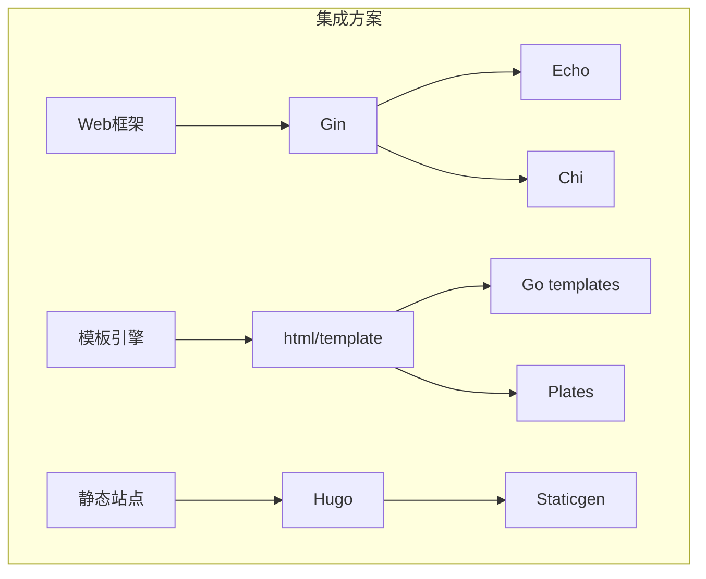

#### 与Gin框架集成

```go
package main

import (
    "net/http"
    
    "github.com/gin-gonic/gin"
    "github.com/go-echarts/go-echarts/v2/charts"
    "github.com/go-echarts/go-echarts/v2/opts"
)

func main() {
    r := gin.Default()
    
    // 渲染图表页面
    r.GET("/chart", func(c *gin.Context) {
        line := createLineChart()
        c.HTML(http.StatusOK, "chart.html", map[string]interface{}{
            "chart": line,
        })
    })
    
    // API返回图表数据
    r.GET("/api/chart/data", func(c *gin.Context) {
        data := map[string]interface{}{
            "categories": []string{"A", "B", "C", "D"},
            "values":     []int{10, 20, 30, 40},
        }
        c.JSON(http.StatusOK, data)
    })
    
    r.Run(":8080")
}

func createLineChart() *charts.Line {
    line := charts.NewLine()
    line.SetGlobalOptions(
        charts.WithTitle(opts.Title{Title: "示例图表"}),
    )
    line.SetXAxis([]string{"A", "B", "C", "D"})
    line.AddSeries("数据", []opts.LineData{
        {Value: 10}, {Value: 20}, {Value: 30}, {Value: 40},
    })
    return line
}
```

---

## 第十一章：常见问题与解决方案

### 11.1 中文显示问题

```go
package main

import (
    "github.com/go-echarts/go-echarts/v2/charts"
    "github.com/go-echarts/go-echarts/v2/opts"
)

// 解决方案1：使用本地字体
func chineseSupportExample() {
    line := charts.NewLine()
    line.SetGlobalOptions(
        charts.WithTitle(opts.Title{
            Title: "中文标题",
            TextStyle: &opts.TextStyle{
                FontFamily: "Microsoft YaHei",
            },
        }),
        charts.WithXAxis(opts.XAxis{
            AxisLabel: &opts.AxisLabel{
                TextStyle: &opts.TextStyle{
                    FontFamily: "Microsoft YaHei",
                },
            },
        }),
    )
}

// 解决方案2：引入ECharts的中文语言包
const ChineseLanguage = `
<script src="https://cdn.jsdelivr.net/npm/echarts@5.4.3/dist/echarts.min.js"></script>
<script src="https://cdn.jsdelivr.net/npm/echarts@5.4.3/dist/echarts.common.min.js"></script>
`
```

### 11.2 内存泄漏问题

```go
package main

import "runtime"

// 检测和避免内存泄漏
func memoryLeakDetection() {
    // 定期打印内存使用
    var m runtime.MemStats
    runtime.ReadMemStats(&m)
    
    print("Alloc:", m.Alloc/1024/1024, "MB\n")
    print("TotalAlloc:", m.TotalAlloc/1024/1024, "MB\n")
    print("Sys:", m.Sys/1024/1024, "MB\n")
}

// 建议：及时释放不再使用的图表对象
func cleanup() {
    // 在不需要时删除图表引用
    // 让GC回收
}
```

### 11.3 高DPI屏幕问题

```go
package main

import "github.com/go-echarts/go-echarts/v2/opts"

// 解决高分屏模糊问题
func highDPIExample() *charts.Line {
    line := charts.NewLine()
    
    // 设置渲染器为canvas，并指定devicePixelRatio
    line.SetGlobalOptions(
        charts.WithRenderer(charts.RenderTypeCanvas),
        charts.WithInitialization(opts.Initialization{
            DevicePixelRatio: 2, // 2x for Retina
        }),
    )
    
    return line
}

// SVG渲染自动适配高清屏
func svgHighDPI() *charts.Line {
    line := charts.NewLine()
    
    line.SetGlobalOptions(
        charts.WithRenderer(charts.RenderTypeSVG),
    )
    
    // SVG矢量图天然支持高清屏
    return line
}
```

---

Go语言的图表绑定生态已经相当成熟，从纯Go实现的`go-chart`到JavaScript桥接的`go-echarts`，从原生GUI的`Fyne`到自定义渲染方案，开发者可以根据具体需求选择最合适的工具。

本文深入探讨了Go语言图表绑定的各个层面：

**基础层面**，我们了解了图表绑定的核心概念，包括数据模型设计、数据绑定的实现原理、坐标系统与映射。这些是理解任何图表库的基础。

**技术层面**，我们详细解析了`go-echarts`和`go-chart`两大主流库的使用方法和内部机制。通过理解这些技术的工作原理，我们可以更好地使用它们，避免常见的问题。

**实践层面**，我们讨论了数据处理、样式配置、性能优化和最佳实践。这些内容来自实际的开发经验，可以帮助读者快速上手项目开发。

**原理层面**，我们始终强调根本原因的分析——为什么选择某种方案、为什么某种设计更合理、为什么某些限制存在。理解这些"为什么"，才能真正掌握技术。

---