# Go 语言海量数据处理：从并发原语到工程实战的深度指南

> 当你的服务每天需要处理十亿条日志、当你的 ETL 管道需要吞吐 TB 级数据、当你的 API 需要在毫秒内聚合并返回——你选择的语言和它背后的编程模型，决定了系统是游刃有余还是步履维艰。Go 语言以其原生并发、极低调度开销和精确的资源控制，成为海量数据处理领域的利器。本文将从 Go 并发基础讲起，一步步深入到内存优化、流式架构、工程实战，帮你构建一套完整的 Go 大数据处理知识体系。

---

## 一、为什么 Go 适合处理海量数据？

### 1.1 三个核心优势

在讨论具体技术之前，我们需要理解 Go 在数据处理场景中的核心优势——不是"Go 比 Java/C++ 更好"的泛泛之谈，而是精确到机制层面的分析。

**1. Goroutine：用户态协程，调度代价极低**

传统线程由操作系统调度，创建一个线程至少分配 8MB 栈空间，上下文切换涉及内核态/用户态切换，代价约 1-10μs。Goroutine 是用户态协程，初始栈仅 2KB（可动态增长），切换代价约 200ns。这意味着你可以轻松创建百万级 Goroutine，而同等规模的 OS 线程会直接 OOM。

**2. Channel：CSP 并发模型，数据不共享**

Go 奉行 "Don't communicate by sharing memory; share memory by communicating" 的哲学。Channel 是 Goroutine 之间传递数据的管道，编译器和运行时提供了类型安全和死锁检测等保障。相比基于锁的共享内存模型，Channel 大幅降低了并发编程的心智负担。

**3. 运行时：GC 延迟可控，内存分配高效**

Go 的垃圾回收器自 1.5 起采用并发标记-清除算法，STW（Stop-The-World）停顿通常控制在 500μs 以内。配合 TCMalloc 风格的多级内存分配器，单次内存分配耗时约 20-50ns。对于需要低延迟的数据处理服务，这意味着 GC 不会成为吞吐量的瓶颈。

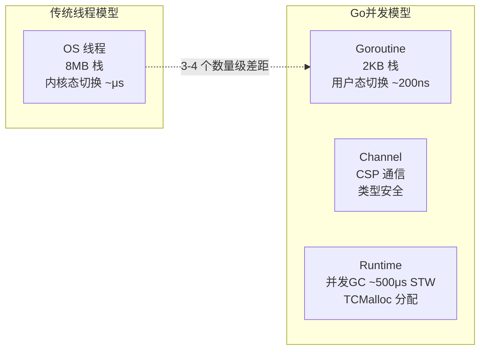

### 1.2 也要清楚 Go 的局限

客观地说，Go 在数据处理领域并非没有短板：

- **无泛型算法库**：虽然 Go 1.18 引入了泛型，但生态中像 Java Streams 或 Rust Iterators 那样成熟的数据处理库仍然缺乏。
- **GC 不可关闭**：在某些极端性能场景下，无法像 C++/Rust 那样完全消除 GC 开销。
- **SIMD 支持有限**：Go 目前没有官方的 SIMD intrinsics 支持，计算密集型场景（如向量搜索）不如 C++/Rust 高效。

了解优势和局限，才能在合适的场景做合适的选择。

---

## 二、并发基石：从 Goroutine 到 Channel

### 2.1 Goroutine 调度模型：GMP

理解 Goroutine 为何高效，需要了解 Go 运行时的 GMP 调度模型：

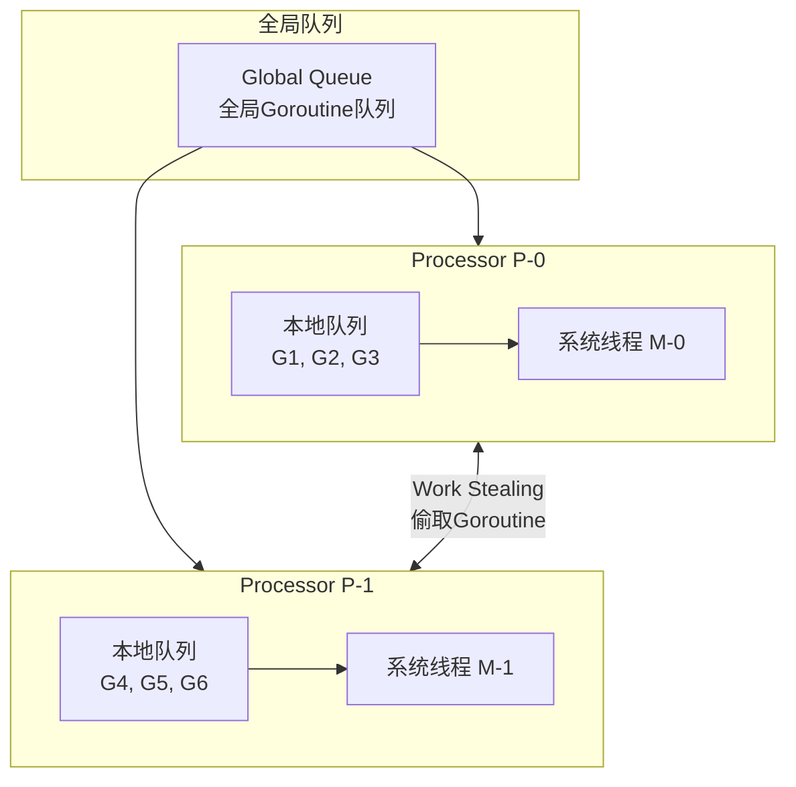

- **G（Goroutine）**：轻量级协程，承载用户代码执行。
- **M（Machine）**：操作系统线程，真正执行代码的载体。
- **P（Processor）**：逻辑处理器，数量默认等于 CPU 核心数。每个 P 持有一个本地 Goroutine 队列。

**Work Stealing 机制**：当一个 P 的本地队列为空时，它会从全局队列或其他 P 的本地队列"偷取" Goroutine 来执行。这确保了负载均衡，也解释了为什么 Goroutine 的调度不需要内核参与。

**数据处理中的意义**：你可以放心地为每条记录启动一个 Goroutine 处理，运行时会自动将它们调度到所有可用的 CPU 核心上。但注意——"可以"不代表"应该"，后文会解释为什么。

### 2.2 Channel：定向通信管道

Channel 是 Go 并发的灵魂。理解 Channel 的关键在于理解它的阻塞语义：

```go
// 无缓冲 Channel：发送和接收必须同时就绪，否则阻塞
ch := make(chan int)

// 有缓冲 Channel：缓冲区满时发送阻塞，缓冲区空时接收阻塞
ch := make(chan int, 100)

// 单向 Channel：编译期约束方向
func producer(out chan<- int) { /* 只能发送 */ }
func consumer(in <-chan int) { /* 只能接收 */ }
```

**无缓冲 vs 有缓冲**的选择是数据处理系统设计中的常见决策：

| 维度 | 无缓冲 Channel | 有缓冲 Channel |
|------|--------------|--------------|
| 同步语义 | 强同步，发送者必须等接收者 | 弱同步，解耦生产消费速率 |
| 吞吐量 | 受限于慢的一方 | 可吸收短时速率波动 |
| 背压效果 | 天然背压，快方自动阻塞 | 需要额外机制实现背压 |
| 适用场景 | 严格同步、信号通知 | 数据流管道、速率解耦 |

### 2.3 Select：多路复用

`select` 语句让一个 Goroutine 同时等待多个 Channel 操作：

```go
select {
case data := <-ch1:
    // 处理 ch1 的数据
case data := <-ch2:
    // 处理 ch2 的数据
case <-time.After(5 * time.Second):
    // 超时处理
case <-ctx.Done():
    // 取消处理
}
```

在数据处理中，`select` 配合 `context.Context` 可以实现超时控制和优雅退出——这是生产级系统的必备能力。

### 2.4 常见并发陷阱

**1. Goroutine 泄漏**

```go
// 错误：如果消费者停止消费，生产者永远阻塞
func leak() <-chan int {
    ch := make(chan int)
    go func() {
        for i := 0; i < 1e6; i++ {
            ch <- i  // 如果没有人接收，永远阻塞
        }
    }()
    return ch
}

// 正确：用 context 控制生命周期
func noLeak(ctx context.Context) <-chan int {
    ch := make(chan int)
    go func() {
        defer close(ch)
        for i := 0; i < 1e6; i++ {
            select {
            case ch <- i:
            case <-ctx.Done():
                return  // 优雅退出
            }
        }
    }()
    return ch
}
```

**2. 发送到已关闭的 Channel 会 Panic**

```go
// 错误：多个生产者，一个关闭后其他还在发送
close(ch)  // 其他 Goroutine 再往 ch 发送会 panic

// 正确：用 sync.Once 确保只关闭一次，或由发送方关闭
```

**3. Range over nil Channel 永远阻塞**

Channel 关闭后 `for range` 会正常退出；但 `range` 一个 nil Channel 会永远阻塞。可以利用这个特性动态控制管道的开关。

---

## 三、经典并发模式：构建数据处理管道

### 3.1 Pipeline 模式

Pipeline 是数据处理中最自然的并发模式：数据像流水线上的产品一样，经过一道道工序逐步加工。

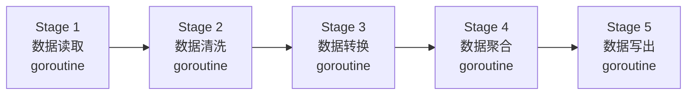

Go 的 Pipeline 模式用 Channel 连接各阶段：

```go
func readFiles(ctx context.Context, paths []string) <-chan []byte {
    out := make(chan []byte, 64)
    go func() {
        defer close(out)
        for _, path := range paths {
            data, err := os.ReadFile(path)
            if err != nil { continue }
            select {
            case out <- data:
            case <-ctx.Done():
                return
            }
        }
    }()
    return out
}

func parseRecords(ctx context.Context, in <-chan []byte) <-chan Record {
    out := make(chan Record, 256)
    go func() {
        defer close(out)
        for data := range in {
            for _, rec := range parse(data) {
                select {
                case out <- rec:
                case <-ctx.Done():
                    return
                }
            }
        }
    }()
    return out
}

// 组装管道
func main() {
    ctx, cancel := context.WithCancel(context.Background())
    defer cancel()

    rawCh := readFiles(ctx, files)
    recordCh := parseRecords(ctx, rawCh)
    resultCh := aggregate(ctx, recordCh)
    writeOutput(ctx, resultCh)
}
```

**Pipeline 的关键设计原则**：

1. **每个 Stage 独立运行**：各阶段运行在自己的 Goroutine 中，互不阻塞。
2. **通过 Channel 传递数据**：阶段间不共享内存，通过 Channel 通信。
3. **背压自然传递**：慢阶段会自动通过 Channel 反压到上游，防止内存无限增长。
4. **context 贯穿始终**：每个 select 都检查 `ctx.Done()`，确保可以随时取消。

### 3.2 Fan-out / Fan-in 模式

当某个 Stage 成为瓶颈时，可以启动多个 Goroutine 并行处理——这就是 Fan-out。将多个 Goroutine 的结果合并到一个 Channel——这就是 Fan-in。

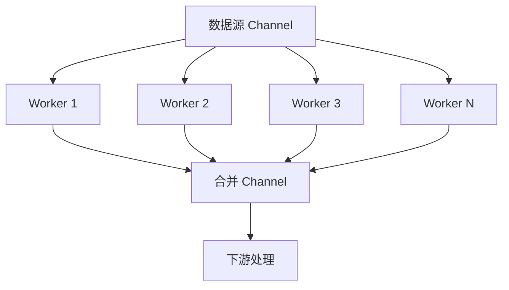

```go
// Fan-out：启动多个 Worker 消费同一个输入 Channel
func fanOut(ctx context.Context, in <-chan Record, workerCount int) []<-chan Result {
    workers := make([]<-chan Result, workerCount)
    for i := 0; i < workerCount; i++ {
        workers[i] = process(ctx, in)  // 每个 Worker 独立消费 in
    }
    return workers
}

// Fan-in：将多个 Channel 合并为一个
func fanIn(ctx context.Context, channels ...<-chan Result) <-chan Result {
    out := make(chan Result, len(channels))
    var wg sync.WaitGroup
    for _, ch := range channels {
        wg.Add(1)
        go func(c <-chan Result) {
            defer wg.Done()
            for r := range c {
                select {
                case out <- r:
                case <-ctx.Done():
                    return
                }
            }
        }(ch)
    }
    go func() {
        wg.Wait()
        close(out)
    }()
    return out
}
```

**Fan-out 的数量怎么定？** 不是越多越好。经验法则：

- CPU 密集型任务：Worker 数 = CPU 核心数
- I/O 密集型任务：Worker 数 = CPU 核心数 × (1 + 等待时间/计算时间)
- 实践中：从 `runtime.NumCPU()` 开始，通过压测调整

### 3.3 Worker Pool 模式

Fan-out 模式简单直接，但有一个缺陷：**无法控制并发度**。如果输入数据量突增，Fan-out 可能瞬间创建数千个 Goroutine，导致内存暴涨、调度开销剧增。Worker Pool 通过固定数量的 Worker 来限制并发度：

```go
type Pool struct {
    tasks chan Task
    wg    sync.WaitGroup
}

func NewPool(workerCount, taskBufSize int) *Pool {
    p := &Pool{
        tasks: make(chan Task, taskBufSize),
    }
    for i := 0; i < workerCount; i++ {
        p.wg.Add(1)
        go p.worker()
    }
    return p
}

func (p *Pool) worker() {
    defer p.wg.Done()
    for task := range p.tasks {
        task.Execute()
    }
}

func (p *Pool) Submit(task Task) {
    p.tasks <- task  // 如果任务队列满，提交者阻塞——天然背压
}

func (p *Pool) Close() {
    close(p.tasks)
    p.wg.Wait()
}
```

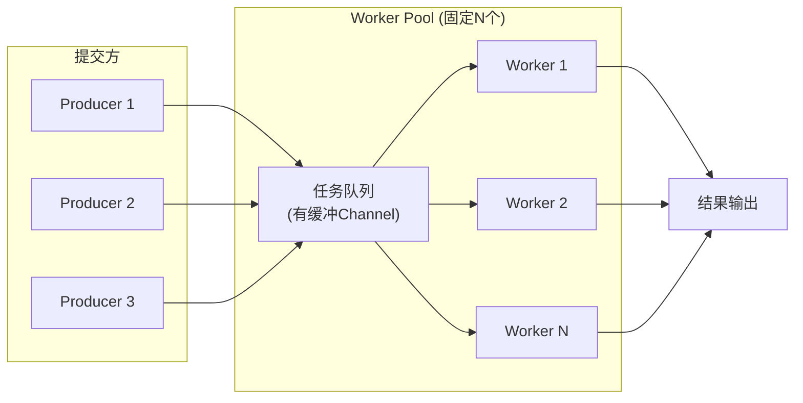

**Worker Pool vs 无限制 Goroutine**：

| 维度 | 无限制 `go f()` | Worker Pool |
|------|----------------|-------------|
| 并发控制 | 无，Goroutine 数量不可控 | 有，Worker 数量固定 |
| 内存使用 | 峰值不可预测 | 有上界 |
| 背压机制 | 无，可能 OOM | 有，任务队列满时阻塞提交者 |
| 调度开销 | 大量 Goroutine 竞争 CPU | 适量 Goroutine 高效运行 |
| 适用场景 | 简单脚本、低并发 | 生产级系统 |

### 3.4 Semaphore 模式：加权并发控制

当不同任务的资源消耗差异很大时，固定数量的 Worker 可能不够灵活。Go 1.18 的 `sync/semaphore` 提供了加权信号量：

```go
sem := semaphore.NewWeighted(100) // 最多 100 个"权重单位"

func processLargeFile(ctx context.Context, path string) error {
    // 大文件占 10 个权重
    if err := sem.Acquire(ctx, 10); err != nil {
        return err
    }
    defer sem.Release(10)
    // ... 处理大文件
}

func processSmallFile(ctx context.Context, path string) error {
    // 小文件只占 1 个权重
    if err := sem.Acquire(ctx, 1); err != nil {
        return err
    }
    defer sem.Release(1)
    // ... 处理小文件
}
```

这样，系统可以同时运行 10 个大文件任务，或 100 个小文件任务，或任意组合——只要总权重不超过 100。这比固定 Worker 数更精细。

---

## 四、背压与流量控制：防止系统被淹没

### 4.1 为什么背压如此重要？

在海量数据处理中，**生产者的速度往往远超消费者**。如果没有背压机制，数据会在 Channel 缓冲区、内存队列、网络缓冲区中无限堆积，最终导致 OOM。

背压（Backpressure）的核心思想是：**当下游处理不过来时，上游自动减速。**

### 4.2 Channel 缓冲区：最简单的背压

有缓冲 Channel 天然提供了一种粗糙的背压机制：当缓冲区满时，发送者阻塞，上游自然减速。

```go
// 缓冲区大小 = 期望的突发容量
ch := make(chan Record, 1000)  // 最多缓冲 1000 条记录
```

但缓冲区大小的选择是一个工程权衡：

- **太小**：生产者和消费者之间的速率波动会导致频繁阻塞，降低吞吐量。
- **太大**：失去了背压效果，内存占用增加。
- **经验法则**：缓冲区大小 ≈ 目标延迟 × 平均吞吐率。如果期望 100ms 的突发缓冲，吞吐率 10,000 条/秒，则缓冲区 ≈ 1,000。

### 4.3 令牌桶与限速器

在某些场景下，你需要精确控制处理速率而非依赖缓冲区。`golang.org/x/time/rate` 提供了令牌桶限速器：

```go
limiter := rate.NewLimiter(rate.Limit(10000), 100)  // 10,000 条/秒，突发 100

func process(ctx context.Context, rec Record) error {
    if err := limiter.Wait(ctx); err != nil {
        return err  // 被取消或超过速率限制
    }
    // 处理记录
    return nil
}
```

### 4.4 多级背压架构

在真实的数据处理系统中，背压需要贯穿整个管道：

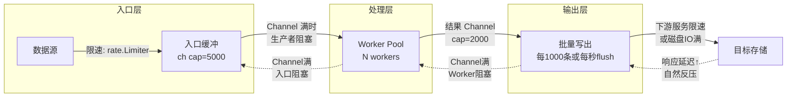

背压沿管道逆流传递，每一层都在保护自己不被下游的慢速淹没。这是系统稳定性的基石。

---

## 五、内存优化：让 GC 不再拖后腿

### 5.1 Go GC 工作原理

Go 使用并发标记-清除（Concurrent Mark-Sweep）垃圾回收器，其工作周期如下：

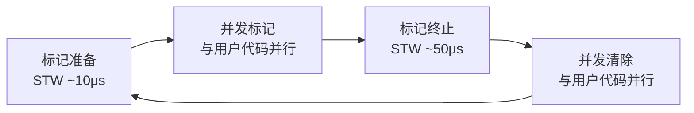

关键指标：

- **GC 触发阈值**：当堆内存增长到上一次 GC 后堆大小的 `GOGC`（默认 100%）倍时触发。即 `GOGC=100` 意味着堆翻倍时触发 GC。
- **目标暂停时间**：`runtime/debug.SetGCGoal` 可设置，默认 500μs 以内。
- **GC 影响因素**：存活对象越多，标记时间越长；指针越多，写屏障开销越大。

**数据处理场景下的 GC 问题**：大量临时对象的创建和销毁会产生巨量垃圾，触发频繁 GC。虽然每次停顿很短，但累积的 GC CPU 占用可能达到 10-25%。

### 5.2 sync.Pool：对象复用

`sync.Pool` 是 Go 提供的对象缓存池，它不是缓存（内容可能随时被回收），而是临时对象的复用机制：

```go
var bufPool = sync.Pool{
    New: func() interface{} {
        return bytes.NewBuffer(make([]byte, 0, 4096))
    },
}

func processData(data []byte) string {
    buf := bufPool.Get().(*bytes.Buffer)
    defer func() {
        buf.Reset()           // 重置但保留底层 []byte
        bufPool.Put(buf)      // 归还池中
    }()

    buf.Write(data)
    // ... 使用 buf 处理数据
    return buf.String()
}
```

**sync.Pool 在 GC 中的行为**：每次 GC 时，Pool 中未使用的对象会被清除。这意味着 Pool 不会导致内存泄漏，但也意味着 GC 后需要重新分配。Go 1.13+ 引入了 victim cache 机制，使得对象可以在一轮 GC 中存活，提高了复用率。

**典型复用对象**：

- `bytes.Buffer`：序列化/反序列化时的高频临时缓冲
- `[]byte` 切片：网络读写缓冲
- `json.Encoder/Decoder`：JSON 处理对象

### 5.3 减少逃逸：栈上分配

Go 编译器会进行逃逸分析（Escape Analysis），决定对象分配在栈上还是堆上。栈分配几乎零成本（移动栈指针），堆分配则需要 GC 管理。

```go
// 逃逸到堆：返回了局部变量的指针
func newRecord() *Record {
    r := Record{ID: 1}  // 逃逸！r 的指针被返回
    return &r
}

// 栈上分配：值类型，不逃逸
func processRecord(r Record) Result {
    r.ID++  // 不逃逸，r 在栈上
    return Result{Value: r.ID}
}
```

**逃逸分析查看方法**：

```bash
go build -gcflags="-m -m" ./...
```

**数据处理中常见的逃逸场景**：

| 场景 | 逃逸原因 | 优化方法 |
|------|---------|---------|
| `interface{}` 参数 | 编译期无法确定类型 | 使用泛型或具体类型 |
| `fmt.Sprintf` | 参数逃逸到 `interface{}` | 预分配 `[]byte`，用 `strconv` |
| 闭包捕获变量 | 变量生命周期超出函数 | 减少闭包，显式传参 |
| Slice 扩容 | 底层数组重新分配 | 预分配 `make([]T, 0, cap)` |
| Map 的 key/value | 堆上分配 | 使用 slice 替代小型 map |

### 5.4 预分配：消除运行时扩容

Slice 和 Map 的动态扩容是性能杀手——每次扩容都需要分配新内存并拷贝数据：

```go
// 差：每次 append 可能触发扩容
var records []Record
for _, raw := range rawData {
    records = append(records, parse(raw))  // 多次扩容+拷贝
}

// 好：预分配容量
records := make([]Record, 0, len(rawData))
for _, raw := range rawData {
    records = append(records, parse(raw))  // 无扩容
}

// Map 同理
m := make(map[string]int, expectedSize)
```

**大数据场景的预分配策略**：

如果知道数据量的量级但不精确，可以分配一个合理的上界，处理后截断：

```go
estimated := len(rawData) * 11 / 10  // 预估 110%
records := make([]Record, 0, estimated)
// ... 填充数据
records = records[:actualCount]  // 截断
```

### 5.5 字符串与 []byte 的零拷贝转换

Go 中 `string` 是不可变的，`[]byte` 是可变的。两者互转默认会拷贝数据：

```go
s := string(byteSlice)   // 拷贝！
b := []byte(strValue)    // 拷贝！
```

在高吞吐场景下，频繁的字符串/字节切片转换会产生大量临时对象。零拷贝转换利用 `unsafe` 绕过拷贝：

```go
// 零拷贝 []byte → string（仅在确保 []byte 不会被修改时使用）
func bytesToString(b []byte) string {
    return *(*string)(unsafe.Pointer(&b))
}

// 零拷贝 string → []byte（仅在确保 []byte 不会被修改时使用）
func stringToBytes(s string) []byte {
    return *(*[]byte)(unsafe.Pointer(
        &struct {
            string
            int
            int
        }{s, len(s), len(s)},
    ))
}
```

**警告**：这是 `unsafe` 操作，违反 Go 的类型安全保证。仅在性能瓶颈已确认且数据生命周期可控时使用。标准库 `net/http` 和 `syscall` 内部也使用了类似技巧。

### 5.6 GOGC 与内存球拍效应

`GOGC` 控制了 GC 触发的阈值。默认值 100 意味着堆翻倍时触发 GC。对于数据处理服务，这可能导致"球拍效应"——内存在低水位和高水位之间大幅波动：

```mermaid
graph LR
    subgraph GOGC=100 默认
        A1["GC后: 100MB"] --> A2["增长到 200MB"]
        A2 --> A3["触发GC: 回收到 100MB"]
        A3 --> A1
    end
    subgraph GOGC=50 更频繁
        B1["GC后: 100MB"] --> B2["增长到 150MB"]
        B2 --> B3["触发GC: 回收到 100MB"]
        B3 --> B1
    end
```

**Go 1.19+ 的 GOMEMLIMIT**：可以设置内存上限，Go 运行时会自动调整 GC 频率以保持在限制内，比手动调 GOGC 更稳定：

```go
import "runtime/debug"

func init() {
    // 限制堆内存不超过 4GB，留 10% 余量
    debug.SetMemoryLimit(4 << 30)  // 4 GiB
    debug.SetGCPercent(100)        // 默认值，GOMEMLIMIT 会自动覆盖
}
```

---

## 六、I/O 优化：让磁盘和网络不再是瓶颈

### 6.1 bufio：缓冲 I/O 的基础

默认的 `os.File.Read()` 每次调用都是一次系统调用。对于逐行读取大文件，这代价极高：

```go
// 差：每次 ReadString 都是一次系统调用
file, _ := os.Open("huge.log")
scanner := bufio.NewScanner(file)
for scanner.Scan() {
    line := scanner.Text()  // 内部有缓冲，但每行仍产生一个 string 分配
}

// 好：手动控制缓冲区，减少分配
scanner := bufio.NewScanner(file)
scanner.Buffer(make([]byte, 0, 256*1024), 256*1024)  // 256KB 缓冲
for scanner.Scan() {
    line := scanner.Bytes()  // 零分配！返回内部缓冲的切片
    // 注意：下次迭代 line 会被覆盖，如需保留需拷贝
}
```

### 6.2 mmap：内存映射文件

对于超大文件（GB 级），`mmap` 将文件直接映射到进程的虚拟地址空间，避免了 `read()` 系统调用和内核态到用户态的数据拷贝：

```go
import "golang.org/x/exp/mmap"

func processLargeFile(path string) error {
    r, err := mmap.Open(path)
    if err != nil { return err }
    defer r.Close()

    // 像访问内存一样访问文件，无需 Read 调用
    data := make([]byte, r.Len())
    _, err = r.ReadAt(data, 0)
    // ... 处理 data
}
```

**mmap 的适用场景**：

- 只读或追加写入的大文件
- 随机访问模式（不需要从头读）
- 多进程共享同一文件数据

**mmap 的注意事项**：

- 映射区域计入虚拟内存但不计入 RSS，可能导致 OOM killer 误判
- 写入 mmap 文件不是原子的，崩溃可能导致数据不一致
- 32 位系统地址空间有限，无法映射超大文件

### 6.3 批量写入：攒一波再写

对于写入密集型场景，逐条写入的性能极差。批量写入可以显著减少系统调用和 I/O 次数：

```go
type BatchWriter struct {
    buf     []Record
    mu      sync.Mutex
    maxSize int
    out     io.Writer
}

func (w *BatchWriter) Add(r Record) error {
    w.mu.Lock()
    w.buf = append(w.buf, r)
    if len(w.buf) >= w.maxSize {
        batch := w.buf
        w.buf = make([]Record, 0, w.maxSize)
        w.mu.Unlock()
        return w.writeBatch(batch)
    }
    w.mu.Unlock()
    return nil
}

func (w *BatchWriter) writeBatch(batch []Record) error {
    var buf bytes.Buffer
    for _, r := range batch {
        buf.WriteString(r.String())
        buf.WriteByte('\n')
    }
    _, err := w.out.Write(buf.Bytes())
    return err
}
```

**批量策略**：通常按"条数或时间，谁先到触发"：

```go
ticker := time.NewTicker(1 * time.Second)
defer ticker.Stop()

for {
    select {
    case rec := <-inputCh:
        batch = append(batch, rec)
        if len(batch) >= batchSize {
            flush(batch)
            batch = batch[:0]
        }
    case <-ticker.C:
        if len(batch) > 0 {
            flush(batch)
            batch = batch[:0]
        }
    }
}
```

### 6.4 并行 I/O：同时读写多个文件

当需要处理大量小文件时，串行 I/O 是严重的瓶颈。Go 的并发模型让并行 I/O 变得自然：

```go
func processFiles(ctx context.Context, paths []string) error {
    g, ctx := errgroup.WithContext(ctx)
    sem := semaphore.NewWeighted(int64(runtime.NumCPU()))

    for _, path := range paths {
        path := path  // 捕获循环变量
        if err := sem.Acquire(ctx, 1); err != nil {
            break
        }
        g.Go(func() error {
            defer sem.Release(1)
            return processOneFile(ctx, path)
        })
    }

    return g.Wait()  // 等待所有 Goroutine 完成，返回第一个错误
}
```

`errgroup.Group` 是 `sync.WaitGroup` 的增强版，它在等待所有 Goroutine 完成的同时，只要任何一个返回错误，就可以通过 `ctx` 取消其他 Goroutine。

---

## 七、数据处理的核心算法模式

### 7.1 MapReduce：分而治之

MapReduce 是大数据处理的经典范式，Go 的并发原语让它在单机上也极其高效：

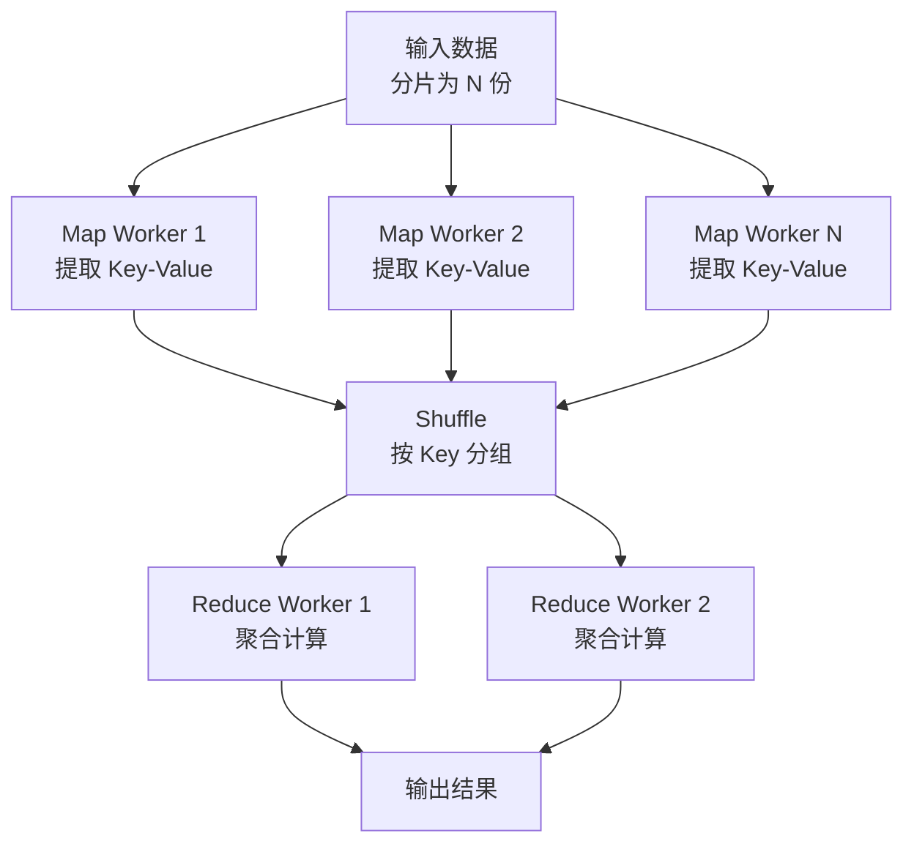

单机 MapReduce 的 Go 实现：

```go
func MapReduce[K comparable, V, M, R any](
    ctx context.Context,
    input <-chan V,
    mapper func(V) ([]M, error),
    reducer func(K, []M) (R, error),
    keyFunc func(M) K,
    mapWorkers, reduceWorkers int,
) ([]R, error) {

    // Map 阶段
    mapOut := make(chan M, 1000)
    var mapWg sync.WaitGroup
    for i := 0; i < mapWorkers; i++ {
        mapWg.Add(1)
        go func() {
            defer mapWg.Done()
            for v := range input {
                intermediates, err := mapper(v)
                if err != nil { continue }
                for _, m := range intermediates {
                    select {
                    case mapOut <- m:
                    case <-ctx.Done():
                        return
                    }
                }
            }
        }()
    }
    go func() { mapWg.Wait(); close(mapOut) }()

    // Shuffle 阶段：按键分组
    groups := make(map[K][]M)
    for m := range mapOut {
        k := keyFunc(m)
        groups[k] = append(groups[k], m)
    }

    // Reduce 阶段
    resultCh := make(chan R, len(groups))
    var reduceWg sync.WaitGroup
    groupCh := make(chan struct{ K; []M }, reduceWorkers)

    for i := 0; i < reduceWorkers; i++ {
        reduceWg.Add(1)
        go func() {
            defer reduceWg.Done()
            for g := range groupCh {
                r, err := reducer(g.K, g.[]M)
                if err == nil {
                    resultCh <- r
                }
            }
        }()
    }

    // 发送分组数据
    for k, vs := range groups {
        groupCh <- struct{ K; []M }{k, vs}
    }
    close(groupCh)
    go func() { reduceWg.Wait(); close(resultCh) }()

    var results []R
    for r := range resultCh {
        results = append(results, r)
    }
    return results, nil
}
```

### 7.2 分片 Map：减少锁竞争

当多个 Goroutine 并发读写同一个 Map 时，`sync.Mutex` 会成为瓶颈。分片 Map（Sharded Map）将数据按 Key 哈希分到多个分片，每个分片有独立的锁，从而将锁竞争降低到 1/N：

```go
type ShardMap struct {
    shards []*shard
    n      int
}

type shard struct {
    sync.RWMutex
    data map[string]interface{}
}

func NewShardMap(n int) *ShardMap {
    m := &ShardMap{n: n, shards: make([]*shard, n)}
    for i := 0; i < n; i++ {
        m.shards[i] = &shard{data: make(map[string]interface{})}
    }
    return m
}

func (m *ShardMap) getShard(key string) *shard {
    hash := fnv.New32a()
    hash.Write([]byte(key))
    return m.shards[hash.Sum32()%uint32(m.n)]
}

func (m *ShardMap) Set(key string, val interface{}) {
    s := m.getShard(key)
    s.Lock()
    s.data[key] = val
    s.Unlock()
}

func (m *ShardMap) Get(key string) (interface{}, bool) {
    s := m.getShard(key)
    s.RLock()
    defer s.RUnlock()
    v, ok := s.data[key]
    return v, ok
}
```

**分片数选择**：通常为 2 的幂（方便位运算取模），且为 CPU 核心数的 2-4 倍。64 核机器可设 128 或 256 个分片。Go 标准库的 `sync.Map` 在读多写少场景下性能优秀，但在写密集场景下分片 Map 仍然更优。

### 7.3 流式聚合：不需要全部数据

许多聚合操作不需要把全部数据加载到内存。流式聚合逐条处理，内存占用恒定：

```go
// 全量聚合：内存 O(N)
func countAll(records []Record) map[string]int {
    counts := make(map[string]int)
    for _, r := range records {
        counts[r.Category]++
    }
    return counts
}

// 流式聚合：内存 O(K)，K = 不同 Category 数
func streamCount(input <-chan Record) map[string]int {
    counts := make(map[string]int)
    for r := range input {
        counts[r.Category]++
    }
    return counts
}

// 流式分位数：蓄水池采样 + 近似算法
type QuantileStream struct {
    samples []float64
    maxSamples int
}

func (q *QuantileStream) Add(v float64) {
    if len(q.samples) < q.maxSamples {
        q.samples = append(q.samples, v)
    } else {
        // 随机替换（蓄水池采样）
        j := rand.Intn(len(q.samples) + 1)
        if j < len(q.samples) {
            q.samples[j] = v
        }
    }
}
```

### 7.4 Top-K：堆上求高频项

在海量数据中求"出现频率最高的 K 个元素"，不需要排序全部数据，一个小顶堆即可：

```go
func TopK(input <-chan string, k int) []KeyValue {
    counts := make(map[string]int)
    for item := range input {
        counts[item]++
    }

    // 小顶堆，堆顶是频次最小的
    h := &minHeap{}
    for key, cnt := range counts {
        if h.Len() < k {
            heap.Push(h, KeyValue{Key: key, Count: cnt})
        } else if cnt > h.data[0].Count {
            heap.Pop(h)
            heap.Push(h, KeyValue{Key: key, Count: cnt})
        }
    }

    result := make([]KeyValue, h.Len())
    for i := h.Len() - 1; i >= 0; i-- {
        result[i] = heap.Pop(h).(KeyValue)
    }
    return result
}
```

当数据量大到单机内存放不下时，可以用 **Count-Min Sketch** 概率数据结构来近似计数，空间复杂度从 O(N) 降到 O(log N)。

---

## 八、Go 1.23+ 新特性与数据处理

### 8.1 Range-over-func：优雅的迭代器

Go 1.23 引入了 `range-over-func` 特性，允许 `for range` 遍历函数迭代器。这对数据处理的影响深远——Pipeline 的各阶段可以更优雅地表达：

```go
// 传统 Pipeline：手动管理 Channel 和 Goroutine
func readFileLines(path string) <-chan string {
    ch := make(chan string, 100)
    go func() {
        defer close(ch)
        // ... 逐行读取
    }()
    return ch
}

// Go 1.23 迭代器：无需 Channel，无需 Goroutine
func readFileLines(path string) iter.Seq2[int, string] {
    return func(yield func(int, string) bool) {
        f, _ := os.Open(path)
        defer f.Close()
        scanner := bufio.NewScanner(f)
        i := 0
        for scanner.Scan() {
            if !yield(i, scanner.Text()) {
                return  // 调用方 break 时提前退出
            }
            i++
        }
    }
}

// 使用：像遍历切片一样遍历文件行
for i, line := range readFileLines("huge.log") {
    if i > 1000000 { break }  // 提前退出，不会继续读取
    process(line)
}
```

**迭代器 + 泛型的威力**：可以构建可组合的数据处理操作：

```go
// 泛型 Filter
func Filter[T any](seq iter.Seq[T], pred func(T) bool) iter.Seq[T] {
    return func(yield func(T) bool) {
        for v := range seq {
            if pred(v) && !yield(v) {
                return
            }
        }
    }
}

// 泛型 Map
func Map[T, U any](seq iter.Seq[T], transform func(T) U) iter.Seq[U] {
    return func(yield func(U) bool) {
        for v := range seq {
            if !yield(transform(v)) {
                return
            }
        }
    }
}

// 组合使用：惰性求值，无需中间集合
for result := range Map(Filter(readFileLines("data.csv"), isValid), parseRecord) {
    writeResult(result)
}
```

这种风格类似 Java Stream 或 Rust Iterator，但更轻量——没有中间集合分配，真正的惰性求值。

### 8.2 unique 包：高效字符串去重

Go 1.23 的 `unique` 包提供了字符串内部化（interning）机制，用于消除重复字符串的内存开销：

```go
import "unique"

// 相同内容的字符串只保留一份内存
func processRecords(records []Record) {
    for i, r := range records {
        records[i].Category = unique.Make(r.Category).Value()
    }
}
// 如果 100 万条记录中有 50 种 Category，
// 原本 100 万个字符串 → 50 个字符串的引用
```

在日志处理、标签聚合等场景中，重复字符串占比可能高达 80%+，`unique` 可以显著降低内存占用和 GC 压力。

### 8.3 泛型数据结构

Go 1.18+ 的泛型使得类型安全的高性能数据结构成为可能：

```go
// 泛型优先队列
type PriorityQueue[T any] struct {
    data []T
    less func(a, b T) bool
}

func NewPriorityQueue[T any](less func(a, b T) bool) *PriorityQueue[T] {
    return &PriorityQueue[T]{less: less}
}

func (pq *PriorityQueue[T]) Push(v T) {
    pq.data = append(pq.data, v)
    // 上浮
    // ...
}

// 泛型布隆过滤器
type BloomFilter[T any] struct {
    bits    []uint64
    hashes  []func(T) uint32
}
```

---

## 九、实战：构建十亿级日志处理系统

### 9.1 需求场景

假设我们需要构建一个日志分析系统，每天处理 10 亿条日志（约 1TB），需要在 4 小时内完成处理，输出聚合报表。核心需求：

- 实时读取 Kafka 中的日志消息
- 解析、过滤、聚合
- 写入 ClickHouse
- 输出 Top-K、分位数等统计

### 9.2 架构设计

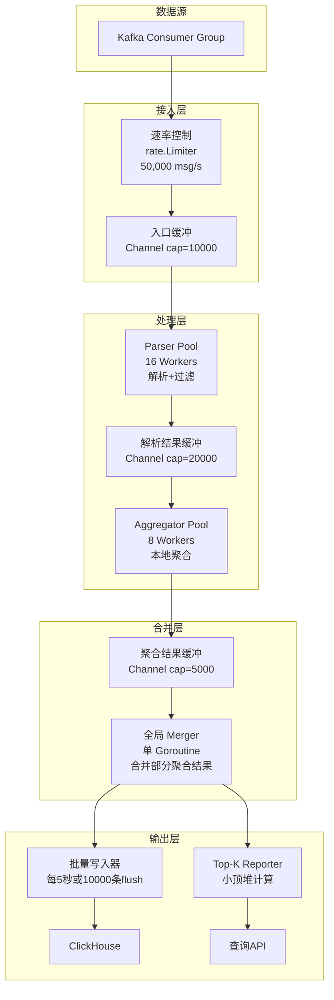

### 9.3 核心代码实现

**1. 主控结构**：

```go
type LogPipeline struct {
    config    Config
    consumers *ConsumerGroup
    parser    *WorkerPool
    aggregator *WorkerPool
    merger    *Merger
    writer    *BatchWriter
    limiter   *rate.Limiter
    metrics   *Metrics
}

func (p *LogPipeline) Run(ctx context.Context) error {
    g, ctx := errgroup.WithContext(ctx)

    // 接入层
    rawCh := make(chan []byte, 10000)
    g.Go(func() error { return p.consume(ctx, rawCh) })

    // 解析层
    parsedCh := make(chan ParsedLog, 20000)
    g.Go(func() error { return p.parse(ctx, rawCh, parsedCh) })

    // 聚合层
    aggCh := make(chan PartialAgg, 5000)
    g.Go(func() error { return p.aggregate(ctx, parsedCh, aggCh) })

    // 合并层
    g.Go(func() error { return p.merge(ctx, aggCh) })

    return g.Wait()
}
```

**2. 解析层（Fan-out + Worker Pool）**：

```go
func (p *LogPipeline) parse(ctx context.Context, in <-chan []byte, out chan<- ParsedLog) error {
    defer close(out)

    var wg sync.WaitGroup
    for i := 0; i < p.config.ParseWorkers; i++ {
        wg.Add(1)
        go func() {
            defer wg.Done()
            for raw := range in {
                log, ok := parseLog(raw)  // 解析
                if !ok { continue }       // 过滤无效日志
                select {
                case out <- log:
                case <-ctx.Done():
                    return
                }
            }
        }()
    }
    wg.Wait()
    return nil
}
```

**3. 聚合层（本地聚合 + 定期刷新）**：

```go
func (p *LogPipeline) aggregateWorker(ctx context.Context, in <-chan ParsedLog, out chan<- PartialAgg) error {
    localAgg := make(map[string]*AggBucket)  // 每个 Worker 维护本地聚合
    ticker := time.NewTicker(5 * time.Second)
    defer ticker.Stop()

    flush := func() {
        for key, bucket := range localAgg {
            select {
            case out <- PartialAgg{Key: key, Bucket: bucket}:
            case <-ctx.Done():
                return
            }
            delete(localAgg, key)
        }
    }

    for {
        select {
        case log, ok := <-in:
            if !ok { flush(); return }
            bucket := localAgg[log.Category]
            if bucket == nil {
                bucket = &AggBucket{}
                localAgg[log.Category] = bucket
            }
            bucket.Count++
            bucket.Sum += log.Value
            // ... 更多聚合逻辑

        case <-ticker.C:
            flush()  // 定期刷新，避免内存无限增长
        }
    }
}
```

**为什么每个 Worker 维护本地聚合？** 这是分布式系统中"Map 端聚合"的思想在单机的应用。如果所有 Worker 共享一个全局 Map，每次更新都需要加锁，锁竞争会严重影响性能。本地聚合将锁粒度从"全局"降到"线程局部"，大幅提升并发度。

### 9.4 性能调优清单

| 优化项 | 方法 | 预期收益 |
|-------|------|---------|
| 减少 GC 压力 | sync.Pool 复用解析缓冲区 | GC CPU 占用 -30% |
| 减少内存分配 | 预分配 slice/map，避免扩容 | 吞吐量 +10-20% |
| I/O 批量化 | 写入攒批：10000 条或 5 秒 | 写入吞吐 +5-10x |
| 并发度调优 | Worker 数 = CPU × I/O等待比 | CPU 利用率 80%+ |
| 背压控制 | Channel 满时阻塞 + rate.Limiter | OOM 风险消除 |
| 字符串去重 | unique.Make 消除重复 Category | 内存 -40% |
| 零拷贝解析 | 用 []byte 替代 string 中间结果 | 分配量 -50% |

---

## 十、从单机到分布式：Go 大处理的进阶之路

### 10.1 单机的极限

以上所有技术都聚焦在单机优化。单机处理的极限在哪？

- **CPU**：64 核机器，理论上限约 100 万条/秒（简单解析聚合）。
- **内存**：256GB 机器，可缓存约 10 亿条记录的聚合结果（每条 200 字节）。
- **I/O**：NVMe SSD 顺序读约 7GB/s，网络 25Gbps 约 3GB/s。

当数据量超过单机能力时，需要走向分布式。

### 10.2 Go 生态中的分布式框架

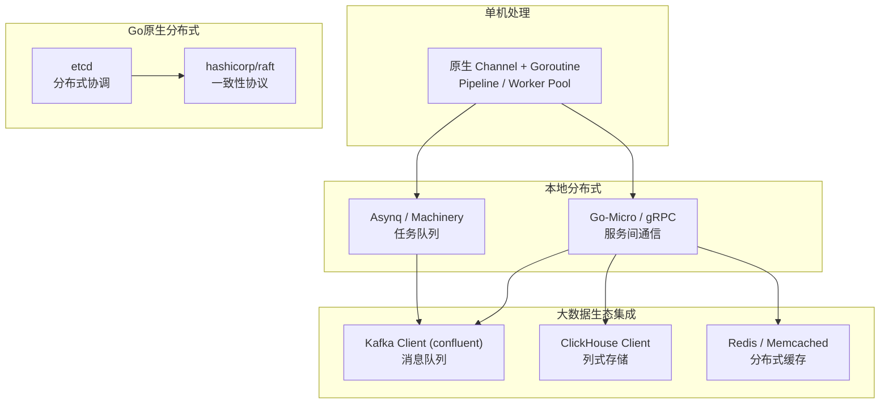

**关键洞察**：Go 在大数据处理中的定位不是替代 Spark/Flink，而是：

1. **流式数据处理**：Go 的低延迟特性适合实时管道。
2. **API 网关 + 聚合层**：Go 作为数据服务的入口，聚合后端多个数据源。
3. **嵌入式数据处理**：在设备端或边缘节点处理数据，Go 的交叉编译和小体积是优势。
4. **数据基础设施**：etcd、Consul、Vault 等核心基础设施都是 Go 构建的。

### 10.3 实时流 vs 批处理：Go 的选择

| 维度 | 批处理（Spark） | 流处理（Go/Kafka） |
|------|---------------|-------------------|
| 延迟 | 分钟级 | 秒级甚至毫秒级 |
| 吞吐量 | 极高（可横向扩展） | 高（受限于单机或集群规模） |
| 语义 | Exactly-once | At-least-once（需幂等处理） |
| 状态管理 | 成熟（RDD/DataSet） | 需自行实现（本地聚合+定期刷盘） |
| 适用场景 | T+1 报表、历史数据回算 | 实时监控、在线特征计算 |

Go 的优势在流式处理：低延迟、低资源消耗、部署简单。Go 的不足在批处理：缺少分布式调度、容错和状态管理的成熟框架。

---

## 十一、全流程性能调优方法论

### 11.1 性能调优的正确顺序

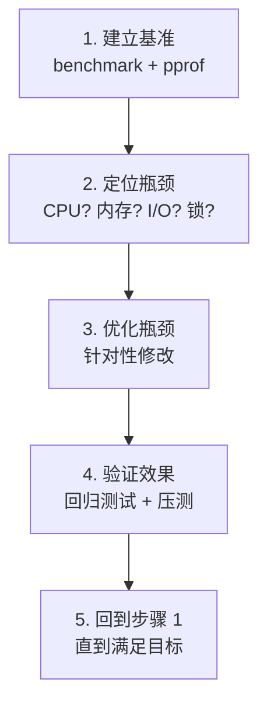

**永远不要凭"感觉"优化。** 先测量，再定位，再修改。

### 11.2 pprof：Go 性能分析的瑞士军刀

```go
import _ "net/http/pprof"

func main() {
    go http.ListenAndServe(":6060", nil)  // 启动 pprof HTTP 服务
    // ... 你的数据处理程序
}
```

常用分析命令：

```bash
# CPU 性能分析（采样 30 秒）
go tool pprof http://localhost:6060/debug/pprof/profile?seconds=30

# 堆内存分析
go tool pprof http://localhost:6060/debug/pprof/heap

# Goroutine 泄漏检查
go tool pprof http://localhost:6060/debug/pprof/goroutine

# 阻塞分析（需要先启用）
# runtime.SetBlockProfileRate(1)
go tool pprof http://localhost:6060/debug/pprof/block

# 锁竞争分析（需要先启用）
# runtime.SetMutexProfileFraction(1)
go tool pprof http://localhost:6060/debug/pprof/mutex
```

### 11.3 trace：更精细的执行时序分析

`runtime/trace` 可以记录 Goroutine 的调度时序，帮助发现调度延迟、GC 停顿、系统调用阻塞等问题：

```go
import "runtime/trace"

func main() {
    f, _ := os.Create("trace.out")
    defer f.Close()
    trace.Start(f)
    defer trace.Stop()

    // ... 你的数据处理程序
}
```

```bash
go tool trace trace.out  # 在浏览器中可视化查看
```

### 11.4 优化决策树

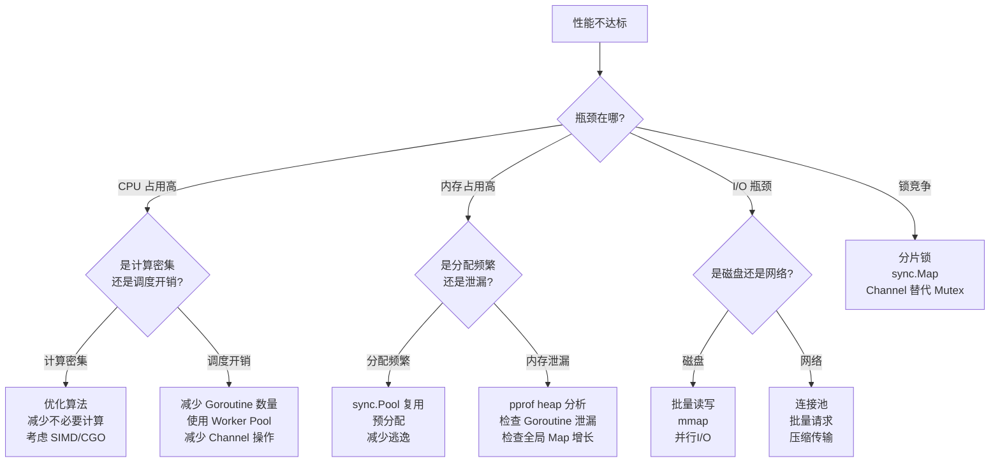

---

### 12.1 六条核心原则

**1. 并发不是并行**

并发（Concurrency）是结构，并行（Parallelism）是执行。Go 的 Channel 和 Goroutine 帮你构建并发结构，运行时自动利用多核实现并行。不要为了"并行"而创建无意义的 Goroutine。

**2. 背压是系统稳定的基石**

永远不要假设消费者能跟上生产者。从系统设计的第一天就考虑背压——通过 Channel 缓冲区、Worker Pool、rate.Limiter 等机制确保数据不会无限堆积。

**3. 减少 GC 的工作量**

Go 的 GC 已经很快了，但它处理的对象越少，你的程序就越快。sync.Pool、预分配、减少逃逸、字符串去重——核心都是减少 GC 需要扫描的对象数量。

**4. 批量优于逐条**

无论是 I/O、网络请求还是数据聚合，批量操作总是比逐条操作高效一个数量级。在设计系统时，优先考虑"攒一批再处理"而非"来一条处理一条"。

**5. 测量优于猜测**

用 pprof 和 trace 找到真正的瓶颈，而非凭直觉优化。一个程序的 80% 时间花在 20% 的代码上——找到那 20%。

**6. 简单优于聪明**

一个用 Channel 连接的简单 Pipeline，往往比精心设计的无锁数据结构更可靠、更易维护。Go 的哲学就是"少即是多"——在数据处理中同样适用。

### 12.2 技术全景图

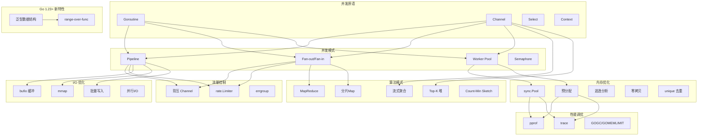

---