# Go语言编译优化深度解析：从原理到实践的完整指南

## 引言

Go语言自2009年由Google推出以来，已经走过了十五个年头。从最初被质疑为“玩具语言”，到如今成为云原生时代的首选编程语言，Go语言的发展历程本身就是一部技术演进史。而支撑这一发展的核心，正是Go语言那令人印象深刻的编译器和工具链。

Go语言的编译速度一直是其最引以为傲的优势之一。在大多数情况下，Go项目的编译时间以秒计算，这对于开发效率的提升是革命性的。然而，这种“快速”并非偶然，而是Go语言设计者们深思熟虑的结果。Go的编译器采用了一系列独特的技术：从简洁的语法设计到正交的类型系统，从并行编译到增量构建，每一个决策都经过精心权衡。

但是，“快”并不意味着“最优”。在生产环境中，我们经常会遇到这样的场景：一个包含数十万行代码的大型Go项目，编译时间可能达到数分钟；在CI/CD流水线中，编译时间成为影响部署效率的关键瓶颈；在嵌入式开发中，二进制文件的大小直接影响着应用的部署成本。这些问题都指向同一个核心：如何在保持Go语言优势的同时，进一步优化编译结果？

本文将深入探讨Go语言编译优化的方方面面。我们不仅会讨论编译器的优化技术，更会深入分析这些技术背后的原理和根本原因。通过理解“为什么”，而不是仅仅知道“是什么”，你将能够更好地驾驭这些工具，在实际项目中做出更明智的技术决策。

---

## 第一章：Go编译器架构概述

### 1.1 编译器的基本组成

要理解Go语言的编译优化，首先需要了解Go编译器的整体架构。Go语言的编译过程并不像看起来那样简单——一个`go build`命令的背后，隐藏着复杂的处理流程。

Go语言的编译器主要分为两个部分：**前端（Frontend）**和**后端（Backend）**。前端负责解析、类型检查和中间表示生成；后端负责目标代码生成和优化。这种分离的设计使得Go可以更容易地支持多种目标架构。

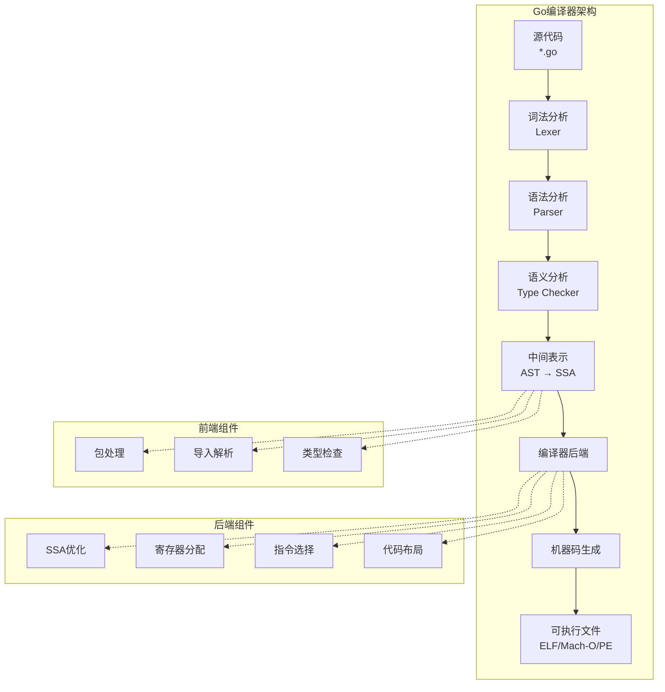

#### 词法分析（Lexical Analysis）

词法分析是编译过程的第一个阶段。它的任务是将源代码字符串分解为一系列的**标记（Token）**。在Go语言中，标记可以是关键字、标识符、字面量、运算符或分隔符。

```go
// 示例源代码
package main

func main() {
    x := 10 + 20
    println(x)
}

// 词法分析结果
TOKEN_PACKAGE    -> "package"
TOKEN_IDENT      -> "main"
TOKEN_FUNC       -> "func"
TOKEN_IDENT      -> "main"
TOKEN_LPAREN     -> "("
TOKEN_RPAREN     -> ")"
TOKEN_LBRACE     -> "{"
TOKEN_IDENT      -> "x"
TOKEN_ASSIGN     -> ":="
TOKEN_NUMBER     -> "10"
TOKEN_PLUS       -> "+"
TOKEN_NUMBER     -> "20"
TOKEN_IDENT      -> "println"
TOKEN_LPAREN     -> "("
TOKEN_IDENT      -> "x"
TOKEN_RPAREN     -> ")"
TOKEN_RBRACE     -> "}"
```

Go语言的词法分析器是用Go语言本身编写的，它采用有限状态机的方式实现，处理效率非常高。一个有趣的事实是：Go语言的词法分析器可以在毫秒级别内处理数百万行代码，这是Go编译速度如此之快的原因之一。

#### 语法分析（Syntax Analysis）

语法分析器（Parser）接收词法分析器产生的标记流，并根据Go语言的语法规则构建**抽象语法树（Abstract Syntax Tree，AST）**。

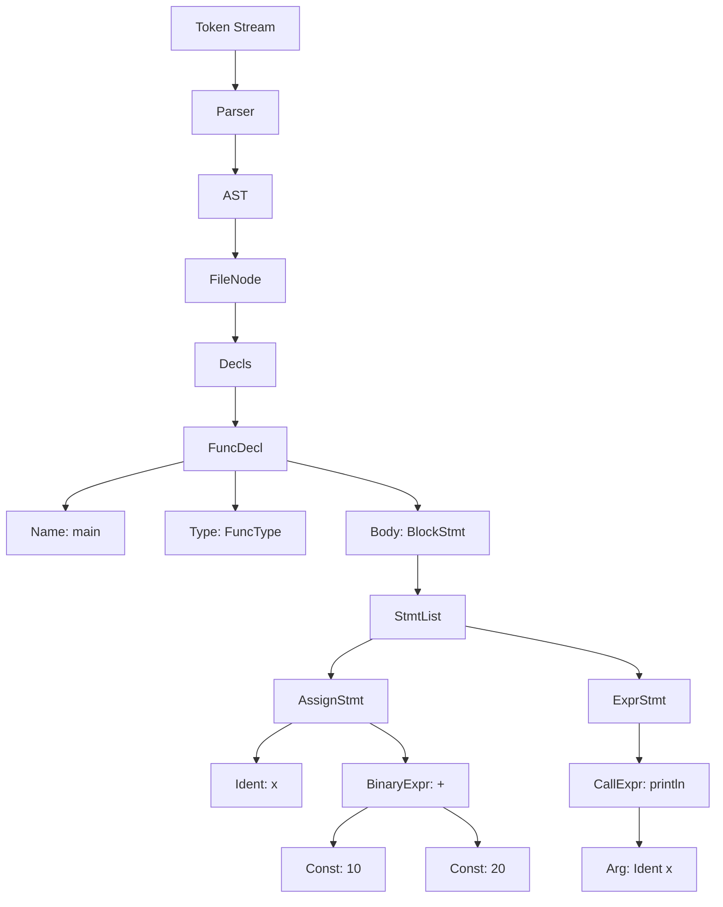

**根本原因分析**：为什么Go选择手写Parser而不是使用Parser Generator？

Go语言的创始团队在设计之初就决定手写Parser，而不是使用Yacc或Bison等Parser Generator。这有几个重要原因：

1. **错误信息质量**：手写的Parser可以产生更友好、更准确的错误信息。Go编译器在遇到语法错误时，会告诉用户具体是哪里出了问题，以及应该怎么修复，而不是给出一个晦涩的语法错误。

2. **编译速度**：手写的高效Parser比Parser Generator生成的代码执行得更快。这直接影响了整体的编译时间。

3. **可控性**：手写Parser让编译器团队可以完全控制解析过程，便于优化和调试。

这个决策体现了Go语言设计中一个核心原则：**简单性**。虽然手写Parser增加了初始开发工作量，但从长远来看，它带来了更好的用户体验和性能。

#### 语义分析（Semantic Analysis）

语义分析是编译过程中最复杂的阶段之一。它的主要任务包括：

1. **类型检查**：验证表达式的类型是否正确，函数调用是否有正确的参数数量和类型。
2. **作用域分析**：解析标识符的含义，确定变量或函数的引用指向哪个声明。
3. **常量求值**：在编译期计算常量表达式。
4. **方法解析**：处理接口方法和类型方法的绑定。

```go
package main

import "fmt"

func main() {
    // 类型错误示例
    var a int = "hello"  // 错误：cannot use "hello" (untyped string constant) as int value
    
    // 作用域示例
    x := 10
    {
        x := 20  // 内部x隐藏外部x
        fmt.Println(x)  // 输出20
    }
    fmt.Println(x)  // 输出10
}
```

### 1.2 Go语言的独特设计：正交性原则

Go语言的设计者们提出了一个重要的原则：**正交性（Orthogonality）**。这意味着语言的各个特性应该是相互独立的，一个特性的改变不应该影响其他特性。这种设计大大简化了编译器的实现。

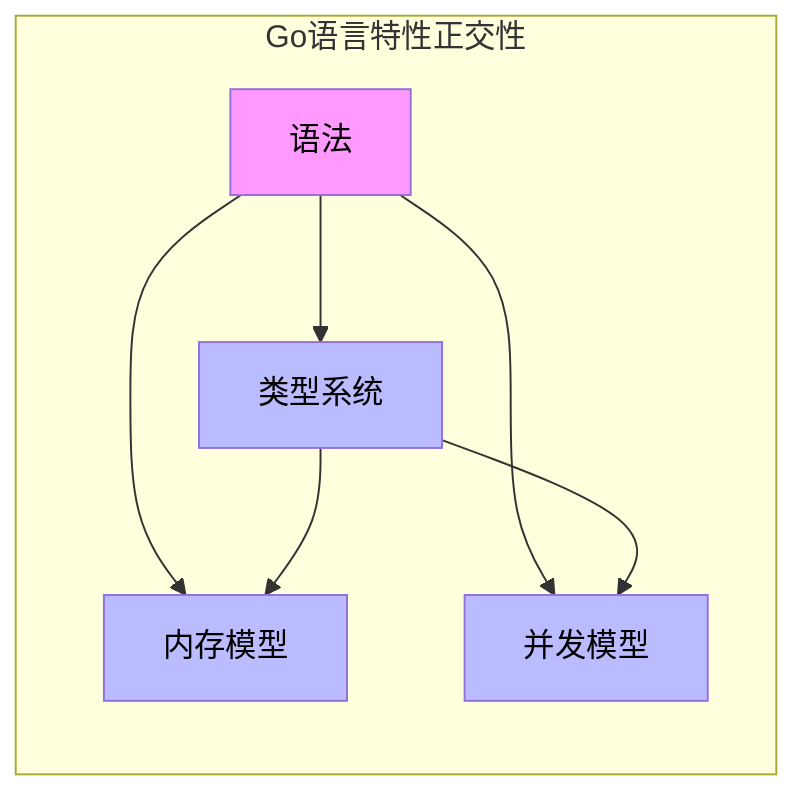

**正交性原则的具体体现：**

1. **类型系统正交**：Go的类型系统不依赖于其他特性。你可以在任何类型上定义方法，不受类型的声明方式限制。

2. **接口与实现正交**：接口只是方法集合的声明，任何类型只要实现了接口的方法就自动满足接口要求，不需要显式声明。

3. **包与导入正交**：包的导入和类型系统是正交的，你可以在不改变类型语义的情况下重组代码。

**根本原因分析**：为什么正交性对编译速度如此重要？

正交性设计使得编译器可以在不同的编译阶段独立处理不同的特性，而不需要考虑它们之间的交互。这意味着：

1. **增量编译更高效**：改变一个特性不会连锁影响其他特性，编译器可以准确地只重新编译受影响的部分。

2. **并行处理更容易**：正交的阶段可以并行执行，充分利用多核处理器。

3. **编译器代码更简洁**：不需要处理特性之间的复杂交互，代码更易维护和优化。

### 1.3 编译器的两阶段构建

Go语言的编译过程可以分为两个主要阶段：**配置阶段（gc）和运行时阶段（runtime）**。

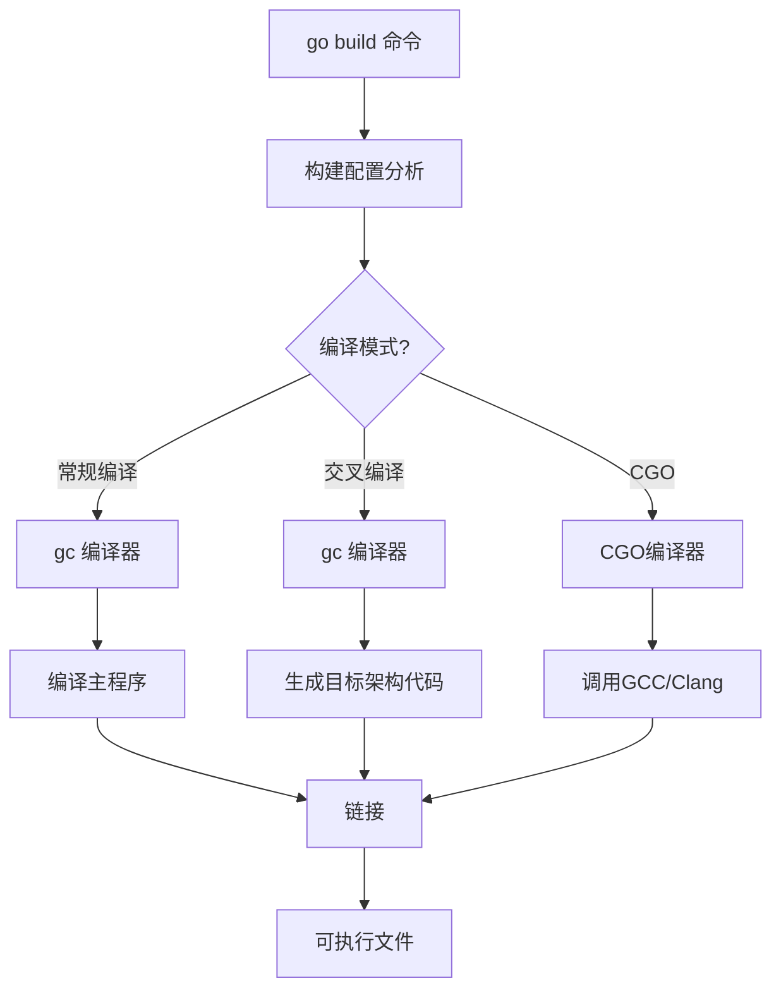

#### gc编译器

gc是Go语言的官方编译器，也称为“gc”（Go compiler，与gcc区分）。它完全用Go语言编写（除了少量的汇编代码），这在编译器领域是罕见的。

gc编译器的主要特点是：
- **自举**：Go编译器可以用Go语言自身来编译，这展示了Go语言的完整性。
- **速度快**：gc编译器的设计目标之一就是快速编译。
- **输出稳定**：生成的代码质量稳定，可预测性强。

#### runtime运行时

Go语言的运行时（runtime）是一个规模相当大的库，它包含了Go程序运行所需的基础设施：垃圾回收器、并发调度器、反射系统、字符串和切片处理等。

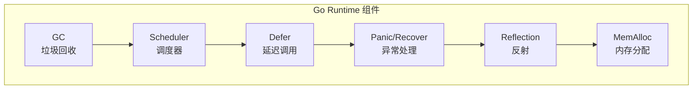

---

## 第二章：Go编译过程详解

### 2.1 从源码到可执行文件

当执行`go build`命令时，Go编译器会经历多个阶段的处理。理解这些阶段对于优化编译过程至关重要。

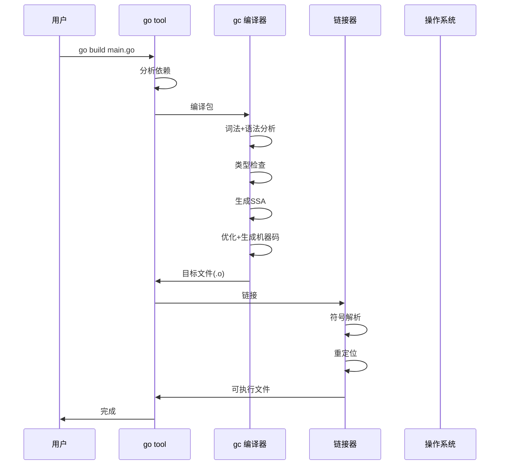

### 2.2 词法与语法分析阶段

Go的词法和语法分析器位于`go/src/cmd/compile/internal/base`目录中。这些组件是Go语言快速编译的基础。

**词法分析的关键设计：**

1. **DFA（确定有限状态自动机）**：Go使用DFA进行词法分析，这种方法对输入进行线性扫描，时间复杂度为O(n)。

2. **标记缓存**：对于大型文件，Go编译器会缓存已经解析的标记，以便快速重新处理。

3. **Unicode支持**：Go的词法分析器完全支持Unicode，包括UTF-8编码的标识符。

```go
// 词法分析示例：Go支持Unicode标识符
变量 := "Hello"  // 有效
αβγ := 100       // 有效（非ASCII标识符）
世界 := "World"  // 有效
```

**语法分析的关键设计：**

1. **自顶向下递归下降**：Go使用递归下降Parser，这种方法直观且易于实现。

2. **无回溯设计**：Go的语法设计避免了歧义，使得Parser不需要回溯。

3. **错误恢复**：当遇到语法错误时，Parser会尝试继续解析，以便报告更多错误。

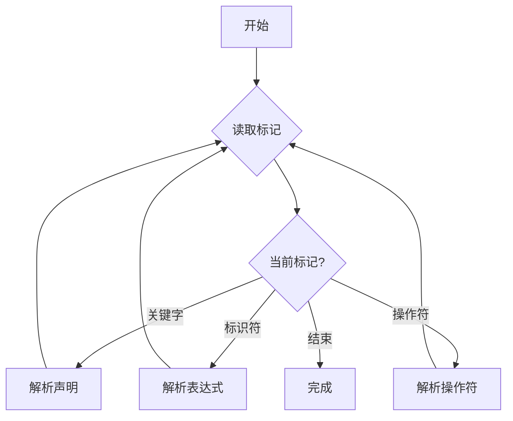

### 2.3 类型检查阶段

Go的类型检查是编译过程中计算量最大的阶段之一。这一阶段的工作包括：

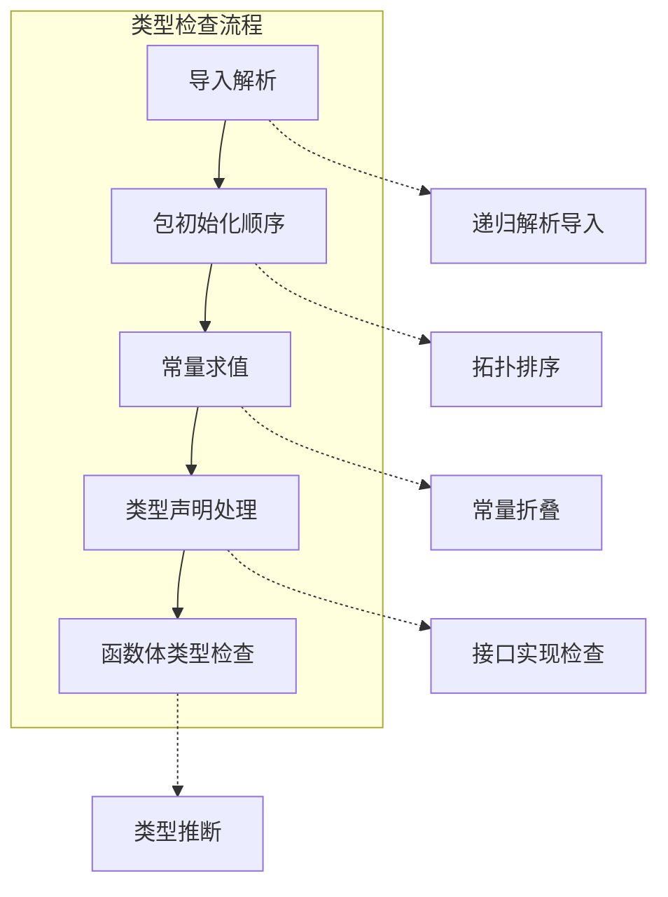

#### 类型检查的优化

Go 1.11引入了**类型检查缓存**机制，这大大加速了增量编译。当源文件没有变化时，编译器可以直接使用缓存的类型检查结果。

```go
// 类型检查示例
package main

// 类型定义
type MyInt int

// 方法定义（类型检查会验证接收者类型）
func (m MyInt) String() string {
    return "MyInt"
}

// 接口实现检查
type Reader interface {
    Read(p []byte) (n int, err error)
}

// 编译器会验证MyInt是否实现Reader
var _ Reader = (*MyInt)(nil)  // 编译期检查
```

**根本原因分析**：为什么Go的类型检查相对较快？

1. **简单的类型系统**：Go的类型系统没有泛型（直到Go 1.18）、没有继承、没有模板，这大大简化了类型检查的复杂度。

2. **一次性检查**：Go的类型检查是按包进行的，每个包只检查一次，类型信息在包内可见。

3. **正交设计**：Go的类型系统与语法正交，类型检查不需要考虑语法细节。

### 2.4 SSA生成与优化阶段

**SSA（Static Single Assignment，静态单赋值）**是现代编译器中广泛使用的中间表示形式。Go编译器在1.7版本引入了SSA，这标志着Go编译器优化能力的大幅提升。

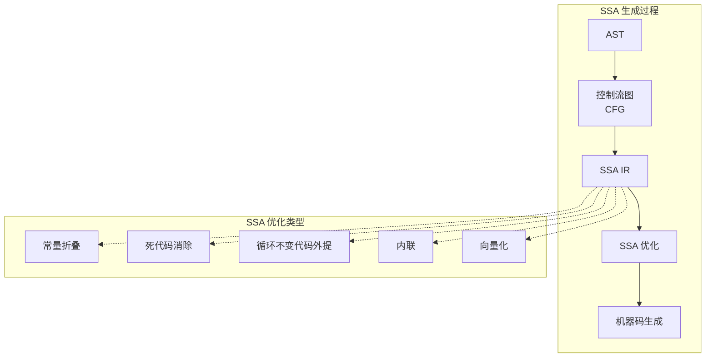

#### SSA的基本概念

SSA的核心思想是：每个变量只被赋值一次。这使得编译器可以更精确地分析数据流。

```go
// 原始代码
func add(a, b int) int {
    x := a
    y := b
    return x + y
}

// SSA形式（简化）
func add(a, b int) int:
    x_1 = a
    y_1 = b
    return x_1 + y_1
```

#### 常见的SSA优化

**1. 常量折叠（Constant Folding）**

```go
// 原始代码
const a = 1 + 2  // 编译时计算为3
var b = a * 4    // 编译时计算为12

// SSA优化后
const a = 3
var b = 12
```

**2. 死代码消除（Dead Code Elimination）**

```go
// 原始代码
func deadCode() {
    x := 10  // 这个赋值从未被使用
    println("hello")  // 这行会保留
}

// 优化后
func deadCode() {
    println("hello")
}
```

**3. 内联（Inlining）**

```go
// 原始代码
func add(a, b int) int {
    return a + b
}

func main() {
    result := add(1, 2)
    println(result)
}

// 优化后（较小函数被内联）
func main() {
    result := 1 + 2
    println(result)
}
```

**根本原因分析**：为什么Go的SSA优化相对保守？

Go语言的一个核心设计哲学是**“简单”**。过于激进的优化可能导致：

1. **编译时间增加**：复杂的优化需要更多的计算时间。
2. **调试困难**：过度优化的代码难以与源代码对应，调试时会产生困惑。
3. **可预测性**：Go的运行行为应该是可预测的，过于激进的优化可能改变程序的行为。

因此，Go的编译器优化主要关注那些**收益明显**、**风险较低**的优化，如基本块内的优化、函数内联、小函数优化等。

### 2.5 链接阶段

链接是编译过程的最后一步，它将多个目标文件合并为可执行文件。Go的链接器设计非常独特：它是一个**自包含的链接器**，不需要依赖外部工具。


#### Go链接器的特点

1. **单遍链接**：Go的链接器只需要一次遍历就可以完成链接，这比传统链接器快得多。

2. **平面链接**：Go的可执行文件是“平坦”的，没有复杂的段结构，简化了加载过程。

3. **静态链接**：Go程序默认静态链接所有依赖，生成的二进制文件是自包含的。

```bash
# 检查Go二进制文件的链接方式
$ go build -o myapp main.go
$ file myapp
myapp: ELF 64-bit LSB executable, x86-64, version 1 (GNU/Linux), statically linked

$ ldd myapp
    not a dynamic executable
```

---

## 第三章：编译标志与优化

### 3.1 常用编译标志

Go的编译器提供了丰富的编译标志来控制优化行为。以下是最常用的标志：

```bash
# 基本构建
go build -o output input.go

# 优化级别
go build -gcflags="-O" main.go      # 启用优化
go build -gcflags="-O -N" main.go   # 启用优化，禁用部分优化
go build -gcflags="-O2" main.go      # 更激进的优化
go build -gcflags="-O3" main.go      # 最激进的优化

# 调试信息
go build -gcflags="-S" main.go      # 输出汇编代码
go build -gcflags="-l" main.go       # 禁用函数内联

# 链接器标志
go build -ldflags="-s -w" main.go   # 去除符号表和调试信息
go build -ldflags="-X main.version=1.0" main.go  # 设置变量值
```

### 3.2 优化标志详解

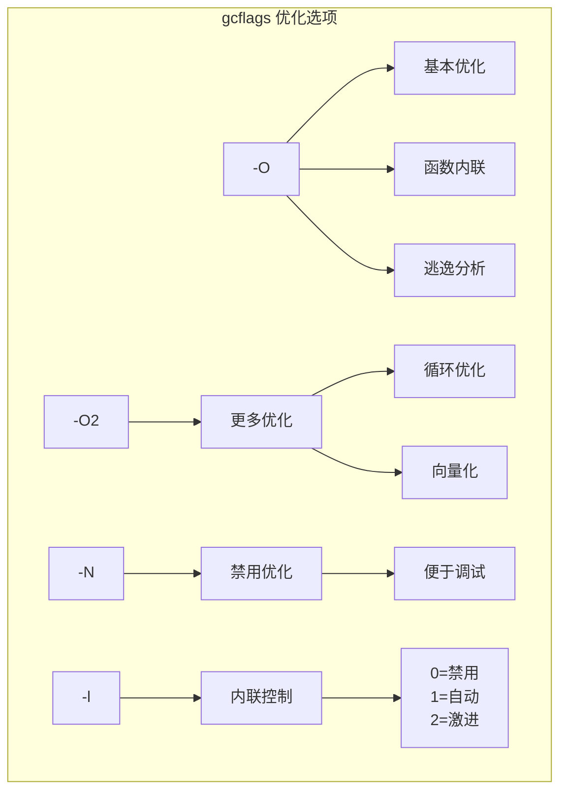

#### -O标志

`-O`是标准的优化级别，它启用一组经过验证的、安全的优化：

1. **函数内联**：将小函数调用替换为函数体内容。
2. **常量传播**：将常量表达式的计算提前到编译期。
3. **死代码消除**：移除不会被执行或结果不会被使用的代码。
4. **寄存器分配优化**：更高效地使用CPU寄存器。

```go
// 优化前
func getValue() int {
    x := 10
    return x
}

func main() {
    println(getValue())  // println(10)
}

// 优化后
func main() {
    println(10)
}
```

#### -N标志

`-N`禁用所有优化，这对于调试代码非常有帮助。当你需要逐步执行代码、理解程序的实际执行流程时，使用`-N`可以避免优化带来的干扰。

```bash
# 禁用优化进行调试
go build -gcflags="-N" -o debug_bin main.go
```

#### -l标志

`-l`控制函数内联的级别：

- `-l`（不带数字）：禁用函数内联
- `-l=0`：禁用内联
- `-l=1`：自动内联（默认）
- `-l=2`：激进内联

```go
// 使用内联提示
//go:inline
func smallFunc() int {
    return 1 + 2
}

// 禁止内联
//go:noinline
func noInlineFunc() int {
    return 1 + 2
}
```

### 3.3 链接器标志

```bash
# 去除调试信息和符号表
go build -ldflags="-s -w" main.go

# 设置链接器模式
go build -ldflags="-linkmode=internal" main.go

# 控制并发链接
go build -ldflags="-p=2" main.go

# 设置启动参数
go build -ldflags="-X main.version=1.0.0" main.go
```

#### -s和-w标志

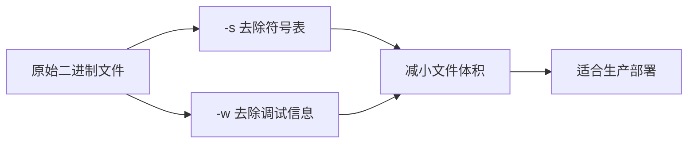

- `-s`：去除符号表。这会移除函数名、变量名等信息，使二进制文件更小，但无法进行堆栈跟踪。
- `-w`：去除调试信息。这会移除DWARF调试数据，影响调试能力。

```bash
# 效果示例
$ go build -o normal main.go
$ go build -ldflags="-s -w" -o optimized main.go

$ ls -lh normal optimized
-rwxr-xr-x 1 user  12M normal
-rwxr-xr-x 1 user  8.5M optimized   # 小约30%
```

#### -X标志

`-X`用于在链接时设置字符串变量的值。这常用于注入版本信息。

```go
// 程序中定义
var version string
var buildTime string

// 编译时注入
go build -ldflags="-X main.version=v1.0.0 -X main.buildTime=$(date)" main.go
```

### 3.4 编译优化与调试的平衡

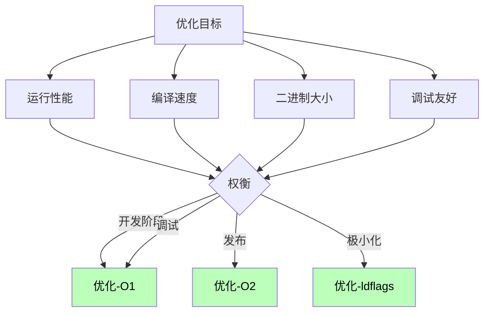

---

## 第四章：函数内联深度解析

### 4.1 内联的基本概念

函数内联（Function Inlining）是编译器优化中最重要也最有效的技术之一。它的核心思想是：将函数调用点替换为被调用函数的函数体。

```go
// 优化前
func add(a, b int) int {
    return a + b
}

func main() {
    result := add(1, 2)
    println(result)
}

// 优化后
func main() {
    result := 1 + 2
    println(result)
}
```

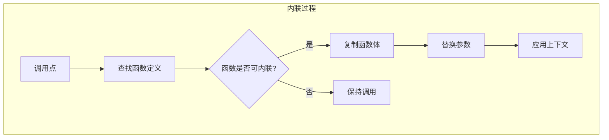

### 4.2 Go的内联策略

Go编译器的内联策略遵循以下规则：

1. **大小限制**：只有函数体足够小（通常小于32-48个字节）的函数才能被内联。
2. **复杂度限制**：包含循环、递归、复杂控制的函数通常不会内联。
3. **成本模型**：编译器使用成本模型来估算内联的收益。

```go
// 会被内联的函数
func add(a, b int) int {
    return a + b  // 简单函数
}

// 不会被内联的函数
func complexFunc(n int) int {
    for i := 0; i < n; i++ {  // 包含循环
        if i > 10 {
            return i
        }
    }
    return 0
}
```

**根本原因分析**：为什么Go对内联如此保守？

Go语言的设计哲学强调**可预测性**和**简单性**。过于激进的内联可能导致：

1. **二进制膨胀**：大量内联会显著增加代码体积。
2. **编译时间增加**：内联展开需要更多的编译时间。
3. **调试困难**：内联后的代码与源代码不对应。
4. **缓存污染**：过大的函数可能无法放入CPU缓存。

Go选择了一个平衡点：只内联小型、简单的函数，这既能获得性能收益，又不会带来上述问题。

### 4.3 内联对性能的影响

内联可以带来多方面的性能提升：

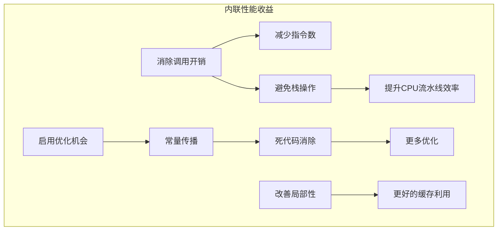

#### 1. 消除函数调用开销

```go
// 优化前：每次调用都有开销
func process() {
    for i := 0; i < 1000; i++ {
        add(i, 1)  // 每次调用都有push/pop栈帧的开销
    }
}

// 优化后：消除了调用开销
func process() {
    for i := 0; i < 1000; i++ {
        i + 1  // 内联后直接使用计算结果
    }
}
```

#### 2. 启用更多优化

内联后，编译器可以看到更多的上下文，从而应用更多优化。

```go
// 内联前
func getValue() int {
    return 42
}

func process() {
    x := getValue() + getValue()  // 两次调用
}

// 内联后：可以识别出常量
func process() {
    x := 42 + 42  // 可以优化为 x := 84
}
```

### 4.4 控制内联行为

Go提供了多种方式来控制内联行为：

```go
// 强制内联提示
//go:inline
func smallFunc() int {
    return 1 + 2
}

// 禁止内联提示
//go:noinline
func notInlined() int {
    return 1 + 2
}

// 内联级别控制
// go build -gcflags="-l=2" 激进内联
```

```bash
# 查看内联决策
go build -gcflags="-m" main.go

# 输出示例
./main.go:10:6: can inline add with cost 2, bounds
./main.go:17:6: cannot inline complex: function too complex (-cost 40)
```

### 4.5 内联与边界


---

## 第五章：逃逸分析深度解析

### 5.1 什么是逃逸分析？

逃逸分析（Escape Analysis）是编译器的一种优化技术，用于分析变量的生命周期和作用域范围。其核心目标是确定变量应该分配在**栈**上还是**堆**上。

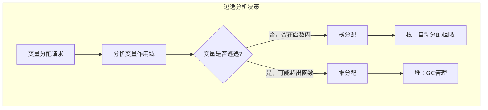

### 5.2 逃逸分析的根本原因

为什么需要区分栈和堆的分配？这是一个根本性的问题。

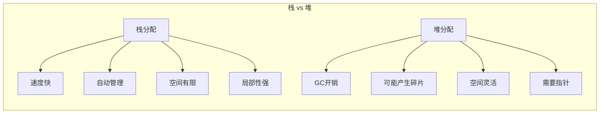

**栈分配的优势：**

1. **分配速度**：栈分配只是移动栈指针，复杂度为O(1)；堆分配需要查找可用空间，复杂度较高。
2. **自动回收**：函数返回时自动回收栈空间，无需GC介入。
3. **缓存友好**：栈内存连续，对CPU缓存更友好。

**根本原因分析**：为什么Go要使用逃逸分析？

Go语言没有提供手动分配/释放内存的机制（如C的malloc/free）。如果所有变量都分配在堆上，会带来两个问题：

1. **GC压力**：大量的堆分配会给垃圾回收器带来沉重负担。
2. **内存碎片**：频繁的堆分配/释放会导致内存碎片化。

逃逸分析让编译器可以在编译期做出最优的分配决策：对于不会逃逸的变量，使用栈分配，享受栈的优势；对于可能逃逸的变量，使用堆分配，由GC管理。

### 5.3 逃逸分析示例

```go
package main

// 示例1：变量不逃逸，分配在栈上
func stackAlloc() int {
    x := 10  // 编译器会将其分配在栈上
    return x
}

// 示例2：变量逃逸，分配在堆上
func heapAlloc() *int {
    x := 10  // x的地址被返回，逃逸到堆
    return &x
}

// 示例3：通过接口逃逸
type Any interface {
    Do()
}

type Foo int

func (f Foo) Do() {}

func interfaceEscape() {
    var f Any = Foo(10)  // Foo类型需要分配在堆上，因为存储在接口中
    f.Do()
}

// 示例4：闭包中的变量逃逸
func closureEscape() func() int {
    x := 10
    return func() int {  // 闭包引用x，x逃逸到堆
        return x
    }
}
```

### 5.4 逃逸分析的影响

#### 对性能的影响

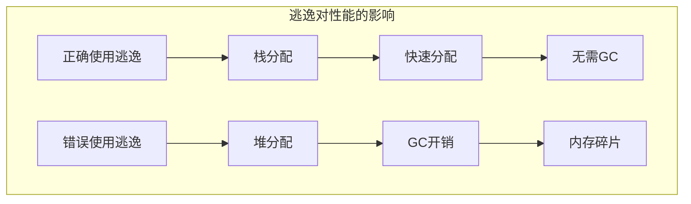

#### 典型案例分析

**案例1：切片增长导致逃逸**

```go
// 优化前：每次append都可能触发重新分配
func process() {
    var s []int
    for i := 0; i < 1000; i++ {
        s = append(s, i)
        // 切片增长时，内部数组可能逃逸
    }
}

// 优化：预分配足够容量
func process() {
    s := make([]int, 0, 1000)  // 预分配容量
    for i := 0; i < 1000; i++ {
        s = append(s, i)
    }
}
```

**案例2：map操作**

```go
// map的值总是可能逃逸
func mapEscape() map[string]int {
    m := make(map[string]int)
    m["key"] = 10
    return m  // map逃逸到堆
}

// 如果只需要在函数内使用
func mapNoEscape() {
    m := make(map[string]int)
    m["key"] = 10
    // 函数返回后map可被回收
}
```

**案例3：接口类型**

```go
// 接口类型会隐藏具体类型，导致逃逸
func interfaceHidden() {
    var i interface{} = 42  // 整数被装箱到堆上
    println(i)
}

// 使用具体类型避免装箱
func concreteType() {
    i := 42  // 如果不逃逸，则在栈上
    println(i)
}
```

### 5.5 控制逃逸行为

```bash
# 查看变量的逃逸分析
go build -gcflags="-m" main.go

main.go:10:2: x escapes to heap:
main.go:10:2:   flow: {returnable: &x}
main.go:10:2:     from &x (address-of operator) at line 12
main.go:10:2: from *int (interface element) at line 12
```

```go
// 使用runtime.KeepAlive防止意外优化
func keepAliveExample() {
    x := make([]byte, 1024)
    // 使用指针防止x逃逸（实际不会发生，只是演示）
    p := &x[0]
    // ... 使用p
    
    // 确保x在使用前不被GC回收
    runtime.KeepAlive(p)
}
```

---

## 第六章：GC（垃圾回收）优化

### 6.1 Go GC的工作原理

Go的垃圾回收器经历了多次重大迭代。从最初的标记-清除（Mark-Sweep）到Go 1.5的三色标记法，再到Go 1.8的混合写屏障，Go的GC一直在不断进化。

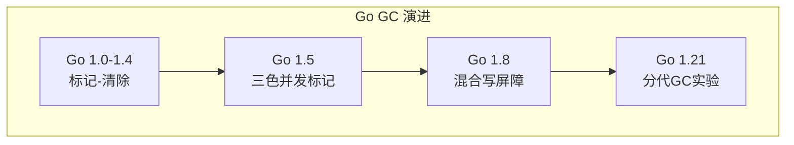

#### 三色标记法

```mermaid
flowchart TB
    subgraph 三色标记过程
        A[灰色集合<br/>待处理] --> B[白色集合<br/>未扫描]
        B --> C[黑色集合<br/>已处理]
        
        A -->|扫描对象| D[当前对象]
        D --> E{是否有指针?}
        E -->|是| F[标记子对象为灰]
        E -->|否| G[标记为黑]
        
        F --> H[对象变黑]
        H --> C
        G --> C
    end
```

### 6.2 GC优化的根本原因

**根本原因分析**：为什么要优化GC？

GC虽然解放了开发者手动管理内存的负担，但它本身是有成本的：

1. **STW（Stop The World）**：GC过程中需要暂停程序执行，这会影响延迟敏感的应用。
2. **CPU占用**：GC需要消耗CPU周期，在高吞吐量场景下影响性能。
3. **内存占用**：GC需要维护额外的数据结构，如标记位图、灰色队列等。

```mermaid
flowchart TD
    subgraph GC 成本
        A[时间成本] --> A1[STW暂停]
        A1 --> A2[标记时间]
        A1 --> A3[清除时间]
        
        B[空间成本] --> B1[标记位图]
        B1 --> B2[灰色队列]
        B1 --> B3[根集合]
    end
```

### 6.3 GC调优策略

#### 1. 减少内存分配

```go
// 优化前：频繁分配
func processBadly(data []int) []int {
    result := make([]int, 0)
    for _, v := range data {
        result = append(result, v*2)  // 多次append
    }
    return result
}

// 优化后：预分配
func processBetter(data []int) []int {
    result := make([]int, len(data))  // 预分配
    for i, v := range data {
        result[i] = v * 2
    }
    return result
}
```

#### 2. 使用对象池

```go
// sync.Pool 示例
var bufferPool = sync.Pool{
    New: func() interface{} {
        return make([]byte, 1024)
    },
}

func usePool() {
    buf := bufferPool.Get().([]byte)
    defer bufferPool.Put(buf)
    // 使用buf
}
```

```go
// 手动对象池示例
type IntSet struct {
    data map[int]struct{}
}

var intPool = sync.Pool{
    New: func() interface{} {
        return &IntSet{data: make(map[int]struct{})}
    },
}

func getSet() *IntSet {
    s := intPool.Get().(*IntSet)
    s.data = make(map[int]struct{})
    return s
}

func putSet(s *IntSet) {
    intPool.Put(s)
}
```

#### 3. GOGC环境变量

```bash
# GOGC控制GC触发频率，默认100表示上次GC后内存增长100%时触发下一次GC
GOGC=50    # 更频繁的GC，更低内存峰值
GOGC=200   # 更宽松的GC，可能有更高内存占用但更少GC暂停

# GODEBUG控制GC行为
GODEBUG=gctrace=1    # 输出GC日志
GODEBUG=gcpacertrace=1  # 输出GC调步器信息
```

```bash
# 生产环境建议
# 对于内存敏感的服务，降低GOGC
GOGC=50 go run main.go

# 对于延迟敏感的服务，使用更小的GC批次
GOGC=100 GOMEMLIMIT=2GiB go run main.go
```

### 6.4 内存配置最佳实践

```mermaid
flowchart TB
    subgraph 内存配置策略
        A[分析应用特点] --> B{主要目标?}
        B -->|低延迟| C[降低GOGC]
        B -->|高吞吐| D[优化内存分配]
        B -->|资源限制| E[设置MEMLIMIT]
    end
    
    C --> F[GOGC=50-75]
    D --> G[对象池+预分配]
    E --> H[GOMEMLIMIT=XX
    style F fill:#bfb,color:#000
    style G fill:#bfb,color:#000
    style H fill:#bfb,color:#000
```

```go
// 设置内存限制
func main() {
    // 通过GOMEMLIMIT环境变量设置
    // 或在运行时设置
    debug.SetMemoryLimit(2 * 1024 * 1024 * 1024) // 2GB
}
```

---

## 第七章：编译时优化进阶

### 7.1 死代码消除

死代码（Dead Code）是指那些执行结果不会被使用的代码。Go编译器会主动识别并消除这类代码。

```go
// 示例1：未使用的变量
func unusedVar() {
    x := 10  // 编译错误，不能声明未使用的变量
}

// 示例2：未使用的函数
func unusedFunc() {
    // 编译器会提示：unusedFunc is unused
}

func main() {
    println("hello")
}

// 示例3：条件恒假的代码
func deadBranch() {
    if false {  // 编译优化：永远不会执行
        println("never")
    }
    
    // 编译期可确定的循环
    for i := 0; false; i++ {  // 循环不会执行
        println(i)
    }
}
```

```mermaid
flowchart TB
    subgraph 死代码消除流程
        A[源代码] --> B[控制流分析]
        B --> C[数据流分析]
        C --> D[识别不可达代码]
        D --> E[移除死代码]
        
        F[常量条件] --> D
        G[未使用变量] --> D
        H[不可能的分支] --> D
    end
```

### 7.2 常量折叠

编译器会在编译期计算常量表达式，而不需要等到运行时。

```go
// 编译期计算
const X = 1 + 2          // X = 3
const Y = X * 4          // Y = 12
const S = "hello" + "world"  // S = "helloworld"

func main() {
    // 所有计算都在编译期完成
    println(X, Y, S)
    
    // 数组大小编译期确定
    arr := [X]int{}  // arr := [3]int{}
}
```

### 7.3 循环优化

```go
// 示例1：循环不变代码外提
func loopInvariant() {
    var s int
    n := 1000
    a := getValue()  // 不变
    
    for i := 0; i < n; i++ {
        s += i * a  // a在循环中不变，可以提取
    }
}

// 优化后
func loopInvariant() {
    var s int
    n := 1000
    a := getValue()
    
    // a * i(i+1)/2 的数学优化
    s = a * n * (n - 1) / 2
}

// 示例2：范围遍历优化
func rangeLoop() []int {
    s := make([]int, 0, 100)
    for i := 0; i < 100; i++ {
        s = append(s, i)
    }
    return s
}

// 优化后
func rangeLoop() []int {
    s := make([]int, 100)
    for i := 0; i < 100; i++ {
        s[i] = i
    }
    return s[:100]
}
```

### 7.4 字符串和字节切片优化

```go
// 示例1：字符串拼接
func concatBad() string {
    s := ""
    for i := 0; i < 1000; i++ {
        s += "a"  // 每次都创建新字符串
    }
    return s
}

func concatGood() string {
    var b strings.Builder
    for i := 0; i < 1000; i++ {
        b.WriteString("a")
    }
    return b.String()
}

// 示例2：bytes操作
func bytesBad(s string) []byte {
    return []byte(s)  // 复制
}

func bytesGood(s string) []byte {
    return *(*[]byte)(unsafe.Pointer(&s))  // 直接转换（不安全但高效）
}
```

### 7.5 反射与优化

```mermaid
flowchart TB
    subgraph 反射的性能影响
        A[反射调用] --> B[运行时类型检查]
        B --> C[动态调度]
        C --> D[类型转换]
        
        E[优化策略] --> F[避免反射]
        F --> G[使用代码生成]
        F --> H[类型断言缓存]
    end
```

```go
// 反射优化示例
type Handler struct {
    typ reflect.Type
    fn  reflect.Value
}

// 优化：缓存类型信息
func (h *Handler) Call(args []interface{}) {
    // 使用预先缓存的Type进行调用
    in := make([]reflect.Value, len(args))
    for i, arg := range args {
        in[i] = reflect.ValueOf(arg)
    }
    h.fn.Call(in)
}
```

---

## 第八章：链接器优化

### 8.1 链接过程详解

链接是编译的最后一步，它将编译后的目标文件合并为可执行文件。Go的链接器是用Go语言编写的自包含链接器。

```mermaid
flowchart TB
    subgraph 链接过程
        A[多个目标文件] --> B[符号解析]
        B --> C[重定位]
        C --> D[节合并]
        D --> E[地址分配]
        E --> F[可执行文件]
    end
    
    B --> B1[查找符号定义]
    B --> B2[处理未定义引用]
    C --> C1[计算相对地址]
    C --> C2[应用重定位条目]
```

### 8.2 链接器标志详解

```bash
# 去除符号表和调试信息
go build -ldflags="-s -w" main.go

# 去除DWARF调试段
go build -ldflags="-s" main.go

# 设置入口点
go build -ldflags="-e" main.go

go build -ldflags="-p=4" main.go  # 4个并发链接任务
```

### 8.3 二进制文件大小优化

```mermaid
flowchart TB
    subgraph 二进制组成
        A[代码段] --> B[只读数据]
        B --> C[可读写数据]
        C --> D[符号表]
        D --> E[调试信息]
    end
    
    F[优化策略] --> G[去除调试信息]
    F --> H[去除符号表]
    F --> I[使用UPX压缩]
    F --> J[模块裁剪]
    
    G --> K[ldflags="-s"]
    H --> L[ldflags="-w"]
    J --> M[go build -trimpath]
```

#### 优化示例

```bash
# 基础优化
go build -ldflags="-s -w" -o optimized main.go

# 激进优化（可能影响调试）
go build -ldflags="-s -w -linkmode=internal -buildid=" -o minimal main.go

# 使用upx压缩（可选）
upx --best optimized
```

#### 优化前后对比

```bash
$ ls -lh
-rwxr-xr-x 1 user  15M original
-rwxr-xr-x 1 user  10M optimized
-rwxr-xr-x 1 user  3.5M compressed  # UPX压缩后
```

### 8.4 链接时优化（LTO）

Go 1.20引入了实验性的链接时优化（Link-Time Optimization，LTO）。

```bash
# 启用LTO
go build -ldflags="-lto=1" main.go

# 或者通过gcflags
go build -gcflags="-lto=1" main.go
```

LTO允许链接器在链接阶段进行跨包的优化，这可以带来更好的优化效果，但会增加编译时间。

```go
// LTO可以优化的示例
package a

func Process() int {
    return heavyComputation()  // 跨包调用可能被优化
}

package b

import "a"

func main() {
    r := a.Process()  // LTO可能内联
}
```

---

## 第九章：代码生成与静态分析

### 9.1 go:generate

Go提供了`go:generate`指令来触发代码生成。

```go
//go:generate go run gen.go

package main

// GenerateExample 演示代码生成
//go:generate stringer -type=Status
type Status int

const (
    StatusOK Status = iota
    StatusError
    StatusPending
)
```

```bash
# 运行代码生成
go generate ./...

# 或者指定特定生成器
go generate -run="stringer" ./...
```

### 9.2 类型检查器优化

```go
// 使用类型断言避免接口开销
func processInterface(i interface{}) {
    // 方式1：接口存储
    s := i.(string)  // 有开销
    
    // 方式2：类型分支优化
    switch v := i.(type) {
    case string:
        // v是string类型
        println(v)
    case int:
        println(v)
    }
}
```

### 9.3 编译缓存

```mermaid
flowchart TB
    subgraph 编译缓存机制
        A[源代码] --> B[计算Hash]
        B --> C[检查缓存]
        C --> D{命中缓存?}
        D -->|是| E[使用缓存结果]
        D -->|否| F[执行编译]
        F --> G[写入缓存]
        E --> H[链接]
        G --> H
    end
```

```bash
# 清理编译缓存
go clean -cache

# 查看缓存统计
go env GOCACHE

# 强制重新编译
go build -count=1 main.go
```

---

## 第十章：性能调优实战

### 10.1 构建配置最佳实践

```mermaid
flowchart TB
    subgraph 开发环境
        A[快速迭代] --> B["-gcflags='-O -N'"]
        B --> C["-ldflags='-s'"]
    end
    
    subgraph 测试环境
        D[完整优化] --> E["-gcflags='-O'"]
        E --> F["-race 检测竞态"]
    end
    
    subgraph 生产环境
        G[激进优化] --> H["-gcflags='-O2'"]
        H --> I["-ldflags='-s -w'"]
        I --> J["-tags=prod"]
    end
    
    style A fill:#bfb,color:#000
    style D fill:#bbf,color:#000
    style G fill:#fbb,color:#000
```

### 10.2 编译时间优化

```go
// 优化编译时间的策略

// 1. 减少依赖
import (
    _ "embed"  // 仅导入需要的包
)

// 2. 使用接口而非具体类型
type Reader interface {
    Read(p []byte) (n int, err error)
}

// 3. 避免不必要的重编译
// - 使用go:build控制编译条件
// - 将不常变化的代码分离到独立包

// 4. 利用go.mod的retract指示版
```

```bash
# 增量构建
go build .           # 只编译变化的包
go build ./...       # 编译整个模块

# 并行构建
go build -p=4 ./...  # 4个并行构建任务

# 编译缓存
go env GOCACHE      # 查看缓存目录
go clean -cache     # 清理缓存（慎用）
```

### 10.3 运行时性能优化

```go
package main

import (
    "runtime"
    "time"
)

// 优化示例1：设置GOMAXPROCS
func init() {
    // 默认使用所有CPU核心
    // 对于I/O密集型应用，可以设置更大的值
    runtime.GOMAXPROCS(runtime.NumCPU())
}

// 优化示例2：使用空结构节省内存
type Set map[string]struct{}  // 比map[string]bool更节省

// 优化示例3：预分配内存
func main() {
    // 切片预分配
    s := make([]int, 0, 1000)
    
    // Map预分配
    m := make(map[string]int, 1000)
}
```

### 10.4 分析工具

```mermaid
flowchart TB
    subgraph Go 性能分析工具
        A[pprof] --> B[CPU分析]
        A --> C[内存分析]
        A --> D[阻塞分析]
        A --> E[可视化]
        
        B --> F[go tool pprof]
        C --> F
        D --> F
        
        E --> G[web UI]
        E --> H[命令行]
    end
```

```bash
# CPU分析
go test -cpuprofile=cpu.prof -bench=.
go tool pprof cpu.prof

# 内存分析
go test -memprofile=mem.prof -bench=.
go tool pprof mem.prof

# 可视化
go tool pprof -http=:8080 cpu.prof

# 内联查看
go build -gcflags="-m" main.go
```

---

## 第十一章：高级编译技术

### 11.1 条件编译

Go使用构建标签（Build Tags）来实现条件编译。

```go
// +build linux
// +build amd64

// 仅在Linux AMD64上编译
package main

// +build darwin

// 仅在macOS上编译
package main
```

```go
// 文件级条件编译
// file: app_linux.go
// +build linux

package main

func platformInit() {
    println("Linux init")
}

// file: app_windows.go
// +build windows

package main

func platformInit() {
    println("Windows init")
}
```

```go
// 代码块级条件编译
//go:build linux && amd64

package main
```

### 11.2 交叉编译

```mermaid
flowchart TB
    subgraph 交叉编译目标
        A[GOOS] --> B[linux/darwin/windows/freebsd]
        C[GOARCH] --> D[amd64/386/arm64/arm]
    end
    
    subgraph 示例命令
        E[go env GOOS GOARCH]
        F[GOOS=linux GOARCH=arm64 go build]
        G[CGO_ENABLED=0 GOOS=js GOARCH=wasm go build]
    end
```

```bash
# 查看支持的平台
go tool dist list

# 交叉编译示例
GOOS=linux GOARCH=arm64 go build -o app-linux-arm64 main.go
GOOS=darwin GOARCH=amd64 go build -o app-darwin-amd64 main.go
GOOS=windows GOARCH=386 go build -o app-windows-386.exe main.go

# WASM编译
GOOS=js GOARCH=wasm go build -o app.wasm main.go
```

### 11.3 CGO与混合编译

```go
package main

/*
#include <stdio.h>
#include <stdlib.h>

void sayHello() {
    printf("Hello from C!\n");
}
*/
import "C"

func main() {
    C.sayHello()
}
```

```bash
# 启用CGO
CGO_ENABLED=1 go build main.go

# 禁用CGO
CGO_ENABLED=0 go build main.go

# 交叉编译时通常需要禁用CGO
CGO_ENABLED=0 GOOS=linux GOARCH=arm64 go build main.go
```

### 11.4 编译器前端扩展

Go 1.22引入了更灵活的编译器前端扩展机制。

```go
// 使用go:linkname进行内部函数链接
import _ "unsafe"

//go:linkname hashFunc internal/abi.FuncPCABI0
func hashFunc(...) ...

// 使用go:embed嵌入资源
import _ "embed"

//go:embed config.yaml
var configData []byte
```

---

## 第十二章：Go 1.21+ 编译优化新特性

### 12.1 分代GC实验

Go 1.21引入了实验性的分代垃圾回收器。

```bash
# 启用分代GC
GODEBUG=gctrace=1 GOGEN=1 go run main.go
```

分代GC的核心假设是：大多数对象都是短命的。基于这个假设，分代GC会优先收集新分配的对象，这可以减少GC扫描的工作量。

### 12.2 编译器的持续改进

```mermaid
flowchart TB
    subgraph Go 编译器演进
        A[Go 1.17] --> B[寄存器分配优化]
        A --> C[函数调用约定优化]
        
        B --> D[Go 1.18-1.20]
        D --> E[SSA优化增强]
        D --> F[内联策略改进]
        
        E --> G[Go 1.21+]
        G --> H[分代GC]
        G --> I[链接时优化增强]
        G --> J[更积极的逃逸分析]
    end
```

### 12.3 新的编译标志

```bash
# Go 1.21+ 新增的编译选项

# 启用实验性特性
-go=experimental

# 链接时优化级别
-ldflags="-lto=1"

# 查看更详细的优化信息
-go=-v main.go
```

---

## 第十三章：最佳实践与反模式

### 13.1 常见反模式

```mermaid
flowchart TB
    subgraph 反模式1
        A[不必要的接口] --> B[过度抽象]
        B --> C[增加复杂度]
    end
    
    subgraph 反模式2
        D[频繁小分配] --> E[GC压力]
        E --> F[性能下降]
    end
    
    subgraph 反模式3
        G[全局变量滥用] --> H[逃逸分析失效]
        H --> I[堆分配增加]
    end
```

```go
// 反模式1：不必要的接口
type Reader interface {
    Read(p []byte) (n int, err error)
}

func process(r io.Reader) {  // 过度使用接口
    // ...
}

// 正确做法：使用具体类型或泛型
func process(data []byte) {
    // ...
}

// 反模式2：频繁小分配
func badPattern() []int {
    var result []int
    for i := 0; i < 10000; i++ {
        result = append(result, i)  // 多次重新分配
    }
    return result
}

// 正确做法
func goodPattern() []int {
    result := make([]int, 0, 10000)  // 预分配
    for i := 0; i < 10000; i++ {
        result = append(result, i)
    }
    return result
}

// 反模式3：全局变量
var bigData = make([]byte, 1024*1024)  // 逃逸到堆

func process() {
    // bigData 总是驻留在堆上
}
```

### 13.2 性能优化清单

```mermaid
flowchart TB
    A[优化检查清单] --> B[编译时]
    A --> C[运行时]
    A --> D[GC]
    
    B --> B1["✓ 使用 -gcflags='-O'"]
    B1 --> B2["✓ 启用链接时优化"]
    B2 --> B3["✓ 减少包依赖"]
    
    C --> C1["✓ 预分配切片/map容量"]
    C1 --> C2["✓ 使用对象池"]
    C2 --> C3["✓ 避免反射"]
    
    D --> D1["✓ 减少堆分配"]
    D1 --> D2["✓ 设置GOGC"]
    D2 --> D3["✓ 使用GOMEMLIMIT"]
```

### 13.3 性能基准测试

```go
package main

import (
    "testing"
)

// 基准测试示例
func BenchmarkAdd(b *testing.B) {
    for i := 0; i < b.N; i++ {
        _ = i + 1
    }
}

func BenchmarkSliceAppend(b *testing.B) {
    for i := 0; i < b.N; i++ {
        s := make([]int, 0, 1000)
        for j := 0; j < 1000; j++ {
            s = append(s, j)
        }
    }
}

// 运行基准测试
// go test -bench=. -benchmem
```

```bash
# 基准测试命令
go test -bench=BenchmarkAdd -benchmem -count=5

go test -bench=. -cpuprofile=cpu.out
go tool pprof cpu.out

go test -bench=. -memprofile=mem.out
go tool pprof mem.out
```

---

## 第十四章：编译器内部原理进阶

### 14.1 SSA IR的详细结构

Go编译器的SSA（静态单赋值）中间表示是理解编译器优化的关键。

```mermaid
flowchart TB
    subgraph SSA 构成
        A[Function] --> B[Blocks]
        B --> C[Instructions]
        C --> D[Values]
        
        E[参数] --> D
        F[常量] --> D
        G[临时值] --> D
    end
```

```go
// 源代码
func add(a, b int) int {
    return a + b
}

// SSA表示（简化）
func add(a int, b int) int {
    b0:a = a
    b0:b = b
    b0:x = Add64 <int> b0:a b0:b
    return b0:x
}
```

### 14.2 编译器优化管道

```mermaid
flowchart LR
    A[AST] --> B[构建CFG]
    B --> C[转SSA]
    C --> D[基本优化]
    D --> E[函数内联]
    E --> F[类型相关优化]
    F --> G[循环优化]
    G --> H[寄存器分配]
    H --> I[机器码]
    
    D -.-> D1[常量折叠]
    D -.-> D2[死代码消除]
    E -.-> E1[小函数内联]
    E -.-> E2[叶子函数优化]
    G -.-> G1[循环展开]
    G -.-> G2[向量化]
```

### 14.3 目标代码生成

```mermaid
flowchart TB
    subgraph 代码生成过程
        A[SSA] --> B[指令选择]
        B --> C[寄存器分配]
        C --> D[指令调度]
        D --> E[二进制输出]
    end
    
    subgraph 指令选择
        F[树模式匹配]
        G[指令模板]
    end
    
    subgraph 寄存器分配
        H[图着色]
        I[线性扫描]
    end
    
    F --> B
    H --> C
```

---

## 第十五章：未来展望

### 15.1 编译技术的发展方向

```mermaid
flowchart TB
    subgraph 未来技术
        A[更智能的内联] --> B[AI辅助优化]
        B --> C[自动性能调优]
        C --> D[配置文件优化]
        
        E[分代GC完善] --> F[更低的延迟]
        F --> G[更好的吞吐量]
    end
```

### 15.2 WebAssembly支持

```bash
GOOS=js GOARCH=wasm go build -o main.wasm main.go

# 运行WASM
go run cmd/wasm/main.go
```

### 15.3 配置文件驱动的优化

```yaml
# go.toml 示例
[build]
gc = "-O2"
ld = "-s -w"

[go]
GcFloat = "accurate"

[gc]
InlMode = "aggressive"
```

---


---

# Go语言服务器OOM（内存溢出）
## 一、概述
Go语言自带垃圾回收（GC）机制，但基于Go开发的服务器程序仍可能出现内存溢出（OOM）问题。这类问题的诱因既包含Go语言内存模型、运行时特性相关的特有因素，也包含通用的服务器内存管理问题。
## 二、Go服务器OOM的核心原因
### 2.1 内存泄漏（GC无法回收的内存占用）
这是OOM最常见的根本原因，内存被持续引用导致GC无法清理：
#### goroutine泄漏（头号元凶）
- goroutine若阻塞在channel、mutex、select或无超时的I/O操作上会永久存活
- 每个goroutine默认初始栈为2KB，数十万/百万级泄漏的goroutine仅栈内存就会占用大量空间
- goroutine持有的堆对象也会被持续引用，无法回收
#### 长生命周期对象持有短生命周期对象
- 全局map/slice存储请求上下文、用户会话等临时对象
- 若未及时清理（无过期策略），会导致这些临时对象无法被GC回收
#### 切片/Map的"假释放"
- 切片删除元素仅修改len，cap不变，底层数组仍被引用
- Map删除元素后，底层桶结构不会主动收缩
#### cgo内存未管理
- Go GC无法感知C代码分配的内存
- 若C侧内存泄漏或大量分配，会直接耗尽系统内存
### 2.2 内存使用突增（超出系统/容器限制）
- **突发流量**：高并发场景下，每个请求分配大切片、大字符串等对象，GC来不及回收
- **大对象频繁分配**：Go中超过32KB的大对象直接进入mspan large区，内存复用率低
- **数据结构设计低效**：使用大量小对象组成的链表，内存碎片严重
### 2.3 Go运行时/GC配置不当
- **GC阈值设置不合理**：GOGC过大导致GC触发延迟，堆内存持续增长
- **内存限制未适配**：Go实际RSS比堆内存高20%-30%
- **未设置GOMEMLIMIT**：Go 1.19+新增参数，可限制运行时总内存
### 2.4 外部因素
- 系统/容器内存限制过低
- 其他进程抢占内存
## 三、解决Go服务器OOM的核心对策
### 3.1 编码阶段：预防OOM
    A[编码预防] --> B[避免goroutine泄漏]
    A --> C[优化内存引用]
    A --> D[谨慎使用cgo]
    B --> B1[添加超时机制]
    B --> B2[goroutine池控制]
    C --> C1[切片及时置nil]
    C --> C2[sync.Pool复用]
    C --> C3[全局map过期策略]
    D --> D1[C内存成对释放]
    D --> D2[优先Go原生实现]
#### 避免goroutine泄漏
- 给所有阻塞操作添加超时机制
- 监控goroutine数量，超过阈值触发告警
- 避免无限制创建goroutine
#### 优化内存引用和复用
- 切片使用后及时置nil释放底层数组
- 使用sync.Pool复用高频分配对象
- 对全局map/slice设置过期策略
### 3.2 排查阶段：定位OOM根因
#### 暴露运行时指标
引入net/http/pprof暴露调试接口：
import _ "net/http/pprof"
    go func() {
        http.ListenAndServe("localhost:6060", nil)
    }()
#### 分析内容
| 工具 | 用途 |
|------|------|
| heap | 查看内存占用最高的函数/对象 |
| goroutine | 查看阻塞的goroutine栈信息 |
| trace | 查看GC暂停时间、内存增长趋势 |
### 3.3 部署阶段：优化运行时配置
#### 调整GC参数
# 让GC触发更频繁
# 限制运行时总内存（Go 1.19+）
GOMEMLIMIT=4GiB
#### 适配容器内存限制
容器内存限制需预留GC和运行时内存，建议设置为程序预期堆内存的1.3倍。
| 诱因 | 占比 | 防控措施 |
|------|------|----------|
| goroutine泄漏 | 最高 | 超时机制+监控 |
| 内存引用未释放 | 高 | 及时置nil+sync.Pool |
| 内存峰值突增 | 中 | 限流降级 |
| GC配置不当 | 低 | 调整GOGC+GOMEMLIMIT |