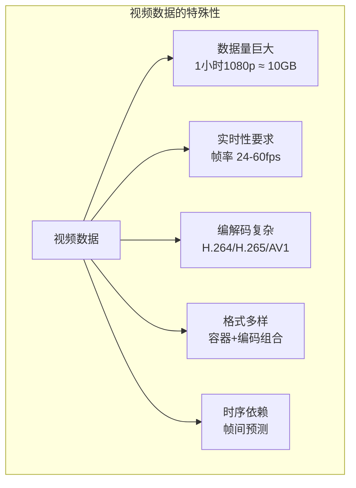
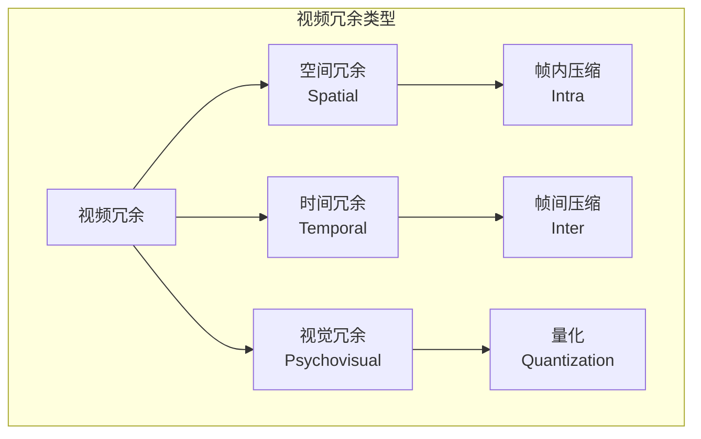
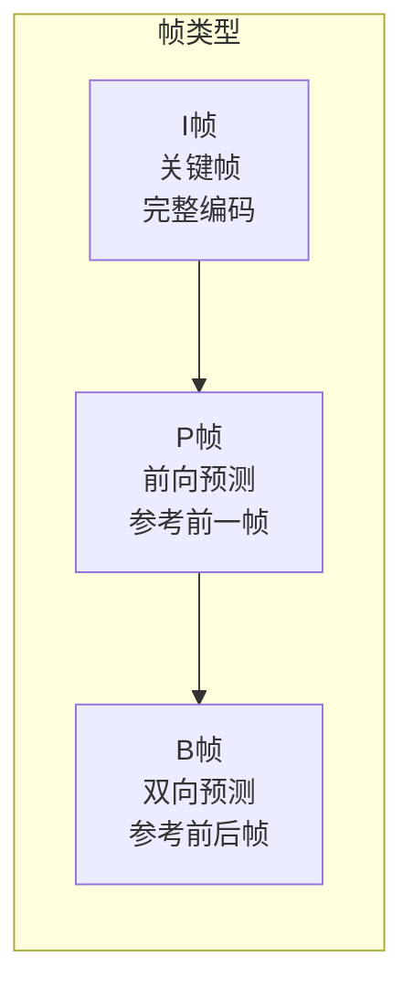
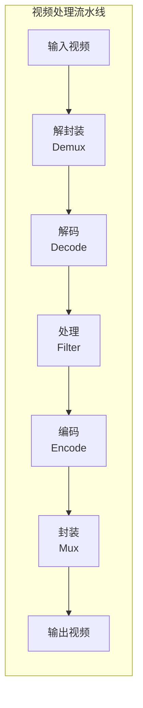
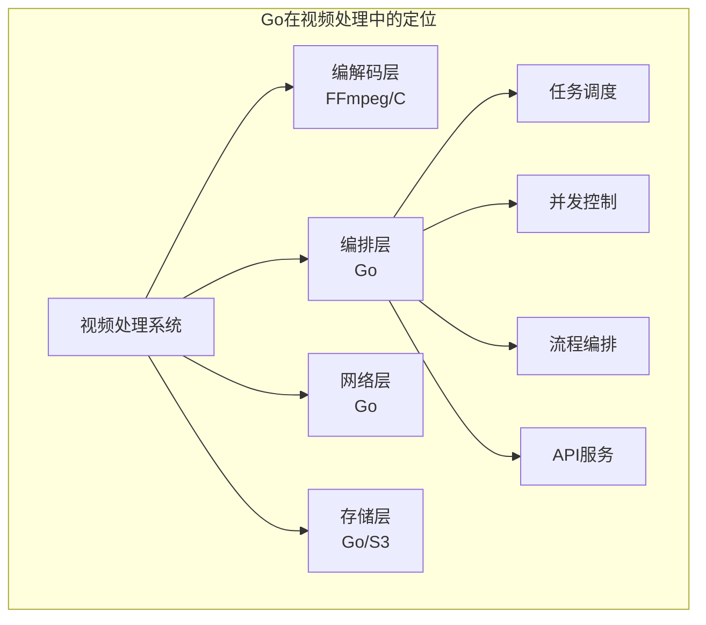
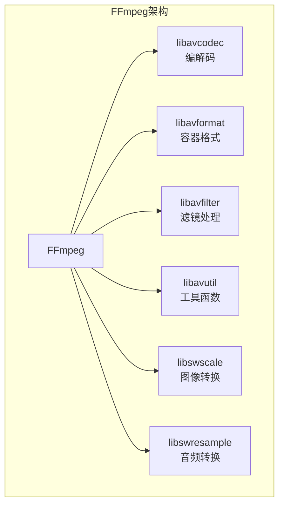
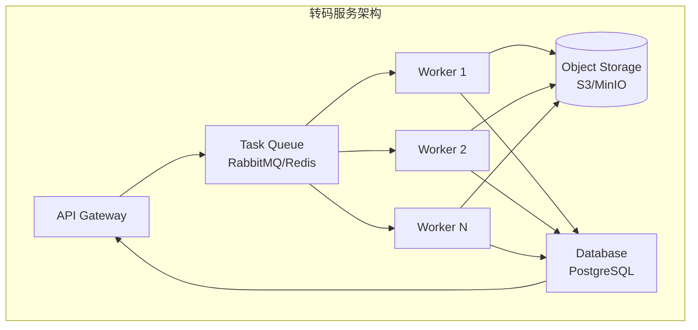
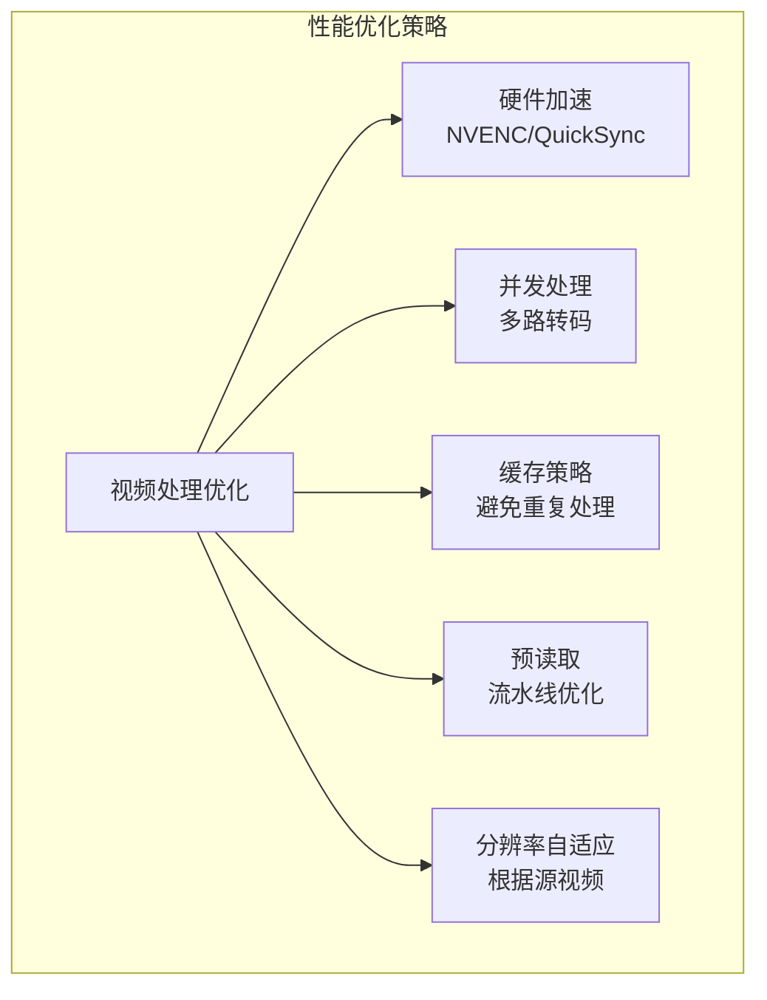

# Go 语言视频处理完全指南：从 FFmpeg 绑定到流媒体服务器的深度解析

> 为什么 Go 能成为视频处理领域的新宠？

---

## 写在前面

如果你是一名后端工程师，当需要构建一个视频转码服务时，你用什么技术栈？如果你是一名流媒体开发者，当需要开发一个低延迟的直播服务器时，你如何选择方案？如果你是一名 DevOps 工程师，当需要处理海量视频文件时，你如何设计架构？

传统上，视频处理是 C/C++ 的天下，FFmpeg 作为事实标准，几乎垄断了这个领域。但近年来，Go 语言凭借其出色的并发模型、简洁的语法和强大的标准库，正在视频处理领域崭露头角。

本文将从零开始，带你由浅入深地掌握 Go 语言视频处理的方方面面：从视频编码的基础原理，到 FFmpeg 的 Go 绑定，再到流媒体服务器的架构设计。读完这篇文章，你将理解为什么 Go 能在视频处理领域占有一席之地，以及如何用它构建高性能的视频处理系统。

---

## 第一篇：视频处理基础——为什么需要专门处理？

### 1.1 视频数据的特殊性

视频数据与其他数据类型有着本质的不同，理解这些差异是掌握视频处理的基础。



**视频数据的核心挑战：**

| 挑战 | 说明 | 影响 |
|------|------|------|
| **数据量巨大** | 原始视频数据量极大 | 必须压缩，需要编解码 |
| **实时性要求** | 播放不能卡顿 | 需要低延迟处理 |
| **计算密集** | 编解码算法复杂 | 需要硬件加速 |
| **格式多样** | 容器格式+编码格式组合 | 需要格式转换 |
| **时序依赖** | 帧间存在依赖关系 | 需要按序处理 |

### 1.2 视频编码原理

视频编码的核心是**去除冗余**。原始视频数据包含三种冗余：



**空间冗余（帧内压缩）：**

相邻像素通常相似。使用 DCT（离散余弦变换）将空间域转换到频域，然后量化高频分量。

**时间冗余（帧间压缩）：**

相邻帧通常相似。只编码帧间差异，使用运动估计和运动补偿。



**帧类型详解：**

| 帧类型 | 名称 | 压缩方式 | 大小 | 用途 |
|--------|------|----------|------|------|
| I 帧 | 关键帧（Intra） | 帧内压缩 | 大 | 随机访问点 |
| P 帧 | 预测帧（Predicted） | 前向预测 | 中 | 参考 I 或 P 帧 |
| B 帧 | 双向帧（Bi-directional） | 双向预测 | 小 | 参考前后帧 |

**GOP（Group of Pictures）结构：**

```
I-B-B-P-B-B-P-B-B-I-B-B-P...
|←——— GOP ———→|
```

### 1.3 视频处理流水线

典型的视频处理流程：



**各阶段说明：**

| 阶段 | 操作 | 说明 |
|------|------|------|
| Demux（解封装） | 从容器中提取编码流 | MP4 → H.264 + AAC |
| Decode（解码） | 将压缩数据还原为原始帧 | H.264 → YUV/RGB |
| Filter（处理） | 视频处理操作 | 缩放、裁剪、叠加 |
| Encode（编码） | 将原始帧压缩 | YUV → H.265 |
| Mux（封装） | 将编码流打包到容器 | H.265 + AAC → MKV |

### 1.4 Go 在视频处理中的定位

Go 不是视频编解码的最佳选择（C/C++ 才是），但它在视频处理的**编排层**表现出色：



**Go 的优势场景：**

| 场景 | Go 优势 | 示例 |
|------|---------|------|
| 任务调度 | 并发模型优秀 | 转码任务队列 |
| 网络服务 | 标准库强大 | HTTP API、RTMP 服务器 |
| 流程编排 | 语法简洁 | 视频处理流水线 |
| 工具开发 | 编译快速 | 视频分析工具 |

**Go 的劣势场景：**

| 场景 | 劣势 | 替代方案 |
|------|------|----------|
| 编解码 | 性能不足 | FFmpeg、硬件编码 |
| 像素处理 | 无 SIMD 优化 | OpenCV、C++ |
| 实时处理 | GC 延迟 | Rust、C++ |

---

## 第二篇：FFmpeg 与 Go 的集成

### 2.1 FFmpeg 简介

FFmpeg 是视频处理领域的事实标准，提供了完整的编解码、转码、流媒体解决方案。



**核心库功能：**

| 库 | 功能 | 用途 |
|-----|------|------|
| libavcodec | 编解码 | H.264/H.265/AV1 编码解码 |
| libavformat | 容器格式 | MP4/MKV/FLV 读写 |
| libavfilter | 滤镜 | 缩放、裁剪、叠加 |
| libavutil | 工具 | 内存管理、数学运算 |
| libswscale | 图像转换 | YUV/RGB 转换、缩放 |
| libswresample | 音频转换 | 采样率转换、格式转换 |

### 2.2 调用 FFmpeg 命令行

最简单的方式是通过 `os/exec` 调用 FFmpeg 命令行。

```go
package main

import (
    "fmt"
    "os"
    "os/exec"
    "strings"
)

// FFmpeg 命令执行器
type FFmpeg struct {
    Path string
}

func NewFFmpeg() *FFmpeg {
    return &FFmpeg{
        Path: "ffmpeg",
    }
}

// Transcode 转码视频
func (f *FFmpeg) Transcode(input, output string, options TranscodeOptions) error {
    args := []string{
        "-i", input,           // 输入文件
        "-c:v", options.VideoCodec,  // 视频编码器
        "-crf", fmt.Sprintf("%d", options.CRF),  // 质量
        "-preset", options.Preset,  // 编码速度预设
    }

    if options.Width > 0 && options.Height > 0 {
        args = append(args, "-s", fmt.Sprintf("%dx%d", options.Width, options.Height))
    }

    args = append(args, "-y", output)  // 覆盖输出文件

    cmd := exec.Command(f.Path, args...)
    cmd.Stdout = os.Stdout
    cmd.Stderr = os.Stderr

    return cmd.Run()
}

type TranscodeOptions struct {
    VideoCodec string
    CRF        int
    Preset     string
    Width      int
    Height     int
}

// 使用示例
func main() {
    ffmpeg := NewFFmpeg()

    err := ffmpeg.Transcode(
        "input.mp4",
        "output.mp4",
        TranscodeOptions{
            VideoCodec: "libx264",
            CRF:        23,
            Preset:     "medium",
            Width:      1920,
            Height:     1080,
        },
    )
    if err != nil {
        panic(err)
    }
}
```

### 2.3 使用 go-ffmpeg 库

社区提供了更友好的 FFmpeg 封装。

```go
import "github.com/u2takey/ffmpeg-go"

func transcodeWithLib(input, output string) error {
    return ffmpeg.Input(input).
        Output(output, ffmpeg.KwArgs{
            "c:v": "libx264",
            "crf": 23,
            "preset": "medium",
            "s": "1920x1080",
        }).
        OverWriteOutput().
        Run()
}

// 复杂滤镜链
func applyFilter(input, output string) error {
    return ffmpeg.Input(input).
        Filter("scale", ffmpeg.Args{"1280:720"}).
        Filter("fps", ffmpeg.Args{"30"}).
        Output(output, ffmpeg.KwArgs{
            "c:v": "libx264",
            "crf": 23,
        }).
        Run()
}
```

### 2.4 CGO 绑定 FFmpeg

对于性能敏感的场景，可以使用 CGO 直接调用 FFmpeg 库。

```go
package ffmpeg

/*
#cgo pkg-config: libavcodec libavformat libavutil libswscale
#include <libavcodec/avcodec.h>
#include <libavformat/avformat.h>
#include <libavutil/avutil.h>
#include <libswscale/swscale.h>
*/
import "C"
import (
    "fmt"
    "unsafe"
)

// Decoder FFmpeg 解码器封装
type Decoder struct {
    ctx       *C.AVCodecContext
    codec     *C.AVCodec
    frame     *C.AVFrame
    packet    *C.AVPacket
}

// NewDecoder 创建解码器
func NewDecoder(codecID int) (*Decoder, error) {
    codec := C.avcodec_find_decoder(C.enum_AVCodecID(codecID))
    if codec == nil {
        return nil, fmt.Errorf("codec not found")
    }

    ctx := C.avcodec_alloc_context3(codec)
    if ctx == nil {
        return nil, fmt.Errorf("failed to allocate codec context")
    }

    if C.avcodec_open2(ctx, codec, nil) < 0 {
        C.avcodec_free_context(&ctx)
        return nil, fmt.Errorf("failed to open codec")
    }

    frame := C.av_frame_alloc()
    packet := C.av_packet_alloc()

    return &Decoder{
        ctx:    ctx,
        codec:  codec,
        frame:  frame,
        packet: packet,
    }, nil
}

// Decode 解码数据
func (d *Decoder) Decode(data []byte) (*Frame, error) {
    d.packet.data = (*C.uint8_t)(C.CBytes(data))
    d.packet.size = C.int(len(data))
    defer C.free(unsafe.Pointer(d.packet.data))

    ret := C.avcodec_send_packet(d.ctx, d.packet)
    if ret < 0 {
        return nil, fmt.Errorf("error sending packet: %d", ret)
    }

    ret = C.avcodec_receive_frame(d.ctx, d.frame)
    if ret < 0 {
        return nil, fmt.Errorf("error receiving frame: %d", ret)
    }

    return &Frame{
        Width:  int(d.frame.width),
        Height: int(d.frame.height),
        Data:   d.frame.data,
    }, nil
}

// Close 释放资源
func (d *Decoder) Close() {
    C.av_packet_free(&d.packet)
    C.av_frame_free(&d.frame)
    C.avcodec_free_context(&d.ctx)
}

type Frame struct {
    Width  int
    Height int
    Data   [8]*C.uint8_t
}
```

### 2.5 纯 Go 视频解码

对于特定格式，可以使用纯 Go 实现。

```go
// 使用 github.com/pion/mediadevices 进行视频捕获
import "github.com/pion/mediadevices"
import "github.com/pion/mediadevices/pkg/codec/x264"

func captureAndEncode() {
    // 获取摄像头
    devices := mediadevices.EnumerateDevices()

    // 配置编码器
    params := x264.Params{
        BitRate:      1_000_000, // 1 Mbps
        KeyFrameInterval: 60,
    }

    codec, err := params.BuildVideoEncoder()
    if err != nil {
        panic(err)
    }

    // 编码帧
    frame := getFrameFromCamera()
    encoded, err := codec.Encode(frame)
    if err != nil {
        panic(err)
    }

    // 使用编码后的数据
    _ = encoded
}
```

---

## 第三篇：视频信息解析

### 3.1 使用 ffprobe 获取视频信息

ffprobe 是 FFmpeg 的配套工具，用于分析视频文件。

```go
package main

import (
    "encoding/json"
    "fmt"
    "os/exec"
)

// VideoInfo 视频信息
type VideoInfo struct {
    Format  Format   `json:"format"`
    Streams []Stream `json:"streams"`
}

type Format struct {
    Filename       string `json:"filename"`
    FormatName     string `json:"format_name"`
    Duration       string `json:"duration"`
    Size           string `json:"size"`
    BitRate        string `json:"bit_rate"`
}

type Stream struct {
    Index          int    `json:"index"`
    CodecName      string `json:"codec_name"`
    CodecType      string `json:"codec_type"`
    Width          int    `json:"width,omitempty"`
    Height         int    `json:"height,omitempty"`
    PixFmt         string `json:"pix_fmt,omitempty"`
    SampleRate     string `json:"sample_rate,omitempty"`
    Channels       int    `json:"channels,omitempty"`
}

// ProbeVideo 分析视频文件
func ProbeVideo(filename string) (*VideoInfo, error) {
    cmd := exec.Command("ffprobe",
        "-v", "error",
        "-print_format", "json",
        "-show_format",
        "-show_streams",
        filename,
    )

    output, err := cmd.Output()
    if err != nil {
        return nil, fmt.Errorf("ffprobe failed: %w", err)
    }

    var info VideoInfo
    if err := json.Unmarshal(output, &info); err != nil {
        return nil, fmt.Errorf("failed to parse ffprobe output: %w", err)
    }

    return &info, nil
}

// 使用示例
func main() {
    info, err := ProbeVideo("input.mp4")
    if err != nil {
        panic(err)
    }

    fmt.Printf("文件: %s\n", info.Format.Filename)
    fmt.Printf("格式: %s\n", info.Format.FormatName)
    fmt.Printf("时长: %s\n", info.Format.Duration)
    fmt.Printf("大小: %s bytes\n", info.Format.Size)

    for _, stream := range info.Streams {
        if stream.CodecType == "video" {
            fmt.Printf("视频流: %dx%d, %s\n", stream.Width, stream.Height, stream.CodecName)
        } else if stream.CodecType == "audio" {
            fmt.Printf("音频流: %s, %d channels\n", stream.CodecName, stream.Channels)
        }
    }
}
```

### 3.2 解析视频流结构

```go
// StreamAnalyzer 视频流分析器
type StreamAnalyzer struct{}

// AnalyzeKeyframes 分析关键帧位置
func (a *StreamAnalyzer) AnalyzeKeyframes(filename string) ([]Keyframe, error) {
    cmd := exec.Command("ffprobe",
        "-v", "error",
        "-select_streams", "v:0",
        "-show_entries", "frame=pkt_pts_time,pict_type",
        "-of", "csv=p=0",
        filename,
    )

    output, err := cmd.Output()
    if err != nil {
        return nil, err
    }

    var keyframes []Keyframe
    lines := strings.Split(string(output), "\n")
    for _, line := range lines {
        parts := strings.Split(line, ",")
        if len(parts) >= 2 && parts[1] == "I" {
            pts, _ := strconv.ParseFloat(parts[0], 64)
            keyframes = append(keyframes, Keyframe{
                Timestamp: pts,
                Position:  0, // 可以从其他命令获取
            })
        }
    }

    return keyframes, nil
}

type Keyframe struct {
    Timestamp float64
    Position  int64
}

// DetectSceneChanges 检测场景变化
func (a *StreamAnalyzer) DetectSceneChanges(filename string, threshold float64) ([]SceneChange, error) {
    filter := fmt.Sprintf("select='gt(scene,%f)',showinfo", threshold)

    cmd := exec.Command("ffmpeg",
        "-i", filename,
        "-vf", filter,
        "-f", "null",
        "-",
    )

    output, err := cmd.CombinedOutput()
    if err != nil && !strings.Contains(string(output), "Conversion failed") {
        return nil, err
    }

    // 解析输出提取场景变化时间点
    var changes []SceneChange
    // ... 解析逻辑

    return changes, nil
}

type SceneChange struct {
    Timestamp float64
    FrameNum  int
}
```

---

## 第四篇：视频转码服务架构

### 4.1 转码任务队列设计



### 4.2 任务定义与队列

```go
package transcode

import (
    "context"
    "encoding/json"
    "time"

    "github.com/hibiken/asynq"
)

// TaskType 任务类型
const (
    TypeTranscode = "video:transcode"
    TypeExtract   = "video:extract"
    TypeThumbnail = "video:thumbnail"
)

// TranscodePayload 转码任务负载
type TranscodePayload struct {
    JobID        string            `json:"job_id"`
    InputURL     string            `json:"input_url"`
    OutputURL    string            `json:"output_url"`
    Profile      TranscodeProfile  `json:"profile"`
    CallbackURL  string            `json:"callback_url,omitempty"`
    Metadata     map[string]string `json:"metadata,omitempty"`
}

type TranscodeProfile struct {
    Format       string `json:"format"`        // mp4, webm, etc.
    VideoCodec   string `json:"video_codec"`   // libx264, libx265
    AudioCodec   string `json:"audio_codec"`   // aac, opus
    Resolution   string `json:"resolution"`    // 1920x1080
    VideoBitrate int    `json:"video_bitrate"` // kbps
    AudioBitrate int    `json:"audio_bitrate"` // kbps
    FrameRate    int    `json:"frame_rate"`
}

// NewTranscodeTask 创建转码任务
func NewTranscodeTask(payload TranscodePayload) (*asynq.Task, error) {
    data, err := json.Marshal(payload)
    if err != nil {
        return nil, err
    }

    return asynq.NewTask(TypeTranscode, data,
        asynq.MaxRetry(3),
        asynq.Timeout(2*time.Hour),
        asynq.Queue("transcode"),
    ), nil
}

// TaskProcessor 任务处理器
type TaskProcessor struct {
    ffmpeg *FFmpeg
    store  Storage
}

func (p *TaskProcessor) ProcessTask(ctx context.Context, t *asynq.Task) error {
    switch t.Type() {
    case TypeTranscode:
        return p.processTranscode(ctx, t)
    case TypeExtract:
        return p.processExtract(ctx, t)
    case TypeThumbnail:
        return p.processThumbnail(ctx, t)
    default:
        return fmt.Errorf("unknown task type: %s", t.Type())
    }
}

func (p *TaskProcessor) processTranscode(ctx context.Context, t *asynq.Task) error {
    var payload TranscodePayload
    if err := json.Unmarshal(t.Payload(), &payload); err != nil {
        return err
    }

    // 更新任务状态
    p.updateJobStatus(payload.JobID, "processing", 0)

    // 下载输入文件
    inputPath, err := p.store.Download(ctx, payload.InputURL)
    if err != nil {
        p.updateJobStatus(payload.JobID, "failed", 0)
        return err
    }
    defer os.Remove(inputPath)

    outputPath := filepath.Join(os.TempDir(), payload.JobID+"."+payload.Profile.Format)

    // 执行转码
    progress := make(chan float64)
    go func() {
        for p := range progress {
            p.updateJobStatus(payload.JobID, "processing", int(p))
        }
    }()

    err = p.ffmpeg.TranscodeWithProgress(ctx, TranscodeOptions{
        Input:   inputPath,
        Output:  outputPath,
        Profile: payload.Profile,
        Progress: progress,
    })

    if err != nil {
        p.updateJobStatus(payload.JobID, "failed", 0)
        return err
    }

    // 上传输出文件
    if err := p.store.Upload(ctx, outputPath, payload.OutputURL); err != nil {
        p.updateJobStatus(payload.JobID, "failed", 0)
        return err
    }

    // 清理临时文件
    os.Remove(outputPath)

    // 更新任务完成
    p.updateJobStatus(payload.JobID, "completed", 100)

    // 发送回调
    if payload.CallbackURL != "" {
        p.sendCallback(payload.CallbackURL, payload.JobID, "completed")
    }

    return nil
}

func (p *TaskProcessor) updateJobStatus(jobID, status string, progress int) {
    // 更新数据库
}
```

### 4.3 转码进度监控

```go
// FFmpeg 带进度监控的转码
func (f *FFmpeg) TranscodeWithProgress(ctx context.Context, opts TranscodeOptions) error {
    // 创建 progress pipe
    progressPipe := filepath.Join(os.TempDir(), "ffmpeg-progress-"+uuid.New().String())
    if err := syscall.Mkfifo(progressPipe, 0644); err != nil {
        return err
    }
    defer os.Remove(progressPipe)

    // 构建命令
    args := []string{
        "-i", opts.Input,
        "-c:v", opts.Profile.VideoCodec,
        "-b:v", fmt.Sprintf("%dk", opts.Profile.VideoBitrate),
        "-c:a", opts.Profile.AudioCodec,
        "-b:a", fmt.Sprintf("%dk", opts.Profile.AudioBitrate),
        "-progress", progressPipe,
        "-y", opts.Output,
    }

    cmd := exec.CommandContext(ctx, f.Path, args...)

    // 启动进度读取 goroutine
    done := make(chan error)
    go func() {
        file, err := os.Open(progressPipe)
        if err != nil {
            done <- err
            return
        }
        defer file.Close()

        scanner := bufio.NewScanner(file)
        var duration float64
        var currentTime float64

        for scanner.Scan() {
            line := scanner.Text()
            parts := strings.SplitN(line, "=", 2)
            if len(parts) != 2 {
                continue
            }

            key, value := parts[0], parts[1]
            switch key {
            case "Duration":
                duration = parseDuration(value)
            case "out_time_ms":
                ms, _ := strconv.ParseFloat(value, 64)
                currentTime = ms / 1000000
                if duration > 0 && opts.Progress != nil {
                    progress := (currentTime / duration) * 100
                    opts.Progress <- progress
                }
            }
        }
        done <- nil
    }()

    // 执行命令
    if err := cmd.Run(); err != nil {
        return err
    }

    return <-done
}
```

### 4.4 自适应码率（ABR）生成

```go
// ABRGenerator 自适应码率生成器
type ABRGenerator struct {
    ffmpeg *FFmpeg
    store  Storage
}

// Preset 预设配置
var Presets = []TranscodeProfile{
    {
        Format:       "mp4",
        VideoCodec:   "libx264",
        AudioCodec:   "aac",
        Resolution:   "1920x1080",
        VideoBitrate: 5000,
        AudioBitrate: 128,
        FrameRate:    30,
    },
    {
        Format:       "mp4",
        VideoCodec:   "libx264",
        AudioCodec:   "aac",
        Resolution:   "1280x720",
        VideoBitrate: 2500,
        AudioBitrate: 128,
        FrameRate:    30,
    },
    {
        Format:       "mp4",
        VideoCodec:   "libx264",
        AudioCodec:   "aac",
        Resolution:   "854x480",
        VideoBitrate: 1000,
        AudioBitrate: 128,
        FrameRate:    30,
    },
    {
        Format:       "mp4",
        VideoCodec:   "libx264",
        AudioCodec:   "aac",
        Resolution:   "640x360",
        VideoBitrate: 500,
        AudioBitrate: 128,
        FrameRate:    30,
    },
}

// GenerateABR 生成多码率版本
func (g *ABRGenerator) GenerateABR(ctx context.Context, input string, outputPrefix string) ([]string, error) {
    var outputs []string
    errChan := make(chan error, len(Presets))
    resultChan := make(chan string, len(Presets))

    // 并行生成各码率版本
    var wg sync.WaitGroup
    for _, preset := range Presets {
        wg.Add(1)
        go func(p TranscodeProfile) {
            defer wg.Done()

            output := fmt.Sprintf("%s_%s.%s", outputPrefix, p.Resolution, p.Format)
            err := g.ffmpeg.Transcode(ctx, input, output, p)
            if err != nil {
                errChan <- err
                return
            }
            resultChan <- output
        }(preset)
    }

    // 等待所有转码完成
    go func() {
        wg.Wait()
        close(errChan)
        close(resultChan)
    }()

    // 收集结果
    for output := range resultChan {
        outputs = append(outputs, output)
    }

    // 检查错误
    select {
    case err := <-errChan:
        if err != nil {
            return nil, err
        }
    default:
    }

    return outputs, nil
}

// GenerateHLS 生成 HLS 流媒体
func (g *ABRGenerator) GenerateHLS(ctx context.Context, input string, outputDir string) error {
    // 生成各码率版本
    variants, err := g.GenerateABR(ctx, input, filepath.Join(outputDir, "video"))
    if err != nil {
        return err
    }

    // 生成 HLS playlist
    masterPlaylist := &m3u8.MasterPlaylist{}

    for i, variant := range variants {
        preset := Presets[i]

        // 生成 segment playlist
        segmentPlaylist, err := g.generateSegments(ctx, variant, filepath.Join(outputDir, fmt.Sprintf("%dp", preset.VideoBitrate)))
        if err != nil {
            return err
        }

        // 添加到 master playlist
        masterPlaylist.Append(
            segmentPlaylist.Encode().String(),
            m3u8.VariantParams{
                Bandwidth:  uint32(preset.VideoBitrate * 1000),
                Resolution: preset.Resolution,
            },
        )
    }

    // 保存 master playlist
    masterPath := filepath.Join(outputDir, "master.m3u8")
    return os.WriteFile(masterPath, masterPlaylist.Encode().Bytes(), 0644)
}
```

---

## 第五篇：流媒体服务器开发

### 5.1 RTMP 服务器

RTMP（Real-Time Messaging Protocol）是直播领域的主流协议。

```go
package rtmp

import (
    "bufio"
    "encoding/binary"
    "fmt"
    "io"
    "net"
)

// Server RTMP 服务器
type Server struct {
    addr     string
    handler  Handler
    listener net.Listener
}

type Handler interface {
    OnConnect(conn *Conn)
    OnPublish(conn *Conn, streamKey string)
    OnPlay(conn *Conn, streamKey string)
    OnClose(conn *Conn)
}

// Conn RTMP 连接
type Conn struct {
    net.Conn
    reader *bufio.Reader
    writer *bufio.Writer

    // RTMP 状态
    state      int
    streamID   uint32
    chunkSize  uint32
    windowSize uint32

    // 流信息
    app        string
    streamKey  string
}

// 启动服务器
func (s *Server) ListenAndServe() error {
    ln, err := net.Listen("tcp", s.addr)
    if err != nil {
        return err
    }
    s.listener = ln

    for {
        conn, err := ln.Accept()
        if err != nil {
            continue
        }

        go s.handleConn(conn)
    }
}

func (s *Server) handleConn(netConn net.Conn) {
    conn := &Conn{
        Conn:      netConn,
        reader:    bufio.NewReader(netConn),
        writer:    bufio.NewWriter(netConn),
        chunkSize: 128,
    }

    defer func() {
        s.handler.OnClose(conn)
        conn.Close()
    }()

    // 握手
    if err := conn.handshake(); err != nil {
        return
    }

    s.handler.OnConnect(conn)

    // 处理消息
    for {
        msg, err := conn.readMessage()
        if err != nil {
            return
        }

        if err := s.handleMessage(conn, msg); err != nil {
            return
        }
    }
}

// RTMP 握手
func (c *Conn) handshake() error {
    // C0/S0: 版本号 (1 byte)
    // C1/S1: 时间戳 + 零 + 随机数据 (1536 bytes)
    // C2/S2: 时间戳回应 (1536 bytes)

    // 读取 C0
    version, err := c.reader.ReadByte()
    if err != nil || version != 3 {
        return fmt.Errorf("invalid version")
    }

    // 读取 C1
    c1 := make([]byte, 1536)
    if _, err := io.ReadFull(c.reader, c1); err != nil {
        return err
    }

    // 发送 S0
    c.writer.WriteByte(3)

    // 发送 S1
    s1 := make([]byte, 1536)
    binary.BigEndian.PutUint32(s1[0:4], 0) // 时间戳
    copy(s1[8:], c1[8:])                    // 复制 C1 的随机数据
    c.writer.Write(s1)

    // 发送 S2 (C1 的回应)
    c.writer.Write(c1)
    c.writer.Flush()

    // 读取 C2
    c2 := make([]byte, 1536)
    _, err = io.ReadFull(c.reader, c2)
    return err
}

// 消息类型
const (
    MsgTypeSetChunkSize   = 1
    MsgTypeAbort          = 2
    MsgTypeAck            = 3
    MsgTypeUserControl    = 4
    MsgTypeWindowAckSize  = 5
    MsgTypeSetPeerBandwidth = 6
    MsgTypeAudio          = 8
    MsgTypeVideo          = 9
    MsgTypeDataAMF3       = 15
    MsgTypeSharedObjectAMF3 = 16
    MsgTypeCommandAMF3    = 17
    MsgTypeDataAMF0       = 18
    MsgTypeSharedObjectAMF0 = 19
    MsgTypeCommandAMF0    = 20
    MsgTypeAggregate      = 22
)

type Message struct {
    TypeID    uint8
    StreamID  uint32
    Timestamp uint32
    Data      []byte
}

// 读取 RTMP 消息
func (c *Conn) readMessage() (*Message, error) {
    // 读取 chunk basic header
    b, err := c.reader.ReadByte()
    if err != nil {
        return nil, err
    }

    fmt := b >> 6
    csid := uint32(b & 0x3f)

    // 处理扩展 chunk stream ID
    if csid == 0 {
        b, _ := c.reader.ReadByte()
        csid = uint32(b) + 64
    } else if csid == 1 {
        b1, _ := c.reader.ReadByte()
        b2, _ := c.reader.ReadByte()
        csid = uint32(b1) + uint32(b2)*256 + 64
    }

    // 根据 fmt 读取 message header
    var msg Message
    switch fmt {
    case 0: // 11 bytes
        msg.Timestamp = readUint24(c.reader)
        msgLen := readUint24(c.reader)
        msg.TypeID, _ = c.reader.ReadByte()
        msg.StreamID = readUint32LE(c.reader)

        if msg.Timestamp == 0xffffff {
            msg.Timestamp = binary.BigEndian.Uint32(readBytes(c.reader, 4))
        }

        // 读取 payload
        msg.Data = make([]byte, msgLen)
        _, err = io.ReadFull(c.reader, msg.Data)

    case 1: // 7 bytes
        // ... 类似处理
    case 2: // 3 bytes
        // ... 类似处理
    case 3: // 0 bytes (使用之前的 header)
        // ... 类似处理
    }

    return &msg, err
}
```

### 5.2 HLS 服务器

HLS（HTTP Live Streaming）是 Apple 提出的流媒体协议，基于 HTTP。

```go
package hls

import (
    "fmt"
    "net/http"
    "os"
    "path/filepath"
    "strconv"
    "strings"
    "time"

    "github.com/gin-gonic/gin"
)

// Server HLS 服务器
type Server struct {
    contentDir string
    streams    map[string]*Stream
}

type Stream struct {
    ID        string
    Name      string
    CreatedAt time.Time
    Segments  []Segment
}

type Segment struct {
    Index     int
    Duration  float64
    Filename  string
}

// 创建 HLS 服务器
func NewServer(contentDir string) *Server {
    return &Server{
        contentDir: contentDir,
        streams:    make(map[string]*Stream),
    }
}

// SetupRoutes 设置路由
func (s *Server) SetupRoutes(r *gin.Engine) {
    hls := r.Group("/hls")
    {
        hls.GET("/:streamID/master.m3u8", s.handleMasterPlaylist)
        hls.GET("/:streamID/:quality/playlist.m3u8", s.handleMediaPlaylist)
        hls.GET("/:streamID/:quality/:segment", s.handleSegment)
    }
}

// Master Playlist 处理
func (s *Server) handleMasterPlaylist(c *gin.Context) {
    streamID := c.Param("streamID")

    playlist := `#EXTM3U
#EXT-X-VERSION:3

#EXT-X-STREAM-INF:BANDWIDTH=5000000,RESOLUTION=1920x1080
1080p/playlist.m3u8

#EXT-X-STREAM-INF:BANDWIDTH=2500000,RESOLUTION=1280x720
720p/playlist.m3u8

#EXT-X-STREAM-INF:BANDWIDTH=1000000,RESOLUTION=854x480
480p/playlist.m3u8
`
    c.Header("Content-Type", "application/vnd.apple.mpegurl")
    c.Header("Cache-Control", "no-cache")
    c.String(http.StatusOK, playlist)
}

// Media Playlist 处理
func (s *Server) handleMediaPlaylist(c *gin.Context) {
    streamID := c.Param("streamID")
    quality := c.Param("quality")

    stream, exists := s.streams[streamID]
    if !exists {
        c.String(http.StatusNotFound, "Stream not found")
        return
    }

    var builder strings.Builder
    builder.WriteString("#EXTM3U\n")
    builder.WriteString("#EXT-X-VERSION:3\n")
    builder.WriteString("#EXT-X-TARGETDURATION:6\n")
    builder.WriteString(fmt.Sprintf("#EXT-X-MEDIA-SEQUENCE:%d\n", len(stream.Segments)))

    for _, seg := range stream.Segments {
        builder.WriteString(fmt.Sprintf("#EXTINF:%.3f,\n", seg.Duration))
        builder.WriteString(fmt.Sprintf("segment_%d.ts\n", seg.Index))
    }

    c.Header("Content-Type", "application/vnd.apple.mpegurl")
    c.Header("Cache-Control", "no-cache")
    c.String(http.StatusOK, builder.String())
}

// Segment 处理
func (s *Server) handleSegment(c *gin.Context) {
    streamID := c.Param("streamID")
    quality := c.Param("quality")
    segment := c.Param("segment")

    path := filepath.Join(s.contentDir, streamID, quality, segment)

    // 检查文件是否存在
    if _, err := os.Stat(path); os.IsNotExist(err) {
        c.String(http.StatusNotFound, "Segment not found")
        return
    }

    c.Header("Content-Type", "video/mp2t")
    c.Header("Cache-Control", "max-age=31536000")
    c.File(path)
}

// LivePlaylist 实时直播 playlist（滑动窗口）
func (s *Server) generateLivePlaylist(stream *Stream, windowSize int) string {
    var builder strings.Builder
    builder.WriteString("#EXTM3U\n")
    builder.WriteString("#EXT-X-VERSION:3\n")
    builder.WriteString("#EXT-X-TARGETDURATION:6\n")
    builder.WriteString("#EXT-X-MEDIA-SEQUENCE:0\n")

    // 只保留最近 windowSize 个 segment
    start := 0
    if len(stream.Segments) > windowSize {
        start = len(stream.Segments) - windowSize
    }

    for i := start; i < len(stream.Segments); i++ {
        seg := stream.Segments[i]
        builder.WriteString(fmt.Sprintf("#EXTINF:%.3f,\n", seg.Duration))
        builder.WriteString(fmt.Sprintf("segment_%d.ts\n", seg.Index))
    }

    return builder.String()
}
```

### 5.3 WebRTC 服务器

WebRTC 是浏览器原生支持的实时通信协议。

```go
package webrtc

import (
    "github.com/pion/webrtc/v3"
    "github.com/pion/webrtc/v3/pkg/media"
)

// Server WebRTC 服务器
type Server struct {
    api *webrtc.API
}

// NewServer 创建 WebRTC 服务器
func NewServer() *Server {
    // 配置媒体引擎
    m := &webrtc.MediaEngine{}
    m.RegisterCodec(webrtc.RTPCodecParameters{
        RTPCodecCapability: webrtc.RTPCodecCapability{
            MimeType:  webrtc.MimeTypeH264,
            ClockRate: 90000,
        },
        PayloadType: 96,
    }, webrtc.RTPCodecTypeVideo)

    m.RegisterCodec(webrtc.RTPCodecParameters{
        RTPCodecCapability: webrtc.RTPCodecCapability{
            MimeType:  webrtc.MimeTypeOpus,
            ClockRate: 48000,
            Channels:  2,
        },
        PayloadType: 111,
    }, webrtc.RTPCodecTypeAudio)

    api := webrtc.NewAPI(webrtc.WithMediaEngine(m))

    return &Server{api: api}
}

// CreatePublisher 创建发布者（推流）
func (s *Server) CreatePublisher(offer webrtc.SessionDescription) (*Publisher, error) {
    config := webrtc.Configuration{
        ICEServers: []webrtc.ICEServer{
            {URLs: []string{"stun:stun.l.google.com:19302"}},
        },
    }

    pc, err := s.api.NewPeerConnection(config)
    if err != nil {
        return nil, err
    }

    publisher := &Publisher{
        pc:     pc,
        tracks: make(map[string]*webrtc.TrackRemote),
    }

    // 设置远端描述
    if err := pc.SetRemoteDescription(offer); err != nil {
        return nil, err
    }

    // 处理 track
    pc.OnTrack(func(track *webrtc.TrackRemote, receiver *webrtc.RTPReceiver) {
        publisher.tracks[track.ID()] = track

        // 读取 RTP 包
        go func() {
            for {
                rtpPacket, _, err := track.ReadRTP()
                if err != nil {
                    return
                }

                // 处理 RTP 包（转发给订阅者）
                publisher.handleRTP(track.ID(), rtpPacket)
            }
        }()
    })

    // 创建应答
    answer, err := pc.CreateAnswer(nil)
    if err != nil {
        return nil, err
    }

    if err := pc.SetLocalDescription(answer); err != nil {
        return nil, err
    }

    publisher.answer = answer
    return publisher, nil
}

type Publisher struct {
    pc     *webrtc.PeerConnection
    tracks map[string]*webrtc.TrackRemote
    answer webrtc.SessionDescription
}

func (p *Publisher) handleRTP(trackID string, packet *rtp.Packet) {
    // 转发给订阅者
}

// CreateSubscriber 创建订阅者（拉流）
func (s *Server) CreateSubscriber(publisher *Publisher, offer webrtc.SessionDescription) (*Subscriber, error) {
    config := webrtc.Configuration{
        ICEServers: []webrtc.ICEServer{
            {URLs: []string{"stun:stun.l.google.com:19302"}},
        },
    }

    pc, err := s.api.NewPeerConnection(config)
    if err != nil {
        return nil, err
    }

    // 从 publisher 复制 track
    for trackID, remoteTrack := range publisher.tracks {
        localTrack, err := webrtc.NewTrackLocalStaticRTP(
            webrtc.RTPCodecCapability{MimeType: remoteTrack.Codec().MimeType},
            trackID,
            "stream",
        )
        if err != nil {
            return nil, err
        }

        _, err = pc.AddTrack(localTrack)
        if err != nil {
            return nil, err
        }

        // 转发 RTP 包
        go func(rt *webrtc.TrackRemote, lt *webrtc.TrackLocalStaticRTP) {
            for {
                rtpPacket, _, err := rt.ReadRTP()
                if err != nil {
                    return
                }
                lt.WriteRTP(rtpPacket)
            }
        }(remoteTrack, localTrack)
    }

    // 设置远端描述
    if err := pc.SetRemoteDescription(offer); err != nil {
        return nil, err
    }

    // 创建应答
    answer, err := pc.CreateAnswer(nil)
    if err != nil {
        return nil, err
    }

    if err := pc.SetLocalDescription(answer); err != nil {
        return nil, err
    }

    return &Subscriber{
        pc:     pc,
        answer: answer,
    }, nil
}

type Subscriber struct {
    pc     *webrtc.PeerConnection
    answer webrtc.SessionDescription
}
```

---

## 第六篇：视频处理最佳实践

### 6.1 性能优化



**硬件加速：**

```go
// 使用 NVENC（NVIDIA GPU 编码）
func (f *FFmpeg) TranscodeWithHardware(input, output string) error {
    args := []string{
        "-i", input,
        "-c:v", "h264_nvenc",  // NVIDIA 硬件编码
        "-preset", "fast",
        "-c:a", "copy",
        "-y", output,
    }

    cmd := exec.Command(f.Path, args...)
    return cmd.Run()
}

// 使用 QuickSync（Intel GPU 编码）
func (f *FFmpeg) TranscodeWithQuickSync(input, output string) error {
    args := []string{
        "-i", input,
        "-c:v", "h264_qsv",  // Intel QuickSync
        "-preset", "fast",
        "-c:a", "copy",
        "-y", output,
    }

    cmd := exec.Command(f.Path, args...)
    return cmd.Run()
}
```

**并发控制：**

```go
type TranscodePool struct {
    workers int
    sem     chan struct{}
}

func NewTranscodePool(workers int) *TranscodePool {
    return &TranscodePool{
        workers: workers,
        sem:     make(chan struct{}, workers),
    }
}

func (p *TranscodePool) Submit(ctx context.Context, task func() error) error {
    select {
    case p.sem <- struct{}{}:
        defer func() { <-p.sem }()
        return task()
    case <-ctx.Done():
        return ctx.Err()
    }
}
```

### 6.2 错误处理与重试

```go
type TranscodeResult struct {
    OutputPath string
    Duration   time.Duration
    Error      error
}

func (s *TranscodeService) TranscodeWithRetry(ctx context.Context, input, output string, maxRetries int) (*TranscodeResult, error) {
    var lastErr error

    for attempt := 0; attempt <= maxRetries; attempt++ {
        if attempt > 0 {
            // 指数退避
            backoff := time.Duration(attempt*attempt) * time.Second
            select {
            case <-time.After(backoff):
            case <-ctx.Done():
                return nil, ctx.Err()
            }
        }

        result := s.transcodeOnce(ctx, input, output)
        if result.Error == nil {
            return result, nil
        }

        lastErr = result.Error

        // 判断是否应该重试
        if !isRetryableError(result.Error) {
            return nil, result.Error
        }
    }

    return nil, fmt.Errorf("transcode failed after %d attempts: %w", maxRetries, lastErr)
}

func isRetryableError(err error) bool {
    if err == nil {
        return false
    }

    // 可重试的错误
    retryableErrors := []string{
        "connection refused",
        "timeout",
        "temporary",
    }

    errStr := err.Error()
    for _, retryable := range retryableErrors {
        if strings.Contains(errStr, retryable) {
            return true
        }
    }

    return false
}
```

### 6.3 监控与日志

```go
type Metrics struct {
    transcodeTotal    prometheus.Counter
    transcodeDuration prometheus.Histogram
    transcodeErrors   prometheus.Counter
    activeJobs        prometheus.Gauge
}

func NewMetrics() *Metrics {
    return &Metrics{
        transcodeTotal: prometheus.NewCounter(prometheus.CounterOpts{
            Name: "video_transcode_total",
            Help: "Total number of transcode jobs",
        }),
        transcodeDuration: prometheus.NewHistogram(prometheus.HistogramOpts{
            Name:    "video_transcode_duration_seconds",
            Help:    "Transcode duration in seconds",
            Buckets: prometheus.DefBuckets,
        }),
        transcodeErrors: prometheus.NewCounter(prometheus.CounterOpts{
            Name: "video_transcode_errors_total",
            Help: "Total number of transcode errors",
        }),
        activeJobs: prometheus.NewGauge(prometheus.GaugeOpts{
            Name: "video_transcode_active_jobs",
            Help: "Number of active transcode jobs",
        }),
    }
}

func (m *Metrics) RecordTranscode(duration time.Duration, err error) {
    m.transcodeTotal.Inc()
    m.transcodeDuration.Observe(duration.Seconds())

    if err != nil {
        m.transcodeErrors.Inc()
    }
}
```

---

## 附录：速查手册

### A. FFmpeg 常用命令

| 操作 | 命令 |
|------|------|
| 转码 | `ffmpeg -i input.mp4 -c:v libx264 -crf 23 output.mp4` |
| 提取音频 | `ffmpeg -i input.mp4 -vn -c:a copy output.aac` |
| 提取视频 | `ffmpeg -i input.mp4 -an -c:v copy output.h264` |
| 截图 | `ffmpeg -i input.mp4 -ss 00:00:01 -vframes 1 output.jpg` |
| 缩放 | `ffmpeg -i input.mp4 -vf scale=1280:720 output.mp4` |
| 合并 | `ffmpeg -f concat -i list.txt -c copy output.mp4` |
| 直播推流 | `ffmpeg -re -i input.mp4 -c copy -f flv rtmp://server/live/stream` |
| HLS 生成 | `ffmpeg -i input.mp4 -codec copy -f hls -hls_time 10 output.m3u8` |

### B. 视频格式对照

| 容器 | 视频编码 | 音频编码 | 用途 |
|------|----------|----------|------|
| MP4 | H.264/H.265 | AAC | 通用 |
| WebM | VP8/VP9/AV1 | Opus/Vorbis | Web |
| MKV | 任意 | 任意 | 存档 |
| FLV | H.264 | AAC | 直播 |
| TS | H.264/H.265 | AAC | 流媒体 |

### C. Go 视频处理库

| 库 | 用途 |
|-----|------|
| github.com/u2takey/ffmpeg-go | FFmpeg 封装 |
| github.com/pion/webrtc | WebRTC |
| github.com/bluenviron/gortsplib | RTSP |
| github.com/grafov/m3u8 | HLS playlist |
| github.com/pion/mediadevices | 媒体设备捕获 |
| github.com/asticode/go-astiav | FFmpeg CGO 绑定 |

---

# Go 语言音频处理完全指南：从声学原理到流式架构的深度解析
> 当声波遇见代码，Go 如何驾驭音频的世界？
如果你是一名后端工程师，当需要构建一个语音消息转文字的服务时，你从哪里入手？如果你是一名移动端开发者，当 App 需要实时音频通话时，你如何保证低延迟？如果你是一名算法工程师，当需要处理海量音频文件做特征提取时，你用什么工具链？
音频处理一直是信号处理领域的深水区，传统上由 C/C++ 和 MATLAB 主导。但 Go 语言凭借出色的并发模型、极简的部署方式和不断完善的生态，正在音频后端服务中占据越来越重要的位置。
本文将从零开始，带你由浅入深地掌握 Go 语言音频处理的方方面面：从声学的物理原理，到数字音频的数学基础，再到编解码、信号处理和流式架构。读完这篇文章，你将理解音频处理的根本问题是什么，以及 Go 如何在正确的位置发挥价值。
## 第一篇：音频的本质——声音是如何变成数据的？
### 1.1 声音的物理基础
声音是空气分子的振动。当物体振动时，会推动周围空气产生疏密交替的纵波，传到耳膜，我们就"听到"了声音。
    subgraph 声音的产生与传播
        A[声源振动] --> B[空气疏密波]
        B --> C[耳膜振动]
        C --> D[听觉神经信号]
        D --> E[大脑感知]
        F[麦克风振膜] --> G[电信号]
        G --> H[ADC<br>模数转换]
        H --> I[数字音频数据]
**声音的三个物理属性：**
| 属性 | 物理量 | 单位 | 人耳感知 |
|------|--------|------|----------|
| 音调 | 频率 | Hz | 高音/低音 |
| 响度 | 振幅 | Pa（帕斯卡） | 大声/小声 |
| 音色 | 波形/频谱 | - | 不同乐器/人声 |
**人耳的关键参数：**
- 频率范围：20 Hz ~ 20,000 Hz
- 动态范围：约 120 dB
- 最小可辨频率差：约 1 Hz（1 kHz 附近）
### 1.2 模数转换（ADC）：从声波到数字
计算机只能处理离散的数字，必须将连续的声波转换为离散的数字序列。这个过程叫**模数转换（Analog-to-Digital Conversion）**。
    subgraph 模数转换过程
        A[连续声波<br>模拟信号] --> B[采样<br>Sampling]
        B --> C[量化<br>Quantization]
        C --> D[编码<br>Encoding]
        D --> E[数字音频<br>0和1]
**采样的根本问题——奈奎斯特定理：**
这是整个数字音频的数学基石。要无失真地恢复一个频率为 f 的信号，采样率必须大于 2f。
$$f_s > 2 \cdot f_{max}$$
**为什么 CD 的采样率是 44100 Hz？**
人耳最高能听到约 20000 Hz，根据奈奎斯特定理，采样率必须大于 40000 Hz。44100 Hz 略高于此，留出了防混叠滤波器的过渡带宽。
| 采样率 | 能表示的最高频率 | 用途 |
|--------|------------------|------|
| 8000 Hz | 4000 Hz | 电话语音 |
| 16000 Hz | 8000 Hz | 宽带语音 |
| 44100 Hz | 22050 Hz | CD 音质 |
| 48000 Hz | 24000 Hz | 专业音频 |
| 96000 Hz | 48000 Hz | 高保真录音 |
**量化的根本问题——位深度：**
每个采样点用多少位来表示振幅，决定了动态范围。
$$DynamicRange = 6.02 \times n + 1.76 \quad (dB)$$
| 位深度 | 动态范围 | 用途 |
|--------|----------|------|
| 8 bit | ~50 dB | 电话 |
| 16 bit | ~98 dB | CD |
| 24 bit | ~146 dB | 专业录音 |
| 32 bit float | ~1528 dB | 音频处理中间格式 |
> **根本原因：** 数字音频的一切限制都源于两个数学约束——奈奎斯特定理决定了频率上限，量化位深决定了动态范围上限。所有音频编解码算法的设计都是在与这两个约束做博弈。
### 1.3 PCM：数字音频的原始格式
PCM（Pulse Code Modulation，脉冲编码调制）是数字音频最原始、最直接的表示方式。
模拟声波：  ∿∿∿∿∿∿∿∿∿∿∿∿∿∿
              ↓ 采样
采样点：    · · · · · · · · · ·
              ↓ 量化
PCM数据：   0 50 100 127 100 50 0 -50 -100 -127
**PCM 的三个参数：**
| 参数 | 说明 | 典型值 |
|------|------|--------|
| 采样率 | 每秒采样次数 | 44100 Hz |
| 位深度 | 每个采样点的位数 | 16 bit |
| 通道数 | 声道数量 | 1（单声道）/ 2（立体声） |
**数据量计算：**
比特率 = 采样率 × 位深度 × 通道数
CD 音质：44100 × 16 × 2 = 1,411,200 bps ≈ 1.4 Mbps
1 分钟 CD 音质音频 = 10.58 MB（未压缩）
这就是为什么音频必须压缩——原始 PCM 数据量巨大。
### 1.4 音频格式全景
    subgraph 音频格式分类
        A[音频格式] --> B[无损压缩]
        A --> C[有损压缩]
        A --> D[未压缩]
        B --> B1[FLAC<br>2:1 压缩]
        B --> B2[ALAC<br>Apple 无损]
        B --> B3[WAV<br>微软]
        C --> C1[MP3<br>MPEG-1 Layer 3]
        C --> C2[AAC<br>Advanced Audio Coding]
        C --> C3[Opus<br>新一代编码]
        C --> C4[Vorbis<br>OGG 容器]
        D --> D1[PCM<br>原始数据]
        D --> D2[WAV<br>PCM + 头部]
        D --> D3[AIFF<br>Apple PCM]
| 格式 | 类型 | 压缩率 | 质量 | 延迟 | 典型场景 |
|------|------|--------|------|------|----------|
| PCM | 无压缩 | 1:1 | 完美 | 0 | 音频处理中间格式 |
| WAV | 无压缩 | 1:1 | 完美 | 0 | Windows 音频 |
| FLAC | 无损 | ~2:1 | 完美 | 中 | 音乐发烧友 |
| MP3 | 有损 | ~10:1 | 好 | 高 | 音乐播放 |
| AAC | 有损 | ~12:1 | 很好 | 中 | 流媒体、Apple |
| Opus | 有损 | ~12:1 | 极好 | 极低 | 实时通信、WebRTC |
## 第二篇：Go 音频 I/O——读写音频文件
### 2.1 WAV 文件格式解析
WAV 是最简单的音频容器格式，理解它有助于理解所有音频格式。
    subgraph WAV文件结构
        A[RIFF Header<br>4B 'RIFF' + 4B 大小 + 4B 'WAVE'] --> B[fmt Chunk<br>格式信息]
        B --> C[data Chunk<br>PCM 音频数据]
        B --> B1[AudioFormat: 1=PCM]
        B --> B2[NumChannels]
        B --> B3[SampleRate]
        B --> B4[ByteRate]
        B --> B5[BlockAlign]
        B --> B6[BitsPerSample]
**WAV 文件头部结构（44 字节）：**
| 偏移 | 大小 | 字段 | 说明 |
|------|------|------|------|
| 0 | 4 | ChunkID | "RIFF" |
| 4 | 4 | ChunkSize | 文件大小 - 8 |
| 8 | 4 | Format | "WAVE" |
| 12 | 4 | Subchunk1ID | "fmt " |
| 16 | 4 | Subchunk1Size | 16（PCM） |
| 20 | 2 | AudioFormat | 1 = PCM |
| 22 | 2 | NumChannels | 1=单声道, 2=立体声 |
| 24 | 4 | SampleRate | 44100 等 |
| 28 | 4 | ByteRate | SampleRate * BlockAlign |
| 32 | 2 | BlockAlign | NumChannels * BitsPerSample/8 |
| 34 | 2 | BitsPerSample | 16 等 |
| 36 | 4 | Subchunk2ID | "data" |
| 40 | 4 | Subchunk2Size | 数据大小 |
| 44 | - | Data | PCM 音频数据 |
### 2.2 纯 Go 实现 WAV 读写
package wav
    "errors"
// WAVHeader WAV 文件头
type WAVHeader struct {
    ChunkID       [4]byte // "RIFF"
    ChunkSize     uint32
    Format        [4]byte // "WAVE"
    Subchunk1ID   [4]byte // "fmt "
    Subchunk1Size uint32
    AudioFormat   uint16
    NumChannels   uint16
    SampleRate    uint32
    ByteRate      uint32
    BlockAlign    uint16
    BitsPerSample uint16
    Subchunk2ID   [4]byte // "data"
    Subchunk2Size uint32
// WAVFile WAV 文件
type WAVFile struct {
    Header WAVHeader
    Data   []byte
// ReadWAV 读取 WAV 文件
func ReadWAV(filename string) (*WAVFile, error) {
    file, err := os.Open(filename)
    wav := &WAVFile{}
    // 读取头部
    if err := binary.Read(file, binary.LittleEndian, &wav.Header); err != nil {
    // 验证头部
    if string(wav.Header.ChunkID[:]) != "RIFF" {
        return nil, errors.New("not a RIFF file")
    if string(wav.Header.Format[:]) != "WAVE" {
        return nil, errors.New("not a WAVE file")
    if wav.Header.AudioFormat != 1 {
        return nil, errors.New("only PCM format is supported")
    // 跳过可能的额外 chunk，找到 "data"
    for string(wav.Header.Subchunk2ID[:]) != "data" {
        // 读取下一个 chunk
        var chunkID [4]byte
        var chunkSize uint32
        if err := binary.Read(file, binary.LittleEndian, &chunkID); err != nil {
        if err := binary.Read(file, binary.LittleEndian, &chunkSize); err != nil {
        if string(chunkID[:]) == "data" {
            wav.Header.Subchunk2ID = chunkID
            wav.Header.Subchunk2Size = chunkSize
            break
        // 跳过非 data chunk
        if _, err := file.Seek(int64(chunkSize), io.SeekCurrent); err != nil {
    // 读取音频数据
    wav.Data = make([]byte, wav.Header.Subchunk2Size)
    if _, err := io.ReadFull(file, wav.Data); err != nil {
    return wav, nil
// WriteWAV 写入 WAV 文件
func WriteWAV(filename string, pcmData []byte, numChannels uint16, sampleRate uint32, bitsPerSample uint16) error {
    file, err := os.Create(filename)
    blockAlign := numChannels * bitsPerSample / 8
    byteRate := sampleRate * uint32(blockAlign)
    dataSize := uint32(len(pcmData))
    header := WAVHeader{
        ChunkID:       [4]byte{'R', 'I', 'F', 'F'},
        ChunkSize:     36 + dataSize,
        Format:        [4]byte{'W', 'A', 'V', 'E'},
        Subchunk1ID:   [4]byte{'f', 'm', 't', ' '},
        Subchunk1Size: 16,
        AudioFormat:   1, // PCM
        NumChannels:   numChannels,
        SampleRate:    sampleRate,
        ByteRate:      byteRate,
        BlockAlign:    blockAlign,
        BitsPerSample: bitsPerSample,
        Subchunk2ID:   [4]byte{'d', 'a', 't', 'a'},
        Subchunk2Size: dataSize,
    if err := binary.Write(file, binary.LittleEndian, &header); err != nil {
    if err := binary.Write(file, binary.LittleEndian, pcmData); err != nil {
// Samples 提取 16bit PCM 采样点
func (w *WAVFile) Samples() []int16 {
    if w.Header.BitsPerSample != 16 {
        panic("only 16-bit supported")
    numSamples := len(w.Data) / 2
    samples := make([]int16, numSamples)
    for i := 0; i < numSamples; i++ {
        samples[i] = int16(binary.LittleEndian.Uint16(w.Data[i*2 : i*2+2]))
    return samples
// ToFloat64 将 16bit PCM 转换为 [-1.0, 1.0] 浮点数
func (w *WAVFile) ToFloat64() []float64 {
    samples := w.Samples()
    floats := make([]float64, len(samples))
    for i, s := range samples {
        floats[i] = float64(s) / 32768.0
    return floats
### 2.3 使用 Go 音频库
社区提供了更成熟的音频库：
import "github.com/go-audio/wav"
import "github.com/go-audio/audio"
// 读取 WAV
func readWAVWithLib(filename string) (*audio.Float32Buffer, error) {
    file, err := os.Open(filename)
    decoder := wav.NewDecoder(file)
    buf, err := decoder.FullPCMBuffer()
    // 转换为浮点数
    floatBuf := buf.AsFloat32Buffer()
    return floatBuf, nil
// 生成正弦波并写入 WAV
func generateSineWave(filename string, freq float64, duration time.Duration, sampleRate int) error {
    numSamples := int(duration.Seconds()) * sampleRate
    buf := &audio.IntBuffer{
        Data:   make([]int, numSamples),
        Format: &audio.Format{SampleRate: sampleRate, NumChannels: 1},
    amplitude := 32767.0 // 16-bit 最大值
    for i := 0; i < numSamples; i++ {
        t := float64(i) / float64(sampleRate)
        buf.Data[i] = int(amplitude * math.Sin(2*math.Pi*freq*t))
    outFile, err := os.Create(filename)
    defer outFile.Close()
    encoder := wav.NewEncoder(outFile, sampleRate, 16, 1, 1)
    return encoder.Write(buf)
### 2.4 MP3/OGG/FLAC 解码
    "github.com/hajimehoshi/go-mp3"
    "github.com/jfreymuth/ogg/vorbis"
// 解码 MP3
func decodeMP3(filename string) ([]float64, int, error) {
    file, err := os.Open(filename)
        return nil, 0, err
    decoder, err := mp3.NewDecoder(file)
        return nil, 0, err
    // MP3 解码后是 PCM int16 格式
    var samples []float64
    intBuf := make([]byte, 4096)
        n, err := decoder.Read(intBuf)
        if err == io.EOF {
            break
            return nil, 0, err
        // int16 → float64
        for i := 0; i < n-1; i += 2 {
            sample := int16(binary.LittleEndian.Uint16(intBuf[i : i+2]))
            samples = append(samples, float64(sample)/32768.0)
    return samples, decoder.SampleRate(), nil
// 使用 CGO 解码 OGG Vorbis
func decodeOGG(filename string) ([]float64, int, error) {
    file, err := os.Open(filename)
        return nil, 0, err
    decoder, err := vorbis.NewReader(file)
        return nil, 0, err
    buf := make([]float32, 4096)
    var samples []float64
        n, err := decoder.Read(buf)
        if err == io.EOF {
            break
            return nil, 0, err
        for i := 0; i < n; i++ {
            samples = append(samples, float64(buf[i]))
    return samples, decoder.SampleRate(), nil
## 第三篇：音频信号处理——数学基础与 Go 实现
### 3.1 信号处理的核心问题
音频信号处理的根本目标是**从时域信号中提取、变换和操作信息**。
    subgraph 音频信号处理领域
        A[音频信号处理] --> B1[时域分析<br>波形、包络、能量]
        A --> B2[频域分析<br>频谱、频率成分]
        A --> B3[时频分析<br>频谱随时间变化]
        A --> B4[滤波<br>去除/增强特定频率]
        A --> B5[效果处理<br>混响、压缩、均衡]
### 3.2 傅里叶变换——音频处理的数学基石
**为什么需要傅里叶变换？**
时域波形看不出频率成分。傅里叶变换将信号从时域转换到频域，揭示信号的频率组成。
时域：∿∿∿∿∿∿∿∿  （看起来是复杂波形）
         ↓ FFT
频域：|  |     |  |  （440Hz + 880Hz 两个纯音叠加）
       440Hz  880Hz
**离散傅里叶变换（DFT）：**
$$X[k] = \sum_{n=0}^{N-1} x[n] \cdot e^{-j2\pi kn/N}$$
**快速傅里叶变换（FFT）：**
FFT 是 DFT 的高效算法，将 O(N²) 降低到 O(N log N)。
package fft
import "math"
// FFT 快速傅里叶变换
// 输入长度必须是 2 的幂
func FFT(x []complex128) []complex128 {
    N := len(x)
    if N == 1 {
        return x
    if !isPowerOf2(N) {
        panic("input length must be a power of 2")
    // 分治：奇偶分离
    even := make([]complex128, N/2)
    odd := make([]complex128, N/2)
    for i := 0; i < N/2; i++ {
        even[i] = x[2*i]
        odd[i] = x[2*i+1]
    // 递归计算
    E := FFT(even)
    O := FFT(odd)
    // 合并
    X := make([]complex128, N)
    for k := 0; k < N/2; k++ {
        // 旋转因子
        w := math.Exp(complex(0, -2*math.Pi*float64(k)/float64(N)))
        X[k] = E[k] + w*O[k]
        X[k+N/2] = E[k] - w*O[k]
    return X
// IFFT 逆快速傅里叶变换
func IFFT(X []complex128) []complex128 {
    N := len(X)
    // 共轭
    conj := make([]complex128, N)
    for i := range X {
        conj[i] = complex(real(X[i]), -imag(X[i]))
    // FFT
    x := FFT(conj)
    // 共轭并除以 N
    for i := range x {
        x[i] = complex(real(x[i])/float64(N), -imag(x[i])/float64(N))
    return x
func isPowerOf2(n int) bool {
    return n > 0 && (n&(n-1)) == 0
**实际工程中使用成熟库：**
import "github.com/mjibson/go-dsp/fft"
func analyzeSpectrum(samples []float64, sampleRate int) []float64 {
    N := len(samples)
    // 加窗（Hann 窗，减少频谱泄漏）
    windowed := applyHannWindow(samples)
    // 转换为复数
    complexSamples := make([]complex128, N)
    for i, s := range windowed {
        complexSamples[i] = complex(s, 0)
    // FFT
    spectrum := fft.FFT(complexSamples)
    // 计算幅度谱（只取前半部分，因为 FFT 结果对称）
    numBins := N/2 + 1
    magnitudes := make([]float64, numBins)
    for i := 0; i < numBins; i++ {
        magnitudes[i] = 20 * math.Log10(cmplx.Abs(spectrum[i])/float64(N)+1e-10)
    return magnitudes
// Hann 窗函数
func applyHannWindow(samples []float64) []float64 {
    N := len(samples)
    windowed := make([]float64, N)
    for i := 0; i < N; i++ {
        w := 0.5 * (1 - math.Cos(2*math.Pi*float64(i)/float64(N-1)))
        windowed[i] = samples[i] * w
    return windowed
// 频率 bin 对应的实际频率
func binToFrequency(bin, fftSize, sampleRate int) float64 {
    return float64(bin) * float64(sampleRate) / float64(fftSize)
> **根本原因：** 傅里叶变换是音频处理的基石，根本原因在于——声音在物理上就是不同频率正弦波的叠加。傅里叶变换恰好是这组基（正弦波）上的分解，因此它不是一种"选择"，而是自然界的数学结构决定的。
### 3.3 窗函数：为什么 FFT 需要加窗？
FFT 假设输入信号是无限周期的，但实际只能截取有限长度的信号。直接截取会产生频谱泄漏（Spectral Leakage）。
    subgraph 频谱泄漏示意
        A[真实频谱<br>单根谱线] --> B[截取后频谱<br>谱线展宽/旁瓣]
**常见窗函数对比：**
| 窗函数 | 主瓣宽度 | 旁瓣衰减 | 用途 |
|--------|----------|----------|------|
| 矩形窗（无窗） | 最窄 | -13 dB | 瞬态信号 |
| Hann 窗 | 中等 | -31 dB | 通用频谱分析 |
| Hamming 窗 | 中等 | -42 dB | 语音处理 |
| Blackman 窗 | 较宽 | -58 dB | 高精度频谱 |
| Kaiser 窗 | 可调 | 可调 | 灵活需求 |
// 各种窗函数实现
func HannWindow(N int) []float64 {
    w := make([]float64, N)
    for i := 0; i < N; i++ {
        w[i] = 0.5 * (1 - math.Cos(2*math.Pi*float64(i)/float64(N-1)))
    return w
func HammingWindow(N int) []float64 {
    w := make([]float64, N)
    for i := 0; i < N; i++ {
        w[i] = 0.54 - 0.46*math.Cos(2*math.Pi*float64(i)/float64(N-1))
    return w
func BlackmanWindow(N int) []float64 {
    w := make([]float64, N)
    for i := 0; i < N; i++ {
        w[i] = 0.42 - 0.5*math.Cos(2*math.Pi*float64(i)/float64(N-1)) +
               0.08*math.Cos(4*math.Pi*float64(i)/float64(N-1))
    return w
### 3.4 音频特征提取
音频特征是语音识别、音乐分析、声纹识别等任务的基础。
    subgraph 音频特征层次
        A[原始音频<br>PCM] --> B[低级特征]
        B --> C[中级特征]
        C --> D[高级特征]
        B --> B1[能量/RMS]
        B --> B2[过零率 ZCR]
        B --> B3[频谱质心]
        C --> C1[MFCC<br>梅尔频率倒谱系数]
        C --> C2[ Chroma<br>色度特征]
        C --> C3[Spectral Contrast<br>频谱对比度]
        D --> D1[语音/非语音判断]
        D --> D2[情感识别]
        D --> D3[音乐流派分类]
**RMS 能量（均方根）：**
func RMS(samples []float64) float64 {
    sum := 0.0
    for _, s := range samples {
        sum += s * s
    return math.Sqrt(sum / float64(len(samples)))
**过零率（Zero Crossing Rate）：**
func ZeroCrossingRate(samples []float64) float64 {
    crossings := 0
    for i := 1; i < len(samples); i++ {
        if (samples[i] >= 0) != (samples[i-1] >= 0) {
            crossings++
    return float64(crossings) / float64(len(samples)-1)
**MFCC（梅尔频率倒谱系数）——语音识别的核心特征：**
MFCC 模拟人耳的听觉特性，是语音识别中使用最广泛的特征。
    subgraph MFCC提取流程
        A[PCM数据] --> B[预加重<br>6dB/倍频程提升]
        B --> C[分帧<br>20-40ms/帧]
        C --> D[加窗<br>Hann窗]
        D --> E[FFT<br>频域表示]
        E --> F[Mel滤波器组<br>模拟人耳]
        F --> G[对数能量<br>模拟响度感知]
        G --> H[DCT<br>倒谱系数]
        H --> I[MFCC系数<br>13维特征]
package mfcc
import "math"
// MFCC 参数
type Config struct {
    SampleRate    int     // 采样率
    NumCoeffs     int     // MFCC 系数数量（通常13）
    NumFilters    int     // Mel 滤波器数量（通常26）
    FFTSize       int     // FFT 大小（通常512）
    LowFreq       float64 // 最低频率
    HighFreq      float64 // 最高频率
    PreEmphasis   float64 // 预加重系数（通常0.97）
    FrameLen      int     // 帧长（采样点数）
    FrameStep     int     // 帧移（采样点数）
func DefaultConfig(sampleRate int) Config {
    return Config{
        SampleRate:    sampleRate,
        NumCoeffs:    13,
        NumFilters:   26,
        FFTSize:      512,
        LowFreq:      0,
        HighFreq:     float64(sampleRate) / 2,
        PreEmphasis:  0.97,
        FrameLen:     sampleRate * 25 / 1000, // 25ms
        FrameStep:    sampleRate * 10 / 1000, // 10ms
// ExtractMFCC 提取 MFCC 特征
func ExtractMFCC(samples []float64, cfg Config) [][]float64 {
    // 1. 预加重
    emphasized := preEmphasis(samples, cfg.PreEmphasis)
    // 2. 分帧
    frames := frameSignal(emphasized, cfg.FrameLen, cfg.FrameStep)
    // 3. 对每帧提取 MFCC
    mfccs := make([][]float64, len(frames))
    melFilterBank := createMelFilterBank(cfg)
    for i, frame := range frames {
        // 3a. 加窗
        windowed := applyWindow(frame, cfg.FrameLen)
        // 3b. FFT
        spectrum := computeFFT(windowed, cfg.FFTSize)
        // 3c. 功率谱
        powerSpectrum := computePowerSpectrum(spectrum)
        // 3d. Mel 滤波器组
        melSpectrum := applyMelFilterBank(powerSpectrum, melFilterBank)
        // 3e. 取对数
        logMelSpectrum := computeLogMel(melSpectrum)
        // 3f. DCT
        mfccs[i] = computeDCT(logMelSpectrum, cfg.NumCoeffs)
    return mfccs
// 预加重：提升高频分量
func preEmphasis(samples []float64, alpha float64) []float64 {
    result := make([]float64, len(samples))
    result[0] = samples[0]
    for i := 1; i < len(samples); i++ {
        result[i] = samples[i] - alpha*samples[i-1]
// 分帧
func frameSignal(samples []float64, frameLen, frameStep int) [][]float64 {
    numFrames := (len(samples)-frameLen)/frameStep + 1
    frames := make([][]float64, numFrames)
    for i := 0; i < numFrames; i++ {
        start := i * frameStep
        end := start + frameLen
        if end > len(samples) {
            // 补零
            frame := make([]float64, frameLen)
            copy(frame, samples[start:])
            frames[i] = frame
        } else {
            frames[i] = make([]float64, frameLen)
            copy(frames[i], samples[start:end])
    return frames
// Hz → Mel 频率转换
// 人耳对频率的感知是对数的，Mel 刻度模拟这一特性
func HzToMel(hz float64) float64 {
    return 2595 * math.Log10(1+hz/700)
func MelToHz(mel float64) float64 {
    return 700 * (math.Pow(10, mel/2595) - 1)
// 创建 Mel 滤波器组
func createMelFilterBank(cfg Config) [][]float64 {
    lowMel := HzToMel(cfg.LowFreq)
    highMel := HzToMel(cfg.HighFreq)
    // 在 Mel 刻度上均匀分布
    melPoints := make([]float64, cfg.NumFilters+2)
    for i := 0; i < len(melPoints); i++ {
        melPoints[i] = lowMel + float64(i)*(highMel-lowMel)/float64(cfg.NumFilters+1)
    // 转回 Hz
    hzPoints := make([]float64, len(melPoints))
    for i, m := range melPoints {
        hzPoints[i] = MelToHz(m)
    // 转换为 FFT bin 索引
    binPoints := make([]int, len(hzPoints))
    for i, hz := range hzPoints {
        binPoints[i] = int(math.Floor(float64(cfg.FFTSize+1) * hz / float64(cfg.SampleRate)))
    // 创建三角滤波器
    filterBank := make([][]float64, cfg.NumFilters)
    numBins := cfg.FFTSize/2 + 1
    for i := 0; i < cfg.NumFilters; i++ {
        filterBank[i] = make([]float64, numBins)
        left := binPoints[i]
        center := binPoints[i+1]
        right := binPoints[i+2]
        for j := left; j < center; j++ {
            if j < numBins {
                filterBank[i][j] = float64(j-left) / float64(center-left)
        for j := center; j <= right; j++ {
            if j < numBins {
                filterBank[i][j] = float64(right-j) / float64(right-center)
    return filterBank
// DCT（离散余弦变换）——提取倒谱系数
func computeDCT(logMelSpectrum []float64, numCoeffs int) []float64 {
    N := len(logMelSpectrum)
    coeffs := make([]float64, numCoeffs)
    for k := 0; k < numCoeffs; k++ {
        sum := 0.0
        for n := 0; n < N; n++ {
            sum += logMelSpectrum[n] * math.Cos(math.Pi*float64(k)*(float64(n)+0.5)/float64(N))
        coeffs[k] = sum
    return coeffs
> **根本原因：** MFCC 之所以有效，根本原因在于人耳对频率的感知是对数的（Mel 刻度），而声道的频率响应与源信号在倒谱域是可分的。DCT 将 Mel 频谱的能量压缩到少数几个系数中，这就是为什么仅 13 个 MFCC 系数就能捕获语音的主要特征。
## 第四篇：音频编解码——压缩的科学与工程
### 4.1 音频编码的根本问题
音频编码要解决的根本问题是：**在保持感知质量的前提下，尽可能减少数据量**。
    subgraph 音频编码核心矛盾
        A[比特率<br>数据量] --> |越小越好| B[压缩效率]
        C[音质<br>感知质量] --> |越高越好| D[用户体验]
        B <--> |矛盾| D
**无损压缩 vs 有损压缩：**
| 类型 | 原理 | 压缩率 | 适用场景 |
|------|------|--------|----------|
| 无损 | 统计冗余消除 | ~2:1 | 音乐发烧友、归档 |
| 有损 | 感知冗余消除 | ~10:1 | 流媒体、通信 |
### 4.2 感知编码——有损压缩的核心
有损压缩的核心原理是**声学心理模型（Psychoacoustic Model）**——利用人耳的听觉特性丢弃"听不到"的信息。
    subgraph 感知编码原理
        A[人耳听觉特性] --> B1[频域掩蔽<br>强信号掩盖弱信号]
        A --> B2[时域掩蔽<br>强信号前后掩盖弱信号]
        A --> B3[绝对听阈<br>低于此强度听不到]
        B1 --> C1[频率掩蔽曲线]
        B2 --> C2[时间掩蔽窗口]
        B3 --> C3[安静阈值]
        C1 --> D[计算掩蔽阈值]
        D --> E[低于掩蔽阈值的信号<br>可以丢弃]
**频域掩蔽效应：**
当一个强信号（掩蔽者）存在时，附近频率的弱信号（被掩蔽者）变得不可听。
频率 →
          掩蔽阈值
        /^^^^^^^^^\
       /  被掩蔽区  \
      /     被掩蔽    \
─────/─────掩蔽者──────\────── 绝对听阈
    强信号
**这就是 MP3/AAC/Opus 能把音频压缩到 1/10 而听起来几乎无差别的根本原因——丢弃的是人耳本来就无法感知的信息。**
### 4.3 Opus 编码器——实时通信的最佳选择
Opus 是目前最先进的音频编码器，专为实时通信设计。
**Opus 的三种模式：**
    subgraph Opus编码模式
        A[Opus] --> B[SILK<br>语音模式<br>6-40 kbps]
        A --> C[CELT<br>混合模式<br>40-128 kbps]
        A --> D[Hybrid<br>混合模式<br>语音+音乐]
        B --> B1[线性预测编码<br>LPC+LTP]
        C --> C1[改进离散余弦变换<br>MDCT]
| 模式 | 比特率 | 延迟 | 适用场景 |
|------|--------|------|----------|
| SILK | 6-40 kbps | 20-60 ms | 纯语音 |
| CELT | 40-510 kbps | 2.5-20 ms | 音乐、混合内容 |
| Hybrid | 40-128 kbps | 10-40 ms | 语音+音乐过渡 |
**Go 中使用 Opus：**
package opus
#cgo pkg-config: opus
#include <opus/opus.h>
// Encoder Opus 编码器
type Encoder struct {
    ptr      *C.OpusEncoder
    channels int
// NewEncoder 创建编码器
func NewEncoder(sampleRate int, channels int, application Application) (*Encoder, error) {
    var err C.int
    ptr := C.opus_encoder_create(
        C.opus_int32(sampleRate),
        C.int(channels),
        C.int(application),
        &err,
    if err != 0 {
        return nil, fmt.Errorf("opus encoder create failed: %d", err)
    return &Encoder{ptr: ptr, channels: channels}, nil
type Application int
    AppVOIP       Application = C.OPUS_APPLICATION_VOIP       // 语音
    AppAudio      Application = C.OPUS_APPLICATION_AUDIO       // 音频
    AppLowLatency Application = C.OPUS_APPLICATION_RESTRICTED_LOWDELAY // 极低延迟
// Encode 编码 PCM 数据
func (e *Encoder) Encode(pcm []int16, maxDataBytes int) ([]byte, error) {
    frameSize := len(pcm) / e.channels
    data := make([]byte, maxDataBytes)
    n := C.opus_encode(
        e.ptr,
        (*C.opus_int16)(unsafe.Pointer(&pcm[0])),
        C.int(frameSize),
        (*C.uchar)(unsafe.Pointer(&data[0])),
        C.opus_int32(maxDataBytes),
    if n < 0 {
        return nil, fmt.Errorf("opus encode failed: %d", n)
    return data[:n], nil
// SetBitRate 设置比特率
func (e *Encoder) SetBitRate(bitrate int) error {
    ret := C.opus_encoder_ctl(e.ptr, C.OPUS_SET_BITRATE(C.opus_int32(bitrate)))
    if ret != 0 {
        return fmt.Errorf("set bitrate failed: %d", ret)
// Close 释放编码器
func (e *Encoder) Close() {
    C.opus_encoder_destroy(e.ptr)
// Decoder Opus 解码器
    ptr      *C.OpusDecoder
    channels int
func NewDecoder(sampleRate int, channels int) (*Decoder, error) {
    var err C.int
    ptr := C.opus_decoder_create(
        C.opus_int32(sampleRate),
        C.int(channels),
        &err,
    if err != 0 {
        return nil, fmt.Errorf("opus decoder create failed: %d", err)
    return &Decoder{ptr: ptr, channels: channels}, nil
// Decode 解码 Opus 数据
func (d *Decoder) Decode(data []byte, frameSize int) ([]int16, error) {
    pcm := make([]int16, frameSize*d.channels)
    n := C.opus_decode(
        d.ptr,
        (*C.uchar)(unsafe.Pointer(&data[0])),
        C.opus_int32(len(data)),
        (*C.opus_int16)(unsafe.Pointer(&pcm[0])),
        C.int(frameSize),
        0, // decode FEC
    if n < 0 {
        return nil, fmt.Errorf("opus decode failed: %d", n)
    return pcm[:n*d.channels], nil
// Close 释放解码器
    C.opus_decoder_destroy(d.ptr)
### 4.4 音频转码服务
type AudioTranscodeOptions struct {
    InputFormat   string
    OutputFormat  string
    SampleRate    int
    Channels      int
    BitRate       int
    Codec         string // mp3, aac, opus, flac
func TranscodeAudio(input io.Reader, output io.Writer, opts AudioTranscodeOptions) error {
    // 使用 FFmpeg 进行转码
        "-f", opts.InputFormat,
        "-i", "pipe:0",          // 从 stdin 读取
        "-ar", fmt.Sprintf("%d", opts.SampleRate),
        "-ac", fmt.Sprintf("%d", opts.Channels),
        "-b:a", fmt.Sprintf("%dk", opts.BitRate/1000),
        "-c:a", opts.Codec,
        "-f", opts.OutputFormat,
        "pipe:1",                // 输出到 stdout
    cmd.Stdin = input
    cmd.Stdout = output
    var stderr bytes.Buffer
    cmd.Stderr = &stderr
        return fmt.Errorf("ffmpeg transcode failed: %w, stderr: %s", err, stderr.String())
## 第五篇：实时音频处理——低延迟的挑战
### 5.1 实时音频的核心约束
实时音频处理与非实时的根本区别在于**延迟预算**。
    subgraph 实时音频延迟预算
        A[端到端延迟<br>< 150ms 可接受] --> B[采集延迟<br>5-20ms]
        A --> C[编码延迟<br>2-60ms]
        A --> D[网络延迟<br>20-100ms]
        A --> E[解码延迟<br>2-20ms]
        A --> F[播放延迟<br>5-20ms]
        B+ C + D + E + F < 150ms
**延迟的感知阈值：**
| 延迟 | 感知 | 应用 |
| < 20 ms | 无感知 | 专业音乐实时协作 |
| 20-50 ms | 可接受 | 电话会议 |
| 50-150 ms | 轻微延迟 | 视频通话 |
| 150-300 ms | 明显延迟 | 在线游戏语音 |
| > 300 ms | 严重影响 | 无法正常对话 |
> **根本原因：** 实时音频处理的根本矛盾是**延迟 vs 质量**。降低延迟意味着更小的缓冲区、更少的采样点、更粗糙的处理；提高质量则需要更多数据、更复杂的算法。所有实时音频系统的设计都在这两端之间做取舍。
### 5.2 音频缓冲区管理
// RingBuffer 环形缓冲区——实时音频的核心数据结构
type RingBuffer struct {
    data   []float64
    size   int
    head   int // 写入位置
    tail   int // 读取位置
    count  int // 当前数据量
    mu     sync.Mutex
    notFull  *sync.Cond
    notEmpty *sync.Cond
func NewRingBuffer(size int) *RingBuffer {
    rb := &RingBuffer{
        data: make([]float64, size),
        size: size,
    rb.notFull = sync.NewCond(&rb.mu)
    rb.notEmpty = sync.NewCond(&rb.mu)
    return rb
// Write 写入音频数据（阻塞直到有空间）
func (rb *RingBuffer) Write(samples []float64) {
    rb.mu.Lock()
    defer rb.mu.Unlock()
    for _, s := range samples {
        for rb.count == rb.size {
            rb.notFull.Wait()
        rb.data[rb.head] = s
        rb.head = (rb.head + 1) % rb.size
        rb.count++
        rb.notEmpty.Signal()
// Read 读取音频数据（阻塞直到有数据）
func (rb *RingBuffer) Read(n int) []float64 {
    rb.mu.Lock()
    defer rb.mu.Unlock()
    result := make([]float64, 0, n)
    for len(result) < n {
        for rb.count == 0 {
            rb.notEmpty.Wait()
        s := rb.data[rb.tail]
        rb.tail = (rb.tail + 1) % rb.size
        rb.count--
        rb.notFull.Signal()
        result = append(result, s)
### 5.3 实时音频处理流水线
// AudioPipeline 实时音频处理流水线
type AudioPipeline struct {
    sampleRate int
    channels   int
    frameSize  int // 每帧采样点数
    processors []AudioProcessor
    inputChan  chan []float64
    outputChan chan []float64
// AudioProcessor 音频处理器接口
type AudioProcessor interface {
    Process(frame []float64) ([]float64, error)
    Reset()
// NewPipeline 创建处理流水线
func NewPipeline(sampleRate, channels, frameSize int) *AudioPipeline {
    return &AudioPipeline{
        sampleRate: sampleRate,
        channels:   channels,
        frameSize:  frameSize,
        inputChan:  make(chan []float64, 10),
        outputChan: make(chan []float64, 10),
// AddProcessor 添加处理器
func (p *AudioPipeline) AddProcessor(proc AudioProcessor) {
    p.processors = append(p.processors, proc)
// Start 启动流水线
func (p *AudioPipeline) Start(ctx context.Context) {
            case frame := <-p.inputChan:
                result := frame
                var err error
                for _, proc := range p.processors {
                    result, err = proc.Process(result)
                    if err != nil {
                        log.Printf("processor error: %v", err)
                        break
                    }
                select {
                case p.outputChan <- result:
                case <-ctx.Done():
                default:
                    // 输出通道满，丢弃帧（避免延迟累积）
                    log.Println("output buffer full, dropping frame")
### 5.4 实时音频效果处理
// GainProcessor 增益调节
type GainProcessor struct {
    gain float64 // 增益系数
func (g *GainProcessor) Process(frame []float64) ([]float64, error) {
    result := make([]float64, len(frame))
    for i, s := range frame {
        result[i] = s * g.gain
// NormalizeProcessor 归一化
type NormalizeProcessor struct {
    targetLevel float64 // 目标电平 (0.0 - 1.0)
func (n *NormalizeProcessor) Process(frame []float64) ([]float64, error) {
    peak := 0.0
    for _, s := range frame {
        abs := math.Abs(s)
        if abs > peak {
            peak = abs
    if peak == 0 {
        return frame, nil
    gain := n.targetLevel / peak
    result := make([]float64, len(frame))
    for i, s := range frame {
        result[i] = s * gain
// CompressorProcessor 动态范围压缩器
// 核心作用：减小音量的动态范围，让小声变大、大声变小
type CompressorProcessor struct {
    threshold float64 // 阈值 (0.0 - 1.0)
    ratio     float64 // 压缩比
    attack    float64 // 启动时间 (秒)
    release   float64 // 释放时间 (秒)
    sampleRate int
    envelope float64 // 当前包络值
func (c *CompressorProcessor) Process(frame []float64) ([]float64, error) {
    result := make([]float64, len(frame))
    attackCoeff := math.Exp(-1.0 / (c.attack * float64(c.sampleRate)))
    releaseCoeff := math.Exp(-1.0 / (c.release * float64(c.sampleRate)))
    for i, s := range frame {
        inputLevel := math.Abs(s)
        // 包络跟随器
        if inputLevel > c.envelope {
            c.envelope = attackCoeff*c.envelope + (1-attackCoeff)*inputLevel
        } else {
            c.envelope = releaseCoeff*c.envelope + (1-releaseCoeff)*inputLevel
        // 计算增益衰减
        gainReduction := 1.0
        if c.envelope > c.threshold {
            // 超过阈值的部分按压缩比衰减
            overDb := 20 * math.Log10(c.envelope/c.threshold)
            reducedDb := overDb / c.ratio
            gainReduction = math.Pow(10, (reducedDb-overDb)/20)
        result[i] = s * gainReduction
// LowPassFilter 低通滤波器
// 去除高于截止频率的频率成分
type LowPassFilter struct {
    cutoffFreq float64
    sampleRate int
    // 滤波器状态
    x1, x2 float64 // 输入历史
    y1, y2 float64 // 输出历史
    // 滤波器系数
    a0, a1, a2 float64
    b0, b1, b2 float64
func NewLowPassFilter(cutoffFreq float64, sampleRate int) *LowPassFilter {
    lpf := &LowPassFilter{
        cutoffFreq: cutoffFreq,
        sampleRate: sampleRate,
    lpf.calculateCoefficients()
    return lpf
// 双二阶（biquad）滤波器设计
func (l *LowPassFilter) calculateCoefficients() {
    w0 := 2 * math.Pi * l.cutoffFreq / float64(l.sampleRate)
    alpha := math.Sin(w0) / (2 * 0.7071) // Q = 0.7071 (Butterworth)
    l.b0 = (1 - math.Cos(w0)) / 2
    l.b1 = 1 - math.Cos(w0)
    l.b2 = (1 - math.Cos(w0)) / 2
    l.a0 = 1 + alpha
    l.a1 = -2 * math.Cos(w0)
    l.a2 = 1 - alpha
func (l *LowPassFilter) Process(frame []float64) ([]float64, error) {
    result := make([]float64, len(frame))
    for i, s := range frame {
        // 双二阶差分方程
        y := l.b0/l.a0*s + l.b1/l.a0*l.x1 + l.b2/l.a0*l.x2 -
             l.a1/l.a0*l.y1 - l.a2/l.a0*l.y2
        // 更新状态
        l.x2 = l.x1
        l.x1 = s
        l.y2 = l.y1
        l.y1 = y
        result[i] = y
### 5.5 回声消除（AEC）
回声消除是实时音频通信中最关键的技术之一。
    subgraph 回声消除原理
        A[远端信号<br>Speaker输出] --> B[声学回声路径<br>房间反射]
        B --> C[回声信号<br>被麦克风拾取]
        D[麦克风输入<br>= 本地语音 + 回声] --> E[自适应滤波器<br>估计回声]
        A --> E
        E --> F[减去估计回声]
        D --> F
        F --> G[干净语音信号]
// 简化的自适应滤波器（LMS 算法）
type LMSFilter struct {
    weights   []float64
    filterLen int
    stepSize  float64 // 学习率
func NewLMSFilter(filterLen int, stepSize float64) *LMSFilter {
    return &LMSFilter{
        weights:   make([]float64, filterLen),
        filterLen: filterLen,
        stepSize:  stepSize,
// Filter 执行滤波和权重更新
// reference: 参考信号（远端，扬声器输出）
// desired: 期望信号（近端麦克风输入，含回声）
// 返回：误差信号（回声消除后的信号）
func (l *LMSFilter) Filter(reference, desired []float64) []float64 {
    errorSignal := make([]float64, len(desired))
    // 延迟线
    delayLine := make([]float64, l.filterLen)
    for n := 0; n < len(desired); n++ {
        // 更新延迟线
        copy(delayLine[1:], delayLine[:l.filterLen-1])
        if n < len(reference) {
            delayLine[0] = reference[n]
        // 计算滤波器输出（估计的回声）
        y := 0.0
        for i := 0; i < l.filterLen; i++ {
            y += l.weights[i] * delayLine[i]
        // 误差 = 期望 - 估计回声
        e := desired[n] - y
        errorSignal[n] = e
        // 更新权重（LMS 算法）
        for i := 0; i < l.filterLen; i++ {
            l.weights[i] += l.stepSize * e * delayLine[i]
    return errorSignal
## 第六篇：语音识别集成
### 6.1 语音识别流水线
    subgraph 语音识别流水线
        A[音频输入] --> B[VAD<br>语音活动检测]
        B --> C[特征提取<br>MFCC]
        C --> D[声学模型<br>AC]
        D --> E[语言模型<br>LM]
        E --> F[解码器<br>Decoder]
        F --> G[文本输出]
### 6.2 VAD（语音活动检测）
VAD 判断音频帧是否包含语音，是语音识别的前置步骤。
package vad
// VAD 语音活动检测器
type VAD struct {
    sampleRate   int
    frameSize    int
    energyThreshold float64
    zcrThreshold    float64
func NewVAD(sampleRate int) *VAD {
    frameSize := sampleRate * 30 / 1000 // 30ms 帧
    return &VAD{
        sampleRate:      sampleRate,
        frameSize:       frameSize,
        energyThreshold: 0.01,
        zcrThreshold:    0.15,
// IsSpeech 判断帧是否为语音
func (v *VAD) IsSpeech(frame []float64) bool {
    energy := rms(frame)
    zcr := zeroCrossingRate(frame)
    // 基于能量和过零率的简单判断
    return energy > v.energyThreshold && zcr < v.zcrThreshold
// DetectSpeech 检测音频中的语音段
func (v *VAD) DetectSpeech(samples []float64) []SpeechSegment {
    var segments []SpeechSegment
    var inSpeech bool
    var start int
    for offset := 0; offset+v.frameSize <= len(samples); offset += v.frameSize / 2 {
        frame := samples[offset : offset+v.frameSize]
        isSpeech := v.IsSpeech(frame)
        if isSpeech && !inSpeech {
            start = offset
            inSpeech = true
        } else if !isSpeech && inSpeech {
            segments = append(segments, SpeechSegment{
                StartSample: start,
                EndSample:   offset,
                StartTime:   float64(start) / float64(v.sampleRate),
                EndTime:     float64(offset) / float64(v.sampleRate),
            inSpeech = false
    if inSpeech {
        segments = append(segments, SpeechSegment{
            StartSample: start,
            EndSample:   len(samples),
            StartTime:   float64(start) / float64(v.sampleRate),
            EndTime:     float64(len(samples)) / float64(v.sampleRate),
    return segments
type SpeechSegment struct {
    StartSample int
    EndSample   int
    StartTime   float64
    EndTime     float64
### 6.3 集成 Whisper 语音识别
package asr
    "bytes"
    "mime/multipart"
// WhisperClient Whisper 语音识别客户端
type WhisperClient struct {
    modelPath string
    useAPI    bool
    apiURL    string
    apiKey    string
// TranscriptionResult 识别结果
type TranscriptionResult struct {
    Text     string    `json:"text"`
    Language string    `json:"language"`
    Segments []Segment `json:"segments"`
    Start float64 `json:"start"`
    End   float64 `json:"end"`
    Text  string  `json:"text"`
// 本地 Whisper 调用（使用 whisper.cpp）
func (c *WhisperClient) TranscribeLocal(audioPath string) (*TranscriptionResult, error) {
    cmd := exec.Command("whisper-cpp",
        "-m", c.modelPath,
        "-f", audioPath,
        "--output-json",
    var stdout, stderr bytes.Buffer
    cmd.Stdout = &stdout
    cmd.Stderr = &stderr
        return nil, fmt.Errorf("whisper failed: %w, stderr: %s", err, stderr.String())
    var result TranscriptionResult
    if err := json.Unmarshal(stdout.Bytes(), &result); err != nil {
    return &result, nil
// OpenAI Whisper API 调用
func (c *WhisperClient) TranscribeAPI(audioPath string) (*TranscriptionResult, error) {
    body := &bytes.Buffer{}
    writer := multipart.NewWriter(body)
    // 添加音频文件
    file, err := os.Open(audioPath)
    part, err := writer.CreateFormFile("file", audioPath)
    io.Copy(part, file)
    writer.WriteField("model", "whisper-1")
    writer.WriteField("language", "zh")
    writer.WriteField("response_format", "verbose_json")
    writer.Close()
    req, _ := http.NewRequest("POST", c.apiURL+"/v1/audio/transcriptions", body)
    req.Header.Set("Content-Type", writer.FormDataContentType())
    req.Header.Set("Authorization", "Bearer "+c.apiKey)
    resp, err := http.DefaultClient.Do(req)
    defer resp.Body.Close()
    var result TranscriptionResult
    if err := json.NewDecoder(resp.Body).Decode(&result); err != nil {
    return &result, nil
## 第七篇：音频处理服务架构
### 7.1 微服务架构设计
    subgraph 音频处理服务架构
        A[API Gateway] --> B[音频上传服务]
        A --> C[实时通信服务]
        B --> D[消息队列<br>Kafka/NATS]
        D --> E1[转码Worker]
        D --> E2[ASR Worker]
        D --> E3[特征提取Worker]
        E1 --> F[(对象存储<br>S3)]
        E2 --> G[(数据库<br>结果存储)]
        E3 --> G
        C --> H[信令服务<br>WebRTC/WS]
        H --> I[媒体服务器<br>SFU]
        I --> J1[Client 1]
        I --> J2[Client 2]
### 7.2 音频处理任务队列
package audio
    TypeTranscode = "audio:transcode"
    TypeASR       = "audio:asr"
    TypeExtract   = "audio:extract_features"
    JobID       string `json:"job_id"`
    InputURL    string `json:"input_url"`
    OutputURL   string `json:"output_url"`
    TargetCodec string `json:"target_codec"`
    BitRate     int    `json:"bit_rate"`
    SampleRate  int    `json:"sample_rate"`
    Channels    int    `json:"channels"`
type ASRPayload struct {
    JobID     string `json:"job_id"`
    InputURL  string `json:"input_url"`
    Language  string `json:"language"`
    Callback  string `json:"callback_url"`
// Worker 音频处理 Worker
type Worker struct {
    transcoder *Transcoder
    asrClient  *asr.WhisperClient
    storage    Storage
func (w *Worker) HandleTranscode(ctx context.Context, t *asynq.Task) error {
    json.Unmarshal(t.Payload(), &payload)
    inputPath, _ := w.storage.Download(ctx, payload.InputURL)
    outputPath := inputPath + ".out"
    // 转码
    err := w.transcoder.Transcode(inputPath, outputPath, TranscodeConfig{
        Codec:      payload.TargetCodec,
        BitRate:    payload.BitRate,
        SampleRate: payload.SampleRate,
        Channels:   payload.Channels,
    return w.storage.Upload(ctx, outputPath, payload.OutputURL)
func (w *Worker) HandleASR(ctx context.Context, t *asynq.Task) error {
    var payload ASRPayload
    json.Unmarshal(t.Payload(), &payload)
    // 下载音频文件
    inputPath, _ := w.storage.Download(ctx, payload.InputURL)
    // 语音识别
    result, err := w.asrClient.TranscribeLocal(inputPath)
    // 保存结果并发送回调
### 7.3 音频流式处理服务
// AudioStreamService 流式音频处理服务
type AudioStreamService struct {
    opusEncoder *opus.Encoder
    opusDecoder *opus.Decoder
    pipeline    *AudioPipeline
    vad         *vad.VAD
func NewAudioStreamService(sampleRate, channels int) *AudioStreamService {
    encoder, _ := opus.NewEncoder(sampleRate, channels, opus.AppVOIP)
    decoder, _ := opus.NewDecoder(sampleRate, channels)
    pipeline := NewPipeline(sampleRate, channels, 960) // 20ms @ 48kHz
    pipeline.AddProcessor(&CompressorProcessor{
        threshold: 0.8,
        ratio:     4.0,
        attack:    0.01,
        release:   0.1,
        sampleRate: sampleRate,
    pipeline.AddProcessor(&GainProcessor{gain: 1.5})
    return &AudioStreamService{
        opusEncoder: encoder,
        opusDecoder: decoder,
        pipeline:    pipeline,
        vad:         vad.NewVAD(sampleRate),
// ProcessFrame 处理一帧音频
func (s *AudioStreamService) ProcessFrame(opusData []byte) ([]byte, bool, error) {
    // 1. 解码
    pcm, err := s.opusDecoder.Decode(opusData, 960)
        return nil, false, err
    // 2. 转换为 float64
    floatPCM := make([]float64, len(pcm))
    for i, s := range pcm {
        floatPCM[i] = float64(s) / 32768.0
    // 3. VAD
    isSpeech := s.vad.IsSpeech(floatPCM)
    // 4. 处理
    processed, err := s.pipeline.Process(floatPCM)
        return nil, false, err
    // 5. 转回 int16
    outPCM := make([]int16, len(processed))
    for i, f := range processed {
        outPCM[i] = int16(f * 32768.0)
    // 6. 编码
    encoded, err := s.opusEncoder.Encode(outPCM, 4000)
        return nil, false, err
    return encoded, isSpeech, nil
## 第八篇：性能优化与最佳实践
### 8.1 Go 音频处理性能要点
    subgraph 性能优化要点
        A[音频处理性能] --> B1[减少GC压力<br>对象池复用]
        A --> B2[避免内存分配<br>预分配buffer]
        A --> B3[向量化计算<br>CGO + SIMD]
        A --> B4[并行处理<br>分帧并行]
        A --> B5[避免阻塞<br>非阻塞IO]
**对象池复用：**
// BufferPool 音频缓冲区对象池
var bufferPool = sync.Pool{
    New: func() interface{} {
        buf := make([]float64, 0, 4096)
        return &buf
func getBuffer() *[]float64 {
    return bufferPool.Get().(*[]float64)
func putBuffer(buf *[]float64) {
    *buf = (*buf)[:0] // 重置长度但保留容量
    bufferPool.Put(buf)
**预分配内存：**
// Bad: 每次处理都分配
func processBad(frames [][]float64) []float64 {
    var result []float64
    for _, frame := range frames {
        for _, s := range frame {
            result = append(result, s*2) // 每次可能重新分配
// Good: 预计算大小
func processGood(frames [][]float64) []float64 {
    totalLen := 0
    for _, frame := range frames {
        totalLen += len(frame)
    result := make([]float64, 0, totalLen)
    for _, frame := range frames {
        for _, s := range frame {
            result = append(result, s*2)
### 8.2 CGO 性能边界
CGO 调用有开销，但对于计算密集型操作仍然值得：
#include <immintrin.h>  // AVX/SSE
// SIMD 加速的向量乘法
void multiply_f32_avx(float* dst, const float* src, float gain, int len) {
    __m256 g = _mm256_set1_ps(gain);
    int i;
    for (i = 0; i + 8 <= len; i += 8) {
        __m256 v = _mm256_loadu_ps(src + i);
        __m256 r = _mm256_mul_ps(v, g);
        _mm256_storeu_ps(dst + i, r);
    // 处理剩余元素
    for (; i < len; i++) {
        dst[i] = src[i] * gain;
import "unsafe"
func multiplyAVX(dst, src []float32, gain float32) {
    C.multiply_f32_avx(
        (*C.float)(unsafe.Pointer(&dst[0])),
        (*C.float)(unsafe.Pointer(&src[0])),
        C.float(gain),
        C.int(len(src)),
### 8.3 常见陷阱
| 陷阱 | 原因 | 解决方案 |
| GC 暂停导致音频卡顿 | 大量小对象分配 | 使用 sync.Pool |
| 截断失真 | 超出 [-1, 1] 范围 | 软限幅/压缩 |
| 频谱泄漏 | 未加窗直接 FFT | 使用 Hann 窗 |
| 混叠 | 采样率不足 | 降采样前加低通滤波 |
| 相位失真 | 零相位滤波 | 使用线性相位 FIR 滤波器 |
| 缓冲区欠载 | 处理速度跟不上 | 增大缓冲区或降低处理复杂度 |
### A. PCM 参数速查
| 采样率 | 通道数 | 位深度 | 比特率 | 1分钟大小 |
|--------|--------|--------|--------|-----------|
| 8000 | 1 | 16 | 128 kbps | 0.96 MB |
| 16000 | 1 | 16 | 256 kbps | 1.92 MB |
| 44100 | 2 | 16 | 1.41 Mbps | 10.58 MB |
| 48000 | 2 | 24 | 2.30 Mbps | 17.28 MB |
### B. 编解码器速查
| 编解码器 | 类型 | 延迟 | 比特率 | Go 库 |
|----------|------|------|--------|-------|
| PCM | 无压缩 | 0 | 原始 | 标准库 |
| Opus | 有损 | 2.5-60ms | 6-510k | github.com/hraban/opus |
| MP3 | 有损 | ~100ms | 32-320k | github.com/hajimehoshi/go-mp3 |
| AAC | 有损 | ~30ms | 8-256k | CGO + fdkaac |
| FLAC | 无损 | ~50ms | ~700k | github.com/mewkiz/flac |
| Vorbis | 有损 | ~50ms | 45-500k | github.com/jfreymuth/ogg |
### C. Go 音频库速查
|----|------|
| github.com/go-audio/wav | WAV 读写 |
| github.com/go-audio/audio | 通用音频缓冲区 |
| github.com/hajimehoshi/go-mp3 | MP3 解码 |
| github.com/hraban/opus | Opus 编解码 |
| github.com/mewkiz/flac | FLAC 解码 |
| github.com/pion/webrtc | WebRTC（含音频） |
| github.com/gordonklaus/portaudio | 音频 I/O |
| github.com/mjibson/go-dsp | 信号处理/FFT |
### D. 推荐资源
| 资源 | 说明 |
| 《DAFX: Digital Audio Effects》 | 数字音频效果圣经 |
| 《Speech and Audio Signal Processing》 | 语音音频信号处理 |
| Web Audio API 规范 | 浏览器音频 API 设计参考 |
| Opus 官方文档 | https://opus-codec.org/ |
| Pion WebRTC | https://github.com/pion/webrtc |