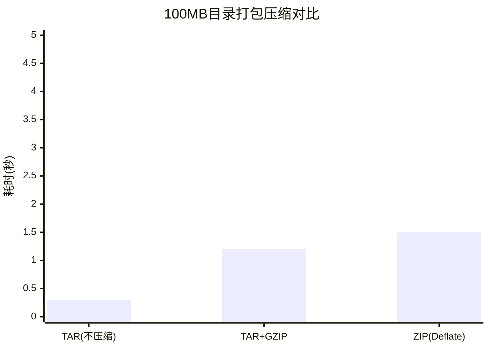

#  archive/tar完全指南

新手也能秒懂的Go标准库教程!从基础到实战,一文打通!

## 📖 包简介

TAR(Tape Archive)是Unix/Linux世界中最古老也最流行的归档格式。与ZIP不同,TAR本身**不做压缩**,它只是将多个文件"粘"在一起形成一个连续的归档文件。这种设计看似"偷懒",实则非常聪明——它将"归档"和"压缩"解耦,让你可以灵活组合不同的压缩算法(gzip、bzip2、xz等)。

Go的`archive/tar`包提供了完整的TAR文件读写能力。配合`compress/gzip`,你可以轻松处理`.tar.gz`/`.tgz`文件——这正是Docker镜像、Linux软件包、源代码分发的标准格式。

**典型使用场景**: Docker镜像层存储、日志归档、软件包分发、备份系统、Linux软件安装、CI/CD产物打包。

## 🎯 核心功能概览

### 主要类型

| 类型 | 说明 |
|------|------|
| `Writer` | TAR文件写入器 |
| `Reader` | TAR文件读取器 |
| `Header` | 文件头信息(名称、大小、权限、时间等) |
| `Format` | TAR格式类型(USTAR、PAX、GNU) |

### Writer核心方法

| 方法 | 说明 |
|------|------|
| `WriteHeader(hdr)` | 写入文件头信息 |
| `Write(b)` | 写入文件内容 |
| `Close()` | 完成写入 |

### Reader核心方法

| 方法 | 说明 |
|------|------|
| `Next()` | 移动到下一个文件条目 |
| `Read(b)` | 读取当前条目内容 |

### Header关键字段

| 字段 | 说明 |
|------|------|
| `Name` | 文件路径 |
| `Size` | 文件大小(字节) |
| `Mode` | 文件权限 |
| `ModTime` | 修改时间 |
| `Typeflag` | 类型('0'=普通, '5'=目录) |
| `Uid/Gid` | 用户/组ID |
| `Uname/Gname` | 用户/组名 |
| `PAXRecords` | PAX扩展属性 |

## 💻 实战示例

### 示例1:基础用法 - 创建TAR文件

```go
package main

import (
	"archive/tar"
	"fmt"
	"os"
)

func main() {
	// 创建TAR文件
	tarFile, err := os.Create("example.tar")
	if err != nil {
		panic(err)
	}
	defer tarFile.Close()

	// 创建TAR写入器
	tw := tar.NewWriter(tarFile)
	defer tw.Close()

	// 文件1: 普通文件
	files := []struct {
		Name    string
		Body    string
		Mode    int64
	}{
		{"hello.txt", "Hello, TAR!\n", 0644},
		{"script.sh", "#!/bin/bash\necho 'Hello'\n", 0755},
		{"mydir/", "", 0755}, // 目录(以/结尾)
		{"mydir/data.json", `{"name":"test"}`, 0644},
	}

	for _, file := range files {
		hdr := &tar.Header{
			Name: file.Name,
			Size: int64(len(file.Body)),
			Mode: file.Mode,
		}

		// 判断是目录还是文件
		if len(file.Body) == 0 {
			hdr.Typeflag = tar.TypeDir
		} else {
			hdr.Typeflag = tar.TypeReg
		}

		// 写入文件头
		if err := tw.WriteHeader(hdr); err != nil {
			panic(err)
		}

		// 写入文件内容(如果有)
		if file.Body != "" {
			if _, err := tw.Write([]byte(file.Body)); err != nil {
				panic(err)
			}
		}
	}

	fmt.Println("TAR文件创建成功: example.tar")
}
```

### 示例2:读取TAR文件

```go
package main

import (
	"archive/tar"
	"fmt"
	"io"
	"os"
)

func main() {
	// 打开TAR文件
	tarFile, err := os.Open("example.tar")
	if err != nil {
		panic(err)
	}
	defer tarFile.Close()

	// 创建TAR读取器
	tr := tar.NewReader(tarFile)

	fmt.Println("TAR文件内容:")

	// 遍历所有条目
	for {
		hdr, err := tr.Next()
		if err == io.EOF {
			break // 到达末尾
		}
		if err != nil {
			panic(err)
		}

		// 根据类型处理
		switch hdr.Typeflag {
		case tar.TypeDir:
			fmt.Printf("  📁 %s/ (权限: %o)\n", hdr.Name, hdr.Mode)

		case tar.TypeReg:
			// 读取文件内容
			content, err := io.ReadAll(tr)
			if err != nil {
				fmt.Printf("    读取失败: %v\n", err)
				continue
			}

			fmt.Printf("  📄 %s (%d 字节, 权限: %o)\n",
				hdr.Name, hdr.Size, hdr.Mode)
			fmt.Printf("    内容: %q\n", string(content))

		case tar.TypeSymlink:
			fmt.Printf("  🔗 %s -> %s\n", hdr.Name, hdr.Linkname)

		default:
			fmt.Printf("  ❓ %s (类型: %c)\n", hdr.Name, hdr.Typeflag)
		}
	}
}
```

### 示例3:最佳实践 - TAR+GZIP打包解压

```go
package main

import (
	"archive/tar"
	"compress/gzip"
	"fmt"
	"io"
	"os"
	"path/filepath"
)

// TarGzDir 将目录打包为.tar.gz
func TarGzDir(srcDir, destPath string) error {
	// 创建目标文件
	destFile, err := os.Create(destPath)
	if err != nil {
		return fmt.Errorf("创建文件失败: %w", err)
	}
	defer destFile.Close()

	// 创建GZIP写入器
	gw := gzip.NewWriter(destFile)
	defer gw.Close()

	// 创建TAR写入器(包装在GZIP之上)
	tw := tar.NewWriter(gw)
	defer tw.Close()

	// 遍历目录
	return filepath.Walk(srcDir, func(path string, info os.FileInfo, err error) error {
		if err != nil {
			return err
		}

		// 获取相对路径
		relPath, err := filepath.Rel(srcDir, path)
		if err != nil {
			return err
		}
		if relPath == "." {
			return nil
		}

		// 构建TAR头
		hdr, err := tar.FileInfoHeader(info, "")
		if err != nil {
			return err
		}
		hdr.Name = filepath.ToSlash(relPath)

		// 写入文件头
		if err := tw.WriteHeader(hdr); err != nil {
			return err
		}

		// 如果是文件,写入内容
		if !info.IsDir() {
			f, err := os.Open(path)
			if err != nil {
				return err
			}
			defer f.Close()

			_, err = io.Copy(tw, f)
			return err
		}

		return nil
	})
}

// ExtractTarGz 解压.tar.gz文件到目标目录
func ExtractTarGz(srcPath, destDir string) error {
	// 打开源文件
	srcFile, err := os.Open(srcPath)
	if err != nil {
		return fmt.Errorf("打开文件失败: %w", err)
	}
	defer srcFile.Close()

	// 创建GZIP读取器
	gr, err := gzip.NewReader(srcFile)
	if err != nil {
		return fmt.Errorf("创建gzip读取器失败: %w", err)
	}
	defer gr.Close()

	// 创建TAR读取器
	tr := tar.NewReader(gr)

	// 遍历并解压
	for {
		hdr, err := tr.Next()
		if err == io.EOF {
			break
		}
		if err != nil {
			return err
		}

		// 安全路径检查
		cleanName := filepath.Clean(hdr.Name)
		if filepath.IsAbs(cleanName) || filepath.Dir(cleanName) == ".." {
			return fmt.Errorf("非法路径: %s", hdr.Name)
		}

		targetPath := filepath.Join(destDir, cleanName)

		switch hdr.Typeflag {
		case tar.TypeDir:
			if err := os.MkdirAll(targetPath, os.FileMode(hdr.Mode)); err != nil {
				return err
			}

		case tar.TypeReg:
			// 确保父目录存在
			os.MkdirAll(filepath.Dir(targetPath), 0755)

			outFile, err := os.OpenFile(targetPath, os.O_CREATE|os.O_WRONLY|os.O_TRUNC, os.FileMode(hdr.Mode))
			if err != nil {
				return err
			}

			if _, err := io.Copy(outFile, tr); err != nil {
				outFile.Close()
				return err
			}
			outFile.Close()

			fmt.Printf("  ✅ %s\n", cleanName)
		}
	}

	return nil
}

func main() {
	// 创建测试目录
	os.MkdirAll("testdata/sub", 0755)
	os.WriteFile("testdata/config.yml", []byte("app: myapp\nport: 8080\n"), 0644)
	os.WriteFile("testdata/sub/data.csv", []byte("1,hello\n2,world\n"), 0644)

	// 打包
	fmt.Println("=== 打包 ===")
	err := TarGzDir("testdata", "testdata.tar.gz")
	if err != nil {
		panic(err)
	}
	fmt.Println("打包成功: testdata.tar.gz")

	// 解压
	fmt.Println("\n=== 解压 ===")
	os.MkdirAll("extracted", 0755)
	err = ExtractTarGz("testdata.tar.gz", "extracted")
	if err != nil {
		panic(err)
	}
	fmt.Println("解压完成!")

	// 清理
	os.RemoveAll("testdata")
	os.Remove("testdata.tar.gz")
	os.RemoveAll("extracted")
}
```

## ⚠️ 常见陷阱与注意事项

1. **WriteHeader必须先于Write**: 写入每个文件时,必须先调用`WriteHeader`写入元数据,然后调用`Write`写入内容。顺序颠倒会导致数据损坏。

2. **目录路径以/结尾**: TAR中目录`Name`字段必须以`/`结尾,且`Typeflag`设为`tar.TypeDir`。否则一些解压工具会将其当作普通文件处理。

3. **路径安全**: 解压时必须验证`hdr.Name`,防止`../`路径遍历攻击。示例3中已经展示了安全检查方法。

4. **符号链接**: `tar.FileInfoHeader()`不会自动设置符号链接的`Linkname`。如果需要正确处理符号链接,第二个参数应传入链接目标路径。

5. **时间精度丢失**: USTAR格式只支持秒级时间戳,纳秒级精度会丢失。如果需要高精度时间,确保使用PAX格式(`tar.FormatPAX`)。

## 🚀 Go 1.26新特性

`archive/tar`包在Go 1.26中**API保持稳定**。

值得一提的是,Go 1.26对`io`包中一些内部实现的优化,对TAR流式读写有微小的性能提升。TAR作为流式格式,频繁调用`io.Copy`和`io.ReadAll`,这些底层优化会带来间接收益。

## 📊 性能优化建议

### TAR vs ZIP 性能对比

| 特性 | TAR | ZIP |
|------|-----|-----|
| 压缩 | 需配合gzip等 | 内置Deflate |
| 权限保留 | ✅ 完整Unix权限 | ⚠️ 有限支持 |
| 流式处理 | ✅ 天然支持 | ❌ 需要索引 |
| 随机访问 | ❌ 不支持 | ✅ 支持 |
| 打包速度 | 更快 | 稍慢 |



**性能建议**:

1. **Docker镜像场景**: Docker使用TAR流式传输层,不要压缩(传输过程中CPU比网络更瓶颈)
2. **日志归档场景**: 使用TAR+GZIP组合,比ZIP有更好的压缩率
3. **流式写入**: 对于超大文件,一边生成TAR一边上传,不需要中间文件
4. **并发打包**: 多个文件可以先并发读取,但写入TAR必须串行(格式决定的)
5. **PAX格式处理长路径**: 如果文件路径超过100字符,USTAR格式不支持,应使用PAX格式

## 🔗 相关包推荐

- **`archive/zip`**: ZIP归档格式,Windows生态标准
- **`compress/gzip`**: GZIP压缩,与TAR是天作之合
- **`compress/bzip2`**: BZIP2压缩,更高压缩率
- **`io/fs`**: 文件系统接口,现代Go目录遍历方式

---