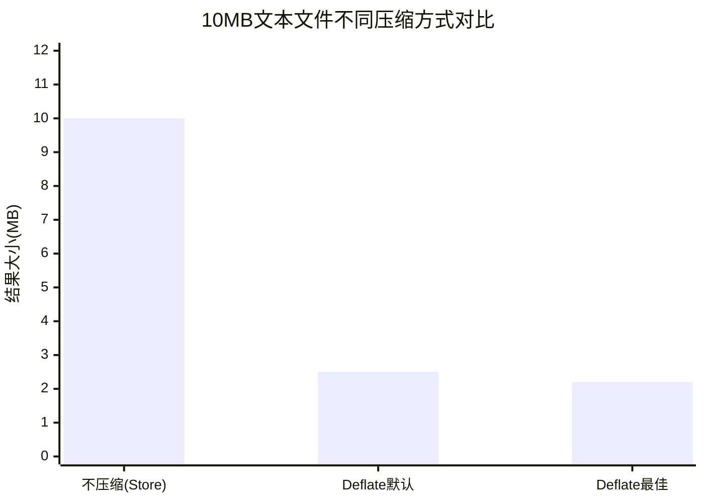

#  archive/zip完全指南

新手也能秒懂的Go标准库教程!从基础到实战,一文打通!

## 📖 包简介

ZIP格式是世界上最流行的文件归档格式之一。无论是打包下载、备份数据,还是跨平台传输文件,ZIP都是开发者的日常刚需。Go标准库中的`archive/zip`包提供了完整的ZIP文件读写能力,无需依赖任何第三方库。

`archive/zip`支持ZIP规范的绝大部分功能,包括文件压缩(Deflate/Store)、文件注释、修改时间、权限设置等。它的设计非常清晰:`Writer`负责写入ZIP文件,`Reader`负责读取和解析ZIP文件,每个文件条目通过`FileHeader`描述元数据。

**典型使用场景**: 批量文件下载打包、数据备份与恢复、日志归档、跨平台文件传输、Excel/DOCX等基于ZIP格式的Office文件处理。

## 🎯 核心功能概览

### 主要类型

| 类型 | 说明 |
|------|------|
| `Writer` | ZIP文件写入器 |
| `Reader` | ZIP文件读取器 |
| `ReadCloser` | 带关闭的ZIP读取器 |
| `File` | ZIP中的单个文件 |
| `FileHeader` | 文件头信息(名称、大小、时间等) |
| `Method` | 压缩方法(Store=0, Deflate=8) |

### Writer核心方法

| 方法 | 说明 |
|------|------|
| `Create(name)` | 创建一个新文件条目 |
| `CreateHeader(fh)` | 使用自定义Header创建文件 |
| `SetComment(comment)` | 设置ZIP全局注释 |
| `SetOffset(n)` | 设置ZIP数据起始偏移 |
| `Close()` | 完成写入并刷新索引 |

### Reader核心方法

| 方法 | 说明 |
|------|------|
| `zip.OpenReader(path)` | 打开并读取ZIP文件 |
| `zip.NewReader(r, size)` | 从io.ReaderAt创建Reader |
| `r.File` | 文件列表 |
| `r.Comment` | ZIP全局注释 |

## 💻 实战示例

### 示例1:基础用法 - 创建ZIP文件

```go
package main

import (
	"archive/zip"
	"fmt"
	"os"
)

func main() {
	// 创建ZIP文件
	zipFile, err := os.Create("example.zip")
	if err != nil {
		panic(err)
	}
	defer zipFile.Close()

	// 创建ZIP写入器
	zw := zip.NewWriter(zipFile)
	defer zw.Close()

	// 文件1: 使用默认配置
	fw1, err := zw.Create("hello.txt")
	if err != nil {
		panic(err)
	}
	_, err = fw1.Write([]byte("Hello, ZIP!\n"))
	if err != nil {
		panic(err)
	}

	// 文件2: 使用自定义Header
	fh := &zip.FileHeader{
		Name:   "subdir/nested.txt",
		Method: zip.Deflate, // 启用压缩
	}
	fw2, err := zw.CreateHeader(fh)
	if err != nil {
		panic(err)
	}
	_, err = fw2.Write([]byte("This is a nested file with compression.\n"))
	if err != nil {
		panic(err)
	}

	// 设置ZIP注释
	zw.SetComment("这是一个示例ZIP 文件")

	fmt.Println("ZIP文件创建成功: example.zip")
}
```

### 示例2:读取ZIP文件

```go
package main

import (
	"archive/zip"
	"fmt"
	"io"
	"os"
	"path/filepath"
)

func main() {
	// 打开ZIP文件
	zr, err := zip.OpenReader("example.zip")
	if err != nil {
		panic(err)
	}
	defer zr.Close()

	fmt.Printf("ZIP注释: %s\n", zr.Comment)
	fmt.Printf("包含 %d 个文件:\n\n", len(zr.File))

	// 遍历所有文件
	for _, f := range zr.File {
		fmt.Printf("  📄 %s (压缩后: %d 字节, 原始: %d 字节)\n",
			f.Name, f.CompressedSize64, f.UncompressedSize64)

		// 读取文件内容
		rc, err := f.Open()
		if err != nil {
			fmt.Printf("    打开失败: %v\n", err)
			continue
		}

		content, err := io.ReadAll(rc)
		rc.Close()
		if err != nil {
			fmt.Printf("    读取失败: %v\n", err)
			continue
		}

		fmt.Printf("    内容: %q\n", string(content))
	}

	fmt.Println("\n--- 解压到目录 ---")
	extractTo := "output"
	os.MkdirAll(extractTo, 0755)

	for _, f := range zr.File {
		// 构建目标路径
		targetPath := filepath.Join(extractTo, f.Name)

		// 如果是目录则跳过(以/结尾)
		if f.FileInfo().IsDir() {
			os.MkdirAll(targetPath, 0755)
			continue
		}

		// 创建父目录
		os.MkdirAll(filepath.Dir(targetPath), 0755)

		// 写入文件
		outFile, err := os.Create(targetPath)
		if err != nil {
			fmt.Printf("创建文件失败: %v\n", err)
			continue
		}

		rc, _ := f.Open()
		_, err = io.Copy(outFile, rc)
		outFile.Close()
		rc.Close()

		if err != nil {
			fmt.Printf("写入文件失败: %v\n", err)
		} else {
			fmt.Printf("  ✅ 解压: %s\n", targetPath)
		}
	}
}
```

### 示例3:最佳实践 - 内存ZIP与目录打包

```go
package main

import (
	"archive/zip"
	"bytes"
	"fmt"
	"io"
	"io/fs"
	"os"
	"path/filepath"
)

// PackDirectory 将目录打包为ZIP,返回ZIP数据的字节切片
func PackDirectory(srcDir, destZip string) error {
	zipFile, err := os.Create(destZip)
	if err != nil {
		return fmt.Errorf("创建ZIP文件失败: %w", err)
	}
	defer zipFile.Close()

	zw := zip.NewWriter(zipFile)
	defer zw.Close()

	// 遍历目录
	err = filepath.WalkDir(srcDir, func(path string, d fs.DirEntry, err error) error {
		if err != nil {
			return err
		}

		// 获取相对路径
		relPath, err := filepath.Rel(srcDir, path)
		if err != nil {
			return err
		}
		if relPath == "." {
			return nil // 跳过根目录本身
		}

		// 转换为ZIP内部路径(使用正斜杠)
		zipPath := filepath.ToSlash(relPath)

		info, err := d.Info()
		if err != nil {
			return err
		}

		if info.IsDir() {
			// 创建目录条目
			_, err = zw.Create(zipPath + "/")
			return err
		}

		// 创建文件条目(启用压缩)
		fh := &zip.FileHeader{
			Name:   zipPath,
			Method: zip.Deflate,
		}
		fh.SetMode(info.Mode())

		fw, err := zw.CreateHeader(fh)
		if err != nil {
			return err
		}

		// 读取源文件并写入ZIP
		srcFile, err := os.Open(path)
		if err != nil {
			return err
		}
		defer srcFile.Close()

		_, err = io.Copy(fw, srcFile)
		return err
	})

	return err
}

// CreateMemoryZip 在内存中创建ZIP,返回字节切片
func CreateMemoryZip(files map[string]string) ([]byte, error) {
	buf := new(bytes.Buffer)
	zw := zip.NewWriter(buf)

	for name, content := range files {
		fw, err := zw.Create(name)
		if err != nil {
			return nil, err
		}
		_, err = fw.Write([]byte(content))
		if err != nil {
			return nil, err
		}
	}

	if err := zw.Close(); err != nil {
		return nil, err
	}

	return buf.Bytes(), nil
}

func main() {
	// 演示1: 内存ZIP
	fmt.Println("=== 内存ZIP演示 ===")
	files := map[string]string{
		"config.yaml": "name: myapp\nversion: 1.0.0\n",
		"README.md":   "# My App\nA sample application.\n",
		"data.csv":    "id,name,age\n1,Alice,30\n2,Bob,25\n",
	}

	zipData, err := CreateMemoryZip(files)
	if err != nil {
		panic(err)
	}
	fmt.Printf("内存ZIP大小: %d 字节\n", len(zipData))

	// 验证内存ZIP
	zr, err := zip.NewReader(bytes.NewReader(zipData), int64(len(zipData)))
	if err != nil {
		panic(err)
	}
	fmt.Printf("包含文件数: %d\n", len(zr.File))

	// 演示2: 目录打包(需要先创建测试目录)
	fmt.Println("\n=== 目录打包演示 ===")
	os.MkdirAll("testDir/sub", 0755)
	os.WriteFile("testDir/a.txt", []byte("file A"), 0644)
	os.WriteFile("testDir/sub/b.txt", []byte("file B"), 0644)

	err = PackDirectory("testDir", "testDir.zip")
	if err != nil {
		panic(err)
	}
	fmt.Println("目录打包成功: testDir -> testDir.zip")

	// 清理
	os.RemoveAll("testDir")
	os.Remove("testDir.zip")
}
```

## ⚠️ 常见陷阱与注意事项

1. **必须调用Close()**: `zip.Writer.Close()`不仅仅是关闭文件,它还会**写入ZIP中央目录索引**。如果忘记调用,生成的ZIP文件将无法被正确读取。使用`defer zw.Close()`是最安全的做法。

2. **路径分隔符**: ZIP规范要求路径使用正斜杠`/`。在Windows上使用`filepath.Join`会得到反斜杠`\`,导致跨平台解压问题。务必使用`filepath.ToSlash()`转换。

3. **ZIP炸弹(Zip Bomb)**: 恶意ZIP文件可以通过极小的压缩体积产生巨大的解压数据(如42.zip,42KB解压出4.5PB)。处理用户上传的ZIP时,**必须限制解压后的总大小和文件数量**。

4. **文件名冲突与路径遍历**: 用户提供的ZIP文件名可能包含`../`导致路径遍历攻击。解压时应验证并清理文件路径:
   ```go
   cleanPath := filepath.Clean(f.Name)
   if filepath.IsAbs(cleanPath) || strings.Contains(cleanPath, "..") {
       return errors.New("非法路径")
   }
   ```

5. **大文件内存问题**: `io.ReadAll`会将整个文件读入内存。处理大ZIP文件时,使用`io.Copy`流式写入目标文件。

## 🚀 Go 1.26新特性

`archive/zip`包在Go 1.26中**API保持稳定**。没有新增或移除的公开接口。

不过,Go 1.26对标准库中`fmt.Errorf`单参数调用的内存分配优化,间接减少了日志记录和错误处理场景的内存开销,这对于批量处理大量ZIP文件(如日志归档系统)有轻微的性能提升。

## 📊 性能优化建议

### 压缩方法对比

| 方法 | 压缩率 | 速度 | 适用场景 |
|------|-------|------|---------|
| `zip.Store`(0) | 无压缩 | 极快 | 已压缩的文件(jpg,png,gzip) |
| `zip.Deflate`(8) | 中高 | 中等 | 文本、日志、代码 |



**性能建议**:

1. **选择合适的压缩方法**: 文本类文件用Deflate,已压缩文件(jpg/png/mp4/zip)用Store避免浪费CPU
2. **流式处理大文件**: 对于超过数百MB的文件,使用`io.Copy`而非一次性读入内存
3. **并发打包**: 多个独立文件可以先并发读取,再依次写入ZIP(写入部分必须串行)
4. **避免重复压缩**: 如果源文件已经是压缩格式,设置`Method: zip.Store`可以大幅减少CPU消耗
5. **预分配缓冲区内存ZIP**: 内存ZIP场景下,如果预估大小,用`bytes.NewBuffer(make([]byte, 0, estimatedSize))`减少扩容

## 🔗 相关包推荐

- **`archive/tar`**: TAR归档格式,适合Unix/Linux环境
- **`compress/gzip`**: GZIP压缩,常与tar配合使用(tar.gz)
- **`compress/flate`**: Deflate压缩底层实现
- **`io/fs`**: 文件系统接口,Go 1.16+的目录遍历标准

---