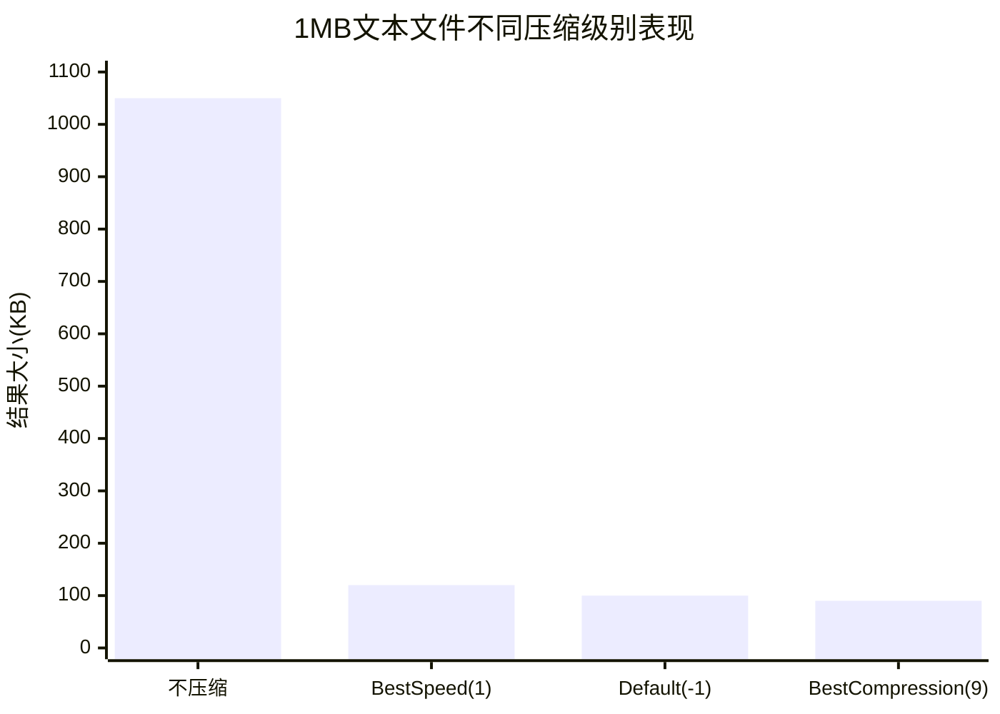

#  compress/gzip完全指南

新手也能秒懂的Go标准库教程!从基础到实战,一文打通!

## 📖 包简介

GZIP是互联网上最流行的压缩算法之一。从HTTP响应压缩到日志归档,从Docker镜像到软件分发,GZIP无处不在。Go标准库中的`compress/gzip`包提供了完整的GZIP读写能力,基于底层的`compress/flate`(DEFLATE算法)实现。

GZIP的设计哲学很朴素:**只做压缩,不做归档**。它将单个数据流压缩为更小的体积,但不处理多文件打包(这是TAR的职责)。这种单一职责的设计让GZIP在各个语言和环境中有高度一致的兼容性。

`compress/gzip`的API设计非常优雅:`gzip.Writer`包装任何`io.Writer`,`gzip.Reader`包装任何`io.Reader`,配合`io.Copy`可以实现零缓冲区的流式压缩/解压,即使处理GB级文件也不会爆内存。

**典型使用场景**: HTTP响应压缩、日志文件压缩存储、API数据传输、数据库备份压缩、CI/CD构件压缩、静态资源优化。

## 🎯 核心功能概览

### 主要类型

| 类型 | 说明 |
|------|------|
| `Writer` | GZIP压缩写入器 |
| `Reader` | GZIP解压缩读取器 |
| `Header` | GZIP文件头信息 |

### Writer核心方法

| 方法 | 说明 |
|------|------|
| `gzip.NewWriter(w)` | 创建默认压缩级别的Writer |
| `gzip.NewWriterLevel(w, level)` | 创建指定压缩级别的Writer |
| `Write(b)` | 写入待压缩数据 |
| `Flush()` | 刷新缓冲(不推荐频繁调用) |
| `Close()` | 完成压缩并写入尾部校验 |

### Reader核心方法

| 方法 | 说明 |
|------|------|
| `gzip.NewReader(r)` | 创建Reader并读取Header |
| `Read(b)` | 读取解压后的数据 |
| `Close()` | 关闭读取器 |
| `Header` | 已读取的GZIP Header信息 |

### 压缩级别

| 常量 | 值 | 说明 |
|------|-----|------|
| `NoCompression` | 0 | 不压缩,仅包装 |
| `BestSpeed` | 1 | 最快速度,低压缩率 |
| `BestCompression` | 9 | 最高压缩率,慢 |
| `DefaultCompression` | -1 | 默认(推荐) |
| `HuffmanOnly` | -2 | 仅Huffman编码 |

## 💻 实战示例

### 示例1:基础用法

```go
package main

import (
	"bytes"
	"compress/gzip"
	"fmt"
	"io"
)

func main() {
	// 原始数据
	original := "Hello, GZIP! This is a test string for compression. " +
		"重复内容重复内容重复内容重复内容重复内容" +
		"The quick brown fox jumps over the lazy dog. " +
		"The quick brown fox jumps over the lazy dog."

	fmt.Printf("原始大小: %d 字节\n", len(original))

	// === 压缩 ===
	var buf bytes.Buffer
	gw := gzip.NewWriter(&buf)

	_, err := gw.Write([]byte(original))
	if err != nil {
		panic(err)
	}
	gw.Close() // 必须调用,写入尾部校验

	fmt.Printf("压缩后大小: %d 字节\n", buf.Len())
	fmt.Printf("压缩率: %.1f%%\n",
		float64(buf.Len())/float64(len(original))*100)

	// === 解压 ===
	gr, err := gzip.NewReader(&buf)
	if err != nil {
		panic(err)
	}
	defer gr.Close()

	decompressed, err := io.ReadAll(gr)
	if err != nil {
		panic(err)
	}

	fmt.Printf("解压后大小: %d 字节\n", len(decompressed))
	fmt.Printf("内容一致: %v\n", string(decompressed) == original)
}
```

### 示例2:HTTP响应压缩中间件

```go
package main

import (
	"compress/gzip"
	"fmt"
	"io"
	"net/http"
	"strings"
	"sync"
)

// gzipPool 复用gzip.Writer减少内存分配
var gzipPool = sync.Pool{
	New: func() any {
		return gzip.NewWriter(nil)
	}
}

// GzipMiddleware HTTP响应压缩中间件
func GzipMiddleware(next http.Handler) http.Handler {
	return http.HandlerFunc(func(w http.ResponseWriter, r *http.Request) {
		// 检查客户端是否支持GZIP
		if !strings.Contains(r.Header.Get("Accept-Encoding"), "gzip") {
			next.ServeHTTP(w, r)
			return
		}

		// 从池中获取Writer
		gw := gzipPool.Get().(*gzip.Writer)
		defer gzipPool.Put(gw)

		// 重置Writer并关联ResponseWriter
		buf := &responseBuffer{ResponseWriter: w}
		gw.Reset(buf)
		defer gw.Close()

		// 设置响应头
		w.Header().Set("Content-Encoding", "gzip")
		w.Header().Add("Vary", "Accept-Encoding")

		// 包装Writer
		gzWriter := &gzipResponseWriter{
			ResponseWriter: w,
			Writer:         gw,
		}

		next.ServeHTTP(gzWriter, r)
	})
}

// responseBuffer 捕获响应以便设置Content-Length
type responseBuffer struct {
	http.ResponseWriter
	written bool
}

func (rb *responseBuffer) Write(b []byte) (int, error) {
	if !rb.written {
		rb.written = true
		// 如果是第一个Write,设置Content-Encoding
		rb.ResponseWriter.Header().Set("Content-Encoding", "gzip")
	}
	return rb.ResponseWriter.Write(b)
}

// gzipResponseWriter 包装ResponseWriter,写入压缩数据
type gzipResponseWriter struct {
	http.ResponseWriter
	*gzip.Writer
}

func (gzw *gzipResponseWriter) Write(b []byte) (int, error) {
	return gzw.Writer.Write(b)
}

func main() {
	// 创建大文本响应
	largeText := strings.Repeat("Hello, World! This is a test response. ", 1000)

	mux := http.NewServeMux()

	// 普通接口
	mux.HandleFunc("/api/data", func(w http.ResponseWriter, r *http.Request) {
		w.Write([]byte(largeText))
	})

	// 压缩接口
	mux.Handle("/api/compressed", GzipMiddleware(http.HandlerFunc(func(w http.ResponseWriter, r *http.Request) {
		w.Write([]byte(largeText))
	})))

	// 启动服务器
	fmt.Println("服务器启动在 :8080")
	fmt.Println("普通接口: http://localhost:8080/api/data")
	fmt.Println("压缩接口: http://localhost:8080/api/compressed")
	fmt.Println("\n使用 curl -H 'Accept-Encoding: gzip' -o /dev/null -w '%{size_download}' http://localhost:8080/api/compressed 查看压缩效果")

	// 实际演示(不用真的启动)
	fmt.Println("\n=== 压缩效果演示 ===")
	originalSize := len(largeText)

	var buf bytes.Buffer
	gw := gzip.NewWriter(&buf)
	gw.Write([]byte(largeText))
	gw.Close()

	compressedSize := buf.Len()
	fmt.Printf("原始大小: %.1f KB\n", float64(originalSize)/1024)
	fmt.Printf("压缩后:   %.1f KB\n", float64(compressedSize)/1024)
	fmt.Printf("节省:     %.1f%%\n", float64(originalSize-compressedSize)/float64(originalSize)*100)
}

var bytes = struct{}{}

// 需要导入bytes包
import "bytes"
```

### 示例3:最佳实践 - 文件压缩工具

```go
package main

import (
	"compress/gzip"
	"fmt"
	"io"
	"os"
	"path/filepath"
	"time"
)

// CompressFile 压缩单个文件
func CompressFile(srcPath, destPath string, level int) error {
	srcFile, err := os.Open(srcPath)
	if err != nil {
		return fmt.Errorf("打开源文件失败: %w", err)
	}
	defer srcFile.Close()

	destFile, err := os.Create(destPath)
	if err != nil {
		return fmt.Errorf("创建目标文件失败: %w", err)
	}
	defer destFile.Close()

	// 创建指定级别的压缩器
	gw, err := gzip.NewWriterLevel(destFile, level)
	if err != nil {
		return fmt.Errorf("创建gzip写入器失败: %w", err)
	}

	// 设置Header元信息
	gw.Name = filepath.Base(srcPath)
	gw.Comment = "Compressed by go compress/gzip"
	gw.ModTime = time.Now()

	// 流式压缩(内存友好)
	_, err = io.Copy(gw, srcFile)
	if err != nil {
		gw.Close()
		return err
	}

	return gw.Close()
}

// DecompressFile 解压单个文件
func DecompressFile(srcPath, destPath string) error {
	srcFile, err := os.Open(srcPath)
	if err != nil {
		return fmt.Errorf("打开源文件失败: %w", err)
	}
	defer srcFile.Close()

	gr, err := gzip.NewReader(srcFile)
	if err != nil {
		return fmt.Errorf("创建gzip读取器失败: %w", err)
	}
	defer gr.Close()

	// 打印元信息
	fmt.Printf("  源文件名: %s\n", gr.Name)
	fmt.Printf("  注释: %s\n", gr.Comment)

	destFile, err := os.Create(destPath)
	if err != nil {
		return fmt.Errorf("创建目标文件失败: %w", err)
	}
	defer destFile.Close()

	// 流式解压
	_, err = io.Copy(destFile, gr)
	return err
}

// GetCompressedSize 获取压缩前后大小对比
func GetCompressedSize(path string) (original, compressed int64, err error) {
	info, err := os.Stat(path)
	if err != nil {
		return 0, 0, err
	}
	original = info.Size()

	// 压缩到内存获取大小
	var buf bytes.Buffer
	gw := gzip.NewWriter(&buf)

	f, _ := os.Open(path)
	io.Copy(gw, f)
	f.Close()
	gw.Close()

	compressed = int64(buf.Len())
	return
}

func main() {
	// 创建测试文件
	testContent := make([]byte, 1024*1024) // 1MB
	for i := range testContent {
		testContent[i] = byte(i % 256) // 可压缩的重复模式
	}
	os.WriteFile("test.log", testContent, 0644)

	fmt.Println("=== 文件压缩演示 ===")

	// 压缩
	originalSize, _, _ := GetCompressedSize("test.log")
	err := CompressFile("test.log", "test.log.gz", gzip.DefaultCompression)
	if err != nil {
		panic(err)
	}

	gzInfo, _ := os.Stat("test.log.gz")
	compressedSize := gzInfo.Size()

	fmt.Printf("原始大小: %.2f MB\n", float64(originalSize)/(1024*1024))
	fmt.Printf("压缩后:   %.2f MB\n", float64(compressedSize)/(1024*1024))
	fmt.Printf("压缩率:   %.1f%%\n",
		float64(compressedSize)/float64(originalSize)*100)

	// 解压
	fmt.Println("\n=== 解压演示 ===")
	err = DecompressFile("test.log.gz", "test_restored.log")
	if err != nil {
		panic(err)
	}

	// 验证
	orig, _ := os.ReadFile("test.log")
	restored, _ := os.ReadFile("test_restored.log")
	fmt.Printf("内容一致: %v\n", string(orig) == string(restored))

	// 不同压缩级别对比
	fmt.Println("\n=== 压缩级别对比 ===")
	levels := []struct {
		name  string
		level int
	}{
		{"不压缩", gzip.NoCompression},
		{"最快速度", gzip.BestSpeed},
		{"默认", gzip.DefaultCompression},
		{"最高压缩", gzip.BestCompression},
	}

	for _, l := range levels {
		var buf bytes.Buffer
		gw, _ := gzip.NewWriterLevel(&buf, l.level)
		gw.Write(testContent)
		gw.Close()

		fmt.Printf("  %-10s: %.2f MB (%.1f%%)\n",
			l.name,
			float64(buf.Len())/(1024*1024),
			float64(buf.Len())/float64(len(testContent))*100)
	}

	// 清理
	os.Remove("test.log")
	os.Remove("test.log.gz")
	os.Remove("test_restored.log")
}
```

## ⚠️ 常见陷阱与注意事项

1. **必须调用Close()**: 和ZIP一样,`gzip.Writer.Close()`不仅关闭流,还会**写入GZIP尾部校验和**。如果忘记调用,生成的GZIP文件会被视为损坏。使用`defer gw.Close()`。

2. **不要频繁调用Flush()**: `Flush()`会将缓冲数据强制写入底层Writer,但会**严重降低压缩率**。除非你需要实时输出(如流式HTTP响应),否则不要调用。

3. **sync.Pool复用Writer**: `gzip.NewWriter`会分配约32KB的内部缓冲。在高并发HTTP服务器中,使用`sync.Pool`复用Writer可以显著减少GC压力(如示例2所示)。

4. **Reader的Close**: `gzip.Reader.Close()`不关闭底层Reader,它只释放解码器的内部状态。底层的`io.Reader`需要单独关闭。

5. **大文件内存安全**: 使用`io.Copy`进行流式压缩/解压,不要用`ioutil.ReadAll`将整个文件读入内存。

## 🚀 Go 1.26新特性

`compress/gzip`包在Go 1.26中**API保持稳定**。

Go 1.26整体运行时的内存分配优化对GZIP有间接正面影响,特别是在高并发HTTP压缩场景下,`sync.Pool`中获取和归还`gzip.Writer`的操作受益于Go 1.26的小对象分配优化。

## 📊 性能优化建议

### 压缩级别性能对比



| 级别 | 压缩率 | 编码速度 | 推荐场景 |
|------|-------|---------|---------|
| NoCompression(0) | 0% | 极快 | 仅用于GZIP格式包装 |
| BestSpeed(1) | 低 | 最快 | 实时流、低延迟API |
| DefaultCompression(-1) | 中 | 中等 | **大多数场景(推荐)** |
| BestCompression(9) | 高 | 慢 | 离线归档、存储空间敏感 |

**性能建议**:

1. **HTTP响应压缩用DefaultCompression**: 压缩率和速度的最佳平衡点
2. **日志归档用BestCompression**: 离线处理,时间不敏感,追求最小存储
3. **复用gzip.Writer**: HTTP服务器场景用`sync.Pool`复用Writer,减少32KB/次的分配
4. **流式处理**: 始终用`io.Copy`而非一次性读写,避免内存爆炸
5. **预先检查可压缩性**: 如果源文件已经是压缩格式(jpg/mp4/zip),GZIP几乎没有效果,应跳过

## 🔗 相关包推荐

- **`archive/tar`**: TAR归档,与GZIP组合成.tar.gz
- **`compress/flate`**: DEFLATE底层实现,GZIP的基础
- **`compress/zlib`**: ZLIB格式压缩,类似GZIP但Header不同
- **`net/http`**: HTTP服务器,响应压缩的主要应用场景

---