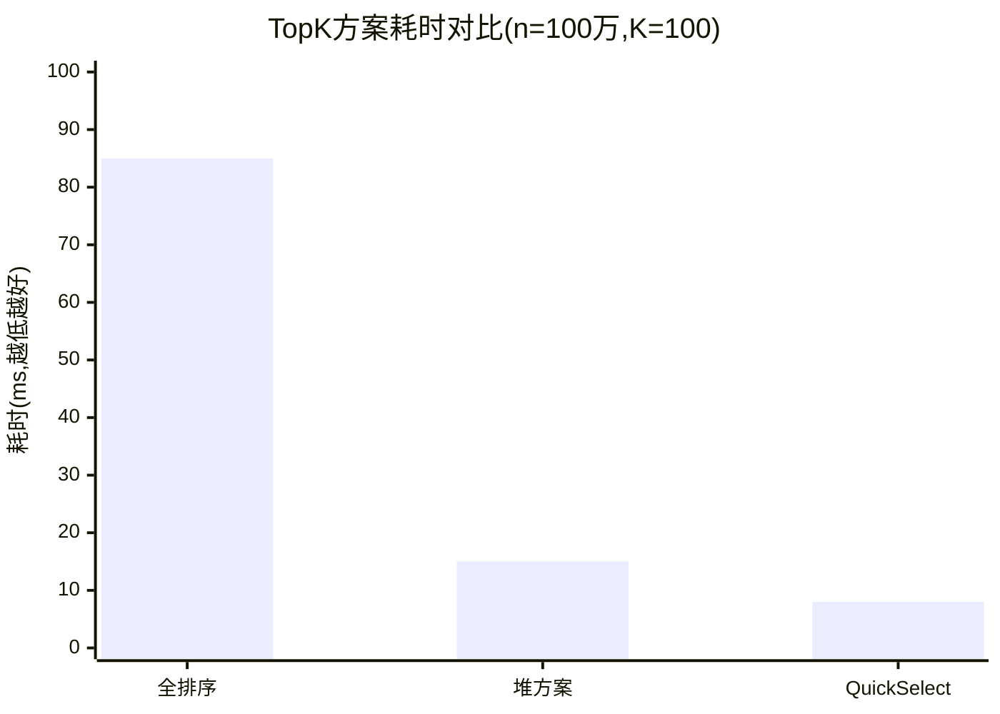

#  container/heap完全指南

新手也能秒懂的Go标准库教程!从基础到实战,一文打通!

## 📖 包简介

优先级队列、TopK问题、任务调度......这些听起来高大上的场景,背后都藏着一个共同的数据结构——**堆(Heap)**。Go标准库中的`container/heap`包为你提供了开箱即用的堆操作实现。

`container/heap`采用**接口驱动**的设计模式,你只需要实现`heap.Interface`(继承自`sort.Interface`并额外提供`Push`和`Push`方法),就能把任何底层数据结构变成堆。这种设计非常Go味——灵活、解耦、可扩展。

堆的本质是一棵完全二叉树,分为**最小堆**(父节点值小于等于子节点)和**最大堆**(父节点值大于等于子节点)。`container/heap`默认实现的是最小堆,但通过调整Less函数可以轻松实现最大堆。

**典型使用场景**: 优先级队列、合并K个有序链表/文件、求TopK元素、Dijkstra最短路径算法、定时器任务调度。

## 🎯 核心功能概览

### heap.Interface接口

```go
type Interface interface {
    sort.Interface       // 包含 Len(), Less(i,j int), Swap(i,j int)
    Push(x any)          // 将元素追加到底层数据结构
    Pop() any            // 移除并返回最后一个元素
}
```

### 核心函数

| 函数 | 说明 | 时间复杂度 |
|------|------|-----------|
| `heap.Init(h)` | 将切片初始化为堆 | O(n) |
| `heap.Push(h, x)` | 向堆中插入元素 | O(log n) |
| `heap.Pop(h)` | 弹出堆顶元素 | O(log n) |
| `heap.Fix(h, i)` | 修复位置i的元素 | O(log n) |
| `heap.Remove(h, i)` | 删除位置i的元素 | O(log n) |

## 💻 实战示例

### 示例1:基础用法 - 最小堆

```go
package main

import (
	"container/heap"
	"fmt"
)

// IntHeap 实现heap.Interface
type IntHeap []int

func (h IntHeap) Len() int           { return len(h) }
func (h IntHeap) Less(i, j int) bool { return h[i] < h[j] } // 最小堆
func (h IntHeap) Swap(i, j int)      { h[i], h[j] = h[j], h[i] }

func (h *IntHeap) Push(x any) {
	*h = append(*h, x.(int))
}

func (h *IntHeap) Pop() any {
	old := *h
	n := len(old)
	x := old[n-1]
	*h = old[:n-1]
	return x
}

func main() {
	// 创建一个乱序切片
	h := &IntHeap{5, 3, 8, 1, 9, 2}

	// 初始化为堆 - 这一步是必须的!
	heap.Init(h)
	fmt.Printf("初始化后堆顶(最小值): %d\n", (*h)[0]) // 1

	// 插入新元素
	heap.Push(h, 0)
	fmt.Printf("插入0后堆顶: %d\n", (*h)[0]) // 0

	// 依次弹出,得到有序序列
	fmt.Print("依次弹出: ")
	for h.Len() > 0 {
		fmt.Printf("%d ", heap.Pop(h))
	}
	// 输出: 0 1 2 3 5 8 9
}
```

### 示例2:优先级队列

```go
package main

import (
	"container/heap"
	"fmt"
)

// Task 任务结构
type Task struct {
	ID       int
	Name     string
	Priority int // 数值越小优先级越高
}

// PriorityQueue 优先级队列
type PriorityQueue []*Task

func (pq PriorityQueue) Len() int { return len(pq) }

func (pq PriorityQueue) Less(i, j int) bool {
	// 优先级数值小的排前面
	if pq[i].Priority == pq[j].Priority {
		return pq[i].ID < pq[j].ID // 优先级相同时按ID排序
	}
	return pq[i].Priority < pq[j].Priority
}

func (pq PriorityQueue) Swap(i, j int) {
	pq[i], pq[j] = pq[j], pq[i]
}

func (pq *PriorityQueue) Push(x any) {
	*pq = append(*pq, x.(*Task))
}

func (pq *PriorityQueue) Pop() any {
	old := *pq
	n := len(old)
	item := old[n-1]
	*pq = old[:n-1]
	return item
}

// Update 更新任务优先级并修复堆
func (pq *PriorityQueue) Update(task *Task, newPriority int) {
	task.Priority = newPriority
	// 找到task在堆中的位置(实际应用中可以用map缓存索引)
	for i, t := range *pq {
		if t.ID == task.ID {
			heap.Fix(pq, i)
			return
		}
	}
}

func main() {
	pq := &PriorityQueue{}
	heap.Init(pq)

	// 添加任务
	tasks := []*Task{
		{ID: 1, Name: "修复线上bug", Priority: 1},
		{ID: 2, Name: "写文档", Priority: 5},
		{ID: 3, Name: "代码审查", Priority: 3},
		{ID: 4, Name: "性能优化", Priority: 2},
	}

	for _, t := range tasks {
		heap.Push(pq, t)
	}

	fmt.Println("按优先级处理任务:")
	for pq.Len() > 0 {
		task := heap.Pop(pq).(*Task)
		fmt.Printf("  处理: %s (优先级:%d)\n", task.Name, task.Priority)
	}

	// 演示动态更新优先级
	fmt.Println("\n动态添加新任务:")
	heap.Push(pq, &Task{ID: 5, Name: "紧急安全补丁", Priority: 0})
	heap.Push(pq, &Task{ID: 6, Name: "重构代码", Priority: 4})

	fmt.Println("处理新任务:")
	for pq.Len() > 0 {
		task := heap.Pop(pq).(*Task)
		fmt.Printf("  处理: %s (优先级:%d)\n", task.Name, task.Priority)
	}
}
```

### 示例3:TopK问题最佳实践

```go
package main

import (
	"container/heap"
	"fmt"
	"math/rand"
)

// MinHeap 用于TopK的最小堆
type MinHeap []int

func (h MinHeap) Len() int           { return len(h) }
func (h MinHeap) Less(i, j int) bool { return h[i] < h[j] }
func (h MinHeap) Swap(i, j int)      { h[i], h[j] = h[j], h[i] }

func (h *MinHeap) Push(x any) {
	*h = append(*h, x.(int))
}

func (h *MinHeap) Pop() any {
	old := *h
	n := len(old)
	x := old[n-1]
	*h = old[:n-1]
	return x
}

// TopK 找出最大的K个元素
func TopK(nums []int, k int) []int {
	if k <= 0 || k > len(nums) {
		return nil
	}

	// 维护一个大小为K的最小堆
	h := &MinHeap{}
	heap.Init(h)

	for _, num := range nums {
		if h.Len() < k {
			heap.Push(h, num)
		} else if num > (*h)[0] {
			// 当前元素比堆顶大,替换堆顶
			(*h)[0] = num
			heap.Fix(h, 0)
		}
	}

	// 取出结果
	result := make([]int, k)
	for i := k - 1; i >= 0; i-- {
		result[i] = heap.Pop(h).(int)
	}
	return result
}

func main() {
	// 生成随机数据
	rand.Seed(42)
	nums := make([]int, 20)
	for i := range nums {
		nums[i] = rand.Intn(100)
	}
	fmt.Println("原始数据:", nums)

	// 找最大的5个元素
	top5 := TopK(nums, 5)
	fmt.Println("Top 5:", top5)

	// 找最小的3个元素(用最大堆)
	type MaxHeap []int

	mh := &MaxHeap{}
	heap.Init((*heap.Interface)(mh)) // 这里简化,实际需实现MaxHeap的heap接口
	_ = mh
}
```

## ⚠️ 常见陷阱与注意事项

1. **忘记调用heap.Init()**: 直接对切片使用Push/Pop会得到错误结果。任何切片在作为堆使用之前**必须**先调用`heap.Init()`进行堆化。

2. **Pop后没有更新底层切片**: `heap.Pop()`内部会调用你实现的Pop方法,你必须确保Pop方法从底层数据结构中移除元素并返回它。如果忘记移除,会导致重复处理。

3. **Fix()用错索引**: `heap.Fix(h, i)`要求索引i处的元素值已经改变,但索引位置正确。如果元素已经不在位置i了,应该用`heap.Remove()`+`heap.Push()`。

4. **并发不安全**: `container/heap`不是线程安全的。在并发场景下需要加锁保护,或参考示例2中任务队列的实现方式。

5. **Push/Pop的any类型**: Go 1.18+的any就是interface{},所以在Push时需要类型断言,Pop后需要类型断言回原始类型。如果你用泛型重构了自己的堆,这个问题就不存在了。

## 🚀 Go 1.26新特性

`container/heap`包在Go 1.26中**保持API不变**。这是Go标准库一贯的稳定性保证。

值得关注的间接影响: Go 1.26对内存分配的优化(尤其是小对象分配)对堆操作中的频繁Push/Pop有轻微的正面影响,因为堆操作涉及大量的接口转换和小对象分配。

## 📊 性能优化建议

### 各种TopK方案的性能对比

| 方案 | 时间复杂度 | 空间复杂度 | 适用场景 |
|------|-----------|-----------|---------|
| 全排序后取TopK | O(n log n) | O(n) | K接近n时 |
| **container/heap** | **O(n log K)** | **O(K)** | **K << n,流式数据** |
| 快排分区(QuickSelect) | O(n)平均 | O(1) | 一次性计算,内存敏感 |



**性能建议**:

1. **流式数据用堆**: 如果数据是陆续到达的,维护一个大小为K的堆是最优选择
2. **批量数据用QuickSelect**: 如果所有数据已就位且只需TopK,`golang.org/x/exp/slices`中的QuickSelect更快
3. **K接近n时直接排序**: 当K和n差不多大时,直接`sort.Slice`反而更简单高效
4. **预分配容量**: 堆的底层切片如果能预估大小,提前`make`好容量可以减少扩容开销
5. **使用Fix替代Remove+Push**: 如果只是想替换堆顶元素,直接`h[0] = newVal; heap.Fix(h, 0)`比`Pop+Push`少一次内存分配

## 🔗 相关包推荐

- **`container/list`**: 双向链表,适合需要双向遍历的场景
- **`container/ring`**: 环形列表,适合循环缓冲区
- **`sort`**: 排序包,TopK的替代方案
- **`slices`(Go 1.21+)**: 泛型切片操作,包含排序函数

---