#  container/list完全指南

新手也能秒懂的Go标准库教程!从基础到实战,一文打通!

## 📖 包简介

在日常开发中,切片(slice)和映射(map)是我们最常用的数据结构。但当你需要一个高效的**双向链表**时,Go标准库中的`container/list`就是你的秘密武器了。

`container/list`包实现了一个经典的双向链表,支持在O(1)时间内完成插入和删除操作。与切片不同,链表在中间位置插入或删除元素不需要移动其他元素,这在需要频繁修改集合的场景下性能优势明显。

**典型使用场景**: LRU缓存实现、任务队列管理、浏览器历史记录、撤销/重做功能等。如果你的业务逻辑需要频繁在任意位置插入或删除元素,`container/list`值得你关注。

## 🎯 核心功能概览

| 类型/函数 | 说明 |
|-----------|------|
| `type Element` | 链表中的元素节点 |
| `type List` | 双向链表主体 |
| `list.New()` | 创建新的空链表 |
| `list.PushFront(v)` | 头部插入元素 |
| `list.PushBack(v)` | 尾部插入元素 |
| `list.PushFrontV(e, v)` | 在元素e前插入 |
| `list.PushBackV(e, v)` | 在元素e后插入 |
| `list.Remove(e)` | 删除指定元素 |
| `list.MoveToFront(e)` | 移动元素到头部 |
| `list.MoveToBack(e)` | 移动元素到尾部 |
| `list.MoveBefore(a, b)` | 移动a到b之前 |
| `list.Front()` | 获取头元素 |
| `list.Back()` | 获取尾元素 |
| `list.Len()` | 获取链表长度 |

## 💻 实战示例

### 示例1:基础用法

```go
package main

import (
	"container/list"
	"fmt"
)

func main() {
	// 创建一个新的双向链表
	l := list.New()

	// 尾部插入元素
	e1 := l.PushBack(10)
	e2 := l.PushBack(20)
	e3 := l.PushBack(30)

	// 头部插入元素
	l.PushFront(5)

	// 遍历链表 - 从头到尾
	fmt.Println("从头到尾遍历:")
	for e := l.Front(); e != nil; e = e.Next() {
		fmt.Printf("%v ", e.Value)
	}
	// 输出: 5 10 20 30

	fmt.Println()

	// 遍历链表 - 从尾到头
	fmt.Println("从尾到头遍历:")
	for e := l.Back(); e != nil; e = e.Prev() {
		fmt.Printf("%v ", e.Value)
	}
	// 输出: 30 20 10 5

	fmt.Println()

	// 获取链表长度
	fmt.Printf("链表长度: %d\n", l.Len())

	// 删除指定元素
	l.Remove(e2)
	fmt.Println("删除20后:")
	for e := l.Front(); e != nil; e = e.Next() {
		fmt.Printf("%v ", e.Value)
	}
	// 输出: 5 10 30
}
```

### 示例2:LRU缓存实现

```go
package main

import (
	"container/list"
	"fmt"
)

// LRUCache 简单的LRU缓存实现
type LRUCache struct {
	capacity int
	cache    map[string]*list.Element // key -> list元素指针
	order    *list.List               // 双向链表,头部是最近使用的
}

type entry struct {
	key   string
	value int
}

func NewLRUCache(capacity int) *LRUCache {
	return &LRUCache{
		capacity: capacity,
		cache:    make(map[string]*list.Element),
		order:    list.New(),
	}
}

func (lru *LRUCache) Get(key string) (int, bool) {
	if elem, ok := lru.cache[key]; ok {
		// 将访问的元素移到头部(标记为最近使用)
		lru.order.MoveToFront(elem)
		return elem.Value.(entry).value, true
	}
	return 0, false
}

func (lru *LRUCache) Put(key string, value int) {
	// 如果key已存在,更新值并移到头部
	if elem, ok := lru.cache[key]; ok {
		elem.Value = entry{key: key, value: value}
		lru.order.MoveToFront(elem)
		return
	}

	// 如果缓存已满,淘汰最久未使用的(尾部的元素)
	if lru.order.Len() >= lru.capacity {
		oldest := lru.order.Back()
		lru.order.Remove(oldest)
		delete(lru.cache, oldest.Value.(entry).key)
	}

	// 插入新元素到头部
	newElem := lru.order.PushFront(entry{key: key, value: value})
	lru.cache[key] = newElem
}

func (lru *LRUCache) Print() {
	fmt.Print("缓存内容(从新到旧): ")
	for e := lru.order.Front(); e != nil; e = e.Next() {
		ent := e.Value.(entry)
		fmt.Printf("[%s:%d] ", ent.key, ent.value)
	}
	fmt.Println()
}

func main() {
	cache := NewLRUCache(3)

	cache.Put("A", 1)
	cache.Put("B", 2)
	cache.Put("C", 3)
	cache.Print() // [C:3] [B:2] [A:1]

	cache.Get("A") // 访问A,A移到头部
	cache.Print()  // [A:1] [C:3] [B:2]

	cache.Put("D", 4) // 容量满,淘汰B
	cache.Print()     // [D:4] [A:1] [C:3]

	// B已经被淘汰了
	if val, ok := cache.Get("B"); !ok {
		fmt.Println("B已被淘汰,不在缓存中")
	} else {
		fmt.Printf("B的值: %d\n", val)
	}
}
```

### 示例3:最佳实践 - 通用任务队列

```go
package main

import (
	"container/list"
	"fmt"
	"sync"
)

// TaskQueue 线程安全的任务队列
type TaskQueue struct {
	mu   sync.Mutex
	list *list.List
	cond *sync.Cond
}

type Task struct {
	ID   int
	Name string
}

func NewTaskQueue() *TaskQueue {
	tq := &TaskQueue{
		list: list.New(),
	}
	tq.cond = sync.NewCond(&tq.mu)
	return tq
}

func (tq *TaskQueue) Enqueue(task Task) {
	tq.mu.Lock()
	defer tq.mu.Unlock()

	tq.list.PushBack(task)
	tq.cond.Signal() // 通知等待的消费者
}

func (tq *TaskQueue) Dequeue() Task {
	tq.mu.Lock()
	defer tq.mu.Unlock()

	// 队列为空时等待
	for tq.list.Len() == 0 {
		tq.cond.Wait()
	}

	elem := tq.list.Front()
	tq.list.Remove(elem)
	return elem.Value.(Task)
}

// TryDequeue 非阻塞获取,如果队列为空返回false
func (tq *TaskQueue) TryDequeue() (Task, bool) {
	tq.mu.Lock()
	defer tq.mu.Unlock()

	if tq.list.Len() == 0 {
		return Task{}, false
	}

	elem := tq.list.Front()
	tq.list.Remove(elem)
	return elem.Value.(Task), true
}

func (tq *TaskQueue) Len() int {
	tq.mu.Lock()
	defer tq.mu.Unlock()
	return tq.list.Len()
}

func main() {
	tq := NewTaskQueue()

	// 模拟生产者
	go func() {
		for i := 1; i <= 5; i++ {
			tq.Enqueue(Task{ID: i, Name: fmt.Sprintf("任务-%d", i)})
			fmt.Printf("生产: 任务-%d\n", i)
		}
	}()

	// 模拟消费者
	for i := 0; i < 5; i++ {
		task := tq.Dequeue()
		fmt.Printf("消费: %s (ID=%d)\n", task.Name, task.ID)
	}

	// 非阻塞示例
	tq.Enqueue(Task{ID: 100, Name: "紧急任务"})
	if task, ok := tq.TryDequeue(); ok {
		fmt.Printf("快速消费: %s\n", task.Name)
	}
}
```

## ⚠️ 常见陷阱与注意事项

1. **遍历时不要删除正在遍历的元素**: 如果在for循环中使用`e.Next()`遍历的同时删除当前元素,会导致`nil pointer`错误。正确做法是先保存下一个节点:
   ```go
   for e := l.Front(); e != nil; {
       next := e.Next() // 先保存
       if shouldRemove(e) {
           l.Remove(e)
       }
       e = next
   }
   ```

2. **Element.Value是interface{}类型**: 取值时需要类型断言,断言失败会panic。建议使用"comma ok"模式:
   ```go
   if val, ok := elem.Value.(MyType); ok {
       // 安全使用val
   }
   ```

3. **不要跨链表操作元素**: 将一个链表的Element用于另一个链表的方法(如MoveToFront)会导致panic。每个Element只属于创建它的那个List。

4. **零值List可以直接使用**: `var l list.List`声明后即可直接使用,不需要`New()`,但`New()`更清晰且避免歧义。

5. **内存开销**: 链表每个元素需要额外的节点结构体开销(Ptr + Value + 前后指针),如果存储大量小对象,内存占用会比切片高很多。

## 🚀 Go 1.26新特性

`container/list`包在Go 1.26中**没有重大变更**,保持API稳定。这正是Go标准库的设计哲学:成熟稳定的包不会随意改动。

不过,Go 1.26整体的内存分配优化(特别是`fmt.Errorf`的单参数优化)对依赖反射和接口转换的链表操作也有微小的性能提升。

## 📊 性能优化建议

### container/list vs 切片的性能对比

```mermaid
xychart-beta
    title "不同操作的时间复杂度对比"
    x-axis ["头部插入", "尾部插入", "中间插入", "头部删除", "中间删除", "随机访问"]
    y-axis "时间复杂度(越低越好)" 0 --> 2
    bar [0, 0, 0, 0, 0, 1]
    bar [1, 0, 1, 1, 1, 0]
```



**性能建议**:

1. **选链表的场景**: 频繁在中间位置插入/删除,且不需要随机访问
2. **选切片的场景**: 主要是追加和遍历,需要随机访问,内存敏感
3. **避免频繁类型断言**: 如果链表元素类型固定,可以考虑泛型封装(虽然标准库list本身不支持泛型)
4. **预分配map**: 配合list使用的map建议预估容量,避免扩容

**基准测试参考** (100万元素中间插入):

| 数据结构 | 中间插入 | 头部删除 | 随机访问 |
|---------|---------|---------|---------|
| container/list | ~50ns | ~50ns | N/A |
| slice | ~2ms | ~2ms | ~1ns |

## 🔗 相关包推荐

- **`container/heap`**: 堆操作,优先级队列的标配
- **`container/ring`**: 环形链表,适合循环缓冲区场景
- **`sync.Map`**: 并发安全的map,常与list配合使用
- **`sync`**: 互斥锁和条件变量,构建线程安全队列的基石

---