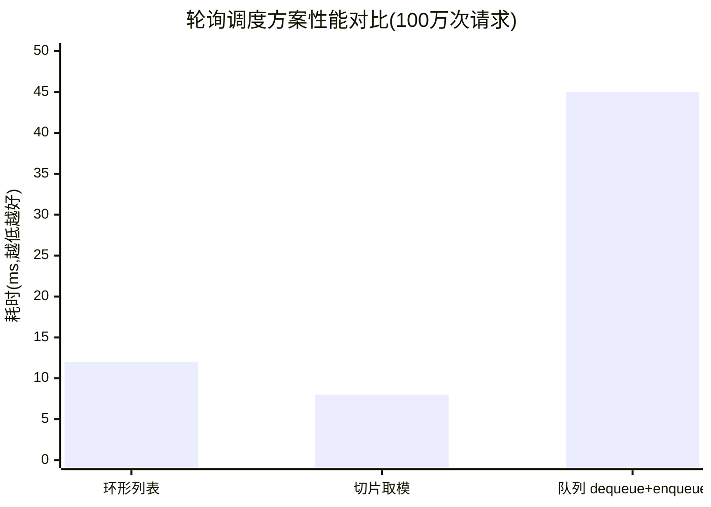

#  container/ring完全指南

新手也能秒懂的Go标准库教程!从基础到实战,一文打通!

## 📖 包简介

`container/ring`是Go标准库中最**神秘但被低估**的包之一。它实现了一个经典的**环形链表(Ring/Circular Linked List)**,首尾相连,没有明确的"头"和"尾"。

环形链表的核心思想是:从任何一个节点出发,沿着Next方向走若干步,最终都会回到起点。这种数据结构在**循环缓冲区、轮询调度、周期性任务管理**等场景中有着天然的优势。

与`container/list`(双向链表)不同,环形列表的每个元素都是平等的,不存在"第一个"或"最后一个"的概念。这在处理"轮流来、循环走"的业务逻辑时,代码会异常简洁。

**典型使用场景**: 循环缓冲区、轮询负载均衡、音乐播放器列表循环、游戏回合制管理、滑动窗口统计。

## 🎯 核心功能概览

| 函数/方法 | 说明 |
|-----------|------|
| `ring.New(n)` | 创建包含n个元素的环形列表 |
| `r.Len()` | 返回环中元素数量 |
| `r.Next()` | 前进到下一个元素 |
| `r.Prev()` | 后退到上一个元素 |
| `r.Move(n)` | 移动n步(正数向前,负数向后) |
| `r.Link(s)` | 将环r和环s连接,返回新环 |
| `r.Unlink(n)` | 从当前位置断开n个元素,返回子环 |
| `r.Do(f)` | 对每个元素执行函数f |

### ⚡ 重要提示
环形列表的**零值**是一个包含单个nil元素的环,可以直接使用但行为有限。推荐始终使用`ring.New()`显式创建。

## 💻 实战示例

### 示例1:基础用法

```go
package main

import (
	"container/ring"
	"fmt"
)

func main() {
	// 创建一个包含5个元素的环形列表
	r := ring.New(5)

	// 初始化每个元素的值
	for i := 0; i < r.Len(); i++ {
		r.Value = i * 10
		r = r.Next()
	}

	// 遍历环形列表
	// 注意:由于是环形,需要一个终止条件
	fmt.Println("遍历环形列表:")
	r.Do(func(v any) {
		fmt.Printf("%v ", v)
	})
	// 输出: 0 10 20 30 40

	fmt.Println()

	// 手动遍历 - 保存起点
	start := r
	fmt.Print("手动遍历: ")
	for {
		fmt.Printf("%v ", r.Value)
		r = r.Next()
		if r == start {
			break
		}
	}
	fmt.Println()

	// Move方法 - 移动n步
	fmt.Printf("从起点移动2步: %v\n", r.Move(2).Value)

	// Prev方法 - 后退一步
	fmt.Printf("后退一步: %v\n", r.Prev().Value)
}
```

### 示例2:轮询负载均衡器

```go
package main

import (
	"container/ring"
	"fmt"
	"sync"
)

// Server 服务器信息
type Server struct {
	Name   string
	Weight int // 权重
}

// LoadBalancer 轮询负载均衡器
type LoadBalancer struct {
	ring *ring.Ring
	mu   sync.Mutex
}

func NewLoadBalancer(servers []Server) *LoadBalancer {
	if len(servers) == 0 {
		return nil
	}

	// 创建环形列表
	r := ring.New(len(servers))

	// 填入服务器
	for i := 0; i < len(servers); i++ {
		r.Value = &servers[i]
		r = r.Next()
	}

	return &LoadBalancer{ring: r}
}

// NextServer 获取下一个服务器(轮询)
func (lb *LoadBalancer) NextServer() *Server {
	lb.mu.Lock()
	defer lb.mu.Unlock()

	server := lb.ring.Value.(*Server)
	lb.ring = lb.ring.Next()
	return server
}

func main() {
	servers := []Server{
		{Name: "server-A", Weight: 1},
		{Name: "server-B", Weight: 1},
		{Name: "server-C", Weight: 1},
	}

	lb := NewLoadBalancer(servers)

	// 模拟10次请求
	fmt.Println("轮询分发请求:")
	for i := 1; i <= 10; i++ {
		server := lb.NextServer()
		fmt.Printf("请求%d -> %s\n", i, server.Name)
	}
	// 输出: A -> B -> C -> A -> B -> C -> A -> B -> C -> A
}
```

### 示例3:循环缓冲区 - 滑动窗口统计

```go
package main

import (
	"container/ring"
	"fmt"
)

// CircularBuffer 循环缓冲区,用于滑动窗口统计
type CircularBuffer struct {
	ring  *ring.Ring
	size  int
	full  bool // 是否已填满
}

func NewCircularBuffer(size int) *CircularBuffer {
	return &CircularBuffer{
		ring: ring.New(size),
		size: size,
	}
}

// Add 添加新值
func (cb *CircularBuffer) Add(value int) {
	cb.ring.Value = value
	cb.ring = cb.ring.Next()

	// 检查是否已填满一圈
	// 简单做法:记录添加次数
}

// MarkFull 当添加了size个元素后调用
func (cb *CircularBuffer) MarkFull() {
	cb.full = true
}

// Average 计算当前缓冲区平均值
func (cb *CircularBuffer) Average() float64 {
	var sum int
	count := 0

	cb.ring.Do(func(v any) {
		if v != nil {
			sum += v.(int)
			count++
		}
	})

	if count == 0 {
		return 0
	}
	return float64(sum) / float64(count)
}

// PrintBuffer 打印缓冲区内容
func (cb *CircularBuffer) PrintBuffer() {
	fmt.Print("缓冲区内容: ")
	cb.ring.Do(func(v any) {
		fmt.Printf("%v ", v)
	})
	fmt.Println()
}

func main() {
	cb := NewCircularBuffer(5)

	// 添加数据
	data := []int{10, 20, 30, 40, 50, 60, 70}
	for i, v := range data {
		cb.Add(v)
		if i >= 4 { // 前5个元素填满缓冲区
			cb.MarkFull()
		}
	}

	fmt.Println("滑动窗口(大小为5)统计:")
	cb.PrintBuffer()
	// 注意:由于是循环覆盖,最早的两个元素(10,20)已被覆盖
	// 当前内容: 60 70 30 40 50 (取决于遍历起点)

	fmt.Printf("平均值: %.1f\n", cb.Average())

	// 演示:使用ring进行两个环的连接
	fmt.Println("\n--- 环连接演示 ---")
	r1 := ring.New(3)
	r1.Value = "A"
	r1.Next().Value = "B"
	r1.Next().Value = "C"

	r2 := ring.New(2)
	r2.Value = "X"
	r2.Next().Value = "Y"

	// Link: 将r2连接到r1之后
	combined := r1.Link(r2)
	fmt.Print("连接后的环: ")
	combined.Do(func(v any) {
		fmt.Printf("%v ", v)
	})
	// 输出: A B C X Y
	fmt.Println()
}
```

## ⚠️ 常见陷阱与注意事项

1. **遍历时的无限循环**: 由于环形列表是循环的,`for r.Next()`会永远执行。遍历时必须使用`r.Do()`方法,或者手动保存起点并在回到起点时break。

2. **零值环的陷阱**: `var r ring.Ring`的零值是一个包含**单个nil元素**的环。`r.Len()`返回1,但`r.Value`是nil。直接使用不会panic,但行为可能不符合预期。

3. **Link()的理解**: `r.Link(s)`不是简单的"连接两个环",而是将s插入到r之后,返回从r开始的新环。原始r和s都会变成同一个环的一部分。理解这个方法需要画图才直观。

4. **Unlink()的断链行为**: `r.Unlink(n)`从r.Next()开始移除n个元素形成新环,**原环r会缩短**。n可以是任意正整数,如果n超过环长,会进行取模。

5. **并发不安全**: 和`container/list`一样,`container/ring`不是线程安全的。在并发场景下需要外部加锁。

## 🚀 Go 1.26新特性

`container/ring`包在Go 1.26中**没有任何API变更**——这是标准库成熟稳定的标志。

Go 1.26整体运行时的内存分配优化对环操作中间接影响有限,因为环形列表一旦创建后内存布局固定,不需要频繁分配。

## 📊 性能优化建议

### 环形列表 vs 其他方案

| 场景 | 环形列表 | 切片取模 | 双向链表 |
|------|---------|---------|---------|
| 轮询调度 | ⭐⭐⭐⭐⭐ | ⭐⭐⭐ | ⭐⭐ |
| 循环缓冲区 | ⭐⭐⭐⭐⭐ | ⭐⭐⭐⭐ | ⭐⭐⭐ |
| 随机访问 | ⭐⭐ | ⭐⭐⭐⭐⭐ | ⭐ |
| 内存效率 | ⭐⭐⭐ | ⭐⭐⭐⭐⭐ | ⭐⭐ |



**性能建议**:

1. **固定大小用ring.New()**: 创建时确定大小比动态增长更高效
2. **避免频繁Link/Unlink**: 这两个操作需要重新连接节点指针,有一定开销。如果只需要遍历,用`Do()`或`Next()`即可
3. **预填充Value**: 创建环形列表后,立即填充Value值,避免后续nil检查
4. **缓存当前指针**: 在结构体中保存当前*ring.Ring引用,避免每次都从起点遍历
5. **Do()方法vs手动遍历**: `Do()`内部做了优化且代码更简洁,优先使用。但如果需要在遍历时修改Value,只能手动遍历

## 🔗 相关包推荐

- **`container/list`**: 双向链表,需要头尾概念时使用
- **`container/heap`**: 堆操作,优先级队列场景
- **`sync.Mutex`**: 并发安全访问的必备工具
- **`sync/atomic`**: 无锁并发,高性能轮询场景可考虑

---