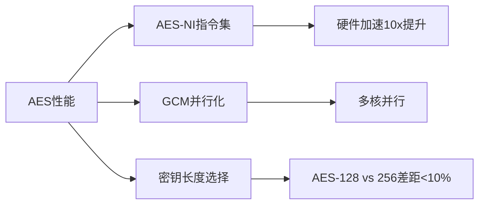

# crypto/aes完全指南

新手也能秒懂的Go标准库教程!从基础到实战,一文打通!

## 📖 包简介

`crypto/aes`包实现了AES(Advanced Encryption Standard)对称加密算法,这是目前全球使用最广泛的加密标准。从WiFi加密(WPA2)到文件加密,从HTTPS到数据库加密,AES无处不在。

AES支持128、192和256位密钥长度,密钥越长安全性越高。Go的AES实现经过高度优化,在支持AES-NI指令集的CPU上(现代x86处理器基本都支持),加密速度可达数GB/s。记住:AES是对称加密,加密和解密使用同一把钥匙!

## 🎯 核心功能概览

| 函数/类型 | 说明 |
|-----------|------|
| `NewCipher(key []byte)` | 创建AES加密器,返回cipher.Block |
| `CipherSize` | 常量,返回实现支持的密钥长度(16/24/32字节) |
| `cipher.Block` | 块加密接口,支持ECB(不推荐)、CBC、CTR、GCM等模式 |
| `cipher.NewGCM()` | 创建GCM模式(推荐,认证加密) |
| `cipher.NewCBCDecrypter()` | CBC解密器 |
| `cipher.NewCBCEncrypter()` | CBC加密器 |
| `cipher.NewCTR()` | CTR模式(流加密) |

**加密模式选择指南**:
- **GCM**(推荐): 认证加密,并行化好,现代首选
- **CBC**: 经典模式,需要填充,串行处理
- **CTR**: 流加密模式,无需填充,可并行

## 💻 实战示例

### 示例1:AES-GCM加密(生产推荐)

```go
package main

import (
	"crypto/aes"
	"crypto/cipher"
	"crypto/rand"
	"encoding/base64"
	"fmt"
	"io"
)

// AESEncrypt 使用AES-GCM加密
func AESEncrypt(plaintext, key []byte) (string, error) {
	block, err := aes.NewCipher(key)
	if err != nil {
		return "", fmt.Errorf("创建AES密钥失败: %w", err)
	}

	// 使用GCM模式(推荐)
	gcm, err := cipher.NewGCM(block)
	if err != nil {
		return "", fmt.Errorf("创建GCM失败: %w", err)
	}

	// 生成随机nonce(12字节是GCM推荐长度)
	nonce := make([]byte, gcm.NonceSize())
	if _, err := io.ReadFull(rand.Reader, nonce); err != nil {
		return "", fmt.Errorf("生成nonce失败: %w", err)
	}

	// 加密(自动附加认证标签)
	// 最后一个参数associatedData可用于附加认证数据
	ciphertext := gcm.Seal(nonce, nonce, plaintext, nil)

	return base64.StdEncoding.EncodeToString(ciphertext), nil
}

// AESDecrypt 使用AES-GCM解密
func AESDecrypt(encoded string, key []byte) ([]byte, error) {
	ciphertext, err := base64.StdEncoding.DecodeString(encoded)
	if err != nil {
		return nil, fmt.Errorf("Base64解码失败: %w", err)
	}

	block, err := aes.NewCipher(key)
	if err != nil {
		return nil, fmt.Errorf("创建AES密钥失败: %w", err)
	}

	gcm, err := cipher.NewGCM(block)
	if err != nil {
		return nil, fmt.Errorf("创建GCM失败: %w", err)
	}

	nonceSize := gcm.NonceSize()
	if len(ciphertext) < nonceSize {
		return nil, fmt.Errorf("密文太短,可能已损坏")
	}

	// 提取nonce和密文
	nonce, ciphertext := ciphertext[:nonceSize], ciphertext[nonceSize:]

	// 解密(自动验证认证标签)
	plaintext, err := gcm.Open(nil, nonce, ciphertext, nil)
	if err != nil {
		return nil, fmt.Errorf("解密失败(认证未通过?): %w", err)
	}

	return plaintext, nil
}

func main() {
	// AES-256需要32字节密钥
	key := []byte("0123456789abcdef0123456789abcdef")
	if len(key) != 32 {
		// 实际应用中应该用KDF派生密钥
		panic("密钥长度必须是16/24/32字节")
	}

	original := []byte("Go AES-G256加密,安全又快速!")

	// 加密
	encrypted, err := AESEncrypt(original, key)
	if err != nil {
		panic(err)
	}
	fmt.Printf("密文: %s\n", encrypted)

	// 解密
	decrypted, err := AESDecrypt(encrypted, key)
	if err != nil {
		panic(err)
	}
	fmt.Printf("明文: %s\n", string(decrypted))
	fmt.Printf("解密正确: %v\n", string(decrypted) == string(original))
}
```

### 示例2:AES-CBC加密(兼容旧系统)

```go
package main

import (
	"crypto/aes"
	"crypto/cipher"
	"crypto/rand"
	"encoding/base64"
	"fmt"
	"io"
)

// PKCS7填充
func pkcs7Pad(data []byte, blockSize int) []byte {
	padding := blockSize - len(data)%blockSize
	padtext := make([]byte, padding)
	for i := range padtext {
		padtext[i] = byte(padding)
	}
	return append(data, padtext...)
}

func pkcs7Unpad(data []byte) ([]byte, error) {
	length := len(data)
	if length == 0 {
		return nil, fmt.Errorf("数据为空")
	}
	padding := int(data[length-1])
	if padding > length || padding > aes.BlockSize {
		return nil, fmt.Errorf("无效填充")
	}
	return data[:length-padding], nil
}

func main() {
	key := []byte("0123456789abcdef") // AES-128: 16字节
	plaintext := []byte("Hello AES-CBC!")

	// 创建加密器
	block, _ := aes.NewCipher(key)
	
	// 填充
	padded := pkcs7Pad(plaintext, aes.BlockSize)
	
	// 生成IV
	ciphertext := make([]byte, aes.BlockSize+len(padded))
	iv := ciphertext[:aes.BlockSize]
	io.ReadFull(rand.Reader, iv)

	// 加密
	mode := cipher.NewCBCEncrypter(block, iv)
	mode.CryptBlocks(ciphertext[aes.BlockSize:], padded)

	encoded := base64.StdEncoding.EncodeToString(ciphertext)
	fmt.Printf("CBC密文: %s\n", encoded)

	// 解密
	decoded, _ := base64.StdEncoding.DecodeString(encoded)
	iv = decoded[:aes.BlockSize]
	decoded = decoded[aes.BlockSize:]

	decrypted := make([]byte, len(decoded))
	mode = cipher.NewCBCDecrypter(block, iv)
	mode.CryptBlocks(decrypted, decoded)

	// 去除填充
	result, _ := pkcs7Unpad(decrypted)
	fmt.Printf("解密明文: %s\n", string(result))
}
```

### 示例3:大文件加密(流式处理)

```go
package main

import (
	"crypto/aes"
	"crypto/cipher"
	"crypto/rand"
	"fmt"
	"io"
	"os"
)

// EncryptFile 流式加密大文件
func EncryptFile(inPath, outPath string, key []byte) error {
	inFile, err := os.Open(inPath)
	if err != nil {
		return err
	}
	defer inFile.Close()

	outFile, err := os.Create(outPath)
	if err != nil {
		return err
	}
	defer outFile.Close()

	block, err := aes.NewCipher(key)
	if err != nil {
		return err
	}

	gcm, err := cipher.NewGCM(block)
	if err != nil {
		return err
	}

	// 写入nonce
	nonce := make([]byte, gcm.NonceSize())
	io.ReadFull(rand.Reader, nonce)
	outFile.Write(nonce)

	// 分块加密(每块1MB)
	buf := make([]byte, 1024*1024)
	for {
		n, readErr := inFile.Read(buf)
		if n > 0 {
			encrypted := gcm.Seal(nil, nonce, buf[:n], nil)
			outFile.Write(encrypted)
			// 每次使用新nonce(生产环境应更复杂)
			io.ReadFull(rand.Reader, nonce)
		}
		if readErr == io.EOF {
			break
		}
		if readErr != nil {
			return readErr
		}
	}

	return nil
}

func main() {
	key := make([]byte, 32)
	rand.Read(key)

	// 创建测试文件
	os.WriteFile("test.txt", []byte("This is a test file for encryption demo."), 0644)

	err := EncryptFile("test.txt", "test.enc", key)
	if err != nil {
		fmt.Printf("加密失败: %v\n", err)
		return
	}
	fmt.Println("文件加密成功!")

	// 清理
	os.Remove("test.txt")
	os.Remove("test.enc")
}
```

## ⚠️ 常见陷阱与注意事项

1. **密钥长度必须正确**: AES只接受16、24或32字节密钥(AES-128/192/256),传其他长度会直接报错。使用`crypto/sha256.Sum256()`从密码派生密钥。

2. **永远不要重用Nonce**: GCM模式下nonce重用会**完全破坏安全性**!每次加密必须使用随机nonce,并且绝对不能重复。

3. **ECB模式极度危险**: `crypto/cipher`故意没有提供ECB模式实现,因为ECB不能提供语义安全(看经典的Tux企鹅图就懂了)。

4. **GCM有64位安全限制**: GCM模式在加密约32GB数据后安全性下降。加密大文件应分块或使用其他模式。

5. **不要自己实现KDF**: 从密码派生密钥请使用`golang.org/x/crypto/pbkdf2`或`scrypt`,不要简单地`md5(password)`。

## 🚀 Go 1.26新特性

`crypto/aes`在Go 1.26中没有API变化,但受益于底层系统优化:

- **ARM AES加速**: 在Apple Silicon和ARM服务器上,利用ARMv8 AES指令集,性能提升显著
- **FIPS 140-3合规**: 在FIPS模式下,aes实现经过NIST认证
- **内存安全增强**: 配合`runtime/secret`(实验性),可在使用后安全擦除密钥内存

## 📊 性能优化建议



| 指标 | AES-128 | AES-256 |
|------|---------|---------|
| 密钥长度 | 16字节 | 32字节 |
| 轮数 | 10轮 | 14轮 |
| 软件实现 | ~150MB/s | ~110MB/s |
| 带AES-NI | ~1.5GB/s | ~1.2GB/s |
| 安全性 | 足够 | 军用级 |

**性能技巧**:
- AES-128和AES-256在现代CPU上的性能差距不到10%,但安全裕度更大,**推荐直接使用AES-256**
- GCM模式比CBC快30-50%,因为可以并行处理
- 检查是否启用AES-NI: `go env GOARCH`为`amd64`或`arm64`时默认启用

## 🔗 相关包推荐

| 包 | 用途 |
|----|------|
| `crypto/cipher` | 加密模式封装(CBC/GCM/CTR) |
| `crypto/rand` | 安全随机数生成(用于nonce/IV) |
| `golang.org/x/crypto/pbkdf2` | 从密码派生密钥 |
| `golang.org/x/crypto/chacha20poly1305` | ChaCha20-Poly1305(ARM设备更快) |
| `crypto/hmac` | 消息认证(如需额外认证) |
| `runtime/secret` | 安全擦除密钥内存(实验性) |

---