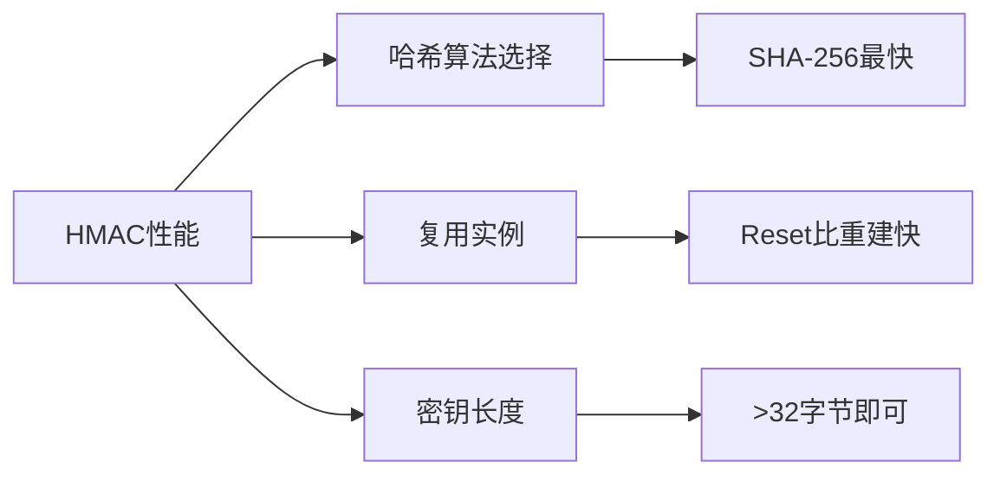

# crypto/hmac完全指南

新手也能秒懂的Go标准库教程!从基础到实战,一文打通!

## 📖 包简介

`crypto/hmac`包实现了HMAC(Hash-based Message Authentication Code,基于哈希的消息认证码)。简单来说,HMAC就是一种"带密钥的哈希"——只有知道密钥的人才能计算出正确的认证码,也只有知道密钥的人才能验证消息是否被篡改。

HMAC广泛用于API请求签名、Webhook验证、会话令牌、数据完整性校验等场景。它比简单拼接密钥和数据然后哈希要安全得多,可以抵抗长度扩展攻击。Go 1.26中HMAC包没有API变化,但受益于底层哈希的优化。

## 🎯 核心功能概览

| 函数/类型 | 说明 |
|-----------|------|
| `New(hash func() hash.Hash, key []byte)` | 创建HMAC实例 |
| `Equal(mac1, mac2 []byte) bool` | 常量时间比较(防时序攻击) |
| `hash.Hash`接口 | 支持Write/Sum/Reset |

**HMAC支持的底层哈希**:
- `crypto/sha256` - 最常用,推荐
- `crypto/sha512` - 更高安全
- `crypto/sha3` - 后量子友好
- `crypto/md5` - 不推荐(但HMAC-MD5仍然安全)

## 💻 实战示例

### 示例1:基础HMAC签名与验证

```go
package main

import (
	"crypto/hmac"
	"crypto/sha256"
	"encoding/hex"
	"fmt"
)

// GenerateHMAC 生成HMAC-SHA256签名
func GenerateHMAC(message, key string) string {
	mac := hmac.New(sha256.New, []byte(key))
	mac.Write([]byte(message))
	return hex.EncodeToString(mac.Sum(nil))
}

// VerifyHMAC 验证HMAC签名(常量时间比较)
func VerifyHMAC(message, signature, key string) bool {
	expected := GenerateHMAC(message, key)
	
	// 关键:使用hmac.Equal防止时序攻击!
	// 不要用 bytes.Equal 或 == 比较
	sigBytes, _ := hex.DecodeString(signature)
	expectedBytes, _ := hex.DecodeString(expected)
	return hmac.Equal(sigBytes, expectedBytes)
}

func main() {
	key := "super-secret-key-do-not-share"
	message := "用户请求:转账100元到账户8888"

	// 生成签名
	signature := GenerateHMAC(message, key)
	fmt.Printf("HMAC签名: %s\n", signature)

	// 验证正确签名
	valid := VerifyHMAC(message, signature, key)
	fmt.Printf("正确签名验证: %v\n", valid)

	// 验证被篡改的消息
	tampered := "用户请求:转账100元到账户8888"
	tampered = tampered[:15] + "9" + tampered[16:]
	valid = VerifyHMAC(tampered, signature, key)
	fmt.Printf("篡改消息验证: %v\n", valid)

	// 验证错误密钥
	valid = VerifyHMAC(message, signature, "wrong-key")
	fmt.Printf("错误密钥验证: %v\n", valid)
}
```

### 示例2:Webhook签名验证

```go
package main

import (
	"crypto/hmac"
	"crypto/sha256"
	"encoding/hex"
	"fmt"
	"net/http"
	"time"
)

type WebhookSigner struct {
	secret []byte
}

func NewWebhookSigner(secret string) *WebhookSigner {
	return &WebhookSigner{secret: []byte(secret)}
}

// SignPayload 生成Webhook签名,包含时间戳防重放
func (ws *WebhookSigner) SignPayload(payload []byte) string {
	timestamp := fmt.Sprintf("%d", time.Now().Unix())
	
	mac := hmac.New(sha256.New, ws.secret)
	mac.Write([]byte(timestamp))
	mac.Write([]byte("."))
	mac.Write(payload)
	
	return timestamp + "." + hex.EncodeToString(mac.Sum(nil))
}

// VerifyWebhook 验证Webhook请求
func (ws *WebhookSigner) VerifyWebhook(r *http.Request, body []byte) error {
	signature := r.Header.Get("X-Webhook-Signature")
	if signature == "" {
		return fmt.Errorf("缺少签名")
	}

	parts := split(signature, '.')
	if len(parts) != 2 {
		return fmt.Errorf("签名格式错误")
	}

	timestamp := parts[0]
	macHex := parts[1]

	// 检查时间戳(5分钟窗口)
	ts := parseInt(timestamp)
	if time.Since(time.Unix(ts, 0)) > 5*time.Minute {
		return fmt.Errorf("签名已过期")
	}

	// 计算期望的签名
	expectedMac := hmac.New(sha256.New, ws.secret)
	expectedMac.Write([]byte(timestamp))
	expectedMac.Write([]byte("."))
	expectedMac.Write(body)
	expectedHex := hex.EncodeToString(expectedMac.Sum(nil))

	// 常量时间比较
	macBytes, _ := hex.DecodeString(macHex)
	expectedBytes, _ := hex.DecodeString(expectedHex)
	if !hmac.Equal(macBytes, expectedBytes) {
		return fmt.Errorf("签名验证失败")
	}

	return nil
}

func split(s, sep string) []string {
	for i := 0; i < len(s); i++ {
		if s[i:i+len(sep)] == sep {
			return []string{s[:i], s[i+len(sep):]}
		}
	}
	return nil
}

func parseInt(s string) int64 {
	var n int64
	fmt.Sscanf(s, "%d", &n)
	return n
}

func main() {
	signer := NewWebhookSigner("webhook-secret-123")
	payload := []byte(`{"event":"payment","amount":100}`)
	
	signature := signer.SignPayload(payload)
	fmt.Printf("Webhook签名: %s\n", signature)
	
	// 模拟HTTP请求
	req := &http.Request{
		Header: http.Header{"X-Webhook-Signature": []string{signature}},
	}
	
	err := signer.VerifyWebhook(req, payload)
	if err != nil {
		fmt.Printf("验证失败: %v\n", err)
	} else {
		fmt.Println("Webhook验证成功!")
	}
}
```

### 示例3:API请求签名(HMAC-SHA3)

```go
package main

import (
	"crypto/hmac"
	"crypto/sha256"
	"crypto/sha3"
	"encoding/base64"
	"fmt"
	"sort"
	"strings"
)

// APISigner API请求签名器
type APISigner struct {
	accessKey    string
	secretKey    []byte
	hashFunc     func() interface{}
	useSHA3      bool
}

func NewAPISigner(accessKey, secretKey string, useSHA3 bool) *APISigner {
	return &APISigner{
		accessKey: accessKey,
		secretKey: []byte(secretKey),
		useSHA3:   useSHA3,
	}
}

// SignRequest 对API请求参数进行签名
func (s *APISigner) SignRequest(method, path string, params map[string]string) string {
	// 1. 按字母顺序排序参数
	keys := make([]string, 0, len(params))
	for k := range params {
		keys = append(keys, k)
	}
	sort.Strings(keys)

	// 2. 拼接签名字符串
	var signStr strings.Builder
	signStr.WriteString(method)
	signStr.WriteString("\n")
	signStr.WriteString(path)
	signStr.WriteString("\n")
	for _, k := range keys {
		signStr.WriteString(k)
		signStr.WriteString("=")
		signStr.WriteString(params[k])
		signStr.WriteString("&")
	}

	// 3. 计算HMAC
	var mac interface{}
	if s.useSHA3 {
		mac = hmac.New(sha3.New256, s.secretKey)
	} else {
		mac = hmac.New(sha256.New, s.secretKey)
	}
	mac.(interface{ Write([]byte) (int, error) }).Write([]byte(signStr.String()))

	// 4. Base64编码
	signature := base64.StdEncoding.EncodeToString(mac.(interface{ Sum([]byte) []byte }).Sum(nil))

	return fmt.Sprintf("HMAC %s:%s", s.accessKey, signature)
}

func main() {
	// 使用SHA-256
	signer := NewAPISigner("ak_123", "sk_secret456", false)
	auth := signer.SignRequest("POST", "/api/v1/payments", map[string]string{
		"amount":   "100.00",
		"currency": "CNY",
		"order_id": "ORD-20250101",
	})
	fmt.Printf("SHA-256签名: %s\n", auth)

	// 使用SHA-3(更高安全性)
	signer3 := NewAPISigner("ak_123", "sk_secret456", true)
	auth3 := signer3.SignRequest("POST", "/api/v1/payments", map[string]string{
		"amount":   "100.00",
		"currency": "CNY",
		"order_id": "ORD-20250101",
	})
	fmt.Printf("SHA-3签名:   %s\n", auth3)
}
```

## ⚠️ 常见陷阱与注意事项

1. **永远不要用`==`比较HMAC**: 使用`hmac.Equal()`进行常量时间比较。`==`或`bytes.Equal`会因字节不同而提前返回,攻击者可以通过测量响应时间逐字节破解签名(时序攻击)。

2. **密钥要有足够长度**: HMAC密钥至少32字节,推荐使用`crypto/rand`生成。不要用短密码做密钥。

3. **HMAC不是加密**: HMAC只提供认证和完整性,不加密数据!如果需要保密,先加密再HMAC(Encrypt-then-MAC)或AEAD模式。

4. **不要用MD5做新系统**: 虽然HMAC-MD5理论上仍然安全,但MD5本身已被破解,新系统请使用SHA-256或SHA-3。

5. **防止重放攻击**: HMAC本身不防重放!务必在消息中包含时间戳或nonce,如示例2所示。

## 🚀 Go 1.26新特性

`crypto/hmac`在Go 1.26中没有API层面的变化,但受益于:

- **SHA-3零值可用**: `crypto/sha3`零值可直接使用,简化HMAC-SHA3的创建
- **底层优化**: SHA-256和SHA-3的性能提升间接提高HMAC速度
- **`crypto/subtle`更新**: `WithDataIndependentTiming`不再锁定OS线程,`hmac.Equal`间接受益

## 📊 性能优化建议



| 底层哈希 | HMAC速度 | 安全级别 | 推荐场景 |
|----------|----------|----------|----------|
| SHA-256 | ~350 MB/s | 128位 | 通用首选 |
| SHA3-256 | ~260 MB/s | 128位 | 算法多样性 |
| SHA-512 | ~400 MB/s | 256位 | 64位系统更快 |
| MD5 | ~500 MB/s | ~64位 | 仅兼容旧系统 |

**性能优化技巧**:
- 复用HMAC实例:`mac.Reset()`比重新`hmac.New()`快约30%
- 在64位系统上,SHA-512实际上可能比SHA-256快(原生64位运算)
- 对于高频调用场景(如API网关),考虑预计算密钥相关中间状态

## 🔗 相关包推荐

| 包 | 用途 |
|----|------|
| `crypto/sha256` | HMAC-SHA256,最常用组合 |
| `crypto/sha3` | HMAC-SHA3,后量子友好 |
| `crypto/subtle` | 常量时间比较等安全操作 |
| `crypto/aes` | 需要加密时使用AEAD |
| `crypto/rand` | 生成安全随机密钥 |

---