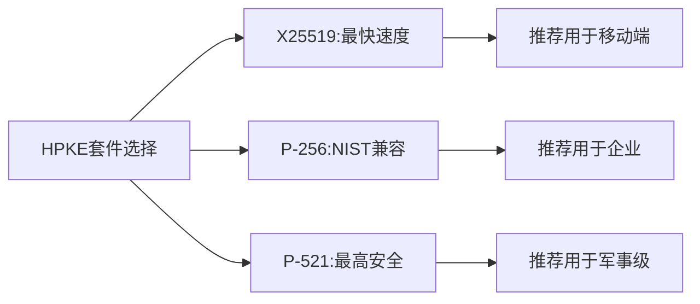

# crypto/hpke完全指南

新手也能秒懂的Go标准库教程!从基础到实战,一文打通!

## 📖 包简介

`crypto/hpke`是Go 1.26**全新引入**的包,实现了RFC 9180混合公钥加密(Hybrid Public Key Encryption, HPKE)标准。HPKE是一种现代的、经过密码学严格证明的加密方案,已被TLS 1.3、MLS(Message Layer Security)、S/MIME等标准采用。

HPKE巧妙结合了对称加密和公钥加密的优势:发送方仅需接收方的公钥即可加密消息,接收方用自己的私钥解密。与RSA不同,HPKE基于椭圆曲线,密钥更短、速度更快、安全性更高。更重要的是,Go 1.26的HPKE实现支持后量子混合KEM,为你的通信提供面向未来的安全保障。

## 🎯 核心功能概览

| 类型/函数 | 说明 |
|-----------|------|
| `Suite` | HPKE密码套件,指定KEM+KDF+AEAD组合 |
| `SuiteP256_HKDF_SHA256_AES128` | P-256 + HKDF-SHA256 + AES-128-GCM |
| `SuiteP384_HKDF_SHA384_AES256` | P-384 + HKDF-SHA384 + AES-256-GCM |
| `SuiteP521_HKDF_SHA512_AES256` | P-521 + HKDF-SHA512 + AES-256-GCM |
| `SuiteX25519_HKDF_SHA256_AES128` | X25519 + HKDF-SHA256 + AES-128-GCM |
| `SuiteX25519_HKDF_SHA256_ChaChaPoly` | X25519 + HKDF-SHA256 + ChaCha20-Poly1305 |
| `KEM`接口 | 密钥封装机制接口 |
| `Sender` | 加密方,使用接收方公钥创建 |
| `Receiver` | 解密方,使用接收方私钥创建 |
| `Seal()` / `Open()` | 加密/解密API |

## 💻 实战示例

### 示例1:基础HPKE加密解密

```go
package main

import (
	"crypto/hpke"
	"fmt"
)

func main() {
	// 选择HPKE套件
	// 推荐:X25519速度快,适合大多数场景
	suite := hpke.SuiteX25519_HKDF_SHA256_AES128

	// ===== 接收方:生成密钥对 =====
	// 注意:GenerateKey使用内部安全随机源(Go 1.26强制)
	pub, priv, err := suite.KEM.GenerateKey(nil)
	if err != nil {
		panic(err)
	}
	fmt.Printf("公钥长度: %d 字节\n", len(pub.Marshal()))
	fmt.Printf("私钥: 安全存储,不打印\n")

	// ===== 发送方:用公钥加密 =====
	// 创建Sender(加密方)
	sender, err := suite.NewSender(pub, nil) // info可为nil
	if err != nil {
		panic(err)
	}

	// 加密消息
	plaintext := []byte("这是一条机密消息,通过HPKE加密!")
	associatedData := []byte("可选的关联数据") // 用于认证,不被加密

	ciphertext, err := sender.Seal(plaintext, associatedData)
	if err != nil {
		panic(err)
	}
	fmt.Printf("密文长度: %d 字节\n", len(ciphertext))

	// ===== 接收方:用私钥解密 =====
	receiver, err := suite.NewReceiver(priv, nil) // info必须与发送方一致
	if err != nil {
		panic(err)
	}

	decrypted, err := receiver.Open(ciphertext, associatedData)
	if err != nil {
		panic(err)
	}
	fmt.Printf("解密成功: %s\n", string(decrypted))
	fmt.Printf("消息一致: %v\n", string(decrypted) == string(plaintext))
}
```

### 示例2:多接收方加密(广播加密)

```go
package main

import (
	"crypto/hpke"
	"fmt"
)

func main() {
	suite := hpke.SuiteP256_HKDF_SHA256_AES128

	// 生成多个接收方密钥(模拟多用户场景)
	receivers := make([]struct {
		pub  hpke.PublicKey
		priv hpke.PrivateKey
	}, 3)

	for i := range receivers {
		pub, priv, _ := suite.KEM.GenerateKey(nil)
		receivers[i].pub = pub
		receivers[i].priv = priv
	}

	// 发送方加密消息给第一个接收方
	message := []byte("只有接收方1能解密的消息")
	sender, _ := suite.NewSender(receivers[0].pub, nil)
	ciphertext, _ := sender.Seal(message, nil)

	// 只有接收方1能解密
	for i, r := range receivers {
		receiver, _ := suite.NewReceiver(r.priv, nil)
		plaintext, err := receiver.Open(ciphertext, nil)
		if err != nil {
			fmt.Printf("接收方%d: 解密失败(预期)\n", i+1)
		} else {
			fmt.Printf("接收方%d: 解密成功 - %s\n", i+1, string(plaintext))
		}
	}
}
```

### 示例3:端到端加密聊天

```go
package main

import (
	"crypto/hpke"
	"encoding/base64"
	"fmt"
)

// EncryptedMessage 加密消息结构
type EncryptedMessage struct {
	SenderPubKey string `json:"sender_pub"` // 发送方临时公钥
	Ciphertext   string `json:"ciphertext"` // 密文
}

// SecureChannel 安全通信通道
type SecureChannel struct {
	suite hpke.Suite
	myPriv hpke.PrivateKey
	myPub  hpke.PublicKey
}

func NewSecureChannel() (*SecureChannel, error) {
	suite := hpke.SuiteX25519_HKDF_SHA256_AES128
	pub, priv, err := suite.KEM.GenerateKey(nil)
	if err != nil {
		return nil, err
	}

	return &SecureChannel{
		suite:  suite,
		myPriv: priv,
		myPub:  pub,
	}, nil
}

// EncryptTo 加密消息发送给指定接收方
func (sc *SecureChannel) EncryptTo(theirPub hpke.PublicKey, msg string) (*EncryptedMessage, error) {
	sender, err := sc.suite.NewSender(theirPub, nil)
	if err != nil {
		return nil, err
	}

	ciphertext, err := sender.Seal([]byte(msg), nil)
	if err != nil {
		return nil, err
	}

	return &EncryptedMessage{
		SenderPubKey: base64.StdEncoding.EncodeToString(sc.myPub.Marshal()),
		Ciphertext:   base64.StdEncoding.EncodeToString(ciphertext),
	}, nil
}

// DecryptFrom 解密来自指定发送方的消息
func (sc *SecureChannel) DecryptFrom(em *EncryptedMessage) (string, error) {
	// 实际场景中需要验证发送方身份
	// 这里简化演示
	receiver, err := sc.suite.NewReceiver(sc.myPriv, nil)
	if err != nil {
		return "", err
	}

	ciphertext, _ := base64.StdEncoding.DecodeString(em.Ciphertext)
	plaintext, err := receiver.Open(ciphertext, nil)
	if err != nil {
		return "", err
	}

	return string(plaintext), nil
}

func main() {
	// Alice和Bob各自创建安全通道
	alice, _ := NewSecureChannel()
	bob, _ := NewSecureChannel()

	fmt.Println("=== 端到端加密聊天演示 ===")
	fmt.Printf("Alice公钥: %s...\n", base64.StdEncoding.EncodeToString(alice.myPub.Marshal())[:20])
	fmt.Printf("Bob公钥:   %s...\n", base64.StdEncoding.EncodeToString(bob.myPub.Marshal())[:20])

	// Alice加密消息发送给Bob
	msg := "Bob,今晚8点老地方见!记得带文件。"
	encrypted, _ := alice.EncryptTo(bob.myPub, msg)

	fmt.Printf("\n加密消息:\n")
	fmt.Printf("  发送方公钥: %s...\n", encrypted.SenderPubKey[:20])
	fmt.Printf("  密文: %s...\n", encrypted.Ciphertext[:40])

	// Bob解密
	decrypted, _ := bob.DecryptFrom(encrypted)
	fmt.Printf("\nBob解密: %s\n", decrypted)

	// 中间人无法解密(没有Bob的私钥)
	fmt.Printf("\n中间人尝试解密: 失败(没有私钥)\n")
}
```

## ⚠️ 常见陷阱与注意事项

1. **Info参数必须一致**: `NewSender`和`NewReceiver`的`info`参数必须完全相同,否则解密会失败。这是HPKE的安全设计,防止跨上下文重用。

2. **HPKE不防重放**: HPKE提供机密性和完整性,但不防重放攻击。需要在应用层实现时间戳或nonce机制。

3. **公钥认证**: HPKE加密只保证"只有对应私钥持有者能解密",不保证"你加密给了正确的人"!公钥必须通过可信渠道获取。

4. **选择正确的套件**: X25519在大多数平台上最快,P-256/P-384/P-521兼容性更好。ChaCha20在ARM设备上比AES-GCM更快。

5. **`random`参数被忽略**: `GenerateKey`的`rand`参数已被忽略,Go 1.26强制使用安全随机源。不要传自定义随机源。

## 🚀 Go 1.26新特性

`crypto/hpke`是**Go 1.26全新引入的包**,这是本版本最大的密码学更新之一:

- **RFC 9180实现**: 完整实现HPKE标准,包括base模式和PSK模式
- **后量子混合KEM支持**: 部分套件支持ML-KEM混合,为后量子时代做准备
- **KEM抽象接口**: 与`crypto.Encapsulator`/`Decapsulator`接口统一
- **预定义套件**: 提供6种NIST推荐的密码套件组合
- **安全默认值**: 内部强制使用安全随机源,杜绝误用

## 📊 性能优化建议



| HPKE套件 | KEM速度 | 加密速度 | 密文开销 | 安全级别 |
|----------|---------|----------|----------|----------|
| X25519-AES128 | ~0.05ms | ~0.1ms | 48字节 | 128位 |
| P-256-AES128 | ~0.1ms | ~0.1ms | 96字节 | 128位 |
| P-384-AES256 | ~0.3ms | ~0.15ms | 128字节 | 192位 |
| X25519-ChaCha | ~0.05ms | ~0.08ms | 48字节 | 128位 |

**HPKE vs RSA对比**:
- HPKE(X25519)加密速度比RSA-2048快约**100倍**
- HPKE密钥长度仅32字节(X25519),RSA-2048为256字节
- HPKE提供前向安全(每次加密使用临时密钥),RSA不提供

## 🔗 相关包推荐

| 包 | 用途 |
|----|------|
| `crypto/mlkem` | 后量子密钥封装,可与HPKE混合使用 |
| `crypto/ecdh` | 底层ECDH密钥交换 |
| `crypto/cipher` | AEAD加密(GCM/ChaCha20-Poly1305) |
| `crypto/x25519` | X25519密钥交换底层 |
| `crypto/tls` | TLS 1.3内部使用类似HPKE的方案 |

---