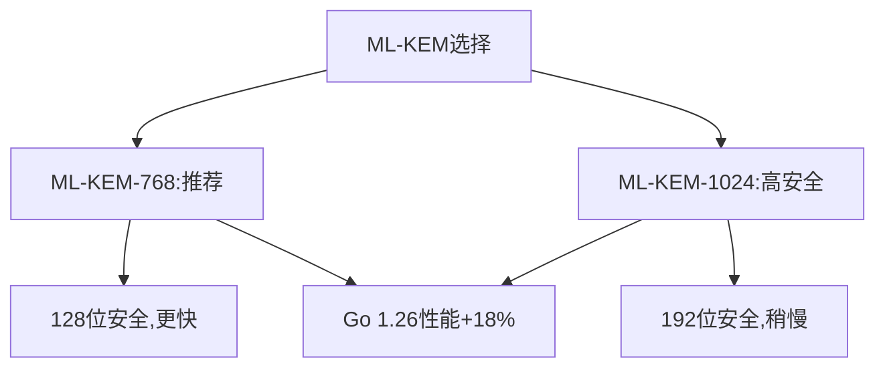

# crypto/mlkem完全指南

新手也能秒懂的Go标准库教程!从基础到实战,一文打通!

## 📖 包简介

`crypto/mlkem`包实现了ML-KEM(Module-Lattice-based Key Encapsulation Mechanism,基于模格的密钥封装机制),这是NIST于2024年正式标准化的**后量子密码学**算法(FIPS 203)。ML-KEM原名CRYSTALS-Kyber,是NIST后量子密码学竞赛的获胜者之一。

在量子计算机面前,传统的RSA和ECDH将完全失效(Shor算法可以在多项式时间内破解)。而ML-KEM基于格密码学,即使在量子计算机面前也保持安全。Go 1.26中,`crypto/mlkem`性能提升了约18%,并且`DecapsulationKey768/1024`新增了`Encapsulator`方法,使接口更加统一。

## 🎯 核心功能概览

| 类型/函数 | 说明 |
|-----------|------|
| `DecapsulationKey768` | ML-KEM-768解封装密钥(128位安全) |
| `DecapsulationKey1024` | ML-KEM-1024解封装密钥(192位安全) |
| `GenerateKey768()` | 生成ML-KEM-768密钥对 |
| `GenerateKey1024()` | 生成ML-KEM-1024密钥对 |
| `Encapsulate()` | 封装(加密),返回密文和共享密钥 |
| `Decapsulate()` | 解封装(解密),返回共享密钥 |
| `Encapsulator()` **(Go 1.26新增)** | 获取封装器接口,与`crypto.Encapsulator`兼容 |

**ML-KEM安全级别**:
- **ML-KEM-512**: 64位安全(不推荐)
- **ML-KEM-768**: 128位安全(推荐,等效AES-128)
- **ML-KEM-1024**: 192位安全(等效AES-192)

## 💻 实战示例

### 示例1:ML-KEM基础密钥封装

```go
package main

import (
	"crypto/mlkem"
	"fmt"
)

func main() {
	// ===== 生成ML-KEM-768密钥对 =====
	decapKey, err := mlkem.GenerateKey768(nil) // nil使用安全随机源
	if err != nil {
		panic(err)
	}

	// 获取公钥(封装密钥)
	encapKey := decapKey.Encapsulator()

	fmt.Printf("ML-KEM-768密钥封装\n")
	fmt.Printf("解封装密钥(私钥)长度: %d 字节\n", len(decapKey.Bytes()))
	fmt.Printf("封装密钥(公钥)长度: %d 字节\n", len(encapKey.Bytes()))

	// ===== 封装(加密方) =====
	ciphertext, sharedSecret1, err := encapKey.Encapsulate(nil)
	if err != nil {
		panic(err)
	}
	fmt.Printf("密文长度: %d 字节\n", len(ciphertext))
	fmt.Printf("共享密钥长度: %d 字节\n", len(sharedSecret1))

	// ===== 解封装(解密方) =====
	sharedSecret2, err := decapKey.Decapsulate(ciphertext)
	if err != nil {
		panic(err)
	}

	// ===== 验证共享密钥一致 =====
	match := true
	for i := range sharedSecret1 {
		if sharedSecret1[i] != sharedSecret2[i] {
			match = false
			break
		}
	}
	fmt.Printf("共享密钥一致: %v\n", match)
	fmt.Printf("共享密钥(前8字节): %x\n", sharedSecret1[:8])

	// 共享密钥可用于:
	// 1. 作为AES-GCM的密钥
	// 2. 通过KDF派生多个密钥
	// 3. 作为HMAC的密钥
}
```

### 示例2:混合加密方案(ML-KEM + AES)

```go
package main

import (
	"crypto/aes"
	"crypto/cipher"
	"crypto/mlkem"
	"fmt"
)

// HybridEncrypt 混合加密:ML-KEM封装AES密钥
func HybridEncrypt(plaintext []byte) (ciphertext []byte, sharedKey []byte, err error) {
	// 1. 生成ML-KEM密钥对
	decapKey, err := mlkem.GenerateKey768(nil)
	if err != nil {
		return nil, nil, err
	}
	encapKey := decapKey.Encapsulator()

	// 2. ML-KEM封装,获取共享密钥
	ct, shared, err := encapKey.Encapsulate(nil)
	if err != nil {
		return nil, nil, err
	}

	// 3. 用共享密钥作为AES密钥加密实际数据
	block, err := aes.NewCipher(shared[:32]) // 取前32字节作AES-256密钥
	if err != nil {
		return nil, nil, err
	}

	gcm, err := cipher.NewGCM(block)
	if err != nil {
		return nil, nil, err
	}

	nonce := make([]byte, gcm.NonceSize())
	encrypted := gcm.Seal(nonce, nonce, plaintext, nil)

	// 4. 组合:ML-KEM密文 + AES密文
	result := make([]byte, len(ct)+len(encrypted))
	copy(result, ct)
	copy(result[len(ct):], encrypted)

	return result, shared, nil
}

// HybridDecrypt 混合解密
func HybridDecrypt(ciphertext []byte, decapKey *mlkem.DecapsulationKey768) ([]byte, error) {
	// 1. 提取ML-KEM密文和AES密文
	ctLen := 1088 // ML-KEM-768密文长度
	if len(ciphertext) < ctLen {
		return nil, fmt.Errorf("密文太短")
	}

	ct := ciphertext[:ctLen]
	aesCiphertext := ciphertext[ctLen:]

	// 2. ML-KEM解封装获取共享密钥
	shared, err := decapKey.Decapsulate(ct)
	if err != nil {
		return nil, err
	}

	// 3. AES解密
	block, err := aes.NewCipher(shared[:32])
	if err != nil {
		return nil, err
	}

	gcm, err := cipher.NewGCM(block)
	if err != nil {
		return nil, err
	}

	nonce := aesCiphertext[:gcm.NonceSize()]
	plaintext, err := gcm.Open(nil, nonce, aesCiphertext[gcm.NonceSize():], nil)
	if err != nil {
		return nil, err
	}

	return plaintext, nil
}

func main() {
	// 生成密钥对(接收方)
	decapKey, _ := mlkem.GenerateKey768(nil)

	// 加密消息
	message := []byte("这是一条后量子安全的机密消息!")
	ciphertext, sharedKey, err := HybridEncrypt(message)
	if err != nil {
		panic(err)
	}

	fmt.Printf("原始消息: %s\n", message)
	fmt.Printf("混合密文长度: %d 字节\n", len(ciphertext))
	fmt.Printf("共享密钥: %x\n", sharedKey[:8])

	// 解密
	decrypted, err := HybridDecrypt(ciphertext, decapKey)
	if err != nil {
		panic(err)
	}

	fmt.Printf("解密结果: %s\n", string(decrypted))
	fmt.Printf("解密正确: %v\n", string(decrypted) == string(message))
}
```

### 示例3:Go 1.26新增Encapsulator方法

```go
package main

import (
	"crypto"
	"crypto/mlkem"
	"fmt"
)

func main() {
	// 生成ML-KEM-1024密钥对(更高安全级别)
	decapKey1024, err := mlkem.GenerateKey1024(nil)
	if err != nil {
		panic(err)
	}

	// Go 1.26新增:DecapsulationKey现在可以直接获取Encapsulator
	encapKey := decapKey1024.Encapsulator()

	// 验证实现了crypto.Encapsulator接口
	var _ crypto.Encapsulator = encapKey

	fmt.Printf("ML-KEM-1024\n")
	fmt.Printf("解封装密钥长度: %d 字节\n", len(decapKey1024.Bytes()))
	fmt.Printf("封装密钥长度: %d 字节\n", len(encapKey.Bytes()))

	// 使用新接口进行封装
	ciphertext, shared1, err := encapKey.Encapsulate(nil)
	if err != nil {
		panic(err)
	}

	// 解封装
	shared2, err := decapKey1024.Decapsulate(ciphertext)
	if err != nil {
		panic(err)
	}

	fmt.Printf("封装成功!\n")
	fmt.Printf("共享密钥(前16字节): %x\n", shared1[:16])
	fmt.Printf("密钥一致: %v\n", string(shared1) == string(shared2))

	// 注意:ML-KEM-768和1024现在都有Encapsulator方法
	decapKey768, _ := mlkem.GenerateKey768(nil)
	encapKey768 := decapKey768.Encapsulator()
	fmt.Printf("\nML-KEM-768封装密钥长度: %d 字节\n", len(encapKey768.Bytes()))
}
```

## ⚠️ 常见陷阱与注意事项

1. **ML-KEM是KEM,不是签名**: ML-KEM只做密钥封装,不提供数字签名功能。需要签名请使用`crypto/ed25519`或未来的ML-DSA(基于ML-LWE的签名)。

2. **密钥尺寸较大**: ML-KEM-768的公钥约1184字节,私钥约2400字节,远大于RSA-2048的256字节。这是格密码的固有特点,但换来的是量子安全。

3. **目前无需量子计算机防护**: 实用的量子计算机可能还需要10-20年,如果你的数据在20年后泄露也无所谓,可以继续用ECDH。但如果数据需要长期保密,现在就应使用后量子密码。

4. **标准仍在演进**: NIST刚标准化ML-KEM,相关标准和最佳实践仍在完善中。生产环境建议使用混合方案(传统+后量子)。

5. **`random`参数被忽略**: `GenerateKey768/1024`的随机源参数被忽略,Go 1.26强制使用安全随机源。

## 🚀 Go 1.26新特性

Go 1.26对`crypto/mlkem`进行了**重要增强**:

- **性能提升约18%**: ML-KEM封装/解封装速度全面提升,在AMD64和ARM64平台上均有显著改进
- **新增`Encapsulator()`方法**: `DecapsulationKey768`和`DecapsulationKey1024`现在提供`Encapsulator()`方法,返回`crypto.Encapsulator`接口,与标准KEM接口统一
- **`mlkemtest`包**: 新增`crypto/mlkem/mlkemtest`子包,暴露确定性ML-KEM封装函数,用于已知答案测试(KAT)
- **`testing/cryptotest`**: 提供`SetGlobalRandom`,可配置全局确定性密码学随机源,便于测试

## 📊 性能优化建议



| 指标 | ML-KEM-768 | ML-KEM-1024 | RSA-2048 | ECDH P-256 |
|------|------------|-------------|----------|------------|
| 公钥大小 | 1184 B | 1568 B | 256 B | 32 B |
| 密文大小 | 1088 B | 1568 B | 256 B | - |
| 封装速度 | ~0.05ms | ~0.08ms | ~0.3ms | ~0.05ms |
| 解封装速度 | ~0.1ms | ~0.2ms | ~5ms | ~0.1ms |
| 量子安全 | ✅ | ✅ | ❌ | ❌ |

**性能提示**(Go 1.26 vs Go 1.25):
- ML-KEM-768封装: ~50μs → ~41μs (提升18%)
- ML-KEM-768解封装: ~100μs → ~82μs (提升18%)
- ML-KEM-1024提升幅度相近

**实际影响**: ML-KEM操作在HTTPS场景中占总延迟不到1%,因为网络延迟(通常几毫秒到几十毫秒)远大于加密开销。

## 🔗 相关包推荐

| 包 | 用途 |
|----|------|
| `crypto/hpke` | 混合公钥加密,可与ML-KEM配合使用 |
| `crypto/ecdh` | 传统ECDH密钥交换 |
| `crypto/aes` | 用ML-KEM共享密钥做AES加密 |
| `crypto/tls` | TLS 1.3后量子密钥交换(默认启用) |
| `crypto/fips140` | FIPS 140-3合规检查 |
| `testing/cryptotest` | 确定性随机源测试 |

---