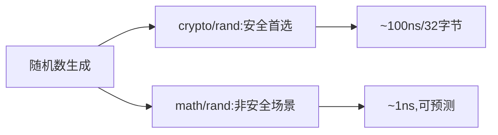

# crypto/rand完全指南

新手也能秒懂的Go标准库教程!从基础到实战,一文打通!

## 📖 包简介

`crypto/rand`包提供密码学安全的伪随机数生成器(CSPRNG)。与`math/rand`不同,`crypto/rand`的输出是**不可预测的**,即使攻击者知道了之前生成的所有随机数,也无法预测下一个随机数。这是密码学操作的基石。

生成密钥、nonce、盐值、session ID、CSRF令牌......所有需要"真正随机"的场景,都必须使用`crypto/rand`。Go 1.26中,`crypto/rand`最重要的变化是:所有加密包中的`random`参数已被忽略,统一使用内部安全随机源,彻底消除了因开发者误用`math/rand`导致的安全漏洞。

## 🎯 核心功能概览

| 函数/类型 | 说明 |
|-----------|------|
| `Reader io.Reader` | 全局安全随机源(底层调用OS随机源) |
| `Int(rand io.Reader, max *big.Int)` | 生成[0, max)范围内的随机整数 |
| `Prime()` | 生成大素数(RSA密钥生成用) |
| `Read([]byte)` | 读取随机字节(最常用) |

**随机源对比**:
| 特性 | `math/rand` | `crypto/rand` |
|------|-------------|---------------|
| 可预测性 | 可预测(知道种子即可) | 不可预测 |
| 速度 | 极快 | 较快 |
| 用途 | 模拟/游戏/测试 | 密码学/安全 |
| 种子 | 可设置 | 不可设置(系统自动) |

## 💻 实战示例

### 示例1:生成随机字节和密钥

```go
package main

import (
	"crypto/rand"
	"encoding/base64"
	"encoding/hex"
	"fmt"
	"math/big"
)

func main() {
	// ===== 方式1:直接Read(最常用) =====
	key := make([]byte, 32) // 256位
	_, err := rand.Read(key)
	if err != nil {
		panic(err)
	}
	fmt.Printf("随机密钥(hex): %x\n", key)
	fmt.Printf("随机密钥(b64): %s\n", base64.StdEncoding.EncodeToString(key))

	// ===== 方式2:生成随机整数 =====
	// 生成[0, 100)之间的随机数
	n, err := rand.Int(rand.Reader, big.NewInt(100))
	if err != nil {
		panic(err)
	}
	fmt.Printf("随机数[0,100): %d\n", n)

	// ===== 方式3:生成随机字符串 =====
	randomStr := GenerateRandomString(16)
	fmt.Printf("随机字符串: %s\n", randomStr)

	// ===== 方式4:生成Nonce =====
	nonce := make([]byte, 12) // GCM推荐12字节
	rand.Read(nonce)
	fmt.Printf("GCM Nonce: %x\n", nonce)

	// ===== 方式5:生成盐值 =====
	salt := make([]byte, 16)
	rand.Read(salt)
	fmt.Printf("密码盐值: %x\n", salt)
}

// GenerateRandomString 生成指定长度的URL安全随机字符串
func GenerateRandomString(length int) string {
	bytes := make([]byte, length)
	rand.Read(bytes)
	// 使用URL安全的Base64编码
	return base64.URLEncoding.EncodeToString(bytes)[:length]
}
```

### 示例2:安全的Session ID和CSRF令牌生成

```go
package main

import (
	"crypto/rand"
	"encoding/base64"
	"fmt"
	"sync"
)

// TokenGenerator 安全令牌生成器
type TokenGenerator struct {
	mu   sync.Mutex
	buf  [64]byte // 预分配缓冲区
}

func NewTokenGenerator() *TokenGenerator {
	return &TokenGenerator{}
}

// GenerateSessionID 生成256位Session ID
func (tg *TokenGenerator) GenerateSessionID() string {
	return tg.generateToken(32) // 32字节=256位
}

// GenerateCSRFToken 生成256位CSRF令牌
func (tg *TokenGenerator) GenerateCSRFToken() string {
	return tg.generateToken(32)
}

// GenerateAPIKey 生成512位API密钥
func (tg *TokenGenerator) GenerateAPIKey() string {
	return "api_" + tg.generateToken(64) // 前缀便于识别
}

func (tg *TokenGenerator) generateToken(length int) string {
	tg.mu.Lock()
	defer tg.mu.Unlock()

	// 使用预分配缓冲区(减少分配)
	n, err := rand.Read(tg.buf[:length])
	if err != nil || n != length {
		panic("随机数生成失败")
	}

	return base64.RawURLEncoding.EncodeToString(tg.buf[:length])
}

func main() {
	gen := NewTokenGenerator()

	// 生成Session ID
	sessionID := gen.GenerateSessionID()
	fmt.Printf("Session ID: %s\n", sessionID)

	// 生成 CSRF Token
	csrf := gen.GenerateCSRFToken()
	fmt.Printf("CSRF Token: %s\n", csrf)

	// 生成 API Key
	apiKey := gen.GenerateAPIKey()
	fmt.Printf("API Key:    %s\n", apiKey)

	// 验证随机性(连续生成1000个Session ID不应有重复)
	seen := make(map[string]bool)
	duplicates := 0
	for i := 0; i < 1000; i++ {
		id := gen.GenerateSessionID()
		if seen[id] {
			duplicates++
		}
		seen[id] = true
	}
	fmt.Printf("1000次生成中重复次数: %d (应为0)\n", duplicates)
}
```

### 示例3:Go 1.26新API——testing/cryptotest

```go
package main

import (
	"crypto/rand"
	"fmt"
)

// 示例:使用确定性随机源进行测试
// 注意:SetGlobalRandom仅在testing/cryptotest包中,
// 这里演示概念

// SecureRandomBytes 生产代码中的随机字节生成
func SecureRandomBytes(n int) ([]byte, error) {
	b := make([]byte, n)
	_, err := rand.Read(b)
	if err != nil {
		return nil, err
	}
	return b, nil
}

// ===== 测试代码(在_test.go文件中) =====
// 
// import (
//     "testing"
//     "testing/cryptotest"
// )
// 
// func TestSecureRandomBytes(t *testing.T) {
//     // 设置确定性随机源(测试期间全局生效)
//     // 使用固定的种子,确保测试可复现
//     cryptotest.SetGlobalRandom(t, []byte("fixed-test-seed"))
// 
//     // 现在所有crypto/rand调用都返回确定性随机数
//     b1, _ := SecureRandomBytes(16)
//     b2, _ := SecureRandomBytes(16)
// 
//     // 在确定性模式下,相同长度的输出应该相同
//     // (因为内部状态由测试控制)
//     if len(b1) != 16 || len(b2) != 16 {
//         t.Errorf("长度不正确")
//     }
// 
//     // 测试结束后自动恢复全局随机源
// }

func main() {
	// 生产环境使用
	bytes, err := SecureRandomBytes(16)
	if err != nil {
		panic(err)
	}
	fmt.Printf("安全随机字节: %x\n", bytes)

	// 注意:
	// 1. Go 1.26中所有crypto包的random参数被忽略
	// 2. 统一使用内部安全随机源
	// 3. 测试时使用testing/cryptotest.SetGlobalRandom
}
```

## ⚠️ 常见陷阱与注意事项

1. **永远不要用`math/rand`生成密码学随机数**: `math/rand`的输出是完全可预测的!如果知道种子(甚至只需要观察少量输出),攻击者可以预测所有"随机"值。**密钥/nonce/盐值/session ID必须用`crypto/rand`**。

2. **`rand.Read`不会阻塞**(通常): 在Linux上,`crypto/rand`读取`getrandom()`系统调用,不会像`/dev/random`那样在熵池耗尽时阻塞。但如果系统熵池严重不足,可能会返回错误。

3. **不要试图"增强"随机性**: 有些开发者会把`crypto/rand`和`math/rand`混合使用试图"更安全",这反而可能降低安全性。直接用`crypto/rand`就够了。

4. **`rand.Int`的上限排除**: `rand.Int(reader, max)`生成的是`[0, max)`范围的整数,不包含max。需要`[1, max]`请传入`max+1`。

5. **Go 1.26后`random`参数被忽略**: `rsa.GenerateKey()`、`ecdsa.GenerateKey()`等函数中的`rand.Reader`参数已被忽略,强制使用内部安全随机源。不要再传自定义随机源!

## 🚀 Go 1.26新特性

Go 1.26对`crypto/rand`的更新是**系统性的安全增强**:

- **`random`参数全局忽略**: 所有加密包中的`random io.Reader`参数被忽略,内部强制使用安全随机源。这彻底杜绝了开发者误用`math/rand`或不安全随机源的风险。
- **`testing/cryptotest.SetGlobalRandom`**: 新增测试工具,可在测试期间配置全局确定性密码学随机源,使密码学测试可复现。测试结束后自动恢复。
- **内部随机源增强**: 底层随机数生成实现经过审查和优化,更好地利用操作系统提供的熵源。

## 📊 性能优化建议



| 操作 | 速度 | 说明 |
|------|------|------|
| `rand.Read(32字节)` | ~100-200ns | 系统调用开销 |
| `rand.Read(1KB)` | ~500ns | 批量更高效 |
| `math/rand.Int63()` | ~1ns | 非密码学安全 |
| 生成RSA-2048密钥 | ~50ms | 主要是素数生成 |

**优化建议**:
1. **批量读取**: 如果需要大量随机字节,一次性读取比多次小量读取更高效
2. **预分配缓冲区**: 如示例2所示,复用缓冲区减少内存分配
3. **不要过度生成**: 256位随机数已有2^256种可能,不需要"更多随机性"

## 🔗 相关包推荐

| 包 | 用途 |
|----|------|
| `math/rand` | 非密码学安全的随机数(模拟/游戏) |
| `crypto/aes` | 需要随机生成nonce/IV |
| `crypto/rsa` | 需要随机生成密钥(参数已忽略) |
| `crypto/hmac` | 需要随机生成密钥 |
| `testing/cryptotest` | 确定性随机源测试(Go 1.26新增) |
| `crypto/subtle` | WithDataIndependentTiming(不再锁线程) |

---