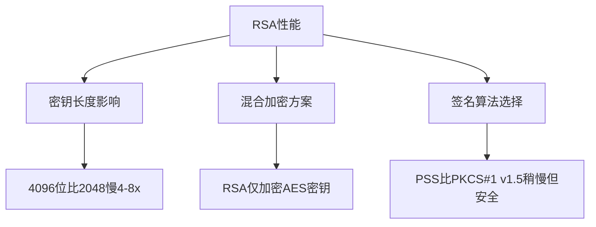

# crypto/rsa完全指南

新手也能秒懂的Go标准库教程!从基础到实战,一文打通!

## 📖 包简介

`crypto/rsa`包实现了RSA公钥加密算法,这是互联网安全基础设施的核心之一。SSL/TLS证书签名、JWT令牌、SSH密钥认证、数字签名......RSA无处不在。

与对称加密(AES)不同,RSA使用一对密钥:公钥和私钥。公钥可以公开分发,用于加密或验证签名;私钥必须严格保密,用于解密或生成签名。Go 1.26为RSA带来了重要更新——新增`EncryptOAEPWithOptions`支持自定义哈希,同时将不安全的PKCS#1 v1.5加密标记为废弃。

## 🎯 核心功能概览

| 函数/类型 | 说明 |
|-----------|------|
| `PrivateKey` | RSA私钥结构体 |
| `PublicKey` | RSA公钥结构体 |
| `GenerateKey()` | 生成RSA密钥对 |
| `EncryptOAEP()` | OAEP加密(推荐) |
| `EncryptOAEPWithOptions()` **(Go 1.26新增)** | OAEP加密,支持自定义哈希 |
| `DecryptOAEP()` | OAEP解密 |
| `SignPKCS1v15()` | PKCS#1 v1.5签名 |
| `SignPSS()` | PSS签名(推荐) |
| `VerifyPKCS1v15()` | 验证PKCS#1 v1.5签名 |
| `VerifyPSS()` | 验证PSS签名 |

**加密方案选择**:
- **OAEP**(推荐): 可证明安全,支持自定义标签
- **PKCS#1 v1.5加密**(已废弃): 存在选择密文攻击风险

## 💻 实战示例

### 示例1:RSA密钥生成与加解密

```go
package main

import (
	"crypto/rand"
	"crypto/rsa"
	"crypto/sha256"
	"encoding/pem"
	"fmt"
	"os"
)

func main() {
	// 生成2048位RSA密钥(最小推荐长度)
	privateKey, err := rsa.GenerateKey(rand.Reader, 2048)
	if err != nil {
		panic(err)
	}
	publicKey := &privateKey.PublicKey

	// 保存到PEM文件
	SavePEM("private.pem", "RSA PRIVATE KEY", x509.MarshalPKCS1PrivateKey(privateKey))
	SavePEM("public.pem", "RSA PUBLIC KEY", x509.MarshalPKCS1PublicKey(publicKey))

	// 加密
	message := []byte("Secret message for RSA!")
	ciphertext, err := rsa.EncryptOAEP(
		sha256.New(),
		rand.Reader,
		publicKey,
		message,
		nil, // label(可选)
	)
	if err != nil {
		panic(err)
	}
	fmt.Printf("密文长度: %d 字节\n", len(ciphertext))

	// 解密
	plaintext, err := privateKey.Decrypt(nil, ciphertext, &rsa.OAEPOptions{
		Hash: crypto.SHA256,
	})
	if err != nil {
		panic(err)
	}
	fmt.Printf("解密成功: %s\n", string(plaintext))
}

func SavePEM(filename, blockType string, data []byte) {
	block := &pem.Block{
		Type:  blockType,
		Bytes: data,
	}
	f, _ := os.Create(filename)
	defer f.Close()
	pem.Encode(f, block)
}
```

### 示例2:RSA数字签名与验证

```go
package main

import (
	"crypto"
	"crypto/rand"
	"crypto/rsa"
	"crypto/sha256"
	"fmt"
)

func main() {
	// 生成密钥
	privateKey, _ := rsa.GenerateKey(rand.Reader, 2048)
	publicKey := &privateKey.PublicKey

	// 原始消息
	message := []byte("这份合同需要数字签名!")

	// ===== 方式1:PSS签名(推荐) =====
	
	// 计算哈希
	hash := sha256.Sum256(message)
	
	// PSS签名
	signature, err := rsa.SignPSS(
		rand.Reader,
		privateKey,
		crypto.SHA256,
		hash[:],
		&rsa.PSSOptions{SaltLength: rsa.PSSSaltLengthAuto},
	)
	if err != nil {
		panic(err)
	}
	fmt.Printf("PSS签名长度: %d 字节\n", len(signature))

	// 验证PSS签名
	err = rsa.VerifyPSS(
		publicKey,
		crypto.SHA256,
		hash[:],
		signature,
		&rsa.PSSOptions{SaltLength: rsa.PSSSaltLengthAuto},
	)
	if err != nil {
		fmt.Println("PSS验证失败!")
	} else {
		fmt.Println("PSS验证成功!")
	}

	// ===== 方式2:直接Sign(更简洁) =====
	signature2, err := privateKey.Sign(
		rand.Reader,
		hash[:],
		crypto.SHA256,
	)
	if err != nil {
		panic(err)
	}
	fmt.Printf("直接签名长度: %d 字节\n", len(signature2))
}
```

### 示例3:Go 1.26 EncryptOAEPWithOptions

```go
package main

import (
	"crypto"
	"crypto/rand"
	"crypto/rsa"
	"crypto/sha3"
	"crypto/sha256"
	"fmt"
)

func main() {
	privateKey, _ := rsa.GenerateKey(rand.Reader, 2048)
	publicKey := &privateKey.PublicKey

	// Go 1.26新增:EncryptOAEPWithOptions
	// 支持自定义哈希算法
	
	message := []byte("使用新API加密的数据")
	
	// 使用SHA-256(标准选择)
	opts256 := &rsa.OAEPOptions{
		Hash:  crypto.SHA256,
		Label: []byte("my-label"), // 可选标签
	}
	ciphertext, err := rsa.EncryptOAEPWithOptions(
		sha256.New(),
		rand.Reader,
		publicKey,
		message,
		opts256,
	)
	if err != nil {
		panic(err)
	}
	fmt.Printf("SHA-256加密密文长度: %d\n", len(ciphertext))

	// 使用SHA3-256(后量子时代推荐)
	opts3 := &rsa.OAEPOptions{
		Hash:  crypto.SHA3_256,
		Label: []byte("quantum-safe-label"),
	}
	ciphertext3, err := rsa.EncryptOAEPWithOptions(
		sha3.New256(),
		rand.Reader,
		publicKey,
		message,
		opts3,
	)
	if err != nil {
		panic(err)
	}
	fmt.Printf("SHA3-256加密密文长度: %d\n", len(ciphertext3))

	// 注意:PKCS#1 v1.5加密已标记为废弃!
	// 不要使用 rsa.EncryptPKCS1v15()
}
```

## ⚠️ 常见陷阱与注意事项

1. **RSA加密有长度限制**: RSA不能直接加密任意长度的数据!OAEP模式下最大加密长度为`密钥长度 - 2*哈希长度 - 2`字节。2048位密钥+SHA256最多加密190字节。**正确做法**: 用RSA加密AES密钥,再用AES加密实际数据。

2. **PKCS#1 v1.5加密已废弃**: Go 1.26将`EncryptPKCS1v15`标记为废弃,存在Bleichenbacher选择密文攻击风险。请使用OAEP。

3. **密钥长度至少2048位**: 1024位RSA已被证明可在数小时内破解。2048位是最低要求,新系统建议4096位。

4. **`random`参数被忽略**: Go 1.26中`GenerateKey`和签名函数的`rand.Reader`参数已被忽略,强制使用安全随机源。

5. **私钥内存安全**: 私钥使用后应尽快从内存中清除。Go 1.26实验性的`runtime/secret`包可以帮助安全擦除。

## 🚀 Go 1.26新特性

Go 1.26对`crypto/rsa`进行了**重要安全更新**:

- **新增`EncryptOAEPWithOptions`**: 支持自定义哈希算法和标签参数,提供更灵活的OAEP加密
- **PKCS#1 v1.5加密废弃**: `EncryptPKCS1v15`和`DecryptPKCS1v15`标记为废弃,OAEP成为唯一推荐的加密方案
- **`random`参数忽略**: 生成密钥和签名时的随机源参数被忽略,强制使用内部安全随机源
- **FIPS 140-3合规**: RSA实现在FIPS模式下经过NIST认证

## 📊 性能优化建议



| 操作 | 2048位 | 4096位 |
|------|--------|--------|
| 密钥生成 | ~50ms | ~500ms |
| 加密(OAEP) | ~0.3ms | ~2ms |
| 解密 | ~5ms | ~35ms |
| 签名(PSS) | ~5ms | ~35ms |
| 验证 | ~0.05ms | ~0.15ms |

**关键优化策略**:
1. **使用混合加密**: RSA只加密16-32字节的AES密钥,实际数据用AES加密。这是TLS、PGP等系统的标准做法。
2. **公钥操作很快**: RSA加密和验签使用公钥,速度比解密和签名快10-100倍。
3. **考虑Ed25519**: 如果只需要签名,Ed25519比RSA快得多且密钥更短。

## 🔗 相关包推荐

| 包 | 用途 |
|----|------|
| `crypto/x509` | 解析/序列化RSA证书和密钥 |
| `crypto/sha256` | OAEP和PSS推荐的哈希算法 |
| `crypto/sha3` | 后量子友好的哈希(Go 1.26零值可用) |
| `crypto/aes` | 与RSA配合做混合加密 |
| `crypto/rand` | 安全随机数(虽然参数被忽略) |
| `crypto/ed25519` | 更快的签名算法替代方案 |

---