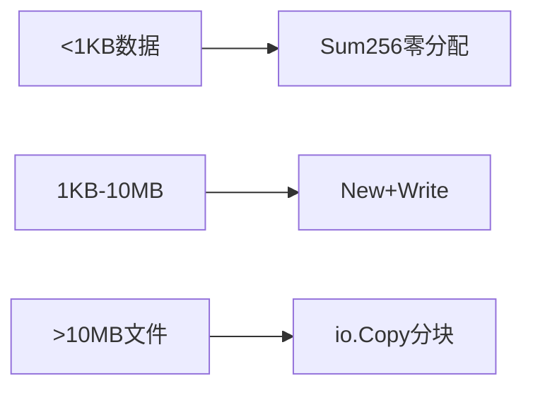

# crypto/sha256完全指南

新手也能秒懂的Go标准库教程!从基础到实战,一文打通!

## 📖 包简介

`crypto/sha256`包实现了SHA-256(Secure Hash Algorithm 256-bit)密码学哈希函数,这是目前使用最广泛的哈希算法之一。SHA-256是SHA-2家族成员,输出固定256位(32字节)摘要。

从比特币挖矿到密码存储,从文件完整性校验到数字签名,SHA-256无处不在。Go的实现经过高度优化,在现代CPU上可以达到数百MB/s的处理速度。记住:SHA-256是单向的——你无法从哈希值还原原始数据!

## 🎯 核心功能概览

| 函数/类型 | 说明 |
|-----------|------|
| `Sum256(data []byte) [32]byte` | 一次性计算SHA-256(最快) |
| `New() hash.Hash` | 创建可流式写入的哈希实例 |
| `Size = 32` | 常量,哈希输出字节数 |
| `BlockSize = 64` | 常量,内部块大小 |
| `hash.Hash`接口 | 支持Write/Sum/Reset/Size/BlockSize |

## 💻 实战示例

### 示例1:基础哈希计算

```go
package main

import (
	"crypto/sha256"
	"encoding/hex"
	"fmt"
)

func main() {
	// 方式1:一次性计算(小数据推荐)
	data := []byte("Hello, SHA-256!")
	hash := sha256.Sum256(data)
	fmt.Printf("十六进制: %x\n", hash)
	fmt.Printf("Hex编码: %s\n", hex.EncodeToString(hash[:]))

	// 方式2:流式计算(大数据推荐)
	h := sha256.New()
	h.Write([]byte("Hello, "))
	h.Write([]byte("SHA-256!"))
	result := h.Sum(nil)
	fmt.Printf("流式结果: %x\n", result)

	// 验证一致性
	fmt.Printf("结果一致: %v\n", hash == [32]byte(result))
}
```

### 示例2:文件完整性校验

```go
package main

import (
	"crypto/sha256"
	"encoding/hex"
	"fmt"
	"io"
	"os"
)

// FileSHA256 计算文件的SHA-256哈希
func FileSHA256(filepath string) (string, error) {
	f, err := os.Open(filepath)
	if err != nil {
		return "", err
	}
	defer f.Close()

	h := sha256.New()
	if _, err := io.Copy(h, f); err != nil {
		return "", err
	}

	return hex.EncodeToString(h.Sum(nil)), nil
}

// VerifyFile 验证文件完整性
func VerifyFile(filepath, expectedHash string) (bool, error) {
	actualHash, err := FileSHA256(filepath)
	if err != nil {
		return false, err
	}
	return actualHash == expectedHash, nil
}

func main() {
	// 创建测试文件
	testFile := "demo.txt"
	content := "这是用来测试SHA-256的文件内容。\n"
	os.WriteFile(testFile, []byte(content), 0644)

	// 计算哈希
	hash, err := FileSHA256(testFile)
	if err != nil {
		panic(err)
	}
	fmt.Printf("文件哈希: %s\n", hash)

	// 验证
	ok, _ := VerifyFile(testFile, hash)
	fmt.Printf("验证通过: %v\n", ok)

	// 篡改后验证
	os.WriteFile(testFile, []byte("被篡改的内容"), 0644)
	ok, _ = VerifyFile(testFile, hash)
	fmt.Printf("篡改后验证: %v (应为false)\n", ok)

	// 清理
	os.Remove(testFile)
}
```

### 示例3:密码哈希(加盐)

```go
package main

import (
	"crypto/rand"
	"crypto/sha256"
	"encoding/base64"
	"fmt"
	"io"
)

// 注意:生产环境请使用bcrypt或argon2!
// 这里仅演示SHA-256加盐的概念

type PasswordHash struct {
	Salt []byte
	Hash []byte
}

// HashPassword 对密码进行加盐哈希
func HashPassword(password string) (*PasswordHash, error) {
	// 生成16字节随机盐
	salt := make([]byte, 16)
	if _, err := io.ReadFull(rand.Reader, salt); err != nil {
		return nil, err
	}

	// 盐+密码组合后哈希
	h := sha256.New()
	h.Write(salt)
	h.Write([]byte(password))
	// 迭代多次增加破解难度(简易KDF)
	result := h.Sum(nil)
	for i := 0; i < 10000; i++ {
		h.Reset()
		h.Write(salt)
		h.Write(result)
		result = h.Sum(nil)
	}

	return &PasswordHash{
		Salt: salt,
		Hash: result,
	}, nil
}

// VerifyPassword 验证密码
func VerifyPassword(password string, ph *PasswordHash) bool {
	h := sha256.New()
	h.Write(ph.Salt)
	h.Write([]byte(password))
	result := h.Sum(nil)
	for i := 0; i < 10000; i++ {
		h.Reset()
		h.Write(ph.Salt)
		h.Write(result)
		result = h.Sum(nil)
	}

	return string(result) == string(ph.Hash)
}

func main() {
	password := "MyP@ssw0rd123!"

	ph, err := HashPassword(password)
	if err != nil {
		panic(err)
	}

	fmt.Printf("盐: %s\n", base64.StdEncoding.EncodeToString(ph.Salt))
	fmt.Printf("哈希: %x\n", ph.Hash)

	// 验证正确密码
	fmt.Printf("正确密码: %v\n", VerifyPassword(password, ph))
	// 验证错误密码
	fmt.Printf("错误密码: %v\n", VerifyPassword("WrongPassword", ph))
}
```

## ⚠️ 常见陷阱与注意事项

1. **SHA-256不是加密**: 哈希是单向函数,不可逆!不要试图用SHA-256"加密"数据,那是`crypto/aes`或`crypto/rsa`的工作。

2. **密码存储不要直接用SHA-256**: 直接`sha256(password)`极度危险,彩虹表可以秒破。至少加盐,最好使用`golang.org/x/crypto/bcrypt`或`argon2`。

3. **`Sum(nil)` vs `Sum([]byte{})`**: `Sum(nil)`追加到nil切片返回32字节哈希;`Sum(buf)`追加到已有buf后面。新手常混淆,记住`Sum(nil)`最常用。

4. **不要用于HMAC密钥派生**: 如果需要从密码派生密钥,使用HKDF或PBKDF2,不要自己设计算法。

5. **哈希碰撞抗性**: SHA-256目前未发现实际碰撞攻击,但SHA-1已被破解。永远不要降级到SHA-1。

## 🚀 Go 1.26新特性

`crypto/sha256`在Go 1.26中没有API层面的变化,但受益于:

- **底层优化**: 持续的编译器优化使SHA-256性能稳步提升
- **FIPS 140-3**: 在FIPS模式下,SHA-256实现经过NIST认证
- **与SHA-3协同**: Go 1.26中`crypto/sha3`零值可用,可以根据场景选择SHA-2或SHA-3

## 📊 性能优化建议



| 方法 | 适用场景 | 内存分配 | 速度 |
|------|----------|----------|------|
| `Sum256()` | <1KB | 0次(返回数组) | 最快 |
| `New()+Write()` | 流式数据 | 1次(hash对象) | 快 |
| `io.Copy()` | 大文件 | 32KB缓冲区 | 取决于磁盘 |

**性能数据**(现代x86 CPU,带SHA扩展):
- SHA-256速度: ~400-600 MB/s
- 无SHA扩展(如部分ARM): ~150-200 MB/s
- 对于小数据(<100字节),`Sum256()`比`New()`快约20%

## 🔗 相关包推荐

| 包 | 用途 |
|----|------|
| `crypto/sha3` | SHA-3系列,后量子友好(Go 1.26零值可用) |
| `crypto/sha512` | SHA-512,更长输出 |
| `crypto/hmac` | HMAC消息认证码 |
| `encoding/hex` | 十六进制编码 |
| `golang.org/x/crypto/bcrypt` | 密码哈希(推荐) |

---