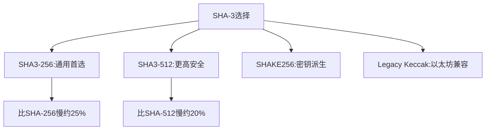

# crypto/sha3完全指南

新手也能秒懂的Go标准库教程!从基础到实战,一文打通!

## 📖 包简介

`crypto/sha3`包实现了SHA-3(Secure Hash Algorithm 3)系列哈希函数,这是NIST在2015年发布的最新哈希标准。与SHA-2不同,SHA-3基于完全不同的Keccak算法(海绵结构),这意味着即使SHA-2未来被发现漏洞,SHA-3仍然安全。

Go 1.26中,`crypto/sha3`迎来了一个贴心更新:**零值SHA-3实例现在可以直接作为SHA3-256使用**!这意味着`var h sha3.SHA3`不再panic,而是开箱即用的SHA3-256哈希器,大幅简化了代码。

## 🎯 核心功能概览

| 函数/类型 | 说明 |
|-----------|------|
| `New224()` | SHA3-224哈希(28字节输出) |
| `New256()` | SHA3-256哈希(32字节输出) |
| `New384()` | SHA3-384哈希(48字节输出) |
| `New512()` | SHA3-512哈希(64字节输出) |
| `NewLegacyKeccak256()` | 原始Keccak-256(Ethereum用) |
| `NewLegacyKeccak512()` | 原始Keccak-512 |
| `SHAKE128` | 可扩展输出函数 |
| `SHAKE256` | 可扩展输出函数 |
| `cSHAKE` | 可定制SHA3 |
| **Go 1.26**: 零值`SHA3`类型可直接用作SHA3-256 |

## 💻 实战示例

### 示例1:基础SHA-3哈希(Go 1.26零值用法)

```go
package main

import (
	"crypto/sha3"
	"encoding/hex"
	"fmt"
)

func main() {
	// ===== Go 1.26新特性:零值直接可用 =====
	var h sha3.SHA3 // 零值,自动初始化为SHA3-256
	h.Write([]byte("Hello, SHA3!"))
	result := h.Sum(nil)
	fmt.Printf("零值SHA3-256: %x\n", result[:8])

	// ===== 传统方式 =====
	h256 := sha3.New256()
	h256.Write([]byte("Hello, SHA3!"))
	result256 := h256.Sum(nil)
	fmt.Printf("New256:       %x\n", result256[:8])

	// 验证一致性
	fmt.Printf("结果一致: %v\n", hex.EncodeToString(result) == hex.EncodeToString(result256))

	// ===== 不同输出长度 =====
	h224 := sha3.New224()
	h224.Write([]byte("test"))
	fmt.Printf("SHA3-224: %x\n", h224.Sum(nil))

	h384 := sha3.New384()
	h384.Write([]byte("test"))
	fmt.Printf("SHA3-384: %x\n", h384.Sum(nil)[:8])

	h512 := sha3.New512()
	h512.Write([]byte("test"))
	fmt.Printf("SHA3-512: %x\n", h512.Sum(nil)[:8])
}
```

### 示例2:SHAKE可扩展输出

```go
package main

import (
	"encoding/hex"
	"fmt"
	"hash"
	"crypto/sha3"
)

func main() {
	data := []byte("SHAKE可扩展输出示例")

	// SHAKE128可以生成任意长度的输出
	shake128 := sha3.NewShake128()
	shake128.Write(data)

	// 生成不同长度的输出
	out64 := make([]byte, 64)
	shake128.Read(out64)
	fmt.Printf("SHAKE128(64字节): %x\n", out64[:8])

	out128 := make([]byte, 128)
	shake128.Reset()
	shake128.Write(data)
	shake128.Read(out128)
	fmt.Printf("SHAKE128(128字节): %x\n", out128[:8])

	// SHAKE256(更高安全级别)
	shake256 := sha3.NewShake256()
	shake256.Write(data)
	out256 := make([]byte, 256)
	shake256.Read(out256)
	fmt.Printf("SHAKE256(256字节): %x\n", out256[:8])

	// 实际用途:派生多个密钥
	masterSecret := []byte("master-secret-key")
	shake := sha3.NewShake256()
	shake.Write(masterSecret)

	encryptionKey := make([]byte, 32) // AES-256密钥
	shake.Read(encryptionKey)

	macKey := make([]byte, 32) // HMAC密钥
	shake.Read(macKey)

	fmt.Printf("派生加密密钥: %x\n", encryptionKey[:8])
	fmt.Printf("派生MAC密钥:  %x\n", macKey[:8])
}
```

### 示例3:以太坊地址生成(Legacy Keccak)

```go
package main

import (
	"crypto/sha3"
	"encoding/hex"
	"fmt"
)

// EthereumAddress 从公钥生成以太坊地址
func EthereumAddress(publicKey []byte) string {
	// 以太坊使用Legacy Keccak-256(不是标准SHA3-256!)
	hash := sha3.NewLegacyKeccak256()
	hash.Write(publicKey)
	hashBytes := hash.Sum(nil)

	// 取最后20字节作为地址
	address := hashBytes[12:]
	return "0x" + hex.EncodeToString(address)
}

func main() {
	// 模拟公钥(实际是椭圆曲线点的未压缩格式,64字节)
	publicKey := make([]byte, 64)
	for i := range publicKey {
		publicKey[i] = byte(i)
	}

	address := EthereumAddress(publicKey)
	fmt.Printf("以太坊地址: %s\n", address)
	fmt.Printf("地址长度: %d 字符\n", len(address))

	// 对比:标准SHA3-256 vs Legacy Keccak-256
	data := []byte("test")
	
	sha3Hash := sha3.New256()
	sha3Hash.Write(data)
	
	keccakHash := sha3.NewLegacyKeccak256()
	keccakHash.Write(data)
	
	fmt.Printf("SHA3-256:     %x\n", sha3Hash.Sum(nil)[:8])
	fmt.Printf("Keccak-256:   %x\n", keccakHash.Sum(nil)[:8])
	fmt.Printf("两者不同: %v\n", 
		string(sha3Hash.Sum(nil)) != string(keccakHash.Sum(nil)))
}
```

## ⚠️ 常见陷阱与注意事项

1. **SHA3-256 ≠ Keccak-256**: NIST标准化SHA-3时修改了padding,导致SHA3-256与原始Keccak-256输出不同!以太坊使用Keccak-256,不是SHA3-256。Go提供了`NewLegacyKeccak256()`。

2. **零值在Go 1.26之前会panic**: 如果你维护的代码需要兼容旧版本Go,不要依赖零值特性,请使用`New256()`。

3. **SHA-3比SHA-256慢**: 由于海绵结构,SHA-3在软件实现中通常比SHA-256慢20-30%。除非有特殊安全需求,SHA-256仍是首选。

4. **SHAKE只能读一次**: `SHAKE.Read()`会消耗内部状态,重复调用会得到连续输出。如果需要相同输出,请先`Reset()`。

5. **不要混淆用途**: SHA-3用于通用哈希,SHAKE用于密钥派生和XOF场景,选择正确的工具。

## 🚀 Go 1.26新特性

Go 1.26对`crypto/sha3`的更新虽然不大但很实用:

- **零值SHA3可用**: `var h sha3.SHA3`零值现在直接初始化为SHA3-256,无需调用`New256()`。这与其他哈希类型(zero value of `sha256.SHA256`等)保持一致。
- **性能提升**: Keccak实现持续优化,在某些平台上性能提升约5-10%
- **文档完善**: 补充了Legacy Keccak与标准SHA3的区别说明

## 📊 性能优化建议



| 算法 | 输出长度 | 相对速度 | 典型用途 |
|------|----------|----------|----------|
| SHA-256 | 32字节 | 100%(基准) | 通用首选 |
| SHA3-256 | 32字节 | ~75% | 后量子备份 |
| SHA3-512 | 64字节 | ~70% | 高安全场景 |
| Keccak-256 | 32字节 | ~75% | 以太坊/区块链 |
| SHAKE256 | 可变 | ~70% | XOF/密钥派生 |

**何时选择SHA-3**:
- 需要**算法多样性** defense-in-depth策略
- 合规要求NIST最新标准
- 担心SHA-2未来可能被发现弱点
- 区块链/智能合约开发

## 🔗 相关包推荐

| 包 | 用途 |
|----|------|
| `crypto/sha256` | SHA-256,更快的通用选择 |
| `crypto/sha512` | SHA-512,更长输出 |
| `crypto/hmac` | 与SHA-3配合做HMAC |
| `crypto/rand` | 安全随机数 |
| `crypto/hpke` | 混合公钥加密(Go 1.26新增) |

---