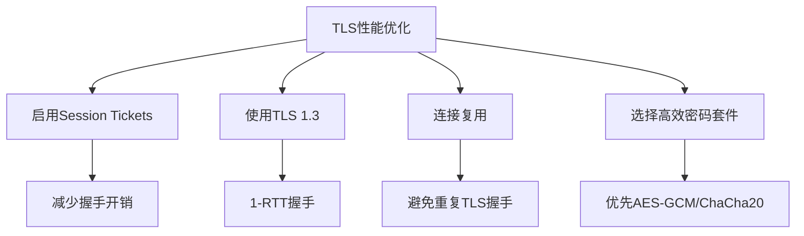

# crypto/tls完全指南

新手也能秒懂的Go标准库教程!从基础到实战,一文打通!

## 📖 包简介

`crypto/tls`包是Go语言实现TLS/SSL协议的核心,它为网络通信提供加密和身份验证。无论是HTTPS服务器、gRPC通信、还是数据库连接加密,都依赖这个包。

Go 1.26中,`crypto/tls`迎来了**里程碑式的更新**:默认启用后量子密钥交换(SecP256r1MLKEM768),这意味着你的HTTPS连接现在自动具备抗量子计算攻击的能力!这是Go语言在后量子密码学领域的重大突破。

## 🎯 核心功能概览

| 类型/函数 | 说明 |
|-----------|------|
| `Config` | TLS配置结构体,控制证书、密码套件等 |
| `Conn` | TLS连接封装,实现net.Conn接口 |
| `Listener` | TLS监听器,自动接受TLS连接 |
| `Certificate` | X.509证书对(证书+私钥) |
| `Client()` / `Server()` | 创建TLS客户端/服务端连接 |
| `Listen()` | 创建TLS监听器 |
| `Dial()` | 建立TLS客户端连接 |

**Go 1.26关键更新**:
- 默认启用后量子混合密钥交换 `SecP256r1MLKEM768`
- 支持X25519MLKEM768密钥交换
- 密码套件优先级调整,优先使用前向安全算法

## 💻 实战示例

### 示例1:最简单的TLS服务器

```go
package main

import (
	"crypto/tls"
	"fmt"
	"log"
	"net/http"
)

func main() {
	// 配置TLS(最小配置,Go 1.26自动启用后量子)
	tlsConfig := &tls.Config{
		// Go 1.26默认启用后量子密钥交换
		// 无需额外配置!
		MinVersion: tls.VersionTLS12,
	}

	// 创建HTTPS服务器
	server := &http.Server{
		Addr:      ":8443",
		Handler: http.HandlerFunc(func(w http.ResponseWriter, r *http.Request) {
			fmt.Fprintf(w, "Hello over TLS 1.3 with Post-Quantum!")
		}),
		TLSConfig: tlsConfig,
	}

	// 启动服务(需要cert.pem和key.pem)
	log.Println("Starting HTTPS server on :8443")
	log.Fatal(server.ListenAndServeTLS("cert.pem", "key.pem"))
}

// 生成测试证书命令:
// openssl req -x509 -newkey ec -pkeyopt ec_paramgen_curve:P-256 \
//   -keyout key.pem -out cert.pem -days 365 -nodes -subj "/CN=localhost"
```

### 示例2:TLS客户端连接

```go
package main

import (
	"crypto/tls"
	"crypto/x509"
	"fmt"
	"io"
	"log"
	"net/http"
	"os"
)

func main() {
	// 加载自定义CA证书(用于内部服务)
	caCert, err := os.ReadFile("ca.pem")
	if err != nil {
		log.Printf("未找到自定义CA,使用系统证书: %v", err)
	}

	tlsConfig := &tls.Config{
		MinVersion: tls.VersionTLS12,
	}

	if caCert != nil {
		caCertPool := x509.NewCertPool()
		caCertPool.AppendCertsFromPEM(caCert)
		tlsConfig.RootCAs = caCertPool
	}

	// 创建带TLS配置的HTTP客户端
	client := &http.Client{
		Transport: &http.Transport{
			TLSClientConfig: tlsConfig,
		},
	}

	resp, err := client.Get("https://localhost:8443")
	if err != nil {
		log.Printf("连接失败: %v", err)
		return
	}
	defer resp.Body.Close()

	// 检查TLS状态
	connState := resp.TLS
	if connState != nil {
		fmt.Printf("TLS版本: 0x%x\n", connState.Version)
		fmt.Printf("密码套件: 0x%x\n", connState.CipherSuite)
		fmt.Printf("服务器名称: %s\n", connState.ServerName)
		// Go 1.26:检查是否使用后量子密钥交换
		fmt.Printf("Negotiated Protocol: %s\n", connState.NegotiatedProtocol)
	}

	body, _ := io.ReadAll(resp.Body)
	fmt.Printf("响应: %s\n", body)
}
```

### 示例3:双向TLS认证(mTLS)

```go
package main

import (
	"crypto/tls"
	"crypto/x509"
	"fmt"
	"log"
	"net/http"
	"os"
)

func setupMTLSServer() {
	// 加载服务端证书
	serverCert, err := tls.LoadX509KeyPair("server-cert.pem", "server-key.pem")
	if err != nil {
		log.Fatalf("加载服务端证书失败: %v", err)
	}

	// 加载客户端CA证书池
	clientCAPool := x509.NewCertPool()
	clientCA, err := os.ReadFile("client-ca.pem")
	if err != nil {
		log.Fatalf("加载客户端CA失败: %v", err)
	}
	clientCAPool.AppendCertsFromPEM(clientCA)

	tlsConfig := &tls.Config{
		Certificates: []tls.Certificate{serverCert},
		ClientCAs:    clientCAPool,
		// 关键:要求客户端证书
		ClientAuth: tls.RequireAndVerifyClientCert,
		MinVersion: tls.VersionTLS12,
	}

	server := &http.Server{
		Addr:      ":8443",
		TLSConfig: tlsConfig,
		Handler: http.HandlerFunc(func(w http.ResponseWriter, r *http.Request) {
			// 获取客户端证书信息
			if len(r.TLS.PeerCertificates) > 0 {
				cert := r.TLS.PeerCertificates[0]
				fmt.Fprintf(w, "Hello, client: %s\n", cert.Subject.CommonName)
			}
		}),
	}

	log.Println("mTLS服务器启动,需要客户端证书")
	log.Fatal(server.ListenAndServeTLS("", "")) // 证书已在Config中配置
}

// 客户端连接代码:
func connectWithClientCert() {
	// 加载客户端证书
	clientCert, _ := tls.LoadX509KeyPair("client-cert.pem", "client-key.pem")

	// 加载服务端CA
	serverCA, _ := os.ReadFile("server-ca.pem")
	serverCAPool := x509.NewCertPool()
	serverCAPool.AppendCertsFromPEM(serverCA)

	tlsConfig := &tls.Config{
		Certificates: []tls.Certificate{clientCert},
		RootCAs:      serverCAPool,
		MinVersion:   tls.VersionTLS12,
	}

	transport := &http.Transport{TLSClientConfig: tlsConfig}
	client := &http.Client{Transport: transport}
	_, _ = client.Get("https://server:8443/")
}
```

## ⚠️ 常见陷阱与注意事项

1. **证书路径问题**: `ListenAndServeTLS(certFile, keyFile)`接收的是文件路径,不是证书内容。如果要使用内存中的证书,请手动创建`tls.Certificate`。

2. **`InsecureSkipVerify`是大坑**: 设置为`true`会跳过证书验证,**生产环境绝对不要使用**!正确做法是配置正确的`RootCAs`。

3. **证书链不完整**: 服务端证书应包含完整的证书链(服务器证书→中间CA→根CA),否则某些客户端会验证失败。PEM文件中按顺序拼接即可。

4. **连接复用与TLS握手**: TLS握手开销较大(约1-2个RTT),务必使用HTTP连接复用(`Transport`的`MaxIdleConns`配置)。

5. **Go 1.26后量子默认启用**: 如果连接的后端服务不支持后量子密钥交换,可能导致握手失败。在混合环境中注意兼容性。

## 🚀 Go 1.26新特性

**Go 1.26最大亮点:后量子TLS默认启用!**

- **默认密钥交换**: `SecP256r1MLKEM768`(NIST后量子标准ML-KEM与传统ECDH的混合方案)
- **向后兼容**: 如果客户端不支持ML-KEM,自动降级到传统的X25519或P-256
- **为什么用混合方案**: 即使ML-KEM未来被发现有问题,传统ECDH仍然提供安全保障
- **密码套件调整**: 优先使用AEAD密码套件(GCM、ChaCha20-Poly1305)

```
传统TLS握手:     ClientHello → ServerHello → 密钥交换 → Finished
Go 1.26 TLS:     ClientHello → ServerHello → PQ混合密钥交换 → Finished
                  ↑ 自动协商,对应用层透明
```

## 📊 性能优化建议



| 优化策略 | 效果 | 实现方式 |
|----------|------|----------|
| TLS 1.3 | 握手延迟减半 | `MinVersion: tls.VersionTLS13` |
| Session Tickets | 0-RTT恢复 | 默认启用 |
| 连接池 | 避免重复握手 | `http.Transport.MaxIdleConns` |
| OCSP Stapling | 加快证书验证 | `GetCertificate`回调 |

**后量子密钥交换性能**: ML-KEM的封装/解封装速度非常快,额外开销约5-10微秒,在实际HTTPS场景中几乎感知不到(网络延迟通常在毫秒级)。

## 🔗 相关包推荐

| 包 | 用途 |
|----|------|
| `crypto/x509` | X.509证书解析和验证 |
| `crypto/hpke` | 混合公钥加密,可用于自定义密钥交换 |
| `crypto/mlkem` | ML-KEM后量子密钥封装 |
| `net/http` | HTTP服务器和客户端(与TLS配合使用) |
| `crypto/fips140` | FIPS 140-3合规性检查 |

---