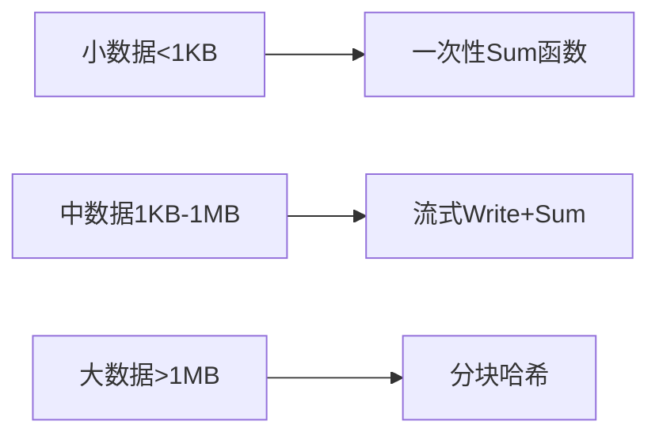

# crypto包完全指南

新手也能秒懂的Go标准库教程!从基础到实战,一文打通!

## 📖 包简介

`crypto`包是Go语言密码学体系的基石,它不是某个具体算法的实现,而是整个密码学系统的"交通枢纽"。它定义了通用的哈希接口、密钥类型注册机制、以及Go 1.26新增的KEM(密钥封装机制)抽象接口。

在Go 1.26中,`crypto`包迎来了重大升级——正式引入KEM接口,标志着Go语言向后量子密码学迈出了关键一步。同时,多个加密函数的`random`参数被标记为"忽略",强制使用安全随机源,彻底杜绝了因使用不安全随机数导致的漏洞。

## 🎯 核心功能概览

| 类型/函数 | 说明 |
|-----------|------|
| `Hash` | 哈希函数接口类型,支持MD5、SHA系列、SHA3等 |
| `PublicKey` / `PrivateKey` | 公钥/私钥接口标记 |
| `Signer` | 签名接口,支持RSA、ECDSA、Ed25519等 |
| `Decrypter` | 解密接口 |
| `Encapsulator` **(Go 1.26新增)** | KEM封装接口,用于密钥封装 |
| `Decapsulator` **(Go 1.26新增)** | KEM解封装接口,用于密钥解封装 |
| `RegisterHash()` | 注册自定义哈希函数 |
| `RegisterPrivateKey()` | 注册私钥类型 |
| `RegisterPublicKey()` | 注册公钥类型 |
| `SHA256.New()` | 快捷创建SHA-256实例 |

## 💻 实战示例

### 示例1:基础哈希操作

```go
package main

import (
	"crypto"
	"crypto/sha256"
	"fmt"
)

func main() {
	// 方式1:直接调用具体包
	data := []byte("Hello, Go 1.26!")
	hash := sha256.Sum256(data)
	fmt.Printf("SHA-256: %x\n", hash)

	// 方式2:通过crypto.Hash接口(更通用)
	h := crypto.SHA256.New()
	h.Write(data)
	result := h.Sum(nil)
	fmt.Printf("通过接口: %x\n", result)

	// 方式3:一次性哈希(小数据推荐)
	digest := sha256.Sum256(data)
	fmt.Printf("一次性:   %x\n", digest)
}
```

### 示例2:KEM接口使用(Go 1.26新增)

```go
package main

import (
	"crypto"
	"crypto/hpke"
	"fmt"
)

func main() {
	// Go 1.26新增:KEM抽象接口
	// Encapsulator和Decapsulator让密钥封装操作标准化
	
	// 以HPKE为例展示KEM接口
	suite := hpke.SuiteP256_HKDF_SHA256_AES128
	
	// 生成密钥对
	pub, priv, err := suite.KEM.GenerateKey(nil)
	if err != nil {
		panic(err)
	}
	
	// pub实现了Encapsulator接口
	// priv实现了Decapsulator接口
	
	// 封装密钥(发送方)
	ciphertext, sharedSecret, err := pub.Encapsulate(nil)
	if err != nil {
		panic(err)
	}
	
	// 解封装密钥(接收方)
	sharedSecret2, err := priv.Decapsulate(ciphertext)
	if err != nil {
		panic(err)
	}
	
	// 双方得到相同的共享密钥
	fmt.Printf("封装成功,共享密钥: %x\n", sharedSecret[:8])
	fmt.Printf("双方密钥一致: %v\n", 
		string(sharedSecret) == string(sharedSecret2))
	
	_ = crypto.Encapsulator(nil) // 类型检查
}
```

### 示例3:注册自定义哈希

```go
package main

import (
	"crypto"
	"fmt"
	"hash"
)

// 自定义哈希(示例,生产环境请使用成熟算法)
type myHash struct {
	data []byte
}

func (h *myHash) Write(p []byte) (int, error) {
	h.data = append(h.data, p...)
	return len(p), nil
}

func (h *myHash) Sum(b []byte) []byte {
	// 简化的"哈希"示例
	sum := make([]byte, 32)
	for i, v := range h.data {
		sum[i%32] ^= v
	}
	return append(b, sum...)
}

func (h *myHash) Reset() {
	h.data = nil
}

func (h *myHash) Size() int {
	return 32
}

func (h *myHash) BlockSize() int {
	return 64
}

func main() {
	const myHashID crypto.Hash = 200 // 使用未分配的ID
	
	// 注册自定义哈希
	crypto.RegisterHash(myHashID, func() hash.Hash {
		return &myHash{}
	})
	
	// 使用注册的哈希
	h := myHashID.New()
	h.Write([]byte("test data"))
	result := h.Sum(nil)
	fmt.Printf("自定义哈希: %x\n", result[:8])
}
```

## ⚠️ 常见陷阱与注意事项

1. **`random`参数已被忽略**: Go 1.26中,`crypto/rand`、`crypto/rsa`、`crypto/ecdsa`等包的`random io.Reader`参数已被忽略,强制使用安全加密随机源。不要再传入自定义随机源!

2. **`big.Int`字段已废弃**: `crypto/ecdsa`中的`PublicKey`和`PrivateKey`的`big.Int`字段已标记为废弃,应使用新API访问坐标。

3. **不要自己实现哈希**: 除非有极强的专业背景,否则永远不要自己发明哈希算法。使用`crypto/sha256`或`crypto/sha3`。

4. **Hash接口不是并发安全的**: `hash.Hash`的`Write()`和`Sum()`方法不是线程安全的,多线程使用时需要加锁或每个goroutine创建独立实例。

5. **哈希不等于加密**: 哈希是单向的,不可逆!如果需要可逆加密,请使用`crypto/aes`等对称加密或`crypto/rsa`非对称加密。

## 🚀 Go 1.26新特性

Go 1.26对`crypto`包进行了**重大升级**:

- **新增KEM接口**: `Encapsulator`和`Decapsulator`接口,统一了密钥封装机制,为后量子密码学铺平道路
- **强制安全随机**: 多个包的`random`参数被忽略,内部自动使用安全随机源,彻底消除因开发者误用`math/rand`导致的安全漏洞
- **ECDSA字段废弃**: `ecdsa.PublicKey`和`ecdsa.PrivateKey`的`X`、`Y`、`D`等`big.Int`字段标记为废弃,推荐使用新API
- **FIPS 140更新**: `crypto/fips140`模块升级至v1.26.0,新增`WithoutEnforcement`/`Enforced`选择性绕过检查

## 📊 性能优化建议



| 场景 | 推荐方式 | 原因 |
|------|----------|------|
| 短字符串/密码哈希 | `sha256.Sum256(data)` | 零分配,最快 |
| 文件/流数据 | `h := sha256.New(); h.Write()` | 内存友好 |
| 需要多种哈希 | `crypto.Hash`接口 | 代码统一 |

**性能提示**:
- 对于小数据(小于1KB),使用`Sum256()`比创建hash实例快约30%
- 哈希操作本身已经非常快(SHA-256在现代CPU上可达500MB/s),优化重点应放在减少不必要的重复哈希上

## 🔗 相关包推荐

| 包 | 用途 |
|----|------|
| `crypto/sha256` | SHA-256具体实现 |
| `crypto/sha3` | SHA-3系列哈希 |
| `crypto/hmac` | HMAC消息认证 |
| `crypto/hpke` | 混合公钥加密(Go 1.26新增) |
| `crypto/mlkem` | 后量子密钥封装 |
| `crypto/rand` | 加密安全随机数 |
| `runtime/secret` | 安全擦除临时变量(实验性) |

---