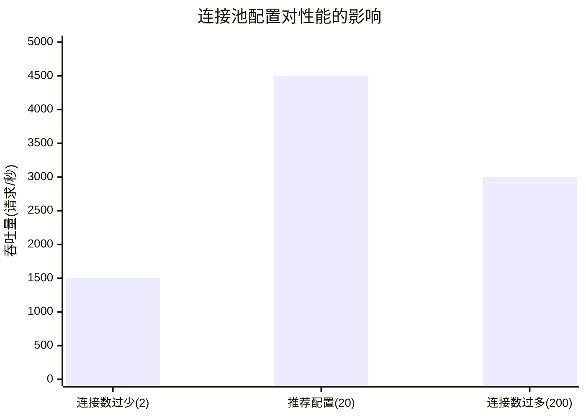

#  database/sql完全指南

新手也能秒懂的Go标准库教程!从基础到实战,一文打通!

## 📖 包简介

如果说Go是云原生时代的C语言,那么`database/sql`就是Go连接关系型数据库的"标准插座"。它为MySQL、PostgreSQL、SQLite等所有SQL数据库提供了**统一的接口**,你只需要导入对应的驱动(如`github.com/go-sql-driver/mysql`),就能用同一套API操作不同的数据库。

`database/sql`的设计非常精妙:它在内部实现了**连接池管理**、**并发安全**、**事务管理**、**预处理语句缓存**等高级功能,开发者只需要关注业务逻辑,不需要操心底层连接的生命周期。这也是Go标准库"电池内置(batteries included)"哲学的经典体现。

**典型使用场景**: Web应用数据库访问、微服务数据持久化、批处理脚本、数据迁移工具、ORM框架底层实现。

## 🎯 核心功能概览

### 主要类型

| 类型 | 说明 |
|------|------|
| `DB` | 数据库连接池(线程安全,可并发使用) |
| `Conn` | 单个数据库连接(用于独占操作) |
| `Tx` | 数据库事务 |
| `Stmt` | 预处理语句 |
| `Rows` | 查询结果集 |
| `Row` | 单行查询结果 |
| `NullString/NullInt64` | 可空类型 |

### DB核心方法

| 方法 | 说明 |
|------|------|
| `sql.Open(driver, dsn)` | 打开数据库(不验证连接) |
| `db.Ping()` | 验证数据库连接 |
| `db.Query(query, args)` | 执行查询,返回多行 |
| `db.QueryRow(query, args)` | 执行查询,返回单行 |
| `db.Exec(query, args)` | 执行INSERT/UPDATE/DELETE |
| `db.Prepare(query)` | 创建预处理语句 |
| `db.Begin()` | 开启事务 |
| `db.SetMaxOpenConns(n)` | 设置最大连接数 |
| `db.SetMaxIdleConns(n)` | 设置最大空闲连接数 |
| `db.SetConnMaxLifetime(d)` | 设置连接最大存活时间 |

### 可空类型

| 类型 | 说明 |
|------|------|
| `sql.NullString` | 可空字符串 |
| `sql.NullInt64` | 可空int64 |
| `sql.NullFloat64` | 可空float64 |
| `sql.NullBool` | 可空bool |
| `sql.NullTime` | 可空时间 |
| `sql.Null[T]`(Go 1.19+) | 泛型可空类型 |

## 💻 实战示例

### 示例1:基础用法

```go
package main

import (
	"database/sql"
	"fmt"
	"log"

	_ "github.com/mattn/go-sqlite3" // SQLite驱动
)

type User struct {
	ID    int
	Name  string
	Email sql.NullString // email可能为空
	Age   sql.NullInt64  // age可能为空
}

func main() {
	// 打开数据库(SQLite用文件,这里用内存数据库演示)
	db, err := sql.Open("sqlite3", ":memory:")
	if err != nil {
		log.Fatal(err)
	}
	defer db.Close()

	// 验证连接
	if err := db.Ping(); err != nil {
		log.Fatal(err)
	}
	fmt.Println("数据库连接成功!")

	// 配置连接池
	db.SetMaxOpenConns(25)
	db.SetMaxIdleConns(10)
	// db.SetConnMaxLifetime(5 * time.Minute)

	// 创建表
	createTable := `
	CREATE TABLE IF NOT EXISTS users (
		id INTEGER PRIMARY KEY AUTOINCREMENT,
		name TEXT NOT NULL,
		email TEXT,
		age INTEGER
	);`
	if _, err := db.Exec(createTable); err != nil {
		log.Fatal(err)
	}

	// 插入数据
	result, err := db.Exec(
		"INSERT INTO users (name, email, age) VALUES (?, ?, ?)",
		"Alice", "alice@example.com", 30,
	)
	if err != nil {
		log.Fatal(err)
	}
	lastID, _ := result.LastInsertId()
	fmt.Printf("插入成功,ID: %d\n", lastID)

	// 批量插入
	users := []User{
		{Name: "Bob", Email: sql.NullString{String: "bob@example.com", Valid: true}},
		{Name: "Charlie", Email: sql.NullString{Valid: false}}, // NULL
	}
	for _, u := range users {
		db.Exec(
			"INSERT INTO users (name, email, age) VALUES (?, ?, ?)",
			u.Name, u.Email, u.Age,
		)
	}

	// 查询单行
	var user User
	err = db.QueryRow(
		"SELECT id, name, email, age FROM users WHERE name = ?",
		"Alice",
	).Scan(&user.ID, &user.Name, &user.Email, &user.Age)

	if err != nil {
		if err == sql.ErrNoRows {
			fmt.Println("未找到用户")
		} else {
			log.Fatal(err)
		}
	} else {
		fmt.Printf("查询结果: %+v\n", user)
	}

	// 查询多行
	rows, err := db.Query("SELECT id, name, email, age FROM users")
	if err != nil {
		log.Fatal(err)
	}
	defer rows.Close() // 重要: 完成后必须关闭

	fmt.Println("\n所有用户:")
	for rows.Next() {
		var u User
		if err := rows.Scan(&u.ID, &u.Name, &u.Email, &u.Age); err != nil {
			log.Fatal(err)
		}
		fmt.Printf("  ID=%d, Name=%s, Email=%v, Age=%v\n",
			u.ID, u.Name, u.Email, u.Age)
	}

	// 检查遍历过程中的错误
	if err := rows.Err(); err != nil {
		log.Fatal(err)
	}
}
```

### 示例2:事务处理

```go
package main

import (
	"context"
	"database/sql"
	"fmt"
	"log"

	_ "github.com/mattn/go-sqlite3"
)

// TransferMoney 转账操作(事务示例)
func TransferMoney(db *sql.DB, fromID, toID int, amount float64) error {
	// 开启事务
	tx, err := db.Begin()
	if err != nil {
		return fmt.Errorf("开启事务失败: %w", err)
	}

	// 确保事务最终被提交或回滚
	defer func() {
		if p := recover(); p != nil {
			tx.Rollback()
			panic(p)
		}
	}()

	// 扣款
	_, err = tx.Exec(
		"UPDATE accounts SET balance = balance - ? WHERE id = ? AND balance >= ?",
		amount, fromID, amount,
	)
	if err != nil {
		tx.Rollback()
		return fmt.Errorf("扣款失败: %w", err)
	}

	// 入账
	_, err = tx.Exec(
		"UPDATE accounts SET balance = balance + ? WHERE id = ?",
		amount, toID,
	)
	if err != nil {
		tx.Rollback()
		return fmt.Errorf("入账失败: %w", err)
	}

	// 提交事务
	if err := tx.Commit(); err != nil {
		return fmt.Errorf("提交事务失败: %w", err)
	}

	return nil
}

// TransferWithContext 带上下文超时的事务
func TransferWithContext(db *sql.DB, ctx context.Context, fromID, toID int, amount float64) error {
	tx, err := db.BeginTx(ctx, &sql.TxOptions{
		Isolation: sql.LevelSerializable, // 最高隔离级别
	})
	if err != nil {
		return err
	}
	defer tx.Rollback() // 如果已提交,此调用无效果

	_, err = tx.ExecContext(ctx,
		"UPDATE accounts SET balance = balance - ? WHERE id = ? AND balance >= ?",
		amount, fromID, amount,
	)
	if err != nil {
		return err
	}

	_, err = tx.ExecContext(ctx,
		"UPDATE accounts SET balance = balance + ? WHERE id = ?",
		amount, toID,
	)
	if err != nil {
		return err
	}

	return tx.Commit()
}

func main() {
	db, err := sql.Open("sqlite3", ":memory:")
	if err != nil {
		log.Fatal(err)
	}
	defer db.Close()

	// 创建账户表
	db.Exec(`
	CREATE TABLE accounts (
		id INTEGER PRIMARY KEY,
		name TEXT,
		balance REAL
	);`)

	db.Exec("INSERT INTO accounts (id, name, balance) VALUES (1, 'Alice', 1000)")
	db.Exec("INSERT INTO accounts (id, name, balance) VALUES (2, 'Bob', 500)")

	// 转账
	err = TransferMoney(db, 1, 2, 200)
	if err != nil {
		fmt.Printf("转账失败: %v\n", err)
	} else {
		fmt.Println("转账成功!")
	}

	// 查询余额
	var aliceBalance, bobBalance float64
	db.QueryRow("SELECT balance FROM accounts WHERE id = 1").Scan(&aliceBalance)
	db.QueryRow("SELECT balance FROM accounts WHERE id = 2").Scan(&bobBalance)

	fmt.Printf("Alice余额: %.2f\n", aliceBalance)
	fmt.Printf("Bob余额: %.2f\n", bobBalance)

	// 测试余额不足
	err = TransferMoney(db, 2, 1, 9999)
	if err != nil {
		fmt.Println("\n余额不足,转账失败(预期行为)")
	}

	// 查询最终余额
	db.QueryRow("SELECT balance FROM accounts WHERE id = 2").Scan(&bobBalance)
	fmt.Printf("Bob最终余额: %.2f (应仍为500)\n", bobBalance)
}
```

### 示例3:最佳实践 - 仓库模式

```go
package main

import (
	"context"
	"database/sql"
	"fmt"
	"log"
	"time"

	_ "github.com/mattn/go-sqlite3"
)

// User 用户实体
type User struct {
	ID        int64
	Name      string
	Email     string
	CreatedAt time.Time
}

// UserRepository 用户数据访问层
type UserRepository struct {
	db *sql.DB
}

func NewUserRepository(db *sql.DB) *UserRepository {
	return &UserRepository{db: db}
}

// Create 创建用户
func (r *UserRepository) Create(ctx context.Context, u *User) error {
	query := `INSERT INTO users (name, email, created_at) VALUES (?, ?, ?)`
	result, err := r.db.ExecContext(ctx, query, u.Name, u.Email, u.CreatedAt)
	if err != nil {
		return fmt.Errorf("创建用户失败: %w", err)
	}

	u.ID, err = result.LastInsertId()
	return err
}

// GetByID 根据ID查询
func (r *UserRepository) GetByID(ctx context.Context, id int64) (*User, error) {
	query := `SELECT id, name, email, created_at FROM users WHERE id = ?`
	u := &User{}
	err := r.db.QueryRowContext(ctx, query, id).Scan(
		&u.ID, &u.Name, &u.Email, &u.CreatedAt,
	)
	if err != nil {
		if err == sql.ErrNoRows {
			return nil, fmt.Errorf("用户%d不存在", id)
		}
		return nil, err
	}
	return u, nil
}

// List 分页查询
func (r *UserRepository) List(ctx context.Context, offset, limit int) ([]User, error) {
	query := `SELECT id, name, email, created_at FROM users ORDER BY id LIMIT ? OFFSET ?`
	rows, err := r.db.QueryContext(ctx, query, limit, offset)
	if err != nil {
		return nil, err
	}
	defer rows.Close()

	var users []User
	for rows.Next() {
		var u User
		if err := rows.Scan(&u.ID, &u.Name, &u.Email, &u.CreatedAt); err != nil {
			return nil, err
		}
		users = append(users, u)
	}
	return users, rows.Err()
}

// Count 统计总数
func (r *UserRepository) Count(ctx context.Context) (int, error) {
	var count int
	err := r.db.QueryRowContext(ctx, "SELECT COUNT(*) FROM users").Scan(&count)
	return count, err
}

func initDB() *sql.DB {
	db, err := sql.Open("sqlite3", ":memory:")
	if err != nil {
		log.Fatal(err)
	}

	// 连接池配置
	db.SetMaxOpenConns(25)
	db.SetMaxIdleConns(10)
	db.SetConnMaxLifetime(30 * time.Minute)

	// 创建表
	db.Exec(`
	CREATE TABLE IF NOT EXISTS users (
		id INTEGER PRIMARY KEY AUTOINCREMENT,
		name TEXT NOT NULL,
		email TEXT UNIQUE NOT NULL,
		created_at DATETIME DEFAULT CURRENT_TIMESTAMP
	);`)

	return db
}

func main() {
	db := initDB()
	defer db.Close()

	repo := NewUserRepository(db)
	ctx := context.Background()

	// 创建用户
	users := []*User{
		{Name: "Alice", Email: "alice@example.com", CreatedAt: time.Now()},
		{Name: "Bob", Email: "bob@example.com", CreatedAt: time.Now()},
		{Name: "Charlie", Email: "charlie@example.com", CreatedAt: time.Now()},
	}

	for _, u := range users {
		if err := repo.Create(ctx, u); err != nil {
			log.Printf("创建用户失败: %v", err)
		}
	}

	// 查询
	u, _ := repo.GetByID(ctx, 1)
	fmt.Printf("用户: %+v\n", u)

	// 列表
	allUsers, _ := repo.List(ctx, 0, 10)
	fmt.Printf("共 %d 个用户\n", len(allUsers))

	// 统计
	count, _ := repo.Count(ctx)
	fmt.Printf("统计总数: %d\n", count)
}
```

## ⚠️ 常见陷阱与注意事项

1. **Open()不验证连接**: `sql.Open()`只创建DB对象,不实际连接数据库。必须调用`db.Ping()`验证连接是否可用。

2. **必须关闭Rows**: `db.Query()`返回的`Rows`必须在完成后调用`rows.Close()`。推荐使用`defer rows.Close()`。如果忘记关闭,连接会一直被占用,最终连接池耗尽。

3. **DB是连接池,不是连接**: `sql.DB`设计为**长期存活**的对象,不应频繁Open/Close。整个应用通常只需要一个DB实例,并发安全。

4. **ErrNoRows的处理**: `QueryRow`在无结果时返回`sql.ErrNoRows`。这不是一个真正的错误,而是一个"没找到"的信号。正确做法:
   ```go
   err := db.QueryRow(query).Scan(&val)
   if err != nil {
       if err == sql.ErrNoRows {
           // 处理"不存在"的情况
       } else {
           // 处理真正的错误
       }
   }
   ```

5. **NULL值处理**: 数据库中的NULL映射到Go中会panic,除非使用`sql.NullString`、`sql.NullInt64`等可空类型,或使用Go 1.19+的泛型`sql.Null[T]`。

## 🚀 Go 1.26新特性

`database/sql`包在Go 1.26中**API保持稳定**。Go对数据库接口的设计已经非常成熟,不需要频繁变动。

值得关注的间接变化: Go 1.26对运行时内存分配的优化对连接池中的连接管理有轻微的正面影响,特别是在高并发场景下连接获取和归还的开销略有降低。

## 📊 性能优化建议

### 连接池配置指南

| 参数 | 默认值 | 推荐值 | 说明 |
|------|-------|-------|------|
| `MaxOpenConns` | 0(无限制) | CPU核心数×2~4 | 最大并发连接数 |
| `MaxIdleConns` | 2 | MaxOpenConns的1/3~1/2 | 空闲连接数,影响冷启动性能 |
| `ConnMaxLifetime` | 0(永不过期) | 30min~2h | 避免使用数据库侧过期连接 |



**性能建议**:

1. **连接池不是越大越好**: 连接数超过数据库服务器能处理的并发上限后,反而会因为上下文切换降低性能
2. **设置ConnMaxLifetime**: 避免使用数据库防火墙或负载均衡器已关闭的"僵尸连接"
3. **预处理语句缓存**: 频繁执行的SQL用`db.Prepare()`预编译,减少解析开销
4. **用QueryRow替代Query**: 只查一行时用`QueryRow`,代码更简洁且避免忘记Close Rows
5. **Context超时控制**: 所有数据库操作使用`QueryContext`/`ExecContext`并传入带超时的Context,防止慢SQL拖垮服务

## 🔗 相关包推荐

- **`context`**: 上下文控制,数据库操作的超时和取消
- **`time`**: 连接池超时配置
- **`database/sql/driver`**: 数据库驱动接口,编写自定义驱动
- **`github.com/go-sql-driver/mysql`**: MySQL驱动(第三方)
- **`github.com/lib/pq`**: PostgreSQL驱动(第三方)

---