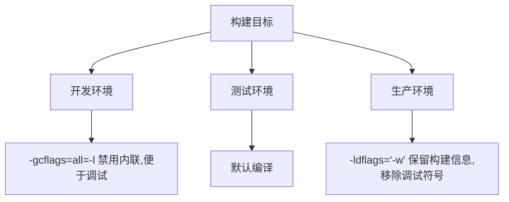

#  debug/buildinfo完全指南

新手也能秒懂的Go标准库教程!从基础到实战,一文打通!

## 📖 包简介

`debug/buildinfo` 包提供了读取Go二进制文件内嵌的构建信息的功能。从Go 1.18开始,Go编译器会自动将版本控制信息(VCS revision、版本标签等)和构建设置嵌入到编译后的二进制文件中。`debug/buildinfo` 让你能够在运行时或事后分析这些元数据。

想象一下这样的场景:生产环境出了问题,你需要知道当前运行的二进制文件是用哪个Git分支、哪个commit构建的,甚至用了什么编译参数。以前你可能需要靠文件名约定或手动记录,现在直接读二进制文件就能拿到这些信息。

适用场景:版本诊断、CI/CD流水线验证、二进制文件审计、运行时版本检查、构建系统调试。

## 🎯 核心功能概览

| 函数/类型 | 用途 | 说明 |
|----------|------|------|
| `Read(file string)` | 从文件读取构建信息 | 返回 `*debug.BuildInfo` |
| `ReadFile(file string)` | 从文件读取(推荐) | Go 1.23+推荐使用的API |
| `debug.BuildInfo` | 构建信息结构 | 包含Path、Main、Deps、Settings等 |
| `debug.Module` | 模块信息 | 模块路径、版本、替换等 |

### BuildInfo结构详解

```go
type BuildInfo struct {
    Path            string        // 被构建的程序路径
    GoVersion       string        // Go编译器版本
    Main            Module        // 主模块信息
    Deps            []*Module     // 所有依赖模块
    Settings        []BuildSetting // 构建设置(编译器标志等)
}

type Module struct {
    Path    string // 模块路径,如 "github.com/user/project"
    Version string // 模块版本
    Sum     string // 校验和(h1:xxx)
    Replace *Module // 替换信息(go.mod中的replace)
}
```

## 💻 实战示例

### 示例1: 基础用法 - 读取二进制文件的构建信息

```go
package main

import (
	"debug/buildinfo"
	"fmt"
	"os"
)

func main() {
	if len(os.Args) < 2 {
		fmt.Println("用法: go run main.go <二进制文件路径>")
		fmt.Println("示例: go run main.go ./myapp")
		os.Exit(1)
	}

	binaryPath := os.Args[1]

	// 读取构建信息
	info, err := buildinfo.ReadFile(binaryPath)
	if err != nil {
		fmt.Printf("读取构建信息失败: %v\n", err)
		os.Exit(1)
	}

	// 打印基本信息
	fmt.Println("=== 构建信息 ===")
	fmt.Printf("程序路径: %s\n", info.Path)
	fmt.Printf("Go版本: %s\n", info.GoVersion)

	// 打印主模块信息
	if info.Main.Path != "" {
		fmt.Println("\n=== 主模块 ===")
		fmt.Printf("模块路径: %s\n", info.Main.Path)
		fmt.Printf("模块版本: %s\n", info.Main.Version)
		fmt.Printf("校验和: %s\n", info.Main.Sum)
	}

	// 打印前10个依赖
	if len(info.Deps) > 0 {
		fmt.Println("\n=== 依赖模块(前10个) ===")
		for i, dep := range info.Deps {
			if i >= 10 {
				fmt.Printf("... 还有 %d 个依赖\n", len(info.Deps)-10)
				break
			}
			fmt.Printf("[%d] %s@%s\n", i+1, dep.Path, dep.Version)
		}
	}

	// 打印构建设置
	if len(info.Settings) > 0 {
		fmt.Println("\n=== 构建设置 ===")
		for _, setting := range info.Settings {
			fmt.Printf("%s = %s\n", setting.Key, setting.Value)
		}
	}
}
```

### 示例2: 进阶用法 - 版本诊断工具

```go
package main

import (
	"debug/buildinfo"
	"encoding/json"
	"fmt"
	"os"
	"strings"
)

// VersionReport 版本报告
type VersionReport struct {
	BinaryPath string   `json:"binary_path"`
	GoVersion  string   `json:"go_version"`
	MainModule string   `json:"main_module"`
	Version    string   `json:"version"`
	VCSInfo    VCSInfo  `json:"vcs_info"`
	Settings   map[string]string `json:"settings"`
}

type VCSInfo struct {
	Revision string `json:"revision"`
	Modified string `json:"modified"`
	Time     string `json:"time"`
}

// AnalyzeBinary 分析二进制文件的版本信息
func AnalyzeBinary(path string) (*VersionReport, error) {
	info, err := buildinfo.ReadFile(path)
	if err != nil {
		return nil, fmt.Errorf("读取构建信息失败: %w", err)
	}

	report := &VersionReport{
		BinaryPath: path,
		GoVersion:  info.GoVersion,
		MainModule: info.Main.Path,
		Version:    info.Main.Version,
		Settings:   make(map[string]string),
	}

	// 提取VCS信息
	for _, setting := range info.Settings {
		report.Settings[setting.Key] = setting.Value

		switch setting.Key {
		case "vcs.revision":
			report.VCSInfo.Revision = setting.Value
		case "vcs.modified":
			report.VCSInfo.Modified = setting.Value
		case "vcs.time":
			report.VCSInfo.Time = setting.Value
		}
	}

	return report, nil
}

// CheckVersionMatch 检查版本是否匹配期望值
func CheckVersionMatch(report *VersionReport, expectedVersion string) error {
	if report.Version != expectedVersion && expectedVersion != "" {
		return fmt.Errorf("版本不匹配: 期望 %s, 实际 %s",
			expectedVersion, report.Version)
	}
	return nil
}

func main() {
	if len(os.Args) < 2 {
		fmt.Println("用法: go run main.go <二进制文件> [期望版本]")
		os.Exit(1)
	}

	binaryPath := os.Args[1]
	expectedVersion := ""
	if len(os.Args) >= 3 {
		expectedVersion = os.Args[2]
	}

	// 分析二进制文件
	report, err := AnalyzeBinary(binaryPath)
	if err != nil {
		fmt.Printf("❌ 分析失败: %v\n", err)
		os.Exit(1)
	}

	// 打印人类可读的报告
	fmt.Println("📋 版本诊断报告")
	fmt.Println(strings.Repeat("=", 50))
	fmt.Printf("二进制文件: %s\n", report.BinaryPath)
	fmt.Printf("Go版本: %s\n", report.GoVersion)
	fmt.Printf("主模块: %s\n", report.MainModule)
	fmt.Printf("版本: %s\n", report.Version)

	if report.VCSInfo.Revision != "" {
		fmt.Printf("Git Commit: %s\n", report.VCSInfo.Revision)
	}
	if report.VCSInfo.Time != "" {
		fmt.Printf("构建时间: %s\n", report.VCSInfo.Time)
	}
	if report.VCSInfo.Modified != "" {
		if report.VCSInfo.Modified == "true" {
			fmt.Println("⚠️  构建时有未提交的修改")
		}
	}

	// 版本检查
	if expectedVersion != "" {
		if err := CheckVersionMatch(report, expectedVersion); err != nil {
			fmt.Printf("❌ %v\n", err)
			os.Exit(1)
		}
		fmt.Println("✅ 版本匹配!")
	}

	// 输出JSON格式(便于程序化处理)
	fmt.Println("\n📄 JSON格式:")
	jsonData, _ := json.MarshalIndent(report, "", "  ")
	fmt.Println(string(jsonData))
}
```

### 示例3: 最佳实践 - 运行时版本检查

```go
package main

import (
	"debug/buildinfo"
	"fmt"
	"runtime/debug"
)

// 运行时获取自身构建信息
func printSelfBuildInfo() {
	// 方法1: 使用runtime/debug.ReadBuildInfo()(获取当前进程)
	if info, ok := debug.ReadBuildInfo(); ok {
		fmt.Println("=== 运行时构建信息 ===")
		fmt.Printf("Go版本: %s\n", info.GoVersion)
		fmt.Printf("主模块: %s\n", info.Main.Path)
		fmt.Printf("模块版本: %s\n", info.Main.Version)

		// 提取VCS信息
		for _, s := range info.Settings {
			if s.Key == "vcs.revision" {
				fmt.Printf("Git Commit: %s\n", s.Value)
			}
			if s.Key == "vcs.modified" {
				fmt.Printf("工作区干净: %s\n", s.Value)
			}
		}
	}
}

// 检查外部二进制文件
func checkExternalBinary(path string) error {
	info, err := buildinfo.ReadFile(path)
	if err != nil {
		return fmt.Errorf("无法读取 %s: %w", path, err)
	}

	fmt.Printf("\n=== 外部二进制: %s ===\n", path)
	fmt.Printf("Go版本: %s\n", info.GoVersion)

	// 检查Go版本是否过低
	if info.GoVersion < "go1.20" {
		return fmt.Errorf("Go版本过低: %s (需要 >= go1.20)", info.GoVersion)
	}

	// 检查是否有VCS信息
	hasVCS := false
	for _, s := range info.Settings {
		if s.Key == "vcs.revision" {
			hasVCS = true
			break
		}
	}
	if !hasVCS {
		fmt.Println("⚠️  此二进制文件没有嵌入VCS信息")
	}

	return nil
}

func main() {
	// 打印自身信息
	printSelfBuildInfo()

	// 检查外部文件(如果提供了路径)
	// err := checkExternalBinary("/path/to/binary")
	// if err != nil {
	//     fmt.Printf("检查失败: %v\n", err)
	// }
}
```

## ⚠️ 常见陷阱与注意事项

1. **不是所有二进制文件都有构建信息**: 只有用Go 1.18+编译、且未使用 `-gcflags=all=-l` 或 `-ldflags=-s` 剥离信息的二进制文件才能读取构建信息。Cgo编译的外部C代码部分不会包含这些信息。

2. **`-ldflags='-s -w'` 会剥离信息**: 很多生产构建为了减小二进制文件大小会使用 `-ldflags='-s -w'`,这会移除调试信息和构建信息。如果需要保留版本信息,只用 `-w`(移除DWARF调试信息),不要用 `-s`(移除符号表和调试信息)。

3. **VCS信息需要Go 1.18+**: 版本控制信息(VCS revision等)是从Go 1.18开始自动嵌入的。更早版本编译的二进制文件不会有这些信息。

4. **`ReadFile` vs `Read`**: Go 1.23推荐使用 `ReadFile`,它是对旧 `Read` 函数的改进。新项目统一使用 `ReadFile`。

5. **依赖列表可能很长**: 一个中等项目的 `BuildInfo.Deps` 可能有几百个模块。遍历时注意控制输出量,避免日志爆炸。

## 🚀 Go 1.26新特性

Go 1.26对 `debug/buildinfo` 包本身没有重大API变更,但受益于整体构建系统的改进:

- **VCS信息嵌入更可靠**: Go 1.26继续优化了VCS信息的自动检测和嵌入,支持更多版本控制系统(Git、Mercurial、SVN等)。
- **构建可重现性增强**: 配合Go 1.26的构建系统优化,相同源码在不同环境下构建出的二进制文件一致性更好。
- **性能优化**: 读取大型二进制文件的构建信息速度有所提升。

## 📊 性能优化建议

### 构建标志推荐



### 构建命令对比

| 场景 | 命令 | 文件大小 | 构建信息 | 调试能力 |
|-----|------|---------|---------|---------|
| 开发 | `go build` | 大 | ✅ 完整 | ✅ 完整 |
| 测试 | `go build` | 大 | ✅ 完整 | ✅ 完整 |
| 生产(推荐) | `go build -ldflags='-w'` | 中 | ✅ 保留 | ⚠️ 有限 |
| 极小化 | `go build -ldflags='-s -w'` | 小 | ❌ 剥离 | ❌ 无 |

### 注入版本信息的传统方式

```bash
# 如果不想依赖自动嵌入,也可以手动注入
go build -ldflags="-X main.Version=v1.2.3 -X main.Commit=$(git rev-parse HEAD)"
```

```go
// 对应的Go代码
package main

import "fmt"

var (
    Version = "dev"
    Commit  = "unknown"
)

func main() {
    fmt.Printf("Version: %s, Commit: %s\n", Version, Commit)
}
```

## 🔗 相关包推荐

- **`runtime/debug`** - 运行时构建信息(与buildinfo互补)
- **`debug/elf`** - ELF文件格式解析
- **`debug/macho`** - Mach-O文件格式解析(macOS)
- **`debug/pe`** - PE文件格式解析(Windows)
- **`debug/dwarf`** - DWARF调试信息解析
- **`debug/gosym`** - Go符号表和行信息

---