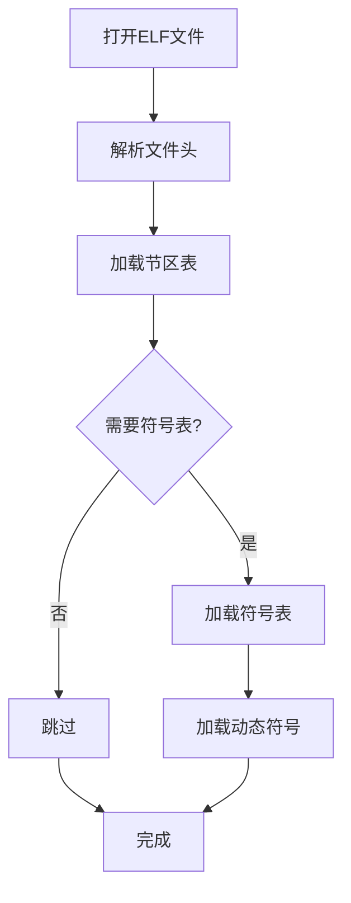

#  debug/elf完全指南

新手也能秒懂的Go标准库教程!从基础到实战,一文打通!

## 📖 包简介

`debug/elf` 包提供了对ELF(Executable and Linkable Format)格式文件的解析能力。ELF是Linux、BSD等类Unix系统上标准的二进制文件格式,包括可执行文件、共享库、目标文件和核心转储(core dumps)都使用这种格式。

如果你是Linux系统下的开发者,这个包就是你解剖二进制的"手术刀"。无论是分析Go程序的段布局、检查共享库依赖、提取符号表,还是解析core dump文件,`debug/elf` 都能帮你做到。虽然大多数应用开发者不需要直接与ELF打交道,但当你需要编写构建工具、分析器或调试器时,这个包就是你的瑞士军刀。

适用场景:二进制文件分析、共享库依赖检查、符号表提取、core dump分析、构建工具开发、安全审计。

## 🎯 核心功能概览

### 核心类型

| 类型 | 用途 | 说明 |
|------|------|------|
| `elf.File` | ELF文件对象 | 打开后的ELF文件表示 |
| `elf.FileHeader` | ELF文件头 | 包含架构、入口点、段信息等 |
| `elf.ProgHeader` | Program Header | 程序头(加载段信息) |
| `elf.Section` | Section | 节区(符号表、字符串表等) |
| `elf.SectionHeader` | Section Header | 节区头信息 |
| `elf.Symbol` | 符号表条目 | 函数名、变量名等符号 |
| `elf.DynamicEntry` | 动态段条目 | 共享库依赖等 |
| `elf.Relf` | 重定位信息 | 链接器使用的重定位 |

### 主要函数

| 函数 | 用途 | 返回值 |
|------|------|--------|
| `elf.Open(name)` | 打开ELF文件 | `*elf.File, error` |
| `elf.NewFile(r)` | 从io.ReaderAt创建 | `*elf.File, error` |
| `f.Section(name)` | 按名称获取节区 | `*elf.Section` |
| `f.Symbols()` | 获取符号表 | `[]elf.Symbol, error` |
| `f.DynamicSymbols()` | 获取动态符号表 | `[]elf.Symbol, error` |
| `f.ImportedLibraries()` | 获取共享库依赖 | `[]string, error` |
| `f.ImportedSymbols()` | 获取导入符号 | `[]string, error` |
| `f.DynValue(tag)` | 获取动态段值 | `[]uint64, error` |

### ELF Machine类型(常见架构)

| 常量 | 架构 |
|------|------|
| `EM_X86_64` | x86_64 |
| `EM_AARCH64` | ARM64 |
| `EM_ARM` | ARM 32位 |
| `EM_RISCV` | RISC-V |
| `EM_PPC64` | PowerPC 64位 |

## 💻 实战示例

### 示例1: 基础用法 - 读取ELF文件基本信息

```go
package main

import (
	"debug/elf"
	"fmt"
	"os"
)

func main() {
	if len(os.Args) < 2 {
		fmt.Println("用法: go run main.go <ELF文件路径>")
		fmt.Println("示例: go run main.go /bin/ls")
		os.Exit(1)
	}

	// 打开ELF文件
	f, err := elf.Open(os.Args[1])
	if err != nil {
		fmt.Printf("打开ELF文件失败: %v\n", err)
		os.Exit(1)
	}
	defer f.Close()

	// 打印文件头信息
	fmt.Println("=== ELF文件头 ===")
	fmt.Printf("架构: %s\n", f.Machine)
	fmt.Printf("类型: %s\n", f.Type)
	fmt.Printf("入口点: %#x\n", f.Entry)
	fmt.Printf("ELF类别: %s\n", f.Class)
	fmt.Printf("数据编码: %s\n", f.Data)
	fmt.Printf("OS/ABI: %s\n", f.ABI)
	fmt.Printf("ABI版本: %d\n", f.ABIVersion)

	// 打印节区信息
	fmt.Println("\n=== 节区列表 ===")
	for _, section := range f.Sections {
		if section.Size > 0 {
			fmt.Printf("[%-20s] 类型: %-15s 大小: %d 字节  标志: %s\n",
				section.Name,
				section.Type,
				section.Size,
				section.Flags)
		}
	}

	// 打印程序头
	fmt.Println("\n=== 程序头(加载段) ===")
	for _, prog := range f.Progs {
		if prog.Type == elf.PT_LOAD {
			fmt.Printf("LOAD: 虚拟地址=%#x, 大小=%d, 标志=%s\n",
				prog.Vaddr, prog.Memsz, prog.Flags)
		}
	}
}
```

### 示例2: 进阶用法 - 分析共享库依赖和符号表

```go
package main

import (
	"debug/elf"
	"fmt"
	"os"
	"strings"
)

// BinaryInfo 二进制文件信息
type BinaryInfo struct {
	Path            string
	Architecture    string
	ELFType         string
	Libraries       []string
	ImportedSymbols []string
	ExportedSymbols []string
	Sections        map[string]uint64
}

// AnalyzeELF 分析ELF文件
func AnalyzeELF(path string) (*BinaryInfo, error) {
	f, err := elf.Open(path)
	if err != nil {
		return nil, fmt.Errorf("打开ELF文件失败: %w", err)
	}
	defer f.Close()

	info := &BinaryInfo{
		Path:         path,
		Architecture: f.Machine.String(),
		ELFType:      f.Type.String(),
		Sections:     make(map[string]uint64),
	}

	// 获取共享库依赖
	libs, err := f.ImportedLibraries()
	if err != nil {
		fmt.Fprintf(os.Stderr, "警告: 读取共享库依赖失败: %v\n", err)
	} else {
		info.Libraries = libs
	}

	// 获取动态符号(导出的符号)
	dynsyms, err := f.DynamicSymbols()
	if err != nil {
		fmt.Fprintf(os.Stderr, "警告: 读取动态符号失败: %v\n", err)
	} else {
		for _, sym := range dynsyms {
			if sym.Section != elf.SHN_UNDEF {
				info.ExportedSymbols = append(info.ExportedSymbols, sym.Name)
			}
		}
	}

	// 获取导入符号
	impsyms, err := f.ImportedSymbols()
	if err != nil {
		fmt.Fprintf(os.Stderr, "警告: 读取导入符号失败: %v\n", err)
	} else {
		info.ImportedSymbols = impsyms
	}

	// 统计节区大小
	for _, sec := range f.Sections {
		if sec.Size > 0 {
			info.Sections[sec.Name] = sec.Size
		}
	}

	return info, nil
}

// PrintReport 打印分析报告
func PrintReport(info *BinaryInfo) {
	fmt.Println("📋 二进制文件分析报告")
	fmt.Println(strings.Repeat("=", 60))
	fmt.Printf("文件路径: %s\n", info.Path)
	fmt.Printf("架构: %s\n", info.Architecture)
	fmt.Printf("类型: %s\n", info.ELFType)

	// 共享库依赖
	if len(info.Libraries) > 0 {
		fmt.Printf("\n📚 共享库依赖(%d个):\n", len(info.Libraries))
		for _, lib := range info.Libraries {
			fmt.Printf("  - %s\n", lib)
		}
	}

	// 节区大小统计
	if len(info.Sections) > 0 {
		fmt.Printf("\n📦 节区大小统计:\n")
		totalSize := uint64(0)
		for name, size := range info.Sections {
			fmt.Printf("  %-20s %10d 字节 (%.2f KB)\n",
				name, size, float64(size)/1024)
			totalSize += size
		}
		fmt.Printf("  %-20s %10d 字节 (%.2f KB)\n",
			"总计", totalSize, float64(totalSize)/1024)
	}

	// 符号统计
	fmt.Printf("\n🔤 符号统计:\n")
	fmt.Printf("  导入符号: %d 个\n", len(info.ImportedSymbols))
	fmt.Printf("  导出符号: %d 个\n", len(info.ExportedSymbols))

	// 显示前10个导入符号
	if len(info.ImportedSymbols) > 0 {
		fmt.Println("\n  导入符号(前10个):")
		for i, sym := range info.ImportedSymbols {
			if i >= 10 {
				break
			}
			fmt.Printf("    - %s\n", sym)
		}
	}
}

func main() {
	if len(os.Args) < 2 {
		fmt.Println("用法: go run main.go <ELF文件路径>")
		os.Exit(1)
	}

	info, err := AnalyzeELF(os.Args[1])
	if err != nil {
		fmt.Printf("分析失败: %v\n", err)
		os.Exit(1)
	}

	PrintReport(info)
}
```

### 示例3: 最佳实践 - Go二进制文件段分析器

```go
package main

import (
	"debug/elf"
	"fmt"
	"os"
	"strings"
)

// Go-specific段名称
var goSectionNames = []string{
	".text",        // 代码段
	".rodata",      // 只读数据
	".typelink",    // Go类型信息
	".itablink",    // 接口表
	".gosymtab",    // Go符号表
	".gopclntab",   // Go PC-LINE表
	".go.buildinfo",// Go构建信息
	".noptrdata",   // 无指针数据
	".bss",         // 未初始化数据
	".noptrbss",    // 无指针BSS
	".gcdata",      // GC元数据
	".gcbss",       // GC BSS
}

// GoBinaryInfo Go二进制文件信息
type GoBinaryInfo struct {
	IsGoBinary bool
	GoVersion  string
	Sections   map[string]*elf.Section
}

// CheckGoBinary 检查是否为Go编译的二进制文件
func CheckGoBinary(path string) (*GoBinaryInfo, error) {
	f, err := elf.Open(path)
	if err != nil {
		return nil, fmt.Errorf("打开失败: %w", err)
	}
	defer f.Close()

	info := &GoBinaryInfo{
		Sections: make(map[string]*elf.Section),
	}

	// 检查Go特有的节区
	for _, name := range goSectionNames {
		sec := f.Section(name)
		if sec != nil {
			info.Sections[name] = sec
		}
	}

	// 如果有.go.buildinfo或.gopclntab,基本可以确定是Go二进制
	if info.Sections[".go.buildinfo"] != nil ||
		info.Sections[".gopclntab"] != nil {
		info.IsGoBinary = true
	}

	// 尝试从.go.buildinfo提取Go版本
	if sec := info.Sections[".go.buildinfo"]; sec != nil {
		data, err := sec.Data()
		if err == nil {
			// 构建信息中包含Go版本字符串
			idx := strings.Index(string(data), "go")
			if idx >= 0 {
				// 简化提取,实际应该用debug/buildinfo
				end := idx + strings.Index(string(data[idx:]), "\x00")
				if end > idx {
					info.GoVersion = string(data[idx:end])
				}
			}
		}
	}

	return info, nil
}

// PrintGoBinaryReport 打印Go二进制文件报告
func PrintGoBinaryReport(info *GoBinaryInfo) {
	if !info.IsGoBinary {
		fmt.Println("❌ 此文件不是Go编译的二进制文件")
		return
	}

	fmt.Println("✅ 这是Go编译的二进制文件")
	if info.GoVersion != "" {
		fmt.Printf("Go版本: %s\n", info.GoVersion)
	}

	fmt.Println("\n📊 Go段布局分析:")
	fmt.Printf("%-20s %12s %12s\n", "段名称", "大小", "偏移")
	fmt.Println(strings.Repeat("-", 50))

	totalSize := uint64(0)
	for _, name := range goSectionNames {
		sec, exists := info.Sections[name]
		if !exists {
			continue
		}
		fmt.Printf("%-20s %10d B %10d\n",
			name, sec.Size, sec.Offset)
		totalSize += sec.Size
	}

	fmt.Println(strings.Repeat("-", 50))
	fmt.Printf("%-20s %10d B (%.2f MB)\n",
		"总计", totalSize, float64(totalSize)/1024/1024)
}

func main() {
	if len(os.Args) < 2 {
		fmt.Println("用法: go run main.go <Go二进制文件路径>")
		os.Exit(1)
	}

	info, err := CheckGoBinary(os.Args[1])
	if err != nil {
		fmt.Printf("检查失败: %v\n", err)
		os.Exit(1)
	}

	PrintGoBinaryReport(info)
}
```

## ⚠️ 常见陷阱与注意事项

1. **不是所有二进制文件都是ELF格式**: ELF是Linux/Unix的标准格式。macOS使用Mach-O格式(用`debug/macho`包),Windows使用PE格式(用`debug/pe`包)。在跨平台工具中,需要先检测文件魔数再选择对应的解析器。

2. **Go 1.16+默认启用PIE**: Go 1.16开始在Linux上默认启用位置无关可执行文件(PIE),这改变了段布局。分析Go二进制时要注意这个变化。

3. **符号表可能被剥离**: 生产环境经常使用 `-ldflags='-s -w'` 剥离符号表,此时 `Symbols()` 和 `DynamicSymbols()` 可能返回空列表或报错。不要依赖符号表在生产环境做运行时决策。

4. **大文件的内存消耗**: 加载大型ELF文件(如包含大量调试信息的文件)时,所有节区数据会被读入内存。处理几十MB以上的文件时,考虑流式读取或只加载需要的节区。

5. **重定位信息理解难度大**: `elf.Relf` 类型涉及链接器级别的知识,大多数应用开发者不需要直接处理重定位。除非你在写链接器或加载器,否则可以忽略这个功能。

## 🚀 Go 1.26新特性

Go 1.26对 `debug/elf` 包没有重大API变更,但受益于以下改进:

- **RISC-V支持增强**: 随着RISC-V生态的成熟,Go 1.26对 `EM_RISCV` 架构的支持更加完善。
- **性能优化**: ELF文件解析速度在大型二进制文件上有所提升。
- **安全性修复**: 持续修复可能的整数溢出和边界检查问题,确保解析恶意构造的ELF文件时的安全性。

## 📊 性能优化建议

### ELF文件处理性能分析



### 按需加载策略

| 需求 | 加载内容 | 内存开销 | 适用场景 |
|-----|---------|---------|---------|
| 基本信息 | 文件头 + 程序头 | 极低 | 架构检测、类型判断 |
| 依赖分析 | 动态段 | 低 | 共享库依赖检查 |
| 符号分析 | 符号表 + 动态符号表 | 中 | 符号提取、逆向分析 |
| 完整分析 | 所有节区 | 高 | 完整的二进制分析 |

### 高效代码模式

```go
// 好的做法: 只加载需要的节区
func GetSectionData(path string, sectionName string) ([]byte, error) {
    f, err := elf.Open(path)
    if err != nil {
        return nil, err
    }
    defer f.Close()

    sec := f.Section(sectionName)
    if sec == nil {
        return nil, fmt.Errorf("节区 %s 不存在", sectionName)
    }

    return sec.Data() // 只加载这一个节区
}

// 坏的做法: 不必要地加载所有数据
func BadApproach(path string) {
    f, _ := elf.Open(path)
    defer f.Close()

    // 加载所有节区数据,即使你只需要一个
    for _, sec := range f.Sections {
        data, _ := sec.Data() // 浪费内存
        _ = data
    }
}
```

## 🔗 相关包推荐

- **`debug/macho`** - Mach-O格式解析(macOS/iOS二进制文件)
- **`debug/pe`** - PE格式解析(Windows可执行文件)
- **`debug/dwarf`** - DWARF调试信息解析
- **`debug/gosym`** - Go符号表和PC-LINE表解析
- **`debug/buildinfo`** - Go构建信息读取
- **`runtime/pprof`** - 性能分析工具

---