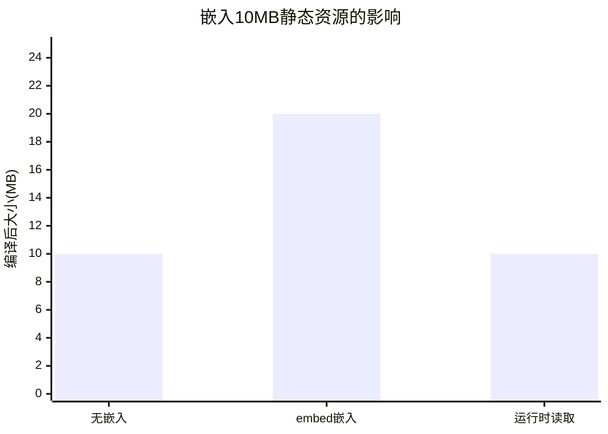

#  embed完全指南

新手也能秒懂的Go标准库教程!从基础到实战,一文打通!

## 📖 包简介

在Go 1.16之前,如果你想把HTML模板、配置文件、静态资源打包进Go二进制文件,你只有两种选择:将文件内容硬编码为字符串,或使用第三方工具(如`go-bindata`)将文件转换为Go代码。这两种方案都不够优雅。

`embed`包的横空出世改变了这一切。它通过**编译指令**的方式,让Go编译器在构建时将文件内容直接嵌入到二进制文件中。从此,你的Go程序可以真正做到**单文件部署**,不需要额外的资源文件。

这个功能看起来简单,但背后的编译器集成非常精巧:嵌入的文件支持通配符、支持目录递归、支持三种数据类型(`string`/`[]byte`/`embed.FS`),并且完全兼容Go的跨平台编译。

**典型使用场景**: 嵌入式Web服务器(HTML/CSS/JS)、CLI工具内置帮助文档、配置文件内嵌、数据库迁移脚本嵌入、证书和密钥打包、国际化资源内置。

## 🎯 核心功能概览

### 使用方式

`embed`通过特殊的**编译指令**工作,格式为`//go:embed`,紧跟在变量声明上方:

```go
//go:embed filename.txt
var content string
```

### 支持的变量类型

| 类型 | 说明 | 适用场景 |
|------|------|---------|
| `string` | 文件内容为字符串 | 文本文件、JSON、HTML |
| `[]byte` | 文件内容为字节切片 | 二进制文件、图片 |
| `embed.FS` | 嵌入文件系统 | 多文件/目录 |

### embed.FS核心方法

| 方法 | 说明 |
|------|------|
| `fs.Open(name)` | 打开文件,返回`fs.File` |
| `fs.ReadFile(name)` | 读取文件内容,返回`[]byte` |
| `fs.ReadDir(name)` | 读取目录,返回`[]fs.DirEntry` |
| `fs.Stat(name)` | 获取文件信息 |
| `fs.Sub(dir)` | 获取子目录的FS视图 |

### 指令语法规则

| 语法 | 说明 |
|------|------|
| `//go:embed file.txt` | 嵌入单个文件 |
| `//go:embed dir/*` | 嵌入目录下所有文件(递归) |
| `//go:embed *.html *.css` | 嵌入多个匹配的文件 |
| `//go:embed dir` | 嵌入目录(不包括目录本身) |

## 💻 实战示例

### 示例1:基础用法

```go
package main

import (
	_ "embed"
	"fmt"
)

//go:embed hello.txt
var hello string

//go:embed hello.txt
var helloBytes []byte

func main() {
	// 方式1: 嵌入为字符串
	fmt.Println("=== 嵌入为string ===")
	fmt.Println(hello)

	// 方式2: 嵌入为[]byte
	fmt.Println("=== 嵌入为[]byte ===")
	fmt.Printf("字节数: %d\n", len(helloBytes))
	fmt.Printf("内容: %s\n", string(helloBytes))

	// 验证: 两种方式内容一致
	fmt.Printf("内容一致: %v\n", hello == string(helloBytes))
}
```

对应的`hello.txt`文件:
```
Hello, embed!
This file is embedded at compile time.
```

### 示例2:embed.FS - 嵌入整个目录

```go
package main

import (
	"embed"
	"fmt"
	"io/fs"
	"net/http"
)

//go:embed static/*
var staticFiles embed.FS

func main() {
	// === 方式1: 遍历嵌入的文件 ===
	fmt.Println("=== 嵌入的文件列表 ===")

	fs.WalkDir(staticFiles, ".", func(path string, d fs.DirEntry, err error) error {
		if err != nil {
			return err
		}
		// 跳过根目录
		if path == "." {
			return nil
		}

		info, _ := d.Info()
		fmt.Printf("  %s (%d 字节, %s)\n",
			path, info.Size(),
			map[bool]string{true: "目录", false: "文件"}[d.IsDir()])
		return nil
	})

	// === 方式2: 读取单个文件 ===
	fmt.Println("\n=== 读取文件 ===")
	content, err := staticFiles.ReadFile("static/index.html")
	if err != nil {
		fmt.Printf("读取失败: %v\n", err)
	} else {
		fmt.Printf("index.html 内容:\n%s\n", string(content))
	}

	// === 方式3: 作为http.FileSystem使用 ===
	fmt.Println("\n=== 作为HTTP文件服务器 ===")

	// 将embed.FS转换为http.FileSystem
	fileServer := http.FileServer(http.FS(staticFiles))

	// 创建路由
	mux := http.NewServeMux()
	mux.Handle("/static/", http.StripPrefix("/static/", fileServer))

	fmt.Println("文件服务器已启动: http://localhost:8080/static/")
	fmt.Println("按 Ctrl+C 停止")

	// 实际启动(演示用,不阻塞)
	// http.ListenAndServe(":8080", mux)
}
```

假设`static/`目录结构:
```
static/
├── index.html
├── style.css
└── js/
    └── app.js
```

### 示例3:最佳实践 - 单文件Web服务器

```go
package main

import (
	"embed"
	"fmt"
	"io/fs"
	"net/http"
	"os"
)

//go:embed templates/*.html
var templatesFS embed.FS

//go:embed static/*
var staticFS embed.FS

//go:embed VERSION
var version string

// App 应用结构
type App struct {
	version string
	mux     *http.ServeMux
}

func NewApp() *App {
	app := &App{
		version: version,
		mux:     http.NewServeMux(),
	}
	app.setupRoutes()
	return app
}

func (app *App) setupRoutes() {
	// 首页
	app.mux.HandleFunc("/", func(w http.ResponseWriter, r *http.Request) {
		if r.URL.Path != "/" {
			http.NotFound(w, r)
			return
		}
		w.Header().Set("Content-Type", "text/html; charset=utf-8")
		content, _ := templatesFS.ReadFile("templates/index.html")
		w.Write(content)
	})

	// API - 版本信息
	app.mux.HandleFunc("/api/version", func(w http.ResponseWriter, r *http.Request) {
		w.Header().Set("Content-Type", "application/json")
		fmt.Fprintf(w, `{"version":"%s"}`, app.version)
	})

	// 静态文件
	staticHandler := http.FileServer(http.FS(staticFS))
	app.mux.Handle("/static/", http.StripPrefix("/static/", staticHandler))

	// 健康检查
	app.mux.HandleFunc("/health", func(w http.ResponseWriter, r *http.Request) {
		w.Write([]byte("OK"))
	})
}

// Run 启动服务器
func (app *App) Run(addr string) error {
	fmt.Printf("🚀 服务器启动中...\n")
	fmt.Printf("   版本: %s", app.version)
	fmt.Printf("   地址: http://%s\n", addr)
	fmt.Printf("   健康检查: http://%s/health\n", addr)
	return http.ListenAndServe(addr, app.mux)
}

// Sub目录演示
func demonstrateSub() {
	fmt.Println("=== Sub目录演示 ===")

	// 创建一个只暴露static/js子目录的FS
	jsFS, err := fs.Sub(staticFS, "static/js")
	if err != nil {
		fmt.Printf("Sub失败: %v\n", err)
		return
	}

	// 读取子目录内容
	entries, _ := fs.ReadDir(jsFS, ".")
	fmt.Println("static/js/ 目录内容:")
	for _, e := range entries {
		fmt.Printf("  - %s\n", e.Name())
	}
}

// 环境变量切换演示
func checkEnv() string {
	port := os.Getenv("PORT")
	if port == "" {
		port = "8080"
	}
	return port
}

func main() {
	app := NewApp()

	// 演示Sub
	demonstrateSub()

	// 启动
	port := checkEnv()
	if err := app.Run(":" + port); err != nil {
		fmt.Printf("启动失败: %v\n", err)
	}
}
```

## ⚠️ 常见陷阱与注意事项

1. **指令与声明必须在同一文件**: `//go:embed`指令和它修饰的变量声明必须在**同一个Go源文件**中,不能跨文件引用。

2. **嵌入路径相对于包目录**: 嵌入的文件路径是相对于**包含指令的Go文件所在的包目录**,不是相对于项目根目录。如果你的文件在`cmd/server/`中,嵌入路径也是从`cmd/server/`开始算。

3. **不能嵌入生成文件**: 嵌入的文件不能是通过`go generate`生成的文件,因为这些文件在编译时可能还不存在。如果确实需要,可以先手动运行`go generate`。

4. **通配符匹配隐藏文件**: `*`和`**`通配符默认**包括隐藏文件**(以`.`开头的文件)。如果不想嵌入隐藏文件,需要显式排除。

5. **二进制大小暴涨**: 嵌入大文件(如图片、视频)会导致编译后的二进制文件显著增大。如果嵌入数百MB的文件,编译时间和内存消耗也会大幅增加。

6. **Go 1.19+的Go 1.20+的模式变化**: 从Go 1.20开始,`//go:embed`的模式默认匹配文件时也匹配目录(为了兼容性)。如果需要只匹配文件,使用`f:pattern`前缀。

## 🚀 Go 1.26新特性

`embed`包本身在Go 1.26中**没有新增API**,但Go 1.26对编译器的一些内部优化对embed有间接影响:

1. **更高效的二进制构建**: Go 1.26编译器对嵌入数据的存储做了内部优化,特别是大文件嵌入时的内存占用有所降低。
2. **与`go/ast`的`ValueEnd`改进的联动**: 源码工具(如linter)现在可以更准确地识别`//go:embed`指令所在行,对embed指令的静态分析能力更强。

## 📊 性能优化建议

### 嵌入方案对比

| 方案 | 优点 | 缺点 | 适用场景 |
|------|------|------|---------|
| **embed(编译时嵌入)** | 单文件部署,零依赖 | 二进制大,修改需重新编译 | 小型Web应用,CLI工具 |
| http.FileServer(运行时读取) | 修改文件不需重新编译 | 需要额外的文件部署 | 大型项目,频繁变更的静态资源 |
| CDN/外部存储 | 不占用服务器资源 | 需要网络连接 | 生产环境,大文件 |



**性能建议**:

1. **控制嵌入总量**: 建议嵌入的静态资源不超过50MB,否则编译后的二进制定位和分发都会变慢
2. **生产用CDN**: 即使是嵌入式应用,生产环境也建议将大文件放到CDN,embed只保留fallback
3. **用[]byte替代string**: 嵌入二进制文件(png/jpg)时用`[]byte`类型,避免string的额外内存拷贝
4. **压缩后再嵌入**: HTML/CSS/JS在嵌入前先压缩(minify),可以显著减少二进制大小
5. **用Sub隔离子目录**: 如果只需要部分文件,用`fs.Sub`创建子FS,避免加载整个嵌入树

## 🔗 相关包推荐

- **`io/fs`**: 文件系统接口,`embed.FS`实现了这个接口
- **`net/http`**: HTTP服务器,embed的主要消费场景
- **`html/template`**: HTML模板,常与embed配合使用
- **`text/template`**: 文本模板,配置文件嵌入
- **`compress/gzip`**: 预压缩静态资源

---