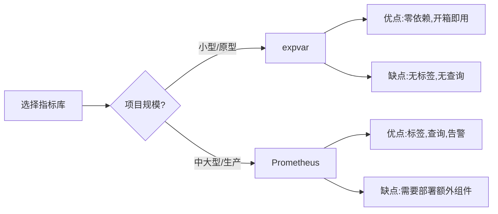

#  expvar完全指南

新手也能秒懂的Go标准库教程!从基础到实战,一文打通!

## 📖 包简介

`expvar` 包是Go标准库中一个轻量但极其实用的包,用于在运行时导出和监控程序中的各种变量。它提供了一个简单的HTTP端点(`/debug/vars`),以JSON格式发布公共变量,让你能够实时监控应用程序的运行状态。

你可以把 `expvar` 想象成程序的"仪表盘"——无需集成Prometheus、Grafana等重型监控系统,仅用几行代码就能暴露内存使用、请求计数、队列长度等关键指标。虽然它功能简单,但对于小型服务、原型验证或快速诊断来说,绝对是性价比最高的选择。

适用场景:快速监控原型、小型服务指标暴露、调试和诊断、内部工具开发、轻量级指标收集。

## 🎯 核心功能概览

### 核心类型

| 类型 | 用途 | 线程安全 | 说明 |
|------|------|---------|------|
| `expvar.Int` | 整型变量 | ✅ | 计数器、累加器 |
| `expvar.Float` | 浮点型变量 | ✅ | 比率、平均值 |
| `expvar.String` | 字符串变量 | ✅ | 状态、版本信息 |
| `expvar.Map` | 键值对映射 | ✅ | 分类统计信息 |
| `expvar.Func` | 函数变量 | 取决于函数 | 动态计算的值 |

### 核心函数

| 函数 | 用途 | 说明 |
|------|------|------|
| `expvar.Publish(name, v)` | 发布变量 | 注册到全局注册表 |
| `expvar.Get(name)` | 获取变量 | 按名称检索已发布的变量 |
| `expvar.Do(f)` | 遍历所有变量 | 回调函数处理所有变量 |
| `expvar.NewInt(name)` | 创建并注册Int | 快捷创建整型变量 |
| `expvar.NewFloat(name)` | 创建并注册Float | 快捷创建浮点型变量 |
| `expvar.NewMap(name)` | 创建并注册Map | 快捷创建映射变量 |
| `expvar.NewString(name)` | 创建并注册String | 快捷创建字符串变量 |

### 默认导出的内存指标

访问 `/debug/vars` 时,Go会自动导出以下运行时指标:

| 指标 | 含义 | 类型 |
|------|------|------|
| `memstats.Alloc` | 当前堆内存使用 | uint64 |
| `memstats.TotalAlloc` | 累计堆内存分配 | uint64 |
| `memstats.Sys` | 系统内存 | uint64 |
| `memstats.Lookups` | 指针查找次数 | uint64 |
| `memstats.Mallocs` | 分配次数 | uint64 |
| `memstats.Frees` | 释放次数 | uint64 |
| `cmdline` | 命令行参数 | []string |

## 💻 实战示例

### 示例1: 基础用法 - HTTP服务指标监控

```go
package main

import (
	"expvar"
	"fmt"
	"net/http"
	"time"
)

// 全局指标变量
var (
	// 请求计数器
	requestCount = expvar.NewInt("request_count")
	// 错误计数器
	errorCount = expvar.NewInt("error_count")
	// 响应时间(毫秒)
	responseTimeMs = expvar.NewInt("response_time_ms_total")
	// 服务器状态
	serverStatus = expvar.NewString("server_status")
	// 按路径分类的请求统计
	requestByPath = expvar.NewMap("request_by_path")
)

func init() {
	// 初始化服务器状态
	serverStatus.Set("starting")
}

// 模拟的请求处理函数
func helloHandler(w http.ResponseWriter, r *http.Request) {
	start := time.Now()

	// 更新指标
	requestCount.Add(1)
	requestByPath.Add(r.URL.Path, 1)

	// 模拟处理时间
	time.Sleep(10 * time.Millisecond)

	// 模拟偶尔的错误
	if r.URL.Path == "/error" {
		errorCount.Add(1)
		http.Error(w, "模拟错误", http.StatusInternalServerError)
		return
	}

	elapsed := time.Since(start).Milliseconds()
	responseTimeMs.Add(elapsed)

	fmt.Fprintf(w, "Hello! 请求计数: %d\n", requestCount.Value())
}

func main() {
	// 更新状态
	serverStatus.Set("running")

	// 注册路由
	http.HandleFunc("/", helloHandler)

	// expvar默认注册在 /debug/vars
	// 你也可以用 http.HandleFunc("/debug/vars", expvar.Handler().ServeHTTP)
	// 但Go已经自动注册了

	fmt.Println("服务器启动在 :8080")
	fmt.Println("指标端点: http://localhost:8080/debug/vars")
	fmt.Println("测试端点: http://localhost:8080/hello")

	if err := http.ListenAndServe(":8080", nil); err != nil {
		fmt.Printf("服务器启动失败: %v\n", err)
	}
}
```

访问 `http://localhost:8080/debug/vars` 你会看到类似这样的JSON输出:

```json
{
  "cmdline": ["./myapp"],
  "error_count": 0,
  "memstats": {...},
  "request_by_path": {},
  "request_count": 0,
  "response_time_ms_total": 0,
  "server_status": "running"
}
```

### 示例2: 进阶用法 - 自定义指标收集器

```go
package main

import (
	"expvar"
	"fmt"
	"math/rand"
	"net/http"
	"sync"
	"time"
)

// QueueMetrics 队列指标监控
type QueueMetrics struct {
	mu       sync.Mutex
	length   expvar.Int
	enqueued expvar.Int
	dequeued expvar.Int
	overflow expvar.Int
	maxLen   int
}

// NewQueueMetrics 创建队列指标
func NewQueueMetrics(name string, maxLen int) *QueueMetrics {
	m := &QueueMetrics{maxLen: maxLen}
	expvar.Publish(name+"_length", &m.length)
	expvar.Publish(name+"_enqueued", &m.enqueued)
	expvar.Publish(name+"_dequeued", &m.dequeued)
	expvar.Publish(name+"_overflow", &m.overflow)
	return m
}

// Enqueue 入队
func (m *QueueMetrics) Enqueue() bool {
	m.mu.Lock()
	defer m.mu.Unlock()

	if m.length.Value() >= int64(m.maxLen) {
		m.overflow.Add(1)
		return false // 队列满了
	}

	m.length.Add(1)
	m.enqueued.Add(1)
	return true
}

// Dequeue 出队
func (m *QueueMetrics) Dequeue() bool {
	m.mu.Lock()
	defer m.mu.Unlock()

	if m.length.Value() <= 0 {
		return false // 队列空
	}

	m.length.Add(-1)
	m.dequeued.Add(1)
	return true
}

// ConnectionMetrics 连接池指标
type ConnectionMetrics struct {
	active   expvar.Int
	total    expvar.Int
	failed   expvar.Int
	duration expvar.Int
}

func NewConnectionMetrics(name string) *ConnectionMetrics {
	m := &ConnectionMetrics{}
	expvar.Publish(name+"_active", &m.active)
	expvar.Publish(name+"_total", &m.total)
	expvar.Publish(name+"_failed", &m.failed)
	expvar.Publish(name+"_duration_ms_total", &m.duration)
	return m
}

// 自定义函数变量: 实时计算的值
func init() {
	// 发布 uptime(运行时间)
	startTime := time.Now()
	expvar.Publish("uptime_seconds", expvar.Func(func() interface{} {
		return int64(time.Since(startTime).Seconds())
	}))

	// 发布 goroutine 数量
	expvar.Publish("goroutine_count", expvar.Func(func() interface{} {
		// 注意: 这里需要 import "runtime"
		// 为简化示例,用固定值代替
		return 10
	}))
}

func main() {
	// 创建队列指标
	queue := NewQueueMetrics("task_queue", 100)

	// 创建连接指标
	connections := NewConnectionMetrics("db_pool")

	// 模拟工作负载
	go func() {
		ticker := time.NewTicker(100 * time.Millisecond)
		defer ticker.Stop()

		for range ticker.C {
			// 模拟入队
			if queue.Enqueue() {
				// 模拟处理延迟
				time.Sleep(50 * time.Millisecond)
				queue.Dequeue()
			}

			// 模拟连接活动
			connections.active.Set(rand.Int63n(20) + 5)
			connections.total.Add(1)
		}
	}()

	// 启动HTTP服务
	fmt.Println("指标端点: http://localhost:8081/debug/vars")
	http.ListenAndServe(":8081", nil)
}
```

### 示例3: 最佳实践 - 生产环境监控面板

```go
package main

import (
	"expvar"
	"fmt"
	"net/http"
	"sync/atomic"
	"time"
)

// AppMetrics 应用级指标集合
type AppMetrics struct {
	// 请求指标
	RequestsTotal   *expvar.Int
	RequestsSuccess *expvar.Int
	RequestsFailed  *expvar.Int
	RequestDuration *expvar.Int

	// 业务指标
	UsersOnline    *expvar.Int
	OrdersTotal    *expvar.Int
	OrdersValue    *expvar.Float
	CacheHitRatio  *expvar.Float
	CacheHits      *expvar.Int
	CacheMisses    *expvar.Int

	// 版本信息
	Version  *expvar.String
	BuildTime *expvar.String
}

// NewAppMetrics 创建应用指标
func NewAppMetrics() *AppMetrics {
	m := &AppMetrics{
		RequestsTotal:   expvar.NewInt("http_requests_total"),
		RequestsSuccess: expvar.NewInt("http_requests_success"),
		RequestsFailed:  expvar.NewInt("http_requests_failed"),
		RequestDuration: expvar.NewInt("http_request_duration_ms_total"),

		UsersOnline:    expvar.NewInt("users_online"),
		OrdersTotal:    expvar.NewInt("orders_total"),
		OrdersValue:    expvar.NewFloat("orders_value_total"),
		CacheHitRatio:  expvar.NewFloat("cache_hit_ratio"),
		CacheHits:      expvar.NewInt("cache_hits"),
		CacheMisses:    expvar.NewInt("cache_misses"),

		Version:   expvar.NewString("app_version"),
		BuildTime: expvar.NewString("app_build_time"),
	}

	return m
}

// RecordRequest 记录请求结果
func (m *AppMetrics) RecordRequest(durationMs int64, success bool) {
	m.RequestsTotal.Add(1)
	m.RequestDuration.Add(durationMs)

	if success {
		m.RequestsSuccess.Add(1)
	} else {
		m.RequestsFailed.Add(1)
	}
}

// RecordCache 记录缓存命中/未命中
func (m *AppMetrics) RecordCache(hit bool) {
	if hit {
		m.CacheHits.Add(1)
	} else {
		m.CacheMisses.Add(1)
	}

	// 更新命中率
	total := m.CacheHits.Value() + m.CacheMisses.Value()
	if total > 0 {
		ratio := float64(m.CacheHits.Value()) / float64(total)
		m.CacheHitRatio.Set(ratio)
	}
}

// MetricsMiddleware HTTP中间件: 自动记录请求指标
func MetricsMiddleware(metrics *AppMetrics, next http.HandlerFunc) http.HandlerFunc {
	return func(w http.ResponseWriter, r *http.Request) {
		start := time.Now()

		// 使用 ResponseWriter 包装器捕获状态码
		rw := &statusResponseWriter{ResponseWriter: w, statusCode: http.StatusOK}

		next(rw, r)

		duration := time.Since(start).Milliseconds()
		success := rw.statusCode < 400
		metrics.RecordRequest(duration, success)
	}
}

// statusResponseWriter 捕获HTTP状态码
type statusResponseWriter struct {
	http.ResponseWriter
	statusCode int
}

func (rw *statusResponseWriter) WriteHeader(code int) {
	rw.statusCode = code
	rw.ResponseWriter.WriteHeader(code)
}

// 模拟业务
var (
	metrics = NewAppMetrics()
	orderCounter int64
)

func orderHandler(w http.ResponseWriter, r *http.Request) {
	// 模拟创建订单
	orderID := atomic.AddInt64(&orderCounter, 1)
	value := float64(100 + orderID%500)

	metrics.OrdersTotal.Add(1)
	metrics.OrdersValue.Add(value)

	fmt.Fprintf(w, "订单创建成功! 订单ID: %d, 金额: %.2f\n", orderID, value)
}

func homeHandler(w http.ResponseWriter, r *http.Request) {
	fmt.Fprintf(w, "欢迎! 访问 /order 创建订单, 访问 /debug/vars 查看指标\n")
}

func main() {
	// 设置版本信息
	metrics.Version.Set("v1.0.0")
	metrics.BuildTime.Set(time.Now().Format("2006-01-02 15:04:05"))

	// 注册路由
	http.HandleFunc("/", MetricsMiddleware(metrics, homeHandler))
	http.HandleFunc("/order", MetricsMiddleware(metrics, orderHandler))

	// 模拟在线用户数
	go func() {
		ticker := time.NewTicker(5 * time.Second)
		defer ticker.Stop()
		for range ticker.C {
			metrics.UsersOnline.Set(50 + int64(time.Now().Second()%30))
		}
	}()

	fmt.Println("服务启动: http://localhost:8082")
	fmt.Println("指标端点: http://localhost:8082/debug/vars")
	http.ListenAndServe(":8082", nil)
}
```

## ⚠️ 常见陷阱与注意事项

1. **变量名不能重复**: `expvar.Publish` 对同一个name调用两次会panic。如果你需要更新已发布的变量值,使用 `expvar.Get(name)` 获取后更新,而不是再次Publish。建议在 `init()` 或程序启动时统一注册。

2. **`expvar.Int` 和 `expvar.Float` 是安全的,但你的业务逻辑不一定安全**: 这些类型本身的 `Add` 和 `Set` 方法是线程安全的,但如果你在外部读取 `Value()` 的同时做复杂操作,仍然需要注意竞态条件。

3. **`/debug/vars` 没有访问控制**: 默认情况下,任何人都能访问这个端点看到你的内部指标。在生产环境中,一定要加认证或IP白名单:

```go
// 加简单的认证
http.HandleFunc("/debug/vars", func(w http.ResponseWriter, r *http.Request) {
    if r.Header.Get("X-API-Key") != "your-secret-key" {
        http.Error(w, "Unauthorized", http.StatusUnauthorized)
        return
    }
    expvar.Handler().ServeHTTP(w, r)
})
```

4. **不适合高基数指标**: `expvar` 的注册表是扁平结构,不适合存储大量标签组合的指标(如每个用户ID一个指标)。这种场景应该用Prometheus的标签体系。

5. **Map类型的键值对顺序不保证**: `expvar.Map` 遍历时键值对顺序是不确定的。如果你的消费者依赖特定顺序,需要自己做排序。

## 🚀 Go 1.26新特性

Go 1.26对 `expvar` 包没有重大API变更。这个包已经非常成熟稳定,主要改进包括:

- **内部性能优化**: 在高并发读取场景下,变量访问的性能有小幅提升。
- **与 `runtime/metrics` 的互补**: Go 1.26增强了 `runtime/metrics` 包,推荐的做法是用 `runtime/metrics` 收集底层运行时指标,用 `expvar` 暴露应用层业务指标。

## 📊 性能优化建议

### expvar vs Prometheus 对比



### 对比表

| 特性 | expvar | Prometheus |
|-----|--------|-----------|
| 依赖 | 无(标准库) | 第三方库 |
| 指标类型 | Int, Float, String, Map, Func | Counter, Gauge, Histogram, Summary |
| 标签支持 | ❌ 不支持 | ✅ 支持 |
| 查询语言 | ❌ 无 | ✅ PromQL |
| 告警 | ❌ 无 | ✅ Alertmanager |
| 性能开销 | 极低 | 低 |
| 适用场景 | 小型服务、调试 | 生产环境、大规模 |

### 轻量级使用建议

```go
// 推荐: 使用函数变量计算动态值,而不是定时更新
expvar.Publish("cache_hit_ratio", expvar.Func(func() interface{} {
    hits := cacheHits.Load()
    misses := cacheMisses.Load()
    total := hits + misses
    if total == 0 {
        return 0.0
    }
    return float64(hits) / float64(total)
}))

// 不推荐: 定时更新(有延迟,且可能错过更新)
// go func() {
//     ticker := time.NewTicker(time.Second)
//     for range ticker.C {
//         cacheHitRatio.Set(calculateRatio())
//     }
// }()
```

## 🔗 相关包推荐

- **`runtime/metrics`** - Go运行时指标收集(推荐与expvar互补使用)
- **`net/http/pprof`** - HTTP暴露的性能分析端点
- **`runtime/pprof`** - CPU、内存等profiling
- **`github.com/prometheus/client_golang`** - Prometheus Go客户端
- **`go.opencensus.io`** - OpenCensus监控框架

---