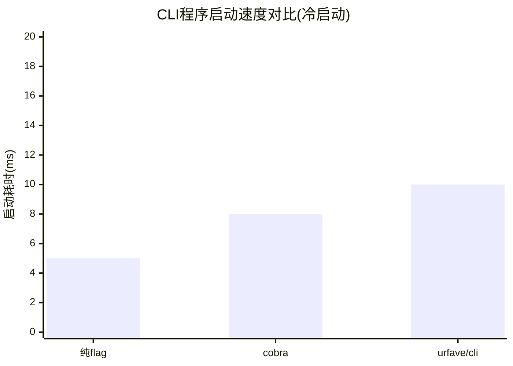

#  flag完全指南

新手也能秒懂的Go标准库教程!从基础到实战,一文打通!

## 📖 包简介

每一个CLI(Command Line Interface)程序的入口点都是**命令行参数解析**。在Go中,标准库的`flag`包就是干这个活的。它让你用声明变量的方式定义命令行参数,然后自动处理解析、类型转换、帮助信息生成和错误提示。

`flag`的设计非常Go味:它把命令行参数映射为程序中的变量,而不是返回一个巨大的map让你自己去类型断言。每个flag在声明时就绑定了目标变量的地址,解析完成后直接读取变量值即可,代码极其直观。

虽然第三方库(如`cobra`、`cli`、`urfave/cli`)提供了更丰富的CLI构建能力,但`flag`作为标准库,零依赖、零学习成本、即开即用,是中小型CLI工具的首选。

**典型使用场景**: 配置文件路径指定、调试模式开关、日志级别设置、端口/地址绑定、超时时间配置、一次性脚本参数。

## 🎯 核心功能概览

### 声明Flag的两种方式

**方式1: flag.Type() 返回指针**
```go
port := flag.Int("port", 8080, "服务器端口")
debug := flag.Bool("debug", false, "调试模式")
```

**方式2: flag.TypeVar() 绑定已有变量**
```go
var port int
flag.IntVar(&port, "port", 8080, "服务器端口")
```

### 支持的类型

| 函数 | 类型 | 示例 |
|------|------|------|
| `flag.Bool/BoolVar` | bool | `-debug=true` |
| `flag.Int/IntVar` | int | `-count=10` |
| `flag.Int64/Int64Var` | int64 | |
| `flag.Uint/UintVar` | uint | |
| `flag.Uint64/Uint64Var` | uint64 | |
| `flag.Float64/Float64Var` | float64 | `-rate=0.5` |
| `flag.String/StringVar` | string | `-name=alice` |
| `flag.Duration/DurationVar` | time.Duration | `-timeout=30s` |
| `flag.Text/TextVar`(Go 1.25+) | encoding.TextUnmarshaler | |
| `flag.Func`(Go 1.21+) | 自定义函数 | |

### FlagSet核心方法

| 方法 | 说明 |
|------|------|
| `flag.NewFlagSet()` | 创建新的参数集 |
| `fs.Parse(args)` | 解析参数 |
| `fs.Parsed()` | 是否已解析 |
| `fs.Visit(fn)` | 遍历**已设置**的flag |
| `fs.VisitAll(fn)` | 遍历**所有**flag |
| `fs.Args()` | 获取位置参数(非flag部分) |
| `fs.NArg()` | 位置参数数量 |
| `fs.Arg(i)` | 第i个位置参数 |
| `fs.PrintDefaults()` | 打印帮助信息 |
| `fs.Set(name, value)` | 手动设置flag值 |

### 命令行格式

| 格式 | 示例 | 说明 |
|------|------|------|
| `-flag=value` | `-port=8080` | 推荐格式 |
| `-flag value` | `-port 8080` | 非bool类型可用 |
| `-flag` | `-debug` | bool类型简写(值为true) |

## 💻 实战示例

### 示例1:基础用法

```go
package main

import (
	"flag"
	"fmt"
	"time"
)

func main() {
	// === 方式1: flag.Type() 返回指针 ===
	port := flag.Int("port", 8080, "服务器端口")
	host := flag.String("host", "localhost", "服务器地址")
	debug := flag.Bool("debug", false, "开启调试模式")

	// === 方式2: flag.TypeVar() 绑定变量 ===
	var timeout time.Duration
	flag.DurationVar(&timeout, "timeout", 30*time.Second, "请求超时时间")

	var workers int
	flag.IntVar(&workers, "workers", 4, "并发工作协程数")

	// 自定义Flag名称(使用短横线格式)
	var verbose bool
	flag.BoolVar(&verbose, "v", false, "详细输出(简写)")

	// 解析命令行参数(必须在所有flag声明之后调用)
	flag.Parse()

	// === 使用解析结果 ===
	fmt.Println("=== 配置信息 ===")
	fmt.Printf("  地址: %s:%d\n", *host, *port)
	fmt.Printf("  调试模式: %v\n", *debug)
	fmt.Printf("  超时: %v\n", timeout)
	fmt.Printf("  工作协程: %d\n", workers)
	fmt.Printf("  详细输出: %v\n", verbose)

	// === 位置参数(非-flag部分) ===
	remaining := flag.Args()
	fmt.Printf("\n位置参数(%d个): %v\n", flag.NArg(), remaining)

	// 示例用法:
	// go run main.go -port=9090 -debug -timeout=1m file1.txt file2.txt
	// 输出:
	//   地址: localhost:9090
	//   调试模式: true
	//   超时: 1m0s
	//   工作协程: 4
	//   位置参数(2个): [file1.txt file2.txt]
}
```

### 示例2:子命令实现

```go
package main

import (
	"flag"
	"fmt"
	"os"
)

func main() {
	// 全局flag
	version := flag.Bool("version", false, "打印版本号")

	// === 子命令: add ===
	addCmd := flag.NewFlagSet("add", flag.ExitOnError)
	addName := addCmd.String("name", "", "用户姓名(必填)")
	addAge := addCmd.Int("age", 0, "用户年龄")
	addEmail := addCmd.String("email", "", "邮箱地址")

	// === 子命令: delete ===
	deleteCmd := flag.NewFlagSet("delete", flag.ExitOnError)
	deleteID := deleteCmd.Int("id", 0, "用户ID(必填)")
	deleteForce := deleteCmd.Bool("force", false, "强制删除(不确认)")

	// === 子命令: list ===
	listCmd := flag.NewFlagSet("list", flag.ExitOnError)
	listPage := listCmd.Int("page", 1, "页码")
	listLimit := listCmd.Int("limit", 20, "每页数量")

	// 检查是否有子命令
	if len(os.Args) < 2 {
		fmt.Println("用法: cli <command> [options]")
		fmt.Println("\n可用命令:")
		fmt.Println("  add      添加用户")
		fmt.Println("  delete   删除用户")
		fmt.Println("  list     列出用户")
		fmt.Println("\n全局选项:")
		flag.PrintDefaults()
		os.Exit(1)
	}

	// 处理全局flag
	if *version {
		fmt.Println("cli version 1.0.0")
		os.Exit(0)
	}

	// 分派子命令
	switch os.Args[1] {
	case "add":
		addCmd.Parse(os.Args[2:])

		if *addName == "" {
			fmt.Println("错误: -name 是必填项")
			addCmd.PrintDefaults()
			os.Exit(1)
		}

		fmt.Printf("添加用户: %s, 年龄: %d", *addName, *addAge)
		if *addEmail != "" {
			fmt.Printf(", 邮箱: %s", *addEmail)
		}
		fmt.Println()

	case "delete":
		deleteCmd.Parse(os.Args[2:])

		if *deleteID == 0 {
			fmt.Println("错误: -id 是必填项")
			deleteCmd.PrintDefaults()
			os.Exit(1)
		}

		if *deleteForce {
			fmt.Printf("强制删除用户 ID=%d\n", *deleteID)
		} else {
			fmt.Printf("确认删除用户 ID=%d? (y/N): ", *deleteID)
			// 实际应用中从stdin读取
		}

	case "list":
		listCmd.Parse(os.Args[2:])
		fmt.Printf("列出用户: 第%d页, 每页%d条\n", *listPage, *listLimit)

	default:
		fmt.Printf("未知命令: %s\n", os.Args[1])
		os.Exit(1)
	}
}
```

### 示例3:最佳实践 - flag.Func自定义类型

```go
package main

import (
	"flag"
	"fmt"
	"net"
	"os"
	"strings"
)

func main() {
	// === flag.Func: Go 1.21+ 自定义类型解析 ===

	// 示例1: 逗号分隔的字符串列表
	var tags []string
	flag.Func("tags", "标签(逗号分隔)", func(s string) error {
		for _, t := range strings.Split(s, ",") {
			tags = append(tags, strings.TrimSpace(t))
		}
		return nil
	})

	// 示例2: 键值对映射
	headers := make(map[string]string)
	flag.Func("header", "HTTP请求头(可多次使用,格式: Key=Value)", func(s string) error {
		parts := strings.SplitN(s, "=", 2)
		if len(parts) != 2 {
			return fmt.Errorf("格式错误: 应为 Key=Value, 得到: %s", s)
		}
		headers[parts[0]] = parts[1]
		return nil
	})

	// 示例3: IP地址解析
	var addr net.IP
	flag.Func("ip", "IP地址", func(s string) error {
		parsed := net.ParseIP(s)
		if parsed == nil {
			return fmt.Errorf("无效IP地址: %s", s)
		}
		addr = parsed
		return nil
	})

	// 示例4: 百分比值(0-100)
	var quality int
	flag.Func("quality", "图片质量(0-100)", func(s string) error {
		var q int
		_, err := fmt.Sscanf(s, "%d", &q)
		if err != nil {
			return fmt.Errorf("质量必须是整数: %w", err)
		}
		if q < 0 || q > 100 {
			return fmt.Errorf("质量必须在0-100之间,得到: %d", q)
		}
		quality = q
		return nil
	})

	flag.Parse()

	// 打印结果
	fmt.Println("=== 自定义类型解析结果 ===")
	fmt.Printf("  标签: %v\n", tags)
	fmt.Printf("  Headers: %v\n", headers)
	fmt.Printf("  IP: %v\n", addr)
	fmt.Printf("  质量: %d\n", quality)

	// 示例运行:
	// go run main.go -tags=go,web,api -header "Content-Type=application/json" \
	//   -header "Authorization=Bearer xxx" -ip 192.168.1.1 -quality=85
}

// === 辅助函数: 优雅的错误处理 ===

// FlagError 自定义flag错误类型
type FlagError struct {
	Flag   string
	Value  string
	Reason string
}

func (e *FlagError) Error() string {
	return fmt.Sprintf("flag %s=%s: %s", e.Flag, e.Value, e.Reason)
}

// ValidatePort 端口验证辅助函数
func ValidatePort(s string) (int, error) {
	var port int
	_, err := fmt.Sscanf(s, "%d", &port)
	if err != nil {
		return 0, &FlagError{Flag: "port", Value: s, Reason: "必须是整数"}
	}
	if port < 1 || port > 65535 {
		return 0, &FlagError{Flag: "port", Value: s, Reason: "必须在1-65535之间"}
	}
	return port, nil
}

// 辅助函数: 打印更友好的帮助信息
func printHelp(fs *flag.FlagSet) {
	fmt.Println("用法: myapp [options] [args...]")
	fmt.Println("\n选项:")
	fs.PrintDefaults()
	fmt.Println("\n示例:")
	fmt.Println("  myapp -port=8080 -debug file.txt")
	fmt.Println("  myapp -timeout=30s -workers=8")
}

func init() {
	// 自定义usage函数
	flag.Usage = func() {
		fmt.Fprintf(os.Stderr, "%s - 我的CLI工具\n\n", os.Args[0])
		printHelp(flag.CommandLine)
	}
}
```

## ⚠️ 常见陷阱与注意事项

1. **flag.Parse()必须在所有flag声明之后调用**: 如果在声明之前调用,后续声明的flag不会被解析。这是新手最容易犯的错误。

2. **bool flag的解析行为**: `-flag`等价于`-flag=true`。这意味着如果bool flag后面紧跟另一个位置参数,它会被误认为flag的值。例如: `prog -debug file.txt`中,`file.txt`不会被当作bool的值(因为flag包对bool有特殊处理)。但`-flag value`格式对bool不生效。

3. **flag不支持短横线前缀**: Go的flag包只支持`-flag`和`--flag`两种格式,不支持GNU风格的长选项。`--port=8080`和`-port=8080`是等价的,但`--port 8080`和`-port 8080`也对。这与GNU getopt完全不同。

4. **位置参数在flag之后**: 所有`-flag=value`必须在位置参数之前。一旦遇到第一个非flag参数,后续所有内容都被视为位置参数。例如: `prog -a=1 file.txt -b=2`中,`-b=2`不会被解析,而是作为位置参数。

5. **默认FlagSet的命名冲突**: `flag.Int()`等函数操作的是`flag.CommandLine`全局FlagSet。如果在库代码中定义flag,可能与用户程序的flag冲突。库代码应创建自己的`flag.NewFlagSet()`。

## 🚀 Go 1.26新特性

`flag`包在Go 1.26中**API保持稳定**。

值得回顾的近期更新:
- **Go 1.21**: 新增`flag.Func()`和`flag.FuncVar()`,支持自定义类型解析函数,彻底告别了为实现`flag.Value`接口而写结构体的时代。
- **Go 1.25**: 新增`flag.Text()`和`flag.TextVar()`,支持实现了`encoding.TextUnmarshaler`接口的类型。

Go 1.26没有直接对flag包做变更,但整体运行时优化对CLI程序启动速度有轻微改善。

## 📊 性能优化建议

### flag vs 第三方CLI库

| 特性 | flag | cobra | urfave/cli |
|------|------|-------|-----------|
| 依赖 | 标准库(零依赖) | 第三方 | 第三方 |
| 子命令 | 手动实现 | 原生支持 | 原生支持 |
| 自动生成帮助 | 基础 | 完善 | 完善 |
| 启动速度 | **最快** | 稍慢 | 稍慢 |
| 学习成本 | **最低** | 中等 | 中等 |
| 适用场景 | 简单工具 | 复杂CLI | 中等CLI |



**性能建议**:

1. **简单工具选flag**: 如果CLI只有几个参数和1-2个子命令,标准库flag够了,不要引入第三方依赖
2. **复杂CLI选cobra**: 超过5个子命令、需要自动补全、shell集成、插件系统,果断上cobra
3. **自定义类型用flag.Func**: Go 1.21+的`flag.Func`替代了手动实现`flag.Value`接口,一行搞定
4. **懒加载重量级初始化**: CLI程序应在flag.Parse()之后再做重量级操作,避免用户输错参数也浪费启动时间
5. **库代码用自己的FlagSet**: 不要在库代码中用全局`flag.Int()`等操作,创建独立FlagSet避免命名冲突

## 🔗 相关包推荐

- **`os`**: 获取原始`os.Args`、环境变量
- **`os/exec`**: 执行外部命令,CLI程序的常见操作
- **`fmt`**: 格式化输出,Go 1.26优化了单参数`Errorf`的内存分配
- **`github.com/spf13/cobra`**: 最流行的CLI构建框架(第三方)
- **`github.com/urfave/cli/v2`**: 另一个轻量CLI库(第三方)

---