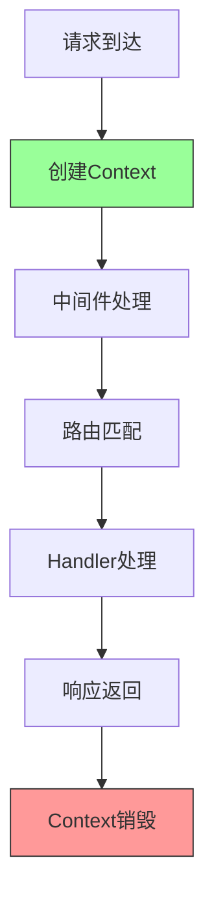

# Gin框架Context详解

## 一、Context核心定位

`gin.Context`是Gin框架的核心对象，贯穿**单个HTTP请求的全生命周期**，本质是对请求/响应流程的封装与控制中枢。它替代了Go标准库`net/http`的`ResponseWriter`和`Request`，并扩展了路由参数、中间件调度、数据传递、流程控制等核心能力。

## 二、Context核心功能

### 1. 请求参数与数据管理

```go
// 1. 路径参数（/user/:id）
id := c.Param("id")

// 2. Query参数（/list?page=1&size=10）
page := c.DefaultQuery("page", "1")
size := c.Query("size")

// 3. Post表单
username := c.PostForm("username")

// 4. JSON请求体
type LoginReq struct {
    Username string `json:"username" binding:"required"`
    Password string `json:"password" binding:"min=6"`
}
var req LoginReq
if err := c.ShouldBindJSON(&req); err != nil {
    c.JSON(400, gin.H{"error": err.Error()})
    return
}
```

### 2. 临时数据存储

```go
// 中间件中存入数据
func AuthMiddleware() gin.HandlerFunc {
    return func(c *gin.Context) {
        userId := 1001
        c.Set("userId", userId)
        c.Next()
    }
}

// 处理器中获取数据
r.GET("/profile", AuthMiddleware(), func(c *gin.Context) {
    userId, _ := c.Get("userId")
    c.JSON(200, gin.H{"userId": userId})
})
```

### 3. 请求流程控制

```go
// c.Next()：暂停当前中间件，执行后续逻辑
func Logger() gin.HandlerFunc {
    return func(c *gin.Context) {
        fmt.Println("请求前")
        c.Next() // 执行后续中间件和处理器
        fmt.Println("请求后")
    }
}

// c.Abort()：终止请求
func Auth() gin.HandlerFunc {
    return func(c *gin.Context) {
        if !isValid {
            c.AbortWithJSON(401, gin.H{"msg": "未登录"})
            return
        }
        c.Next()
    }
}
```

### 4. 响应构建

```go
// JSON响应
c.JSON(200, gin.H{"status": "ok"})

// String响应
c.String(200, "hello")

// XML响应
c.XML(200, gin.H{"status": "ok"})
```

## 三、Context生命周期



1. **创建**：客户端发起请求后，Gin创建全新的Context实例
2. **流转**：Context在中间件、处理器之间传递
3. **销毁**：请求处理完成后，Context实例被GC回收

## 四、并发安全问题

### 核心结论

> gin.Context**非并发安全**，严禁在goroutine中直接使用原Context，需通过`c.Copy()`复制后使用。

### 正确用法

```go
r.GET("/async", func(c *gin.Context) {
    // 复制Context
    cCopy := c.Copy()
    
    go func() {
        // 使用复制的Context
        cCopy.JSON(200, gin.H{"status": "ok"})
    }()
})
```

## 五、面试高频问答

### Q1: gin.Context和Go标准库的context.Context有什么区别？

| 特性 | gin.Context | context.Context |
|------|-------------|----------------|
| 所属 | Gin框架专属 | Go标准库 |
| 用途 | HTTP请求封装 | goroutine上下文传递 |
| 功能 | 参数获取、响应控制 | 超时、取消信号 |

### Q2: 临时数据会跨请求共享吗？

**答**：不会。每个请求对应独立的Context实例，临时数据存储在实例内部，请求结束后Context被GC回收。

### Q3: 为什么中间件中必须调用c.Next()或c.Abort()？

**答**：若不调用，中间件会阻塞后续流程。`c.Next()`是放行后续逻辑，`c.Abort()`是终止逻辑。

>