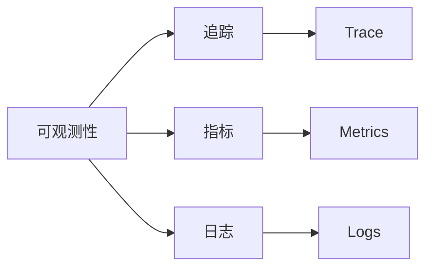

# OpenTelemetry：Go语言可观测性完全指南

> 在微服务架构中，可观测性是保障系统稳定的关键。OpenTelemetry（otel）是CNCF的可观测性标准，提供追踪、指标、日志的统一方案，被Kubernetes、Istio等著名项目采用。本文带你深入了解otel。

---

## 一、OpenTelemetry简介

### 1.1 什么是可观测性？

可观测性（Observability）包含三个方面：



### 1.2 为什么选择otel？

OpenTelemetry是CNCF的可观测性标准，特点：

| 特性 | 说明 |
|------|------|
| 统一标准 | 追踪+指标+日志 |
| 厂商中立 | 不绑定特定后端 |
| 自动埋点 | 零代码入侵 |
| 云原生 | CNCF毕业项目 |

采用otel的项目：

```
Kubernetes      # 容器编排
Istio           # 服务网格
Envoy           #sidecar代理
```

---

## 二、快速开始

### 2.1 安装

```bash
go get go.opentelemetry.io/otel
go get go.opentelemetry.io/otel/exporters/jaeger
go get go.opentelemetry.io/otel/sdk
```

### 2.2 初始化

```go
import (
    "go.opentelemetry.io/otel"
    "go.opentelemetry.io/otel/exporters/jaeger"
    "go.opentelemetry.io/otel/sdk/resource"
    sdktrace "go.opentelemetry.io/otel/sdk/trace"
)

func initTracer() (*sdktrace.TracerProvider, error) {
    exp, _ := jaeger.New(jaeger.WithCollectorEndpoint(
        jaeger.WithEndpoint("http://localhost:14268/api/traces"),
    ))
    
    tp := sdktrace.NewTracerProvider(
        sdktrace.WithBatcher(exp),
    )
    
    otel.SetTracerProvider(tp)
    return tp, nil
}
```

---

## 三、追踪（Trace）

### 3.1 创建追踪

```go
import "go.opentelemetry.io/otel/trace"

tracer := otel.Tracer("example.com/app")

ctx, span := tracer.Start(context.Background(), "operation")
defer span.End()

span.SetAttributes(
    attribute.String("key", "value"),
)
```

### 3.2 嵌套追踪

```go
ctx, span := tracer.Start(ctx, "parent")
defer span.End()

ctx, child := tracer.Start(ctx, "child")
defer child.End()
```

### 3.3 事件

```go
span.AddEvent("event name",
    attribute.String("key", "value"),
)

span.RecordError(err,
    attribute.String("error", err.Error()),
)
```

---

## 四、指标（Metrics）

### 4.1 计数器

```go
import "go.opentelemetry.io/otel/metric"

meter := otel.Meter("example.com/app")

counter, _ := meter.Int64Counter(
    "requests",
    metric.WithDescription("total requests"),
)

// 添加值
counter.Add(context.Background(), 1,
    attribute.String("method", "GET"),
)
```

### 4.2 观测值

```go
gauge, _ := meter.Int64ObservableGauge(
    "memory_usage",
    metric.WithCallback(func(_ context.Context, obsrv metric.Int64Observer) error {
        obsrv.Observe(int64(getMemory()),
            attribute.String("host", "localhost"),
        )
        return nil
    }),
)
```

### 4.3 直方图

```go
histogram, _ := meter.Float64Histogram(
    "request_duration",
    metric.WithDescription("request duration"),
    metric.WithUnit(unit.Millisecond),
)

histogram.Record(context.Background(), 125.5,
    attribute.String("endpoint", "/api/user"),
)
```

---

## 五、日志（Logs）

### 5.1 结构化日志

```go
import "go.opentelemetry.io/otel/log"

logger := otel.Logger("example.com/app")

logger.Info(context.Background(),
    "request completed",
    log.String("method", "GET"),
    log.String("path", "/api/user"),
    log.Int("status", 200),
)
```

### 5.2 日志级别

```go
logger.Debug(context.Background(), "debug message")
logger.Info(context.Background(), "info message")
logger.Warn(context.Background(), "warning message")
logger.Error(context.Background(), "error message")
```

---

## 六、导出器

### 6.1 Jaeger

```go
import "go.opentelemetry.io/otel/exporters/jaeger"

exp, _ := jaeger.New(jaeger.WithCollectorEndpoint(
    jaeger.WithEndpoint("http://localhost:14268/api/traces"),
))
```

### 6.2 Zipkin

```go
import "go.opentelemetry.io/otel/exporters/zipkin"

exp, _ := zipkin.New("http://localhost:9411/api/v2/spans")
```

### 6.3 OTLP

```go
import "go.opentelemetry.io/otel/export/otlp/otlptrace"

exp, _ := otlptrace.New(context.Background(),
    otlptrace.WithEndpoint("localhost:4317"),
)
```

---

## 七、自动埋点

### 7.1 HTTP埋点

```go
import "go.opentelemetry.io/otel/contrib/instrumentation/net/http/otelhttp"

handler := otelhttp.NewHandler(http.HandlerFunc(handler), "operation")
http.ListenAndServe(":8080", handler)
```

### 7.2 gRPC埋点

```go
import "go.opentelemetry.io/otel/contrib/instrumentation/google.golang.org/grpc/otelgrpc"

server := grpc.NewServer(
    grpc.UnaryInterceptor(otelgrpc.UnaryServerInterceptor()),
)
```

### 7.3 数据库埋点

```go
import "go.opentelemetry.io/otel/contrib/instrumentation/github.com/go-sql-driver/mysql"

db, _ := sql.Open("mysql", dsn)
```

---

## 八、资源

### 8.1 服务信息

```go
import "go.opentelemetry.io/otel/sdk/resource"

res, _ := resource.New(context.Background(),
    resource.WithAttributes(
        attribute.String("service.name", "example"),
        attribute.String("service.version", "1.0.0"),
    ),
)

tp := sdktrace.NewTracerProvider(
    sdktrace.WithResource(res),
)
```

### 8.2 主机信息

```go
res, _ := resource.New(context.Background(),
    resource.WithHost(),
)
```

---

## 九、实战技巧

### 9.1 采样

```go
import "go.opentelemetry.io/otel/sdk/trace"

sampler := trace.ParentBased(
    trace.AlwaysSample(),
)

tp := sdktrace.NewTracerProvider(
    sdktrace.WithSampler(sampler),
)
```

### 9.2 baggage传递

```go
import "go.opentelemetry.io/otel/baggage"

b, _ := baggage.FromContext(ctx)
b = b.SetMember(baggage.Member{
    Name:  "user",
    Value: "zhangsan",
})
```

### 9.3 多租户

```go
span.SetAttributes(
    attribute.String("tenant.id", tenantID),
)
```

---

OpenTelemetry是云原生可观测性的"标准"：

1. **统一标准**：追踪+指标+日志
2. **厂商中立**：不绑定后端
3. **自动埋点**：零入侵
4. **CNCF维护**：稳定可靠

微服务可观测性的首选！

---

>