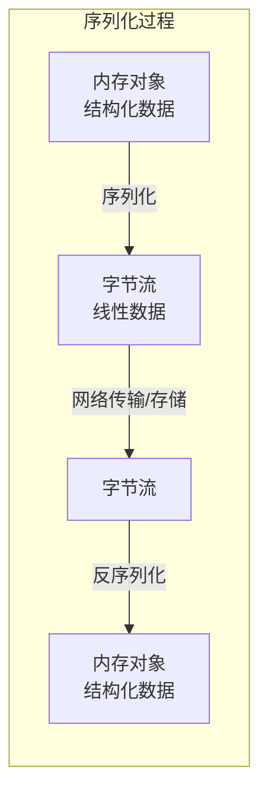
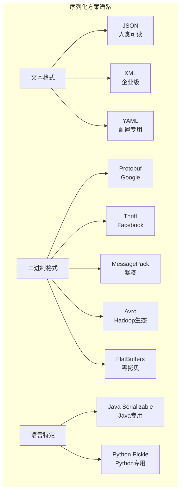
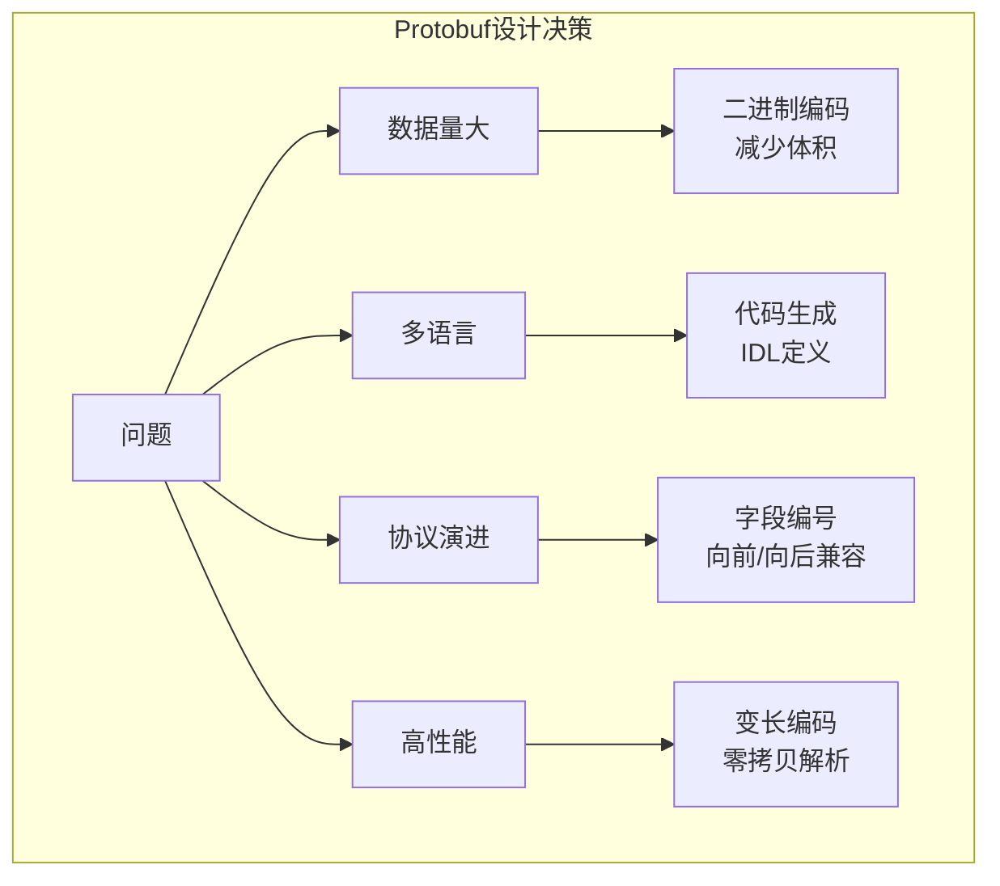
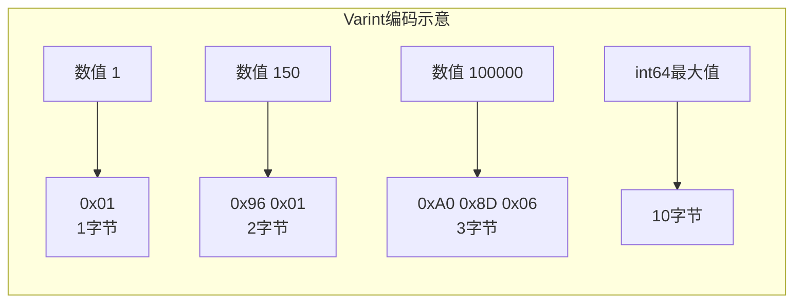
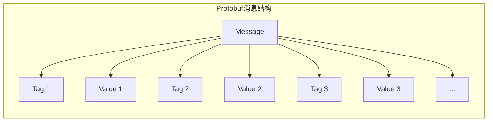
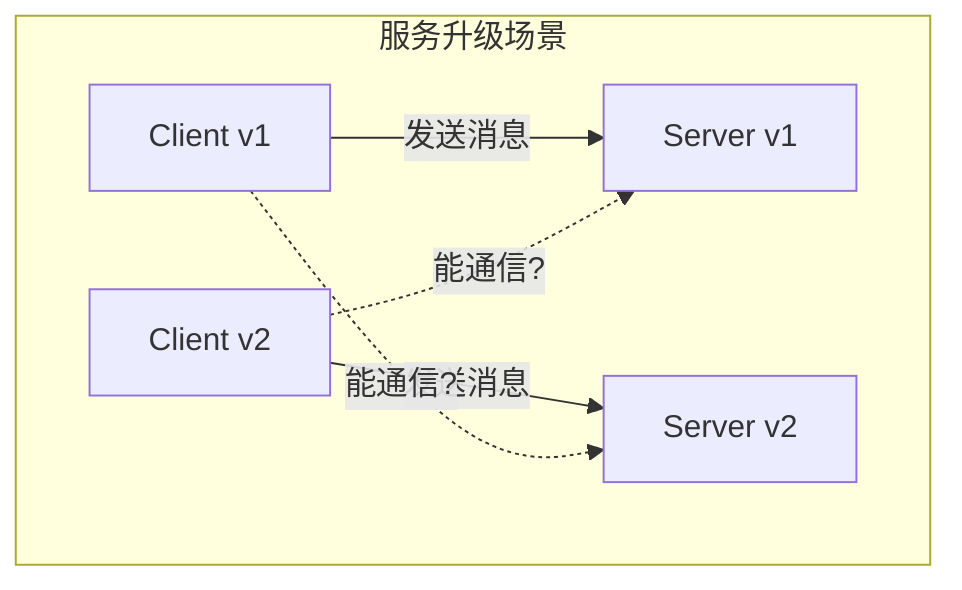
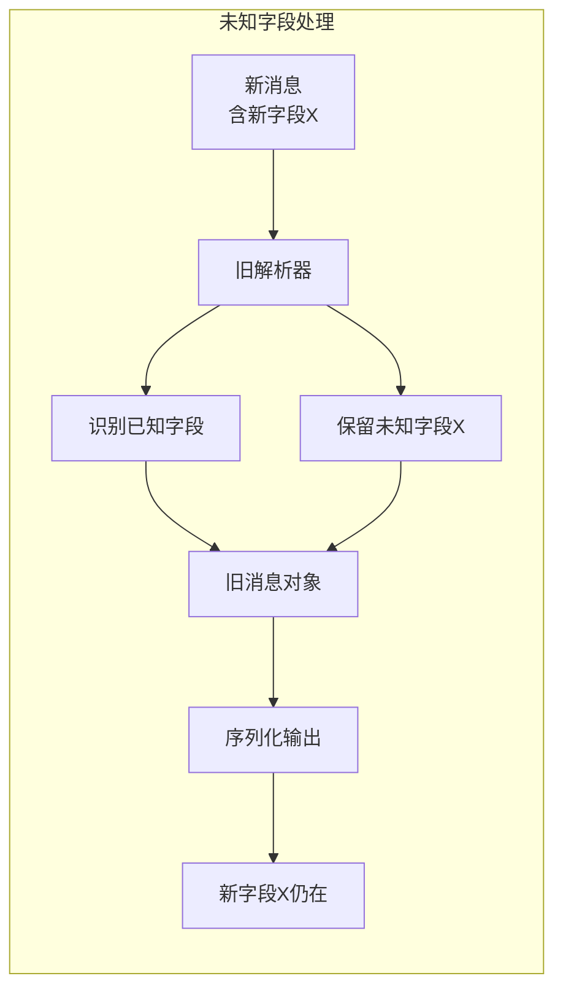
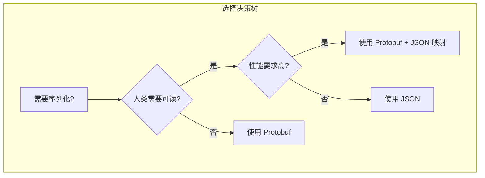
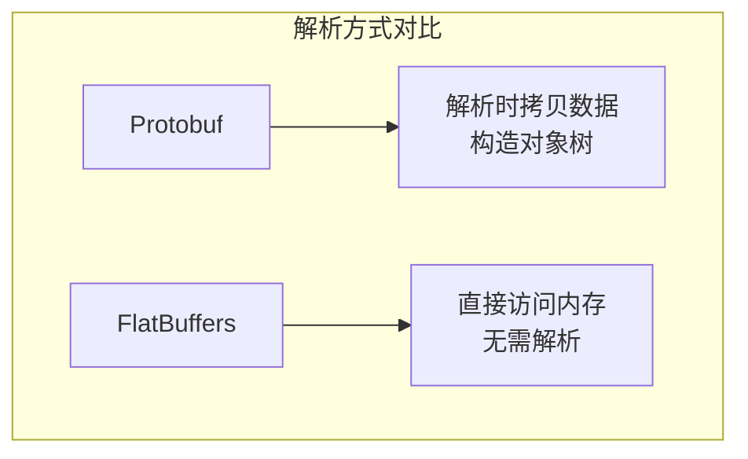
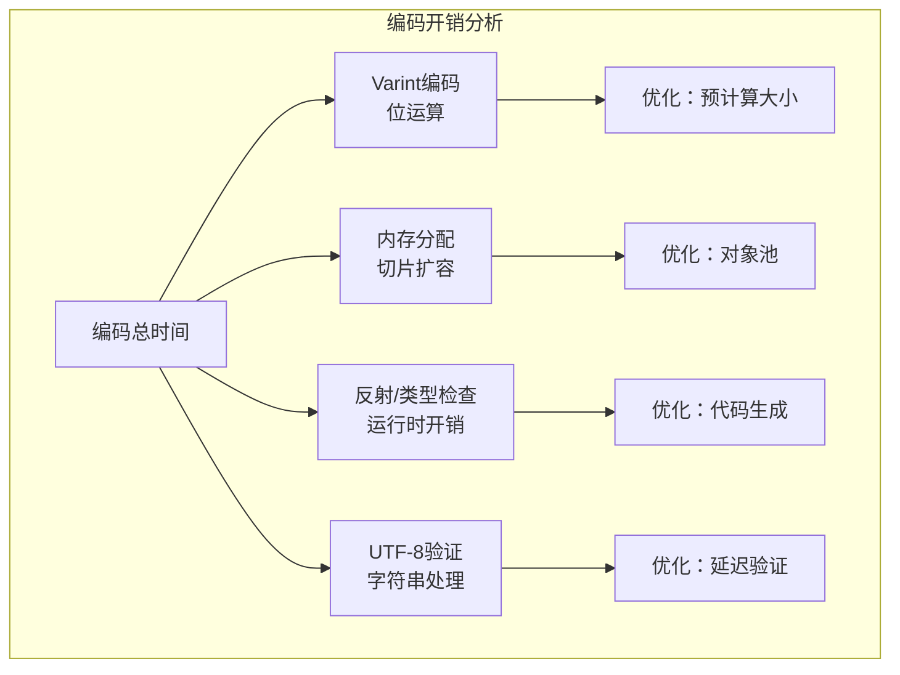

# Protobuf 深度解析：从编码原理到工程实践的完整指南

> 为什么 Google 的序列化方案能成为微服务时代的通用语言？

---

## 写在前面

如果你是一名后端工程师，当团队决定从单体架构迁移到微服务时，你用什么格式在服务间传递数据？如果你是一名移动端开发者，当 App 需要与服务器频繁交互时，你如何减少流量消耗？如果你是一名数据工程师，当需要处理 PB 级日志数据时，你选择什么存储格式？

答案很可能指向同一个技术——**Protobuf（Protocol Buffers）**。

它不是简单的"另一种 JSON"，而是从根本上重新思考了数据序列化的问题。本文将从零开始，带你由浅入深地掌握 Protobuf 的方方面面：从编码原理的数学基础，到二进制格式的逐字节解析，再到工程实践中的高级技巧。读完这篇文章，你将真正理解为什么 Protobuf 能成为现代分布式系统的基石。

---

## 第一篇：初识 Protobuf——为什么需要它？

### 1.1 数据序列化的本质问题

在计算机系统中，数据需要在不同组件间传递：进程间通信、网络传输、持久化存储。这个过程中，内存中的数据结构必须转换为可传输的字节流，这就是**序列化（Serialization）**；反向过程称为**反序列化（Deserialization）**。



**序列化方案的核心评价维度：**

| 维度 | 说明 | 重要性 |
|------|------|--------|
| 序列化后大小 | 数据压缩率 | 影响网络带宽和存储成本 |
| 序列化速度 | 编码耗时 | 影响系统吞吐量 |
| 反序列化速度 | 解码耗时 | 影响响应延迟 |
| 可读性 | 人类是否可读 | 影响调试和开发效率 |
| 跨语言支持 | 多语言兼容性 | 影响技术栈选择 |
| 模式演进 | 版本兼容性 | 影响系统可维护性 |
| 类型安全 | 编译期类型检查 | 影响代码健壮性 |

### 1.2 主流序列化方案对比



**详细对比：**

| 方案 | 格式 | 大小 | 速度 | 可读性 | 跨语言 | 模式演进 | 典型场景 |
|------|------|------|------|--------|--------|----------|----------|
| JSON | 文本 | 大 | 慢 | 好 | 全 | 无 | Web API、配置文件 |
| XML | 文本 | 很大 | 很慢 | 一般 | 全 | 有 | 企业系统、SOAP |
| Protobuf | 二进制 | 小 | 很快 | 无 | 全 | 强 | 微服务、存储 |
| Thrift | 二进制 | 小 | 很快 | 无 | 全 | 强 | RPC 框架 |
| MessagePack | 二进制 | 较小 | 快 | 无 | 全 | 弱 | 游戏、实时通信 |
| Avro | 二进制 | 小 | 快 | 无 | 全 | 强 | 大数据、Hadoop |
| FlatBuffers | 二进制 | 小 | 零拷贝 | 无 | 全 | 强 | 游戏、嵌入式 |

**性能基准测试（序列化+反序列化，单位：操作/秒）：**

```
Benchmark                              (objectType)   Mode  Cnt        Score   Error  Units
ProtobufBenchmark.protobuf              TYPICAL_OBJECT  thrpt   10  2,847,312 ± 45,123  ops/s
JacksonBenchmark.jacksonJson            TYPICAL_OBJECT  thrpt   10    234,567 ±  8,901  ops/s
JavaSerializationBenchmark.javaSer      TYPICAL_OBJECT  thrpt   10     89,123 ±  3,456  ops/s
XmlBenchmark.xml                          TYPICAL_OBJECT  thrpt   10     12,345 ±    789  ops/s
```

Protobuf 比 JSON 快约 10 倍，比 Java 原生序列化快约 30 倍。

### 1.3 Protobuf 的设计哲学

Protobuf 的设计深受 Google 内部需求的影响。2001 年，Google 面临以下问题：

1. **数据量爆炸**：索引系统需要处理数百亿文档
2. **多语言环境**：C++、Java、Python 需要共享数据结构
3. **协议演进**：系统升级不能中断服务
4. **性能要求**：每秒处理数百万请求

**Protobuf 的核心设计决策：**



| 设计决策 | 根本原因 | 带来的好处 |
|----------|----------|------------|
| 二进制编码 | 文本解析开销大 | 体积小、速度快 |
| Schema 优先 | 运行时解析成本高 | 编译期类型安全、代码生成 |
| 字段编号 | 字段名占用空间大 | 用数字标识字段，极致紧凑 |
| 变长编码 | 固定长度浪费空间 | 小数值用少字节，大数值用多字节 |
| 可选字段 | 不是所有字段都有值 | 省略默认值，进一步压缩 |

### 1.4 Protobuf 版本演进

| 版本 | 发布时间 | 核心特性 | 现状 |
|------|----------|----------|------|
| proto1 | 2001（内部） | 初始版本 | 已废弃 |
| proto2 | 2008 | 显式字段规则（required/optional/repeated） | 维护中 |
| proto3 | 2016 | 简化语法、JSON 映射、Any 类型 | **推荐使用** |
| proto3 扩展 | 2020+ | Optional 关键字、字段存在性 | 持续更新 |

**proto2 vs proto3 关键差异：**

```protobuf
// proto2
syntax = "proto2";
message Person {
    required string name = 1;      // 必须字段
    optional int32 age = 2;        // 可选字段
    repeated string phones = 3;    // 重复字段
}

// proto3
syntax = "proto3";
message Person {
    string name = 1;               // 默认 optional，无 required
    int32 age = 2;
    repeated string phones = 3;
}
```

---

## 第二篇：Protobuf 编码原理——数学基础

### 2.1 Varint：变长整数编码

Protobuf 最核心的创新是 **Varint（Variable Length Integer）** 编码。理解 Varint 是理解整个 Protobuf 编码体系的关键。

**问题背景：**

传统整数编码使用固定字节数：
- int32 固定 4 字节
- int64 固定 8 字节

但大多数实际数据是小数值，固定长度造成浪费。

**Varint 的核心思想：**

- 小数值用少字节表示
- 大数值用多字节表示
- 用最高位（MSB）标识是否还有后续字节



**Varint 编码规则：**

1. 将整数拆分为 7 位一组（从低位到高位）
2. 每组前面加 1 位作为延续标志（continuation bit）
3. 延续标志为 1 表示还有后续字节，为 0 表示最后一个字节

**编码示例：数值 150**

```
150 的二进制：10010110

Step 1: 从低位开始，每 7 位分组
        10010110
        → 0000001 0010110
        → 第1组：0010110（低7位）
        → 第2组：0000001（高7位）

Step 2: 添加延续标志
        第1组（非最后）：1 0010110 = 10010110 (0x96)
        第2组（最后）：  0 0000001 = 00000001 (0x01)

Step 3: 小端序输出
        0x96 0x01
```

**解码过程：**

```python
def decode_varint(data, pos):
    result = 0
    shift = 0
    while True:
        byte = data[pos]
        pos += 1
        # 取低7位，左移后或到结果
        result |= (byte & 0x7F) << shift
        # 检查延续标志
        if not (byte & 0x80):
            break
        shift += 7
    return result, pos
```

**Varint 的数学本质：**

Varint 是一种**基 128（base-128）**的数字系统，每个"数字"是 7 位，用第 8 位作为进位标志。

$$value = \sum_{i=0}^{n-1} (byte_i \& 0x7F) \times 128^i$$

**Varint 的空间效率分析：**

| 数值范围 | 字节数 | 占比（相对int32） |
|----------|--------|-------------------|
| 0 - 127 | 1 | 25% |
| 128 - 16383 | 2 | 50% |
| 16384 - 2097151 | 3 | 75% |
| 2097152 - 268435455 | 4 | 100% |
| > 268435455 | 5 | 125% |

对于典型业务数据（ID、数量、状态码），绝大多数值小于 16384，平均只需 2 字节，比固定 4 字节的 int32 节省 50%。

### 2.2 ZigZag 编码：解决有符号数问题

Varint 对负数不友好。负数在计算机中用补码表示，最高位是 1，导致 Varint 编码需要 10 字节（int64 最大值）。

**ZigZag 编码的核心思想：**

将有符号数映射为无符号数，使得绝对值小的负数也能用小数值表示。

| 原始值 | ZigZag 编码值 | 公式 |
|--------|---------------|------|
| 0 | 0 | (0 << 1) ^ 0 |
| -1 | 1 | (-1 << 1) ^ -1 |
| 1 | 2 | (1 << 1) ^ 1 |
| -2 | 3 | (-2 << 1) ^ -2 |
| 2 | 4 | (2 << 1) ^ 2 |
| -3 | 5 | (-3 << 1) ^ -3 |

**编码公式：**

$$zigzag(n) = \begin{cases} 2n & n \geq 0 \\ -2n - 1 & n < 0 \end{cases}$$

或等价地：

$$zigzag(n) = (n \ll 1) \oplus (n \gg 31) \quad \text{(32位)}$$

$$zigzag(n) = (n \ll 1) \oplus (n \gg 63) \quad \text{(64位)}$$

**解码公式：**

$$unzigzag(n) = (n \gg 1) \oplus -(n \& 1)$$

**Protobuf 中的使用：**

```protobuf
message Example {
    int32 normal_int = 1;      // 使用 Varint，负数低效
    sint32 zigzag_int = 2;     // 使用 ZigZag + Varint，负数高效
}
```

### 2.3 字段标识：Tag 编码

Protobuf 中每个字段由 **Tag（标识）+ Value（值）** 组成。Tag 包含字段编号和字段类型。

**Tag 结构：**

```
Tag = (field_number << 3) | wire_type
```

| Wire Type | 值 | 说明 | 用于类型 |
|-----------|-----|------|----------|
| VARINT | 0 | 变长整数 | int32, int64, uint32, uint64, sint32, sint64, bool, enum |
| FIXED64 | 1 | 固定 64 位 | fixed64, sfixed64, double |
| LENGTH_DELIMITED | 2 | 长度分隔 | string, bytes, embedded messages, packed repeated fields |
| START_GROUP | 3 | 开始组（已废弃） | group start |
| END_GROUP | 4 | 结束组（已废弃） | group end |
| FIXED32 | 5 | 固定 32 位 | fixed32, sfixed32, float |

**Tag 编码示例：**

```
字段定义：string name = 1;

field_number = 1
wire_type = 2 (LENGTH_DELIMITED)

Tag = (1 << 3) | 2 = 8 | 2 = 10 (0x0A)
```

```
字段定义：int32 age = 2;

field_number = 2
wire_type = 0 (VARINT)

Tag = (2 << 3) | 0 = 16 | 0 = 16 (0x10)
```

**字段编号的选择：**

- 字段编号 1-15 用 1 字节 Tag
- 字段编号 16-2047 用 2 字节 Tag
- 频繁访问的字段应使用 1-15 的编号

---

## 第三篇：Protobuf 二进制格式——逐字节解析

### 3.1 消息编码结构

Protobuf 消息的编码结构非常简单：**一系列 Tag-Value 对**。



**关键特性：**

1. **字段顺序不固定**：编码后的字段顺序可能与定义顺序不同
2. **未知字段保留**：解析器会保留无法识别的字段
3. **无分隔符**：通过 Tag 的 wire_type 确定 Value 的边界

### 3.2 各类型编码详解

**1. Varint 类型（wire_type=0）**

```protobuf
message VarintExample {
    int32 int_field = 1;      // 使用 Varint
    sint32 sint_field = 2;    // 使用 ZigZag + Varint
    bool bool_field = 3;      // 0 或 1 的 Varint
    enum Status { UNKNOWN = 0; ACTIVE = 1; INACTIVE = 2; }
    Status enum_field = 4;    // 枚举值用 Varint
}
```

编码示例（int_field = 150）：

```
0x08 0x96 0x01
│  │  └──┘
│  │     └── 150 的 Varint 编码
│  └──────── 0x08 = (1 << 3) | 0，字段1的Tag
└─────────── 字段编号1，wire_type=VARINT
```

**2. 固定长度类型（wire_type=1 或 5）**

```protobuf
message FixedExample {
    fixed32 fixed32_field = 1;    // wire_type=5, 4字节
    fixed64 fixed64_field = 2;    // wire_type=1, 8字节
    float float_field = 3;        // wire_type=5, 4字节(IEEE 754)
    double double_field = 4;      // wire_type=1, 8字节(IEEE 754)
}
```

编码示例（fixed32_field = 0x12345678）：

```
0x0D 0x78 0x56 0x34 0x12
│  │  └───────────┘
│  │              └── 小端序存储的 0x12345678
│  └──────────────── 0x0D = (1 << 3) | 5，字段1的Tag
└─────────────────── 字段编号1，wire_type=FIXED32
```

**为什么需要 fixed 类型？**

对于经常包含大数值的字段（如时间戳、哈希值），fixed 类型比 varint 更高效：

| 数值 | int32 (varint) | fixed32 |
|------|----------------|---------|
| 1 | 1 字节 | 4 字节 |
| 1000 | 2 字节 | 4 字节 |
| 100000 | 3 字节 | 4 字节 |
| 0xFFFFFFFF | 5 字节 | 4 字节 |

**3. 长度分隔类型（wire_type=2）**

这是最重要的 wire_type，用于字符串、字节数组和嵌套消息。

```protobuf
message LengthDelimitedExample {
    string name = 1;                    // UTF-8 字符串
    bytes data = 2;                     // 原始字节
    NestedMessage nested = 3;           // 嵌套消息
    repeated int32 numbers = 4 [packed=true];  // packed repeated
}

message NestedMessage {
    int32 value = 1;
}
```

编码结构：

```
Tag | Length (Varint) | Data
```

编码示例（name = "hello"）：

```
0x0A 0x05 0x68 0x65 0x6C 0x6C 0x6F
│  │  │  └──────────────────────┘
│  │  │                         └── "hello" 的 UTF-8 编码
│  │  └───────────────────────────── 长度 = 5 (Varint)
│  └────────────────────────────────── 0x0A = (1 << 3) | 2
└───────────────────────────────────── 字段编号1，wire_type=LENGTH_DELIMITED
```

**4. Packed Repeated 字段**

proto3 中，标量类型的 repeated 字段默认使用 packed 编码，更高效。

```protobuf
message PackedExample {
    repeated int32 numbers = 1 [packed=true];
}
```

编码示例（numbers = [1, 2, 150]）：

```
0x0A 0x05 0x01 0x02 0x96 0x01
│  │  │  └──────────┘
│  │  │             └── [1, 2, 150] 的 Varint 编码
│  │  └──────────────── 总长度 = 5
│  └──────────────────── 0x0A = (1 << 3) | 2
└─────────────────────── 字段编号1，wire_type=LENGTH_DELIMITED
```

对比 unpacked 编码（proto2 默认）：

```
// Unpacked: 每个元素有自己的 Tag
0x08 0x01 0x08 0x02 0x08 0x96 0x01
│  │  │  │  │  │  └──┘
│  │  │  │  │  │     └── 元素3
│  │  │  │  └──┘        └── 元素2
│  │  └──┘              └── 元素1
│  └────────────────────── 每个元素重复的 Tag
└───────────────────────── 重复的字段编号
```

Packed 编码节省了重复的 Tag 开销，对于长列表效果显著。

### 3.3 完整消息编码示例

```protobuf
syntax = "proto3";

message Person {
    string name = 1;
    int32 id = 2;
    string email = 3;
}
```

数据：

```
name = "John Doe"
id = 1234
email = "jdoe@example.com"
```

编码过程：

```
字段1 (name):
  Tag:  (1 << 3) | 2 = 0x0A
  Length: 8 (0x08)
  Data: "John Doe" = 0x4A 0x6F 0x68 0x6E 0x20 0x44 0x6F 0x65

字段2 (id):
  Tag:  (2 << 3) | 0 = 0x10
  Value: 1234 = 0xD2 0x09 (Varint)

字段3 (email):
  Tag:  (3 << 3) | 2 = 0x1A
  Length: 16 (0x10)
  Data: "jdoe@example.com" = 0x6A 0x64 0x6F 0x65 0x40 0x65 0x78 0x61 0x6D 0x70 0x6C 0x65 0x2E 0x63 0x6F 0x6D
```

完整字节流（十六进制）：

```
0A 08 4A 6F 68 6E 20 44 6F 65 10 D2 09 1A 10 6A 64 6F 65 40 65 78 61 6D 70 6C 65 2E 63 6F 6D
│  └──────────────────────────┘  │  └────┘  │  └──────────────────────────────────────────┘
│            name                │    id    │                    email
│         (10 bytes)             │ (3 bytes)│                  (18 bytes)
└────────────────────────────────┴──────────┴────────────────────────────────────────────────
              31 bytes total
```

对比 JSON 表示：

```json
{"name":"John Doe","id":1234,"email":"jdoe@example.com"}
```

JSON 大小：56 字节（UTF-8 编码，无空格）
Protobuf 大小：31 字节
**压缩率：55%**

---

## 第四篇：Schema 演进——向前与向后兼容

### 4.1 为什么需要 Schema 演进？

在分布式系统中，服务升级不可能同时完成。新旧版本的服务需要能够互相通信，这就是**Schema 演进**要解决的问题。



**演进规则：**

| 操作 | 向前兼容（旧读新） | 向后兼容（新读旧） | 说明 |
|------|-------------------|-------------------|------|
| 添加字段 | ✓ | ✓ | 新字段有默认值 |
| 删除字段 | ✗ | ✓ | 旧代码读取会失败 |
| 重命名字段 | ✓ | ✓ | 字段编号不变 |
| 修改字段类型 | 视情况 | 视情况 | 需要类型兼容 |
| 修改字段编号 | ✗ | ✗ | 绝对禁止 |
| 添加 enum 值 | ✓ | ✓ | 新值被旧代码视为未知 |

### 4.2 Protobuf 的演进机制

Protobuf 通过以下机制支持 Schema 演进：

**1. 未知字段保留**

解析器遇到无法识别的字段编号时，会将其存储在 "unknown fields" 中，序列化时原样输出。



**2. 默认值机制**

proto3 中，所有字段都有默认值：

| 类型 | 默认值 |
|------|--------|
| 数值类型 | 0 |
| bool | false |
| string | ""（空字符串） |
| bytes | 空字节数组 |
| enum | 第一个定义的枚举值（必须是0） |
| message | null（不设置） |
| repeated | 空列表 |

**3. 字段存在性检测（proto3 optional）**

proto3 最初无法区分 "字段未设置" 和 "字段设置为默认值"。proto3.15+ 引入了 `optional` 关键字：

```protobuf
syntax = "proto3";

message User {
    string name = 1;
    optional int32 age = 2;  // 可以检测是否设置
}
```

生成的代码会提供 `hasAge()` 方法。

### 4.3 字段保留与废弃

当需要删除字段时，应使用 `reserved` 关键字保留字段编号，防止未来被误用：

```protobuf
message User {
    string name = 1;
    // int32 old_field = 2;  // 已删除
    reserved 2;              // 保留编号2，防止重用
    reserved "old_field";    // 保留字段名

    string email = 3;
}
```

**为什么保留字段名？**

某些序列化格式（如 JSON）使用字段名而非编号，保留字段名可以防止 JSON 序列化冲突。

### 4.4 类型修改规则

Protobuf 允许某些类型之间的安全转换：

| 原类型 | 新类型 | 兼容性 | 说明 |
|--------|--------|--------|------|
| int32 | int64 | ✓ | 无信息丢失 |
| int32 | uint32 | ⚠️ | 负数变大正数 |
| int32 | sint32 | ✓ | 编码改变，语义兼容 |
| string | bytes | ✓ | bytes 允许非 UTF-8 |
| fixed32 | sfixed32 | ✓ | 仅解释改变 |
| enum | int32 | ✓ | 失去类型安全 |
| message | bytes | ✓ | 原始编码保留 |

**危险操作：**

| 操作 | 风险 |
|------|------|
| int64 → int32 | 数值截断 |
| string → int32 | 完全不兼容 |
| 修改字段编号 | 数据错乱 |
| required → optional | proto3 已移除 required |

---

## 第五篇：工程实践——从定义到部署

### 5.1 Protobuf 项目结构

一个典型的 Protobuf 项目结构：

```
project/
├── proto/                    # .proto 定义文件
│   ├── common/
│   │   ├── types.proto       # 通用类型
│   │   └── errors.proto      # 错误定义
│   ├── user/
│   │   ├── user.proto        # 用户服务
│   │   └── user_service.proto
│   └── order/
│       ├── order.proto
│       └── order_service.proto
├── gen/                      # 生成的代码
│   ├── go/                   # Go 代码
│   ├── java/                 # Java 代码
│   └── python/               # Python 代码
├── buf.yaml                  # Buf 配置
└── buf.gen.yaml              # 代码生成配置
```

### 5.2 代码生成

**使用 protoc 直接生成：**

```bash
# Go
protoc --go_out=. --go_opt=paths=source_relative \
       --go-grpc_out=. --go-grpc_opt=paths=source_relative \
       proto/user/user.proto

# Java
protoc --java_out=gen/java proto/user/user.proto

# Python
protoc --python_out=gen/python proto/user/user.proto

# 多语言一次性生成
protoc --go_out=gen/go \
       --java_out=gen/java \
       --python_out=gen/python \
       -I proto \
       proto/**/*.proto
```

**使用 Buf（推荐）：**

Buf 是现代化的 Protobuf 工具链，提供 lint、format、breaking change 检测等功能。

```yaml
# buf.yaml
version: v1
name: buf.build/example/project
deps:
  - buf.build/googleapis/googleapis
breaking:
  use:
    - FILE
lint:
  use:
    - DEFAULT
```

```yaml
# buf.gen.yaml
version: v1
managed:
  enabled: true
plugins:
  - plugin: go
    out: gen/go
    opt: paths=source_relative
  - plugin: go-grpc
    out: gen/go
    opt: paths=source_relative
  - plugin: java
    out: gen/java
```

```bash
# 生成代码
buf generate

# 检查破坏性变更
buf breaking --against '.git#branch=main'

# 格式化
buf format -w
```

### 5.3 与 gRPC 结合

Protobuf 与 gRPC 是黄金搭档，共同定义了现代微服务的通信标准。

```protobuf
syntax = "proto3";

package user;
option go_package = "example.com/proto/gen/go/user";

service UserService {
    rpc GetUser(GetUserRequest) returns (GetUserResponse);
    rpc ListUsers(ListUsersRequest) returns (ListUsersResponse);
    rpc CreateUser(CreateUserRequest) returns (CreateUserResponse);
    rpc UpdateUser(UpdateUserRequest) returns (UpdateUserResponse);
    rpc DeleteUser(DeleteUserRequest) returns (DeleteUserResponse);

    // 流式 RPC
    rpc StreamUsers(StreamUsersRequest) returns (stream User);
    rpc Chat(stream ChatMessage) returns (stream ChatMessage);
}

message GetUserRequest {
    string user_id = 1;
}

message GetUserResponse {
    User user = 1;
}

message User {
    string user_id = 1;
    string name = 2;
    string email = 3;
    int64 created_at = 4;
}
```

**Go 服务端实现：**

```go
package main

import (
    "context"
    "log"
    "net"

    pb "example.com/proto/gen/go/user"
    "google.golang.org/grpc"
)

type server struct {
    pb.UnimplementedUserServiceServer
}

func (s *server) GetUser(ctx context.Context, req *pb.GetUserRequest) (*pb.GetUserResponse, error) {
    // 实现逻辑
    user := &pb.User{
        UserId:    req.UserId,
        Name:      "John Doe",
        Email:     "john@example.com",
        CreatedAt: time.Now().Unix(),
    }
    return &pb.GetUserResponse{User: user}, nil
}

func main() {
    lis, err := net.Listen("tcp", ":50051")
    if err != nil {
        log.Fatalf("failed to listen: %v", err)
    }
    s := grpc.NewServer()
    pb.RegisterUserServiceServer(s, &server{})
    log.Printf("server listening at %v", lis.Addr())
    if err := s.Serve(lis); err != nil {
        log.Fatalf("failed to serve: %v", err)
    }
}
```

### 5.4 版本管理策略

**方案一：包名版本（推荐）**

```protobuf
// v1/user.proto
syntax = "proto3";
package user.v1;  // 版本在包名中

message User {
    string name = 1;
}
```

```protobuf
// v2/user.proto
syntax = "proto3";
package user.v2;

message User {
    string first_name = 1;
    string last_name = 2;
    // name 字段被拆分
}
```

**方案二：字段版本标记**

```protobuf
syntax = "proto3";
package user;

message User {
    // v1 字段
    string name = 1 [deprecated = true];

    // v2 字段
    string first_name = 2;
    string last_name = 3;
}
```

**方案对比：**

| 方案 | 优点 | 缺点 |
|------|------|------|
| 包名版本 | 完全隔离，无冲突 | 需要维护多个版本 |
| 字段标记 | 单文件维护 | 字段膨胀，历史包袱 |

### 5.5 性能优化技巧

**1. 对象池复用**

Protobuf 对象的创建和销毁有开销，可以使用对象池：

```java
// Java 示例
private static final ObjectPool<MyMessage> POOL =
    new ObjectPool<>(MyMessage::new, 100);

public void process() {
    MyMessage msg = POOL.borrow();
    try {
        // 使用 msg
        msg.mergeFrom(data);
        // 处理...
    } finally {
        msg.clear();  // 清空而非销毁
        POOL.recycle(msg);
    }
}
```

**2. 延迟解析（Lazy Parsing）**

对于嵌套消息，可以延迟解析：

```protobuf
message Outer {
    bytes inner_data = 1;  // 存储为 bytes，按需解析
}
```

**3. 避免重复序列化**

```go
// 缓存序列化结果
type CachedMessage struct {
    msg      *pb.MyMessage
    pbCache  []byte
    jsonCache []byte
    mu       sync.RWMutex
}

func (c *CachedMessage) ToProto() []byte {
    c.mu.RLock()
    if c.pbCache != nil {
        defer c.mu.RUnlock()
        return c.pbCache
    }
    c.mu.RUnlock()

    c.mu.Lock()
    defer c.mu.Unlock()
    if c.pbCache == nil {
        c.pbCache, _ = proto.Marshal(c.msg)
    }
    return c.pbCache
}
```

---

## 第六篇：高级特性与模式

### 6.1 Any 类型：动态类型支持

`google.protobuf.Any` 允许在 Protobuf 中存储任意类型的消息。

```protobuf
import "google/protobuf/any.proto";

message Event {
    string event_id = 1;
    int64 timestamp = 2;
    google.protobuf.Any payload = 3;  // 可以是任何消息类型
}
```

**使用示例：**

```go
// 打包
user := &pb.User{Name: "John"}
anyUser, _ := anypb.New(user)
event := &pb.Event{
    EventId:   "evt-123",
    Timestamp: time.Now().Unix(),
    Payload:   anyUser,
}

// 解包
if event.Payload.MessageIs(&pb.User{}) {
    user := &pb.User{}
    event.Payload.UnmarshalTo(user)
    // 使用 user
}
```

**Any 的编码：**

Any 内部存储为 `type_url` + `value`：

```
type_url: "type.googleapis.com/user.User"
value: <User 的二进制编码>
```

### 6.2 Oneof：互斥字段

`oneof` 表示一组字段中只能设置一个。

```protobuf
message Notification {
    string id = 1;
    int64 timestamp = 2;

    oneof content {
        EmailNotification email = 10;
        SmsNotification sms = 11;
        PushNotification push = 12;
    }
}

message EmailNotification {
    string subject = 1;
    string body = 2;
}

message SmsNotification {
    string phone_number = 1;
    string message = 2;
}
```

**特性：**
- 设置一个字段会自动清除其他字段
- oneof 字段共享内存，节省空间
- 生成的代码提供 `getContentCase()` 方法判断哪个字段被设置

### 6.3 Map 类型

Protobuf 支持 map 类型，但有一些限制。

```protobuf
message UserPreferences {
    map<string, string> settings = 1;
    map<int32, string> id_to_name = 2;
}
```

**限制：**
- key 只能是标量类型（不能是 message 或 enum）
- value 可以是任意类型
- map 字段不能是 repeated
- 编码时 map 等价于 `repeated MapEntry`

**编码结构：**

```protobuf
// 实际编码结构
message UserPreferences {
    message SettingsEntry {
        string key = 1;
        string value = 2;
    }
    repeated SettingsEntry settings = 1;
}
```

### 6.4 自定义选项

Protobuf 允许定义自定义选项，用于代码生成、验证等场景。

```protobuf
import "google/protobuf/descriptor.proto";

extend google.protobuf.FieldOptions {
    string validation_rule = 50000;
    bool sensitive = 50001;
}

extend google.protobuf.MessageOptions {
    string table_name = 50000;
}

// 使用自定义选项
message User {
    option (table_name) = "users";

    string email = 1 [(validation_rule) = "email"];
    string password = 2 [(sensitive) = true];
}
```

### 6.5 与 JSON 的互操作

Protobuf 提供官方的 JSON 映射规范，支持 Protobuf 与 JSON 的双向转换。

```protobuf
message User {
    string name = 1;
    int32 age = 2;
    repeated string tags = 3;
    bool active = 4;
}
```

**Protobuf → JSON：**

```json
{
    "name": "John Doe",
    "age": 30,
    "tags": ["developer", "gopher"],
    "active": true
}
```

**特殊映射规则：**

| Protobuf | JSON | 说明 |
|----------|------|------|
| message | object | - |
| enum | string | 使用枚举名而非数值 |
| bytes | base64 string | - |
| Timestamp | RFC 3339 string | "2024-01-01T00:00:00Z" |
| Duration | string | "1.5s" |
| FieldMask | string | "foo,bar.baz" |
| Empty | {} | 空对象 |
| NullValue | null | JSON null |

**Go 代码示例：**

```go
import "google.golang.org/protobuf/encoding/protojson"

// Protobuf to JSON
user := &pb.User{Name: "John", Age: 30}
jsonBytes, _ := protojson.Marshal(user)
// {"name":"John","age":30}

// JSON to Protobuf
var newUser pb.User
protojson.Unmarshal(jsonBytes, &newUser)
```

---

## 第七篇：与其他方案的对比

### 7.1 Protobuf vs JSON



| 维度 | Protobuf | JSON |
|------|----------|------|
| 可读性 | 差（二进制） | 好 |
| 大小 | 小（2-6x 压缩） | 大 |
| 速度 | 快（10-100x） | 慢 |
| 类型安全 | 强（Schema 约束） | 弱 |
| 跨语言 | 好（代码生成） | 好（原生支持） |
| 调试 | 需要工具 | 直接查看 |
| 浏览器支持 | 需要库 | 原生支持 |
| 适用场景 | 服务间通信、存储 | Web API、配置 |

### 7.2 Protobuf vs Thrift

Thrift 是 Facebook 开发的类似方案，同时包含序列化格式和 RPC 框架。

| 特性 | Protobuf | Thrift |
|------|----------|--------|
| 序列化格式 | 优秀 | 良好 |
| RPC 框架 | gRPC（独立） | 内置 |
| 语言支持 | 多 | 更多（含一些小众语言） |
| 性能 | 略优 | 良好 |
| 生态 | 更广泛 | 较集中 |
| 文档 | 优秀 | 一般 |
| 版本兼容性 | 更强 | 良好 |

### 7.3 Protobuf vs FlatBuffers

FlatBuffers 是 Google 开发的另一种二进制格式，主打**零拷贝解析**。



| 特性 | Protobuf | FlatBuffers |
|------|----------|-------------|
| 解析速度 | 快 | 极快（零拷贝） |
| 序列化速度 | 快 | 一般 |
| 内存占用 | 较大（对象树） | 小（直接访问） |
| 灵活性 | 好 | 较差（内存布局固定） |
| 适用场景 | 通用 | 游戏、嵌入式、高频读取 |

### 7.4 Protobuf vs Avro

Avro 是 Hadoop 生态的序列化方案，特点是 Schema 与数据一起传输。

| 特性 | Protobuf | Avro |
|------|----------|------|
| Schema 位置 | 外部（.proto 文件） | 与数据一起传输 |
| 自描述性 | 弱 | 强 |
| 动态解析 | 较难 | 容易 |
| 适用场景 | RPC、微服务 | 大数据、消息队列 |
| 生态 | gRPC 生态 | Hadoop/Kafka 生态 |

---

## 第八篇：常见问题与陷阱

### 8.1 字段默认值陷阱

proto3 中无法区分 "未设置" 和 "设置为默认值"：

```protobuf
message Config {
    int32 timeout_ms = 1;  // 默认 0
    bool enabled = 2;      // 默认 false
}
```

```go
// 以下两种情况序列化结果相同！
cfg1 := &pb.Config{}                    // 未设置
cfg2 := &pb.Config{TimeoutMs: 0, Enabled: false}  // 显式设置默认值

// 解决方案：使用 optional
message Config {
    optional int32 timeout_ms = 1;
    optional bool enabled = 2;
}

// 现在可以检测
if cfg.HasTimeoutMs() { ... }
```

### 8.2 字段编号冲突

重用已删除字段的编号会导致严重问题：

```protobuf
// v1
message User {
    string name = 1;
    int32 age = 2;  // 后来删除
}

// v2 - 错误！重用了编号2
message User {
    string name = 1;
    string email = 2;  // 新字段用了编号2
}
```

**后果：** 旧数据中的 `age` 会被解析为新代码中的 `email`，类型不匹配导致数据错乱。

**正确做法：**

```protobuf
message User {
    string name = 1;
    reserved 2;  // 保留编号2
    string email = 3;  // 使用新编号
}
```

### 8.3 大消息问题

Protobuf 消息大小默认限制为 64MB（部分实现），超大消息会导致性能问题。

**解决方案：**

1. **分页/分块：**

```protobuf
message ListUsersResponse {
    repeated User users = 1;
    string next_page_token = 2;  // 分页令牌
}
```

2. **流式传输：**

```protobuf
service UserService {
    rpc ListUsers(ListUsersRequest) returns (stream User);
}
```

### 8.4 递归消息深度限制

递归定义的消息可能导致栈溢出：

```protobuf
message Node {
    string value = 1;
    repeated Node children = 2;  // 递归定义
}
```

**解决方案：**
- 设置解析深度限制
- 使用迭代而非递归处理

### 8.5 枚举值兼容性

proto3 中，解析器遇到未知的枚举值时，会将其作为未知枚举值处理（而非报错）。

```protobuf
enum Status {
    UNKNOWN = 0;
    ACTIVE = 1;
    INACTIVE = 2;
}
```

如果新代码添加了 `PENDING = 3`，旧代码解析时会得到 `UNKNOWN`（值为 0）。

**最佳实践：**
- 始终定义 `UNKNOWN = 0` 作为默认值
- 在应用层处理未知枚举值

---

## 第九篇：性能优化深度分析

### 9.1 编码性能瓶颈

Protobuf 编码的主要开销：



### 9.2 预计算大小优化

避免序列化过程中的内存重新分配：

```go
// 标准做法（可能有多次分配）
func (m *Message) Marshal() ([]byte, error) {
    size := m.ProtoSize()
    buf := make([]byte, size)
    // 序列化...
}

// 优化：使用 Size 缓存
func (m *Message) MarshalToSizedBuffer(buf []byte) ([]byte, error) {
    // 从后向前写入，避免长度计算
}
```

### 9.3 内存对齐优化

Protobuf 编码本身不考虑对齐，但解析后的对象布局影响访问性能。

```protobuf
// 差的布局（填充多）
message BadLayout {
    int32 a = 1;   // 4 bytes
    int64 b = 2;   // 8 bytes (前面填充4 bytes)
    int32 c = 3;   // 4 bytes (后面填充4 bytes)
    int64 d = 4;   // 8 bytes
}
// 总大小：32 bytes（含8 bytes填充）

// 好的布局
message GoodLayout {
    int64 b = 1;   // 8 bytes
    int64 d = 2;   // 8 bytes
    int32 a = 3;   // 4 bytes
    int32 c = 4;   // 4 bytes
}
// 总大小：24 bytes（无填充）
```

### 9.4 字段排序优化

频繁访问的字段使用小字段编号（1-15），节省 Tag 字节：

```protobuf
// 优化前
message Request {
    int64 trace_id = 100;    // 2 bytes for tag
    string user_id = 101;    // 2 bytes for tag
    int32 action = 1;        // 1 byte for tag (但很少用)
}

// 优化后
message Request {
    int64 trace_id = 1;      // 1 byte for tag (高频)
    string user_id = 2;      // 1 byte for tag (高频)
    int32 action = 15;       // 1 byte for tag (低频)
}
```

---

## 附录：速查手册

### A. 类型与 Wire Type 对照表

| Protobuf 类型 | Wire Type | 说明 |
|---------------|-----------|------|
| int32, int64, uint32, uint64, sint32, sint64, bool, enum | 0 (VARINT) | 变长编码 |
| fixed64, sfixed64, double | 1 (FIXED64) | 固定8字节 |
| string, bytes, message, packed repeated | 2 (LENGTH_DELIMITED) | 长度前缀 |
| fixed32, sfixed32, float | 5 (FIXED32) | 固定4字节 |

### B. 标量类型默认值

| 类型 | 默认值 |
|------|--------|
| string | "" |
| bytes | 空 |
| bool | false |
| 数值类型 | 0 |
| enum | 第一个定义的值（必须是0） |
| message | 未设置（null） |

### C. 常用工具命令

```bash
# 代码生成
protoc --go_out=. --go_opt=paths=source_relative *.proto

# 使用 Buf
buf generate
buf lint
buf breaking --against '.git#branch=main'
buf format -w

# 解码二进制文件
protoc --decode=MyMessage my.proto < message.bin

# 编码文本到二进制
echo 'field: "value"' | protoc --encode=MyMessage my.proto > message.bin
```

### D. 字段编号范围

| 范围 | 字节数 | 用途 |
|------|--------|------|
| 1-15 | 1 | 高频字段 |
| 16-2047 | 2 | 普通字段 |
| 19000-19999 | - | 保留（Protobuf 内部使用） |

---

# Protobuf 插件开发完全指南：从原理到实战的深度解析
> 为什么代码生成是 Protobuf 生态的核心竞争力？
如果你是一名框架开发者，当需要为团队生成统一的 API 客户端代码时，你如何扩展 Protobuf 的代码生成能力？如果你是一名平台工程师，当需要将 Protobuf 定义转换为 OpenAPI 文档时，你用什么工具？如果你是一名工具链开发者，当需要为私有协议生成序列化代码时，你如何自定义代码生成逻辑？
答案都指向同一个技术——**Protobuf 插件（Plugin）**。
Protobuf 的真正威力不仅在于其高效的二进制编码，更在于其**可扩展的代码生成架构**。通过插件机制，Protobuf 可以从一份 Schema 定义生成任意语言的代码、文档、配置，甚至是测试用例。本文将从零开始，带你由浅入深地掌握 Protobuf 插件开发的方方面面：从编译器架构的底层原理，到 protoc 插件协议的细节，再到多种语言的插件实现实战。读完这篇文章，你将具备开发自定义 Protobuf 插件的能力，真正理解为什么代码生成是现代软件工程的基石。
## 第一篇：初识 Protobuf 插件——为什么需要它？
### 1.1 代码生成的本质问题
在软件开发中，重复代码是一个永恒的问题。当数据结构发生变化时，相关的序列化代码、API 客户端、文档、验证逻辑都需要同步更新。手动维护这些代码不仅繁琐，而且容易出错。
    subgraph 代码生成问题
        A[Schema定义<br>.proto文件] --> B1[Go代码]
        A --> B2[Java代码]
        A --> B3[Python代码]
        A --> B4[文档]
        A --> B5[OpenAPI]
        A --> B6[测试用例]
        C[Schema变更] --> D1[手动更新Go代码]
        C --> D2[手动更新Java代码]
        C --> D3[手动更新Python代码]
        C --> D4[手动更新文档]
        C --> D5[手动更新OpenAPI]
        C --> D6[手动更新测试用例]
**手动维护的问题：**
| 问题 | 后果 |
| 重复劳动 | 效率低下，开发成本高 |
| 人为错误 | 代码与 Schema 不一致 |
| 同步延迟 | 文档滞后于代码 |
| 版本混乱 | 不同语言实现不一致 |
| 知识孤岛 | 只有特定人员了解全部逻辑 |
### 1.2 代码生成的解决方案
Protobuf 的解决方案是**Schema 优先的代码生成**：定义一次，生成所有。
    subgraph Protobuf代码生成
        A[.proto文件<br>单一真相源] --> B[protoc<br>编译器]
        B --> C1[Go插件]
        B --> C2[Java插件]
        B --> C3[Python插件]
        B --> C4[自定义插件]
        B --> C5[文档插件]
        C1 --> D1[*.pb.go]
        C2 --> D2[*.java]
        C3 --> D3[*.py]
        C4 --> D4[自定义代码]
        C5 --> D5[API文档]
**代码生成的优势：**
| 优势 | 说明 |
| 单一真相源 | Schema 是唯一的权威定义 |
| 类型安全 | 编译期检查，运行时无 surprises |
| 一致性 | 所有语言实现逻辑一致 |
| 效率 | 自动化生成，减少重复劳动 |
| 可维护 | Schema 变更自动传播到所有产物 |
### 1.3 Protobuf 插件生态概览
    subgraph Protobuf插件生态
        A[protoc] --> B[官方插件]
        A --> C[社区插件]
        A --> D[自定义插件]
        B --> B1[protoc-gen-go]
        B --> B2[protoc-gen-java]
        B --> B3[protoc-gen-python]
        B --> B4[protoc-gen-cpp]
        C --> C1[protoc-gen-grpc-gateway<br>RESTful API]
        C --> C2[protoc-gen-validate<br>字段验证]
        C --> C3[protoc-gen-doc<br>文档生成]
        C --> C4[protoc-gen-openapiv2<br>OpenAPI]
        C --> C5[protoc-gen-typescript]
        D --> D1[公司内部工具]
        D --> D2[领域特定生成器]
        D --> D3[测试代码生成]
**主流插件分类：**
| 类别 | 代表插件 | 用途 |
| 语言生成 | protoc-gen-go, protoc-gen-java | 生成序列化代码 |
| RPC 框架 | protoc-gen-go-grpc, protoc-gen-grpc-java | 生成 gRPC 代码 |
| API 网关 | protoc-gen-grpc-gateway | RESTful 代理 |
| 验证 | protoc-gen-validate (PGV) | 字段验证代码 |
| 文档 | protoc-gen-doc | Markdown/HTML 文档 |
| OpenAPI | protoc-gen-openapiv2 | Swagger/OpenAPI 规范 |
| 数据库 | protoc-gen-go-sql | SQL 映射 |
| 测试 | protoc-gen-go-test | 测试代码生成 |
### 1.4 插件的工作原理
理解插件工作原理是开发自定义插件的基础。
sequenceDiagram
    participant U as 用户
    participant P as protoc
    participant PG as protoc-gen-X
    participant O as 输出文件
    U->>P: protoc --X_out=. input.proto
    P->>P: 解析 .proto 文件
    P->>P: 构建 AST（抽象语法树）
    P->>PG: 通过 stdin 发送 CodeGeneratorRequest
    Note over P,PG: Protocol Buffer 格式
    PG->>PG: 处理请求，生成代码
    PG->>P: 通过 stdout 返回 CodeGeneratorResponse
    P->>O: 写入生成的文件
**关键设计决策：**
| 设计 | 原因 | 好处 |
| 独立进程 | 插件可用任意语言实现 | 语言无关的扩展机制 |
| stdin/stdout 通信 | 简单、跨平台 | 无需网络或共享内存 |
| Protocol Buffer 协议 | 自举（Bootstrap） | 类型安全、版本兼容 |
| 文件路径约定 | protoc-gen-{name} | 自动发现插件 |
## 第二篇：protoc 架构深度解析
### 2.1 protoc 的编译流程
protoc 是 Protobuf 的编译器，负责解析 .proto 文件并驱动插件生成代码。
    subgraph protoc编译流程
        A[.proto文件] --> B[词法分析<br>Lexer]
        B --> C[语法分析<br>Parser]
        C --> D[AST构建<br>Abstract Syntax Tree]
        D --> E[语义分析<br>Semantic Analysis]
        E --> F[符号表构建<br>Symbol Table]
        F --> G[CodeGeneratorRequest<br>序列化]
        G --> H[插件进程<br>protoc-gen-X]
**各阶段详解：**
| 阶段 | 输入 | 输出 | 关键任务 |
|------|------|------|----------|
| 词法分析 | 原始文本 | Token 序列 | 识别关键字、标识符、字面量 |
| 语法分析 | Token 序列 | 语法树 | 验证语法结构 |
| AST 构建 | 语法树 | 抽象语法树 | 去除冗余，结构化表示 |
| 语义分析 | AST | 验证后的 AST | 类型检查、引用解析 |
| 符号表 | AST | 符号表 | 管理类型、字段、服务定义 |
| 代码生成 | 符号表 | 字节流 | 构建 CodeGeneratorRequest |
### 2.2 AST（抽象语法树）结构
AST 是代码生成的基础，理解其结构有助于编写高效的插件。
// 示例 .proto 文件
package example;
option go_package = "example.com/demo";
    repeated string emails = 3;
    rpc GetUser(GetUserRequest) returns (User);
对应的 AST 结构：
    subgraph AST结构
        F[FileDescriptorProto] --> P[package: "example"]
        F --> O[options]
        F --> M1[message_type: User]
        F --> M2[message_type: GetUserRequest]
        F --> S[service: UserService]
        M1 --> F1[field: name<br>number: 1<br>type: STRING]
        M1 --> F2[field: age<br>number: 2<br>type: INT32]
        M1 --> F3[field: emails<br>number: 3<br>type: STRING<br>label: REPEATED]
        S --> R[rpc: GetUser]
        R --> RI[input_type: GetUserRequest]
        R --> RO[output_type: User]
### 2.3 Descriptor 类型体系
protoc 使用一套 Descriptor 类型来描述 Protobuf 的所有元素。
    subgraph Descriptor类型层次
        FD[FileDescriptorProto] --> MD[DescriptorProto<br>消息定义]
        FD --> SD[ServiceDescriptorProto<br>服务定义]
        FD --> ED[EnumDescriptorProto<br>枚举定义]
        MD --> FD2[FieldDescriptorProto<br>字段定义]
        MD --> OD[OneofDescriptorProto]
        MD --> MD2[嵌套消息]
        SD --> RD[MethodDescriptorProto<br>方法定义]
        FD2 --> T[Type<br>字段类型]
        FD2 --> L[Label<br>重复性]
        FD2 --> N[Number<br>字段编号]
**核心 Descriptor 类型：**
| 类型 | 说明 | 关键字段 |
|------|------|----------|
| `FileDescriptorProto` | 文件描述符 | `name`, `package`, `message_type`, `service` |
| `DescriptorProto` | 消息描述符 | `name`, `field`, `nested_type`, `oneof_decl` |
| `FieldDescriptorProto` | 字段描述符 | `name`, `number`, `type`, `type_name`, `label` |
| `ServiceDescriptorProto` | 服务描述符 | `name`, `method` |
| `MethodDescriptorProto` | 方法描述符 | `name`, `input_type`, `output_type`, `client_streaming`, `server_streaming` |
| `EnumDescriptorProto` | 枚举描述符 | `name`, `value` |
### 2.4 CodeGeneratorRequest 结构
这是 protoc 发送给插件的核心数据结构。
// google/protobuf/compiler/plugin.proto
message CodeGeneratorRequest {
    // 要编译的文件列表
    repeated string file_to_generate = 1;
    // 所有依赖文件的描述符（包括 file_to_generate）
    repeated google.protobuf.FileDescriptorProto proto_file = 15;
    // 编译器版本
    optional Version compiler_version = 3;
    // 插件参数（--X_out=param:dir 中的 param）
    optional string parameter = 2;
    // 源文件描述符（proto3 可选）
    repeated google.protobuf.FileDescriptorProto source_file_descriptors = 17;
message Version {
    optional int32 major = 1;
    optional int32 minor = 2;
    optional int32 patch = 3;
    optional string suffix = 4;
### 2.5 CodeGeneratorResponse 结构
这是插件返回给 protoc 的结果。
message CodeGeneratorResponse {
    // 错误信息（如果有）
    optional string error = 1;
    // 是否支持生成特定文件
    optional uint64 supported_features = 2;
    // 生成的文件列表
    repeated File file = 15;
    message File {
        // 文件名（相对路径）
        optional string name = 1;
        // 文件内容
        optional string content = 2;
        // 插入点（用于增量生成）
        optional string insertion_point = 3;
        // 生成的代码信息（用于反射）
        optional google.protobuf.GeneratedCodeInfo generated_code_info = 16;
    // 特性标志
    enum Feature {
        FEATURE_NONE = 0;
        FEATURE_PROTO3_OPTIONAL = 1;
        FEATURE_SUPPORTS_EDITIONS = 2;
## 第三篇：开发第一个 Protobuf 插件
### 3.1 插件开发环境搭建
**安装 protoc：**
# macOS
brew install protobuf
# Ubuntu
apt-get install -y protobuf-compiler
# 验证
protoc --version
# libprotoc 25.x
**安装 Go 插件开发依赖：**
go install google.golang.org/protobuf/cmd/protoc-gen-go@latest
go install google.golang.org/protobuf/cmd/protoc-gen-go-grpc@latest
**项目结构：**
my-protoc-plugin/
├── cmd/
│   └── protoc-gen-myplugin/
│       └── main.go
├── go.mod
├── go.sum
├── Makefile
└── example/
    ├── hello.proto
    └── generate.sh
### 3.2 最简单的插件：Hello World
// cmd/protoc-gen-myplugin/main.go
    "fmt"
    "io"
    "os"
    "strings"
    "google.golang.org/protobuf/proto"
    "google.golang.org/protobuf/types/pluginpb"
    // 从 stdin 读取请求
    input, err := io.ReadAll(os.Stdin)
        fmt.Fprintf(os.Stderr, "failed to read input: %v\n", err)
        os.Exit(1)
    // 解析请求
    var req pluginpb.CodeGeneratorRequest
    if err := proto.Unmarshal(input, &req); err != nil {
        fmt.Fprintf(os.Stderr, "failed to parse request: %v\n", err)
        os.Exit(1)
    // 构建响应
    resp := &pluginpb.CodeGeneratorResponse{}
    // 为每个要生成的文件生成代码
    for _, fileName := range req.FileToGenerate {
        // 查找对应的 FileDescriptorProto
        var fileProto *descriptorpb.FileDescriptorProto
        for _, f := range req.ProtoFile {
            if f.GetName() == fileName {
                fileProto = f
                break
            }
        }
        if fileProto == nil {
            continue
        }
        // 生成简单的代码
        content := generateCode(fileProto)
        // 添加生成的文件
        resp.File = append(resp.File, &pluginpb.CodeGeneratorResponse_File{
            Name:    proto.String(strings.Replace(fileName, ".proto", ".myplugin.go", 1)),
            Content: proto.String(content),
        })
    // 序列化响应
    output, err := proto.Marshal(resp)
        fmt.Fprintf(os.Stderr, "failed to marshal response: %v\n", err)
        os.Exit(1)
    // 写入 stdout
    if _, err := os.Stdout.Write(output); err != nil {
        fmt.Fprintf(os.Stderr, "failed to write output: %v\n", err)
        os.Exit(1)
func generateCode(file *descriptorpb.FileDescriptorProto) string {
    var sb strings.Builder
    sb.WriteString("// Code generated by protoc-gen-myplugin. DO NOT EDIT.\n")
    sb.WriteString("// source: " + file.GetName() + "\n\n")
    sb.WriteString("package " + getPackageName(file) + "\n\n")
    sb.WriteString("// Messages in this file:\n")
    for _, msg := range file.MessageType {
        sb.WriteString("//   - " + msg.GetName() + "\n")
    return sb.String()
func getPackageName(file *descriptorpb.FileDescriptorProto) string {
    // 优先使用 go_package 选项
    if file.Options != nil && file.Options.GoPackage != nil {
        return *file.Options.GoPackage
    // 否则使用 package 名
    return file.GetPackage()
**构建和安装：**
# 构建
go build -o protoc-gen-myplugin ./cmd/protoc-gen-myplugin
# 安装到 PATH
mv protoc-gen-myplugin $GOPATH/bin/
# 或
go install ./cmd/protoc-gen-myplugin
**测试：**
# 创建测试 proto 文件
# example/hello.proto
package example;
option go_package = "example.com/hello";
message HelloRequest {
message HelloResponse {
    string message = 1;
# 运行插件
protoc --myplugin_out=. --myplugin_opt=paths=source_relative example/hello.proto
# 查看输出
cat example/hello.myplugin.go
### 3.3 使用 protogen 简化开发
Google 提供了 `protogen` 包来简化插件开发。
// cmd/protoc-gen-myplugin/main.go
    "google.golang.org/protobuf/compiler/protogen"
    protogen.Options{}.Run(func(gen *protogen.Plugin) error {
        for _, f := range gen.Files {
            if !f.Generate {
                continue
            }
            // 为每个文件生成代码
            generateFile(gen, f)
        }
        return nil
    })
func generateFile(gen *protogen.Plugin, file *protogen.File) {
    filename := file.GeneratedFilenamePrefix + ".myplugin.go"
    g := gen.NewGeneratedFile(filename, file.GoImportPath)
    // 生成代码
    g.P("// Code generated by protoc-gen-myplugin. DO NOT EDIT.")
    g.P("// source: ", file.Desc.Path())
    g.P()
    g.P("package ", file.GoPackageName)
    g.P()
    // 遍历消息
    for _, msg := range file.Messages {
        g.P("// Message: ", msg.Desc.Name())
        g.P("type ", msg.GoIdent.GoName, "Info struct {")
        g.P("    Name string")
        g.P("    Fields []string")
        g.P("}")
        g.P()
        g.P("func Get", msg.GoIdent.GoName, "Info() *", msg.GoIdent.GoName, "Info {")
        g.P("    return &", msg.GoIdent.GoName, "Info{")
        g.P("        Name: \"", msg.Desc.Name(), "\",")
        g.P("        Fields: []string{")
        for _, field := range msg.Fields {
            g.P("            \"", field.Desc.Name(), "\",")
        }
        g.P("        },")
        g.P("    }")
        g.P("}")
        g.P()
**protogen 的优势：**
| 特性 | 手动实现 | protogen |
| 请求解析 | 手动 Unmarshal | 自动处理 |
| 文件生成 | 手动构建 Response | NewGeneratedFile API |
| 导入管理 | 手动处理 | 自动处理 |
| 命名冲突 | 手动解决 | 自动处理 |
| 注释保留 | 复杂 | 自动保留 |
## 第四篇：实战：字段验证插件
### 4.1 需求分析
开发一个类似 protoc-gen-validate 的字段验证插件，为消息字段生成验证代码。
**支持的验证规则：**
| 规则 | 说明 | 示例 |
| `required` | 非空 | 字符串非空、数字非零 |
| `min_len` / `max_len` | 长度限制 | 字符串长度 |
| `min` / `max` | 数值范围 | 整数范围 |
| `email` | 邮箱格式 | 字符串格式验证 |
| `uuid` | UUID 格式 | 字符串格式验证 |
| `pattern` | 正则匹配 | 自定义格式 |
### 4.2 定义验证选项
// validate/validate.proto
package validate;
option go_package = "github.com/example/protoc-gen-validate/validate";
// 扩展字段选项
    optional FieldRules rules = 1071;
message FieldRules {
    // 字符串规则
    optional StringRules string = 1;
    // 数值规则
    optional NumericRules numeric = 2;
    // 是否必填
    optional bool required = 3;
message StringRules {
    optional uint64 min_len = 1;
    optional uint64 max_len = 2;
    optional string pattern = 3;
    optional bool email = 4;
    optional bool uuid = 5;
message NumericRules {
    optional int64 int_min = 1;
    optional int64 int_max = 2;
    optional double double_min = 3;
    optional double double_max = 4;
### 4.3 插件实现
// cmd/protoc-gen-validate/main.go
    "fmt"
    "strings"
    "google.golang.org/protobuf/compiler/protogen"
    "google.golang.org/protobuf/proto"
    "google.golang.org/protobuf/types/descriptorpb"
    validate "github.com/example/protoc-gen-validate/validate"
    protogen.Options{}.Run(func(gen *protogen.Plugin) error {
        for _, f := range gen.Files {
            if !f.Generate {
                continue
            }
            generateValidationFile(gen, f)
        }
        return nil
    })
func generateValidationFile(gen *protogen.Plugin, file *protogen.File) {
    filename := file.GeneratedFilenamePrefix + ".validate.go"
    g := gen.NewGeneratedFile(filename, file.GoImportPath)
    // 生成文件头
    g.P("// Code generated by protoc-gen-validate. DO NOT EDIT.")
    g.P("// source: ", file.Desc.Path())
    g.P()
    g.P("package ", file.GoPackageName)
    g.P()
    g.P("import (")
    g.P(`    "errors"`)
    g.P(`    "regexp"`)
    g.P(`    "strings"`)
    g.P()
    g.P(`    "github.com/google/uuid"`)
    g.P(")")
    g.P()
    // 为每个消息生成验证方法
    for _, msg := range file.Messages {
        generateMessageValidation(g, msg)
func generateMessageValidation(g *protogen.GeneratedFile, msg *protogen.Message) {
    g.P("// Validate validates the ", msg.GoIdent.GoName, " message.")
    g.P("func (m *", msg.GoIdent.GoName, ") Validate() error {")
    g.P("    if m == nil {")
    g.P(`        return errors.New("message is nil")`)
    g.P("    }")
    g.P()
    for _, field := range msg.Fields {
        generateFieldValidation(g, field)
    g.P("    return nil")
    g.P("}")
    g.P()
func generateFieldValidation(g *protogen.GeneratedFile, field *protogen.Field) {
    // 获取字段选项
    opts := field.Desc.Options().(*descriptorpb.FieldOptions)
    rules, ok := proto.GetExtension(opts, validate.E_Rules).(*validate.FieldRules)
    if !ok || rules == nil {
    fieldName := field.GoName
    fieldAccessor := "m." + fieldName
    // 处理 required
    if rules.GetRequired() {
        g.P("    // Validate ", field.Desc.Name(), " is required")
        switch field.Desc.Kind() {
        case protoreflect.StringKind:
            g.P("    if ", fieldAccessor, ` == "" {`)
            g.P(`        return errors.New("`, field.Desc.Name(), ` is required")`)
            g.P("    }")
        case protoreflect.Int32Kind, protoreflect.Int64Kind:
            g.P("    if ", fieldAccessor, " == 0 {")
            g.P(`        return errors.New("`, field.Desc.Name(), ` is required")`)
            g.P("    }")
        case protoreflect.MessageKind:
            g.P("    if ", fieldAccessor, " == nil {")
            g.P(`        return errors.New("`, field.Desc.Name(), ` is required")`)
            g.P("    }")
        }
        g.P()
    // 处理字符串规则
    if strRules := rules.GetString(); strRules != nil && field.Desc.Kind() == protoreflect.StringKind {
        generateStringValidation(g, field, strRules)
    // 处理数值规则
    if numRules := rules.GetNumeric(); numRules != nil {
        generateNumericValidation(g, field, numRules)
func generateStringValidation(g *protogen.GeneratedFile, field *protogen.Field, rules *validate.StringRules) {
    fieldName := field.GoName
    fieldAccessor := "m." + fieldName
    // min_len
    if rules.MinLen != nil {
        g.P("    if uint64(len(", fieldAccessor, ")) < ", rules.GetMinLen(), " {")
        g.P(`        return errors.New("`, field.Desc.Name(), ` is too short")`)
        g.P("    }")
    // max_len
    if rules.MaxLen != nil {
        g.P("    if uint64(len(", fieldAccessor, ")) > ", rules.GetMaxLen(), " {")
        g.P(`        return errors.New("`, field.Desc.Name(), ` is too long")`)
        g.P("    }")
    // email
    if rules.GetEmail() {
        g.P("    if !isValidEmail(", fieldAccessor, ") {")
        g.P(`        return errors.New("`, field.Desc.Name(), ` is not a valid email")`)
        g.P("    }")
    // uuid
    if rules.GetUuid() {
        g.P("    if _, err := uuid.Parse(", fieldAccessor, "); err != nil {")
        g.P(`        return errors.New("`, field.Desc.Name(), ` is not a valid UUID")`)
        g.P("    }")
    // pattern
    if rules.Pattern != nil {
        pattern := strings.ReplaceAll(rules.GetPattern(), `"`, `\"`)
        g.P("    if matched, _ := regexp.MatchString(`", pattern, "`, ", fieldAccessor, "); !matched {")
        g.P(`        return errors.New("`, field.Desc.Name(), ` does not match pattern")`)
        g.P("    }")
    g.P()
func generateNumericValidation(g *protogen.GeneratedFile, field *protogen.Field, rules *validate.NumericRules) {
    fieldName := field.GoName
    fieldAccessor := "m." + fieldName
    switch field.Desc.Kind() {
    case protoreflect.Int32Kind, protoreflect.Int64Kind:
        if rules.IntMin != nil {
            g.P("    if ", fieldAccessor, " < ", rules.GetIntMin(), " {")
            g.P(`        return errors.New("`, field.Desc.Name(), ` is too small")`)
            g.P("    }")
        }
        if rules.IntMax != nil {
            g.P("    if ", fieldAccessor, " > ", rules.GetIntMax(), " {")
            g.P(`        return errors.New("`, field.Desc.Name(), ` is too large")`)
            g.P("    }")
        }
    case protoreflect.FloatKind, protoreflect.DoubleKind:
        if rules.DoubleMin != nil {
            g.P("    if ", fieldAccessor, " < ", rules.GetDoubleMin(), " {")
            g.P(`        return errors.New("`, field.Desc.Name(), ` is too small")`)
            g.P("    }")
        }
        if rules.DoubleMax != nil {
            g.P("    if ", fieldAccessor, " > ", rules.GetDoubleMax(), " {")
            g.P(`        return errors.New("`, field.Desc.Name(), ` is too large")`)
            g.P("    }")
        }
    g.P()
### 4.4 辅助函数生成
func generateHelperFunctions(g *protogen.GeneratedFile) {
    g.P("// isValidEmail checks if the string is a valid email address.")
    g.P("func isValidEmail(email string) bool {")
    g.P(`    emailRegex := regexp.MustCompile("^[a-zA-Z0-9._%+-]+@[a-zA-Z0-9.-]+\\.[a-zA-Z]{2,}$")`)
    g.P("    return emailRegex.MatchString(email)")
    g.P("}")
    g.P()
### 4.5 使用示例
// example/user.proto
package example;
option go_package = "example.com/example";
import "validate/validate.proto";
message CreateUserRequest {
    string email = 1 [(validate.rules).string.email = true];
        (validate.rules).string.min_len = 8,
        (validate.rules).string.max_len = 128
    ];
    int32 age = 3 [
        (validate.rules).numeric.int_min = 0,
        (validate.rules).numeric.int_max = 150
    ];
    string user_id = 4 [(validate.rules).string.uuid = true];
生成的代码：
// example/user.validate.go
// Code generated by protoc-gen-validate. DO NOT EDIT.
// source: example/user.proto
package example
    "errors"
    "regexp"
    "strings"
    "github.com/google/uuid"
// Validate validates the CreateUserRequest message.
func (m *CreateUserRequest) Validate() error {
    if m == nil {
        return errors.New("message is nil")
    // Validate email
    if !isValidEmail(m.Email) {
        return errors.New("email is not a valid email")
    // Validate password
    if uint64(len(m.Password)) < 8 {
        return errors.New("password is too short")
    if uint64(len(m.Password)) > 128 {
        return errors.New("password is too long")
    // Validate age
    if m.Age < 0 {
        return errors.New("age is too small")
    if m.Age > 150 {
        return errors.New("age is too large")
    // Validate user_id
    if _, err := uuid.Parse(m.UserId); err != nil {
        return errors.New("user_id is not a valid UUID")
    return nil
## 第五篇：实战：OpenAPI 文档生成插件
### 5.1 需求分析
开发一个将 gRPC 服务定义转换为 OpenAPI（Swagger）文档的插件。
**转换映射：**
| Protobuf | OpenAPI |
|----------|---------|
| Service | Path Item |
| RPC Method | Operation |
| Message | Schema |
| Field | Property |
| Enum | String Enum |
| google.protobuf.Empty | 无请求/响应体 |
### 5.2 插件实现
// cmd/protoc-gen-openapi/main.go
    "encoding/json"
    "fmt"
    "strings"
    "google.golang.org/protobuf/compiler/protogen"
    "google.golang.org/protobuf/reflect/protoreflect"
// OpenAPI 结构定义
type OpenAPI struct {
    OpenAPI string                 `json:"openapi"`
    Info    Info                   `json:"info"`
    Paths   map[string]PathItem    `json:"paths"`
    Components Components          `json:"components"`
type Info struct {
    Title   string `json:"title"`
    Version string `json:"version"`
type PathItem struct {
    Post *Operation `json:"post,omitempty"`
    Get  *Operation `json:"get,omitempty"`
type Operation struct {
    Summary     string              `json:"summary"`
    OperationID string              `json:"operationId"`
    RequestBody *RequestBody        `json:"requestBody,omitempty"`
    Responses   map[string]Response `json:"responses"`
type RequestBody struct {
    Content map[string]MediaType `json:"content"`
type Response struct {
    Description string               `json:"description"`
    Content     map[string]MediaType `json:"content,omitempty"`
type MediaType struct {
    Schema SchemaRef `json:"schema"`
type SchemaRef struct {
    Ref string `json:"$ref,omitempty"`
type Components struct {
    Schemas map[string]Schema `json:"schemas"`
type Schema struct {
    Type       string              `json:"type,omitempty"`
    Format     string              `json:"format,omitempty"`
    Properties map[string]Property `json:"properties,omitempty"`
    Required   []string            `json:"required,omitempty"`
    Enum       []string            `json:"enum,omitempty"`
    Items      *Property           `json:"items,omitempty"`
type Property struct {
    Type     string      `json:"type"`
    Format   string      `json:"format,omitempty"`
    Ref      string      `json:"$ref,omitempty"`
    Items    *Property   `json:"items,omitempty"`
    protogen.Options{}.Run(func(gen *protogen.Plugin) error {
        for _, f := range gen.Files {
            if !f.Generate {
                continue
            }
            generateOpenAPIFile(gen, f)
        }
        return nil
    })
func generateOpenAPIFile(gen *protogen.Plugin, file *protogen.File) {
    filename := file.GeneratedFilenamePrefix + ".openapi.json"
    g := gen.NewGeneratedFile(filename, "")
    openapi := &OpenAPI{
        OpenAPI: "3.0.3",
        Info: Info{
            Title:   string(file.Desc.Package()) + " API",
            Version: "1.0.0",
        },
        Paths:      make(map[string]PathItem),
        Components: Components{Schemas: make(map[string]Schema)},
    // 生成 Schema（从消息定义）
    for _, msg := range file.Messages {
        schema := messageToSchema(msg)
        openapi.Components.Schemas[string(msg.Desc.Name())] = schema
    // 生成 Paths（从服务定义）
    for _, svc := range file.Services {
        for _, method := range svc.Methods {
            path := fmt.Sprintf("/%s/%s", svc.Desc.FullName(), method.Desc.Name())
            operation := methodToOperation(method)
            openapi.Paths[path] = PathItem{Post: operation}
        }
    // 序列化为 JSON
    jsonData, err := json.MarshalIndent(openapi, "", "  ")
        panic(err)
    g.P(string(jsonData))
func messageToSchema(msg *protogen.Message) Schema {
    schema := Schema{
        Type:       "object",
        Properties: make(map[string]Property),
    for _, field := range msg.Fields {
        prop := fieldToProperty(field)
        schema.Properties[string(field.Desc.Name())] = prop
        // 如果是 required 字段（proto3 中无 required，这里简化处理）
        // 实际应根据选项判断
    return schema
func fieldToProperty(field *protogen.Field) Property {
    prop := Property{}
    // 处理 repeated
    if field.Desc.IsList() {
        prop.Type = "array"
        itemProp := scalarToProperty(field.Desc.Kind())
        if field.Desc.Kind() == protoreflect.MessageKind {
            itemProp = Property{Ref: "#/components/schemas/" + string(field.Message.Desc.Name())}
        }
        prop.Items = &itemProp
        return prop
    // 处理 message 类型
    if field.Desc.Kind() == protoreflect.MessageKind {
        return Property{Ref: "#/components/schemas/" + string(field.Message.Desc.Name())}
    // 处理标量类型
    return scalarToProperty(field.Desc.Kind())
func scalarToProperty(kind protoreflect.Kind) Property {
    switch kind {
    case protoreflect.StringKind:
        return Property{Type: "string"}
    case protoreflect.Int32Kind, protoreflect.Int64Kind:
        return Property{Type: "integer", Format: "int64"}
    case protoreflect.Uint32Kind, protoreflect.Uint64Kind:
        return Property{Type: "integer", Format: "int64"}
    case protoreflect.FloatKind, protoreflect.DoubleKind:
        return Property{Type: "number", Format: "double"}
    case protoreflect.BoolKind:
        return Property{Type: "boolean"}
    case protoreflect.BytesKind:
        return Property{Type: "string", Format: "byte"}
    default:
        return Property{Type: "string"}
func methodToOperation(method *protogen.Method) *Operation {
    op := &Operation{
        Summary:     fmt.Sprintf("RPC %s", method.Desc.Name()),
        OperationID: string(method.Desc.FullName()),
        Responses: map[string]Response{
            "200": {
                Description: "Successful response",
                Content: map[string]MediaType{
                    "application/json": {
                        Schema: SchemaRef{Ref: "#/components/schemas/" + string(method.Output.Desc.Name())},
                    },
                },
            },
        },
    // 处理输入（如果不是 Empty）
    inputName := string(method.Input.Desc.FullName())
    if !strings.HasSuffix(inputName, "google.protobuf.Empty") {
        op.RequestBody = &RequestBody{
            Content: map[string]MediaType{
                "application/json": {
                    Schema: SchemaRef{Ref: "#/components/schemas/" + string(method.Input.Desc.Name())},
                },
            },
        }
    return op
### 5.3 生成示例
输入：
package example;
option go_package = "example.com/example";
    rpc CreateUser(CreateUserRequest) returns (User);
    rpc GetUser(GetUserRequest) returns (User);
message CreateUserRequest {
    string email = 1;
    string name = 3;
    int32 age = 4;
生成的 OpenAPI：
  "openapi": "3.0.3",
  "info": {
    "title": "example API",
    "version": "1.0.0"
  },
  "paths": {
    "/example.UserService/CreateUser": {
      "post": {
        "summary": "RPC CreateUser",
        "operationId": "example.UserService.CreateUser",
        "requestBody": {
          "content": {
            "application/json": {
              "schema": {
                "$ref": "#/components/schemas/CreateUserRequest"
              }
            }
          }
        },
        "responses": {
          "200": {
            "description": "Successful response",
            "content": {
              "application/json": {
                "schema": {
                  "$ref": "#/components/schemas/User"
                }
              }
            }
          }
        }
      }
  },
  "components": {
    "schemas": {
      "CreateUserRequest": {
        "type": "object",
        "properties": {
          "email": {
            "type": "string"
          },
          "name": {
            "type": "string"
          }
        }
      },
      "User": {
        "type": "object",
        "properties": {
          "user_id": {
            "type": "string"
          },
          "email": {
            "type": "string"
          },
          "name": {
            "type": "string"
          },
          "age": {
            "type": "integer",
            "format": "int64"
          }
        }
      }
## 第六篇：高级技巧与最佳实践
### 6.1 处理导入和依赖
插件需要正确处理导入的 proto 文件。
func resolveTypeName(field *protogen.Field) string {
    if field.Desc.Kind() != protoreflect.MessageKind {
        return field.Desc.Kind().String()
    msg := field.Message
    // 检查是否是导入的类型
    if msg.Location.SourceFile != field.Location.SourceFile {
        // 导入的类型，使用完整包名
        return msg.GoIdent.GoName
    return msg.GoIdent.GoName
func getImportPath(msg *protogen.Message) string {
    // 获取消息所在文件的导入路径
    return string(msg.GoIdent.GoImportPath)
### 6.2 保留注释
protoc 会保留 proto 文件中的注释，插件可以将其用于生成文档。
func generateWithComments(g *protogen.GeneratedFile, msg *protogen.Message) {
    // 获取消息的前置注释
    if msg.Comments.Leading != "" {
        g.P("// ", msg.Comments.Leading)
    g.P("type ", msg.GoIdent.GoName, " struct {")
    for _, field := range msg.Fields {
        // 获取字段的注释
        if field.Comments.Leading != "" {
            g.P("    // ", field.Comments.Leading)
        }
        g.P("    ", field.GoName, " ", fieldGoType(field))
    g.P("}")
### 6.3 参数解析
protoc 支持向插件传递参数。
# 传递参数
protoc --myplugin_out=paths=source_relative,generate_docs=true:.
func parseParameter(param string) map[string]string {
    opts := make(map[string]string)
    parts := strings.Split(param, ",")
    for _, part := range parts {
        kv := strings.SplitN(part, "=", 2)
        if len(kv) == 2 {
            opts[kv[0]] = kv[1]
        } else {
            opts[kv[0]] = "true"
        }
    return opts
    var flags flag.FlagSet
    var param string
    flags.StringVar(&param, "param", "", "plugin parameters")
    protogen.Options{
        ParamFunc: flags.Set,
    }.Run(func(gen *protogen.Plugin) error {
        opts := parseParameter(param)
        // 使用参数
        if opts["generate_docs"] == "true" {
            // 生成文档
        }
        return nil
    })
### 6.4 多文件生成
一个插件可以生成多个文件。
func generateMultipleFiles(gen *protogen.Plugin, file *protogen.File) {
    // 生成主文件
    mainFile := gen.NewGeneratedFile(file.GeneratedFilenamePrefix+".gen.go", file.GoImportPath)
    generateMainCode(mainFile, file)
    // 生成测试文件
    testFile := gen.NewGeneratedFile(file.GeneratedFilenamePrefix+".gen_test.go", file.GoImportPath)
    generateTestCode(testFile, file)
    // 生成接口文件
    ifaceFile := gen.NewGeneratedFile(file.GeneratedFilenamePrefix+".iface.go", file.GoImportPath)
    generateInterfaceCode(ifaceFile, file)
### 6.5 增量生成与插入点
使用插入点（Insertion Point）在已有代码中插入内容。
// 在 protoc-gen-go 生成的代码中插入内容
func generateWithInsertionPoint(gen *protogen.Plugin, file *protogen.File) {
    // 创建插入点文件
    g := gen.NewGeneratedFile(file.GeneratedFilenamePrefix+".pb.go", file.GoImportPath)
    // 标记插入点
    g.P("// @@protoc_insertion_point(message_implements:", msg.GoIdent.GoName, ")")
// 另一个插件可以在该插入点插入代码
g := gen.NewGeneratedFile(file.GeneratedFilenamePrefix+".ext.go", file.GoImportPath)
g.P("// @@protoc_insertion_point(message_implements:User)")
g.P("func (m *User) CustomMethod() {}");
## 第七篇：多语言插件开发
### 7.1 Python 插件开发
#!/usr/bin/env python3
# protoc-gen-mypython
import sys
from google.protobuf.compiler import plugin_pb2 as plugin
from google.protobuf.descriptor_pb2 import DescriptorProto
def generate_code(request, response):
    for proto_file in request.proto_file:
        # 检查是否需要生成
        if proto_file.name not in request.file_to_generate:
            continue
        # 生成 Python 代码
        content = generate_python_code(proto_file)
        # 添加生成的文件
        f = response.file.add()
        f.name = proto_file.name.replace('.proto', '_pb2.py')
        f.content = content
def generate_python_code(proto_file):
    lines = []
    lines.append(f"# Generated from {proto_file.name}")
    lines.append("")
    lines.append(f"# Package: {proto_file.package}")
    lines.append("")
    for msg in proto_file.message_type:
        lines.append(f"class {msg.name}:")
        lines.append("    def __init__(self):")
        for field in msg.field:
            default = get_default_value(field)
            lines.append(f"        self.{field.name} = {default}")
        lines.append("")
    return "\n".join(lines)
def get_default_value(field):
    if field.type == field.TYPE_STRING:
        return '""'
    elif field.type in (field.TYPE_INT32, field.TYPE_INT64):
        return '0'
    elif field.type == field.TYPE_BOOL:
        return 'False'
    else:
        return 'None'
def main():
    # 从 stdin 读取请求
    data = sys.stdin.buffer.read()
    request = plugin.CodeGeneratorRequest()
    request.ParseFromString(data)
    # 生成响应
    response = plugin.CodeGeneratorResponse()
    generate_code(request, response)
    # 写入 stdout
    sys.stdout.buffer.write(response.SerializeToString())
if __name__ == '__main__':
    main()
### 7.2 Node.js 插件开发
```javascript
#!/usr/bin/env node
// protoc-gen-mynode
const fs = require('fs');
const protobuf = require('protobufjs');
async function main() {
    // 读取请求
    const input = fs.readFileSync(0); // stdin
    const request = protobuf.Root.lookupType('google.protobuf.compiler.CodeGeneratorRequest').decode(input);
    const response = {
        file: []
    };
    for (const fileName of request.fileToGenerate) {
        const protoFile = request.protoFile.find(f => f.name === fileName);
        if (!protoFile) continue;
        const content = generateNodeCode(protoFile);
        response.file.push({
            name: fileName.replace('.proto', '.js'),
            content: content
        });
    // 写入响应
    const ResponseType = protobuf.Root.lookupType('google.protobuf.compiler.CodeGeneratorResponse');
    const output = ResponseType.encode(response).finish();
    fs.writeFileSync(1, output); // stdout
function generateNodeCode(protoFile) {
    const lines = [
        `// Generated from ${protoFile.name}`,
        '',
        '// Messages:',
    ];
    for (const msg of protoFile.messageType) {
        lines.push(`class ${msg.name} {`);
        lines.push('    constructor() {');
        for (const field of msg.field) {
            lines.push(`        this.${field.name} = ${getDefaultValue(field)};`);
        }
        lines.push('    }');
        lines.push('}');
        lines.push('');
        lines.push(`module.exports.${msg.name} = ${msg.name};`);
        lines.push('');
    return lines.join('\n');
function getDefaultValue(field) {
    switch (field.type) {
        case 'TYPE_STRING': return '""';
        case 'TYPE_INT32':
        case 'TYPE_INT64': return '0';
        case 'TYPE_BOOL': return 'false';
        default: return 'null';
main().catch(console.error);
## 第八篇：插件调试与测试
### 8.1 调试技巧
**使用环境变量输出调试信息：**
func debugf(format string, args ...interface{}) {
    if os.Getenv("PROTOC_GEN_DEBUG") == "1" {
        fmt.Fprintf(os.Stderr, "[DEBUG] "+format+"\n", args...)
debugf("Processing file: %s", file.Desc.Path())
debugf("Found %d messages", len(file.Messages))
**保存请求到文件：**
    input, _ := io.ReadAll(os.Stdin)
    // 保存请求用于调试
    if os.Getenv("PROTOC_GEN_SAVE_REQUEST") != "" {
        os.WriteFile("request.pb", input, 0644)
    // ... 正常处理
**使用 protoc 的 --debug_out：**
# 查看 protoc 发送的请求内容
protoc --debug_out=. input.proto
cat request.pb | protoc --decode_raw
### 8.2 单元测试
// plugin_test.go
    "testing"
    "google.golang.org/protobuf/encoding/prototext"
    "google.golang.org/protobuf/types/descriptorpb"
    "google.golang.org/protobuf/types/pluginpb"
func TestGenerateCode(t *testing.T) {
    // 构建测试请求
    req := &pluginpb.CodeGeneratorRequest{
        FileToGenerate: []string{"test.proto"},
        ProtoFile: []*descriptorpb.FileDescriptorProto{
            {
                Name:    proto.String("test.proto"),
                Package: proto.String("test"),
                MessageType: []*descriptorpb.DescriptorProto{
                    {
                        Name: proto.String("User"),
                        Field: []*descriptorpb.FieldDescriptorProto{
                            {
                                Name:   proto.String("name"),
                                Number: proto.Int32(1),
                                Type:   descriptorpb.FieldDescriptorProto_TYPE_STRING.Enum(),
                            },
                        },
                    },
                },
            },
        },
    // 执行生成
    resp := generateResponse(req)
    // 验证结果
    if len(resp.File) != 1 {
        t.Errorf("expected 1 file, got %d", len(resp.File))
    content := resp.File[0].GetContent()
    if !strings.Contains(content, "type User") {
        t.Error("generated code should contain 'type User'")
### 8.3 集成测试
#!/bin/bash
# test.sh
set -e
# 构建插件
go build -o protoc-gen-test ./cmd/protoc-gen-test
# 创建测试目录
mkdir -p test_output
protoc \
    --plugin=protoc-gen-test=./protoc-gen-test \
    --test_out=test_output \
    --proto_path=. \
    example/*.proto
# 验证输出
if [ ! -f "test_output/example/user.test.go" ]; then
    echo "ERROR: Expected output file not found"
    exit 1
# 编译生成的代码验证语法
cd test_output && go build ./...
echo "All tests passed!"
### A. protogen 常用 API
| 类型 | 常用字段/方法 | 说明 |
|------|---------------|------|
| `protogen.Plugin` | `Files`, `NewGeneratedFile` | 插件入口 |
| `protogen.File` | `Desc`, `Messages`, `Services`, `GoImportPath` | 文件信息 |
| `protogen.Message` | `Desc`, `Fields`, `GoIdent` | 消息定义 |
| `protogen.Field` | `Desc`, `GoName`, `Message` | 字段定义 |
| `protogen.Service` | `Desc`, `Methods` | 服务定义 |
| `protogen.Method` | `Desc`, `Input`, `Output` | 方法定义 |
| `protogen.GeneratedFile` | `P`, `QualifiedGoIdent` | 代码生成 |
### B. Descriptor API
| 类型 | 常用方法 | 说明 |
| `protoreflect.FileDescriptor` | `Path()`, `Package()`, `Messages()` | 文件描述 |
| `protoreflect.MessageDescriptor` | `Name()`, `Fields()`, `FullName()` | 消息描述 |
| `protoreflect.FieldDescriptor` | `Name()`, `Number()`, `Kind()` | 字段描述 |
| `protoreflect.Kind` | `IsValid()`, `String()` | 字段类型 |
### C. 插件开发检查清单
| 检查项 | 说明 |
| 错误处理 | 正确处理输入解析错误 |
| 文件生成 | 使用正确的文件名和路径 |
| 导入管理 | 正确处理依赖导入 |
| 注释保留 | 保留 proto 文件中的注释 |
| 参数解析 | 支持用户自定义参数 |
| 版本兼容 | 处理不同 protoc 版本 |
| 测试覆盖 | 单元测试和集成测试 |