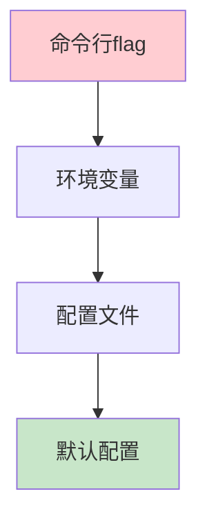

# Viper：Go语言配置管理的完全指南

> 在Go语言开发中，配置文件格式多样（JSON、YAML、TOML等），而Viper是spf13团队开发的配置管理库，一站式解决所有配置问题。它被kubectl、docker等著名工具采用。本文带你深入了解Viper。

---

## 一、Viper简介

### 1.1 为什么选择Viper？

Viper是Go语言最流行的配置管理库，特点：

| 特性 | 说明 |
|------|------|
| 多格式支持 | JSON、YAML、TOML、ENV、flags |
| 环境变量 | 自动读取环境变量 |
| 远程配置 | 支持Etcd、Consul |
| 默认值 | 支持默认值设置 |

### 1.2 核心能力

```go
import "github.com/spf13/viper"

// 读取配置
viper.SetConfigName("config")  // 配置文件名（不含扩展名）
viper.AddConfigPath(".")     // 搜索路径
viper.ReadInConfig()        // 读取配置
```

---

## 二、快速开始

### 2.1 安装

```bash
go get github.com/spf13/viper
```

### 2.2 最简示例

```yaml
# config.yaml
server:
  host: localhost
  port: 8080

database:
  type: mysql
  name: testdb
```

```go
package main

import (
    "fmt"
    "github.com/spf13/viper"
)

func main() {
    viper.SetConfigName("config")
    viper.AddConfigPath(".")
    viper.SetConfigType("yaml")
    
    if err := viper.ReadInConfig(); err != nil {
        panic(err)
    }
    
    fmt.Printf("Server: %s:%d\n",
        viper.GetString("server.host"),
        viper.GetInt("server.port"))
}
```

---

## 三、配置读取

### 3.1 基础读取

```go
// 读取各类值
viper.GetString("key")           // 字符串
viper.GetInt("key")              // 整数
viper.GetBool("key")              // 布尔值
viper.GetFloat64("key")           // 浮点数
viper.GetStringSlice("key")         // 字符串数组
viper.GetStringMap("key")         // Map
viper.GetStringMapString("key")    // Map[string]string

// 带默认值
viper.GetString("key", "default")  // 默认值
```

### 3.2 嵌套读取

```yaml
# config.yaml
server:
  host: localhost
  port: 8080
  tls:
    enable: true
    cert: /path/to/cert
```

```go
// 方法一：点号访问
host := viper.GetString("server.host")
enable := viper.GetBool("server.tls.enable")

// 方法二：解构到struct
type TLSConfig struct {
    Enable bool   `mapstructure:"enable"`
    Cert   string `mapstructure:"cert"`
}

type Config struct {
    Server struct {
        Host string    `mapstructure:"host"`
        Port int       `mapstructure:"port"`
        TLS  TLSConfig `mapstructure:"tls"`
    } `mapstructure:"server"`
}

var config Config
viper.Unmarshal(&config)
```

---

## 四、优先级与来源

### 4.1 配置优先级

从高到低：



1. **命令行flag**（最高优先级）
2. **环境变量**
3. **配置文件**
4. **默认值**（最低优先级）

### 4.2 环境变量

```go
// 自动读取带前缀的环境变量
// MYAPP_SERVER_PORT=8080 -> server.port

viper.SetEnvPrefix("MYAPP")  // 设置前缀
viper.AutomaticEnv()          // 自动读取环境变量
```

### 4.3 命令行覆盖

```go
import (
    "github.com/spf13/cobra"
)

var rootCmd = &cobra.Command{
    PersistentPreRun: func(cmd *cobra.Command, args []string) {
        viper.BindPFlags(cmd.Flags())
    },
}
```

---

## 五、监听与热重载

### 5.1 配置文件监听

```go
viper.WatchConfig()
viper.OnConfigChange(func(e fsnotify.Event) {
    fmt.Println("Config changed:", e.Name)
})
```

### 5.2 自动重载

```go
func loadConfig() error {
    viper.WatchConfig()
    
    viper.OnConfigChange(func(e fsnotify.Event) {
        // 重新加载配置
        loadDBConfig()
    })
    
    return nil
}
```

---

## 六、远程配置

### 6.1 Etcd配置

```go
import "github.com/spf13/viper/remote"

viper.AddRemoteProvider("etcd", "http://localhost:4001", "/config/app.yaml")
viper.SetConfigType("yaml")
viper.ReadRemoteConfig()
```

### 6.2 Consul配置

```go
viper.AddRemoteProvider("consul", "http://localhost:8500", "myapp/config")
viper.SetConfigType("yaml")
viper.ReadRemoteConfig()
```

---

## 七、最佳实践

### 7.1 单例模式

```go
package config

import "github.com/spf13/viper"

var V *viper.Viper

func Init(configPath string) error {
    V = viper.New()
    
    V.SetConfigName("config")
    V.AddConfigPath(configPath)
    V.AddConfigPath(".")
    
    V.SetConfigType("yaml")
    if err := V.ReadInConfig(); err != nil {
        return err
    }
    
    V.WatchConfig()
    return nil
}

// 获取值
func GetString(key string) string {
    return V.GetString(key)
}

func GetInt(key string) int {
    return V.GetInt(key)
}
```

### 7.2 封装配置struct

```go
type AppConfig struct {
    Server ServerConfig `mapstructure:"server"`
    Database DatabaseConfig `mapstructure:"database"`
    Log LogConfig `mapstructure:"log"`
}

type ServerConfig struct {
    Host string `mapstructure:"host"`
    Port int `mapstructure:"port"`
}

func LoadConfig() (*AppConfig, error) {
    var config AppConfig
    err := viper.Unmarshal(&config)
    return &config, err
}
```

---

## 八、与标准库对比

| 特性 | Viper | flag标准库 |
|------|------|----------|
| 多格式 | ✓ | ✗ |
| 环境变量 | ✓ | ✗ |
| 远程配置 | ✓ | ✗ |
| 热重载 | ✓ | ✗ |
| 次要重量 | 轻量 | 极轻 |

---

Viper是Go语言配置管理的"一站式"解决方案：

1. **多格式支持**：JSON、YAML、TOML等
2. **自动集成**：环境变量、命令行
3. **远程配置**：Etcd、Consul
4. **热重载**：配置变更监听

掌握Viper，让配置管理更简单！

---

>