# XORM 深度解析：从 ORM 原理到 Go 数据库编程的根本矛盾

> 在 Go 的数据库编程世界里，XORM 是一个绕不开的名字。它曾是 Go 生态中最流行的 ORM 框架之一，以"简单而强大"自居，帮助无数开发者告别了手写 SQL 的日子。然而，随着项目规模增长，很多人开始感到一种隐痛：零值更新不生效、N+1 查询、反射性能瓶颈……这些问题的根源，并不在 XORM 的实现细节上，而在 ORM 这个概念本身与 Go 语言设计哲学之间的深层张力。本文将从 ORM 的基本原理讲起，一层层剥开 XORM 的技术内核，最终直指根本矛盾。

---

## 一、ORM 是什么？——一个古老的理想

### 1.1 从手写 SQL 说起

在 ORM 出现之前，数据库编程是这样的：

```go
rows, err := db.Query("SELECT id, name, age FROM users WHERE age > ?", 18)
if err != nil { return err }
defer rows.Close()

for rows.Next() {
    var id int64
    var name string
    var age int
    if err := rows.Scan(&id, &name, &age); err != nil {
        return err
    }
    // 手动拼装结构体...
}
```

这段代码的问题很明显：

1. **SQL 字符串与代码脱节**：列名是字符串，重构时容易遗漏。
2. **手动 Scan**：每个查询都要写一遍 `rows.Scan(&field1, &field2, ...)`，冗长易错。
3. **类型不安全**：`Scan` 的参数类型必须与 SQL 列类型精确匹配，否则运行时 panic。

ORM（Object-Relational Mapping，对象关系映射）的理想是：**让开发者用面向对象的方式操作数据库，完全忘记 SQL 的存在。**

```go
// ORM 的理想形态
var users []User
engine.Where("age > ?", 18).Find(&users)
```

一行代码，替代了上面十多行样板代码。这就是 ORM 的价值主张。

### 1.2 对象-关系阻抗失配：ORM 的根本困境

然而，ORM 从诞生那天起就面临一个根本性的问题——**对象-关系阻抗失配（Object-Relational Impedance Mismatch）**。面向对象和关系模型是两种完全不同的数据建模范式：

| 维度 | 面向对象模型 | 关系模型 |
|------|-----------|---------|
| 数据组织 | 对象图（嵌套、引用） | 二维表（行、列） |
| 关系表达 | 指针/引用 | 外键 + JOIN |
| 继承 | 类继承、多态 | 无直接对应（需多种映射策略） |
| 集合 | List、Set、Map | 无直接对应 |
| 标识 | 对象引用（内存地址） | 主键 |
| 多态查询 | 自然支持 | 需要类型鉴别列 |
| 遍历 | 引用链直接访问 | 需要 JOIN 或多次查询 |

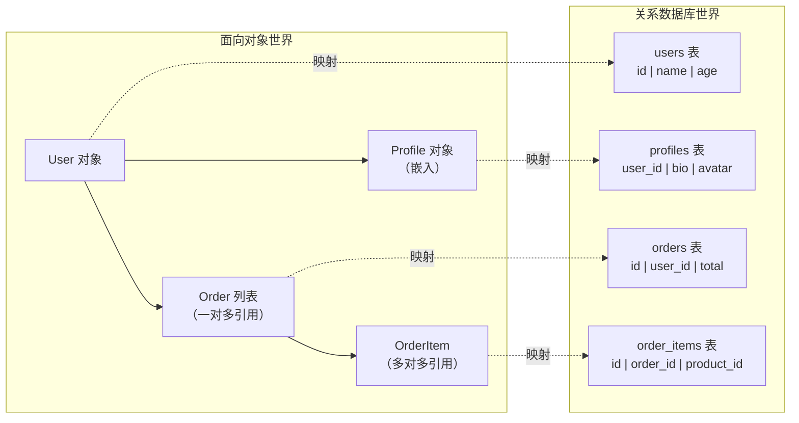

**这个阻抗失配是 ORM 所有问题的根源。** 它不是 XORM 的问题，不是 GORM 的问题，而是 ORM 这个概念本身的问题——两个不同范式的世界，不可能完美映射。

---

## 二、XORM 概览：简单而强大的 Go ORM

### 2.1 XORM 的定位与特点

XORM 自我定位为"Simple and Powerful ORM for Go"，其核心特点包括：

- **结构体 ↔ 表映射**：通过 struct tag 定义映射规则
- **链式查询**：Where、OrderBy、Limit 等链式 API
- **读写分离**：EngineGroup 支持 Master/Slave 架构
- **缓存支持**：内置 SQL 结果缓存
- **事件钩子**：BeforeInsert、AfterInsert 等生命周期回调
- **多数据库支持**：MySQL、PostgreSQL、SQLite、MSSQL、Oracle(实验)
- **自动建表**：Sync2 自动同步结构体与表结构

### 2.2 XORM 的仓库演变

XORM 的仓库经历了两次迁移，这本身就是一个值得关注的故事：

```
go-xorm/xorm  (原始仓库, 已归档)
    ↓ 迁移
xorm-io/xorm  (第二仓库, 活跃维护)
    ↓ 衍生
xormplus/xorm (社区增强版, 支持 SqlMap/模板)
```

**go-xorm/xorm 已归档**，官方将维护迁移到了 xorm-io/xorm。而 xormplus/xorm 是社区基于原版 xorm 的增强分支，额外支持了 SqlMap 配置文件和模板功能。

**这个仓库迁移本身就暗示了一个问题**：XORM 的维护活跃度在下降，社区在向 GORM 和新一代方案（sqlc、Ent）迁移。

### 2.3 与 GORM 的快速对比

| 维度 | XORM | GORM |
|------|------|------|
| GitHub Star | ~6.7k | ~37k |
| 设计风格 | 显式 Session，链式调用 | 隐式 Session，链式调用 |
| 映射方式 | struct tag + 反射 | struct tag + 反射 |
| 零值处理 | 默认跳过零值 | 默认跳过零值 |
| 读写分离 | 内置 EngineGroup | 需插件或手动配置 |
| 缓存 | 内置 | 需插件 |
| Hook | Before/After 系列 | Before/After + Callback |
| 预加载 | 不支持 Preload | 支持 Preload |
| 生态 | 较小 | 丰富（插件、文档、教程） |
| 维护状态 | 低活跃 | 高活跃 |

XORM 在读写分离和缓存上是内置支持，这是它的差异化优势。但在预加载、生态和社区活跃度上，GORM 明显领先。

---

## 三、XORM 核心架构：从 Engine 到 Session

### 3.1 架构总览

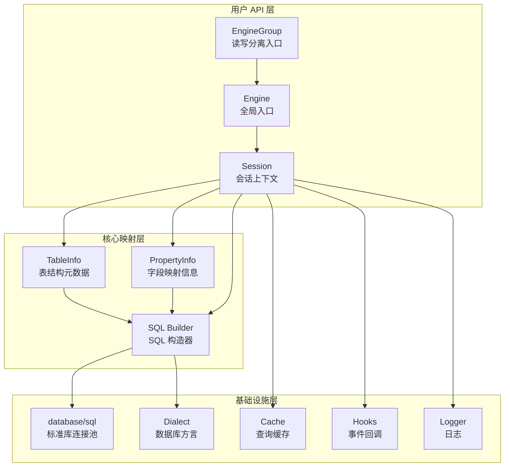

### 3.2 Engine：全局的单例引擎

Engine 是 XORM 的核心入口，通常在程序启动时创建并作为全局单例使用：

```go
engine, err := xorm.NewEngine("mysql", "user:password@/dbname?charset=utf8")
```

Engine 的主要职责：

1. **管理连接池**：内部持有 `*sql.DB`，管理数据库连接。
2. **缓存表结构元数据**：通过反射解析结构体，缓存 `TableInfo`。
3. **提供快捷方法**：`engine.Insert()`、`engine.Find()` 等是对 Session 的简短封装。
4. **全局配置**：Logger、Cache、Dialect 等全局设置。

```go
// Engine 的快捷方法本质上是 Session 的包装
func (e *Engine) Insert(beans ...interface{}) (int64, error) {
    session := e.NewSession()
    defer session.Close()
    return session.Insert(beans...)
}
```

**关键洞察**：Engine 的快捷方法每次都创建新 Session 并立即关闭。这意味着：

- 每次调用都是独立的数据库交互，无法组合多个操作。
- 无法在同一个 Session 中复用预处理语句。
- 无法在快捷方法中使用事务。

### 3.3 Session：操作的核心单元

Session 是 XORM 中真正干活的单元。一个 Session 绑定一个数据库连接，所有操作都在 Session 上下文中执行：

```go
session := engine.NewSession()
defer session.Close()

// 在同一个 Session 中执行多个操作
count, err := session.Where("age > ?", 18).Count(&User{})
var users []User
err = session.Where("age > ?", 18).Limit(10).Find(&users)
```

**Session 的内部状态**：

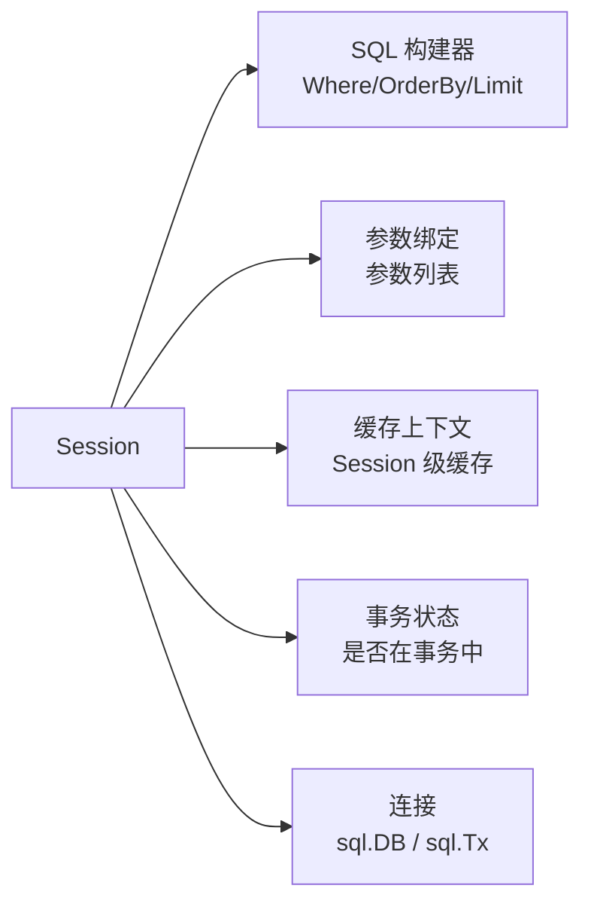

**一个关键的设计问题**：Session 不是线程安全的。XORM 文档明确说明——不要在多个 Goroutine 中共享同一个 Session。这意味着：

```go
// 错误：并发使用同一个 Session
var sharedSession = engine.NewSession()

go func() { sharedSession.Find(&users1) }()  // 危险！
go func() { sharedSession.Find(&users2) }()  // 危险！

// 正确：每个 Goroutine 使用独立 Session
go func() {
    s := engine.NewSession()
    defer s.Close()
    s.Find(&users1)
}()
```

**根本矛盾之一：Session 的生命周期管理与 Go 的并发模型不匹配。**

Go 鼓励使用 Goroutine 并发处理请求，每个请求一个 Goroutine 是常态。XORM 要求每个 Session 独占使用，这意味着每个 HTTP 请求都需要创建和销毁一个 Session——这不是性能问题（Session 创建开销很小），而是心智负担：开发者必须时刻注意"不要共享 Session"。

相比之下，GORM 的 `*gorm.DB` 是可以并发使用的——它在内部为每次操作创建独立的 Statement，避免了状态共享问题。这是 GORM 在 API 设计上更胜一筹的地方。

### 3.4 EngineGroup：内置读写分离

XORM 的差异化特性之一是内置的读写分离支持：

```go
engines := []*xorm.Engine{masterEngine, slave1Engine, slave2Engine}
eg, _ := xorm.NewEngineGroup(masterEngine, engines)

// 写操作自动路由到 Master
eg.Insert(&User{Name: "Alice"})

// 读操作自动路由到 Slave（轮询策略）
eg.Find(&users)
```

EngineGroup 支持多种从库负载均衡策略：

| 策略 | 实现 |
|------|------|
| 轮询（RoundRobin） | 依次选择 Slave |
| 随机（Random） | 随机选择 Slave |
| 权重（Weight） | 按权重分配 |

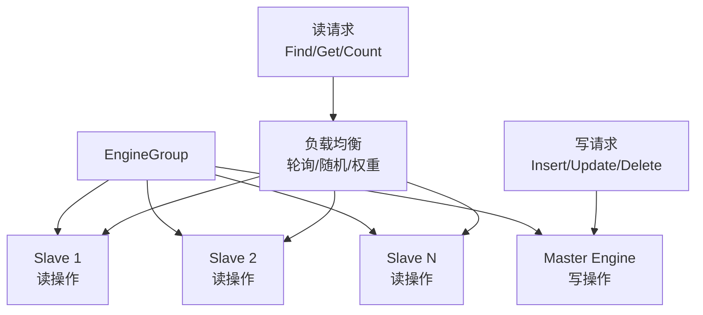

**优点**：开箱即用，无需额外中间件。

**局限**：这是应用层读写分离，不是代理层。如果需要跨服务的读写分离协调，仍需要数据库中间件（如 Vitess、ShardingSphere）。

---

## 四、结构体映射：反射的世界

### 4.1 映射规则

XORM 通过 struct tag 定义结构体字段与数据库列的映射关系：

```go
type User struct {
    Id        int64     `xorm:"pk autoincr"`           // 主键，自增
    Name      string    `xorm:"varchar(25) notnull"`   // 类型+约束
    Age       int       `xorm:"index"`                  // 索引
    Email     string    `xorm:"unique"`                 // 唯一索引
    CreatedAt time.Time `xorm:"created"`                // 自动填充创建时间
    UpdatedAt time.Time `xorm:"updated"`                // 自动填充更新时间
    Bio       string    `xorm:"text default ''"`        // 默认值
}
```

**XORM 支持的特殊 tag**：

| Tag | 作用 |
|-----|------|
| `pk` | 主键 |
| `autoincr` | 自增 |
| `created` | 插入时自动填充当前时间 |
| `updated` | 更新时自动填充当前时间 |
| `deleted` | 软删除标记 |
| `version` | 乐观锁版本号 |
| `index` | 普通索引 |
| `unique` | 唯一索引 |
| `extends` | 嵌入结构体展平 |
| `-` | 忽略字段 |
| `<-` | 只写（插入时填充，查询时忽略） |
| `->` | 只读（查询时填充，插入/更新时忽略） |

### 4.2 反射解析：TableInfo 的构建

XORM 在第一次使用某个结构体时，通过反射解析其类型信息，构建 `TableInfo` 对象并缓存：

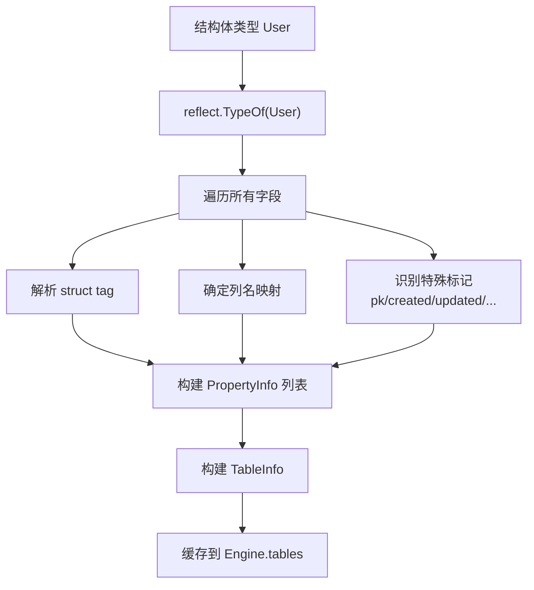

**核心源码逻辑（简化）**：

```go
func (engine *Engine) autoMapType(v reflect.Value) *core.Table {
    t := v.Type()
    // 检查缓存
    if table, ok := engine.tables.Load(t); ok {
        return table.(*core.Table)
    }

    // 反射解析
    table := &core.Table{
        Name:    engine.TableName(v),  // 表名
        Columns: make([]*core.Column, 0),
    }

    for i := 0; i < t.NumField(); i++ {
        field := t.Field(i)
        col := engine.parseField(table, field)  // 解析每个字段
        if col != nil {
            table.Columns = append(table.Columns, col)
        }
    }

    // 缓存
    engine.tables.Store(t, table)
    return table
}
```

**反射为什么慢？** 这是理解 XORM 性能特征的关键：

1. **类型信息查询**：`reflect.TypeOf()` 和 `reflect.ValueOf()` 涉及运行时类型信息的查找，每次调用都有固定开销。
2. **字段遍历**：`NumField()` + `Field(i)` 需要遍历所有字段，无法在编译期确定。
3. **Tag 解析**：`field.Tag.Get("xorm")` 每次都是字符串解析。
4. **值设置**：通过 `reflect.Value.Set()` 设置字段值，比直接赋值慢 5-10 倍。

**XORM 的优化**：TableInfo 只构建一次并缓存，后续查询直接使用缓存。这意味着反射开销集中在首次使用时，之后的操作不再重复反射。

### 4.3 反射缓存的局限性

虽然 XORM 缓存了 TableInfo，但每次查询结果映射到结构体时，仍然需要反射：

```go
// 每次查询都要执行的反射操作
func (session *Session) scan(row *sql.Rows, bean interface{}) error {
    v := reflect.ValueOf(bean).Elem()
    t := v.Type()

    for i := 0; i < table.ColumnsRefCount(); i++ {
        col := table.GetColumn(i)
        field := v.FieldByName(col.FieldName)  // 反射获取字段
        ptr := field.Addr().Interface()          // 获取字段指针
        row.Scan(ptr)                             // Scan 到字段
    }
}
```

**根本矛盾之二：反射型 ORM 的性能天花板。**

无论 TableInfo 缓存多么高效，**每次查询结果的映射都离不开反射**——因为 Go 没有泛型代码生成能力（在泛型出现之前），ORM 无法在编译期生成类型安全的 Scan 函数。这是所有基于反射的 ORM（包括 GORM）共同面临的性能天花板。

对比 sqlc 的方式——在编译期生成类型安全的代码：

```go
// sqlc 生成的代码：零反射
func (q *Queries) GetUsers(ctx context.Context) ([]User, error) {
    rows, err := q.db.QueryContext(ctx, "SELECT id, name, age FROM users")
    // ...
    for rows.Next() {
        var u User
        err = rows.Scan(&u.ID, &u.Name, &u.Age)  // 直接 Scan，零反射
        items = append(items, u)
    }
}
```

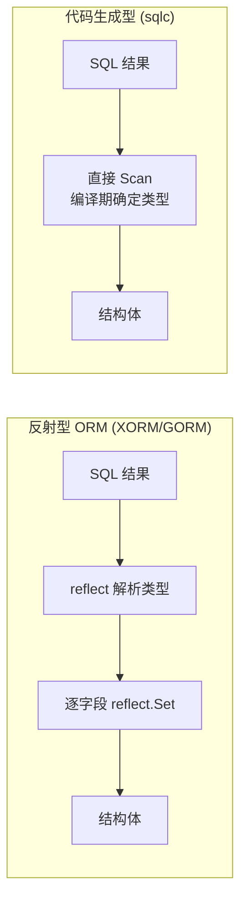

---

## 五、零值问题：Go 与数据库的类型鸿沟

### 5.1 问题的表现

这是 XORM（以及 GORM）最令人困惑的行为之一：

```go
user := User{Name: "Alice", Age: 0}
engine.ID(1).Update(&user)
// 期望：UPDATE users SET name='Alice', age=0 WHERE id=1
// 实际：UPDATE users SET name='Alice' WHERE id=1
//                                                      ↑ age=0 被忽略了！
```

**为什么？** 因为 Go 的零值（`int` 的 `0`、`string` 的 `""`、`bool` 的 `false`）与"未赋值"无法区分。当 XORM 通过反射检测到 `Age` 字段的值为 `0` 时，它无法判断这是"用户明确想设置为 0"还是"用户没有设置这个字段"。

XORM 选择了**默认跳过零值**的策略——因为"忘记设置某个字段"比"明确想设置为零值"更常见，跳过零值可以避免意外覆盖。

### 5.2 解决方案与权衡

XORM 提供了多种方式解决零值更新问题：

**方案一：Cols() 指定要更新的列**

```go
engine.ID(1).Cols("name", "age").Update(&user)
// 强制更新 name 和 age，即使 age=0
```

**方案二：AllCols() 更新所有列**

```go
engine.ID(1).AllCols().Update(&user)
// 更新所有字段，包括零值
```

**方案三：MustCols() 指定必须更新的零值列**

```go
engine.ID(1).MustCols("age").Update(&user)
// 即使 age=0 也更新
```

**方案四：使用指针类型**

```go
type User struct {
    Id   int64
    Name string
    Age  *int  // 指针类型：nil 表示未设置，非 nil 表示明确设置
}

age := 0
user := User{Name: "Alice", Age: &age}
engine.ID(1).Update(&user)  // Age 字段非 nil，会被更新
```

**方案五：使用 Nullable 类型**

```go
type User struct {
    Id   int64
    Name string
    Age  sql.NullInt64  // NullInt64：Valid=true 表示有值，Valid=false 表示 NULL
}
```

### 5.3 根本矛盾之三：Go 的零值语义与 SQL 的 NULL 语义不兼容

这是 Go 语言设计与关系数据库之间最深层的不兼容：

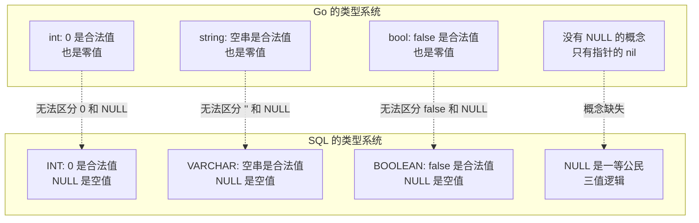

**SQL 有三值逻辑**（TRUE / FALSE / NULL），**Go 只有二值逻辑**（零值 / 非零值）。这个鸿沟不是 XORM 能填平的——它是语言层面的根本差异。

指针类型和 `sql.Null*` 类型是 Go 官方给出的解法，但它们都不完美：

- **指针类型**：`*int` 可以区分"未设置"（nil）和"设置为 0"（&0），但增加了 GC 压力，JSON 序列化需要额外处理。
- **sql.NullInt64 等**：可以映射 NULL，但失去了直接比较能力（`user.Age == 0` 编译不过），JSON 序列化也需要自定义。

---

## 六、查询构建：链式 API 的优雅与陷阱

### 6.1 链式查询的基本用法

```go
// 简单条件查询
var users []User
engine.Where("age > ?", 18).And("name like ?", "A%").Limit(10, 0).Find(&users)

// 排序
engine.OrderBy("created_at desc").Find(&users)

// 指定列
engine.Cols("name", "age").Find(&users)

// 聚合查询
count, _ := engine.Where("age > ?", 18).Count(&User{})
```

### 6.2 Session 状态累积：隐式 bug 的温床

XORM 的链式 API 有一个容易踩坑的特性：**Session 会累积查询条件**。

```go
session := engine.NewSession()
defer session.Close()

// 第一次查询
session.Where("age > ?", 18).Find(&adults)
// 此时 session 内部保存了 Where("age > ?", 18)

// 第二次查询——看似没问题，实际叠加了之前的条件！
session.Where("name like ?", "A%").Find(&usersWithName)
// 实际执行的 SQL: WHERE age > 18 AND name like 'A%'
//                                  ↑ 残留的上次条件！
```

**根本矛盾之四：链式 API 的可变状态与查询独立性冲突。**

链式 API 本质上是对 Session 状态的逐步修改。每次调用 `Where()`、`OrderBy()` 都在向 Session 追加条件。如果不主动重置，条件会跨查询累积。

**XORM 提供了重置方法**：

```go
// 正确做法：每次查询前重置
session.Where("age > ?", 18).Find(&adults)
session.Reset()  // 清除所有累积条件
session.Where("name like ?", "A%").Find(&usersWithName)
```

**对比 GORM 的处理**：GORM 的链式 API 在执行查询后自动重置条件（通过 `db.Session()` 创建独立会话），避免了状态累积问题。这是 GORM 在 API 安全性上的一个明显改进。

### 6.3 原生 SQL：退路还是必要？

当链式 API 无法表达复杂查询时，XORM 支持原生 SQL：

```go
// 原生 SQL 查询
var results []map[string]string
engine.SQL("SELECT u.name, count(o.id) FROM users u LEFT JOIN orders o ON u.id = o.user_id GROUP BY u.id HAVING count(o.id) > ?", 5).Find(&results)

// 原生 SQL + 结构体映射
var users []User
engine.SQL("SELECT * FROM users WHERE age > ?", 18).Find(&users)
```

但原生 SQL 回归了字符串拼 SQL 的老路，失去了类型安全。XORM 还支持 SQL Mapper 模式（xormplus/xorm 增强）：

```go
// 通过 SqlMap 注册 SQL 模板
engine.SqlMap["get_users_by_age"] = "SELECT * FROM users WHERE age > ?"

// 使用注册的 SQL
var users []User
engine.Sql("get_users_by_age", 18).Find(&users)
```

这种模式将 SQL 从代码中分离出来，便于维护和 DBA 审核。但本质上仍然没有解决类型安全问题。

---

## 七、事务处理：正确性最后的堡垒

### 7.1 手动事务

XORM 的手动事务需要显式管理 Session 的生命周期：

```go
session := engine.NewSession()
defer session.Close()

if err := session.Begin(); err != nil {
    return err
}

// 事务内的操作
if _, err := session.Insert(&order); err != nil {
    session.Rollback()
    return err
}

if _, err := session.Update(&product, &Product{ID: product.ID}); err != nil {
    session.Rollback()
    return err
}

return session.Commit()
```

**注意**：事务中的操作必须使用 `session` 而非 `engine`——否则操作不会参与事务。这是一个常见的 bug 来源：

```go
// 错误：engine.Insert 不在事务中！
session.Begin()
session.Insert(&order)
engine.Insert(&logEntry)  // 这不在事务中！
session.Commit()
```

### 7.2 闭包事务

XORM 提供了一个更安全的闭包事务 API：

```go
err := session.Transaction(func(sess *xorm.Session) (interface{}, error) {
    if _, err := sess.Insert(&order); err != nil {
        return nil, err  // 自动 Rollback
    }
    if _, err := sess.Update(&product); err != nil {
        return nil, err  // 自动 Rollback
    }
    return nil, nil  // 自动 Commit
})
```

这比手动管理更安全——不需要在每个错误路径上显式调用 Rollback。

### 7.3 根本矛盾之五：事务与 ORM 的语义冲突

ORM 鼓励"面向对象"的操作方式，但事务是"面向数据"的：

```go
// ORM 风格：对象操作
user.Name = "Bob"
engine.ID(user.Id).Update(user)

// 事务需要的是：数据操作
UPDATE users SET name='Bob', age=25, email='...' WHERE id=1
//                                     ↑ 事务关心的是哪些行被修改了
```

ORM 隐藏了 SQL 细节，但事务的正确性往往依赖于对 SQL 的精确控制（如锁粒度、隔离级别、死锁处理）。当 ORM 生成的 SQL 不符合预期时，事务的正确性就无法保证。

---

## 八、N+1 查询：ORM 的性能杀手

### 8.1 问题的经典场景

```go
// 查询所有用户
var users []User
engine.Find(&users)

// 对每个用户查询其订单
for i, user := range users {
    var orders []Order
    engine.Where("user_id = ?", user.Id).Find(&orders)
    users[i].Orders = orders
}
```

如果 `users` 有 100 条记录，这段代码会执行 1 + 100 = 101 次 SQL 查询——这就是 N+1 问题。

### 8.2 XORM 的 N+1 困境

**XORM 不支持 Preload/预加载**。这是它与 GORM 相比最大的功能缺失。

GORM 的 Preload 可以用一条 JOIN 或 IN 查询解决 N+1：

```go
// GORM: 一条 SQL 解决
db.Preload("Orders").Find(&users)
// SQL: SELECT * FROM users;
//      SELECT * FROM orders WHERE user_id IN (1,2,3,...);
```

**XORM 的变通方案**：

```go
// 方案一：手动 IN 查询
var users []User
engine.Find(&users)

userIds := make([]int64, len(users))
for i, u := range users {
    userIds[i] = u.Id
}

var orders []Order
engine.In("user_id", userIds).Find(&orders)

// 手动关联
orderMap := make(map[int64][]Order)
for _, o := range orders {
    orderMap[o.UserId] = append(orderMap[o.UserId], o)
}
for i, u := range users {
    users[i].Orders = orderMap[u.Id]
}
```

这比 Preload 多了大量的手动映射代码——本质上是在 ORM 之外手写关联逻辑。

### 8.3 根本矛盾之六：ORM 的"对象图加载"与"SQL 集合操作"不匹配

ORM 的对象图是嵌套结构，加载它需要多次查询或 JOIN。但 ORM 的目标是"让开发者忘记 SQL"——那么谁来决定加载策略（Eager Loading vs Lazy Loading）？

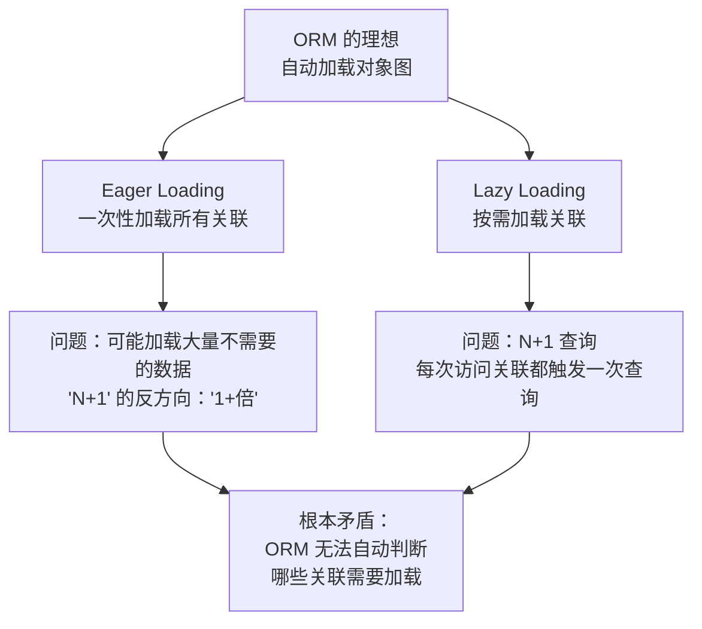

**GORM 用 Preload 让开发者显式指定加载策略**——这是务实的妥协。**XORM 连这个妥协都没有提供**，导致开发者只能手写 IN 查询和映射逻辑。

---

## 九、缓存：双刃剑

### 9.1 XORM 的缓存机制

XORM 内置了两种缓存：

**1. 全局缓存（Engine 级）**

缓存 SQL 查询结果，相同 SQL 再次执行时直接返回缓存：

```go
// 启用全局缓存
engine.SetDefaultCacher(caches.NewLRUCacher(caches.NewMemoryStore(), 1000))

// 查询时自动缓存
engine.Get(&User{Id: 1})  // 第一次查数据库
engine.Get(&User{Id: 1})  // 第二次命中缓存
```

**2. Session 级缓存**

同一个 Session 内，相同 SQL 的结果被缓存：

```go
session := engine.NewSession()
defer session.Close()

session.Get(&User{Id: 1})  // 查数据库
session.Get(&User{Id: 1})  // 命中 Session 缓存
```

### 9.2 缓存一致性：隐形的陷阱

缓存引入了一个严重的问题：**数据一致性**。

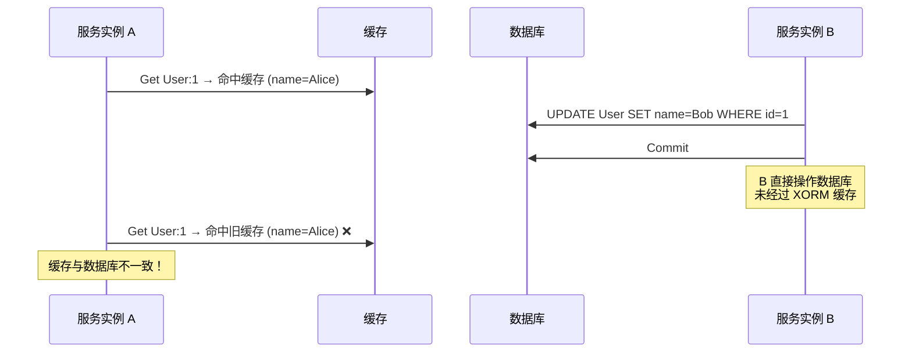

**根本矛盾之七：ORM 缓存无法感知外部数据变更。**

如果其他服务（甚至同一服务的其他代码路径）直接操作数据库，XORM 的缓存不会自动失效。这在微服务架构中尤为严重——你的 Go 服务缓存了数据，但 Python 服务、Java 服务、甚至 DBA 手动修改了数据，缓存就成了脏数据。

**XORM 的缓存失效策略**：

- 当通过 XORM 执行写操作（Insert/Update/Delete）时，自动清除相关缓存。
- 但这只在"所有数据库操作都通过同一个 Engine"的前提下有效。

**生产建议**：在微服务架构中，不要使用 XORM 的全局缓存。如果必须用，确保：
1. 所有对同一张表的操作都通过同一个 XORM Engine。
2. 或者使用集中式缓存（如 Redis）并自行管理失效。

---

## 十、事件钩子：有限的生命周期

### 10.1 XORM 的 Hook 机制

XORM 提供了以下事件钩子：

```go
engine.BeforeInsert = func(bean interface{}) {
    // 插入前回调
    if u, ok := bean.(*User); ok {
        u.CreatedAt = time.Now()
    }
}

engine.AfterInsert = func(bean interface{}) {
    // 插入后回调
}

engine.BeforeUpdate = func(bean interface{}) {
    // 更新前回调
}

engine.AfterDelete = func(bean interface{}) {
    // 删除后回调
}
```

### 10.2 与 GORM Callback 的对比

| 维度 | XORM Hook | GORM Callback |
|------|-----------|--------------|
| 注册方式 | 全局函数 | 链式注册 |
| 粒度 | 固定 6 个位置 | 可自定义任意位置 |
| 条件过滤 | 需手动类型断言 | 支持按模型/操作过滤 |
| 多个 Hook | 不支持（只能设一个） | 支持注册多个 |
| 错误处理 | 返回 error 终止 | 返回 error 终止 |

**XORM 的 Hook 机制非常原始**——每个事件只能注册一个函数，不支持优先级排序，不支持条件过滤。GORM 的 Callback 系统更像一个中间件管道，灵活得多。

---

## 十一、Sync2：自动建表的双面性

### 11.1 Sync2 的功能

XORM 的 `Sync2()` 方法可以根据结构体定义自动创建或修改表结构：

```go
err := engine.Sync2(new(User), new(Order), new(Product))
```

Sync2 会：
1. 如果表不存在，创建表。
2. 如果表存在但缺少列，添加列。
3. 如果表存在但缺少索引，添加索引。
4. **不会删除**已有列和索引（安全策略）。

### 11.2 为什么不应该在生产环境用 Sync2？

Sync2 看起来方便，但在生产环境是危险的：

1. **没有迁移回滚**：Sync2 只做增量变更，不支持回滚。如果新的结构体定义有误，已执行的变更无法撤销。
2. **没有迁移版本管理**：Sync2 不知道数据库当前处于哪个"版本"，每次都基于当前结构体定义和数据库现状做 diff。
3. **DDL 锁表**：ALTER TABLE 在大表上可能锁表，导致服务不可用。
4. **环境差异**：开发环境用 Sync2，生产环境用迁移工具，两套逻辑可能不一致。

**正确的做法**：使用数据库迁移工具（如 golang-migrate、goose、atlas），将 schema 变更纳入版本管理和 CI/CD 流程。

---

## 十二、XORM vs GORM vs sqlc vs Ent：范式之争

### 12.1 四种范式的对比

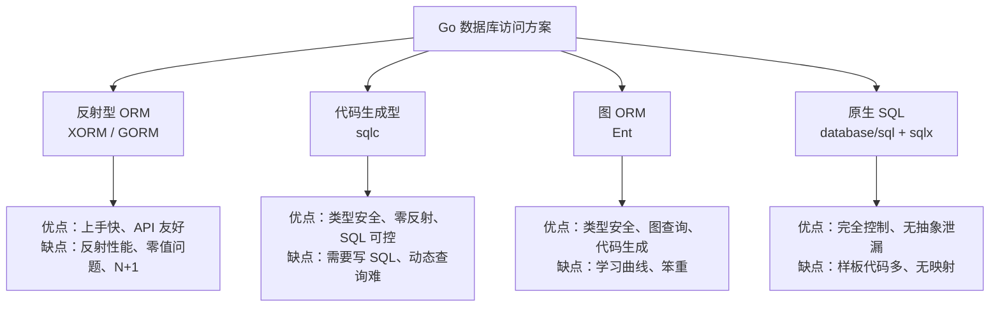

### 12.2 详细对比

| 维度 | XORM | GORM | sqlc | Ent |
|------|------|------|------|-----|
| 映射方式 | 反射 | 反射 | 代码生成 | 代码生成 |
| 类型安全 | 弱 | 弱 | 强 | 强 |
| 性能 | 中 | 中 | 高 | 高 |
| 复杂查询 | 链式+原生SQL | 链式+原生SQL | 原生SQL | 图查询 |
| 零值问题 | 有 | 有 | 无 | 无 |
| N+1 处理 | 无 Preload | 有 Preload | 手动 JOIN | Eager Loading |
| 学习曲线 | 低 | 低 | 低 | 中 |
| 生态/社区 | 小 | 大 | 中 | 中 |
| 维护活跃度 | 低 | 高 | 高 | 高 |
| 迁移工具 | Sync2 | AutoMigrate | 外部工具 | 内置 |

所有基于反射的 ORM 都面临同样的问题：

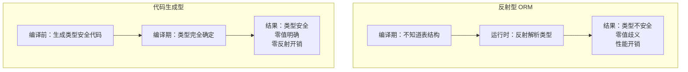

**Go 泛型能解决反射问题吗？**

Go 1.18 引入泛型后，部分反射操作可以被泛型替代。但泛型无法解决 ORM 的核心问题——**SQL 的构造和结果映射仍然需要运行时信息**。泛型可以让你写 `Find[User]()` 而非 `Find(&User{})`，但内部仍然需要反射来映射 `User` 的字段。

真正解决问题的是**代码生成**——在编译前就确定所有类型映射关系，生成类型安全的代码。这正是 sqlc 和 Ent 的方向。

---

## 十三、XORM 的现状与未来

### 13.1 维护困境

XORM 面临的现实问题：

1. **社区萎缩**：GitHub Star 增长停滞，Issue 响应变慢。
2. **GORM 的虹吸效应**：新项目更倾向于选择生态更活跃的 GORM。
3. **新范式冲击**：sqlc 和 Ent 代表的代码生成范式正在吸引开发者。
4. **仓库归档**：go-xorm/xorm 已归档，xorm-io/xorm 维护频率低。

### 13.2 什么时候还应该用 XORM？

| 场景 | 推荐 |
|------|------|
| 已有项目深度使用 XORM | 继续使用，渐进迁移 |
| 需要内置读写分离 | XORM（EngineGroup 开箱即用） |
| 需要内置查询缓存 | XORM（但注意一致性风险） |
| 新项目、追求开发效率 | GORM（生态更活跃） |
| 新项目、追求类型安全 | sqlc（零反射、SQL 可控） |
| 新项目、复杂关联查询 | Ent（图查询、类型安全） |

### 13.3 从 XORM 迁移的路径

如果决定从 XORM 迁移，推荐渐进式策略：

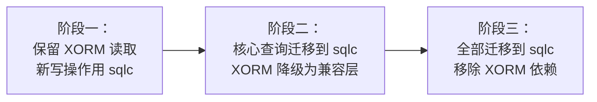

关键原则：**先迁写、后迁读**。因为写操作更容易验证正确性，读操作可能涉及复杂的查询逻辑，迁移风险更高。

---

回顾全文，XORM 的所有痛点，可以归结为 Go 反射型 ORM 的七重根本矛盾：

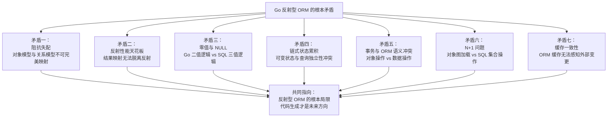