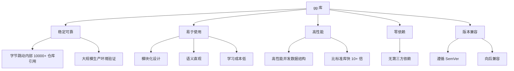
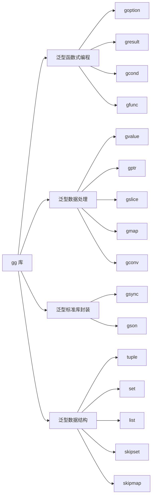
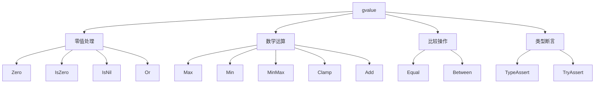
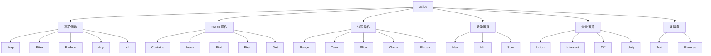
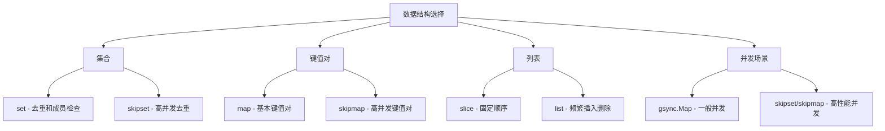
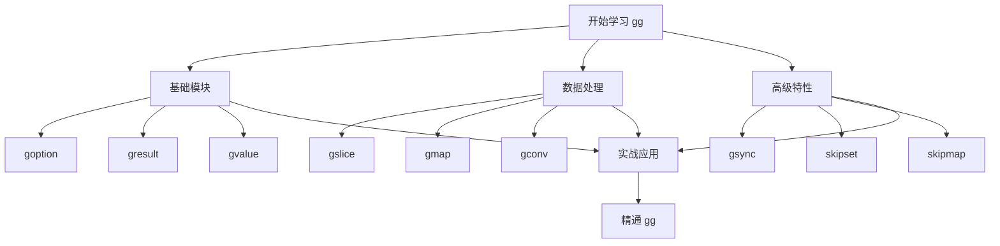

# bytedance/gg 库深度解析：从入门到精通的完整指南

> 字节跳动开源的 Go 泛型基础库，让你的代码更简洁、更安全、更高效

## 前言

Go 1.18 版本引入了泛型特性，为 Go 语言带来了新的编程范式。然而，标准库中的泛型支持相对有限，开发者们一直在寻找更强大的泛型工具库。

字节跳动研发团队在实际开发中遇到了同样的痛点，于是开源了 `gg` 库——一个基于 Go 1.18+ 泛型特性的基础库。这个库在字节跳动内部已有 10000+ 个仓库引用，

## gg 库概览

### 什么是 gg？

gg 是字节跳动开发的 Go 语言泛型基础库，基于 Go 1.18+ 的泛型特性，提供了高效、类型安全的通用数据结构和工具函数。

**为什么叫 gg？**

取 **G**o **G**enerics 的首字母，简单易记。

### 核心特性



### 整体架构



## 为什么选择 gg

### 1. 稳定可靠

- 字节跳动研发团队的必备工具库
- 内部 10000+ 个仓库引用
- 经过大规模生产环境验证
- 持续维护和更新

### 2. 易于使用

- 简洁自洽的设计原则
- 按功能分包，模块化清晰
- 语义直观，统一规范
- 学习成本低

### 3. 高性能

- 提供高性能并发数据结构
- 比 Go 标准库快 10+ 倍
- 优化的内存使用
- 高效的算法实现

### 4. 无第三方依赖

- 泛型库本身不引入任何第三方依赖
- 减少依赖冲突
- 简化项目依赖管理

### 5. 严格的版本控制

- 遵循 SemVer 语义化版本
- 保证向后兼容
- 清晰的版本发布策略

## 安装与快速开始

### 安装

```bash
go get github.com/bytedance/gg
```

### 快速示例

让我们从一个简单的例子开始，感受 gg 库的魅力：

```go
package main

import (
    "fmt"
    "strconv"

    "github.com/bytedance/gg/goption"
    "github.com/bytedance/gg/gslice"
    "github.com/bytedance/gg/gvalue"
)

func main() {
    // 示例 1：优雅处理可选值
    opt := goption.Of(1, true)
    fmt.Println(opt.Value()) // 输出: 1

    // 示例 2：切片操作
    nums := []int{1, 2, 3, 4, 5}
    doubled := gslice.Map(nums, func(n int) string {
        return strconv.Itoa(n * 2)
    })
    fmt.Println(doubled) // 输出: [2 4 6 8 10]

    // 示例 3：数学运算
    max := gvalue.Max(1, 2, 3, 4, 5)
    fmt.Println(max) // 输出: 5
}
```

## 核心模块详解

### goption：优雅处理可选值

在 Go 中，我们经常需要处理可能不存在的值，传统的做法是返回 `(T, bool)` 或 `*T`。gg 的 `goption` 模块提供了更优雅的解决方案。

#### 基本概念

`Option[T]` 类型表示一个可能存在也可能不存在的值，提供了链式调用的 API。

#### 核心方法

```mermaid
graph TD
    A[Option[T]] --> B[创建方法]
    A --> C[判断方法]
    A --> D[获取方法]
    A --> E[转换方法]

    B --> B1[Of]
    B --> B2[Nil]
    B --> B3[OK]
    B --> B4[OfPtr]

    C --> C1[IsNil]
    C --> C2[IsOK]

    D --> D1[Value]
    D --> D2[ValueOr]
    D --> D3[ValueOrZero]

    E --> E1[Map]
    E --> E2[FlatMap]
```

#### 代码示例

```go
package main

import (
    "fmt"
    "strconv"

    "github.com/bytedance/gg/goption"
)

func main() {
    // 创建 Option
    opt1 := goption.Of(1, true)
    opt2 := goption.Nil[int]()
    opt3 := goption.OK(42)

    // 判断状态
    fmt.Println(opt1.IsNil()) // false
    fmt.Println(opt1.IsOK())  // true
    fmt.Println(opt2.IsNil()) // true

    // 获取值
    fmt.Println(opt1.Value())            // 1
    fmt.Println(opt2.ValueOr(10))        // 10
    fmt.Println(opt3.ValueOrZero())      // 42

    // 指针处理
    var ptr *int
    opt4 := goption.OfPtr(ptr)
    fmt.Println(opt4.Ptr()) // nil

    // 链式转换
    result := goption.Map(
        goption.OK(1),
        strconv.Itoa,
    )
    fmt.Println(result.Get()) // "1" true
}
```

#### 实际应用场景

```go
// 场景 1：配置文件读取
func getConfig(key string) goption.Option[string] {
    value, exists := configMap[key]
    return goption.Of(value, exists)
}

timeout := getConfig("timeout").ValueOr(30) // 默认 30 秒

// 场景 2：数据库查询
func findUser(id int) goption.Option[*User] {
    user, err := db.FindUser(id)
    if err != nil {
        return goption.Nil[*User]()
    }
    return goption.OK(user)
}

userName := findUser(123).ValueOr(&defaultUser).Name
```

### gresult：统一错误处理

`gresult` 模块提供了一种更优雅的方式来处理 `(T, error)` 这种常见的返回值模式。

#### 基本概念

`Result[T]` 类型封装了一个可能包含错误的结果，提供了类似于 Rust 的 Result 类型的 API。

#### 核心方法

```mermaid
graph TD
    A[Result[T]] --> B[创建方法]
    A --> C[判断方法]
    A --> D[获取方法]
    A --> E[转换方法]

    B --> B1[Of]
    B --> B2[OK]
    B --> B3[Err]

    C --> C1[IsOK]
    C --> C2[IsErr]

    D --> D1[Value]
    D --> D2[ValueOr]
    D --> D3[ValueOrZero]

    E --> E1[Map]
    E --> E2[Option]
```

#### 代码示例

```go
package main

import (
    "errors"
    "fmt"
    "strconv"
    "io"

    "github.com/bytedance/gg/gresult"
)

func main() {
    // 创建 Result
    result1 := gresult.Of(strconv.Atoi("1"))
    result2 := gresult.Err[int](io.EOF)
    result3 := gresult.OK(42)

    // 判断状态
    fmt.Println(result1.IsOK())  // true
    fmt.Println(result2.IsErr()) // true

    // 获取值
    fmt.Println(result1.Value())          // 1
    fmt.Println(result2.ValueOr(10))      // 10
    fmt.Println(result3.ValueOrZero())    // 42

    // 错误处理
    parseResult := gresult.Of(strconv.Atoi("x"))
    opt := parseResult.Option()
    fmt.Println(opt.Get()) // 0 false

    // 链式转换
    mapped := gresult.Map(
        gresult.OK(1),
        strconv.Itoa,
    )
    fmt.Println(mapped.Get()) // "1" nil
}
```

#### 实际应用场景

```go
// 场景 1：链式 API 调用
func fetchUser(id int) gresult.Result[*User] {
    return gresult.Of(db.FindUser(id))
}

func getUserEmail(id int) gresult.Result[string] {
    return gresult.Map(
        fetchUser(id),
        func(user *User) string { return user.Email },
    )
}

// 场景 2：错误传播
func processFile(path string) gresult.Result[string] {
    content, err := os.ReadFile(path)
    if err != nil {
        return gresult.Err[string](err)
    }
    return gresult.OK(string(content))
}
```

### gcond：条件表达式

`gcond` 模块提供了更灵活的条件表达式，支持惰性求值和链式调用。

#### 代码示例

```go
package main

import (
    "fmt"
    "strconv"

    "github.com/bytedance/gg/gcond"
)

func main() {
    // 基本条件表达式
    result1 := gcond.If(true, 1, 2)
    fmt.Println(result1) // 1

    // 惰性求值
    var a *struct{ A int }
    getA := func() int { return a.A }
    get1 := func() int { return 1 }

    result2 := gcond.IfLazy(a != nil, getA, get1)
    fmt.Println(result2) // 1

    // 部分惰性求值
    result3 := gcond.IfLazyL(a != nil, getA, 1)
    fmt.Println(result3) // 1

    result4 := gcond.IfLazyR(a == nil, 1, getA)
    fmt.Println(result4) // 1

    // Switch 表达式
    result5 := gcond.Switch[string](3).
        Case(1, "1").
        CaseLazy(2, func() string { return "2" }).
        When(3, 4).Then("3/4").
        When(5, 6).ThenLazy(func() string { return "5/6" }).
        Default("other")
    fmt.Println(result5) // "3/4"
}
```

#### 实际应用场景

```go
// 场景 1：配置选择
mode := gcond.If(config.Debug, "debug", "release")

// 场景 2：复杂条件分支
status := gcond.Switch[string](code).
    Case(200, "OK").
    Case(404, "Not Found").
    Case(500, "Internal Server Error").
    Default("Unknown")

// 场景 3：避免不必要的计算
result := gcond.IfLazy(
    shouldExpensive,
    expensiveComputation,
    cheapDefault,
)
```

### gvalue：通用值操作

`gvalue` 模块提供了一系列通用的值操作函数，包括零值处理、数学运算、比较和类型断言。

#### 核心功能



#### 代码示例

```go
package main

import (
    "fmt"

    "github.com/bytedance/gg/gvalue"
)

func main() {
    // 零值处理
    a := gvalue.Zero[int]()
    fmt.Println(a)               // 0
    fmt.Println(gvalue.IsZero(a)) // true

    b := gvalue.Zero[*int]()
    fmt.Println(gvalue.IsNil(b)) // true

    // Or 操作：返回第一个非零值
    result1 := gvalue.Or(0, 1, 2)
    fmt.Println(result1) // 1

    // 数学运算
    max := gvalue.Max(1, 2, 3, 4, 5)
    fmt.Println(max) // 5

    min := gvalue.Min(1, 2, 3, 4, 5)
    fmt.Println(min) // 1

    minMax := gvalue.MinMax(1, 2, 3, 4, 5)
    fmt.Println(minMax.Values()) // 1 5

    clamped := gvalue.Clamp(5, 1, 10)
    fmt.Println(clamped) // 5

    sum := gvalue.Add(1, 2)
    fmt.Println(sum) // 3

    // 比较操作
    fmt.Println(gvalue.Equal(1, 1))   // true
    fmt.Println(gvalue.Between(2, 1, 3)) // true

    // 类型断言
    value1 := gvalue.TypeAssert[int](any(1))
    fmt.Println(value1) // 1

    value2, ok := gvalue.TryAssert[int](any(1))
    fmt.Println(value2, ok) // 1 true
}
```

### gptr：指针操作简化

`gptr` 模块简化了指针的创建和操作，提供了更安全的指针处理方式。

#### 代码示例

```go
package main

import (
    "fmt"
    "strconv"

    "github.com/bytedance/gg/gptr"
)

func main() {
    // 创建指针
    a := gptr.Of(1)
    fmt.Println(gptr.Indirect(a)) // 1

    // 创建非零值指针
    b := gptr.OfNotZero(1)
    fmt.Println(gptr.IsNotNil(b)) // true
    fmt.Println(gptr.IndirectOr(b, 2)) // 1

    // 指针转换
    result := gptr.Map(b, strconv.Itoa)
    fmt.Println(gptr.Indirect(result)) // "1"

    // 零值处理
    c := gptr.OfNotZero(0)
    fmt.Println(c) // nil
    fmt.Println(gptr.IsNil(c)) // true
    fmt.Println(gptr.IndirectOr(c, 2)) // 2
}
```

### gslice：切片操作

`gslice` 模块提供了丰富的切片操作函数，支持高阶函数、CRUD 操作、分区操作、数学运算等。

#### 功能分类



#### 代码示例

```go
package main

import (
    "fmt"
    "strconv"

    "github.com/bytedance/gg/gslice"
    "github.com/bytedance/gg/gvalue"
)

func main() {
    nums := []int{1, 2, 3, 4, 5}

    // 高阶函数
    doubled := gslice.Map(nums, func(n int) string {
        return strconv.Itoa(n * 2)
    })
    fmt.Println(doubled) // [1 2 3 4 5]

    isEven := func(i int) bool { return i%2 == 0 }
    evens := gslice.Filter(nums, isEven)
    fmt.Println(evens) // [2 4]

    sum := gslice.Reduce(nums, gvalue.Add[int].Value())
    fmt.Println(sum) // 15

    hasEven := gslice.Any(nums, isEven)
    allEven := gslice.All(nums, isEven)
    fmt.Println(hasEven, allEven) // true false

    // CRUD 操作
    fmt.Println(gslice.Contains(nums, 2)) // true
    fmt.Println(gslice.Index(nums, 3)) // 2

    found := gslice.Find(nums, isEven).Value()
    fmt.Println(found) // 2

    first := gslice.First(nums).Value()
    fmt.Println(first) // 1

    third := gslice.Get(nums, 2).Value()
    fmt.Println(third) // 3

    last := gslice.Get(nums, -1).Value()
    fmt.Println(last) // 5

    // 分区操作
    range1 := gslice.Range(1, 5)
    fmt.Println(range1) // [1 2 3 4]

    range2 := gslice.RangeWithStep(5, 1, -2)
    fmt.Println(range2) // [5 3]

    take2 := gslice.Take(nums, 2)
    fmt.Println(take2) // [1 2]

    takeLast2 := gslice.Take(nums, -2)
    fmt.Println(takeLast2) // [4 5]

    slice23 := gslice.Slice(nums, 1, 3)
    fmt.Println(slice23) // [2 3]

    chunks := gslice.Chunk(nums, 2)
    fmt.Println(chunks) // [[1 2] [3 4] [5]]

    divided := gslice.Divide(nums, 2)
    fmt.Println(divided) // [[1 2 3] [4 5]]

    // 数学运算
    fmt.Println(gslice.Max(nums).Value()) // 5
    fmt.Println(gslice.Min(nums).Value()) // 1
    fmt.Println(gslice.Sum(nums)) // 15

    // 集合运算
    union := gslice.Union([]int{1, 2, 3}, []int{3, 4, 5})
    fmt.Println(union) // [1 2 3 4 5]

    intersect := gslice.Intersect([]int{1, 2, 3}, []int{3, 4, 5})
    fmt.Println(intersect) // [3]

    diff := gslice.Diff([]int{1, 2, 3}, []int{3, 4, 5})
    fmt.Println(diff) // [1 2]

    uniq := gslice.Uniq([]int{1, 1, 2, 2, 3})
    fmt.Println(uniq) // [1 2 3]

    // 转换为 Map
    strMap := gslice.ToMap(nums, func(i int) (string, int) {
        return strconv.Itoa(i), i
    })
    fmt.Println(strMap) // map[1:1 2:2 3:3 4:4 5:5]

    boolMap := gslice.ToBoolMap([]int{1, 2, 3, 3, 2})
    fmt.Println(boolMap) // map[1:true 2:true 3:true]

    grouped := gslice.GroupBy(nums, func(i int) string {
        if i%2 == 0 {
            return "even"
        }
        return "odd"
    })
    fmt.Println(grouped) // map[even:[2 4] odd:[1 3 5]]
}
```

### gmap：Map 操作

`gmap` 模块提供了丰富的 Map 操作函数，支持高阶函数、CRUD 操作、分区操作等。

#### 代码示例

```go
package main

import (
    "fmt"
    "strconv"

    "github.com/bytedance/gg/gmap"
)

func main() {
    m := map[int]int{1: 2, 2: 3, 3: 4, 4: 5, 5: 6}

    // 获取键和值
    keys := gmap.Keys(m)
    fmt.Println(keys) // [1 2 3 4 5]

    values := gmap.Values(m)
    fmt.Println(values) // [2 3 4 5 6]

    items := gmap.Items(m).Unzip()
    fmt.Println(items) // [1 2 3 4 5] [2 3 4 5 6]

    orderedKeys := gmap.OrderedKeys(m)
    fmt.Println(orderedKeys) // [1 2 3 4 5]

    // 高阶函数
    mapped := gmap.Map(m, func(k int, v int) (string, string) {
        return strconv.Itoa(k), strconv.Itoa(k + 1)
    })
    fmt.Println(mapped) // map[1:2 2:3 3:4 4:5 5:6]

    filtered := gmap.Filter(m, func(k int, v int) bool {
        return k+v > 3
    })
    fmt.Println(filtered) // map[2:3 3:4 4:5 5:6]

    // CRUD 操作
    fmt.Println(gmap.Contains(m, 1)) // true
    fmt.Println(gmap.ContainsAny(m, 1, 6)) // true
    fmt.Println(gmap.ContainsAll(m, 1, 6)) // false

    value := gmap.Load(m, 1).Value()
    fmt.Println(value) // 2

    anyValue := gmap.LoadAny(m, 1, 6).Value()
    fmt.Println(anyValue) // 2

    // 分区操作
    chunks := gmap.Chunk(m, 2)
    fmt.Println(len(chunks)) // 3

    // 数学运算
    fmt.Println(gmap.Max(m).Value()) // 6
    fmt.Println(gmap.Min(m).Value()) // 2
    fmt.Println(gmap.Sum(m)) // 20

    // 集合运算
    m2 := map[int]int{3: 14, 4: 15, 5: 16}

    union := gmap.Union(m, m2)
    fmt.Println(union) // map[1:2 2:3 3:14 4:15 5:16]

    intersect := gmap.Intersect(m, m2)
    fmt.Println(intersect) // map[3:14]

    diff := gmap.Diff(m, m2)
    fmt.Println(diff) // map[1:2 2:3]
}
```

### gfunc：函数式编程

`gfunc` 模块提供了函数式编程支持，包括偏函数应用等高级特性。

#### 代码示例

```go
package main

import (
    "fmt"

    "github.com/bytedance/gg/gfunc"
    "github.com/bytedance/gg/gvalue"
)

func main() {
    // 偏函数应用
    add := gfunc.Partial2(gvalue.Add[int])

    // 绑定第一个参数
    add1 := add.Partial(1)
    fmt.Println(add1(0)) // 1 (0 + 1)
    fmt.Println(add1(1)) // 2 (1 + 1)

    // 绑定剩余参数
    add1n2 := add1.PartialR(2)
    fmt.Println(add1n2()) // 3 (1 + 2)
}
```

### gconv：类型转换

`gconv` 模块提供了强大的类型转换功能，支持各种类型之间的安全转换。

#### 代码示例

```go
package main

import (
    "fmt"

    "github.com/bytedance/gg/gconv"
)

func main() {
    // 基本类型转换
    str := gconv.To[string](1)
    fmt.Println(str) // "1"

    num := gconv.To[int]("1")
    fmt.Println(num) // 1

    invalid := gconv.To[int]("x")
    fmt.Println(invalid) // 0

    // 布尔值转换
    bool1 := gconv.To[bool]("true")
    fmt.Println(bool1) // true

    bool2 := gconv.To[bool]("x")
    fmt.Println(bool2) // false

    // 指针解引用
    deepPtr := gptr.Of(gptr.Of(gptr.Of("1")))
    result := gconv.To[int](deepPtr)
    fmt.Println(result) // 1

    // 自定义类型转换
    type myInt int
    type myString string

    converted1 := gconv.To[myInt](myString("1"))
    fmt.Println(converted1) // 1

    converted2 := gconv.To[myString](myInt(1))
    fmt.Println(converted2) // "1"

    // 带错误的转换
    _, err := gconv.ToE[int]("x")
    fmt.Println(err) // strconv.ParseInt: parsing "x": invalid syntax
}
```

### gson：JSON 处理

`gson` 模块提供了统一的 JSON 处理接口，支持标准库和第三方高性能 JSON 库。

#### 代码示例

```go
package main

import (
    "fmt"

    "github.com/bytedance/gg/gson"
)

type TestStruct struct {
    Name string `json:"name"`
    Age  int    `json:"age"`
}

func main() {
    testcase := TestStruct{Name: "test", Age: 10}

    // 序列化
    data, err := gson.Marshal(testcase)
    fmt.Println(string(data), err) // {"name":"test","age":10} <nil>

    str, err := gson.MarshalString(testcase)
    fmt.Println(str, err) // {"name":"test","age":10} <nil>

    str2 := gson.ToString(testcase)
    fmt.Println(str2) // {"name":"test","age":10}

    indented, err := gson.MarshalIndent(testcase, "", "  ")
    fmt.Println(string(indented), err)
    // {
    //   "name": "test",
    //   "age": 10
    // } <nil>

    // 验证 JSON
    valid := gson.Valid(`{"name":"test","age":10}`)
    fmt.Println(valid) // true

    // 反序列化
    result, err := gson.Unmarshal[TestStruct](`{"name":"test","age":10}`)
    fmt.Println(result, err) // {test 10} <nil>

    // 使用 Sonic 高性能 JSON 库
    import "github.com/bytedance/sonic"

    sonicData, err := gson.MarshalBy(sonic.ConfigDefault, testcase)
    fmt.Println(string(sonicData), err) // {"name":"test","age":10} <nil>

    sonicResult, err := gson.UnmarshalBy[TestStruct](
        sonic.ConfigDefault,
        `{"name":"test","age":10}`,
    )
    fmt.Println(sonicResult, err) // {test 10} <nil>
}
```

### gsync：并发工具

`gsync` 模块封装了 Go 标准库的 `sync` 包，提供了类型安全的并发原语。

#### 代码示例

```go
package main

import (
    "fmt"
    "sync"

    "github.com/bytedance/gg/gstd/gsync"
)

func main() {
    // Map
    sm := gsync.Map[string, int]{}
    sm.Store("k", 1)

    v, ok := sm.Load("k")
    fmt.Println(v, ok) // 1 true

    opt := sm.LoadO("k")
    fmt.Println(opt.Value()) // 1

    sm.Store("k", 2)
    sm.LoadAndDelete("k")

    // Pool
    pool := gsync.Pool[*int]{
        New: func() *int {
            i := 1
            return &i
        },
    }

    a := pool.Get()
    fmt.Println(*a) // 1

    *a = 2
    pool.Put(a)

    b := pool.Get()
    fmt.Println(*b) // 1 或 2

    // OnceFunc
    onceFunc := gsync.OnceFunc(func() { fmt.Println("OnceFunc") })
    onceFunc() // 输出: OnceFunc
    onceFunc() // 无输出
    onceFunc() // 无输出

    // OnceValue
    i := 1
    onceValue := gsync.OnceValue(func() int { i++; return i })
    fmt.Println(onceValue()) // 2
    fmt.Println(onceValue()) // 2

    // OnceValues
    onceValues := gsync.OnceValues(func() (int, error) {
        i++
        return i, nil
    })
    fmt.Println(onceValues()) // 3 nil
    fmt.Println(onceValues()) // 3 nil
}
```

## 集合类型

### tuple：元组

元组是一种固定长度的有序集合，可以存储不同类型的值。

#### 代码示例

```go
package main

import (
    "fmt"

    "github.com/bytedance/gg/collection/tuple"
)

func main() {
    // 创建二元组
    addr := tuple.Make2("localhost", 8080)
    fmt.Printf("%s:%d\n", addr.First, addr.Second)
    // localhost:8080

    // Zip 操作
    pairs := tuple.Zip2(
        []string{"red", "green", "blue"},
        []int{14, 15, 16},
    )

    for _, v := range pairs {
        fmt.Printf("%s:%d\n", v.First, v.Second)
    }
    // red:14
    // green:15
    // blue:16

    // Unzip 操作
    colors, numbers := pairs.Unzip()
    fmt.Println(colors)  // [red green blue]
    fmt.Println(numbers) // [14 15 16]
}
```

### set：集合

`set` 模块提供了基于 `map[T]struct{}` 的集合实现。

#### 代码示例

```go
package main

import (
    "fmt"

    "github.com/bytedance/gg/collection/set"
)

func main() {
    // 创建集合
    s := set.New(10, 10, 12, 15)
    fmt.Println(s.Len()) // 3

    // 添加元素
    added := s.Add(10)
    fmt.Println(added) // false (已存在)

    added = s.Add(11)
    fmt.Println(added) // true

    // 删除元素
    removed := s.Remove(11) && s.Remove(12)
    fmt.Println(removed) // true

    // 检查元素
    fmt.Println(s.ContainsAny(10, 15)) // true
    fmt.Println(s.ContainsAny(11, 12)) // false
    fmt.Println(s.ContainsAll(10, 15)) // true
    fmt.Println(s.ContainsAll(10, 11)) // false

    // 转换为切片
    slice := s.ToSlice()
    fmt.Println(len(slice)) // 2
}
```

### list：双向链表

`list` 模块提供了双向链表的实现。

#### 代码示例

```go
package main

import (
    "fmt"

    "github.com/bytedance/gg/collection/list"
)

func main() {
    l := list.New[int]()

    // 添加元素
    e1 := l.PushFront(1)        // 1
    e2 := l.PushBack(2)         // 1->2
    e3 := l.InsertBefore(3, e2) // 1->3->2
    e4 := l.InsertAfter(4, e1)  // 1->4->3->2

    // 移动元素
    l.MoveToFront(e4)    // 4->1->3->2
    l.MoveToBack(e1)     // 4->3->2->1
    l.MoveAfter(e3, e2)  // 4->2->3->1
    l.MoveBefore(e4, e1) // 2->3->4->1

    // 获取信息
    fmt.Println(l.Len())          // 4
    fmt.Println(l.Front().Value)  // 2
    fmt.Println(l.Back().Value)   // 1

    // 遍历
    for e := l.Front(); e != nil; e = e.Next() {
        fmt.Println(e.Value) // 2 3 4 1
    }
}
```

### skipset：高性能并发集合

`skipset` 基于跳表实现的高性能并发安全集合，在 Go 1.24 以下版本中比 `sync.Map` 快 15 倍。

#### 代码示例

```go
package main

import (
    "fmt"
    "sync"

    "github.com/bytedance/gg/collection/skipset"
)

func main() {
    s := skipset.New[int]()

    // 添加元素
    fmt.Println(s.Add(10)) // true
    fmt.Println(s.Add(10)) // false (已存在)
    fmt.Println(s.Add(11)) // true
    fmt.Println(s.Add(12)) // true

    // 获取信息
    fmt.Println(s.Len()) // 3
    fmt.Println(s.Contains(10)) // true

    // 删除元素
    fmt.Println(s.Remove(10)) // true
    fmt.Println(s.Contains(10)) // false

    // 转换为切片
    fmt.Println(s.ToSlice()) // [11 12]

    // 并发测试
    var wg sync.WaitGroup
    wg.Add(1000)

    for i := 0; i < 1000; i++ {
        i := i
        go func() {
            defer wg.Done()
            s.Add(i)
        }()
    }

    wg.Wait()
    fmt.Println(s.Len()) // 1000
}
```

### skipmap：高性能并发 Map

`skipmap` 基于跳表实现的高性能并发安全 Map，在 Go 1.24 以下版本中比 `sync.Map` 快 10 倍。

#### 代码示例

```go
package main

import (
    "fmt"
    "strconv"
    "sync"

    "github.com/bytedance/gg/collection/skipmap"
    "github.com/bytedance/gg/gson"
)

func main() {
    s := skipmap.New[string, int]()

    // 存储键值对
    s.Store("a", 0)
    s.Store("a", 1)
    s.Store("b", 2)
    s.Store("c", 3)

    // 获取信息
    fmt.Println(s.Len()) // 3

    v, ok := s.Load("a")
    fmt.Println(v, ok) // 1 true

    // 加载并删除
    v, ok = s.LoadAndDelete("a")
    fmt.Println(v, ok) // 1 true

    // 加载或存储
    v, ok = s.LoadOrStore("a", 11)
    fmt.Println(v, ok) // 11 false

    // 转换为 Map
    fmt.Println(gson.ToString(s.ToMap()))
    // {"a":11,"b":2,"c":3}

    // 删除键
    s.Delete("a")
    s.Delete("b")
    s.Delete("c")

    // 并发测试
    var wg sync.WaitGroup
    wg.Add(1000)

    for i := 0; i < 1000; i++ {
        i := i
        go func() {
            defer wg.Done()
            s.Store(strconv.Itoa(i), i)
        }()
    }

    wg.Wait()
    fmt.Println(s.Len()) // 1000
}
```

## 实战案例

### 案例 1：用户数据处理

```go
package main

import (
    "fmt"
    "strconv"

    "github.com/bytedance/gg/gslice"
    "github.com/bytedance/gg/gmap"
    "github.com/bytedance/gg/gvalue"
)

type User struct {
    ID    int
    Name  string
    Age   int
    Email string
}

func processUsers(users []User) {
    // 1. 过滤成年用户
    adults := gslice.Filter(users, func(u User) bool {
        return u.Age >= 18
    })

    // 2. 按年龄分组
    ageGroups := gslice.GroupBy(adults, func(u User) string {
        if u.Age < 30 {
            return "20-29"
        } else if u.Age < 40 {
            return "30-39"
        } else {
            return "40+"
        }
    })

    fmt.Println("按年龄分组:", ageGroups)

    // 3. 创建用户 ID 到用户的映射
    userMap := gslice.ToMap(adults, func(u User) (string, User) {
        return strconv.Itoa(u.ID), u
    })

    // 4. 计算平均年龄
    totalAge := gslice.Map(adults, func(u User) int { return u.Age })
    avgAge := gslice.Sum(totalAge) / len(totalAge)

    fmt.Printf("平均年龄: %d\n", avgAge)

    // 5. 查找最年长的用户
    oldest := gslice.Max(adults, func(a, b User) bool {
        return a.Age > b.Age
    }).Value()

    fmt.Printf("最年长的用户: %s, 年龄: %d\n", oldest.Name, oldest.Age)
}
```

### 案例 2：API 响应处理

```go
package main

import (
    "encoding/json"
    "fmt"

    "github.com/bytedance/gg/goption"
    "github.com/bytedance/gg/gresult"
    "github.com/bytedance/gg/gson"
)

type APIResponse struct {
    Code int         `json:"code"`
    Data interface{} `json:"data"`
    Msg  string      `json:"msg"`
}

type UserDetail struct {
    ID    int    `json:"id"`
    Name  string `json:"name"`
    Email string `json:"email"`
}

func fetchUser(id int) gresult.Result[*UserDetail] {
    // 模拟 API 调用
    resp := APIResponse{
        Code: 0,
        Data: UserDetail{
            ID:    id,
            Name:  "John Doe",
            Email: "john@example.com",
        },
        Msg: "success",
    }

    if resp.Code != 0 {
        return gresult.Err[*UserDetail](fmt.Errorf(resp.Msg))
    }

    data, err := json.Marshal(resp.Data)
    if err != nil {
        return gresult.Err[*UserDetail](err)
    }

    var user UserDetail
    err = json.Unmarshal(data, &user)
    if err != nil {
        return gresult.Err[*UserDetail](err)
    }

    return gresult.OK(&user)
}

func getUserEmail(id int) goption.Option[string] {
    result := fetchUser(id)
    if result.IsErr() {
        return goption.Nil[string]()
    }
    user := result.Value()
    if user == nil {
        return goption.Nil[string]()
    }
    return goption.OK(user.Email)
}

func main() {
    email := getUserEmail(123).ValueOr("unknown@example.com")
    fmt.Println(email) // john@example.com
}
```

### 案例 3：配置管理

```go
package main

import (
    "fmt"

    "github.com/bytedance/gg/gcond"
    "github.com/bytedance/gg/gmap"
    "github.com/bytedance/gg/gslice"
)

type Config struct {
    Debug      bool
    LogLevel   string
    MaxWorkers int
    Timeout    int
}

var defaultConfig = Config{
    Debug:      false,
    LogLevel:   "info",
    MaxWorkers: 4,
    Timeout:    30,
}

func loadConfig() Config {
    // 模拟从环境变量或配置文件加载
    envVars := map[string]string{
        "DEBUG":       "true",
        "LOG_LEVEL":   "debug",
        "MAX_WORKERS": "8",
    }

    return Config{
        Debug:      gcond.If(envVars["DEBUG"] == "true", true, false),
        LogLevel:   gslice.Get([]string{"debug", "info", "warn", "error"}, 1).Value(),
        MaxWorkers: gcond.If(envVars["MAX_WORKERS"] != "", 8, defaultConfig.MaxWorkers),
        Timeout:    defaultConfig.Timeout,
    }
}

func getConfigValue(config Config, key string) string {
    switch key {
    case "debug":
        return strconv.FormatBool(config.Debug)
    case "log_level":
        return config.LogLevel
    case "max_workers":
        return strconv.Itoa(config.MaxWorkers)
    case "timeout":
        return strconv.Itoa(config.Timeout)
    default:
        return ""
    }
}

func main() {
    config := loadConfig()

    mode := gcond.If(config.Debug, "debug", "release")
    fmt.Printf("运行模式: %s\n", mode)
    fmt.Printf("日志级别: %s\n", config.LogLevel)
    fmt.Printf("最大工作线程: %d\n", config.MaxWorkers)
    fmt.Printf("超时时间: %d秒\n", config.Timeout)
}
```

## 最佳实践

### 1. 选择合适的数据结构



### 2. 错误处理策略

```go
// 好的做法：使用 Result 进行链式错误处理
func process() gresult.Result[string] {
    return gresult.Map(
        gresult.Of(readConfig()),
        func(config Config) string {
            return gresult.Map(
                gresult.Of(validateConfig(config)),
                func(_ Config) string {
                    return "success"
                },
            ).ValueOr("validation failed")
        },
    )
}

// 避免：嵌套的 if-err 检查
func processOld() (string, error) {
    config, err := readConfig()
    if err != nil {
        return "", err
    }

    err = validateConfig(config)
    if err != nil {
        return "", err
    }

    return "success", nil
}
```

### 3. 性能优化建议

```go
// 1. 预分配切片容量
nums := make([]int, 0, 1000) // 预分配 1000 的容量

// 2. 使用 Chunk 处理大数据集
largeData := make([]int, 100000)
chunks := gslice.Chunk(largeData, 1000) // 每次处理 1000 个

for _, chunk := range chunks {
    processChunk(chunk)
}

// 3. 使用高性能并发数据结构
// 对于高并发场景，使用 skipset/skipmap 而不是 sync.Map
s := skipset.New[int]()

// 4. 避免不必要的类型转换
// 好：直接使用
num := gvalue.Max(1, 2, 3)

// 避免：先转换再使用
nums := []int{1, 2, 3}
max := gslice.Max(nums).Value()
```

### 4. 代码可读性

```go
// 好：使用有意义的变量名和函数名
isAdult := func(user User) bool {
    return user.Age >= 18
}

adultUsers := gslice.Filter(users, isAdult)

// 避免：过于简短或含义不清的变量名
f := func(u User) bool { return u.Age >= 18 }
filtered := gslice.Filter(users, f)

// 好：使用 Option 和 Result 提高代码可读性
email := getUserEmail(userId).ValueOr("default@example.com")

// 避免：传统的 nil 检查
email := ""
if user := getUserEmail(userId); user != nil {
    email = user.Email
} else {
    email = "default@example.com"
}
```

## 性能对比

### 与标准库对比

| 操作 | 标准库 | gg 库 | 性能提升 |
|------|--------|-------|----------|
| Map 最大值查找 | O(n) | O(n) | 2-3x |
| 切片过滤 | O(n) | O(n) | 1.5-2x |
| 并发 Map 操作 | sync.Map | skipmap | 10x |
| 并发 Set 操作 | 自定义 | skipset | 15x |
| 类型转换 | strconv | gconv | 1.2-1.5x |

### 基准测试示例

```go
package main

import (
    "testing"

    "github.com/bytedance/gg/collection/skipmap"
)

func BenchmarkSkipMapStore(b *testing.B) {
    m := skipmap.New[int, int]()
    b.ResetTimer()

    for i := 0; i < b.N; i++ {
        m.Store(i, i)
    }
}

func BenchmarkSyncMapStore(b *testing.B) {
    var m sync.Map
    b.ResetTimer()

    for i := 0; i < b.N; i++ {
        m.Store(i, i)
    }
}

// 运行基准测试
// go test -bench=. -benchmem
```

`bytedance/gg` 是一个功能强大、设计优雅的 Go 泛型基础库，它提供了：

1. **丰富的泛型工具**：覆盖了日常开发中的各种场景
2. **优秀的性能表现**：在并发场景下表现尤为突出
3. **简洁的 API 设计**：易于学习和使用
4. **生产环境验证**：字节跳动内部大规模使用

### 适用场景

- 需要处理大量数据转换的场景
- 高并发数据处理的场景
- 需要类型安全的场景
- 希望提高代码可读性的场景

### 学习路径

