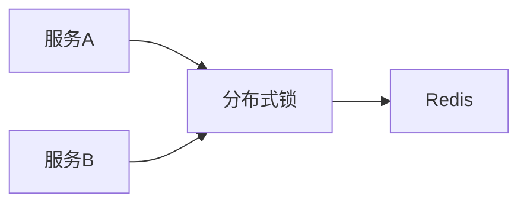

# go-redsync：Go语言分布式锁完全指南

> 在分布式系统中，锁是保证资源互斥访问的关键。go-redsync是基于Redis的分布式锁实现，支持RedLock算法，被goredis、groupcache等著名项目采用。本文带你深入了解go-redsync。

---

## 一、go-redsync简介

### 1.1 什么是分布式锁？

分布式锁是在分布式系统中保证资源互斥访问的机制：



### 1.2 为什么选择go-redsync？

go-redsync是Redis分布式锁的Go实现，特点：

| 特性 | 说明 |
|------|------|
| RedLock | RedLock算法 |
| 原子性 | Lua脚本保证 |
| 过期续期 | 自动续期 |
| 可重入 | 支持重入 |

对比数据库锁：

| 特性 | go-redsync | 数据库锁 |
|------|-----------|----------|
| 性能 | 高 | 低 |
| 可靠性 | 高 | 中 |
| 需Redis | 是 | 否 |

---

## 二、快速开始

### 2.1 安装

```bash
go get github.com/go-redsync/redsync
go get github.com/go-redsync/redis/v9
```

### 2.2 最简示例

```go
package main

import (
    "context"
    "github.com/go-redsync/redsync"
    "github.com/go-redsync/redis/v9"
)

func main() {
    // 创建Redis客户端
    client := redis.NewClient(&redis.Options{
        Addr: "localhost:6379",
    })
    
    // 创建redsync
    rs := redsync.New(client)
    
    // 获取锁
    mutex := rs.NewMutex("my-lock")
    if err := mutex.Lock(); err != nil {
        panic(err)
    }
    
    // 执行业务
    doSomething()
    
    // 释放锁
    if _, err := mutex.Unlock(); err != nil {
        panic(err)
    }
}
```

---

## 三、锁配置

### 3.1 基础配置

```go
mutex := rs.NewMutex("my-lock",
    redsync.WithExpiry(10*time.Second),
    redsync.WithTries(3),
)
```

### 3.2 高级配置

```go
mutex := rs.NewMutex("my-lock",
    // 锁过期时间
    redsync.WithExpiry(30*time.Second),
    // 重试次数
    redsync.WithTries(3),
    // 重试延迟
    redsync.WithRetryDelay(500*time.Millisecond),
    // 漂移因子
    redsync.WithDriftFactor(0.01),
    // 阀值
    redsync.WithValue(lockValue),
)
```

---

## 四、RedLock算法

### 4.1 多Redis节点

```go
// 创建多个Redis客户端
clients := []redis.Client{
    *redis.NewClient(opts1),
    *redis.NewClient(opts2),
    *redis.NewClient(opts3),
}

// 创建redsync（使用多节点）
rs := redsync.New(clients...)
```

### 4.2 多数决

```go
// RedLock需要多数节点成功
// 3个节点需要2个成功
// 5个节点需要3个成功
```

---

## 五、实战技巧

### 5.1 锁自动续期

```go
// 使用context
ctx := context.WithTimeout(context.Background(), 30*time.Second)

if err := mutex.LockContext(ctx); err != nil {
    // 获取失败
}

// 使用内置续期
go func() {
    for {
        if !mutex.Extend(); err != nil {
            break
        }
        time.Sleep(10 * time.Second)
    }
}()
```

### 5.2 锁超时处理

```go
ctx, cancel := context.WithTimeout(context.Background(), 10*time.Second)
defer cancel()

if err := mutex.LockContext(ctx); err != nil {
    if err == context.DeadlineExceeded {
        // 获取超时
    } else {
        // 其他错误
    }
}
```

### 5.3 锁重入

```go
var counter int

func inc() {
    mutex.Lock()
    defer mutex.Unlock()
    
    counter++
    if counter < 10 {
        inc()
    }
}
```

---

## 六、最佳实践

### 6.1 锁封装

```go
type Locker struct {
    rs *redsync.Redsync
}

func NewLocker() *Locker {
    client := redis.NewClient(&redis.Options{
        Addr: "localhost:6379",
    })
    return &Locker{
        rs: redsync.New(client),
    }
}

func (l *Locker) Do(name string, fn func()) error {
    mutex := l.rs.NewMutex(name)
    
    if err := mutex.Lock(); err != nil {
        return err
    }
    defer mutex.Unlock()
    
    fn()
    return nil
}
```

### 6.2 错误处理

```go
// 判断是否锁冲突
if err := mutex.Lock(); err != nil {
    if err == redsync.ErrLockNotOwned {
        // 锁不属于当前实例
    } else if err == redsync.ErrLockExists {
        // 锁已存在
    }
}
```

---

## 七、性能建议

### 7.1 减少持有时间

```go
// ✓ 快速释放
mutex.Lock()
process()
mutex.Unlock()

// ✗ 长时间持有
mutex.Lock()
longProcess()
mutex.Unlock()
```

### 7.2 合理过期时间

```go
// 根据业务设置
mutex := rs.NewMutex("lock",
    // 处理时间+缓冲时间
    redsync.WithExpiry(2*time.Minute),
)
```

---

go-redsync是Redis分布式锁的"首选"：

1. **RedLock算法**：安全的分布式锁
2. **自动续期**：防止锁超时
3. **多节点支持**：提高可用性
4. **简单易用**：API直观

分布式系统互斥访问的必备工具！

---

>