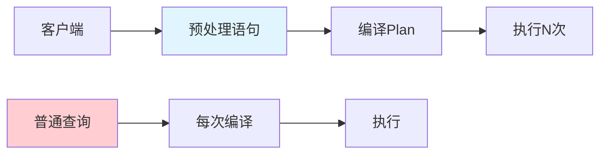

# go-sql-driver/mysql：Go语言MySQL驱动完全指南

> 在Go语言数据库开发中，go-sql-driver/mysql是最广泛使用的MySQL驱动。作为Go标准库database/sql的底层实现，它提供了高性能、纯Go、并发安全的MySQL连接能力。本文带你深入了解这一核心库。

---

## 一、库简介

### 1.1 为什么选择go-sql-driver/mysql？

Go语言标准库提供了database/sql接口，而具体的数据库驱动需要第三方实现。go-sql-driver/mysql是MySQL的纯Go实现，具有以下特点：

| 特性 | 说明 |
|------|------|
| 纯Go实现 | 无CGO依赖，跨平台友好 |
| 高速性能 | 连接池+预处理语句 |
| 标准兼容 | 实现database/sql接口 |
| 长期维护 | 活跃的社区支持 |

### 1.2 核心能力

```go
import (
    "database/sql"
    _ "github.com/go-sql-driver/mysql"
)

// 通过database/sql接口访问MySQL
db, _ := sql.Open("mysql", "user:password@/dbname")
```

---

## 二、快速开始

### 2.1 安装

```bash
go get github.com/go-sql-driver/mysql
```

### 2.2 最简示例

```go
package main

import (
    "database/sql"
    "fmt"
    _ "github.com/go-sql-driver/mysql"
)

func main() {
    // 连接数据库
    dsn := "root:password@tcp(localhost:3306)/testdb"
    db, err := sql.Open("mysql", dsn)
    if err != nil {
        panic(err)
    }
    defer db.Close()

    // 检查连接
    if err := db.Ping(); err != nil {
        panic(err)
    }
    fmt.Println("Connected to MySQL!")

    // 执行查询
    var result string
    db.QueryRow("SELECT 'Hello MySQL'").Scan(&result)
    fmt.Println(result)
}
```

---

## 三、DSN配置详解

### 3.1 DSN格式

DSN（Data Source Name）是连接数据库的字符串，格式如下：

```
[username[:password]@][protocol[(address)]]/dbname[?params]
```

### 3.2 常用参数

```go
dsn := "user:password@tcp(localhost:3306)/mydb?charset=utf8mb4&parseTime=true&loc=Local"

// 参数说明
// - charset: 字符集（推荐utf8mb4）
// - parseTime: 自动解析时间类型
// - loc: 时区设置
// - timeout: 连接超时
// - readTimeout: 读超时
// - writeTimeout: 写超时
```

### 3.3 连接池配置

```go
// 创建连接池
db.SetMaxOpenConns(25)      // 最大打开连接数
db.SetMaxIdleConns(5)        // 最大空闲连接数
db.SetConnMaxLifetime(time.Hour) // 连接最大生命周期
```

---

## 四、基础操作

### 4.1 查询单行

```go
type User struct {
    ID    int
    Name  string
    Email string
}

func getUser(db *sql.DB, id int) (*User, error) {
    var user User
    err := db.QueryRow(
        "SELECT id, name, email FROM users WHERE id = ?",
        id,
    ).Scan(&user.ID, &user.Name, &user.Email)
    
    if err != nil {
        return nil, err
    }
    return &user, nil
}
```

### 4.2 查询多行

```go
func listUsers(db *sql.DB) ([]User, error) {
    rows, err := db.Query("SELECT id, name, email FROM users")
    if err != nil {
        return nil, err
    }
    defer rows.Close()
    
    var users []User
    for rows.Next() {
        var user User
        if err := rows.Scan(&user.ID, &user.Name, &user.Email); err != nil {
            return nil, err
        }
        users = append(users, user)
    }
    return users, rows.Err()
}
```

### 4.3 执行插入

```go
func createUser(db *sql.DB, name, email string) (int64, error) {
    result, err := db.Exec(
        "INSERT INTO users (name, email) VALUES (?, ?)",
        name, email,
    )
    if err != nil {
        return 0, err
    }
    return result.LastInsertId()
}
```

### 4.4 执行更新

```go
func updateUser(db *sql.DB, id int, name string) (int64, error) {
    result, err := db.Exec(
        "UPDATE users SET name = ? WHERE id = ?",
        name, id,
    )
    if err != nil {
        return 0, err
    }
    return result.RowsAffected()
}
```

---

## 五、预处理语句

### 5.1 预处理优势



| 方式 | 执行次数 | 编译次数 | 性能 |
|------|----------|----------|------|
| 普通查询 | N次 | N次 | 低 |
| 预处理 | N次 | 1次 | 高 |

### 5.2 使用预处理

```go
// 准备语句
stmt, err := db.Prepare("SELECT id, name FROM users WHERE id = ?")
if err != nil {
    return err
}
defer stmt.Close()

// 执行查询
rows, err := stmt.Query(1)
if err != nil {
    return err
}
defer rows.Close()

for rows.Next() {
    var id int
    var name string
    rows.Scan(&id, &name)
    fmt.Println(id, name)
}
```

---

## 六、事务处理

### 6.1 基本事务

```go
func transferMoney(db *sql.DB, fromID, toID int, amount float64) error {
    tx, err := db.Begin()
    if err != nil {
        return err
    }
    defer tx.Rollback()  // 如未提交则回滚
    
    // 扣款
    _, err = tx.Exec(
        "UPDATE accounts SET balance = balance - ? WHERE id = ?",
        amount, fromID,
    )
    if err != nil {
        return err
    }
    
    // 加款
    _, err = tx.Exec(
        "UPDATE accounts SET balance = balance + ? WHERE id = ?",
        amount, toID,
    )
    if err != nil {
        return err
    }
    
    // 提交
    return tx.Commit()
}
```

### 6.2 事务隔离级别

```go
tx, err := db.BeginTx(
    context.Background(),
    &sql.TxOptions{
        Isolation: sql.LevelRepeatableRead,  // 可重复读
    },
)
```

---

## 七、错误处理

### 7.1 常见错误

```go
import (
    "database/sql"
    "errors"
    "github.com/go-sql-driver/mysql"
)

func handleError(err error) {
    if err == sql.ErrNoRows {
        fmt.Println("记录不存在")
        return
    }
    
    // MySQL特定错误码
    var mysqlErr *mysql.MySQLError
    if errors.As(err, &mysqlErr) {
        switch mysqlErr.Number {
        case 1062:
            fmt.Println("重复记录")
        case 1451:
            fmt.Println("外键约束")
        default:
            fmt.Printf("MySQL错误: %v\n", mysqlErr)
        }
    }
}
```

### 7.2 重试机制

```go
func withRetry(fn func() error, maxRetries int) error {
    var err error
    for i := 0; i < maxRetries; i++ {
        err = fn()
        if err == nil {
            return nil
        }
        // 检查是否可重试
        if !isRetryable(err) {
            return err
        }
        time.Sleep(time.Duration(i) * time.Second)
    }
    return err
}

func isRetryable(err error) bool {
    // 网络错误、连接断开等可重试
    return strings.Contains(err.Error(), "connection")
}
```

---

## 八、连接池管理

### 8.1 配置建议

```go
func newDB() *sql.DB {
    db, err := sql.Open("mysql", dsn)
    if err != nil {
        panic(err)
    }
    
    // 连接池配置
    db.SetMaxOpenConns(25)          // 并发连接上限
    db.SetMaxIdleConns(5)           // 空闲连接数
    db.SetConnMaxLifetime(time.Hour) // 连接复用时间
    
    // 预检查连接
    if err := db.Ping(); err != nil {
        panic(err)
    }
    
    return db
}
```

### 8.2 监控指标

```go
func printStats(db *sql.DB) {
    stats := db.Stats()
    fmt.Printf("OpenConnections: %d\n", stats.OpenConnections)
    fmt.Printf("InUse: %d\n", stats.InUse)
    fmt.Printf("Idle: %d\n", stats.Idle)
    fmt.Printf("WaitCount: %d\n", stats.WaitCount)
    fmt.Printf("MaxIdleClosed: %d\n", stats.MaxIdleClosed)
}
```

---

## 九、最佳实践

### 9.1 推荐模式

```go
package db

import (
    "context"
    "database/sql"
    "time"
)

var (
    db   *sql.DB
    dsn  = "user:pass@tcp(host:3306)/db?charset=utf8mb4"
)

func Init() error {
    var err error
    db, err = sql.Open("mysql", dsn)
    if err != nil {
        return err
    }
    
    db.SetMaxOpenConns(25)
    db.SetMaxIdleConns(5)
    db.SetConnMaxLifetime(time.Hour)
    
    return db.Ping()
}

func GetDB() *sql.DB {
    return db
}

func QueryContext(ctx context.Context, query string, args ...interface{}) (*sql.Rows, error) {
    return db.QueryContext(ctx, query, args...)
}

func ExecContext(ctx context.Context, query string, args ...interface{}) (sql.Result, error) {
    return db.ExecContext(ctx, query, args...)
}
```

### 9.2 Context超时

```go
ctx, cancel := context.WithTimeout(
    context.Background(),
    5*time.Second,
)
defer cancel()

rows, err := db.QueryContext(ctx, "SELECT * FROM users")
if err != nil {
    if ctx.Err() == context.DeadlineExceeded {
        return nil, errors.New("查询超时")
    }
    return nil, err
}
defer rows.Close()
```

---

go-sql-driver/mysql是Go语言MySQL开发的基石：

1. **标准兼容**：实现database/sql接口
2. **纯Go实现**：无外部依赖
3. **高性能**：连接池+预处理
4. **生产验证**：大量生产环境验证

掌握这一驱动，让你的Go应用高效连接MySQL！

---

>