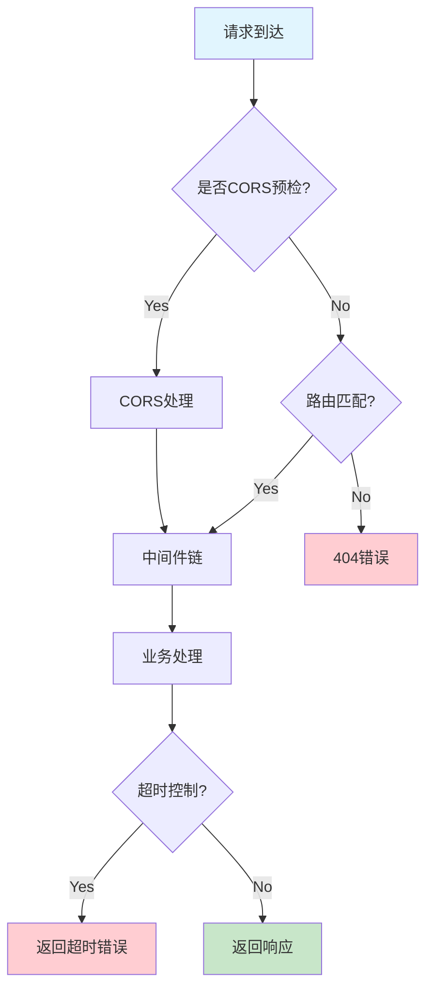

# go-zero：Go语言REST框架的实践指南

> 在Go语言生态中，选择一个合适的Web框架是开发RESTful API的第一步。今天我们聊聊字节跳动开源的go-zero框架——一个集成了API网关、RPC服务、自动CRUD等能力的REST开发框架。

---

## 一、为什么选择go-zero？

在go-zero之前，Gin、Echo等框架已经做得很出色。但它们解决的问题是"如何高效处理HTTP请求"，而实际开发中我们经常面临更复杂的问题：

- **API网关**需要限流、熔断、认证
- **微服务**需要服务发现、负载均衡
- **业务开发**需要大量重复的CRUD代码

go-zero的定位是"一站式REST开发框架"，它提供了：

| 特性 | 说明 |
|------|------|
| API网关 | 内置限流、熔断、CORS |
| 自动CRUD | 从数据库表自动生成API |
| 静态文件服务 | 几行代码即可支持 |
| 配置驱动 | 几乎零配置运行 |

---

## 二、快速开始

### 2.1 安装工具

```bash
# 安装goctl工具（代码生成器）
go install github.com/zeromicro/go-zero/tools/goctl@latest

# 验证安装
goctl version
```

### 2.2 创建项目

```bash
# 创建项目目录
mkdir -p demo && cd demo
go mod init demo

# 安装go-zero核心
go get github.com/zeromicro/go-zero/core/service
go get github.com/zeromicro/go-zero/rest
```

### 2.3 最简示例

```go
package main

import (
    "github.com/zeromicro/go-zero/rest"
    "github.com/zeromicro/go-zero/rest/httpx"
)

func main() {
    // 创建服务
    server := rest.MustNewServer(rest.Port(8888))
    defer server.Stop()

    // 注册路由
    server.AddRoute([]rest.Route{
        {
            Method:  http.MethodGet,
            Path:    "/hello",
            Handler: helloHandler,
        },
    }...)

    // 启动服务
    server.Start()
}

func helloHandler(w http.ResponseWriter, r *http.Request) {
    httpx.OkJson(w, map[string]string{
        "message": "Hello from go-zero!",
    })
}
```

运行后访问`http://localhost:8888/hello`，返回：

```json
{"message":"Hello from go-zero!"}
```

---

## 三、核心概念

### 3.1 MustNewServer vs NewServer

go-zero提供了两种创建HTTP服务的方式：

```go
// MustNewServer：带默认配置，创建失败会panic
server := rest.MustNewServer(rest.Port(8888))

// NewServer：需要手动配置，更灵活
server, err := rest.NewServer(
    rest.WithPort(8888),
    rest.WithTimeout(3000),  // 3秒超时
)
```

**推荐**：开发环境用`MustNewServer`，生产环境用`NewServer`。

### 3.2 路由注册方式

go-zero支持三种路由注册方式：

| 方式 | 代码示例 | 适用场景 |
|------|----------|----------|
| 数组注册 | `server.AddRoute([]Route{...})` | 简单API |
| 文件注册 | `server.LoadUsage(usageFile)` | 大量路由 |
| 框架注册 | `server.AddRoutes(svcRoutes)` | 结合service |

**实战代码**：

```go
// 方式一：数组注册（适合小项目）
server.AddRoute([]rest.Route{
    {Method: http.MethodGet, Path: "/user/:id", Handler: getUser},
    {Method: http.MethodPost, Path: "/user", Handler: createUser},
})

// 方式二：svcConfig配置（推荐）
// 目录结构：
// etc/
#   api.yaml
// api.go
// svc/
#   svc.go

// svc/svc.go
type ServiceContext struct {
    userRepo UserRepository
}

func NewServiceContext() *ServiceContext {
    return &ServiceContext{
        userRepo: NewUserRepository(),
    }
}

// api.go - 业务路由
var svcRoutes = []rest.Route{
    {
        Method:  http.MethodGet,
        Path:    "/user/:id",
        Handler: GetUser,
        Service: new(UserLogic),
    },
}

// 在main中加载
server.AddRoutes(svcRoutes...)
```

### 3.3 请求参数获取

go-zero设计了`UrlParam()`方法简化参数获取：

```go
// 获取路径参数
id := httpx.ParsePathParams(r.Context())["id"]

// 获取Query参数
page := r.URL.Query().Get("page")
size := r.URL.Query().Get("size")

// 获取JSON Body
type CreateUserReq struct {
    Name  string `json:"name"`
    Age   int    `json:"age"`
}
var req CreateUserReq
json.NewDecoder(r.Body).Decode(&req)
```

---

## 四、配置文件

go-zero遵循"约定优于配置"原则，一个配置文件搞定：

```yaml
Name: user-api
Host: 0.0.0.0
Port: 8888

# 超时配置
Timeout: 3000

# CORS配置
Cors:
  Enable: true
  AllowedOrigins:
    - "http://localhost:3000"
  AllowedMethods:
    - "GET"
    - "POST"
  AllowedHeaders:
    - "Content-Type"
  ExposedHeaders: []
  AllowCredentials: true
  MaxAge: 86400

# 日志配置
Log:
  ServiceName: user-api
  Mode: console
  Level: info
  Path: /tmp/logs
```

**加载配置**：

```go
var config rest.Config
_ = json.NewDecoder(configFile).Decode(&config)

server := rest.MustNewServer(config)
```

---

## 五、请求处理流程



go-zero的请求处理流程：

1. **CORS检查**：处理跨域请求
2. **路由匹配**：根据Path和Method匹配
3. **中间件链**：执行日志、认证等中间件
4. **业务处理**：执行业务逻辑
5. **超时控制**：防止请求hang住

---

## 六、中间件

go-zero支持自定义中间件：

```go
// 1. 日志中间件
func loggingInterceptor(next http.Handler) http.Handler {
    return http.HandlerFunc(func(w http.ResponseWriter, r *http.Request) {
        start := time.Now()
        next.ServeHTTP(w, r)
        log.Printf("[%s] %s %dms", r.Method, r.URL.Path, time.Since(start).Milliseconds())
    })
}

// 2. 注册中间件（数组方式）
server.Use(loggingInterceptor)

// 3. 注册中间件（配置文件）
# etc/api.yaml
Middleware:
  - loggingInterceptor
```

---

## 七、错误处理

go-zero设计了统一的错误响应结构：

```go
// 1. 自定义错误码
httpx.OkJson(w, map[string]interface{}{
    "code": 400,
    "msg":  "参数错误",
    "data": nil,
})

// 2. 便捷方法
httpx.OkJson(w, &resp)              // 成功响应
httpx.ErrorJson(w, err)             // 错误响应
httpx.Ok(w, "操作成功")               // 简单成功
httpx.InternalServerError(w, err)   // 500错误
```

---

## 八、与Gin对比

| 特性 | go-zero | Gin |
|------|---------|-----|
| 性能 | 高 | 很高 |
| 生态 | 完整（包含网关、CRUD） | 单一 |
| 学习曲线 | 中等 | 较低 |
| 维护状态 | 字节跳动主导 | 社区活跃 |
| 适合场景 | 中大型项目 | 小型项目 |

**选择建议**：

- 个人项目、小团队 -> Gin
- 中大型项目、需要完整生态 -> go-zero
- 微服务架构 -> go-zero（自带服务治理）

---

go-zero是字节跳动开源的一站式REST开发框架，它解决了Go语言开发中的"基础设施"问题：

1. **开箱即用**：配置驱动，几乎零配置
2. **生态完整**：从API网关到自动CRUD
3. **工程友好**：集成goctl工具链
4. **生产验证**：字节跳动千万级服务验证

如果你正在构建中大型REST API，或者需要微服务能力，go-zero是一个值得考虑的选择。

---

>