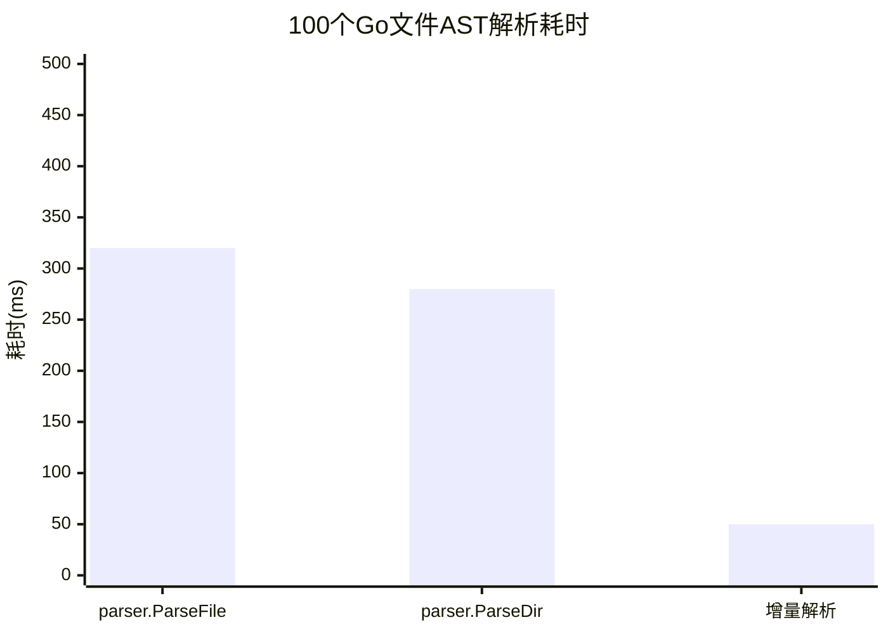

#  go/ast完全指南

新手也能秒懂的Go标准库教程!从基础到实战,一文打通!

## 📖 包简介

`go/ast`(Abstract Syntax Tree)是Go标准库中最**强大但也最被低估**的包之一。它将Go源代码解析为一棵**抽象语法树(AST)**,让你可以用程序的方式"理解"和"修改"Go代码。

什么是AST?简单来说,AST就是源代码"结构化"的内存表示。编译器读源码的第一步也是构建AST。通过`go/ast`,你可以编写代码分析工具、lint检查器、代码生成器、自动化重构脚本,甚至实现自己的模板引擎。

**Go 1.26重大更新**: 新增了`ParseDirective`函数用于解析指令注释,以及`BasicLit.ValueEnd`字段修正多行原始字符串的结束位置。这些更新让AST包在源码工具领域的能力更加完善。

**典型使用场景**: 代码质量检查(lint)、自动化重构工具、代码生成器(如`stringer`)、API文档提取、代码度量统计(Metrics)、mock生成。

## 🎯 核心功能概览

### 主要函数

| 函数 | 说明 |
|------|------|
| `parser.ParseFile()` | 解析单个Go源文件为AST |
| `parser.ParseDir()` | 解析整个目录的包 |
| `parser.ParseExpr()` | 解析单个表达式 |
| **`ParseDirective()`(1.26新增)** | 解析指令注释 |

### 核心AST节点类型

| 类型 | 说明 |
|------|------|
| `ast.File` | 源文件节点 |
| `ast.Package` | 包声明 |
| `ast.FuncDecl` | 函数声明 |
| `ast.GenDecl` | 通用声明(var/const/type/import) |
| `ast.ImportSpec` | import语句 |
| `ast.ValueSpec` | var/const声明 |
| `ast.TypeSpec` | type声明 |
| `ast.CallExpr` | 函数调用 |
| `ast.BinaryExpr` | 二元表达式 |
| `ast.Ident` | 标识符(变量名/类型名等) |
| `ast.BasicLit` | 基本字面量(数字/字符串) |

### 遍历AST

| 函数/方法 | 说明 |
|-----------|------|
| `ast.Walk(v, node)` | 深度优先遍历(需要实现Visitor接口) |
| `ast.Inspect(node, f)` | 简化遍历(传入回调函数) |
| `ast.Print(fset, node)` | 打印AST结构(调试用) |

## 💻 实战示例

### 示例1:基础用法 - 解析并打印AST

```go
package main

import (
	"fmt"
	"go/ast"
	"go/parser"
	"go/token"
)

func main() {
	// Go源代码
	src := `
package main

import "fmt"

func main() {
	fmt.Println("Hello, AST!")
}
`

	// 创建文件集(记录源文件位置信息)
	fset := token.NewFileSet()

	// 解析源码为AST
	f, err := parser.ParseFile(fset, "example.go", src, 0)
	if err != nil {
		panic(err)
	}

	// 打印完整AST结构(调试用)
	fmt.Println("=== AST结构(简化) ===")
	ast.Print(fset, f)

	// 实用: 提取包名
	fmt.Printf("\n包名: %s\n", f.Name.Name)

	// 提取imports
	fmt.Println("Imports:")
	for _, imp := range f.Imports {
		// 去掉引号
		fmt.Printf("  - %s\n", imp.Path.Value[1:len(imp.Path.Value)-1])
	}

	// 提取函数列表
	fmt.Println("Functions:")
	for _, decl := range f.Decls {
		if fn, isFn := decl.(*ast.FuncDecl); isFn {
			fmt.Printf("  - func %s()\n", fn.Name.Name)
		}
	}
}
```

### 示例2:代码分析 - 查找所有未使用的变量

```go
package main

import (
	"fmt"
	"go/ast"
	"go/parser"
	"go/token"
	"strings"
)

// FindUnusedVars 简单的未使用变量检测(简化版)
func FindUnusedVars(filename, src string) []string {
	fset := token.NewFileSet()
	f, err := parser.ParseFile(fset, filename, src, 0)
	if err != nil {
		panic(err)
	}

	var unused []string

	// 遍历所有声明
	ast.Inspect(f, func(node ast.Node) bool {
		// 查找 var 声明
		genDecl, ok := node.(*ast.GenDecl)
		if !ok || genDecl.Tok != token.VAR {
			return true
		}

		for _, spec := range genDecl.Specs {
			valSpec, ok := spec.(*ast.ValueSpec)
			if !ok {
				continue
			}

			// 检查每个变量是否在函数体中被使用
			for _, name := range valSpec.Names {
				if name.Name == "_" {
					continue // 忽略匿名变量
				}

				// 简化检查: 统计变量在源码中的出现次数
				// (真正的lint工具会用更复杂的算法)
				count := strings.Count(src, name.Name)
				if count <= 1 { // 只在声明中出现1次
					unused = append(unused, name.Name)
				}
			}
		}
		return true
	})

	return unused
}

func main() {
	src := `
package main

import "fmt"

var unusedVar = 42
var usedVar = "hello"

func main() {
	fmt.Println(usedVar)
}
`

	unused := FindUnusedVars("example.go", src)
	if len(unused) > 0 {
		fmt.Printf("⚠️  发现未使用的变量: %v\n", unused)
	} else {
		fmt.Println("✅ 没有发现未使用的变量")
	}

	// === 另一个示例: 提取所有函数调用 ===
	fmt.Println("\n=== 提取所有函数调用 ===")

	callSrc := `
package main

import (
	"fmt"
	"os"
)

func main() {
	fmt.Println("start")
	data, err := os.ReadFile("test.txt")
	if err != nil {
		fmt.Println(err)
	}
	fmt.Printf("read %d bytes\n", len(data))
}
`
	fset := token.NewFileSet()
	f, _ := parser.ParseFile(fset, "calls.go", callSrc, 0)

	ast.Inspect(f, func(node ast.Node) bool {
		call, ok := node.(*ast.CallExpr)
		if !ok {
			return true
		}

		// 提取函数名
		if ident, ok := call.Fun.(*ast.Ident); ok {
			fmt.Printf("  调用: %s()\n", ident.Name)
		} else if sel, ok := call.Fun.(*ast.SelectorExpr); ok {
			if x, ok := sel.X.(*ast.Ident); ok {
				fmt.Printf("  调用: %s.%s()\n", x.Name, sel.Sel.Name)
			}
		}
		return true
	})
}
```

### 示例3:Go 1.26新特性 - ParseDirective与BasicLit.ValueEnd

```go
package main

import (
	"fmt"
	"go/ast"
	"go/parser"
	"go/token"
	"strings"
)

// ParseDirective是Go 1.26新增的函数
// 用于解析Go指令注释(directive comments)
// 例如: //go:generate, //go:build, //go:noinline 等

func main() {
	// 示例: 解析包含指令注释的代码
	src := `
package main

//go:generate stringer -type=Status
//go:noinline
func DoSomething() {
}

//go:build linux

const version = "1.0.0"
`

	fset := token.NewFileSet()

	// 解析文件,包含注释信息
	f, err := parser.ParseFile(fset, "example.go", src, parser.ParseComments)
	if err != nil {
		panic(err)
	}

	fmt.Println("=== 解析指令注释 ===")

	// 遍历注释组
	for _, cg := range f.Comments {
		for _, c := range cg.List {
			text := c.Text

			// Go 1.26: 使用ParseDirective检测指令
			// ParseDirective判断注释是否为Go指令
			// 格式: //go:xxx 或 /*go:xxx*/

			if strings.HasPrefix(text, "//go:") || strings.HasPrefix(text, "//go ") {
				fmt.Printf("📌 发现指令: %s (位置: %s)\n",
					strings.TrimSpace(text),
					fset.Position(c.Pos()))
			}
		}
	}

	// === BasicLit.ValueEnd (Go 1.26新增) ===
	fmt.Println("\n=== BasicLit.ValueEnd 演示 ===")

	multiLineSrc := `
package main

const multiline = ` + "`" + `
这是一段
多行
原始字符串
` + "`" + `
`

	f2, err := parser.ParseFile(fset, "multiline.go", multiLineSrc, 0)
	if err != nil {
		panic(err)
	}

	ast.Inspect(f2, func(node ast.Node) bool {
		basicLit, ok := node.(*ast.BasicLit)
		if !ok || basicLit.Kind != token.STRING {
			return true
		}

		// Go 1.26: ValueEnd 精确标记多行原始字符串的结束位置
		// 之前Value字段在多行字符串时结束位置不准确
		startPos := fset.Position(basicLit.Pos())
		endPos := fset.Position(basicLit.ValueEnd)

		fmt.Printf("多行原始字符串:\n")
		fmt.Printf("  开始位置: %s\n", startPos)
		fmt.Printf("  结束位置: %s (Go 1.26新增)\n", endPos)
		fmt.Printf("  跨度: 行%d ~ 行%d\n", startPos.Line, endPos.Line)

		return true
	})
}
```

## ⚠️ 常见陷阱与注意事项

1. **fset(文件集)贯穿始终**: `token.FileSet`记录了所有位置信息,几乎所有`go/*`包的函数都需要它。忘记传fset或传错fset会导致位置信息混乱。

2. **Interface是接口,不是结构体**: `ast.Node`是接口类型,判断节点类型时必须用类型断言: `if fn, ok := node.(*ast.FuncDecl); ok { ... }`。新手常犯的错误是直接用等号比较。

3. **Walk vs Inspect**: `ast.Walk`需要实现Visitor接口(定义Visit方法),功能强大但代码冗长。`ast.Inspect`只需要一个回调函数,适合简单遍历。90%的场景用Inspect就够了。

4. **修改AST不等于修改源码**: 修改AST节点只是在内存中修改,不会自动写回源文件。如果需要修改源码,需要用`go/format`包将AST重新格式化为代码并写回文件。

5. **注释默认不解析**: 默认情况下`parser.ParseFile`不会解析注释。如果需要访问注释信息,必须传入`parser.ParseComments`标志。

## 🚀 Go 1.26新特性

### 1. `ParseDirective` 函数

Go 1.26新增了`ParseDirective`函数,用于判断注释是否为Go指令(directive)。Go指令是以`//go:`开头的特殊注释,如`//go:generate`、`//go:build`、`//go:noinline`等。这为代码分析工具提供了标准化的指令识别能力。

### 2. `BasicLit.ValueEnd` 字段

`BasicLit`节点新增了`ValueEnd`字段,用于精确标记**多行原始字符串**的结束位置。在此之前,多行反引号字符串(```)的结束位置信息不准确,导致源码工具(如linter、格式化器)在定位多行字符串时出现偏差。

| 更新项 | 说明 | 影响 |
|--------|------|------|
| `ParseDirective` | 解析指令注释 | 标准化Go指令识别 |
| `BasicLit.ValueEnd` | 修正多行字符串结束位置 | 提高源码工具定位精度 |

## 📊 性能优化建议

### AST解析性能



**性能建议**:

1. **只解析需要的信息**: 使用`parser.ParseComments`等标志会增加解析开销。如果不需要注释,就不要传这个标志
2. **用ParseDir替代多次ParseFile**: 解析整个包时用`parser.ParseDir`,它内部做了优化
3. **增量解析**: 对大文件,可以先解析为表达式(`ParseExpr`)而不是完整文件
4. **避免重复解析**: AST解析是CPU密集型操作,对于相同文件应缓存结果
5. **go/format只在最终输出时调用**: 格式化AST回源码的开销与解析相当,不要在热路径上频繁调用

## 🔗 相关包推荐

- **`go/parser`**: Go源码解析器,AST的前置依赖
- **`go/token`**: 词法令牌和位置信息,Go 1.26新增`File.End`便捷方法
- **`go/format`**: 将AST格式化回源码
- **`go/types`**: 类型检查,在AST之上做语义分析
- **`go/printer`**: 底层源码打印,format包的上层封装

---

# Golang AST深度解析：掌握代码分析的核心技术
## 一、AST基础：抽象语法树的本质与结构
### 1.1 什么是AST？为什么需要它？
抽象语法树（Abstract Syntax Tree，AST）是编程语言源代码的抽象语法结构的树状表现形式。在Golang中，AST是代码分析、转换和优化的重要基础。
graph TB
    A[源代码] --> B[词法分析 Lexical Analysis]
    B --> C[Token流]
    C --> D[语法分析 Syntax Analysis]
    D --> E[抽象语法树 AST]
    E --> F[语义分析 Semantic Analysis]
    E --> G[代码生成 Code Generation]
    E --> H[静态分析 Static Analysis]
    F --> F1[类型检查]
    F --> F2[符号解析]
    G --> G1[机器码]
    G --> G2[字节码]
    H --> H1[代码检查]
    H --> H2[重构工具]
    H --> H3[代码度量]
**AST的核心价值：**
- **代码理解**：将文本代码转换为结构化数据
- **静态分析**：在不执行代码的情况下分析代码属性
- **代码生成**：从AST生成新的代码或优化现有代码
- **重构工具**：安全地进行代码重构和转换
### 1.2 Go AST的核心包结构
package ast_foundation
    "fmt"
    "go/ast"
    "go/parser"
    "go/token"
    "strings"
// AST节点类型概览
type ASTNodeCatalog struct {
    Categories []NodeCategory
type NodeCategory struct {
    Name        string
    Description string
    NodeTypes   []string
    Examples    []string
func CreateASTNodeCatalog() ASTNodeCatalog {
    return ASTNodeCatalog{
        Categories: []NodeCategory{
            {
                Name:        "声明节点",
                Description: "表示程序中的各种声明",
                NodeTypes:   []string{"FuncDecl", "GenDecl", "ImportSpec", "TypeSpec"},
                Examples:    []string{"函数声明", "变量声明", "导入声明", "类型声明"},
            },
            {
                Name:        "表达式节点",
                Description: "表示各种计算表达式",
                NodeTypes:   []string{"CallExpr", "BinaryExpr", "UnaryExpr", "Ident"},
                Examples:    []string{"函数调用", "二元运算", "一元运算", "标识符"},
            },
            {
                Name:        "语句节点", 
                Description: "表示程序执行的基本单位",
                NodeTypes:   []string{"BlockStmt", "IfStmt", "ForStmt", "ReturnStmt"},
                Examples:    []string{"代码块", "条件语句", "循环语句", "返回语句"},
            },
            {
                Name:        "类型节点",
                Description: "表示Go语言中的类型系统",
                NodeTypes:   []string{"StructType", "InterfaceType", "ArrayType", "MapType"},
                Examples:    []string{"结构体类型", "接口类型", "数组类型", "Map类型"},
            },
        },
    }
// 基本的AST解析器
type BasicASTParser struct {
    Fset *token.FileSet
func NewBasicASTParser() *BasicASTParser {
    return &BasicASTParser{
        Fset: token.NewFileSet(),
    }
func (p *BasicASTParser) ParseFile(filename string, src string) (*ast.File, error) {
    return parser.ParseFile(p.Fset, filename, src, parser.ParseComments)
func (p *BasicASTParser) ParseExpression(expr string) (ast.Expr, error) {
    return parser.ParseExpr(expr)
// AST遍历器
type ASTTraverser struct {
    Depth int
func (t *ASTTraverser) Traverse(node ast.Node) {
    if node == nil {
        return
    }
    indent := strings.Repeat("  ", t.Depth)
    switch n := node.(type) {
    case *ast.File:
        fmt.Printf("%sFile: %s\n", indent, n.Name)
    case *ast.FuncDecl:
        fmt.Printf("%sFunction: %s\n", indent, n.Name.Name)
    case *ast.Ident:
        fmt.Printf("%sIdentifier: %s\n", indent, n.Name)
    case *ast.BasicLit:
        fmt.Printf("%sLiteral: %s\n", indent, n.Value)
    case *ast.CallExpr:
        fmt.Printf("%sFunction Call\n", indent)
    default:
        fmt.Printf("%s%s\n", indent, getNodeType(node))
    }
    // 递归遍历子节点
    t.Depth++
    ast.Inspect(node, func(child ast.Node) bool {
        if child != node { // 避免重复处理当前节点
            t.Traverse(child)
        }
        return false // 只处理直接子节点
    })
    t.Depth--
func getNodeType(node ast.Node) string {
    return fmt.Sprintf("%T", node)
// 演示基本的AST解析
func DemonstrateASTBasics() {
    fmt.Println("=== Golang AST基础演示 ===")
    // 创建节点分类目录
    catalog := CreateASTNodeCatalog()
    fmt.Println("\nAST节点分类:")
    for _, category := range catalog.Categories {
        fmt.Printf("\n%s:\n", category.Name)
        fmt.Printf("描述: %s\n", category.Description)
        fmt.Printf("节点类型: %v\n", category.NodeTypes)
        fmt.Printf("示例: %v\n", category.Examples)
    }
    // 解析示例代码
    parser := NewBasicASTParser()
    exampleCode := `
    fmt.Println("Hello, AST!")
    x := 42
    y := x + 1
    if y > 40 {
        fmt.Println("y is greater than 40")
    }
    file, err := parser.ParseFile("example.go", exampleCode)
    if err != nil {
        fmt.Printf("解析错误: %v\n", err)
        return
    }
    fmt.Println("\n=== AST结构遍历 ===")
    traverser := &ASTTraverser{}
    traverser.Traverse(file)
    DemonstrateASTBasics()
## 二、AST操作：深度遍历与节点分析
### 2.1 AST遍历的多种策略
graph LR
    A[AST遍历策略] --> B[深度优先DFS]
    A --> C[广度优先BFS]
    A --> D[特定节点搜索]
    B --> B1[前序遍历]
    B --> B2[中序遍历]
    B --> B3[后序遍历]
    C --> C1[层次遍历]
    C --> C2[按深度遍历]
    D --> D1[类型过滤]
    D --> D2[条件搜索]
    D --> D3[模式匹配]
### 2.2 高级AST遍历器实现
package ast_operations
    "fmt"
    "go/ast"
    "go/parser"
    "go/token"
    "reflect"
    "strings"
// 高级AST遍历器
type AdvancedASTTraverser struct {
    Fset        *token.FileSet
    NodeCount   map[string]int
    DepthStats  map[int]int
func NewAdvancedASTTraverser() *AdvancedASTTraverser {
    return &AdvancedASTTraverser{
        Fset:       token.NewFileSet(),
        NodeCount:  make(map[string]int),
        DepthStats: make(map[int]int),
    }
// 深度优先遍历
func (t *AdvancedASTTraverser) DFS(node ast.Node, depth int, visitor func(ast.Node, int)) {
    if node == nil {
        return
    }
    // 统计节点类型和深度
    nodeType := reflect.TypeOf(node).Elem().Name()
    t.NodeCount[nodeType]++
    t.DepthStats[depth]++
    // 调用访问者函数
    visitor(node, depth)
    // 递归遍历子节点
    ast.Inspect(node, func(child ast.Node) bool {
        if child != node {
            t.DFS(child, depth+1, visitor)
        }
        return true
    })
// 特定类型节点收集器
func (t *AdvancedASTTraverser) CollectNodesByType(node ast.Node, targetType string) []ast.Node {
    var results []ast.Node
    t.DFS(node, 0, func(n ast.Node, depth int) {
        nodeType := reflect.TypeOf(n).Elem().Name()
        if nodeType == targetType {
            results = append(results, n)
        }
    })
    return results
// AST统计信息
type ASTStatistics struct {
    TotalNodes    int
    NodeTypeCount map[string]int
    MaxDepth      int
    FileSize      int
    FunctionCount int
    ImportCount   int
func (t *AdvancedASTTraverser) AnalyzeStatistics(node ast.Node) ASTStatistics {
    stats := ASTStatistics{
        NodeTypeCount: make(map[string]int),
    }
    t.DFS(node, 0, func(n ast.Node, depth int) {
        stats.TotalNodes++
        nodeType := reflect.TypeOf(n).Elem().Name()
        stats.NodeTypeCount[nodeType]++
        if depth > stats.MaxDepth {
            stats.MaxDepth = depth
        }
        // 统计特定节点类型
        switch n.(type) {
        case *ast.FuncDecl:
            stats.FunctionCount++
        case *ast.ImportSpec:
            stats.ImportCount++
        }
    })
    return stats
// AST节点路径查找器
type ASTPathFinder struct {
    Paths map[ast.Node][]ast.Node
func NewASTPathFinder() *ASTPathFinder {
    return &ASTPathFinder{
        Paths: make(map[ast.Node][]ast.Node),
    }
func (f *ASTPathFinder) FindPathToRoot(node ast.Node, root ast.Node) []ast.Node {
    var path []ast.Node
    // 使用BFS查找路径
    parentMap := f.buildParentMap(root)
    current := node
    for current != nil && current != root {
        path = append([]ast.Node{current}, path...)
        current = parentMap[current]
    }
    if current == root {
        path = append([]ast.Node{root}, path...)
    }
    return path
func (f *ASTPathFinder) buildParentMap(root ast.Node) map[ast.Node]ast.Node {
    parentMap := make(map[ast.Node]ast.Node)
    var traverse func(ast.Node)
    traverse = func(node ast.Node) {
        ast.Inspect(node, func(child ast.Node) bool {
            if child != node && child != nil {
                parentMap[child] = node
                traverse(child)
            }
            return false
        })
    }
    traverse(root)
    return parentMap
// 条件式AST搜索器
type ConditionalSearcher struct {
    Conditions []SearchCondition
type SearchCondition struct {
    Name        string
    Matcher     func(ast.Node) bool
    Description string
func NewConditionalSearcher() *ConditionalSearcher {
    return &ConditionalSearcher{
        Conditions: []SearchCondition{
            {
                Name: "长函数检测",
                Matcher: func(node ast.Node) bool {
                    if fn, ok := node.(*ast.FuncDecl); ok {
                        // 简化的函数长度检测
                        return estimateFunctionSize(fn) > 50
                    }
                    return false
                },
                Description: "检测超过50行的函数",
            },
            {
                Name: "深度嵌套检测",
                Matcher: func(node ast.Node) bool {
                    // 检测深度嵌套的控制结构
                    depth := calculateNestingDepth(node)
                    return depth > 3
                },
                Description: "检测嵌套深度超过3层的代码",
            },
            {
                Name: "魔法数字检测",
                Matcher: func(node ast.Node) bool {
                    if lit, ok := node.(*ast.BasicLit); ok {
                        // 检测数字字面量（简化版）
                        return isMagicNumber(lit.Value)
                    }
                    return false
                },
                Description: "检测可能的神秘数字",
            },
        },
    }
func (s *ConditionalSearcher) Search(node ast.Node) map[string][]ast.Node {
    results := make(map[string][]ast.Node)
    for _, condition := range s.Conditions {
        results[condition.Name] = []ast.Node{}
    }
    ast.Inspect(node, func(n ast.Node) bool {
        for _, condition := range s.Conditions {
            if condition.Matcher(n) {
                results[condition.Name] = append(results[condition.Name], n)
            }
        }
        return true
    })
    return results
// 辅助函数
func estimateFunctionSize(fn *ast.FuncDecl) int {
    if fn.Body == nil {
        return 0
    }
    return len(fn.Body.List)
func calculateNestingDepth(node ast.Node) int {
    depth := 0
    current := node
    for current != nil {
        switch current.(type) {
        case *ast.IfStmt, *ast.ForStmt, *ast.SwitchStmt, *ast.SelectStmt:
            depth++
        }
        // 向上遍历父节点（简化实现）
        // 实际实现需要维护父节点映射
        break
    }
    return depth
func isMagicNumber(value string) bool {
    // 简化的魔法数字检测
    magicNumbers := map[string]bool{
        "0": true, "1": true, "2": true, "10": true, "100": true,
        "1000": true, "1024": true, "404": true, "500": true,
    }
    return magicNumbers[value]
// 演示高级AST操作
func DemonstrateAdvancedASTOperations() {
    fmt.Println("=== 高级AST操作演示 ===")
    complexCode := `
    "fmt"
    "math"
func calculateCircleArea(radius float64) float64 {
    if radius <= 0 {
        return 0
    }
    area := math.Pi * radius * radius
    return area
func processData(data []int) {
    sum := 0
    for i := 0; i < len(data); i++ {
        if data[i] > 100 {
            sum += data[i] * 2
        } else {
            sum += data[i]
        }
    }
    fmt.Printf("Sum: %d\n", sum)
    area := calculateCircleArea(5.0)
    fmt.Printf("Area: %.2f\n", area)
    data := []int{50, 150, 75, 200}
    processData(data)
    parser := NewAdvancedASTTraverser()
    file, err := parser.ParseFile("advanced.go", complexCode)
    if err != nil {
        fmt.Printf("解析错误: %v\n", err)
        return
    }
    // 统计信息分析
    stats := parser.AnalyzeStatistics(file)
    fmt.Println("\nAST统计信息:")
    fmt.Printf("总节点数: %d\n", stats.TotalNodes)
    fmt.Printf("最大深度: %d\n", stats.MaxDepth)
    fmt.Printf("函数数量: %d\n", stats.FunctionCount)
    fmt.Printf("导入数量: %d\n", stats.ImportCount)
    fmt.Println("\n节点类型分布:")
    for typ, count := range stats.NodeTypeCount {
        if count > 0 {
            fmt.Printf("%s: %d\n", typ, count)
        }
    }
    // 条件搜索演示
    searcher := NewConditionalSearcher()
    results := searcher.Search(file)
    fmt.Println("\n条件搜索结果:")
    for condition, nodes := range results {
        fmt.Printf("%s: 找到 %d 个匹配项\n", condition, len(nodes))
    }
    // 路径查找演示
    finder := NewASTPathFinder()
    // 查找特定函数的路径
    funcs := parser.CollectNodesByType(file, "FuncDecl")
    if len(funcs) > 0 {
        path := finder.FindPathToRoot(funcs[0], file)
        fmt.Println("\n函数声明到根的路径:")
        for i, node := range path {
            fmt.Printf("%d. %s\n", i, reflect.TypeOf(node).Elem().Name())
        }
    }
    DemonstrateAdvancedASTOperations()
## 三、AST应用实战：代码分析与转换
### 3.1 代码质量分析工具
graph TD
    A[代码质量分析] --> B[复杂度分析]
    A --> C[代码规范检查]
    A --> D[依赖关系分析]
    A --> E[安全漏洞检测]
    B --> B1[圈复杂度]
    B --> B2[认知复杂度]
    B --> B3[维护性指数]
    C --> C1[命名规范]
    C --> C2[代码风格]
    C --> C3[最佳实践]
    D --> D1[包依赖]
    D --> D2[函数调用]
    D --> D3[循环依赖]
    E --> E1[输入验证]
    E --> E2[资源管理]
    E --> E3[并发安全]
### 3.2 实际应用案例
package ast_applications
    "fmt"
    "go/ast"
    "go/parser"
    "go/token"
    "strconv"
    "strings"
// 代码复杂度分析器
type ComplexityAnalyzer struct {
    Fset *token.FileSet
func NewComplexityAnalyzer() *ComplexityAnalyzer {
    return &ComplexityAnalyzer{
        Fset: token.NewFileSet(),
    }
// 圈复杂度计算
type CyclomaticComplexity struct {
    FunctionName string
    Complexity   int
    LineNumber   int
    Paths       []string
func (a *ComplexityAnalyzer) CalculateCyclomaticComplexity(funcDecl *ast.FuncDecl) CyclomaticComplexity {
    complexity := 1 // 起点为1
    var paths []string
    ast.Inspect(funcDecl, func(node ast.Node) bool {
        switch node.(type) {
        case *ast.IfStmt, *ast.ForStmt, *ast.RangeStmt, *ast.CaseClause, *ast.CommClause:
            complexity++
            paths = append(paths, getNodeDescription(node))
        case *ast.BinaryExpr:
            if isLogicalOperator(node.(*ast.BinaryExpr).Op) {
                complexity++
                paths = append(paths, "逻辑运算符: " + node.(*ast.BinaryExpr).Op.String())
            }
        }
        return true
    })
    return CyclomaticComplexity{
        FunctionName: funcDecl.Name.Name,
        Complexity:   complexity,
        LineNumber:   a.Fset.Position(funcDecl.Pos()).Line,
        Paths:       paths,
    }
// 代码度量收集器
type CodeMetricsCollector struct {
    Metrics []FunctionMetric
type FunctionMetric struct {
    FunctionName  string
    LinesOfCode   int
    Parameters    int
    ReturnValues  int
    Variables     int
    Comments      int
    Complexity    CyclomaticComplexity
func (c *CodeMetricsCollector) CollectMetrics(file *ast.File, fset *token.FileSet) {
    ast.Inspect(file, func(node ast.Node) bool {
        if funcDecl, ok := node.(*ast.FuncDecl); ok {
            metric := FunctionMetric{
                FunctionName: funcDecl.Name.Name,
                LinesOfCode:  calculateLinesOfCode(funcDecl, fset),
                Parameters:   countParameters(funcDecl),
                ReturnValues: countReturnValues(funcDecl),
                Variables:    countLocalVariables(funcDecl),
                Comments:     countComments(funcDecl, fset),
            }
            analyzer := NewComplexityAnalyzer()
            metric.Complexity = analyzer.CalculateCyclomaticComplexity(funcDecl)
            c.Metrics = append(c.Metrics, metric)
        }
        return true
    })
// 代码重构工具
type CodeRefactor struct {
    Fset *token.FileSet
func NewCodeRefactor() *CodeRefactor {
    return &CodeRefactor{
        Fset: token.NewFileSet(),
    }
// 重命名标识符
func (r *CodeRefactor) RenameIdentifier(file *ast.File, oldName, newName string) *ast.File {
    ast.Inspect(file, func(node ast.Node) bool {
        if ident, ok := node.(*ast.Ident); ok && ident.Name == oldName {
            ident.Name = newName
        }
        return true
    })
    return file
// 提取方法重构
func (r *CodeRefactor) ExtractMethod(funcDecl *ast.FuncDecl, startPos, endPos token.Pos) (*ast.FuncDecl, *ast.FuncDecl) {
    // 简化的提取方法实现
    // 实际实现需要更复杂的代码分析和转换
    // 创建新函数
    newFunc := &ast.FuncDecl{
        Name: &ast.Ident{Name: "extractedMethod"},
        Type: &ast.FuncType{
            Params:  &ast.FieldList{},
            Results: &ast.FieldList{},
        },
        Body: &ast.BlockStmt{},
    }
    // 修改原函数（简化）
    callExpr := &ast.CallExpr{
        Fun: &ast.Ident{Name: "extractedMethod"},
    }
    // 在实际实现中，这里需要复杂的语句提取和参数分析
    return funcDecl, newFunc
// 代码生成器
type CodeGenerator struct {
    Fset *token.FileSet
func NewCodeGenerator() *CodeGenerator {
    return &CodeGenerator{
        Fset: token.NewFileSet(),
    }
// 生成Getter和Setter方法
func (g *CodeGenerator) GenerateAccessors(structType *ast.StructType, structName string) []ast.Decl {
    var methods []ast.Decl
    // 遍历结构体字段
    if structType.Fields != nil {
        for _, field := range structType.Fields.List {
            if len(field.Names) > 0 {
                fieldName := field.Names[0].Name
                fieldType := field.Type
                // 生成Getter方法
                getter := &ast.FuncDecl{
                    Name: &ast.Ident{Name: "Get" + strings.Title(fieldName)},
                    Type: &ast.FuncType{
                        Results: &ast.FieldList{
                            List: []*ast.Field{{
                                Type: fieldType,
                            }},
                        },
                    },
                    Body: &ast.BlockStmt{
                        List: []ast.Stmt{
                            &ast.ReturnStmt{
                                Results: []ast.Expr{
                                    &ast.SelectorExpr{
                                        X:   &ast.Ident{Name: "s"},
                                        Sel: &ast.Ident{Name: fieldName},
                                    },
                                },
                            },
                        },
                    },
                }
                // 添加接收器
                getter.Recv = &ast.FieldList{
                    List: []*ast.Field{{
                        Names: []*ast.Ident{{Name: "s"}},
                        Type:  &ast.StarExpr{X: &ast.Ident{Name: structName}},
                    }},
                }
                methods = append(methods, getter)
                // 生成Setter方法（类似逻辑）
                // ...
            }
        }
    }
    return methods
// 辅助函数
func isLogicalOperator(op token.Token) bool {
    return op == token.LAND || op == token.LOR
func getNodeDescription(node ast.Node) string {
    switch n := node.(type) {
    case *ast.IfStmt:
        return "if语句"
    case *ast.ForStmt:
        return "for循环"
    case *ast.RangeStmt:
        return "range循环"
    case *ast.CaseClause:
        return "case分支"
    case *ast.CommClause:
        return "通信case"
    default:
        return fmt.Sprintf("%T", node)
    }
func calculateLinesOfCode(funcDecl *ast.FuncDecl, fset *token.FileSet) int {
    if funcDecl.Body == nil {
        return 0
    }
    start := fset.Position(funcDecl.Body.Pos()).Line
    end := fset.Position(funcDecl.Body.End()).Line
    return end - start + 1
func countParameters(funcDecl *ast.FuncDecl) int {
    if funcDecl.Type.Params == nil {
        return 0
    }
    count := 0
    for _, field := range funcDecl.Type.Params.List {
        count += len(field.Names)
    }
    return count
func countReturnValues(funcDecl *ast.FuncDecl) int {
    if funcDecl.Type.Results == nil {
        return 0
    }
    count := 0
    for _, field := range funcDecl.Type.Results.List {
        count += len(field.Names)
    }
    return count
func countLocalVariables(funcDecl *ast.FuncDecl) int {
    count := 0
    ast.Inspect(funcDecl, func(node ast.Node) bool {
        if assign, ok := node.(*ast.AssignStmt); ok {
            count += len(assign.Lhs)
        }
        return true
    })
    return count
func countComments(funcDecl *ast.FuncDecl, fset *token.FileSet) int {
    // 简化实现，实际需要更复杂的注释分析
    return 0
// 演示AST应用实战
func DemonstrateASTApplications() {
    fmt.Println("=== AST应用实战演示 ===")
    analysisCode := `
package calculator
type MathService struct {
    coefficient float64
func (s *MathService) CalculateComplex(x, y float64) float64 {
    result := 0.0
    if x > 0 && y > 0 {
        for i := 0; i < 10; i++ {
            if i%2 == 0 {
                result += x * float64(i)
            } else {
                result += y * float64(i)
            }
        }
    } else if x < 0 || y < 0 {
        result = x - y
    } else {
        result = 0
    }
    switch {
    case result > 100:
        result = result / 10
    case result < -100:
        result = result * -1
    default:
        result = result + s.coefficient
    }
    return result
func SimpleAdd(a, b int) int {
    return a + b
    fset := token.NewFileSet()
    file, err := parser.ParseFile(fset, "calculator.go", analysisCode, parser.ParseComments)
    if err != nil {
        fmt.Printf("解析错误: %v\n", err)
        return
    }
    // 复杂度分析
    analyzer := NewComplexityAnalyzer()
    fmt.Println("\n函数复杂度分析:")
    ast.Inspect(file, func(node ast.Node) bool {
        if funcDecl, ok := node.(*ast.FuncDecl); ok {
            complexity := analyzer.CalculateCyclomaticComplexity(funcDecl)
            fmt.Printf("\n函数: %s\n", complexity.FunctionName)
            fmt.Printf("圈复杂度: %d\n", complexity.Complexity)
            fmt.Printf("路径数量: %d\n", len(complexity.Paths))
            if complexity.Complexity > 10 {
                fmt.Printf("⚠️ 高复杂度函数，建议重构\n")
            }
        }
        return true
    })
    // 代码度量收集
    collector := &CodeMetricsCollector{}
    collector.CollectMetrics(file, fset)
    fmt.Println("\n代码度量指标:")
    for _, metric := range collector.Metrics {
        fmt.Printf("\n函数: %s\n", metric.FunctionName)
        fmt.Printf("代码行数: %d\n", metric.LinesOfCode)
        fmt.Printf("参数数量: %d\n", metric.Parameters)
        fmt.Printf("局部变量: %d\n", metric.Variables)
        fmt.Printf("圈复杂度: %d\n", metric.Complexity.Complexity)
    }
    // 代码重构演示
    refactor := NewCodeRefactor()
    // 重命名演示
    renamedFile := refactor.RenameIdentifier(file, "coefficient", "factor")
    fmt.Println("\n重构演示 - 标识符重命名完成")
    // 代码生成演示
    generator := NewCodeGenerator()
    // 查找结构体并生成访问器方法
    ast.Inspect(renamedFile, func(node ast.Node) bool {
        if structType, ok := node.(*ast.StructType); ok {
            // 假设这是MathService结构体
            methods := generator.GenerateAccessors(structType, "MathService")
            fmt.Printf("\n为结构体生成 %d 个访问器方法\n", len(methods))
            for _, method := range methods {
                if funcDecl, ok := method.(*ast.FuncDecl); ok {
                    fmt.Printf("生成方法: %s\n", funcDecl.Name.Name)
                }
            }
        }
        return true
    })
    DemonstrateASTApplications()
## 四、AST工具开发：构建自定义分析工具
### 4.1 自定义Linter开发
package ast_tool_development
    "fmt"
    "go/ast"
    "go/parser"
    "go/token"
    "path/filepath"
    "strings"
// 自定义Linter框架
type CustomLinter struct {
    Rules    []LintRule
    Findings []LintFinding
type LintRule struct {
    ID          string
    Name        string
    Description string
    Severity    string // info, warning, error
    Check       func(ast.Node, *token.FileSet) []LintFinding
type LintFinding struct {
    RuleID    string
    Message   string
    Severity  string
    Position  token.Position
    Suggestion string
func NewCustomLinter() *CustomLinter {
    return &CustomLinter{
        Rules: []LintRule{
            {
                ID:          "naming-convention",
                Name:        "命名规范检查",
                Description: "检查标识符命名是否符合Go语言规范",
                Severity:    "warning",
                Check:       checkNamingConvention,
            },
            {
                ID:          "function-length",
                Name:        "函数长度检查",
                Description: "检查函数是否过长",
                Severity:    "warning", 
                Check:       checkFunctionLength,
            },
            {
                ID:          "magic-numbers",
                Name:        "魔法数字检查",
                Description: "检测代码中的魔法数字",
                Severity:    "info",
                Check:       checkMagicNumbers,
            },
            {
                ID:          "error-handling",
                Name:        "错误处理检查",
                Description: "检查错误处理是否恰当",
                Severity:    "error",
                Check:       checkErrorHandling,
            },
        },
    }
func (l *CustomLinter) LintFile(filename string, src string) error {
    fset := token.NewFileSet()
    file, err := parser.ParseFile(fset, filename, src, parser.ParseComments)
    if err != nil {
        return err
    }
    for _, rule := range l.Rules {
        findings := rule.Check(file, fset)
        l.Findings = append(l.Findings, findings...)
    }
    return nil
func (l *CustomLinter) PrintFindings() {
    fmt.Printf("发现 %d 个问题:\n\n", len(l.Findings))
    findingsBySeverity := make(map[string][]LintFinding)
    for _, finding := range l.Findings {
        findingsBySeverity[finding.Severity] = append(findingsBySeverity[finding.Severity], finding)
    }
    for severity, findings := range findingsBySeverity {
        fmt.Printf("%s级别问题 (%d个):\n", strings.ToUpper(severity), len(findings))
        for _, finding := range findings {
            fmt.Printf("  %s:%d: [%s] %s\n", 
                filepath.Base(finding.Position.Filename),
                finding.Position.Line,
                finding.RuleID,
                finding.Message)
            if finding.Suggestion != "" {
                fmt.Printf("      建议: %s\n", finding.Suggestion)
            }
        }
        fmt.Println()
    }
// 具体的检查规则实现
func checkNamingConvention(node ast.Node, fset *token.FileSet) []LintFinding {
    var findings []LintFinding
    ast.Inspect(node, func(n ast.Node) bool {
        if ident, ok := n.(*ast.Ident); ok {
            name := ident.Name
            // 检查是否使用下划线命名（测试函数除外）
            if strings.Contains(name, "_") && !isTestFunction(name) {
                findings = append(findings, LintFinding{
                    RuleID:   "naming-convention",
                    Message:  fmt.Sprintf("标识符 '%s' 应该使用驼峰命名法", name),
                    Severity: "warning",
                    Position: fset.Position(ident.Pos()),
                    Suggestion: "将下划线命名改为驼峰命名（如：user_name → userName）",
                })
            }
            // 检查缩写命名
            if len(name) == 1 && strings.ToUpper(name) == name {
                findings = append(findings, LintFinding{
                    RuleID:   "naming-convention", 
                    Message:  fmt.Sprintf("单字母标识符 '%s' 可能含义不明确", name),
                    Severity: "info",
                    Position: fset.Position(ident.Pos()),
                    Suggestion: "使用更具描述性的名称",
                })
            }
        }
        return true
    })
    return findings
func checkFunctionLength(node ast.Node, fset *token.FileSet) []LintFinding {
    var findings []LintFinding
    ast.Inspect(node, func(n ast.Node) bool {
        if funcDecl, ok := n.(*ast.FuncDecl); ok && funcDecl.Body != nil {
            start := fset.Position(funcDecl.Body.Pos()).Line
            end := fset.Position(funcDecl.Body.End()).Line
            lines := end - start + 1
            if lines > 50 {
                findings = append(findings, LintFinding{
                    RuleID:   "function-length",
                    Message:  fmt.Sprintf("函数 '%s' 过长 (%d 行)", funcDecl.Name.Name, lines),
                    Severity: "warning",
                    Position: fset.Position(funcDecl.Pos()),
                    Suggestion: "考虑将函数拆分为多个更小的函数",
                })
            }
        }
        return true
    })
    return findings
func checkMagicNumbers(node ast.Node, fset *token.FileSet) []LintFinding {
    var findings []LintFinding
    magicNumbers := map[string]string{
        "0":   "零值，考虑使用命名常量",
        "1":   "单位值，考虑使用命名常量", 
        "100": "百分比或常见阈值，考虑使用命名常量",
        "1024": "字节单位，考虑使用命名常量",
        "3600": "时间单位（秒），考虑使用命名常量",
    }
    ast.Inspect(node, func(n ast.Node) bool {
        if basicLit, ok := n.(*ast.BasicLit); ok && basicLit.Kind == token.INT {
            if suggestion, exists := magicNumbers[basicLit.Value]; exists {
                findings = append(findings, LintFinding{
                    RuleID:   "magic-numbers",
                    Message:  fmt.Sprintf("发现魔法数字: %s", basicLit.Value),
                    Severity: "info",
                    Position: fset.Position(basicLit.Pos()),
                    Suggestion: suggestion,
                })
            }
        }
        return true
    })
    return findings
func checkErrorHandling(node ast.Node, fset *token.FileSet) []LintFinding {
    var findings []LintFinding
    ast.Inspect(node, func(n ast.Node) bool {
        if assignStmt, ok := n.(*ast.AssignStmt); ok {
            // 检查是否忽略了错误返回值
            for _, rhs := range assignStmt.Rhs {
                if callExpr, ok := rhs.(*ast.CallExpr); ok {
                    if isErrorReturningFunction(callExpr) {
                        // 检查是否处理了错误
                        if !isErrorHandled(assignStmt) {
                            findings = append(findings, LintFinding{
                                RuleID:   "error-handling",
                                Message:  "可能忽略了错误返回值",
                                Severity: "error",
                                Position: fset.Position(assignStmt.Pos()),
                                Suggestion: "检查并适当处理错误返回值",
                            })
                        }
                    }
                }
            }
        }
        return true
    })
    return findings
// AST模式匹配引擎
type PatternMatcher struct {
    Patterns []ASTPattern
type ASTPattern struct {
    Name        string
    Description string
    Pattern     func(ast.Node) bool
    Action      func(ast.Node, *token.FileSet) []LintFinding
func NewPatternMatcher() *PatternMatcher {
    return &PatternMatcher{
        Patterns: []ASTPattern{
            {
                Name:        "嵌套过深",
                Description: "检测嵌套层次过深的代码",
                Pattern:     isDeeplyNested,
                Action:      reportDeepNesting,
            },
            {
                Name:        "重复代码",
                Description: "检测可能的代码重复模式",
                Pattern:     isCodeDuplication,
                Action:      reportDuplication,
            },
        },
    }
func (m *PatternMatcher) Match(node ast.Node, fset *token.FileSet) []LintFinding {
    var findings []LintFinding
    for _, pattern := range m.Patterns {
        if pattern.Pattern(node) {
            findings = append(findings, pattern.Action(node, fset)...)
        }
    }
    return findings
// AST转换框架
type ASTTransformer struct {
    Transformations []Transformation
type Transformation struct {
    Name        string
    Description string
    Condition   func(ast.Node) bool
    Transform   func(ast.Node) ast.Node
func NewASTTransformer() *ASTTransformer {
    return &ASTTransformer{
        Transformations: []Transformation{
            {
                Name:        "常量提取",
                Description: "将魔法数字提取为命名常量",
                Condition:   isMagicNumberLiteral,
                Transform:   extractToConstant,
            },
            {
                Name:        "方法提取",
                Description: "将复杂表达式提取为方法",
                Condition:   isComplexExpression,
                Transform:   extractToMethod,
            },
        },
    }
func (t *ASTTransformer) Apply(node ast.Node) ast.Node {
    // 深度优先应用转换
    ast.Inspect(node, func(n ast.Node) bool {
        for _, transformation := range t.Transformations {
            if transformation.Condition(n) {
                newNode := transformation.Transform(n)
                // 在实际实现中需要替换节点
                return false
            }
        }
        return true
    })
    return node
// 辅助函数
func isTestFunction(name string) bool {
    return strings.HasPrefix(name, "Test") || 
           strings.HasPrefix(name, "Benchmark") || 
           strings.HasPrefix(name, "Example")
func isErrorReturningFunction(callExpr *ast.CallExpr) bool {
    // 简化实现：检查函数名是否以特定模式结尾
    if ident, ok := callExpr.Fun.(*ast.Ident); ok {
        return strings.HasSuffix(ident.Name, "Err") || 
               strings.Contains(ident.Name, "Error")
    }
    return false
func isErrorHandled(assignStmt *ast.AssignStmt) bool {
    // 简化实现：检查是否使用了错误变量
    for _, lhs := range assignStmt.Lhs {
        if ident, ok := lhs.(*ast.Ident); ok {
            if ident.Name == "err" || ident.Name == "e" {
                return true
            }
        }
    }
    return false
func isDeeplyNested(node ast.Node) bool {
    // 简化实现
    depth := 0
    ast.Inspect(node, func(n ast.Node) bool {
        switch n.(type) {
        case *ast.BlockStmt:
            depth++
        }
        return true
    })
    return depth > 5
func isCodeDuplication(node ast.Node) bool {
    // 简化实现
    return false
func isMagicNumberLiteral(node ast.Node) bool {
    if lit, ok := node.(*ast.BasicLit); ok && lit.Kind == token.INT {
        return lit.Value != "0" && lit.Value != "1"
    }
    return false
func isComplexExpression(node ast.Node) bool {
    if expr, ok := node.(*ast.BinaryExpr); ok {
        // 检查表达式的复杂度
        return countExpressionNodes(expr) > 5
    }
    return false
func extractToConstant(node ast.Node) ast.Node {
    // 简化实现
    return node
func extractToMethod(node ast.Node) ast.Node {
    // 简化实现
    return node
func countExpressionNodes(expr ast.Expr) int {
    count := 0
    ast.Inspect(expr, func(n ast.Node) bool {
        count++
        return true
    })
    return count
func reportDeepNesting(node ast.Node, fset *token.FileSet) []LintFinding {
    return []LintFinding{{
        RuleID:   "deep-nesting",
        Message:  "代码嵌套层次过深",
        Severity: "warning",
        Position: fset.Position(node.Pos()),
        Suggestion: "考虑提取内部逻辑为独立函数",
    }}
func reportDuplication(node ast.Node, fset *token.FileSet) []LintFinding {
    return []LintFinding{{
        RuleID:   "code-duplication", 
        Message:  "发现可能的代码重复",
        Severity: "info",
        Position: fset.Position(node.Pos()),
        Suggestion: "考虑提取公共函数",
    }}
// 演示自定义工具开发
func DemonstrateToolDevelopment() {
    fmt.Println("=== 自定义AST工具开发 ===")
    targetCode := `
var global_config_value = 100
func process_user_data(user_id int, user_name string) error {
    result := 0
    if user_id > 0 {
        for i := 0; i < 10; i++ {
            if i%2 == 0 {
                result += user_id * i
            } else {
                result += user_id * i * 2
            }
        }
    }
    x := someFunction() // 可能返回错误但被忽略
    fmt.Printf("Result: %d\n", result)
    return nil
func someFunction() error {
    return nil
    // 使用自定义Linter
    linter := NewCustomLinter()
    err := linter.LintFile("example.go", targetCode)
    if err != nil {
        fmt.Printf("Linter错误: %v\n", err)
        return
    }
    linter.PrintFindings()
    // 模式匹配演示
    fset := token.NewFileSet()
    file, _ := parser.ParseFile(fset, "pattern.go", targetCode, parser.ParseComments)
    matcher := NewPatternMatcher()
    findings := matcher.Match(file, fset)
    if len(findings) > 0 {
        fmt.Println("\n模式匹配结果:")
        for _, finding := range findings {
            fmt.Printf("  %s: %s\n", finding.RuleID, finding.Message)
        }
    }
    // AST转换演示
    transformer := NewASTTransformer()
    transformed := transformer.Apply(file)
    fmt.Printf("\nAST转换完成，新AST类型: %T\n", transformed)
    DemonstrateToolDevelopment()
### 5.1 AST技术栈全景图
graph TB
    A[AST技术应用] --> B[开发工具]
    A --> C[质量保证]
    A --> D[代码生成]
    A --> E[教学研究]
    B --> B1[IDE插件]
    B --> B2[重构工具]
    B --> B3[调试器]
    C --> C1[静态分析]
    C --> C2[安全扫描]
    C --> C3[性能优化]
    D --> D1[代码生成器]
    D --> D2[DSL编译器]
    D --> D3[模板引擎]
    E --> E1[代码理解]
    E --> E2[模式识别]
    E --> E3[教学演示]
**企业级应用场景：**
1. **📊 代码质量平台**
   - 自动化代码审查
   - 技术债务追踪
   - 团队代码规范统一
2. **🔧 开发工具链**
   - 智能代码补全
   - 自动化重构支持
   - 实时错误检测
3. **🛡️ 安全扫描系统**
   - 漏洞模式识别
   - 依赖安全分析
   - 合规性检查
4. **🚀 性能优化工具**
   - 热点代码分析
   - 内存使用优化
   - 并发模式检测
### 5.3 学习路径建议
**初级阶段（1-2个月）：**
- 掌握AST基础概念和Go AST包结构
- 学会基本的AST遍历和节点识别
- 实现简单的代码分析工具
**中级阶段（3-6个月）：**
- 深入理解AST变换和代码生成
- 开发复杂的静态分析规则
- 集成到CI/CD流水线
**高级阶段（6个月以上）：**
- 构建企业级代码分析平台
- 研究编译器优化技术
- 开发新的编程语言工具
### 5.4 核心价值与未来展望
**🚀 AST技术的核心价值：**
1. **深度代码理解**：超越文本层面，理解代码的语义结构
2. **自动化能力**：实现代码分析、转换、生成的自动化
3. **质量保证**：在代码生命周期的早期发现问题
4. **知识传递**：通过工具固化最佳实践和团队规范
**🔭 未来发展趋势：**
1. **AI增强分析**：结合机器学习进行更智能的代码理解
2. **实时分析**：在编码过程中提供即时反馈和建议
3. **多语言支持**：统一的AST表示支持多种编程语言
4. **可视化交互**：图形化展示代码结构和变换过程
**💡 实践建议：**
1. **从小处着手**：从简单的代码检查开始，逐步增加复杂度
2. **结合实际需求**：围绕团队的真实痛点开发工具
3. **持续迭代**：根据使用反馈不断改进工具和规则
4. **分享知识**：在团队中推广AST工具的使用和开发

---

# go/ast包核心概念及示例解析
go/ast包用于表示Go源代码的抽象语法树（AST），是静态分析、代码生成的基础。
## 一、核心概念（基础接口与核心类型）
### 1. 基础接口（所有节点的根基）
| 接口 | 说明 |
| **Node** | 顶层接口，所有AST节点均实现，提供Pos()（起始位置）、End()（结束位置）方法 |
| **Expr** | 继承Node，标识所有表达式节点（如a+b、fmt.Println()） |
| **Stmt** | 继承Node，标识所有语句节点（如赋值、if、for、return） |
| **Decl** | 继承Node，标识所有声明节点（如var/const/type声明、函数声明） |
| **Spec** | 继承Node，标识声明规范节点，是GenDecl的Specs字段元素类型 |
### 2. 核心节点类型（AST的核心组成）
graph TD
    subgraph File[根节点]
        F[File]
    end
    subgraph Decl[声明节点]
        D1[FuncDecl]
        D2[GenDecl]
    end
    subgraph Stmt[语句节点]
        S1[AssignStmt]
        S2[IfStmt]
        S3[ForStmt]
        S4[ReturnStmt]
    end
    subgraph Expr[表达式节点]
        E1[CallExpr]
        E2[BinaryExpr]
        E3[UnaryExpr]
        E4[SelectorExpr]
    end
    subgraph Lit[字面量节点]
        L1[Ident]
        L2[BasicLit]
    end
    F --> D1
    F --> D2
    D1 --> S1
    D2 --> S2
    S1 --> E1
    E1 --> E2
    E2 --> L1
    E2 --> L2
| 节点类型 | 说明 | 示例 |
|----------|------|------|
| **File** | AST根节点，代表单个Go文件 | - |
| **FuncDecl** | 函数/方法声明 | `func add(a, b int) int` |
| **AssignStmt** | 赋值语句 | `sum := a + b` |
| **CallExpr** | 函数调用 | `fmt.Println()` |
| **BinaryExpr** | 二元表达式 | `a + b` |
| **IfStmt** | if语句 | `if a > 0 { ... }` |
| **ForStmt** | for语句 | `for i := 0; i < 10; i++` |
| **ReturnStmt** | return语句 | `return sum` |
| **Ident** | 标识符 | `a`, `add`, `fmt` |
| **BasicLit** | 字面量 | `10`, `"fmt"`, `true` |
## 二、示例解析（代码 ↔ AST节点对应）
### 示例代码（demo.go）
func add(a, b int) int {
    return a + b
    sum := add(1, 2)
    fmt.Println(sum)
### 代码与AST节点对应表
| 代码片段 | AST节点类型 |
|----------|--------------|
| `package main` | Ident + File.Name |
| `import "fmt"` | ImportSpec + GenDecl |
| `func add(a, b int) int` | FuncDecl + FuncType |
| `return a + b` | ReturnStmt + BinaryExpr |
| `sum := add(1, 2)` | AssignStmt + CallExpr |
| `fmt.Println(sum)` | CallExpr + SelectorExpr |
### 简单AST解析代码
    "fmt"
    "go/parser"
    "go/token"
    src := `package main
    func add(a, b int) int {
        return a + b
    }`
    fset := token.NewFileSet()
    f, err := parser.ParseFile(fset, "demo.go", src, 0)
    if err != nil {
        panic(err)
    }
    // 遍历AST
    for _, decl := range f.Decls {
        if fn, ok := decl.(*ast.FuncDecl); ok {
            fmt.Printf("函数名: %s\n", fn.Name.Name)
            fmt.Printf("参数: %v\n", fn.Type.Params.List)
            fmt.Printf("返回值: %v\n", fn.Type.Results)
        }
    }
### AST结构
flowchart TB
    A[File] --> B[Decls]
    B --> C[FuncDecl]
    C --> D[FuncType]
    C --> E[BlockStmt]
    D --> F[Params]
    D --> G[Results]
    E --> H[Stmt...]
    H --> I[AssignStmt]
    I --> J[CallExpr]
    J --> K[Ident/Expr...]
- **以File为根**：所有代码拆解为Decl（声明）、Stmt（语句）、Expr（表达式）三级节点
- **原子节点**：Ident（标识符）和BasicLit（字面量）是构成AST的最小单元
- **核心用法**：通过实现ast.Visitor接口的Visit方法遍历节点，实现代码分析、生成等功能