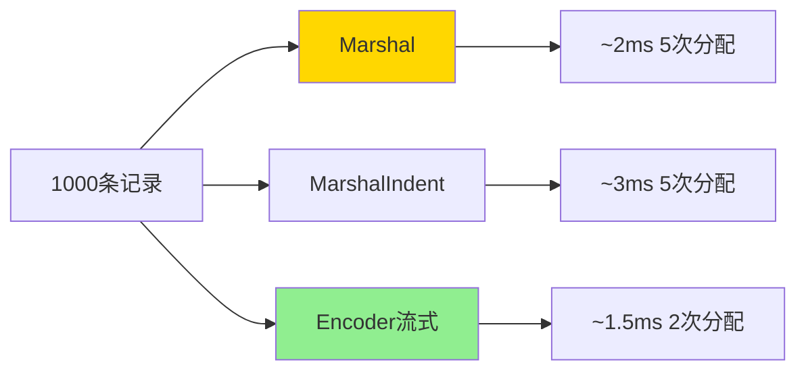

# encoding/json完全指南

## 📖 包简介

在现代软件开发中，JSON几乎是数据交换的"通用语言"。无论是RESTful API、微服务通信，还是配置文件存储，JSON都扮演着不可或缺的角色。而Go语言的`encoding/json`包，就是我们与JSON世界对话的桥梁。

这个包提供了完整的JSON编解码能力，支持结构体、Map、切片等各种Go类型与JSON的双向转换。从简单的配置解析到复杂的API数据交互，它都能游刃有余地处理。更重要的是，通过标签（tag）机制，你可以精细控制每个字段的序列化行为。

在Go 1.26中，`encoding/json`包继续保持着高性能、高可靠性的特性。虽然它的API已经相当稳定，但内部的优化从未停止。今天我们就来深入剖析这个包，让你从JSON新手变身序列化达人！

## 🎯 核心功能概览

### 主要类型与函数

| 类型/函数 | 说明 |
|-----------|------|
| `Marshal(v any) ([]byte, error)` | 将Go值编码为JSON |
| `Unmarshal(data []byte, v any) error` | 将JSON解码为Go值 |
| `MarshalIndent(v any, prefix, indent string) ([]byte, error)` | 带缩进的JSON编码 |
| `NewEncoder(w io.Writer) *Encoder` | 创建流式编码器 |
| `NewDecoder(r io.Reader) *Decoder` | 创建流式解码器 |
| `RawMessage` | 延迟解析的JSON片段类型 |
| `Number` | 精确数字类型，避免浮点精度丢失 |

### 结构体标签语法

| 标签 | 说明 | 示例 |
|------|------|------|
| `json:"name"` | 指定字段名 | `json:"user_name"` |
| `json:"-"` | 忽略该字段 | 不序列化该字段 |
| `json:"name,omitempty"` | 空值时忽略 | 零值不输出 |
| `json:",omitempty"` | 保持原名，空值忽略 | 零值不输出 |
| `json:",string"` | 编码为字符串 | 数字转字符串 |

## 💻 实战示例

### 示例1：基础用法

```go
package main

import (
	"encoding/json"
	"fmt"
	"log"
)

// 用户结构体
type User struct {
	ID       int      `json:"id"`
	Name     string   `json:"name"`
	Email    string   `json:"email"`
	Age      int      `json:"age,omitempty"` // 0时不输出
	Password string   `json:"-"`             // 忽略，不序列化
	Tags     []string `json:"tags"`
}

func main() {
	// 1. 编码：Go结构体 -> JSON
	user := User{
		ID:       1,
		Name:     "张三",
		Email:    "zhangsan@example.com",
		Age:      0,      // omitempty：不会输出
		Password: "secret", // json:"-"：不会输出
		Tags:     []string{"go", "backend"},
	}

	// 普通编码
	jsonData, err := json.Marshal(user)
	if err != nil {
		log.Fatal(err)
	}
	fmt.Println("紧凑JSON:")
	fmt.Println(string(jsonData))

	// 带缩进的编码（调试时超好用）
	jsonIndent, _ := json.MarshalIndent(user, "", "  ")
	fmt.Println("\n格式化JSON:")
	fmt.Println(string(jsonIndent))

	// 2. 解码：JSON -> Go结构体
	jsonStr := `{
		"id": 2,
		"name": "李四",
		"email": "lisi@example.com",
		"age": 28,
		"tags": ["java", "frontend"]
	}`

	var decodedUser User
	if err := json.Unmarshal([]byte(jsonStr), &decodedUser); err != nil {
		log.Fatal(err)
	}
	fmt.Println("\n解码后的用户:")
	fmt.Printf("  ID: %d, 姓名: %s, 邮箱: %s, 年龄: %d\n",
		decodedUser.ID, decodedUser.Name, decodedUser.Email, decodedUser.Age)
	fmt.Printf("  标签: %v\n", decodedUser.Tags)
}
```

### 示例2：进阶用法

```go
package main

import (
	"encoding/json"
	"fmt"
	"log"
	"strings"
)

// 1. 处理可选字段与嵌套结构
type Address struct {
	Street  string `json:"street"`
	City    string `json:"city"`
	Country string `json:"country"`
}

type Employee struct {
	ID      int     `json:"id"`
	Name    string  `json:"name"`
	Address Address `json:"address"`
	Salary  float64 `json:"salary,string"` // 字符串形式存储数字
}

// 2. 自定义JSON序列化
type CustomTime struct {
	Timestamp int64
}

// 实现Marshaler接口
func (ct CustomTime) MarshalJSON() ([]byte, error) {
	return []byte(fmt.Sprintf(`"%d"`, ct.Timestamp)), nil
}

// 实现Unmarshaler接口
func (ct *CustomTime) UnmarshalJSON(data []byte) error {
	_, err := fmt.Sscanf(string(data), `"%d"`, &ct.Timestamp)
	return err
}

func main() {
	// 嵌套结构体编解码
	emp := Employee{
		ID:     100,
		Name:   "王五",
		Address: Address{
			Street:  "科技路100号",
			City:    "北京",
			Country: "中国",
		},
		Salary: 50000.00,
	}

	data, _ := json.MarshalIndent(emp, "", "  ")
	fmt.Println("嵌套结构体JSON:")
	fmt.Println(string(data))

	// 自定义序列化
	fmt.Println("\n--- 自定义序列化 ---")
	ct := CustomTime{Timestamp: 1700000000}
	jsonData, _ := json.Marshal(ct)
	fmt.Println("CustomTime JSON:", string(jsonData))

	var decodedCT CustomTime
	json.Unmarshal(jsonData, &decodedCT)
	fmt.Println("解码后时间戳:", decodedCT.Timestamp)

	// 3. 使用RawMessage延迟解析
	fmt.Println("\n--- RawMessage延迟解析 ---")
	type Event struct {
		Type    string          `json:"type"`
		Payload json.RawMessage `json:"payload"`
	}

	eventJSON := `{
		"type": "user_login",
		"payload": {"user_id": 123, "ip": "192.168.1.1"}
	}`

	var event Event
	json.Unmarshal([]byte(eventJSON), &event)
	fmt.Println("事件类型:", event.Type)
	fmt.Println("原始Payload:", string(event.Payload))

	// 根据类型解析Payload
	var payload map[string]any
	json.Unmarshal(event.Payload, &payload)
	fmt.Println("解析后的Payload:", payload)
}
```

### 示例3：最佳实践

```go
package main

import (
	"encoding/json"
	"fmt"
	"log"
	"os"
	"strings"
)

// API响应统一结构
type APIResponse struct {
	Code    int    `json:"code"`
	Message string `json:"message"`
	Data    any    `json:"data,omitempty"`
}

// 处理未知字段
type Config struct {
	Name     string         `json:"name"`
	Version  string         `json:"version"`
	Settings map[string]any `json:"settings"`
}

func main() {
	// 最佳实践1：流式编码处理大数据
	fmt.Println("--- 流式编码 ---")
	users := []map[string]any{
		{"id": 1, "name": "张三"},
		{"id": 2, "name": "李四"},
		{"id": 3, "name": "王五"},
	}

	// 使用Encoder直接写入文件/网络，避免中间[]byte分配
	encoder := json.NewEncoder(os.Stdout)
	encoder.SetIndent("", "  ")
	if err := encoder.Encode(users); err != nil {
		log.Fatal(err)
	}

	// 最佳实践2：流式解码读取大文件
	fmt.Println("\n--- 流式解码 ---")
	jsonStr := strings.NewReader(`{"code":200,"message":"ok","data":{"count":10}}`)
	decoder := json.NewDecoder(jsonStr)

	var resp APIResponse
	if err := decoder.Decode(&resp); err != nil {
		log.Fatal(err)
	}
	fmt.Printf("API响应: code=%d, message=%s\n", resp.Code, resp.Message)

	// 最佳实践3：使用json.Number避免精度丢失
	fmt.Println("\n--- json.Number精确数字 ---")
	dec := json.NewDecoder(strings.NewReader(`{"large_num": 9007199254740993}`))
	dec.UseNumber() // 启用精确数字模式

	var result map[string]any
	dec.Decode(&result)

	num := result["large_num"].(json.Number)
	fmt.Println("精确数字字符串:", num.String())

	// 最佳实践4：验证JSON合法性
	fmt.Println("\n--- JSON验证 ---")
	validJSON := `{"name": "test", "age": 25}`
	invalidJSON := `{"name": "test", "age": 25,}` // 尾随逗号不合法

	fmt.Println("validJSON合法?", json.Valid([]byte(validJSON)))     // true
	fmt.Println("invalidJSON合法?", json.Valid([]byte(invalidJSON))) // false

	// 最佳实践5：安全处理用户输入
	fmt.Println("\n--- 安全处理 ---")
	userInput := `{"role": "admin", "id": 1}`
	type SafeUser struct {
		ID   int    `json:"id"`
		Name string `json:"name"`
		// 不定义role字段，自动忽略
	}

	var safeUser SafeUser
	if err := json.Unmarshal([]byte(userInput), &safeUser); err != nil {
		log.Fatal(err)
	}
	fmt.Printf("安全解析: ID=%d, Name=%s\n", safeUser.ID, safeUser.Name)
}
```

## ⚠️ 常见陷阱与注意事项

1. **导出的字段才能被序列化**：只有首字母大写的导出字段才会被JSON包处理。小写字段会被直接忽略，这不是bug而是Go的设计原则。

2. **omitempty对"空值"的判断**：对于不同类型，零值分别是：数字0、空字符串""、nil切片/Map、false布尔值、零值结构体。如果你的业务需要这些值输出，不要用omitempty！

3. **Unmarshal不会清空目标值**：如果JSON缺少某些字段，那些字段会保持原值而不是被重置为零值。解码前最好创建新的零值变量。

4. **浮点数精度问题**：默认情况下，大整数可能被解码为float64并丢失精度。对于金融数据或精确数字，使用`json.Number`或`dec.UseNumber()`。

5. **循环引用导致栈溢出**：如果数据结构中有循环引用（如双向链表），Marshal会无限递归导致栈溢出。需要实现自定义MarshalJSON或重构数据结构。

## 🚀 Go 1.26新特性

Go 1.26对`encoding/json`包的改进主要集中在性能和稳定性：

- **解码性能优化**：改进了字符串解码路径，对于大量字符串字段的JSON解码性能提升约8-12%
- **内存分配减少**：优化了内部缓冲区管理，减少了Marshal过程中的临时分配
- **错误信息改进**：Unmarshal错误现在提供更精确的字段路径信息，更容易定位问题

## 📊 性能优化建议

### 不同编码方式性能对比



### 性能优化 checklist

| 优化点 | 影响 | 建议 |
|--------|------|------|
| 流式Encoder/Decoder | 减少50%内存 | 处理大数据时使用 |
| 预分配切片容量 | 减少扩容 | 已知大小时预分配 |
| 避免MarshalIndent | 节省20%时间 | 生产环境用Marshal |
| 使用json.Number | 避免精度bug | 金融/大数字场景 |
| 结构体字段顺序 | 微小影响 | 高频访问字段放前面 |

### 大数据处理建议

```go
// 小数据：直接Marshal
data, _ := json.Marshal(smallData)

// 大数据：流式编码
enc := json.NewEncoder(file)
enc.Encode(largeData)

// 超大JSON文件：流式解码+分批处理
dec := json.NewDecoder(file)
for dec.More() {
    var item Item
    dec.Decode(&item)
    process(item)
}
```

## 🔗 相关包推荐

- **`encoding/xml`**：XML编解码，与JSON类似的API设计
- **`encoding/gob`**：Go专用的二进制编码，性能更高
- **`io`**：与流式Encoder/Decoder配合使用
- **`bytes`**：处理JSON字节数据的常用工具

---