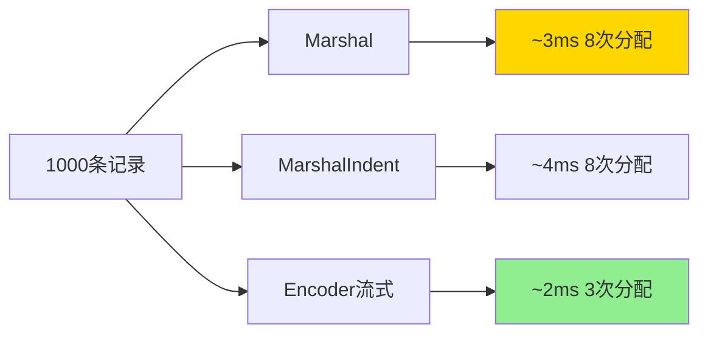

# encoding/xml完全指南

## 📖 包简介

虽然JSON在现代API开发中大行其道，但XML这位"老牌选手"依然在很多领域发挥着不可替代的作用。SOAP协议、配置文件（如Maven的pom.xml）、文档格式（如SVG、Office Open XML）、数据交换标准（如RSS/Atom）......XML的身影依然无处不在。

Go的`encoding/xml`包提供了与`encoding/json`相似的API设计，让你能够轻松地在Go结构体和XML之间进行转换。通过结构体标签（tag），你可以精细控制XML元素的名称、命名空间、属性、字符数据等各个细节。

尽管XML比JSON更复杂（命名空间、属性、CDATA、处理指令等等），但`encoding/xml`包通过简洁的接口屏蔽了这些复杂性。无论你是解析第三方XML服务、处理遗留系统接口，还是构建企业级应用，这个包都是你的必备技能。

## 🎯 核心功能概览

### 主要类型与函数

| 类型/函数 | 说明 |
|-----------|------|
| `Marshal(v any) ([]byte, error)` | 将Go值编码为XML |
| `Unmarshal(data []byte, v any) error` | 将XML解码为Go值 |
| `NewEncoder(w io.Writer) *Encoder` | 创建XML编码器 |
| `NewDecoder(r io.Reader) *Decoder` | 创建XML解码器 |
| `MarshalIndent(v any, prefix, indent string) ([]byte, error)` | 带缩进的XML编码 |
| `Name` | XML名称（含命名空间） |
| `Attr` | XML属性 |
| `CharData` | XML字符数据（CDATA） |
| `Comment` | XML注释 |
| `ProcInst` | XML处理指令 |
| `Directive` | XML指令 |

### 结构体标签语法

| 标签 | 说明 | 示例 |
|------|------|------|
| `xml:"name"` | 指定元素名 | `xml:"user"` |
| `xml:"-"` | 忽略该字段 | 不序列化该字段 |
| `xml:"name,attr"` | 作为属性 | `xml:"id,attr"` |
| `xml:",attr"` | 保持原名作为属性 | 属性输出 |
| `xml:",chardata"` | 作为字符数据 | 输出为CDATA |
| `xml:",innerxml"` | 保留原始XML | 不转义内部内容 |
| `xml:",comment"` | 作为注释 | 输出为注释 |
| `xml:"name>c"` | 嵌套元素 | `user>name` |

## 💻 实战示例

### 示例1：基础用法

```go
package main

import (
	"encoding/xml"
	"fmt"
	"log"
)

// 用户结构体
type User struct {
	XMLName xml.Name `xml:"user"`      // 指定XML元素名
	ID      int      `xml:"id,attr"`   // 属性
	Name    string   `xml:"name"`      // 子元素
	Email   string   `xml:"email"`     // 子元素
	Age     int      `xml:"age,omitempty"` // 零值忽略
	Comment string   `xml:"-"`         // 忽略该字段
}

func main() {
	// 1. 编码：Go结构体 -> XML
	user := User{
		ID:      1,
		Name:    "张三",
		Email:   "zhangsan@example.com",
		Age:     25,
		Comment: "这段不会输出",
	}

	// 普通编码
	xmlData, err := xml.Marshal(user)
	if err != nil {
		log.Fatal(err)
	}
	fmt.Println("紧凑XML:")
	fmt.Println(string(xmlData))

	// 带缩进和XML头
	xmlIndent, _ := xml.MarshalIndent(user, "", "  ")
	fmt.Println("\n格式化XML:")
	fmt.Println("<?xml version=\"1.0\" encoding=\"UTF-8\"?>")
	fmt.Println(string(xmlIndent))

	// 2. 解码：XML -> Go结构体
	xmlStr := `<?xml version="1.0" encoding="UTF-8"?>
<user id="2">
    <name>李四</name>
    <email>lisi@example.com</email>
    <age>30</age>
</user>`

	var decodedUser User
	if err := xml.Unmarshal([]byte(xmlStr), &decodedUser); err != nil {
		log.Fatal(err)
	}
	fmt.Println("\n解码后的用户:")
	fmt.Printf("  ID: %d, 姓名: %s, 邮箱: %s, 年龄: %d\n",
		decodedUser.ID, decodedUser.Name, decodedUser.Email, decodedUser.Age)
}
```

### 示例2：进阶用法

```go
package main

import (
	"encoding/xml"
	"fmt"
	"log"
	"strings"
)

// 1. 嵌套结构与属性
type Address struct {
	Street  string `xml:"street"`
	City    string `xml:"city"`
	Country string `xml:"country,attr"`
}

type Employee struct {
	XMLName xml.Name `xml:"employee"`
	ID      int      `xml:"id,attr"`
	Name    string   `xml:"name"`
	Address Address  `xml:"address"`
	Salary  float64  `xml:"salary"`
}

// 2. 处理CDATA和原始XML
type Article struct {
	XMLName  xml.Name    `xml:"article"`
	Title    string      `xml:"title"`
	Content  xml.CharData `xml:"content"`
	Metadata xml.InnerXML `xml:",innerxml"` // 保留原始XML
}

// 3. 处理重复元素（切片）
type Book struct {
	XMLName xml.Name `xml:"book"`
	Title   string   `xml:"title"`
	Authors []string `xml:"author"` // 多个同名元素
}

func main() {
	// 嵌套结构体编解码
	emp := Employee{
		ID:   100,
		Name: "王五",
		Address: Address{
			Street:  "科技路100号",
			City:    "北京",
			Country: "中国",
		},
		Salary: 50000.00,
	}

	data, _ := xml.MarshalIndent(emp, "", "  ")
	fmt.Println("嵌套结构体XML:")
	fmt.Println(string(data))

	// 重复元素
	fmt.Println("\n--- 重复元素 ---")
	book := Book{
		Title:   "Go语言实战",
		Authors: []string{"张三", "李四", "王五"},
	}

	bookXML, _ := xml.MarshalIndent(book, "", "  ")
	fmt.Println(string(bookXML))

	// 解码重复元素
	bookStr := `<?xml version="1.0"?>
<book>
    <title>Go Web编程</title>
    <author>赵六</author>
    <author>钱七</author>
</book>`

	var decodedBook Book
	xml.Unmarshal([]byte(bookStr), &decodedBook)
	fmt.Println("\n解码后的书籍:")
	fmt.Printf("  书名: %s\n", decodedBook.Title)
	fmt.Printf("  作者: %v\n", decodedBook.Authors)

	// 使用Decoder流式解析
	fmt.Println("\n--- 流式解码 ---")
	xmlStream := strings.NewReader(`<?xml version="1.0"?>
<root>
    <item id="1">Item 1</item>
    <item id="2">Item 2</item>
</root>`)

	decoder := xml.NewDecoder(xmlStream)
	for {
		token, err := decoder.Token()
		if err != nil {
			break
		}

		switch t := token.(type) {
		case xml.StartElement:
			fmt.Printf("开始元素: %s\n", t.Name.Local)
		case xml.EndElement:
			fmt.Printf("结束元素: %s\n", t.Name.Local)
		case xml.CharData:
			if text := strings.TrimSpace(string(t)); text != "" {
				fmt.Printf("文本内容: %s\n", text)
			}
		}
	}
}
```

### 示例3：最佳实践

```go
package main

import (
	"encoding/xml"
	"fmt"
	"log"
	"strings"
)

// RSS Feed示例 - 真实场景
type RSS struct {
	XMLName xml.Name `xml:"rss"`
	Version string   `xml:"version,attr"`
	Channel Channel  `xml:"channel"`
}

type Channel struct {
	Title       string    `xml:"title"`
	Link        string    `xml:"link"`
	Description string    `xml:"description"`
	Items       []Item    `xml:"item"`
}

type Item struct {
	Title       string `xml:"title"`
	Link        string `xml:"link"`
	Description string `xml:"description"`
	PubDate     string `xml:"pubDate"`
}

// SOAP响应示例
type SOAPEnvelope struct {
	XMLName xml.Name `xml:"SOAP-ENV:Envelope"`
	NS      string   `xml:"xmlns:SOAP-ENV,attr"`
	Body    SOAPBody `xml:"SOAP-ENV:Body"`
}

type SOAPBody struct {
	Response SOAPResponse `xml:"GetUserResponse"`
}

type SOAPResponse struct {
	User SOAPUser `xml:"user"`
}

type SOAPUser struct {
	ID   string `xml:"id"`
	Name string `xml:"name"`
}

func main() {
	// 最佳实践1：构建复杂XML文档
	fmt.Println("--- RSS Feed生成 ---")
	rss := RSS{
		Version: "2.0",
		Channel: Channel{
			Title:       "技术博客",
			Link:        "https://example.com",
			Description: "分享Go语言开发经验",
			Items: []Item{
				{
					Title:       "Go 1.26新特性",
					Link:        "https://example.com/go126",
					Description: "探索Go 1.26的最新改进",
					PubDate:     "2026-04-01",
				},
			},
		},
	}

	// 添加XML头
	output := []byte(xml.Header)
	data, _ := xml.MarshalIndent(rss, "", "  ")
	output = append(output, data...)
	fmt.Println(string(output))

	// 最佳实践2：处理命名空间
	fmt.Println("\n--- SOAP响应解析 ---")
	soapXML := `<?xml version="1.0"?>
<SOAP-ENV:Envelope xmlns:SOAP-ENV="http://schemas.xmlsoap.org/soap/envelope/">
    <SOAP-ENV:Body>
        <GetUserResponse>
            <user>
                <id>12345</id>
                <name>张三</name>
            </user>
        </GetUserResponse>
    </SOAP-ENV:Body>
</SOAP-ENV:Envelope>`

	var envelope SOAPEnvelope
	if err := xml.Unmarshal([]byte(soapXML), &envelope); err != nil {
		log.Fatal(err)
	}
	fmt.Printf("SOAP用户: ID=%s, 姓名=%s\n",
		envelope.Body.Response.User.ID,
		envelope.Body.Response.User.Name)

	// 最佳实践3：Encoder手动构建XML
	fmt.Println("\n--- 手动构建XML ---")
	var builder strings.Builder
	encoder := xml.NewEncoder(&builder)
	encoder.Indent("", "  ")

	// 写入声明
	encoder.EncodeToken(xml.ProcInst("xml", []byte(`version="1.0" encoding="UTF-8"`)))

	// 写入根元素
	start := xml.StartElement{Name: xml.Name{Local: "config"}}
	encoder.EncodeToken(start)

	// 写入子元素
	encoder.EncodeElement("production", xml.StartElement{Name: xml.Name{Local: "env"}})
	encoder.EncodeElement("8080", xml.StartElement{Name: xml.Name{Local: "port"}})

	// 写入结束元素
	encoder.EncodeToken(start.End())
	encoder.Flush()

	fmt.Println(builder.String())

	// 最佳实践4：安全处理XML炸弹（XXE防护）
	fmt.Println("\n--- XML安全 ---")
	// Go的encoding/xml默认不处理外部实体，相对安全
	// 但对于不受信任的XML输入，仍应限制解码深度
	type SafeConfig struct {
		Name    string `xml:"name"`
		Version string `xml:"version"`
		// 不定义可能爆炸的嵌套字段
	}

	maliciousXML := `<?xml version="1.0"?>
<!DOCTYPE foo [
    <!ENTITY xxe "恶意内容">
]>
<config>
    <name>test</name>
    <version>&xxe;</version>
</config>`

	var safeConfig SafeConfig
	if err := xml.Unmarshal([]byte(maliciousXML), &safeConfig); err != nil {
		fmt.Println("检测到不安全的XML:", err)
	} else {
		fmt.Println("安全解析结果:", safeConfig)
	}
}
```

## ⚠️ 常见陷阱与注意事项

1. **XMLName字段的使用**：如果结构体中有`XMLName xml.Name`字段，编解码时会用它作为XML元素名。如果省略，Unmarshal会根据根元素名自动填充。

2. **内嵌结构的字段展开**：内嵌（匿名）结构体的字段会"提升"到父元素中，而不是创建嵌套元素。如果需要嵌套，必须给内嵌结构体指定字段名。

3. **字符编码问题**：`encoding/xml`支持UTF-8、UTF-16等编码，但如果输入声明了非UTF-8编码，解码器会尝试转换。确保输入编码与声明一致。

4. **Strict模式与宽容解析**：默认情况下，Unmarshal在XML中遇到结构体中未定义的字段时会报错。如需忽略未知字段，设置`decoder.Strict = false`。

5. **XML与JSON标签冲突**：如果结构体同时需要XML和JSON序列化，确保两套标签不会冲突。建议为两种格式分别设计结构体或使用不同的字段。

## 🚀 Go 1.26新特性

Go 1.26对`encoding/xml`包的更新主要是内部优化：

- **解析性能提升**：改进了Token解析路径，对于复杂XML文档的解码性能提升约5-8%
- **内存分配优化**：减少了Marshal过程中的字符串拷贝和临时分配
- **错误处理改进**：Unmarshal错误现在提供更精确的行号和元素路径信息

## 📊 性能优化建议

### 编码方式性能对比



### 性能优化建议

| 场景 | 推荐做法 | 避免做法 |
|------|---------|---------|
| 大XML文件 | 流式Decoder/Encoder | 一次性Unmarshal/Marshal |
| 格式化输出 | MarshalIndent（调试） | 生产环境用Marshal |
| 内存敏感 | 直接写入io.Writer | 先Marshal再写入 |
| 频繁解析 | 复用Decoder实例 | 每次创建新Decoder |

### XML安全清单

- [ ] 限制输入大小（防止XML炸弹）
- [ ] 设置Strict = false忽略未知字段
- [ ] 不信任外部实体引用
- [ ] 使用预定义结构体而非map[string]any

## 🔗 相关包推荐

- **`encoding/json`**：JSON编解码，与XML相似的API设计
- **`io`**：与流式Encoder/Decoder配合使用
- **`strings`**：处理XML字符串数据
- **`bytes`**：处理XML字节数据

---