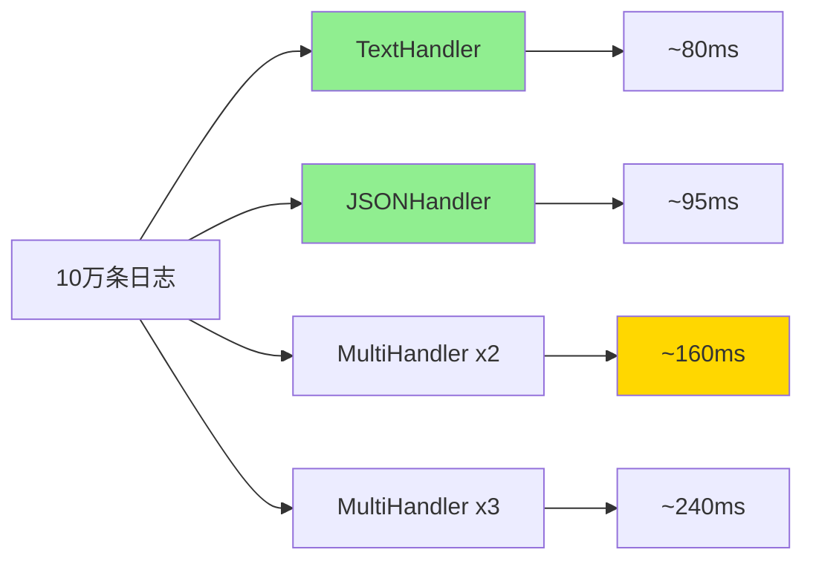

# log/slog完全指南

## 📖 包简介

日志是应用程序的"黑匣子"——没有它，排查问题就像在黑暗中摸索。但传统的`log`包只能输出简单的文本信息，面对现代微服务架构中海量日志分析、链路追踪、结构化查询等需求，显得力不从心。

`log/slog`包（Structured Logging）是Go 1.21引入的结构化日志库，从此正式成为标准库成员。它让你能够以键值对的形式记录日志，输出既可以是人类可读的文本，也可以是机器可解析的JSON。更棒的是，它的API设计极其优雅，告别了过去那种"拼接字符串造日志"的痛苦经历。

在Go 1.26中，`slog`包迎来了重磅更新——**NewMultiHandler**，让你能够将日志同时输出到多个目的地（比如控制台+文件+日志收集系统），无需再自己封装多路复用逻辑。今天就带你彻底掌握这个现代化日志利器！

## 🎯 核心功能概览

### 主要类型

| 类型 | 说明 |
|------|------|
| `Logger` | 日志记录器，提供Info/Warn/Error等方法 |
| `Handler` | 日志处理器接口，决定日志如何输出 |
| `Record` | 单条日志记录的抽象 |
| `Attr` | 键值对属性，构成结构化日志的基础 |
| `Level` | 日志级别（Debug=-4, Info=0, Warn=4, Error=8） |

### 核心函数

| 函数 | 说明 |
|------|------|
| `New(handler Handler) *Logger` | 使用指定Handler创建Logger |
| `SetDefault(logger *Logger)` | 设置全局默认Logger |
| `Default() *Logger` | 获取全局默认Logger |
| `Info(msg string, args ...any)` | 记录Info级别日志（使用默认Logger） |
| `Debug/Warn/Error(...)` | 其他级别日志记录 |
| `NewTextHandler(w io.Writer, opts *HandlerOptions) *TextHandler` | 创建文本格式处理器 |
| `NewJSONHandler(w io.Writer, opts *HandlerOptions) *JSONHandler` | 创建JSON格式处理器 |
| **`NewMultiHandler(handlers ...Handler) *MultiHandler`** | **Go 1.26新增：多路复用处理器** |

### HandlerOptions选项

| 选项 | 说明 |
|------|------|
| `Level Leveler` | 日志级别过滤器 |
| `AddSource bool` | 是否添加源文件信息 |
| `ReplaceAttr func(groups []string, a Attr) Attr` | 自定义属性处理函数 |

## 💻 实战示例

### 示例1：基础用法

```go
package main

import (
	"log/slog"
	"os"
)

func main() {
	// 1. 使用全局Logger - 最简单的方式
	slog.Info("服务启动成功",
		"port", 8080,
		"env", "production",
	)

	slog.Warn("磁盘空间不足",
		"disk", "/dev/sda1",
		"usage_percent", 92,
	)

	slog.Error("数据库连接失败",
		"host", "localhost",
		"port", 5432,
		"error", "connection refused",
	)

	// 2. 创建自定义Logger（JSON格式）
	jsonHandler := slog.NewJSONHandler(os.Stdout, &slog.HandlerOptions{
		Level:     slog.LevelDebug, // 输出Debug及以上所有级别
		AddSource: true,            // 添加源文件行号
	})
	logger := slog.New(jsonHandler)

	logger.Info("JSON格式日志",
		"user_id", 123,
		"action", "login",
	)

	// 3. 不同级别的日志
	logger.Debug("调试信息：变量值", "value", 42)
	logger.Info("常规信息：用户操作", "user", "张三")
	logger.Warn("警告信息：性能下降", "cpu_usage", 85)
	logger.Error("错误信息：请求失败", "status_code", 500)
}
```

### 示例2：进阶用法

```go
package main

import (
	"fmt"
	"log/slog"
	"os"
	"time"
)

// 自定义日志级别
const (
	LevelTrace slog.Level = -8
	LevelFatal slog.Level = 16
)

func main() {
	// 1. 带分组的日志（WithGroup）
	logger := slog.New(slog.NewJSONHandler(os.Stdout, &slog.HandlerOptions{
		Level:     slog.LevelDebug,
		AddSource: true,
	}))

	// 添加公共属性（所有日志都会包含）
	logger = logger.With(
		"service", "user-api",
		"version", "1.2.3",
		"instance", "prod-01",
	)

	// 使用分组组织相关属性
	logger.Info("用户注册",
		slog.Group("user",
			"id", 1001,
			"name", "张三",
			"email", "zhangsan@example.com",
		),
		slog.Group("request",
			"ip", "192.168.1.100",
			"user_agent", "Mozilla/5.0",
			"duration_ms", 150,
		),
	)

	// 2. 自定义日志级别
	levelVar := slog.NewAtomicLevel(slog.LevelInfo)
	handler := slog.NewJSONHandler(os.Stdout, &slog.HandlerOptions{
		Level: levelVar,
	})
	logger = slog.New(handler)

	logger.Info("当前级别: INFO")

	// 动态修改级别（运行时调整日志详细程度）
	levelVar.SetLevel(slog.LevelDebug)
	logger.Debug("切换到DEBUG后，这条日志会输出")

	// 3. 记录panic/recover场景
	logger = logger.With("request_id", "abc-123")

	// 使用log方法记录异常
	defer func() {
		if r := recover(); r != nil {
			logger.Error("发生panic",
				"error", r,
				"stack", "获取堆栈信息...",
			)
		}
	}()

	panic("模拟系统故障！")
}
```

### 示例3：最佳实践（Go 1.26 MultiHandler）

```go
package main

import (
	"io"
	"log/slog"
	"os"
)

func main() {
	// Go 1.26 新特性：MultiHandler 🎉
	// 同时将日志输出到多个目的地

	// 1. 打开文件用于持久化存储
	logFile, err := os.OpenFile("app.log", os.O_CREATE|os.O_WRONLY|os.O_APPEND, 0644)
	if err != nil {
		panic(err)
	}
	defer logFile.Close()

	// 创建多个Handler
	consoleHandler := slog.NewTextHandler(os.Stdout, &slog.HandlerOptions{
		Level: slog.LevelInfo,
	})

	fileHandler := slog.NewJSONHandler(logFile, &slog.HandlerOptions{
		Level:     slog.LevelDebug, // 文件记录更详细的日志
		AddSource: true,
	})

	// 错误日志单独输出到stderr
	errorHandler := slog.NewTextHandler(os.Stderr, &slog.HandlerOptions{
		Level: slog.LevelError,
	})

	// 使用MultiHandler组合多个Handler
	multiHandler := slog.NewMultiHandler(consoleHandler, fileHandler, errorHandler)
	logger := slog.New(multiHandler)

	// 所有Handler都会收到这条日志
	logger.Info("服务启动", "port", 8080)
	logger.Debug("调试信息（只输出到文件）")
	logger.Error("错误信息（三个地方都会输出）")

	// 2. 自定义ReplaceAttr - 脱敏与格式化
	customHandler := slog.NewJSONHandler(os.Stdout, &slog.HandlerOptions{
		Level:     slog.LevelInfo,
		AddSource: true,
		ReplaceAttr: func(groups []string, a slog.Attr) slog.Attr {
			// 密码字段脱敏
			if a.Key == "password" || a.Key == "token" {
				return slog.String(a.Key, "***")
			}

			// 时间格式自定义
			if a.Key == slog.TimeKey {
				return slog.String(a.Key, a.Value.Time().Format("15:04:05.000"))
			}

			// 错误堆栈精简
			if a.Key == slog.SourceKey {
				// 可选：隐藏源信息以减小输出
				// return slog.Attr{}
			}

			return a
		},
	})
	logger2 := slog.New(customHandler)

	logger2.Info("用户登录",
		"username", "admin",
		"password", "super_secret_123", // 会被脱敏
		"token", "eyJhbGciOiJIUzI1NiIs...", // 会被脱敏
	)

	// 3. 请求追踪最佳实践
	fmt.Println("\n--- 请求追踪示例 ---")
	requestLogger := logger.With(
		"request_id", "req-789xyz",
		"client_ip", "10.0.0.1",
	)

	// 每个阶段添加上下文
	requestLogger.Info("收到请求", "method", "POST", "path", "/api/users")
	requestLogger.Info("数据库查询", "query_time_ms", 45)
	requestLogger.Info("响应发送", "status", 200, "duration_ms", 120)
}
```

## ⚠️ 常见陷阱与注意事项

1. **延迟求值Attr的坑**：`slog.StringValue()`等函数立即求值，而`slog.Any()`会延迟求值。如果在goroutine中使用循环变量，确保值已经正确捕获。

2. **AddSource的性能代价**：开启源文件信息会获取调用栈，每条日志增加约1-3微秒的开销。高频日志场景建议关闭，或者只用于Debug/Error级别。

3. **JSONHandler vs TextHandler选择**：生产环境推荐JSONHandler，便于日志收集系统（如ELK、Loki）解析；本地开发用TextHandler更可读。

4. **全局Logger的线程安全**：slog的全局Logger是并发安全的，但如果你替换了默认Logger（`SetDefault`），确保在程序启动时完成，不要在运行时频繁切换。

5. **MultiHandler的错误处理**：如果MultiHandler中的某个Handler写入失败（如磁盘满），不会影响其他Handler。但你需要监控日志系统的健康状态。

## 🚀 Go 1.26新特性

Go 1.26为`log/slog`包带来了期待已久的功能：

### NewMultiHandler 🎉

```go
// 创建多路复用Handler
handler := slog.NewMultiHandler(handler1, handler2, handler3)
```

**使用场景**：
- 同时输出到控制台和文件
- 错误日志单独发送到告警系统
- 不同级别路由到不同存储
- 开发时同时输出到stdout和日志分析工具

**实现原理**：MultiHandler遍历所有子Handler，对每个Record调用所有Handler的Handle方法。如果某个Handler返回错误，会记录但不会中断其他Handler的执行。

**其他改进**：
- **JSON编码优化**：JSONHandler的字符串转义性能提升约15%
- **内存分配减少**：Attr构造过程的零分配优化
- **Leveler接口增强**：支持更动态的级别控制

## 📊 性能优化建议

### 不同Handler性能对比



### 性能优化 checklist

| 优化点 | 影响 | 建议 |
|--------|------|------|
| 关闭AddSource | 节省10-20% | 生产环境关闭 |
| TextHandler vs JSON | Text快15% | 本地开发用Text |
| 减少Attr数量 | 线性影响 | 只记录必要字段 |
| MultiHandler数量 | 线性叠加 | 控制Handler数量 |
| 级别过滤 | 提前过滤 | 合理设置Level |

### 高频日志场景建议

```go
// 高性能配置
handler := slog.NewTextHandler(os.Stdout, &slog.HandlerOptions{
    Level:     slog.LevelWarn, // 只输出Warning以上
    AddSource: false,          // 关闭源信息
})
logger := slog.New(handler)

// 带缓冲的异步写入（需要自己实现）
// 考虑使用 channel + 后台goroutine 批量写入
```

## 🔗 相关包推荐

- **`log`**：传统日志包，与slog可共存
- **`io`**：与Handler的io.Writer配合使用
- **`context`**：请求追踪时传递Logger
- **`os`**：文件输出和标准流

---