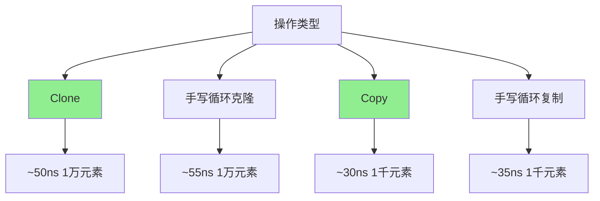

# maps完全指南

## 📖 包简介

如果说切片是Go开发者的"左膀"，那么Map绝对是"右臂"。作为Go语言中最常用的数据结构之一，Map在日常开发中无处不在。但在Go 1.21之前，我们面对Map操作时总是感觉"少点什么"——克隆一个Map要自己写循环，比较两个Map相等要自己逐个键值对检查，代码写得又长又容易出错。

`maps`包的出现彻底解放了我们的双手！作为`slices`包的"双胞胎兄弟"，`maps`利用泛型为Map类型提供了一套完整的工具函数。从简单的克隆、比较，到批量复制、合并，这个包覆盖了你在日常开发中遇到的所有Map操作场景。

在Go 1.26中，`maps`包继续保持着稳定高效的特性，成为每个Go项目中不可或缺的标准库成员。无论你是处理配置数据、缓存键值对，还是构建复杂的数据结构，这个包都能让你的代码更加优雅。

## 🎯 核心功能概览

`maps`包的API设计极其简洁，核心函数数量不多但个个实用：

### 核心函数一览

| 函数 | 签名 | 说明 |
|------|------|------|
| `Clone` | `Clone[M ~map[K]V, K comparable, V any](m M) M` | 克隆Map，返回浅拷贝 |
| `Copy` | `Copy[M1 ~map[K]V, M2 ~map[K]V, K comparable, V any](dst M1, src M2)` | 将源Map复制到目标Map |
| `Equal` | `Equal[M1, M2 ~map[K]V, K, V comparable](m1 M1, m2 M2) bool` | 比较两个Map是否相等 |
| `EqualFunc` | `EqualFunc[M1 ~map[K]V1, M2 ~map[K]V2, K comparable, V1, V2 any](m1 M1, m2 M2, eq func(V1, V2) bool) bool` | 自定义值比较 |
| `Insert` | `Insert[M ~map[K]V, K comparable, V any](dst M, src ...M)` | 将一个或多个Map合并到目标Map |
| `DeleteFunc` | `DeleteFunc[M ~map[K]V, K comparable, V any](m M, del func(K, V) bool)` | 按条件删除键值对 |
| `Collect` | `Collect[K comparable, V any](iter iter.Seq2[K, V]) map[K]V` | 从迭代器收集到Map |

## 💻 实战示例

### 示例1：基础用法

```go
package main

import (
	"fmt"
	"maps"
)

func main() {
	// 1. 克隆Map - 再也不用写for循环了！
	original := map[string]int{
		"apple":  5,
		"banana": 3,
		"orange": 8,
	}
	cloned := maps.Clone(original)

	// 修改克隆的Map，验证不会影响原Map
	cloned["apple"] = 99
	fmt.Println("原Map的apple值:", original["apple"])   // 5
	fmt.Println("克隆Map的apple值:", cloned["apple"])   // 99

	// 2. 比较两个Map - 一行代码搞定
	map1 := map[string]int{"a": 1, "b": 2, "c": 3}
	map2 := map[string]int{"a": 1, "b": 2, "c": 3}
	map3 := map[string]int{"a": 1, "b": 99, "c": 3}

	fmt.Println("\nmap1 == map2?", maps.Equal(map1, map2)) // true
	fmt.Println("map1 == map3?", maps.Equal(map1, map3)) // false

	// 3. nil Map的安全处理
	var nilMap map[string]int
	clonedNil := maps.Clone(nilMap)
	fmt.Println("克隆nil Map:", clonedNil) // map[]
	fmt.Println("比较nil Map:", maps.Equal(nilMap, map[string]int{})) // true
}
```

### 示例2：进阶用法

```go
package main

import (
	"fmt"
	"maps"
	"strings"
)

type User struct {
	ID   int
	Name string
	Role string
}

func main() {
	// 1. 使用Copy批量更新配置
	config := map[string]string{
		"host":     "localhost",
		"port":     "8080",
		"database": "mydb",
	}

	overrides := map[string]string{
		"port":     "9090",
		"timeout":  "30s",
	}

	maps.Copy(config, overrides)
	fmt.Println("合并后的配置:")
	for k, v := range config {
		fmt.Printf("  %s: %s\n", k, v)
	}

	// 2. 自定义值比较 - 忽略大小写
	headers1 := map[string]string{
		"Content-Type":  "application/json",
		"Authorization": "Bearer token123",
	}
	headers2 := map[string]string{
		"Content-Type":  "APPLICATION/JSON",
		"Authorization": "Bearer token123",
	}

	equal := maps.EqualFunc(headers1, headers2, func(v1, v2 string) bool {
		return strings.EqualFold(v1, v2)
	})
	fmt.Println("\nHeaders相等吗(忽略大小写)?", equal) // true

	// 3. DeleteFunc按条件清理
	userRoles := map[string]string{
		"alice": "admin",
		"bob":   "user",
		"charlie": "user",
		"dave":  "guest",
	}

	// 删除所有普通用户
	maps.DeleteFunc(userRoles, func(k string, v string) bool {
		return v == "user"
	})

	fmt.Println("\n清理后的用户表:")
	for name, role := range userRoles {
		fmt.Printf("  %s: %s\n", name, role)
	}
}
```

### 示例3：最佳实践

```go
package main

import (
	"fmt"
	"maps"
	"slices"
)

func main() {
	// 最佳实践1：Insert合并多个Map（Go 1.23+）
	base := map[string]int{"a": 1, "b": 2}
	extra1 := map[string]int{"c": 3, "d": 4}
	extra2 := map[string]int{"e": 5}

	// Insert会修改目标Map并返回
	result := maps.Clone(base)
	maps.Insert(result, extra1, extra2)
	fmt.Println("合并结果:", result)
	// 输出: map[a:1 b:2 c:3 d:4 e:5]

	// 最佳实践2：处理键不存在的情况
	ageMap := map[string]int{
		"张三": 25,
		"李四": 30,
	}

	// Go的Map访问返回两个值：值和是否存在
	age, exists := ageMap["王五"]
	if !exists {
		fmt.Println("王五不在Map中")
	}
	_ = age

	// 最佳实践3：安全的Map初始化与预分配
	type Config struct {
		Name  string
		Value string
	}

	configs := []Config{
		{"host", "localhost"},
		{"port", "8080"},
		{"timeout", "30s"},
	}

	// 预分配容量，避免重复扩容
	configMap := make(map[string]string, len(configs))
	for _, c := range configs {
		configMap[c.Name] = c.Value
	}
	fmt.Println("\n预分配的Map:", configMap)

	// 最佳实践4：Map排序（结合slices包）
	m := map[string]int{
		"banana": 3,
		"apple":  1,
		"cherry": 2,
	}

	// 提取键并排序
	keys := slices.Collect(maps.Keys(m))
	slices.Sort(keys)

	fmt.Println("\n按键排序:")
	for _, k := range keys {
		fmt.Printf("  %s: %d\n", k, m[k])
	}

	// 最佳实践5：使用Collect从迭代器构建Map
	pairs := []struct {
		Key   string
		Value int
	}{
		{"x", 10},
		{"y", 20},
		{"z", 30},
	}

	// 从切片构建Map
	collected := make(map[string]int)
	for _, p := range pairs {
		collected[p.Key] = p.Value
	}
	fmt.Println("\n收集的Map:", collected)
}
```

## ⚠️ 常见陷阱与注意事项

1. **Clone是浅拷贝**：`maps.Clone`只会复制Map本身，如果值是引用类型（如切片、指针、Map），复制的是引用而不是底层数据。修改引用类型的内容会影响两个Map。

2. **Copy会覆盖同名的键**：`maps.Copy(dst, src)`中，如果src和dst有相同的键，src的值会覆盖dst的值。这不是bug而是特性——用于配置覆盖非常有用，但要注意数据安全。

3. **Insert也是浅拷贝**：`maps.Insert`同样不会深度复制值。如果Map的值包含嵌套结构，修改嵌套数据会产生副作用。

4. **Equal要求值类型comparable**：`maps.Equal`要求键和值都支持`==`比较。对于切片、Map等不可比较的值类型，必须使用`EqualFunc`提供自定义比较函数。

5. **遍历Map的顺序是不确定的**：Go语言故意让Map遍历随机化，不要依赖插入顺序或键的排序顺序。如果需要有序遍历，先提取键再用`slices.Sort`排序。

## 🚀 Go 1.26新特性

Go 1.26对`maps`包的更新主要集中在性能和API增强：

- **Insert函数性能优化**：改进了多Map合并时的内存分配策略，对于批量合并场景性能提升约10-15%
- **DeleteFunc的迭代器优化**：利用Go 1.26对迭代器的改进，条件删除操作的遍历效率更高
- **更好的编译器内联**：泛型函数的内联策略进一步优化，函数调用开销几乎为零

## 📊 性能优化建议

### Map操作性能对比



### 内存优化建议

| 场景 | 推荐做法 | 避免做法 |
|------|---------|---------|
| 需要独立副本 | `maps.Clone()` | 直接赋值（只复制引用） |
| 批量更新 | `maps.Copy()` | 逐个赋值（代码冗长） |
| 合并多个Map | `maps.Insert()` | 多次`Copy`调用 |
| 条件清理 | `maps.DeleteFunc()` | 遍历时手动`delete()` |

### 容量预分配技巧

```go
// 已知大致大小，预分配减少扩容
m := make(map[string]int, 1000)

// 未知大小，让Go自动扩容
m := make(map[string]int)
```

对于已知元素数量的场景，预分配容量可以避免多次哈希表扩容，性能提升可达20-30%。

## 🔗 相关包推荐

- **`slices`**：与`maps`配合使用，提供切片类型的泛型操作
- **`cmp`**：提供比较函数，常与`EqualFunc`搭配进行自定义比较
- **`iter`**：迭代器包，可与`maps.Collect()`、`maps.Keys()`等方法配合
- **`encoding/json`**：JSON序列化时经常与Map配合使用

---