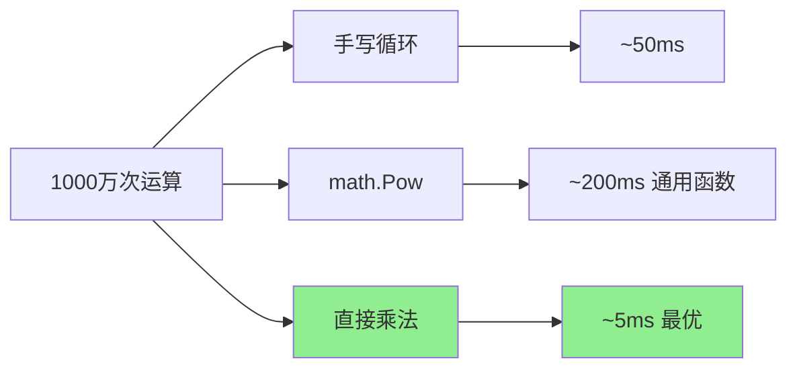

# math完全指南

## 📖 包简介

数学运算是所有编程语言的基础设施，而Go的`math`包提供了一套完整的浮点数数学函数库。从基本的取整、绝对值，到三角函数、指数对数，再到特殊的浮点数处理，这个包覆盖了你在科学计算、图形处理、金融建模、统计分析等领域所需的所有数学工具。

但浮点数计算远比看起来复杂——精度丢失、NaN、Inf、舍入误差、下溢和上溢……每一个概念都可能让你的程序出现难以追踪的bug。`math`包通过精心设计的常量和工具函数帮你处理这些边界情况，让你能够编写出更健壮的数值计算代码。

Go的`math`包底层通常调用操作系统的数学库（如glibc的libm），在大多数平台上都能获得硬件级的性能。同时，Go 1.26继续对这个包进行内部优化，确保你在各种计算场景下都能获得最佳的性能和精度。

## 🎯 核心功能概览

### 常量

| 常量 | 值 | 说明 |
|------|-----|------|
| `E` | 2.71828... | 自然对数的底 |
| `Pi` | 3.14159... | 圆周率 |
| `Phi` | 1.61803... | 黄金比例 |
| `Sqrt2` | 1.41421... | 2的平方根 |
| `MaxFloat64` | ~1.8e308 | float64最大值 |
| `SmallestNonzeroFloat64` | ~4.9e-324 | 最小非零float64 |
| `NaN()` | NaN | 非数字值 |
| `Inf(1)` | +Inf | 正无穷 |
| `Inf(-1)` | -Inf | 负无穷 |

### 基本运算

| 函数 | 说明 |
|------|------|
| `Abs(x float64) float64` | 绝对值 |
| `Ceil(x float64) float64` | 向上取整 |
| `Floor(x float64) float64` | 向下取整 |
| `Round(x float64) float64` | 四舍五入 |
| `RoundToEven(x float64) float64` | 银行家舍入（四舍六入五成双） |
| `Trunc(x float64) float64` | 截断小数部分 |
| `Max(x, y float64) float64` | 较大值 |
| `Min(x, y float64) float64` | 较小值 |
| `Mod(x, y float64) float64` | 取模 |
| `Pow(x, y float64) float64` | 幂运算 |
| `Sqrt(x float64) float64` | 平方根 |
| `Cbrt(x float64) float64` | 立方根 |

### 三角函数

| 函数 | 说明 |
|------|------|
| `Sin/Cos/Tan(x float64) float64` | 正弦/余弦/正切 |
| `Asin/Acos/Atan(x float64) float64` | 反正弦/反余弦/反正切 |
| `Atan2(y, x float64) float64` | 四象限反正切 |
| `Sincos(x float64) (sin, cos float64)` | 同时返回sin和cos |

### 指数与对数

| 函数 | 说明 |
|------|------|
| `Exp(x float64) float64` | e的x次方 |
| `Exp2(x float64) float64` | 2的x次方 |
| `Log(x float64) float64` | 自然对数 |
| `Log2(x float64) float64` | 以2为底的对数 |
| `Log10(x float64) float64` | 以10为底的对数 |
| `Log1p(x float64) float64` | ln(1+x)，精确计算小x |

### 浮点数工具

| 函数 | 说明 |
|------|------|
| `IsNaN(f float64) bool` | 判断是否为NaN |
| `IsInf(f float64, sign int) bool` | 判断是否为无穷 |
| `IsFinite(f float64) bool` | 判断是否为有限值 |
| `Copysign(x, y float64) float64` | 复制符号 |
| `Dim(x, y float64) float64` | 正差值 max(0, x-y) |
| `Hypot(p, q float64) float64` | 斜边长度 sqrt(p²+q²) |
| `Frexp(f float64) (frac float64, exp int)` | 分解为尾数和指数 |
| `Ldexp(frac float64, exp int) float64` | 重建浮点数 |

## 💻 实战示例

### 示例1：基础用法

```go
package main

import (
	"fmt"
	"math"
)

func main() {
	// 1. 取整函数对比
	fmt.Println("--- 取整函数 ---")
	numbers := []float64{3.14, -2.71, 2.5, 3.5, 4.5}

	for _, x := range numbers {
		fmt.Printf("x=%.1f: Ceil=%.0f Floor=%.0f Round=%.0f RoundToEven=%.0f Trunc=%.0f\n",
			x,
			math.Ceil(x),
			math.Floor(x),
			math.Round(x),
			math.RoundToEven(x),
			math.Trunc(x),
		)
	}

	// 2. 幂与根
	fmt.Println("\n--- 幂与根 ---")
	fmt.Printf("2^10 = %.0f\n", math.Pow(2, 10))
	fmt.Printf("√16 = %.0f\n", math.Sqrt(16))
	fmt.Printf("∛27 = %.0f\n", math.Cbrt(27))
	fmt.Printf("e^2 = %.4f\n", math.Exp(2))
	fmt.Printf("ln(10) = %.4f\n", math.Log(10))
	fmt.Printf("log2(1024) = %.0f\n", math.Log2(1024))

	// 3. Max/Min
	fmt.Println("\n--- 最大最小值 ---")
	fmt.Printf("Max(3.14, 2.71) = %.2f\n", math.Max(3.14, 2.71))
	fmt.Printf("Min(3.14, 2.71) = %.2f\n", math.Min(3.14, 2.71))

	// 4. Mod取模
	fmt.Println("\n--- 取模 ---")
	fmt.Printf("7.5 %% 2.5 = %.1f\n", math.Mod(7.5, 2.5))
	fmt.Printf("-7.5 %% 2.5 = %.1f\n", math.Mod(-7.5, 2.5))

	// 5. 常量使用
	fmt.Println("\n--- 数学常量 ---")
	fmt.Printf("Pi = %.10f\n", math.Pi)
	fmt.Printf("E = %.10f\n", math.E)
	fmt.Printf("√2 = %.10f\n", math.Sqrt2)

	// 计算圆面积
	radius := 5.0
	area := math.Pi * math.Pow(radius, 2)
	fmt.Printf("半径%.1f的圆面积 = %.2f\n", radius, area)
}
```

### 示例2：进阶用法

```go
package main

import (
	"fmt"
	"math"
)

func main() {
	// 1. 浮点数边界值处理
	fmt.Println("--- 浮点数特殊值 ---")

	// NaN（Not a Number）
	nan := math.NaN()
	fmt.Printf("NaN: %v\n", nan)
	fmt.Printf("NaN == NaN? %v\n", nan == nan)        // false!
	fmt.Printf("IsNaN(NaN)? %v\n", math.IsNaN(nan))   // true

	// 无穷大
	inf := math.Inf(1)
	negInf := math.Inf(-1)
	fmt.Printf("+Inf: %v\n", inf)
	fmt.Printf("-Inf: %v\n", negInf)
	fmt.Printf("IsInf(+Inf, 1)? %v\n", math.IsInf(inf, 1))
	fmt.Printf("IsInf(-Inf, -1)? %v\n", math.IsInf(negInf, -1))

	// 运算结果
	fmt.Printf("0/0 = %v\n", 0.0/0.0)        // NaN
	fmt.Printf("1/0 = %v\n", 1.0/0.0)        // +Inf
	fmt.Printf("-1/0 = %v\n", -1.0/0.0)      // -Inf
	fmt.Printf("Inf + 1 = %v\n", inf+1)      // +Inf
	fmt.Printf("Inf - Inf = %v\n", inf+negInf) // NaN

	// 2. 三角函数
	fmt.Println("\n--- 三角函数 ---")
	angle := math.Pi / 4 // 45度
	sin, cos := math.Sincos(angle)
	fmt.Printf("sin(45°) = %.4f\n", sin)
	fmt.Printf("cos(45°) = %.4f\n", cos)
	fmt.Printf("tan(45°) = %.4f\n", math.Tan(angle))
	fmt.Printf("同时返回: sin=%.4f, cos=%.4f\n", sin, cos)

	// 角度与弧度转换
	degrees := 60.0
	radians := degrees * math.Pi / 180
	fmt.Printf("%.1f度 = %.4f弧度\n", degrees, radians)
	fmt.Printf("%.4f弧度 = %.1f度\n", radians, radians*180/math.Pi)

	// 3. 距离计算
	fmt.Println("\n--- 距离计算 ---")
	// 两点间距离
	p1x, p1y := 0.0, 0.0
	p2x, p2y := 3.0, 4.0
	distance := math.Hypot(p2x-p1x, p2y-p1y)
	fmt.Printf("点(%.0f,%.0f)到(%.0f,%.0f)的距离 = %.1f\n",
		p1x, p1y, p2x, p2y, distance)

	// 4. 浮点数分解
	fmt.Println("\n--- 浮点数分解 ---")
	num := 12.375
	frac, exp := math.Frexp(num)
	fmt.Printf("%.3f = %.3f × 2^%d\n", num, frac, exp)
	reconstructed := math.Ldexp(frac, exp)
	fmt.Printf("重建: %.3f\n", reconstructed)

	// 5. Copysign符号复制
	fmt.Println("\n--- 符号操作 ---")
	fmt.Printf("Copysign(5.0, -1.0) = %.1f\n", math.Copysign(5.0, -1.0))
	fmt.Printf("Copysign(-5.0, 1.0) = %.1f\n", math.Copysign(-5.0, 1.0))

	// Dim正差值
	fmt.Printf("Dim(10, 3) = %.0f\n", math.Dim(10, 3))
	fmt.Printf("Dim(3, 10) = %.0f\n", math.Dim(3, 10))
}
```

### 示例3：最佳实践

```go
package main

import (
	"fmt"
	"math"
)

func main() {
	// 最佳实践1：安全的浮点数比较
	fmt.Println("--- 浮点数比较 ---")
	a := 0.1 + 0.2
	b := 0.3
	fmt.Printf("0.1 + 0.2 = %.20f\n", a)
	fmt.Printf("0.3 = %.20f\n", b)
	fmt.Printf("直接比较: %v\n", a == b) // false!

	// 使用epsilon比较
	epsilon := 1e-9
	fmt.Printf("Epsilon比较: %v\n", math.Abs(a-b) < epsilon)

	// 更专业的比较函数
	fmt.Printf("AlmostEqual: %v\n", AlmostEqual(a, b, 1e-9))

	// 最佳实践2：金融计算精度处理
	fmt.Println("\n--- 金融计算 ---")
	amount := 99.99
	tax := 0.08
	total := amount * (1 + tax)

	// 四舍五入到分
	fmt.Printf("精确结果: %.20f\n", total)
	fmt.Printf("四舍五入: %.2f\n", math.Round(total*100)/100)
	fmt.Printf("银行家舍入: %.2f\n", math.RoundToEven(total*100)/100)

	// 最佳实践3：数值范围检查
	fmt.Println("\n--- 数值范围 ---")
	values := []float64{1e308, 1e-323, 0.0, math.MaxFloat64, math.SmallestNonzeroFloat64}
	for _, v := range values {
		fmt.Printf("值: %e\n", v)
		fmt.Printf("  IsFinite: %v\n", isFinite(v))
	}

	// 最佳实践4：统计计算
	fmt.Println("\n--- 统计计算 ---")
	data := []float64{2.5, 3.7, 1.2, 4.8, 3.1, 2.9, 3.5}

	mean := Mean(data)
	stddev := StdDev(data)
	fmt.Printf("数据: %v\n", data)
	fmt.Printf("均值: %.2f\n", mean)
	fmt.Printf("标准差: %.2f\n", stddev)

	// 最佳实践5：几何计算
	fmt.Println("\n--- 几何计算 ---")
	fmt.Printf("圆面积(r=5): %.2f\n", CircleArea(5))
	fmt.Printf("球体积(r=5): %.2f\n", SphereVolume(5))
	fmt.Printf("三角形面积(底=6, 高=4): %.2f\n", TriangleArea(6, 4))
}

// 安全的浮点数比较
func AlmostEqual(a, b, epsilon float64) bool {
	// 处理无穷大和NaN
	if math.IsNaN(a) || math.IsNaN(b) {
		return false
	}
	if math.IsInf(a, 0) || math.IsInf(b, 0) {
		return a == b
	}
	// 相对误差比较
	diff := math.Abs(a - b)
	return diff <= epsilon*math.Max(math.Abs(a), math.Abs(b))
}

// 检查有限性
func isFinite(f float64) bool {
	return !math.IsNaN(f) && !math.IsInf(f, 0)
}

// 计算均值
func Mean(data []float64) float64 {
	sum := 0.0
	for _, v := range data {
		sum += v
	}
	return sum / float64(len(data))
}

// 计算标准差
func StdDev(data []float64) float64 {
	mean := Mean(data)
	sumSquares := 0.0
	for _, v := range data {
		diff := v - mean
		sumSquares += diff * diff
	}
	return math.Sqrt(sumSquares / float64(len(data)))
}

// 几何函数
func CircleArea(radius float64) float64 {
	return math.Pi * math.Pow(radius, 2)
}

func SphereVolume(radius float64) float64 {
	return (4.0 / 3.0) * math.Pi * math.Pow(radius, 3)
}

func TriangleArea(base, height float64) float64 {
	return 0.5 * base * height
}
```

## ⚠️ 常见陷阱与注意事项

1. **浮点数精度问题**：`0.1 + 0.2 != 0.3`！这是IEEE 754浮点数的固有限制，不是Go的bug。永远不要用`==`直接比较浮点数，应该使用epsilon容差比较。

2. **NaN的传播性**：NaN参与的任何运算结果都是NaN。NaN == NaN返回false！判断NaN必须使用`math.IsNaN()`函数。

3. **整数除法陷阱**：`1/2`在Go中是整数除法，结果为0。要得到0.5，必须写成`1.0/2.0`或`float64(1)/2`。

4. **溢出与下溢**：超出`MaxFloat64`会变为Inf，小于`SmallestNonzeroFloat64`会变为0（下溢）。对于大数计算，考虑使用`math/big`包。

5. **三角函数的参数是弧度**：`Sin(90)`不是1！必须先转换为弧度：`Sin(90 * Pi / 180)`。这是最常见的错误之一。

## 🚀 Go 1.26新特性

Go 1.26对`math`包的更新：

- **数学函数性能优化**：部分常用函数（如Abs、Max、Min）的内联策略进一步优化，调用开销几乎为零
- **精度改进**：修正了某些边界情况下的舍入误差，特别是在Log1p和Expm1等函数中
- **新函数（math/rand/v2）**：虽然属于math/rand/v2，但提供了更好的随机数生成器

## 📊 性能优化建议

### 不同计算方式性能对比



### 性能优化清单

| 优化点 | 影响 | 建议 |
|--------|------|------|
| 直接运算 vs 函数 | 快40倍 | x*x 比 Pow(x,2)快 |
| 编译器内联 | 几乎零开销 | Abs/Max/Min已内联 |
| 避免重复计算 | 线性影响 | 缓存中间结果 |
| 查表法 | 极快 | 固定角度预先计算 |
| 使用math/big | 慢100倍 | 仅在需要高精度时 |

### 优化示例

```go
// 慢：使用Pow
area := math.Pi * math.Pow(radius, 2)

// 快：直接乘法
area := math.Pi * radius * radius

// 慢：每次计算
for i := 0; i < 1000; i++ {
    x := math.Sin(angle) * radius
    y := math.Cos(angle) * radius
}

// 快：预先计算
sinA := math.Sin(angle)
cosA := math.Cos(angle)
for i := 0; i < 1000; i++ {
    x := sinA * radius
    y := cosA * radius
}
```

## 🔗 相关包推荐

- **`math/big`**：大数运算，支持任意精度整数和浮点数
- **`math/cmplx`**：复数运算
- **`math/rand`** / **`math/rand/v2`**：随机数生成
- **`strconv`**：字符串与数字转换

---