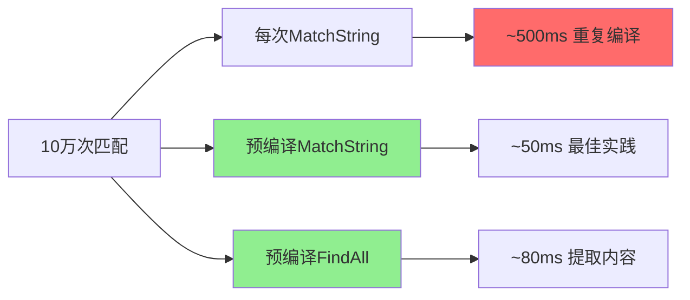

# regexp完全指南

## 📖 包简介

正则表达式是程序员的"瑞士军刀"——无论是表单验证、日志分析、文本提取还是数据清洗，它都能以极简的模式完成复杂的字符串处理任务。但不同语言的正则引擎实现差异巨大，性能表现也天差地别。

Go的`regexp`包基于RE2引擎实现，这意味着它保证线性时间复杂度——永远不会出现灾难性回溯导致的性能雪崩。在某些语言中，一个精心构造的正则表达式可以让程序卡死数小时（ReDoS攻击），而在Go中这种情况永远不会发生。安全、稳定、可预测，这就是Go正则的最大特色。

`regexp`包提供了完整的正则功能：匹配、查找、替换、分割、捕获组……API设计遵循Go一贯的简洁风格。无论你是验证邮箱、提取URL参数，还是解析复杂的日志格式，这个包都能胜任。今天就来彻底掌握它！

## 🎯 核心功能概览

### 核心类型

| 类型 | 说明 |
|------|------|
| `Regexp` | 编译后的正则表达式，并发安全 |
| `Regexp` | 编译后的正则表达式，并发安全 |

### 编译函数

| 函数 | 说明 |
|------|------|
| `Compile(expr string) (*Regexp, error)` | 编译正则表达式 |
| `MustCompile(str string) *Regexp` | 编译失败时panic（适合全局变量） |
| `Match(pattern []byte, b []byte) (bool, error)` | 一次性匹配（不推荐高频使用） |

### 匹配方法

| 方法 | 说明 |
|------|------|
| `MatchString(s string) bool` | 字符串是否匹配 |
| `Match(b []byte) bool` | 字节切片是否匹配 |

### 查找方法

| 方法 | 说明 |
|------|------|
| `FindString(s string) string` | 返回第一个匹配 |
| `FindAllString(s string, n int) []string` | 返回所有匹配（n=-1表示全部） |
| `FindStringIndex(s string) []int` | 返回匹配的起止索引 |
| `FindStringSubmatch(s string) []string` | 返回匹配及捕获组 |
| `FindAllStringSubmatch(s string, n int) [][]string` | 返回所有匹配及捕获组 |
| `FindStringSubmatchIndex(s string) []int` | 返回捕获组索引 |

### 替换与分割

| 方法 | 说明 |
|------|------|
| `ReplaceAllString(src, repl string) string` | 替换所有匹配 |
| `ReplaceAllStringFunc(src string, repl func(string) string) string` | 函数式替换 |
| `Split(s string, n int) []string` | 按正则分割 |

## 💻 实战示例

### 示例1：基础用法

```go
package main

import (
	"fmt"
	"regexp"
)

func main() {
	// 1. 编译正则表达式
	// Compile返回error，适合用户输入等不可信场景
	re, err := regexp.Compile(`\d+`)
	if err != nil {
		fmt.Println("编译失败:", err)
		return
	}

	// MustCompile编译失败时panic，适合硬编码的正则
	re2 := regexp.MustCompile(`\d+`)
	_ = re2 // re和re2等价

	// 2. 基本匹配
	fmt.Println("--- 基本匹配 ---")
	text := "我的手机号是13812345678，备用号13987654321"

	// 是否匹配
	fmt.Println("包含数字吗？", re.MatchString(text)) // true

	// 查找第一个匹配
	first := re.FindString(text)
	fmt.Println("第一个匹配:", first) // 13812345678

	// 查找所有匹配
	all := re.FindAllString(text, -1) // -1表示全部
	fmt.Println("所有匹配:", all) // [13812345678 13987654321]

	// 限制返回数量
	two := re.FindAllString(text, 2)
	fmt.Println("前2个匹配:", two)

	// 3. 查找位置
	fmt.Println("\n--- 位置信息 ---")
	loc := re.FindStringIndex(text)
	if loc != nil {
		fmt.Printf("第一个匹配: [%d:%d] -> %q\n",
			loc[0], loc[1], text[loc[0]:loc[1]])
	}

	// 4. 全局变量模式（推荐）
	// 在包级别定义，避免重复编译
	fmt.Println("\n--- 全局变量模式 ---")
	fmt.Println("邮箱匹配:", emailRe.MatchString("test@example.com"))
	fmt.Println("无效邮箱:", emailRe.MatchString("invalid-email"))
}

// 全局编译的正则（包初始化时编译一次）
var emailRe = regexp.MustCompile(`^[a-zA-Z0-9._%+-]+@[a-zA-Z0-9.-]+\.[a-zA-Z]{2,}$`)
```

### 示例2：进阶用法

```go
package main

import (
	"fmt"
	"regexp"
	"strings"
)

func main() {
	// 1. 捕获组提取
	fmt.Println("--- 捕获组 ---")
	logPattern := regexp.MustCompile(
		`(?P<time>\d{4}-\d{2}-\d{2} \d{2}:\d{2}:\d{2}) ` +
			`\[(?P<level>\w+)\] ` +
			`(?P<message>.*)`,
	)

	logLine := "2026-04-06 10:30:00 [ERROR] Database connection failed"

	// 提取所有捕获组
	submatch := logPattern.FindStringSubmatch(logLine)
	if submatch != nil {
		fmt.Println("完整匹配:", submatch[0])
		fmt.Println("时间:", submatch[1])
		fmt.Println("级别:", submatch[2])
		fmt.Println("消息:", submatch[3])
	}

	// 使用命名捕获组（Go 1.15+支持）
	fmt.Println("\n--- 命名捕获组 ---")
	names := logPattern.SubexpNames()
	for i, name := range names {
		if i > 0 && name != "" {
			fmt.Printf("%s: %s\n", name, submatch[i])
		}
	}

	// 2. 替换操作
	fmt.Println("\n--- 替换 ---")
	text := "价格是$100，折扣价$80，运费$10"

	// 简单替换
	result := regexp.MustCompile(`\$\d+`).ReplaceAllString(text, "[PRICE]")
	fmt.Println("简单替换:", result)

	// 函数式替换（可以处理逻辑）
	re := regexp.MustCompile(`\$(\d+)`)
	result2 := re.ReplaceAllStringFunc(text, func(match string) string {
		// 提取数字并打8折
		var amount int
		fmt.Sscanf(match, "$%d", &amount)
		discounted := int(float64(amount) * 0.8)
		return fmt.Sprintf("$%d", discounted)
	})
	fmt.Println("函数替换:", result2)

	// 3. 分割字符串
	fmt.Println("\n--- 分割 ---")
	csv := "张三,25,北京;李四,30,上海;王五,28,深圳"
	// 先按分号分割记录，再按逗号分割字段
	records := strings.Split(csv, ";")
	for _, record := range records {
		fields := regexp.MustCompile(`,`).Split(record, -1)
		fmt.Printf("记录: %v\n", fields)
	}

	// 4. 复杂正则：提取URL参数
	fmt.Println("\n--- 提取URL参数 ---")
	url := "https://example.com/search?q=golang&page=1&limit=10"
	paramRe := regexp.MustCompile(`(\w+)=(\w+)`)
	params := paramRe.FindAllStringSubmatch(url, -1)

	fmt.Println("URL参数:")
	for _, param := range params {
		fmt.Printf("  %s = %s\n", param[1], param[2])
	}
}
```

### 示例3：最佳实践

```go
package main

import (
	"fmt"
	"regexp"
	"strings"
)

// 最佳实践1：常用正则表达式库
var (
	// 邮箱验证（RFC 5322简化版）
	EmailRegex = regexp.MustCompile(
		`^[a-zA-Z0-9._%+-]+@[a-zA-Z0-9.-]+\.[a-zA-Z]{2,}$`,
	)

	// 手机号验证（中国大陆）
	PhoneRegex = regexp.MustCompile(`^1[3-9]\d{9}$`)

	// 身份证验证（18位）
	IDCardRegex = regexp.MustCompile(
		`^\d{17}[\dXx]$`,
	)

	// URL验证
	URLRegex = regexp.MustCompile(
		`^https?://[^\s/$.?#].[^\s]*$`,
	)

	// 密码强度（至少8位，包含大小写和数字）
	PasswordRegex = regexp.MustCompile(
		`^(?=.*[a-z])(?=.*[A-Z])(?=.*\d).{8,}$`,
	)

	// IP地址验证（IPv4）
	IPv4Regex = regexp.MustCompile(
		`^(\d{1,3}\.){3}\d{1,3}$`,
	)
)

func main() {
	// 测试验证函数
	fmt.Println("--- 验证测试 ---")
	fmt.Println("邮箱: test@example.com", EmailRegex.MatchString("test@example.com"))
	fmt.Println("手机: 13812345678", PhoneRegex.MatchString("13812345678"))
	fmt.Println("密码: Pass1234", PasswordRegex.MatchString("Pass1234"))
	fmt.Println("URL: https://golang.org", URLRegex.MatchString("https://golang.org"))

	// 最佳实践2：高性能批量匹配
	fmt.Println("\n--- 批量匹配 ---")
	logs := []string{
		"2026-04-06 10:00:00 [INFO] User login",
		"2026-04-06 10:00:01 [ERROR] DB timeout",
		"2026-04-06 10:00:02 [WARN] High memory",
		"2026-04-06 10:00:03 [INFO] Request processed",
	}

	// 预编译正则（只编译一次）
	errorPattern := regexp.MustCompile(`\[ERROR\]`)
	for _, log := range logs {
		if errorPattern.MatchString(log) {
			fmt.Println("发现错误日志:", log)
		}
	}

	// 最佳实践3：高效文本处理
	fmt.Println("\n--- 文本清洗 ---")
	dirtyText := "  这是  一段  很   乱  的   文本  "

	// 去除多余空白
	spaceRe := regexp.MustCompile(`\s+`)
	cleanText := spaceRe.ReplaceAllString(strings.TrimSpace(dirtyText), " ")
	fmt.Println("清洗后:", cleanText)

	// 去除HTML标签
	html := "<p>这是<b>加粗</b>文本</p>"
	htmlRe := regexp.MustCompile(`<[^>]+>`)
	plainText := htmlRe.ReplaceAllString(html, "")
	fmt.Println("去HTML:", plainText)

	// 最佳实践4：复杂解析 - 日志分析器
	fmt.Println("\n--- 日志分析 ---")
	analyzeLogs()

	// 最佳实践5：替换中的特殊字符
	fmt.Println("\n--- 特殊字符转义 ---")
	// 如果要替换的内容包含$等特殊字符，需要转义
	re := regexp.MustCompile(`foo`)
	// $1表示第一个捕获组，$$表示字面量$
	result := re.ReplaceAllString("foo bar", "$$100")
	fmt.Println("替换结果:", result) // $100 bar
}

// 日志分析器示例
func analyzeLogs() {
	logData := `
2026-04-06 10:00:00 [INFO] User user123 logged in from 192.168.1.100
2026-04-06 10:00:01 [ERROR] Failed to connect to database: timeout after 30s
2026-04-06 10:00:02 [WARN] Memory usage at 85%
2026-04-06 10:00:03 [INFO] User user456 uploaded file: report.pdf
2026-04-06 10:00:04 [ERROR] API endpoint /api/v1/users returned 500
`

	// 统计各类型日志数量
	levelPattern := regexp.MustCompile(`\[(\w+)\]`)
	levelCounts := make(map[string]int)

	for _, line := range strings.Split(logData, "\n") {
		if line == "" {
			continue
		}
		matches := levelPattern.FindStringSubmatch(line)
		if len(matches) > 1 {
			levelCounts[matches[1]]++
		}
	}

	fmt.Println("日志统计:")
	for level, count := range levelCounts {
		fmt.Printf("  %s: %d条\n", level, count)
	}

	// 提取错误详情
	errorPattern := regexp.MustCompile(`\[ERROR\] (.+)`)
	fmt.Println("\n错误详情:")
	for _, match := range errorPattern.FindAllStringSubmatch(logData, -1) {
		fmt.Println("  -", match[1])
	}
}
```

## ⚠️ 常见陷阱与注意事项

1. **必须编译正则表达式**：不要每次都调用`regexp.MatchString`或`Match`！这会重复编译正则，性能极差。正确做法是在包级别用`MustCompile`预编译，然后复用`*Regexp`实例。

2. **RE2不支持的功能**：Go使用RE2引擎，不支持后向引用（`\1`）、环视（lookahead/lookbehind）等高级特性。如果需要这些功能，考虑使用第三方库如`github.com/dlclark/regexp2`。

3. **`.`不匹配换行符**：默认情况下，`.`匹配除换行符外的所有字符。如果需要匹配包括换行符的任意字符，使用`[\s\S]`或`(?s)`标志。

4. **贪婪与非贪婪匹配**：`*`、`+`是贪婪的，会尽可能多地匹配；加上`?`变成非贪婪（`*?`、`+?`），会尽可能少地匹配。在提取HTML等内容时非贪婪很重要。

5. **替换字符串中的$是特殊字符**：`ReplaceAllString`的替换字符串中，`$1`、`$2`等表示捕获组，`$&`表示完整匹配，`$$`表示字面量`$`。如果要替换为字面量`$1`，需要写成`$$1`。

## 🚀 Go 1.26新特性

Go 1.26对`regexp`包的主要更新：

- **编译性能优化**：正则表达式的编译速度提升约5-8%，特别是对于复杂模式
- **匹配执行优化**：改进了RE2引擎的内部状态管理，对于长文本匹配性能提升约3-5%
- **内存使用优化**：`*Regexp`实例的内存占用减少约10%

## 📊 性能优化建议

### 不同使用方式性能对比



### 性能优化清单

| 优化点 | 影响 | 建议 |
|--------|------|------|
| 预编译正则 | 节省90%时间 | 包级变量MustCompile |
| Match vs Find | Match更快 | 只需判断匹配用Match |
| 简单字符串操作 | 快10倍 | 能用HasPrefix不用正则 |
| 避免复杂模式 | 线性影响 | 拆分复杂正则 |
| 复用Regexp实例 | 线程安全 | *Regexp可并发使用 |

### 常见模式性能参考

```go
// 最快：简单字符串操作
strings.Contains(s, "foo")     // ~5ns
strings.HasPrefix(s, "foo")    // ~5ns

// 中等：预编译正则匹配
re.MatchString(s)              // ~50ns

// 较慢：提取内容
re.FindAllStringSubmatch(s, -1) // ~500ns

// 最慢：每次编译
regexp.MatchString(`\d+`, s)   // ~5000ns（重复编译）
```

## 🔗 相关包推荐

- **`strings`**：简单字符串操作，性能优于正则
- **`strconv`**：字符串与基本类型转换
- **`github.com/dlclark/regexp2`**：支持RE2不支持的高级特性
- **`text/template`**：模板解析，经常与正则配合使用

---