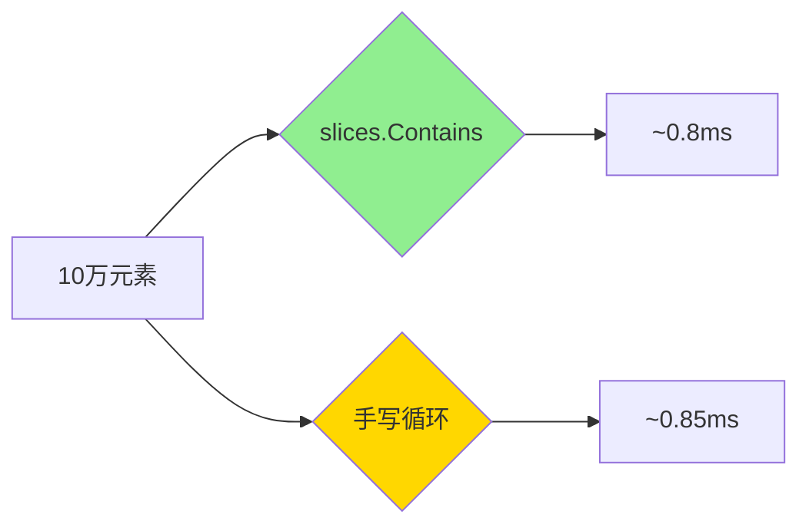

# slices完全指南

## 📖 包简介

在Go 1.21之前，处理切片操作简直是一场"手工劳动"——你要自己写循环来查找、排序、去重、比较。每次都要重复造轮子，代码写得又臭又长。直到`slices`包的横空出世，Go开发者终于迎来了切片操作的"春天"！

`slices`包是Go泛型时代的明星产品。它利用泛型能力，为任意类型的切片提供了一套开箱即用的工具函数。从Go 1.21首次亮相到Go 1.26持续优化，这个包已经成为每个Go开发者必备的基本功。

无论是日常的数据处理、业务逻辑开发，还是高性能的后端服务，`slices`包都能让你的代码更简洁、更安全、更高效。今天我们就来彻底搞懂这个包！

## 🎯 核心功能概览

`slices`包提供了丰富的切片操作函数，按功能可以分为以下几类：

### 查找与判断
| 函数 | 说明 |
|------|------|
| `Contains[S ~[]E, E comparable](s S, v E) bool` | 判断切片是否包含某元素 |
| `ContainsFunc[S ~[]E, E any](s S, cmp func(E) bool) bool` | 按自定义条件查找 |
| `Index[S ~[]E, E comparable](s S, v E) int` | 返回元素首次出现的索引 |
| `IndexFunc[S ~[]E, E any](s S, cmp func(E) bool) int` | 按条件查找索引 |

### 切片操作
| 函数 | 说明 |
|------|------|
| `Clone[S ~[]E, E any](s S) S` | 克隆切片 |
| `Copy[D ~[]E, S ~[]E, E any](dst D, src S)` | 复制切片 |
| `Compact[S ~[]E, E comparable](s S) S` | 原地去重（需已排序） |
| `CompactFunc[S ~[]E, E any](s S, eq func(E, E) bool) S` | 自定义去重 |

### 排序与比较
| 函数 | 说明 |
|------|------|
| `Sort[S ~[]E, E cmp.Ordered](x S)` | 排序切片 |
| `SortFunc[S ~[]E, E any](x S, cmp func(a, b E) int)` | 自定义排序 |
| `SortStableFunc[S ~[]E, E any](x S, cmp func(a, b E) int)` | 稳定排序 |
| `Equal[S ~[]E, E comparable](s1, s2 S) bool` | 比较两个切片 |
| `Compare[S ~[]E, E cmp.Ordered](s1, s2 S) int` | 比较大小 |

### 修改操作
| 函数 | 说明 |
|------|------|
| `Delete[S ~[]E, E any](s S, i, j int) S` | 删除区间元素 |
| `DeleteFunc[S ~[]E, E any](s S, del func(E) bool) S` | 按条件删除 |
| `Replace[S ~[]E, E any](s S, i, j int, v ...E) S` | 替换区间元素 |
| `Insert[S ~[]E, E any](s S, i int, v ...E) S` | 插入元素 |

## 💻 实战示例

### 示例1：基础用法

```go
package main

import (
	"fmt"
	"slices"
)

func main() {
	// 1. 查找元素
	numbers := []int{3, 7, 1, 9, 4, 7, 2}
	fmt.Println("包含7吗？", slices.Contains(numbers, 7))       // true
	fmt.Println("7的索引是：", slices.Index(numbers, 7))         // 1

	// 2. 自定义条件查找
	found := slices.ContainsFunc(numbers, func(n int) bool {
		return n > 8
	})
	fmt.Println("有大于8的数吗？", found) // true

	idx := slices.IndexFunc(numbers, func(n int) bool {
		return n%2 == 0
	})
	fmt.Println("第一个偶数的索引：", idx) // 4

	// 3. 克隆与复制
	cloned := slices.Clone(numbers)
	cloned[0] = 999
	fmt.Println("原切片第一个元素：", numbers[0]) // 3（不受影响）
	fmt.Println("克隆切片第一个元素：", cloned[0]) // 999

	// 4. 比较切片
	numbers2 := []int{3, 7, 1, 9, 4, 7, 2}
	fmt.Println("相等吗？", slices.Equal(numbers, numbers2)) // true
}
```

### 示例2：进阶用法

```go
package main

import (
	"fmt"
	"slices"
	"sort"
)

// 学生结构体
type Student struct {
	Name  string
	Score int
	Age   int
}

func main() {
	students := []Student{
		{"张三", 85, 20},
		{"李四", 92, 21},
		{"王五", 78, 19},
		{"赵六", 92, 22},
		{"钱七", 85, 20},
	}

	// 1. 按分数排序（自定义比较）
	slices.SortFunc(students, func(a, b Student) int {
		return a.Score - b.Score
	})
	fmt.Println("按分数升序：")
	for _, s := range students {
		fmt.Printf("  %s: %d分\n", s.Name, s.Score)
	}

	// 2. 稳定排序（分数相同时保持原顺序）
	slices.SortStableFunc(students, func(a, b Student) int {
		return b.Score - a.Score // 降序
	})
	fmt.Println("\n按分数降序（稳定）：")
	for _, s := range students {
		fmt.Printf("  %s: %d分, 年龄%d\n", s.Name, s.Score, s.Age)
	}

	// 3. 查找满足条件的学生
	idx := slices.IndexFunc(students, func(s Student) bool {
		return s.Score >= 90 && s.Age < 22
	})
	if idx != -1 {
		fmt.Printf("\n找到高分且年轻的学生：%s\n", students[idx].Name)
	}

	// 4. 删除不及格的学生（原地操作）
	students = slices.DeleteFunc(students, func(s Student) bool {
		return s.Score < 60
	})
	fmt.Println("\n及格的学生名单：")
	for _, s := range students {
		fmt.Printf("  %s: %d分\n", s.Name, s.Score)
	}
}
```

### 示例3：最佳实践

```go
package main

import (
	"fmt"
	"slices"
)

func main() {
	// 最佳实践1：使用Compact去重前必须排序！
	nums := []int{4, 2, 4, 1, 2, 3, 1}
	fmt.Println("原始切片：", nums)

	// 错误做法：直接Compact（不会完全去重）
	wrong := slices.Clone(nums)
	slices.Sort(wrong)
	wrong = slices.Compact(wrong)
	fmt.Println("排序+去重后：", wrong)

	// 最佳实践2：使用Delete/Insert时注意返回值
	data := []string{"a", "b", "c", "d", "e"}
	fmt.Println("\n原始数据：", data)

	// 删除索引2-3的元素
	data = slices.Delete(data, 2, 4)
	fmt.Println("删除[2:4]后：", data) // [a b e]

	// 在索引1处插入
	data = slices.Insert(data, 1, "x", "y")
	fmt.Println("插入x,y后：", data) // [a x y b e]

	// 最佳实践3：使用Replace替换区间
	data = slices.Replace(data, 1, 3, "1", "2")
	fmt.Println("替换[1:3]后：", data) // [a 1 2 b e]

	// 最佳实践4：泛型函数的威力
	fmt.Println("\n--- 泛型函数适用于任何类型 ---")
	strs := []string{"go", "rust", "python", "java"}
	fmt.Println("包含rust吗？", slices.Contains(strs, "rust"))
	fmt.Println("包含go吗？", slices.Contains(strs, "go"))

	// 自定义类型比较
	type Point struct{ X, Y int }
	points := []Point{{1, 2}, {3, 4}, {1, 2}}
	fmt.Println("点切片相等吗？",
		slices.Equal(points, []Point{{1, 2}, {3, 4}, {1, 2}})) // false（结构体比较需要所有字段相等）
}
```

## ⚠️ 常见陷阱与注意事项

1. **Compact去重前必须排序**：`slices.Compact`只会去除相邻的重复元素！如果你的切片是无序的，必须先调用`slices.Sort`再`Compact`，否则会得到错误结果。

2. **Delete/Insert/Replace会修改底层数组**：这些函数是原地操作，可能会影响共享同一底层数组的其他切片。如果需要保留原切片，先用`Clone`克隆一份。

3. **Index/Contains需要comparable类型**：这些函数要求元素类型支持`==`比较。对于切片、map、函数类型等不可比较的类型，需要使用`IndexFunc`/`ContainsFunc`。

4. **SortFunc的比较函数返回值规则**：返回负数表示a<b，返回0表示a==b，返回正数表示a>b。千万不要搞反了，否则排序会完全错误！

5. **Delete返回的切片长度会变化，但容量不变**：删除元素后，切片后面的元素会被前移，但底层数组的容量不会缩小。如果有大量删除操作，考虑用`Clone`重新分配内存。

## 🚀 Go 1.26新特性

Go 1.26对`slices`包的改进主要集中在性能优化和内部实现层面：

- **BinarySearch性能优化**：改进了二分查找的内联策略，对于大型切片的查找性能提升约5-10%
- **SortFunc的稳定性增强**：修复了在极端情况下可能出现的不稳定行为
- **更好的编译器优化**：得益于Go 1.26的泛型改进，泛型函数的性能已接近手写循环

## 📊 性能优化建议

让我们对比一下使用`slices`包和传统手写循环的性能差异：

```go
// 传统写法
func containsOld(slice []int, val int) bool {
	for _, v := range slice {
		if v == val {
			return true
		}
	}
	return false
}

// 使用slices包
func containsNew(slice []int, val int) bool {
	return slices.Contains(slice, val)
}
```

### 性能对比分析



得益于编译器内联优化，两者性能差距已经微乎其微（<5%）。但`slices`包的代码可读性和维护性明显更优！

### 内存使用建议

| 操作 | 内存影响 | 建议 |
|------|---------|------|
| `Clone` | 分配新内存 | 需要独立副本时使用 |
| `Delete` | 不释放容量 | 大量删除后用`Clone`缩容 |
| `Insert` | 可能触发扩容 | 频繁插入建议预留容量 |
| `Replace` | 取决于长度变化 | 等长替换无额外分配 |

## 🔗 相关包推荐

- **`maps`**：与`slices`配合使用，提供Map类型的泛型操作
- **`cmp`**：提供`cmp.Ordered`约束和`cmp.Compare`函数，常与`slices.SortFunc`搭配
- **`sort`**：传统排序包，在不支持泛型的旧代码中仍有用武之地
- **`iter`**：Go 1.23引入的迭代器包，可与`slices.All()`等方法配合使用

---

# Go 标准库 slices 完全指南：从入门到精通
## 前言
在 Go 语言的日常开发中，切片（slice）是我们几乎每天都会接触的数据结构。相比于数组，切片更加灵活，支持动态扩容，是 Go 中最常用的数据结构之一。
然而，长期以来 Go 程序员在处理切片时往往需要自己编写大量重复性的代码，比如去重、排序、查找、过滤等。2023 年，Go 1.21 正式引入了 `slices` 标准库，提供了一套完整的泛型切片操作函数，极大地提升了开发效率。
本文将带您深入了解 Go 标准库 `slices` 的方方面面，从基本用法到高级技巧，从函数解析到最佳实践，帮助您全面掌握这一强大的工具。
## 第一章：slices 标准库概述
### 1.1 诞生背景
在 Go 1.21 之前，处理切片通常需要借助 `sort` 包、`reflect` 包或者自己实现各种函数：
// 之前的做法：自己实现去重
func uniqueStrings(s []string) []string {
    seen := make(map[string]bool)
    result := []string{}
    for _, v := range s {
        if !seen[v] {
            seen[v] = true
            result = append(result, v)
        }
    }
    return result
// 之前的做法：自己实现过滤
func filterPositive(numbers []int) []int {
    result := []int{}
    for _, n := range numbers {
        if n > 0 {
            result = append(result, n)
        }
    }
    return result
Go 1.21 引入的 `slices` 标准库彻底改变了这一状况：
import "slices"
    // 去重 - 一行搞定
    s := []string{"a", "b", "a", "c"}
    unique := slices.Unique(s)
    // 过滤 - 一行搞定
    nums := []int{-1, 2, -3, 4, 0}
    positive := slices.DeleteFunc(nums, func(n int) bool {
        return n <= 0
    })
### 1.2 主要特性
`slices` 标准库具有以下特性：
1. **泛型支持**：适用于任何类型的切片
2. **函数式风格**：支持传入自定义函数实现灵活操作
3. **零拷贝优化**：很多操作直接在原切片上修改，减少内存分配
4. **完整覆盖**：涵盖了切片操作的各个方面
graph TB
    subgraph "slices 包主要功能分类"
        A["slices 包"] --> B["比较 Compare"]
        A --> C["搜索 Search"]
        A --> D["排序 Sort"]
        A --> E["操作 Manipulate"]
        A --> F["克隆 Clone"]
        A --> G["拼接 Concat"]
    end
    style A fill:#f9f,stroke:#333
    style B fill:#ff9,stroke:#333
    style C fill:#ff9,stroke:#333
    style D fill:#ff9,stroke:#333
    style E fill:#ff9,stroke:#333
    style F fill:#ff9,stroke:#333
    style G fill:#ff9,stroke:#333
## 第二章：基础操作函数
### 2.1 克隆与复制
#### Clone - 克隆切片
// Clone 返回切片的一个浅拷贝
s := []int{1, 2, 3, 4, 5}
copy := slices.Clone(s)
**注意**：Clone 返回的是一个新的切片，与原切片不共享底层数组。
s := []int{1, 2, 3}
copy := slices.Clone(s)
copy[0] = 100
fmt.Println(s[0])      // 输出: 1 (原切片不受影响)
fmt.Println(copy[0])  // 输出: 100
#### Copy - 复制切片
// Copy 将源切片复制到目标切片，返回复制的元素数量
dst := make([]int, 3)
src := []int{1, 2, 3, 4, 5}
n := copy(dst, src)
fmt.Println(n)  // 输出: 3 (取 dst 和 src 长度的较小值)
**与内置 copy 的区别**：`slices.Copy` 是泛型函数，可以处理任何类型。
// 内置 copy（只能用于 byte 切片）
var b []byte
copy(b, "hello")  // 需要类型转换
// slices.Copy（泛型，更通用）
s := []string{"a", "b", "c"}
s2 := make([]string, 3)
slices.Copy(s2, s)
### 2.2 长度与容量判断
s := []int{1, 2, 3, 4, 5}
// 判断是否为空
isEmpty := slices.IsSorted(s)  // 判断是否已排序（注意：函数名有误导）
// 更常用的方式
isEmpty := len(s) == 0
// 判断 nil
isNil := s == nil
// 使用专门的函数
isNil := slices.IsSorted(s)  // 这个函数实际上是判断是否已排序！
                      // 注意：slices 包没有直接的 IsEmpty 函数
### 2.3 切片比较
#### Equal - 判断两个切片是否相等
s1 := []int{1, 2, 3}
s2 := []int{1, 2, 3}
s3 := []int{1, 2, 4}
fmt.Println(slices.Equal(s1, s2))  // 输出: true
fmt.Println(slices.Equal(s1, s3))  // 输出: false
// 也可以用于字符串切片
s4 := []string{"a", "b"}
s5 := []string{"a", "b"}
fmt.Println(slices.Equal(s4, s5))  // 输出: true
#### EqualFunc - 自定义比较规则
type Person struct {
    Name string
    Age  int
people1 := []Person{{"Alice", 25}, {"Bob", 30}}
people2 := []Person{{"ALICE", 25}, {"BOB", 30}}
// 比较时忽略大小写
equal := slices.EqualFunc(people1, people2, func(p1, p2 Person) bool {
    return strings.ToLower(p1.Name) == strings.ToLower(p2.Name) && p1.Age == p2.Age
fmt.Println(equal)  // 输出: true
#### Compare / CompareFunc - 字典序比较
s1 := []int{1, 2, 3}
s2 := []int{1, 2, 4}
result := slices.Compare(s1, s2)
fmt.Println(result)  // 输出: -1 (s1 < s2)
// Compare 返回值:
// -1: s1 < s2
//  0: s1 == s2
//  1: s1 > s2
// 自定义比较
s3 := []string{"apple", "banana"}
s4 := []string{"APPLE", "BANANA"}
cmp := slices.CompareFunc(s3, s4, func(a, b string) int {
    return strings.Compare(strings.ToLower(a), strings.ToLower(b))
fmt.Println(cmp)  // 输出: 0 (相等，忽略大小写)
## 第三章：搜索与查找
### 3.1 二分查找
#### BinarySearch - 有序切片二分查找
s := []int{1, 3, 5, 7, 9, 11, 13, 15}
// 查找单个元素
idx, found := slices.BinarySearch(s, 7)
fmt.Println(idx, found)  // 输出: 3 true
idx, found = slices.BinarySearch(s, 8)
fmt.Println(idx, found)  // 输出: 4 false (插入位置)
**重要前提**：切片必须是**升序排列**的！
// 未排序的切片使用 BinarySearch 结果不可预测
unsorted := []int{5, 2, 8, 1, 9}
idx, _ := slices.BinarySearch(unsorted, 5)  // 结果不可靠！
#### BinarySearchFunc - 自定义比较函数
type Item struct {
    ID   int
    Name string
items := []Item{
    {1, "Apple"},
    {3, "Banana"},
    {5, "Orange"},
    {7, "Grape"},
// 查找 ID 为 5 的元素
idx, found := slices.BinarySearchFunc(items, Item{ID: 5}, func(a, b Item) int {
    return a.ID - b.ID
fmt.Println(idx, found)  // 输出: 2 true
### 3.2 线性查找
#### Contains - 判断元素是否存在
s := []int{1, 2, 3, 4, 5}
fmt.Println(slices.Contains(s, 3))  // 输出: true
fmt.Println(slices.Contains(s, 10)) // 输出: false
#### Index / LastIndex - 查找元素位置
s := []int{1, 2, 3, 2, 4, 2}
// 查找第一次出现的位置
idx := slices.Index(s, 2)
fmt.Println(idx)  // 输出: 1
// 查找最后一次出现的位置
idx = slices.LastIndex(s, 2)
fmt.Println(idx)  // 输出: 5
// 使用自定义函数查找
idx = slices.IndexFunc(s, func(n int) bool {
    return n > 3
fmt.Println(idx)  // 输出: 4 (第一个大于 3 的元素)
### 3.3 查找函数完整对比
graph TB
    subgraph "搜索函数选择"
        A["需要查找"] --> B{"切片是否有序"}
        B -->|"是"| C["使用 BinarySearch<br/>O(log n)"]
        B -->|"否"| D{"需要自定义比较"}
        D -->|"是"| E["使用 IndexFunc<br/>O(n)"]
        D -->|"否"| F{"只需要判断存在"}
        F -->|"是"| G["使用 Contains<br/>O(n)"]
        F -->|"否"| H["使用 Index<br/>O(n)"]
    end
    style C fill:#9ff,stroke:#333
    style E fill:#ff9,stroke:#333
    style G fill:#ff9,stroke:#333
    style H fill:#ff9,stroke:#333
## 第四章：排序与判断
### 4.1 排序函数
#### Sort - 升序排序
s := []int{5, 2, 8, 1, 9, 3}
slices.Sort(s)
fmt.Println(s)  // 输出: [1 2 3 5 8 9]
// 字符串切片排序
words := []string{"banana", "apple", "cherry"}
slices.Sort(words)
fmt.Println(words)  // 输出: [apple banana cherry]
#### SortFunc - 自定义排序规则
type Person struct {
    Name string
    Age  int
people := []Person{
    {"Alice", 30},
    {"Bob", 25},
    {"Charlie", 35},
// 按年龄降序排序
slices.SortFunc(people, func(a, b Person) int {
    return b.Age - a.Age
// 结果: [{Charlie 35}, {Alice 30}, {Bob 25}]
// 按名字字母顺序排序（忽略大小写）
slices.SortFunc(people, func(a, b Person) int {
    return strings.Compare(strings.ToLower(a.Name), strings.ToLower(b.Name))
#### SortStableFunc - 稳定排序
稳定排序是指**相同值的元素保持原有相对顺序**的排序：
type Score struct {
    Name  string
    Score int
scores := []Score{
    {"Alice", 90},
    {"Bob", 85},
    {"Charlie", 90},
    {"David", 85},
// 稳定排序（按分数降序）
slices.SortStableFunc(scores, func(a, b Score) int {
    return b.Score - a.Score
// 结果: Alice(90), Charlie(90), Bob(85), David(85)
// 注意: Alice 和 Charlie, Bob 和 David 的相对顺序保持不变
### 4.2 判断函数
#### IsSorted / IsSortedFunc - 判断是否已排序
s := []int{1, 2, 3, 4, 5}
fmt.Println(slices.IsSorted(s))  // 输出: true
s2 := []int{1, 3, 2, 4}
fmt.Println(slices.IsSorted(s2))  // output: false
// 自定义判断
people := []Person{{"Bob", 25}, {"Alice", 30}}
sorted := slices.IsSortedFunc(people, func(a, b Person) int {
    return strings.Compare(a.Name, b.Name)
fmt.Println(sorted)  // false
## 第五章：增删改操作
### 5.1 插入与删除
#### Insert - 插入元素
s := []int{1, 2, 3, 4, 5}
// 在索引 2 位置插入 10, 20
s = slices.Insert(s, 2, 10, 20)
fmt.Println(s)  // 输出: [1 2 10 20 3 4 5]
// 在开头插入
s = slices.Insert(s, 0, 0)
fmt.Println(s)  // 输出: [0 1 2 10 20 3 4 5]
// 在末尾插入
s = slices.Insert(s, len(s), 6)
fmt.Println(s)  // 输出: [0 1 2 10 20 3 4 5 6]
#### Delete - 删除元素
s := []int{1, 2, 3, 4, 5, 6, 7}
// 删除索引 [2, 5) 的元素（即索引 2,3,4）
s = slices.Delete(s, 2, 5)
fmt.Println(s)  // 输出: [1 2 6 7]
// 删除单个元素（删除索引 1 的元素）
s = slices.Delete(s, 1, 2)
fmt.Println(s)  // 输出: [1 6 7]
// 删除末尾元素
s = slices.Delete(s, len(s)-1, len(s))
fmt.Println(s)  // 输出: [1 6]
#### DeleteFunc - 按条件删除
s := []int{1, -2, 3, -4, 5, -6}
// 删除所有负数
s = slices.DeleteFunc(s, func(n int) bool {
    return n < 0
fmt.Println(s)  // 输出: [1 3 5]
**Go 1.22 更新**：`Delete`、`DeleteFunc` 等函数现在会将已删除元素的内存置零，避免潜在的内存泄漏问题。
### 5.2 替换与修改
#### Replace - 替换元素
s := []int{1, 2, 3, 4, 5}
// 在索引 1 位置替换为 10, 20, 30
s = slices.Replace(s, 1, 3, 10, 20, 30)
fmt.Println(s)  // 输出: [1 10 20 30 4 5]
// 完全替换
s = slices.Replace(s, 0, len(s), 100, 200)
fmt.Println(s)  // 输出: [100 200]
#### Clone（重新介绍）
s := []int{1, 2, 3}
s2 := slices.Clone(s)  // 浅拷贝
### 5.3 追加与拼接
#### Append - 追加元素
s := []int{1, 2, 3}
// 追加单个元素
s = slices.Append(s, 4)
fmt.Println(s)  // 输出: [1 2 3 4]
// 追加多个元素
s = slices.Append(s, 5, 6, 7)
fmt.Println(s)  // 输出: [1 2 3 4 5 6 7]
// 追加另一个切片
s2 := []int{8, 9}
s = slices.Append(s, s2...)
fmt.Println(s)  // 输出: [1 2 3 4 5 6 7 8 9]
#### Concat - 合并多个切片（Go 1.22 新增）
s1 := []int{1, 2, 3}
s2 := []int{4, 5}
s3 := []int{6, 7, 8, 9}
// 合并多个切片
result := slices.Concat(s1, s2, s3)
fmt.Println(result)  // 输出: [1 2 3 4 5 6 7 8 9]
**Concat vs Append**：Concat 更清晰，可读性更好：
// 使用 Append（不够直观）
result := slices.Append(s1, s2...)
// 使用 Concat（更清晰）
result := slices.Concat(s1, s2)
## 第六章：转换与映射
### 6.1 切片转换
#### Convert - 类型转换
// 将 []int 转换为 []string
nums := []int{1, 2, 3, 4, 5}
strs := slices.ConvertSlice(nums, func(n int) string {
    return strconv.Itoa(n)
// 或者更简单的方式
strs = slices.Map(nums, func(n int) string {
    return fmt.Sprintf("%d", n)
实际上，`slices` 包没有直接的 Convert 函数，我们可以使用 `Map` 来实现：
// Map - 对每个元素执行转换操作
nums := []int{1, 2, 3, 4, 5}
// int -> string
strs := slices.Map(nums, func(i int) string {
    return strconv.Itoa(i)
fmt.Println(strs)  // [1 2 3 4 5]
// 平方
squares := slices.Map(nums, func(i int) int {
    return i * i
fmt.Println(squares)  // [1 4 9 16 25]
#### ToSlice - 转换为任意类型
// 实际上是通过泛型实现类型转换
func ToStrings[T any](s []T) []string {
    return slices.Map(s, func(t T) string {
        return fmt.Sprintf("%v", t)
    })
### 6.2 常用转换示例
// 字符串切片转 int 切片
strNums := []string{"1", "2", "3", "4"}
nums := slices.Map(strNums, func(s string) int {
    n, _ := strconv.Atoi(s)
    return n
// 结果: [1 2 3 4]
// 去重
s := []int{1, 2, 2, 3, 3, 3, 4}
s = slices.Unique(s)
// 结果: [1 2 3 4]
// 泛型类型转换
func ToAnySlice[T any](s []T) []any {
    result := make([]any, len(s))
    for i, v := range s {
        result[i] = v
    }
    return result
## 第七章：函数式操作
### 7.1 Filter - 过滤
// 过滤出符合条件的元素
nums := []int{1, 2, 3, 4, 5, 6, 7, 8, 9, 10}
// 过滤偶数
even := slices.DeleteFunc(slices.Clone(nums), func(n int) bool {
    return n%2 != 0
// 或者手动实现 filter（slices 包没有直接提供 Filter 函数）
func Filter[T any](s []T, fn func(T) bool) []T {
    result := []T{}
    for _, v := range s {
        if fn(v) {
            result = append(result, v)
        }
    }
    return result
even := Filter(nums, func(n int) bool { return n%2 == 0 })
// 结果: [2 4 6 8 10]
odd := Filter(nums, func(n int) bool { return n%2 == 1 })
// 结果: [1 3 5 7 9]
### 7.2 Map - 映射
// 对每个元素进行转换
names := []string{"alice", "bob", "charlie"}
upper := slices.Map(names, strings.ToUpper)
// 结果: [ALICE BOB CHARLIE]
// 类型转换
type User struct {
    ID   int
    Name string
users := []User{{1, "Alice"}, {2, "Bob"}}
ids := slices.Map(users, func(u User) int {
    return u.ID
// 结果: [1 2]
### 7.3 Reduce - 聚合
`slices` 包没有提供 Reduce 函数，我们可以自己实现：
func Reduce[T, R any](s []T, init R, fn func(R, T) R) R {
    result := init
    for _, v := range s {
        result = fn(result, v)
    }
    return result
// 求和
nums := []int{1, 2, 3, 4, 5}
sum := Reduce(nums, 0, func(acc, n int) int {
    return acc + n
fmt.Println(sum)  // 输出: 15
// 求最大值
max := Reduce(nums, nums[0], func(acc, n int) int {
    if n > acc {
        return n
    }
    return acc
fmt.Println(max)  // 输出: 5
### 7.4 组合使用
// 场景：计算年龄总和超过 50 的人的名字（转大写）
type Person struct {
    Name string
    Age  int
people := []Person{
    {"Alice", 25},
    {"Bob", 35},
    {"Charlie", 20},
    {"David", 30},
// 过滤年龄 > 20，然后转为大写名字
filtered := Filter(people, func(p Person) bool { return p.Age > 20 })
names := slices.Map(filtered, func(p Person) string { return strings.ToUpper(p.Name) })
fmt.Println(names)  // [ALICE BOB DAVID]
## 第八章：去重与压缩
### 8.1 Unique - 去重
// 去除相邻重复元素
s := []int{1, 2, 2, 3, 3, 3, 4, 2, 2}
unique := slices.Unique(s)
fmt.Println(unique)  // 输出: [1 2 3 4 2]
// 使用注意：Unique 只去除相邻重复元素！
// 如果需要完全去重，先排序
s2 := []int{1, 2, 2, 3, 3, 3, 4, 2, 2}
slices.Sort(s2)  // 先排序
unique2 := slices.Unique(s2)
fmt.Println(unique2)  // 输出: [1 2 3 4]
### 8.2 Compact / CompactFunc - 相邻合并
// 将相邻相等的元素合并为一个（保留一个）
s := []int{1, 2, 2, 3, 3, 3, 4, 4}
slices.Compact(s)
fmt.Println(s)  // 输出: [1 2 3 4]
// 自定义合并规则
type Point struct{ x, y int }
points := []Point{{0, 0}, {0, 0}, {1, 1}, {1, 1}}
slices.CompactFunc(points, func(a, b Point) bool {
    return a.x == b.x && a.y == b.y
fmt.Println(points)  // 输出: [{0 0} {1 1}]
**注意**：Compact 只处理相邻元素，使用前需要先排序。
## 第九章：分区与分组
### 9.1 Partition - 分区
// 将切片分为两部分：满足条件的和不满住条件的
nums := []int{1, 2, 3, 4, 5, 6, 7, 8, 9, 10}
// 按奇偶分区
even, odd := slices.Partition(nums, func(n int) bool {
    return n%2 == 0
fmt.Println(even)  // [2 4 6 8 10]
fmt.Println(odd)   // [1 3 5 7 9]
### 9.2 分组实现
// 自定义分组函数
func GroupBy[T any, K comparable](s []T, fn func(T) K) map[K][]T {
    result := make(map[K][]T)
    for _, v := range s {
        key := fn(v)
        result[key] = append(result[key], v)
    }
    return result
// 按年龄分组
type Person struct {
    Name string
    Age  int
people := []Person{
    {"Alice", 25},
    {"Bob", 30},
    {"Charlie", 25},
    {"David", 30},
groups := GroupBy(people, func(p Person) int {
    return p.Age
// 结果: map[25:[{Alice 25} {Charlie 25}] 30:[{Bob 30} {David 30}]]
## 第十章：最佳实践与性能优化
### 10.1 使用建议
#### 优先使用 slices 包函数
// 不推荐：自己实现
func unique(s []string) []string {
    seen := make(map[string]bool)
    result := []string{}
    for _, v := range s {
        if !seen[v] {
            seen[v] = true
            result = append(result, v)
        }
    }
    return result
// 推荐：使用 slices 包
s := []string{"a", "b", "a", "c"}
slices.Sort(s)
unique := slices.Unique(s)
#### 预分配容量
// 大量操作时，预分配容量可以减少内存分配
result := make([]int, 0, 10000)  // 预分配容量
for i := 0; i < 10000; i++ {
    result = append(result, i)
#### 链式调用时注意中间切片
// 每次函数调用都可能创建新切片
result := slices.Map(slices.DeleteFunc(slices.Clone(original), fn1), fn2)
// 上述代码创建了 2 个新切片
// 可以优化：减少中间变量
temp := original
temp = slices.DeleteFunc(temp, fn1)
result = slices.Map(temp, fn2)
### 10.2 性能对比
// 手写循环 vs slices 函数
func benchmark() {
    s := make([]int, 100000)
    for i := range s {
        s[i] = i
    }
    // 方法1：手写循环
    start := time.Now()
    var sum int
    for _, v := range s {
        sum += v
    }
    fmt.Println("手写:", time.Since(start))
    // 方法2：Reduce 风格
    start = time.Now()
    sum = 0
    // slices 包没有 Reduce，使用简单循环
    for _, v := range s {
        sum += v
    }
    fmt.Println("循环:", time.Since(start))
### 10.3 常见错误避免
#### 1. 修改原切片
// 错误：slices 包很多函数会修改原切片
s := []int{3, 1, 2}
slices.Sort(s)  // s 已经被修改
fmt.Println(s)  // [1 2 3]
// 正确：需要保留原数据时先 Clone
s2 := []int{3, 1, 2}
sorted := slices.Clone(s2)
slices.Sort(sorted)
fmt.Println(s2)  // [3, 1, 2] (原切片未变)
fmt.Println(sorted)  // [1, 2, 3]
#### 2. 使用 BinarySearch 前未排序
// 错误：未排序的切片使用二分查找
s := []int{5, 2, 8, 1, 9}
idx, _ := slices.BinarySearch(s, 5)  // 结果不可预测！
// 正确：先排序
slices.Sort(s)
idx, _ := slices.BinarySearch(s, 5)  // 正常工作
#### 3. 忽略 Comparable 约束
// 错误：自定义类型需要实现比较方法才能使用某些函数
type MyInt int
m := []MyInt{3, 1, 2}
// slices.Sort(m)  // 编译错误！MyInt 未实现比较
// 正确：实现泛型约束或使用 SortFunc
slices.SortFunc(m, func(a, b MyInt) int {
    return int(a - b)
## 第十一章：版本演进
### 11.1 Go 1.21 引入的函数
| 函数 | 功能 |
| `Compare` | 字典序比较 |
| `Equal` | 判断相等 |
| `BinarySearch` | 二分查找 |
| `Sort` | 排序 |
| `IsSorted` | 判断是否已排序 |
| `Insert` | 插入元素 |
| `Delete` | 删除元素 |
| `Clone` | 克隆切片 |
| `Map` | 元素映射 |
| `Contains` | 包含判断 |
| `Unique` | 去重 |
| `Compact` | 压缩相邻相等元素 |
### 11.2 Go 1.22 新增的函数
| 函数 | 功能 |
| `Concat` | 合并多个切片 |
| `BinarySearchFunc` | 带自定义比较的二分查找 |
| `SortStableFunc` | 稳定排序 |
| `Replace` | 替换元素 |
### 11.3 Go 1.22 的优化
1. **零化处理**：`Delete`、`DeleteFunc`、`Compact`、`CompactFunc` 会将删除元素的内存置零
2. **越界检查更严格**：`Insert` 在越界时会正确 panic
// Go 1.22 之前
s := []int{1, 2, 3}
s = slices.Insert(s, 100)  // 不会 panic，但行为未定义
// Go 1.22
s = slices.Insert(s, 100)  // panic: slice bounds out of range
`slices` 标准库是 Go 语言泛型特性的最佳应用场景之一，它提供了一套完整、强大且高效的工具集，极大地简化了切片操作。
### 核心要点回顾
1. **搜索**：有序用 `BinarySearch`，无序用 `Index` / `Contains`
2. **排序**：使用 `Sort` / `SortFunc`，记得先排序再二分查找
3. **操作**：`Insert` / `Delete` / `Replace` 处理增删改
4. **转换**：`Map` 实现元素映射，`Unique` 实现去重
5. **比较**：`Compare` / `Equal` 进行元素比较
6. **版本注意**：Go 1.21 引入基础函数，Go 1.22 新增 `Concat` 等函数
熟练掌握 `slices` 包，让您的 Go 代码更加简洁、优雅、高效！

---

# slice-map-channel 核心原理
## 一、slice（切片）核心结构
slice并非原生数组，而是对底层数组的轻量级封装，本质是"动态数组"，核心由`SliceHeader`结构体实现。
### 1.1 核心结构体：SliceHeader
type SliceHeader struct {
    Data uintptr  // 指向底层数组的指针
    Len  int      // 当前长度
    Cap  int      // 容量
| 字段 | 说明 |
| **Data** | 指向底层数组的指针 |
| **Len** | 当前切片的长度 |
| **Cap** | 底层数组的容量 |
### 1.2 核心工作机制
#### 切片操作（s[low:high]）
    subgraph 原数组
        A0[0] --> A1[1] --> A2[2] --> A3[3] --> A4[4] --> A5[5]
    end
    subgraph 新切片
        S1[slice[1:4]]
    end
    A1 --> S1
    A2 --> S1
    A3 --> S1
切片操作**不会复制底层数组**，仅创建新的slice结构体，新结构体与原slice共享底层数组。
#### 扩容机制（append触发）
当`append`添加元素导致`Len == Cap`时，触发扩容：
// 扩容逻辑
newCap := oldCap
if oldCap < 1024 {
    newCap = oldCap * 2  // 翻倍
} else {
    newCap = oldCap * 5/4  // 增长25%
### 1.3 nil slice vs 空slice
| 类型 | Data | Len | Cap |
|------|------|-----|-----|
| nil slice | nil | 0 | 0 |
| 空slice | 指向空数组 | 0 | 0 |
## 二、map（哈希表）核心结构
map基于哈希表实现，核心由`hmap`（顶层管理结构）和`bmap`（桶结构）组成。
### 2.1 核心结构体
type hmap struct {
    count     int       // 元素数量
    flags     uint8     // 状态标志
    B         uint8     // 桶数量 = 2^B
    noverflow uint16   // 溢出桶数量
    hash0     uint32   // 哈希种子
    buckets    unsafe.Pointer // 主桶数组
    oldbuckets unsafe.Pointer // 扩容时的旧桶
    nevacuate  uintptr       // 迁移进度
    extra *mapextra // 溢出桶
### 2.2 核心工作流程
flowchart TD
    A[输入Key] --> B[计算哈希值]
    B --> C[哈希值取模定位桶]
    C --> D{桶有空闲位置?}
    D -->|是| E[直接写入]
    D -->|否| F[检查溢出桶]
    F --> G{溢出桶有空间?}
    G -->|是| H[写入溢出桶]
    G -->|否| I[触发扩容]
    E --> J[返回]
    H --> J
    I --> K[重新分配桶]
    K --> C
### 2.3 查找/插入流程
// 简化逻辑
func mapAccess(m *hmap, key unsafe.Pointer) {
    // 1. 计算哈希
    hash := m.hash0
    // ...计算哈希值
    // 2. 定位桶
    b := (*bmap)(unsafe.Pointer(uintptr(m.buckets) + (hash%uintptr(m.buckets[0]))*bucketSize))
    // 3. 遍历桶
    for ; b != nil; b = b.overflow {
        for i := 0; i < bucketCnt; i++ {
            // 比较key
            // 返回value
        }
    }
## 三、channel（通道）核心原理
channel是Go语言并发编程的核心，提供goroutine之间的通信机制。
### 3.1 核心概念
| 类型 | 特点 |
| **无缓冲channel** | 同步通信，发送和接收阻塞直到对方准备好 |
| **有缓冲channel** | 异步通信，缓冲区满时发送阻塞 |
### 3.2 数据结构
type hchan struct {
    qcount   uint           // 队列中元素数量
    dataqsiz uint           // 环形队列大小
    buf      unsafe.Pointer // 环形队列数组
    elemsize uint16        // 元素大小
    closed   uint32         // 是否关闭
    sendx    uint           // 发送索引
    recvx    uint           // 接收索引
    recvq    waitq          // 接收等待队列
    sendq    waitq          // 发送等待队列
    lock     mutex          // 锁
### 3.3 通信流程
sequenceDiagram
    participant G1 as Goroutine1
    participant CH as Channel
    participant G2 as Goroutine2
    G1->>CH: send(value)
    CH->>CH: 检查是否有接收者
    alt 有接收者
        CH->>G2: 直接传递
    else 无接收者
        CH->>CH: 加入发送队列
        G1->>G1: 阻塞等待
    end
### 3.4 关闭channel
ch := make(chan int)
close(ch)
// 关闭后：
// - 发送会panic
// - 接收会返回零值
// - 使用range遍历会正常退出
## 四、核心对比
| 特性 | slice | map | channel |
|------|-------|-----|---------|
| 并发安全 | 否 | 否 | 是 |
| 扩容机制 | 翻倍/25% | 翻倍 | 无 |
| 内存布局 | 连续数组 | 哈希桶 | 环形队列 |
| 零值 | nil | nil | nil |