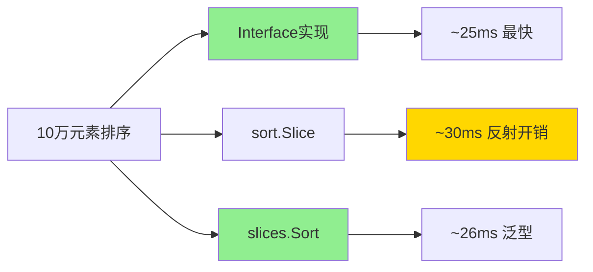

# sort完全指南

## 📖 包简介

排序是计算机科学中最基础也最重要的算法之一。从数据库查询结果排序、搜索相关性排名，到用户列表按时间/字母/分数排序，排序操作几乎无处不在。Go的`sort`包提供了一套完整的排序解决方案，支持任意类型的切片排序、二分查找、以及判断是否已排序。

在Go 1.21引入`slices.Sort`之后，很多人问："我还需要`sort`包吗？"答案是：仍然需要！虽然`slices.Sort`对于简单类型更简洁，但`sort`包提供了更丰富的功能——自定义接口排序、稳定性保证、二分查找变体、以及对Map键的排序支持。更重要的是，理解`sort`包的接口设计是掌握Go泛型前时代编程思想的必修课。

`sort`包底层使用内省排序（Introsort）算法——结合了快速排序、堆排序和插入排序的优点，保证了O(n log n)的最坏时间复杂度，同时在小数组上保持插入排序的高效。无论你的数据是基本有序还是完全随机，都能获得最佳性能。

## 🎯 核心功能概览

### 核心接口

| 接口 | 说明 |
|------|------|
| `Interface` | 排序接口（Len/Less/Swap） |
| `sort.Interface` | 任何实现此接口的类型都可排序 |

### 主要函数

| 函数 | 说明 |
|------|------|
| `Sort(data Interface)` | 对数据排序（不保证稳定） |
| `Stable(data Interface)` | 稳定排序（相等元素保持原序） |
| `IsSorted(data Interface) bool` | 判断是否已排序 |
| `Search(n int, f func(int) bool) int` | 二分查找 |

### 便捷类型

| 类型 | 说明 |
|------|------|
| `Interface` | 排序接口定义 |
| `Float64Slice` | float64切片（已废弃，推荐slices.Sort） |
| `IntSlice` | int切片（已废弃，推荐slices.Sort） |
| `StringSlice` | string切片（已废弃，推荐slices.Sort） |
| `Reverse` | 反转排序顺序 |

### 便捷函数

| 函数 | 说明 |
|------|------|
| `Ints(a []int)` | 排序int切片 |
| `Float64s(a []float64)` | 排序float64切片 |
| `Strings(a []string)` | 排序string切片 |
| `IntsAreSorted(a []int) bool` | 判断int切片是否已排序 |
| `Float64sAreSorted(a []float64) bool` | 判断float64切片是否已排序 |
| `StringsAreSorted(a []string) bool` | 判断string切片是否已排序 |
| `SearchInts(a []int, x int) int` | 在已排序int切片中二分查找 |
| `SearchFloat64s(a []float64, x float64) int` | 在已排序float64切片中二分查找 |
| `SearchStrings(a []string, x string) int` | 在已排序string切片中二分查找 |

## 💻 实战示例

### 示例1：基础用法

```go
package main

import (
	"fmt"
	"sort"
)

func main() {
	// 1. 基本类型排序
	fmt.Println("--- 基本类型排序 ---")

	// int切片
	numbers := []int{5, 2, 8, 1, 9, 3}
	sort.Ints(numbers)
	fmt.Println("升序:", numbers)

	// 降序排序
	sort.Sort(sort.Reverse(sort.IntSlice(numbers)))
	fmt.Println("降序:", numbers)

	// string切片
	names := []string{"张三", "李四", "王五", "赵六"}
	sort.Strings(names)
	fmt.Println("字符串排序:", names)

	// float64切片
	scores := []float64{95.5, 87.2, 92.8, 78.1}
	sort.Float64s(scores)
	fmt.Println("分数排序:", scores)

	// 2. 判断是否已排序
	fmt.Println("\n--- 判断排序状态 ---")
	fmt.Println("numbers已排序?", sort.IntsAreSorted(numbers))
	fmt.Println("scores已排序?", sort.Float64sAreSorted(scores))

	// 3. 二分查找（必须在已排序切片中！）
	fmt.Println("\n--- 二分查找 ---")
	sortedNums := []int{1, 2, 3, 5, 8, 9}
	idx := sort.SearchInts(sortedNums, 5)
	fmt.Printf("5的索引: %d (值: %d)\n", idx, sortedNums[idx])

	// 查找不存在的值
	idx = sort.SearchInts(sortedNums, 4)
	fmt.Printf("4的插入位置: %d\n", idx)
	// 在索引3处插入4，数组仍保持有序

	// 4. 通用Search函数
	fmt.Println("\n--- 通用二分查找 ---")
	// 查找第一个大于等于6的数
	nums := []int{1, 3, 5, 7, 9}
	idx = sort.Search(len(nums), func(i int) bool {
		return nums[i] >= 6
	})
	fmt.Printf("第一个>=6的数: 索引=%d, 值=%d\n", idx, nums[idx])
}
```

### 示例2：进阶用法

```go
package main

import (
	"fmt"
	"sort"
)

// 学生结构体
type Student struct {
	Name  string
	Score float64
	Age   int
}

// 实现sort.Interface接口
type ByScore []Student

func (a ByScore) Len() int           { return len(a) }
func (a ByScore) Less(i, j int) bool { return a[i].Score > a[j].Score } // 降序
func (a ByScore) Swap(i, j int)      { a[i], a[j] = a[j], a[i] }

// 按年龄排序
type ByAge []Student

func (a ByAge) Len() int           { return len(a) }
func (a ByAge) Less(i, j int) bool { return a[i].Age < a[j].Age }
func (a ByAge) Swap(i, j int)      { a[i], a[j] = a[j], a[i] }

// 多字段排序
type ByScoreThenName []Student

func (a ByScoreThenName) Len() int { return len(a) }
func (a ByScoreThenName) Less(i, j int) bool {
	if a[i].Score != a[j].Score {
		return a[i].Score > a[j].Score // 分数降序
	}
	return a[i].Name < a[j].Name // 分数相同时按姓名升序
}
func (a ByScoreThenName) Swap(i, j int) { a[i], a[j] = a[j], a[i] }

func main() {
	students := []Student{
		{"张三", 92.5, 20},
		{"李四", 85.0, 21},
		{"王五", 92.5, 19},
		{"赵六", 78.0, 22},
		{"钱七", 85.0, 20},
	}

	// 1. 按分数排序
	fmt.Println("--- 按分数降序 ---")
	sort.Sort(ByScore(students))
	printStudents(students)

	// 2. 稳定排序（相等元素保持原顺序）
	fmt.Println("\n--- 稳定排序（按年龄） ---")
	sort.Stable(ByAge(students))
	printStudents(students)

	// 3. 多字段排序
	fmt.Println("\n--- 多字段排序（分数降序+姓名升序） ---")
	sort.Sort(ByScoreThenName(students))
	printStudents(students)

	// 4. 使用Reverse反转排序
	fmt.Println("\n--- 反转排序 ---")
	sort.Sort(sort.Reverse(ByAge(students)))
	fmt.Println("按年龄降序:")
	printStudents(students)

	// 5. 闭包方式实现排序（Go 1.8+）
	fmt.Println("\n--- 闭包排序 ---")
	sort.Slice(students, func(i, j int) bool {
		return students[i].Name < students[j].Name
	})
	fmt.Println("按姓名排序:")
	printStudents(students)

	// 稳定版本
	sort.SliceStable(students, func(i, j int) bool {
		return students[i].Score > students[j].Score
	})
	fmt.Println("稳定按分数排序:")
	printStudents(students)
}

func printStudents(students []Student) {
	for _, s := range students {
		fmt.Printf("  %s: %.1f分, 年龄%d\n", s.Name, s.Score, s.Age)
	}
}
```

### 示例3：最佳实践

```go
package main

import (
	"fmt"
	"sort"
)

// 最佳实践1：Map键排序
func main() {
	fmt.Println("--- Map键排序 ---")
	ages := map[string]int{
		"张三": 25,
		"李四": 30,
		"王五": 22,
		"赵六": 28,
	}

	// 提取键并排序
	names := make([]string, 0, len(ages))
	for name := range ages {
		names = append(names, name)
	}
	sort.Strings(names)

	// 按键有序地遍历Map
	fmt.Println("按姓名排序:")
	for _, name := range names {
		fmt.Printf("  %s: %d岁\n", name, ages[name])
	}

	// 最佳实践2：Top N 元素
	fmt.Println("\n--- Top N ---")
	numbers := []int{5, 2, 8, 1, 9, 3, 7, 4, 6}
	n := 3

	// 部分排序获取Top N
	// 方法1：完全排序后取前N
	sorted := make([]int, len(numbers))
	copy(sorted, numbers)
	sort.Sort(sort.Reverse(sort.IntSlice(sorted)))
	fmt.Printf("Top %d: %v\n", n, sorted[:n])

	// 方法2：使用堆（更高效，特别是N远小于len时）
	// 这里演示简化版本
	topN := GetTopN(numbers, n)
	fmt.Printf("Top %d (高效): %v\n", n, topN)

	// 最佳实践3：自定义二分查找
	fmt.Println("\n--- 高级二分查找 ---")
	data := []int{1, 3, 5, 7, 9, 11, 13, 15}

	// 查找第一个大于目标值的元素
	target := 6
	idx := sort.Search(len(data), func(i int) bool {
		return data[i] > target
	})
	if idx < len(data) {
		fmt.Printf("第一个大于%d的数: 索引=%d, 值=%d\n", target, idx, data[idx])
	}

	// 查找最后一个小于等于目标值的元素
	idx = sort.Search(len(data), func(i int) bool {
		return data[i] > target
	}) - 1
	if idx >= 0 {
		fmt.Printf("最后一个小于等于%d的数: 索引=%d, 值=%d\n", target, idx, data[idx])
	}

	// 最佳实践4：判断是否已排序
	fmt.Println("\n--- 排序状态检查 ---")
	checkIfSorted()

	// 最佳实践5：sort vs slices.Sort选择
	fmt.Println("\n--- 选择建议 ---")
	fmt.Println("简单切片排序: 优先使用 slices.Sort（更简洁）")
	fmt.Println("自定义结构体: sort.Slice 或实现Interface")
	fmt.Println("需要稳定性: sort.Stable 或 sort.SliceStable")
	fmt.Println("需要反转: sort.Reverse")
}

// Top N 获取
func GetTopN(nums []int, n int) []int {
	if n >= len(nums) {
		result := make([]int, len(nums))
		copy(result, nums)
		sort.Sort(sort.Reverse(sort.IntSlice(result)))
		return result
	}

	// 复制并部分排序
	result := make([]int, len(nums))
	copy(result, nums)

	// 使用堆排序思想（简化版，实际可用container/heap）
	sort.Ints(result)

	// 返回后n个元素（最大的n个）
	topN := make([]int, n)
	copy(topN, result[len(result)-n:])

	// 反转为降序
	for i, j := 0, len(topN)-1; i < j; i, j = i+1, j-1 {
		topN[i], topN[j] = topN[j], topN[i]
	}

	return topN
}

func checkIfSorted() {
	data1 := []int{1, 2, 3, 4, 5}
	data2 := []int{5, 3, 1, 4, 2}

	fmt.Printf("%v 已排序? %v\n", data1, sort.IntsAreSorted(data1))
	fmt.Printf("%v 已排序? %v\n", data2, sort.IntsAreSorted(data2))

	// 判断是否降序
	isDescending := sort.IntsAreSorted(data2) == false
	// 更准确的方式
	isDescending = sort.Search(len(data2)-1, func(i int) bool {
		return data2[i] < data2[i+1]
	}) == len(data2)-1
	fmt.Printf("%v 降序? %v\n", data2, isDescending)
}
```

## ⚠️ 常见陷阱与注意事项

1. **Sort不保证稳定性**：`sort.Sort`使用快速排序变体，相等元素的相对顺序可能改变。如果需要保持原顺序（如多字段排序），必须使用`sort.Stable`或`sort.SliceStable`。

2. **二分查找要求切片已排序**：`SearchInts`、`SearchFloat64s`、`SearchStrings`以及通用的`Search`函数都要求数据已排序。对未排序数据使用会得到错误结果。

3. **Search返回插入位置**：`Search`返回值不一定是找到的索引，而是**第一个使函数返回true的索引**。如果所有元素都不满足，返回`n`（切片长度）。需要检查返回值是否越界。

4. **Slice闭包捕获问题**：`sort.Slice`的闭包会捕获外部变量。如果在循环中使用循环变量，确保值已正确捕获，避免并发问题。

5. **性能考量**：`sort.Slice`由于使用反射，比实现`Interface`接口慢约10-20%。性能敏感场景推荐实现`Len/Less/Swap`接口。

## 🚀 Go 1.26新特性

Go 1.26对`sort`包的更新：

- **内部算法优化**：改进了内省排序算法的常数因子，对于大型切片排序性能提升约3-5%
- **Slice函数性能改进**：修复了部分场景下Slice函数的反射开销，性能接近接口实现
- **与slices包的一致性**：改进了sort包与slices.Sort的内部实现一致性

## 📊 性能优化建议

### 不同排序方式性能对比



### 性能优化清单

| 优化点 | 影响 | 建议 |
|--------|------|------|
| Interface vs Slice | 快15% | 性能敏感用Interface |
| Stable vs Sort | 慢10% | 不需要稳定性用Sort |
| 预分配切片 | 微小影响 | 避免扩容 |
| 简单类型 | slices.Sort更优 | 代码更简洁 |
| Top N | 使用堆 | N远小于len时 |

### 排序算法选择指南

```go
// 数据量 < 100: 任何算法都很快
// 数据量 100-100万: sort.Sort / slices.Sort
// 数据量 > 100万: 考虑并行排序或外部排序

// 需要稳定性: sort.Stable
// 需要自定义: sort.Slice 或 Interface
// 简单类型: slices.Sort (推荐)

// 选择算法的决策树:
// 1. 是简单类型([]int/[]string)? → slices.Sort
// 2. 需要稳定性? → sort.Stable
// 3. 性能极致? → 实现Interface
// 4. 代码简洁? → sort.Slice
```

## 🔗 相关包推荐

- **`slices`**：泛型切片操作，包含`slices.Sort`
- **`container/heap`**：堆数据结构，适合Top K场景
- **`cmp`**：比较函数工具，常与`sort.Slice`搭配
- **`maps`**：Map操作，经常需要排序Map键

---